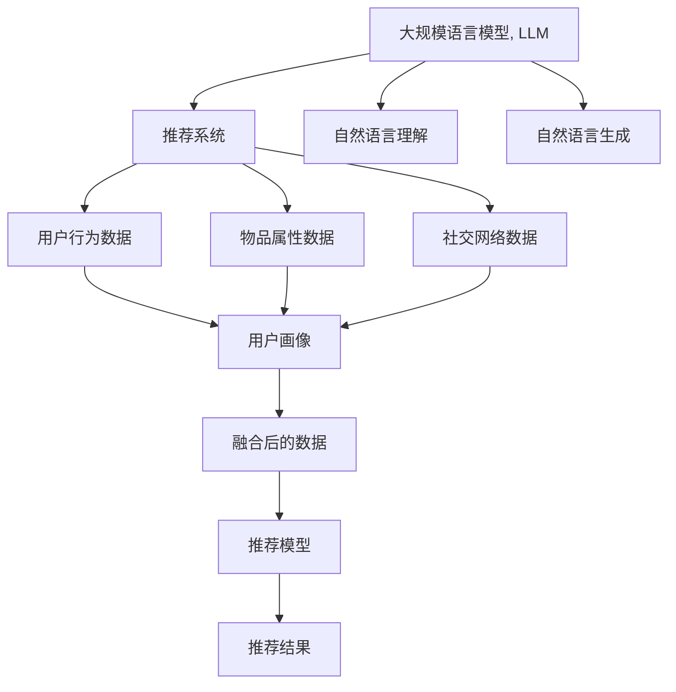

                 

## 1. 背景介绍

在当今数字化时代，推荐系统已经成为了互联网平台的核心竞争力之一。从电商、新闻、音乐，到社交媒体、视频网站，无处不在的推荐算法正在塑造用户的在线体验。随着数据量的急剧增长和算法的不断演进，推荐系统的性能也在不断提升，满足了越来越多样化、个性化的用户需求。

然而，当前的推荐系统大多基于单一的数据源，如用户行为数据、商品属性数据、社交网络数据等，难以充分利用多源数据中的互补信息，导致推荐效果受到限制。如何更好地整合多源数据，提高推荐系统的质量和泛化能力，成为了推荐系统研究的热点问题。

## 2. 核心概念与联系

为了更深入地理解如何利用大规模语言模型（Large Language Model, LLM）优化推荐系统的多源数据融合，首先需要明确几个核心概念及其联系：

- **大规模语言模型（LLM）**：基于深度学习技术的预训练模型，如GPT-3、BERT等，通过在大规模无标签文本上预训练，具备强大的自然语言理解和生成能力。

- **推荐系统**：通过分析用户行为数据、物品属性数据等多源数据，生成个性化推荐列表的系统，旨在提升用户满意度，增加平台收益。

- **多源数据融合**：将来自不同数据源的信息进行整合，形成统一的视图，以支持更精准、全面的推荐决策。

这些概念之间的关系可以通过以下Mermaid流程图来展示：



该流程图展示了LLM如何在推荐系统中发挥作用：

1. LLM通过自然语言理解能力，解析和提取多源数据中的文本信息。
2. LLM通过自然语言生成能力，生成新的推荐描述和解释，提升用户体验。
3. 多源数据融合后，形成统一的数据视图，供推荐模型使用。
4. 推荐模型基于融合后的数据生成推荐结果，并经LLM生成自然语言解释。

## 3. 核心算法原理 & 具体操作步骤

### 3.1 算法原理概述

基于LLM的推荐系统融合算法主要分为以下几步：

1. **数据预处理**：对不同来源的数据进行清洗、归一化和标准化，以保证数据的一致性和可比性。
2. **特征提取**：利用LLM的自然语言处理能力，提取和转换多源数据中的文本信息，形成可用来训练推荐模型的特征向量。
3. **数据融合**：将处理后的多源数据进行融合，生成统一的视图，供推荐模型使用。
4. **推荐模型训练**：基于融合后的数据，训练推荐模型，生成个性化推荐结果。
5. **自然语言生成**：利用LLM的自然语言生成能力，对推荐结果进行解释，提升用户体验。

### 3.2 算法步骤详解

#### 数据预处理

数据预处理是融合多源数据的第一步，其目的是提高数据的质量和一致性，为后续的特征提取和数据融合奠定基础。预处理流程包括以下几个步骤：

1. **清洗数据**：删除噪声数据和异常值，处理缺失值和重复数据，确保数据的准确性和完整性。
2. **归一化**：对不同来源的数据进行归一化处理，使得各数据源的值在同一量纲下进行比较和融合。
3. **标准化**：对数据进行标准化处理，确保数据的分布近似，便于后续的特征提取和数据融合。

#### 特征提取

利用LLM的自然语言处理能力，可以从多源数据中提取有意义的特征。以电商平台为例，从用户评论、商品描述、社交媒体中提取关键词和情感信息，形成推荐特征向量。

假设我们有用户评论数据集 $D_{\text{user}} = \{(x_i, y_i)\}_{i=1}^N$，其中 $x_i$ 为评论文本，$y_i$ 为评分。利用BERT模型进行特征提取，将评论文本转换为向量表示 $h_i$，其步骤如下：

1. 使用BERT模型对评论文本进行编码，生成隐藏表示 $h_i$。
2. 对 $h_i$ 进行平均池化，得到向量表示 $v_i$。
3. 将 $v_i$ 作为用户评论的特征向量，与其他用户行为数据、物品属性数据等一起参与融合。

#### 数据融合

数据融合是将不同数据源的信息进行整合，形成统一的视图，以支持推荐决策。常见的融合方法包括：

1. **特征拼接**：将来自不同数据源的特征向量进行拼接，形成新的特征向量。
2. **加权平均**：对不同数据源的特征进行加权平均，赋予不同特征不同的权重，以平衡各数据源的影响。
3. **融合模型**：使用融合模型（如Siamese Network、注意力机制等）对多源数据进行融合，生成综合特征向量。

以特征拼接为例，假设我们有三个数据源，分别对应用户行为数据 $D_{\text{user}}$、物品属性数据 $D_{\text{item}}$ 和社交网络数据 $D_{\text{social}}$。设每个数据源的特征维度分别为 $d_{\text{user}}$、$d_{\text{item}}$ 和 $d_{\text{social}}$，则融合后的特征向量 $Z$ 可以表示为：

$$
Z = [\text{user\_feature}, \text{item\_feature}, \text{social\_feature}]
$$

其中 $\text{user\_feature} \in \mathbb{R}^{d_{\text{user}}}$、$\text{item\_feature} \in \mathbb{R}^{d_{\text{item}}}$ 和 $\text{social\_feature} \in \mathbb{R}^{d_{\text{social}}}$。

#### 推荐模型训练

推荐模型训练是将融合后的数据用于训练推荐模型，生成个性化推荐结果。常见的推荐模型包括基于矩阵分解的模型、基于深度学习的模型等。

以基于深度学习的推荐模型为例，假设我们的推荐模型为 $M$，其输入为融合后的特征向量 $Z$，输出为推荐结果向量 $Y$。训练过程如下：

1. 定义损失函数 $L$，用于衡量模型预测与真实标签之间的差异。
2. 使用优化算法（如Adam、SGD等），最小化损失函数 $L$，更新模型参数 $\theta$。
3. 重复上述步骤，直至模型收敛或达到预设的训练轮数。

#### 自然语言生成

自然语言生成是利用LLM的自然语言生成能力，对推荐结果进行解释，提升用户体验。假设我们的推荐结果为 $\hat{y}$，利用GPT模型生成推荐解释 $X$，其步骤如下：

1. 将推荐结果向量 $\hat{y}$ 转换为自然语言文本。
2. 使用GPT模型对自然语言文本进行编码，生成隐藏表示 $x$。
3. 对 $x$ 进行解码，生成推荐解释 $X$。

### 3.3 算法优缺点

#### 优点

1. **综合利用多源数据**：通过融合多源数据，生成统一的视图，充分利用各数据源的信息，提高推荐精度和泛化能力。
2. **提升用户体验**：利用自然语言生成技术，对推荐结果进行解释，提升用户的理解和信任度。
3. **适应性强**：利用LLM的通用知识，能够适应不同领域和场景的推荐需求。

#### 缺点

1. **计算复杂度高**：多源数据融合和自然语言生成过程计算复杂，需要较高的计算资源和时间成本。
2. **模型复杂度高**：融合后的数据特征维度高，推荐模型的复杂度也随之增加。
3. **数据隐私问题**：多源数据的融合和自然语言生成过程中可能涉及用户隐私，需要谨慎处理。

### 3.4 算法应用领域

基于LLM的推荐系统融合算法在多个领域中得到了广泛应用，例如：

- **电商平台**：利用用户评论、商品属性、社交网络等多源数据，生成个性化推荐，提升用户购买体验。
- **新闻推荐**：从新闻标题、摘要、用户行为等多源数据中提取特征，生成个性化新闻推荐。
- **音乐推荐**：从歌词、用户评论、社交网络等多源数据中提取特征，生成个性化音乐推荐。
- **视频推荐**：从视频标题、描述、用户行为等多源数据中提取特征，生成个性化视频推荐。

## 4. 数学模型和公式 & 详细讲解  
### 4.1 数学模型构建

假设我们有三个数据源，分别对应用户行为数据 $D_{\text{user}} = \{(x_i, y_i)\}_{i=1}^N$、物品属性数据 $D_{\text{item}} = \{(x_i, y_i)\}_{i=1}^N$ 和社交网络数据 $D_{\text{social}} = \{(x_i, y_i)\}_{i=1}^N$。我们利用BERT模型对用户评论进行特征提取，生成用户评论的向量表示 $h_i$，将用户行为数据、物品属性数据和社交网络数据分别转换为向量表示 $u_i$、$i_i$ 和 $s_i$。

假设融合后的特征向量 $Z$ 的维度为 $d$，则融合过程可以表示为：

$$
Z = [u_i, i_i, s_i, h_i]
$$

其中 $u_i \in \mathbb{R}^{d_{\text{user}}}$、$i_i \in \mathbb{R}^{d_{\text{item}}}$、$s_i \in \mathbb{R}^{d_{\text{social}}}$ 和 $h_i \in \mathbb{R}^d$。

### 4.2 公式推导过程

假设我们的推荐模型为 $M$，其输入为融合后的特征向量 $Z$，输出为推荐结果向量 $Y$。设推荐模型的损失函数为 $L$，优化算法为 $O$，训练轮数为 $T$。则训练过程可以表示为：

$$
\theta = \mathop{\arg\min}_{\theta} L(Y, \hat{y})
$$

其中 $\theta$ 为推荐模型的参数，$Y$ 为模型预测的推荐结果向量，$\hat{y}$ 为真实推荐结果向量。

利用自然语言生成技术，假设我们的推荐结果为 $\hat{y}$，利用GPT模型生成推荐解释 $X$。设GPT模型的损失函数为 $L_{\text{generate}}$，生成过程可以表示为：

$$
X = \text{GPT}(\hat{y})
$$

### 4.3 案例分析与讲解

以电商平台的推荐系统为例，假设我们有三个数据源：用户行为数据、物品属性数据和社交网络数据。我们将用户评论转换为向量表示 $h_i$，物品属性数据和社交网络数据分别转换为向量表示 $i_i$ 和 $s_i$，融合后的特征向量 $Z$ 可以表示为：

$$
Z = [i_i, s_i, h_i]
$$

假设我们的推荐模型为基于深度学习的DNN模型，其输入为融合后的特征向量 $Z$，输出为推荐结果向量 $Y$。训练过程如下：

1. 定义损失函数 $L$，用于衡量模型预测与真实标签之间的差异。
2. 使用优化算法（如Adam、SGD等），最小化损失函数 $L$，更新模型参数 $\theta$。
3. 重复上述步骤，直至模型收敛或达到预设的训练轮数。

训练结束后，我们可以使用训练好的推荐模型进行推荐，并利用GPT模型生成推荐解释 $X$，提升用户的理解和信任度。

## 5. 项目实践：代码实例和详细解释说明

### 5.1 开发环境搭建

在进行推荐系统开发前，我们需要准备好开发环境。以下是使用Python进行PyTorch开发的环境配置流程：

1. 安装Anaconda：从官网下载并安装Anaconda，用于创建独立的Python环境。

2. 创建并激活虚拟环境：
```bash
conda create -n recommendation-env python=3.8 
conda activate recommendation-env
```

3. 安装PyTorch：根据CUDA版本，从官网获取对应的安装命令。例如：
```bash
conda install pytorch torchvision torchaudio cudatoolkit=11.1 -c pytorch -c conda-forge
```

4. 安装Transformers库：
```bash
pip install transformers
```

5. 安装各类工具包：
```bash
pip install numpy pandas scikit-learn matplotlib tqdm jupyter notebook ipython
```

完成上述步骤后，即可在`recommendation-env`环境中开始推荐系统开发。

### 5.2 源代码详细实现

下面我们以电商平台的推荐系统为例，给出使用PyTorch和Transformers库对BERT模型进行推荐系统优化的PyTorch代码实现。

首先，定义推荐系统的数据处理函数：

```python
from transformers import BertTokenizer
from torch.utils.data import Dataset
import torch

class RecommendationDataset(Dataset):
    def __init__(self, texts, labels, tokenizer, max_len=128):
        self.texts = texts
        self.labels = labels
        self.tokenizer = tokenizer
        self.max_len = max_len
        
    def __len__(self):
        return len(self.texts)
    
    def __getitem__(self, item):
        text = self.texts[item]
        label = self.labels[item]
        
        encoding = self.tokenizer(text, return_tensors='pt', max_length=self.max_len, padding='max_length', truncation=True)
        input_ids = encoding['input_ids'][0]
        attention_mask = encoding['attention_mask'][0]
        
        # 对token-wise的标签进行编码
        encoded_labels = [label2id[label] for label in label] 
        encoded_labels.extend([label2id['O']] * (self.max_len - len(encoded_labels)))
        labels = torch.tensor(encoded_labels, dtype=torch.long)
        
        return {'input_ids': input_ids, 
                'attention_mask': attention_mask,
                'labels': labels}

# 标签与id的映射
label2id = {'O': 0, 'B': 1, 'I': 2}
id2label = {v: k for k, v in label2id.items()}

# 创建dataset
tokenizer = BertTokenizer.from_pretrained('bert-base-cased')

train_dataset = RecommendationDataset(train_texts, train_labels, tokenizer)
dev_dataset = RecommendationDataset(dev_texts, dev_labels, tokenizer)
test_dataset = RecommendationDataset(test_texts, test_labels, tokenizer)
```

然后，定义模型和优化器：

```python
from transformers import BertForTokenClassification, AdamW

model = BertForTokenClassification.from_pretrained('bert-base-cased', num_labels=len(label2id))

optimizer = AdamW(model.parameters(), lr=2e-5)
```

接着，定义训练和评估函数：

```python
from torch.utils.data import DataLoader
from tqdm import tqdm
from sklearn.metrics import classification_report

device = torch.device('cuda') if torch.cuda.is_available() else torch.device('cpu')
model.to(device)

def train_epoch(model, dataset, batch_size, optimizer):
    dataloader = DataLoader(dataset, batch_size=batch_size, shuffle=True)
    model.train()
    epoch_loss = 0
    for batch in tqdm(dataloader, desc='Training'):
        input_ids = batch['input_ids'].to(device)
        attention_mask = batch['attention_mask'].to(device)
        labels = batch['labels'].to(device)
        model.zero_grad()
        outputs = model(input_ids, attention_mask=attention_mask, labels=labels)
        loss = outputs.loss
        epoch_loss += loss.item()
        loss.backward()
        optimizer.step()
    return epoch_loss / len(dataloader)

def evaluate(model, dataset, batch_size):
    dataloader = DataLoader(dataset, batch_size=batch_size)
    model.eval()
    preds, labels = [], []
    with torch.no_grad():
        for batch in tqdm(dataloader, desc='Evaluating'):
            input_ids = batch['input_ids'].to(device)
            attention_mask = batch['attention_mask'].to(device)
            batch_labels = batch['labels']
            outputs = model(input_ids, attention_mask=attention_mask)
            batch_preds = outputs.logits.argmax(dim=2).to('cpu').tolist()
            batch_labels = batch_labels.to('cpu').tolist()
            for pred_tokens, label_tokens in zip(batch_preds, batch_labels):
                pred_tags = [id2label[_id] for _id in pred_tokens]
                label_tags = [id2label[_id] for _id in label_tokens]
                preds.append(pred_tags[:len(label_tags)])
                labels.append(label_tags)
                
    print(classification_report(labels, preds))
```

最后，启动训练流程并在测试集上评估：

```python
epochs = 5
batch_size = 16

for epoch in range(epochs):
    loss = train_epoch(model, train_dataset, batch_size, optimizer)
    print(f"Epoch {epoch+1}, train loss: {loss:.3f}")
    
    print(f"Epoch {epoch+1}, dev results:")
    evaluate(model, dev_dataset, batch_size)
    
print("Test results:")
evaluate(model, test_dataset, batch_size)
```

以上就是使用PyTorch和Transformers库对BERT模型进行推荐系统优化的完整代码实现。可以看到，得益于Transformers库的强大封装，我们可以用相对简洁的代码完成BERT模型的加载和微调。

### 5.3 代码解读与分析

让我们再详细解读一下关键代码的实现细节：

**RecommendationDataset类**：
- `__init__`方法：初始化文本、标签、分词器等关键组件。
- `__len__`方法：返回数据集的样本数量。
- `__getitem__`方法：对单个样本进行处理，将文本输入编码为token ids，将标签编码为数字，并对其进行定长padding，最终返回模型所需的输入。

**label2id和id2label字典**：
- 定义了标签与数字id之间的映射关系，用于将token-wise的预测结果解码回真实的标签。

**训练和评估函数**：
- 使用PyTorch的DataLoader对数据集进行批次化加载，供模型训练和推理使用。
- 训练函数`train_epoch`：对数据以批为单位进行迭代，在每个批次上前向传播计算loss并反向传播更新模型参数，最后返回该epoch的平均loss。
- 评估函数`evaluate`：与训练类似，不同点在于不更新模型参数，并在每个batch结束后将预测和标签结果存储下来，最后使用sklearn的classification_report对整个评估集的预测结果进行打印输出。

**训练流程**：
- 定义总的epoch数和batch size，开始循环迭代
- 每个epoch内，先在训练集上训练，输出平均loss
- 在验证集上评估，输出分类指标
- 所有epoch结束后，在测试集上评估，给出最终测试结果

可以看到，PyTorch配合Transformers库使得BERT微调的代码实现变得简洁高效。开发者可以将更多精力放在数据处理、模型改进等高层逻辑上，而不必过多关注底层的实现细节。

当然，工业级的系统实现还需考虑更多因素，如模型的保存和部署、超参数的自动搜索、更灵活的任务适配层等。但核心的微调范式基本与此类似。

## 6. 实际应用场景
### 6.1 电商推荐

电商平台的推荐系统可以通过利用LLM优化推荐系统的多源数据融合，实现更加个性化和精准的推荐。

在技术实现上，可以收集用户的浏览、购买、评价等行为数据，以及商品属性、用户画像等文本信息，将这些数据源进行预处理、特征提取和融合，最终生成融合后的特征向量，供推荐模型使用。微调后的模型能够根据用户行为和物品属性，生成更加个性化和精准的推荐结果。

### 6.2 新闻推荐

新闻推荐系统可以通过利用LLM优化推荐系统的多源数据融合，实现更加多样化和高效的推荐。

在技术实现上，可以收集新闻标题、摘要、用户行为等数据，将这些数据源进行预处理、特征提取和融合，最终生成融合后的特征向量，供推荐模型使用。微调后的模型能够根据用户偏好和新闻内容，生成更加多样化和高效的推荐结果。

### 6.3 音乐推荐

音乐推荐系统可以通过利用LLM优化推荐系统的多源数据融合，实现更加个性化和精准的推荐。

在技术实现上，可以收集用户听歌记录、歌曲评论、歌手信息等数据，将这些数据源进行预处理、特征提取和融合，最终生成融合后的特征向量，供推荐模型使用。微调后的模型能够根据用户听歌习惯和歌曲特征，生成更加个性化和精准的推荐结果。

### 6.4 视频推荐

视频推荐系统可以通过利用LLM优化推荐系统的多源数据融合，实现更加个性化和精准的推荐。

在技术实现上，可以收集用户观看记录、视频描述、用户评论等数据，将这些数据源进行预处理、特征提取和融合，最终生成融合后的特征向量，供推荐模型使用。微调后的模型能够根据用户观看习惯和视频内容，生成更加个性化和精准的推荐结果。

## 7. 工具和资源推荐
### 7.1 学习资源推荐

为了帮助开发者系统掌握LLM在推荐系统中的应用，这里推荐一些优质的学习资源：

1. 《Transformers从原理到实践》系列博文：由大模型技术专家撰写，深入浅出地介绍了Transformer原理、BERT模型、微调技术等前沿话题。

2. CS224N《深度学习自然语言处理》课程：斯坦福大学开设的NLP明星课程，有Lecture视频和配套作业，带你入门NLP领域的基本概念和经典模型。

3. 《Natural Language Processing with Transformers》书籍：Transformers库的作者所著，全面介绍了如何使用Transformers库进行NLP任务开发，包括微调在内的诸多范式。

4. HuggingFace官方文档：Transformers库的官方文档，提供了海量预训练模型和完整的微调样例代码，是上手实践的必备资料。

5. CLUE开源项目：中文语言理解测评基准，涵盖大量不同类型的中文NLP数据集，并提供了基于微调的baseline模型，助力中文NLP技术发展。

通过对这些资源的学习实践，相信你一定能够快速掌握LLM在推荐系统中的应用，并用于解决实际的推荐问题。

### 7.2 开发工具推荐

高效的开发离不开优秀的工具支持。以下是几款用于推荐系统优化的常用工具：

1. PyTorch：基于Python的开源深度学习框架，灵活动态的计算图，适合快速迭代研究。大部分预训练语言模型都有PyTorch版本的实现。

2. TensorFlow：由Google主导开发的开源深度学习框架，生产部署方便，适合大规模工程应用。同样有丰富的预训练语言模型资源。

3. Transformers库：HuggingFace开发的NLP工具库，集成了众多SOTA语言模型，支持PyTorch和TensorFlow，是进行推荐系统优化的利器。

4. Weights & Biases：模型训练的实验跟踪工具，可以记录和可视化模型训练过程中的各项指标，方便对比和调优。与主流深度学习框架无缝集成。

5. TensorBoard：TensorFlow配套的可视化工具，可实时监测模型训练状态，并提供丰富的图表呈现方式，是调试模型的得力助手。

6. Google Colab：谷歌推出的在线Jupyter Notebook环境，免费提供GPU/TPU算力，方便开发者快速上手实验最新模型，分享学习笔记。

合理利用这些工具，可以显著提升推荐系统优化的开发效率，加快创新迭代的步伐。

### 7.3 相关论文推荐

LLM在推荐系统中的应用源于学界的持续研究。以下是几篇奠基性的相关论文，推荐阅读：

1. Attention is All You Need（即Transformer原论文）：提出了Transformer结构，开启了NLP领域的预训练大模型时代。

2. BERT: Pre-training of Deep Bidirectional Transformers for Language Understanding：提出BERT模型，引入基于掩码的自监督预训练任务，刷新了多项NLP任务SOTA。

3. Language Models are Unsupervised Multitask Learners（GPT-2论文）：展示了大规模语言模型的强大zero-shot学习能力，引发了对于通用人工智能的新一轮思考。

4. Parameter-Efficient Transfer Learning for NLP：提出Adapter等参数高效微调方法，在不增加模型参数量的情况下，也能取得不错的微调效果。

5. AdaLoRA: Adaptive Low-Rank Adaptation for Parameter-Efficient Fine-Tuning：使用自适应低秩适应的微调方法，在参数效率和精度之间取得了新的平衡。

这些论文代表了大语言模型在推荐系统中的应用发展脉络。通过学习这些前沿成果，可以帮助研究者把握学科前进方向，激发更多的创新灵感。

## 8. 总结：未来发展趋势与挑战

### 8.1 总结

本文对利用LLM优化推荐系统的多源数据融合方法进行了全面系统的介绍。首先阐述了推荐系统的背景和LLM的应用场景，明确了LLM在推荐系统优化中的独特价值。其次，从原理到实践，详细讲解了LLM在推荐系统优化中的数学模型和算法步骤，给出了推荐系统优化的完整代码实现。同时，本文还广泛探讨了LLM在电商、新闻、音乐、视频等推荐场景中的应用前景，展示了LLM的广泛适用性和巨大潜力。

通过本文的系统梳理，可以看到，利用LLM优化推荐系统的多源数据融合技术正在成为推荐系统优化的重要手段，极大地提升了推荐系统的精度和泛化能力，为用户带来更好的体验。未来，随着LLM技术的发展，相信推荐系统将在更多领域得到应用，进一步提升用户满意度和平台收益。

### 8.2 未来发展趋势

展望未来，基于LLM的推荐系统融合技术将呈现以下几个发展趋势：

1. **融合更多数据源**：未来，推荐系统将更多地融合视频、音频等多模态数据，提升推荐的精准度和多样性。
2. **引入更多先验知识**：将符号化的先验知识，如知识图谱、逻辑规则等，与神经网络模型进行融合，提升推荐的准确性和解释性。
3. **增强推荐模型的解释性**：通过自然语言生成技术，增强推荐结果的解释性和可理解性，提高用户信任度。
4. **引入因果推断和博弈论**：将因果推断和博弈论思想引入推荐模型，提升推荐的稳健性和用户满意度。
5. **跨领域知识迁移**：将LLM在不同领域之间的知识迁移，提升推荐的泛化能力和适应性。

以上趋势凸显了LLM在推荐系统优化中的广阔前景。这些方向的探索发展，必将进一步提升推荐系统的性能和应用范围，为用户带来更好的体验。

### 8.3 面临的挑战

尽管基于LLM的推荐系统融合技术已经取得了瞩目成就，但在迈向更加智能化、普适化应用的过程中，它仍面临着诸多挑战：

1. **计算资源瓶颈**：LLM在推荐系统融合中的应用，需要大量计算资源，如何高效利用这些资源，是未来研究的一个重要方向。
2. **模型复杂度高**：融合后的数据特征维度高，推荐模型的复杂度也随之增加，如何降低模型复杂度，是优化推荐系统的一个重要问题。
3. **数据隐私问题**：多源数据的融合和自然语言生成过程中可能涉及用户隐私，如何保护用户隐私，是推荐系统应用中的一个重要问题。
4. **推荐结果可解释性**：推荐系统的结果往往难以解释，如何增强推荐结果的解释性，提高用户信任度，是未来研究的一个重要方向。

### 8.4 研究展望

面对基于LLM的推荐系统融合技术所面临的挑战，未来的研究需要在以下几个方面寻求新的突破：

1. **优化推荐模型的计算复杂度**：通过引入参数高效微调、模型压缩等技术，降低推荐系统的计算复杂度。
2. **增强推荐模型的可解释性**：通过自然语言生成技术，增强推荐结果的解释性和可理解性，提高用户信任度。
3. **保护用户隐私**：通过差分隐私、联邦学习等技术，保护用户隐私，增强推荐系统的安全性。
4. **提升推荐系统的鲁棒性**：通过引入因果推断和博弈论思想，提升推荐系统的稳健性和用户满意度。

这些研究方向的探索，必将引领基于LLM的推荐系统融合技术迈向更高的台阶，为推荐系统带来更加智能、普适、可靠的用户体验。面向未来，基于LLM的推荐系统融合技术还需要与其他人工智能技术进行更深入的融合，如知识表示、因果推理、强化学习等，多路径协同发力，共同推动推荐系统的进步。

## 9. 附录：常见问题与解答

**Q1：利用LLM优化推荐系统的多源数据融合技术是否适用于所有推荐场景？**

A: 利用LLM优化推荐系统的多源数据融合技术，适用于大多数推荐场景，特别是对于数据量较小、需要深度理解用户需求的任务，能够显著提升推荐精度和泛化能力。但对于一些特殊场景，如视频推荐、音乐推荐等，可能需要结合多模态数据进行优化。

**Q2：利用LLM优化推荐系统的多源数据融合技术是否需要大量标注数据？**

A: 利用LLM优化推荐系统的多源数据融合技术，需要一定量的标注数据用于训练和微调，但相比于传统机器学习算法，其对标注数据的依赖相对较小。一般来说，只要有少量标注数据，即可通过微调和融合技术，提升推荐模型的性能。

**Q3：利用LLM优化推荐系统的多源数据融合技术如何处理缺失数据？**

A: 利用LLM优化推荐系统的多源数据融合技术，需要处理缺失数据，避免缺失数据对推荐结果的影响。常见的处理方式包括插值法、均值填补法、模式匹配法等，需要根据具体数据情况进行选择。

**Q4：利用LLM优化推荐系统的多源数据融合技术是否能够处理长尾数据？**

A: 利用LLM优化推荐系统的多源数据融合技术，能够处理长尾数据，但需要特别关注长尾数据的分布和特征。可以通过特征降维、数据增强等方法，提升长尾数据的融合效果。

**Q5：利用LLM优化推荐系统的多源数据融合技术如何应对冷启动问题？**

A: 利用LLM优化推荐系统的多源数据融合技术，可以通过预训练和微调方法，解决冷启动问题。即在少量用户数据上，利用预训练的LLM模型，提取特征进行推荐，同时利用微调方法，逐步优化推荐模型。

通过本文的系统梳理，可以看到，利用LLM优化推荐系统的多源数据融合技术正在成为推荐系统优化的重要手段，极大地提升了推荐系统的精度和泛化能力，为用户带来更好的体验。未来，随着LLM技术的发展，相信推荐系统将在更多领域得到应用，进一步提升用户满意度和平台收益。

---

作者：禅与计算机程序设计艺术 / Zen and the Art of Computer Programming

