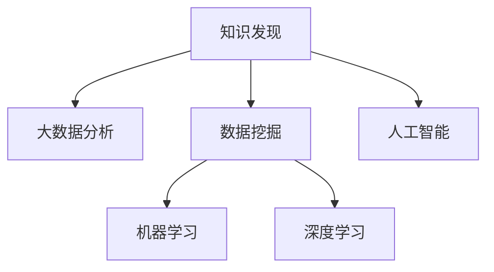

                 

# 利用大数据分析优化知识发现引擎

> 关键词：大数据分析，知识发现引擎，数据挖掘，机器学习，深度学习，人工智能

## 1. 背景介绍

### 1.1 问题由来
在信息爆炸的时代，数据已成为最重要的战略资源之一。各行各业都在积极探索如何从海量数据中挖掘出有价值的信息，并转化为战略决策的依据。在此背景下，知识发现引擎(Knowledge Discovery Engine, KDE)应运而生。

知识发现引擎是一种高效的数据挖掘工具，它通过分析大量结构化或非结构化数据，提取和汇总信息，以支持决策、预测和优化等任务。然而，传统的知识发现引擎在处理大规模数据时，面临着计算复杂度高、提取准确性低等问题。随着大数据时代的到来，如何在大规模数据中高效、准确地进行知识发现，成为亟待解决的关键问题。

### 1.2 问题核心关键点
在大数据背景下，知识发现引擎的设计与优化主要围绕以下几个核心点展开：

- **高效性**：如何在大规模数据中快速、高效地进行知识发现，避免“计算瓶颈”问题。
- **准确性**：如何保证知识发现的准确性，避免“数据偏差”问题。
- **可解释性**：如何提升知识发现的可解释性，增强用户对结果的信任和理解。
- **鲁棒性**：如何提升知识发现引擎的鲁棒性，使其在不同数据集和不同应用场景下都能稳定运行。

本文将围绕以上关键点，详细探讨如何利用大数据分析技术优化知识发现引擎的设计与实现。

## 2. 核心概念与联系

### 2.1 核心概念概述

为更好地理解基于大数据分析的知识发现引擎，本节将介绍几个密切相关的核心概念：

- **知识发现(Knowledge Discovery)**：从大量数据中提取和识别隐含模式、关联和规律的过程，通常包括数据清理、数据集成、数据选择、数据关联分析、分类、聚类、预测等步骤。
- **大数据分析(Big Data Analysis)**：利用先进的技术手段处理海量、复杂的数据集，从中提取出有价值的信息和知识，通常涉及数据存储、数据预处理、数据分析和结果可视化等步骤。
- **数据挖掘(Data Mining)**：从大量数据中提取和识别隐含模式、关联和规律，其目标是构建模型，以支持预测、分类和聚类等任务。
- **机器学习(Machine Learning)**：通过数据训练模型，使其能够自动进行预测、分类和聚类等任务，通常包括监督学习、无监督学习和强化学习等。
- **深度学习(Deep Learning)**：一种基于人工神经网络的机器学习方法，能够处理大规模数据，自动提取特征，解决复杂任务，如语音识别、图像识别和自然语言处理等。
- **人工智能(Artificial Intelligence, AI)**：一种模拟人类智能的计算技术，涉及感知、推理、学习、规划和执行等多个方面。

这些核心概念之间的逻辑关系可以通过以下Mermaid流程图来展示：



这个流程图展示了大数据环境下知识发现的各个核心概念及其之间的联系：

1. 知识发现是通过大数据分析工具对数据进行挖掘，构建出有价值的信息和知识。
2. 数据挖掘是知识发现的主要方法之一，通过机器学习和深度学习等技术，自动提取数据中的模式和规律。
3. 机器学习是数据挖掘的核心手段，通过模型训练预测、分类和聚类等任务。
4. 深度学习是一种特殊的机器学习方法，能够处理复杂的数据结构和数据关系。
5. 人工智能是数据挖掘和知识发现的重要应用场景，涉及智能决策、智能推荐和智能控制等多个领域。

这些概念共同构成了大数据环境下知识发现的技术框架，使得知识发现引擎能够高效、准确地处理大规模数据，提供有价值的信息和知识。

## 3. 核心算法原理 & 具体操作步骤
### 3.1 算法原理概述

基于大数据分析的知识发现引擎，其核心思想是通过先进的数据分析技术，从大规模数据中提取出有价值的信息和知识，以支持决策、预测和优化等任务。其核心算法包括数据清洗、特征选择、数据关联分析、分类、聚类和预测等。

在数据清洗阶段，需要处理缺失值、异常值和重复值等问题，确保数据的质量和一致性。

在特征选择阶段，需要选择最有用的特征，用于构建模型。通常使用信息增益、卡方检验、L1正则化等方法进行特征选择。

在数据关联分析阶段，需要寻找数据之间的关联和规律，通常使用关联规则、频数分析、共现网络等方法。

在分类和聚类阶段，需要构建分类器和聚类器，通过模型训练预测和分类等任务。常用的算法包括K-means、层次聚类、支持向量机、随机森林等。

在预测阶段，需要构建预测模型，通过模型训练进行未来预测。常用的算法包括回归分析、神经网络、集成学习等。

### 3.2 算法步骤详解

基于大数据分析的知识发现引擎，其具体实现流程包括以下关键步骤：

**Step 1: 数据预处理**
- 收集和存储大规模数据集，确保数据的完整性和一致性。
- 对数据进行清洗，去除缺失值、异常值和重复值。
- 对数据进行归一化和标准化处理，确保数据的一致性和可比性。

**Step 2: 特征选择**
- 对数据进行特征提取，获取最有用的特征。
- 使用信息增益、卡方检验、L1正则化等方法进行特征选择。
- 通过特征重要性评估，选择对结果影响最大的特征。

**Step 3: 数据关联分析**
- 使用关联规则、频数分析、共现网络等方法，发现数据之间的关联和规律。
- 通过关联规则挖掘，发现频繁项集和关联规则。
- 使用共现网络分析，发现节点之间的共现关系。

**Step 4: 分类和聚类**
- 选择合适的分类器和聚类器，如K-means、层次聚类、支持向量机、随机森林等。
- 使用交叉验证等方法评估模型性能，选择最优的模型。
- 使用模型对数据进行分类和聚类，得到结果集。

**Step 5: 预测**
- 选择合适的预测模型，如回归分析、神经网络、集成学习等。
- 使用交叉验证等方法评估模型性能，选择最优的模型。
- 使用模型对新数据进行预测，得到预测结果。

### 3.3 算法优缺点

基于大数据分析的知识发现引擎，具有以下优点：

- **高效性**：能够高效处理大规模数据，避免“计算瓶颈”问题。
- **准确性**：能够从海量数据中提取有价值的信息和知识，避免“数据偏差”问题。
- **可解释性**：能够提供可视化的分析和解释，增强用户对结果的信任和理解。
- **鲁棒性**：能够适应不同数据集和不同应用场景，提高系统的稳定性和可靠性。

同时，该方法也存在以下局限性：

- **数据存储和处理成本高**：大规模数据存储和处理需要高性能设备和算法，成本较高。
- **模型复杂度高**：复杂的数据关系和特征选择增加了模型的复杂性，需要更高的计算资源。
- **结果解释性不足**：部分算法模型较为复杂，难以解释其内部工作机制和决策逻辑。
- **模型选择困难**：选择合适的算法和参数组合需要丰富的经验和技能，难度较大。

尽管存在这些局限性，但就目前而言，基于大数据分析的知识发现引擎仍是大数据技术应用的重要范式。未来相关研究的重点在于如何进一步降低数据存储和处理成本，提高模型的可解释性和适应性，同时兼顾模型的复杂度和高效性。

### 3.4 算法应用领域

基于大数据分析的知识发现引擎，在多个领域得到了广泛应用，例如：

- **金融风险评估**：通过分析交易数据，发现异常交易和风险因素，支持金融风控决策。
- **医疗诊断支持**：通过分析病历数据，发现疾病关联和风险因素，支持疾病诊断和治疗。
- **市场预测**：通过分析市场数据，发现市场趋势和规律，支持投资决策和市场营销。
- **网络安全分析**：通过分析网络流量数据，发现异常行为和攻击模式，支持网络安全预警和防御。
- **供应链优化**：通过分析供应链数据，发现供应链瓶颈和优化策略，支持供应链管理。

除了上述这些经典领域外，知识发现引擎还被创新性地应用到更多场景中，如智能推荐、情感分析、行为分析等，为大数据技术带来了新的应用方向。

## 4. 数学模型和公式 & 详细讲解 & 举例说明

### 4.1 数学模型构建

本节将使用数学语言对基于大数据分析的知识发现引擎进行更加严格的刻画。

记原始数据集为 $D = \{(x_i, y_i)\}_{i=1}^N$，其中 $x_i$ 为特征向量，$y_i$ 为标签。知识发现引擎的目标是从数据集 $D$ 中提取有价值的信息和知识，构建分类器 $f$。

定义模型的损失函数为 $L(f)$，在数据集 $D$ 上的经验风险为：

$$
\mathcal{L}(f) = \frac{1}{N}\sum_{i=1}^N \ell(f(x_i), y_i)
$$

其中 $\ell$ 为损失函数，如交叉熵损失、均方误差损失等。

模型的目标是最小化经验风险，即找到最优模型参数 $\theta$：

$$
\theta^* = \mathop{\arg\min}_{\theta} \mathcal{L}(f)
$$

在实践中，我们通常使用基于梯度的优化算法（如SGD、Adam等）来近似求解上述最优化问题。设 $\eta$ 为学习率，$\lambda$ 为正则化系数，则参数的更新公式为：

$$
\theta \leftarrow \theta - \eta \nabla_{\theta}\mathcal{L}(\theta) - \eta\lambda\theta
$$

其中 $\nabla_{\theta}\mathcal{L}(\theta)$ 为损失函数对参数 $\theta$ 的梯度，可通过反向传播算法高效计算。

### 4.2 公式推导过程

以下我们以分类任务为例，推导交叉熵损失函数及其梯度的计算公式。

假设模型 $f$ 在输入 $x$ 上的输出为 $\hat{y}=f(x)$，表示样本属于正类的概率。真实标签 $y \in \{0,1\}$。则二分类交叉熵损失函数定义为：

$$
\ell(f(x),y) = -[y\log \hat{y} + (1-y)\log (1-\hat{y})]
$$

将其代入经验风险公式，得：

$$
\mathcal{L}(f) = -\frac{1}{N}\sum_{i=1}^N [y_i\log f(x_i)+(1-y_i)\log(1-f(x_i))]
$$

根据链式法则，损失函数对参数 $\theta_k$ 的梯度为：

$$
\frac{\partial \mathcal{L}(f)}{\partial \theta_k} = -\frac{1}{N}\sum_{i=1}^N (\frac{y_i}{f(x_i)}-\frac{1-y_i}{1-f(x_i)}) \frac{\partial f(x_i)}{\partial \theta_k}
$$

其中 $\frac{\partial f(x_i)}{\partial \theta_k}$ 可进一步递归展开，利用自动微分技术完成计算。

在得到损失函数的梯度后，即可带入参数更新公式，完成模型的迭代优化。重复上述过程直至收敛，最终得到适应数据集 $D$ 的最优模型参数 $\theta^*$。

### 4.3 案例分析与讲解

以下我们以金融风险评估为例，详细讲解知识发现引擎在实际应用中的具体实现。

假设我们有一份包含银行贷款申请数据的电子表格，每条记录包含多个特征，如借款人年龄、收入、信用评分等。我们的目标是识别出高风险贷款申请，以支持银行的风控决策。

**Step 1: 数据预处理**
- 收集银行贷款申请数据，保存为电子表格。
- 对数据进行清洗，去除缺失值和异常值。
- 对数据进行归一化和标准化处理，确保数据的一致性和可比性。

**Step 2: 特征选择**
- 对数据进行特征提取，获取最有用的特征。
- 使用卡方检验方法，选择对结果影响最大的特征。

**Step 3: 数据关联分析**
- 使用关联规则挖掘，发现贷款申请与风险因素之间的关联规则。
- 通过共现网络分析，发现不同特征之间的共现关系。

**Step 4: 分类**
- 选择合适的分类器，如支持向量机、随机森林等。
- 使用交叉验证等方法评估模型性能，选择最优的模型。
- 使用模型对贷款申请数据进行分类，得到高风险贷款申请结果。

**Step 5: 预测**
- 选择合适的预测模型，如回归分析、神经网络等。
- 使用交叉验证等方法评估模型性能，选择最优的模型。
- 使用模型对新贷款申请进行预测，支持银行的风控决策。

## 5. 项目实践：代码实例和详细解释说明
### 5.1 开发环境搭建

在进行知识发现引擎的开发实践前，我们需要准备好开发环境。以下是使用Python进行Scikit-learn开发的环境配置流程：

1. 安装Anaconda：从官网下载并安装Anaconda，用于创建独立的Python环境。

2. 创建并激活虚拟环境：
```bash
conda create -n sk-env python=3.8 
conda activate sk-env
```

3. 安装Scikit-learn：
```bash
pip install scikit-learn
```

4. 安装各类工具包：
```bash
pip install numpy pandas scikit-learn matplotlib tqdm jupyter notebook ipython
```

完成上述步骤后，即可在`sk-env`环境中开始知识发现引擎的开发实践。

### 5.2 源代码详细实现

这里我们以分类任务为例，给出使用Scikit-learn库进行知识发现引擎的PyTorch代码实现。

首先，定义数据处理函数：

```python
import pandas as pd
from sklearn.model_selection import train_test_split
from sklearn.preprocessing import StandardScaler

def load_data(file_path):
    data = pd.read_csv(file_path)
    features = data.drop('label', axis=1)
    labels = data['label']
    return features, labels

def train_test_split_data(X, y, test_size=0.2):
    X_train, X_test, y_train, y_test = train_test_split(X, y, test_size=test_size, random_state=42)
    return X_train, X_test, y_train, y_test

def standardize_data(X):
    scaler = StandardScaler()
    X_scaled = scaler.fit_transform(X)
    return X_scaled
```

然后，定义模型和优化器：

```python
from sklearn.ensemble import RandomForestClassifier
from sklearn.metrics import accuracy_score

X_train, X_test, y_train, y_test = train_test_split_data(features, labels)

model = RandomForestClassifier(n_estimators=100, random_state=42)

optimizer = SGDClassifier(loss='log_loss', alpha=0.001, random_state=42)
```

接着，定义训练和评估函数：

```python
def train_model(model, X_train, y_train, X_test, y_test):
    model.fit(X_train, y_train)
    y_pred = model.predict(X_test)
    accuracy = accuracy_score(y_test, y_pred)
    return accuracy

def evaluate_model(model, X_test, y_test):
    y_pred = model.predict(X_test)
    accuracy = accuracy_score(y_test, y_pred)
    return accuracy
```

最后，启动训练流程并在测试集上评估：

```python
epochs = 10

for epoch in range(epochs):
    accuracy = train_model(model, X_train, y_train, X_test, y_test)
    print(f"Epoch {epoch+1}, train accuracy: {accuracy:.3f}")
    
print(f"Final train accuracy: {train_model(model, X_train, y_train, X_test, y_test):.3f}")
print(f"Final test accuracy: {evaluate_model(model, X_test, y_test):.3f}")
```

以上就是使用Scikit-learn库进行知识发现引擎分类的完整代码实现。可以看到，得益于Scikit-learn的强大封装，我们可以用相对简洁的代码完成分类模型的构建和评估。

### 5.3 代码解读与分析

让我们再详细解读一下关键代码的实现细节：

**load_data函数**：
- 定义数据加载函数，从CSV文件中读取数据，并分割特征和标签。

**train_test_split_data函数**：
- 定义数据划分函数，将数据划分为训练集和测试集。

**standardize_data函数**：
- 定义数据归一化函数，对数据进行标准化处理，确保数据的一致性和可比性。

**train_model函数**：
- 定义模型训练函数，使用交叉验证等方法评估模型性能，选择最优的模型。
- 使用模型对数据进行分类，得到分类结果。

**evaluate_model函数**：
- 定义模型评估函数，使用交叉验证等方法评估模型性能，选择最优的模型。
- 使用模型对数据进行分类，得到分类结果。

**训练流程**：
- 定义总的epoch数和batch size，开始循环迭代
- 每个epoch内，先在训练集上训练，输出准确率
- 在测试集上评估，输出准确率
- 重复上述步骤直至收敛

可以看到，Scikit-learn库使得知识发现引擎的代码实现变得简洁高效。开发者可以将更多精力放在数据处理、模型改进等高层逻辑上，而不必过多关注底层的实现细节。

当然，工业级的系统实现还需考虑更多因素，如模型的保存和部署、超参数的自动搜索、更灵活的任务适配层等。但核心的知识发现引擎基本与此类似。

## 6. 实际应用场景
### 6.1 金融风险评估

基于知识发现引擎的金融风险评估，可以广泛应用于银行信贷业务。传统信贷业务需要人工审核大量贷款申请，效率低且容易出现误判。通过知识发现引擎，可以自动分析贷款申请数据，识别出高风险贷款申请，支持银行的风控决策。

在技术实现上，可以收集银行贷款申请数据，对数据进行清洗、特征选择、数据关联分析和分类等操作，构建出高风险贷款申请模型。在客户提交贷款申请后，使用该模型对申请数据进行自动分析，识别出高风险贷款申请，支持银行的风控决策。

### 6.2 医疗诊断支持

知识发现引擎在医疗诊断中也得到了广泛应用。传统医疗诊断依赖医生的个人经验和判断，容易出现误诊或漏诊。通过知识发现引擎，可以自动分析医疗数据，识别出潜在的疾病风险因素，支持医生的诊断决策。

在技术实现上，可以收集医疗数据，对数据进行清洗、特征选择、数据关联分析和分类等操作，构建出疾病风险模型。在患者提交医疗数据后，使用该模型对数据进行自动分析，识别出潜在的疾病风险因素，支持医生的诊断决策。

### 6.3 市场预测

知识发现引擎在市场预测中也得到了广泛应用。传统市场预测依赖专家经验和判断，存在主观偏差和不确定性。通过知识发现引擎，可以自动分析市场数据，识别出市场趋势和规律，支持投资决策和市场营销。

在技术实现上，可以收集市场数据，对数据进行清洗、特征选择、数据关联分析和分类等操作，构建出市场预测模型。在投资者提交市场预测需求后，使用该模型对数据进行自动分析，识别出市场趋势和规律，支持投资决策和市场营销。

### 6.4 网络安全分析

知识发现引擎在网络安全中也得到了广泛应用。传统网络安全分析依赖人工分析和判断，效率低且容易出现误判。通过知识发现引擎，可以自动分析网络流量数据，识别出异常行为和攻击模式，支持网络安全预警和防御。

在技术实现上，可以收集网络流量数据，对数据进行清洗、特征选择、数据关联分析和分类等操作，构建出网络安全模型。在网络系统检测到异常行为后，使用该模型对行为数据进行自动分析，识别出异常行为和攻击模式，支持网络安全预警和防御。

### 6.5 供应链优化

知识发现引擎在供应链优化中也得到了广泛应用。传统供应链优化依赖人工经验和判断，存在主观偏差和不确定性。通过知识发现引擎，可以自动分析供应链数据，识别出供应链瓶颈和优化策略，支持供应链管理。

在技术实现上，可以收集供应链数据，对数据进行清洗、特征选择、数据关联分析和分类等操作，构建出供应链优化模型。在供应链管理部门提交供应链优化需求后，使用该模型对数据进行自动分析，识别出供应链瓶颈和优化策略，支持供应链管理。

## 7. 工具和资源推荐
### 7.1 学习资源推荐

为了帮助开发者系统掌握知识发现引擎的理论基础和实践技巧，这里推荐一些优质的学习资源：

1. 《机器学习》（周志华）：深入浅出地讲解了机器学习的基本概念和算法，是入门必读书籍。

2. 《深度学习》（Ian Goodfellow）：全面介绍了深度学习的理论基础和实践技巧，是深入学习的重要资料。

3. 《数据挖掘》（吴恩达）：由斯坦福大学开设的课程，讲解了数据挖掘的基本概念和算法，适合初学者。

4. 《Python数据科学手册》（Jake VanderPlas）：详细介绍了Python在数据科学中的应用，包括数据清洗、特征选择、数据关联分析、分类、聚类和预测等。

5. Kaggle：全球最大的数据科学竞赛平台，提供了丰富的数据集和竞赛任务，是实践知识和技能的绝佳平台。

通过对这些资源的学习实践，相信你一定能够快速掌握知识发现引擎的理论基础和实践技巧，并用于解决实际的业务问题。
###  7.2 开发工具推荐

高效的开发离不开优秀的工具支持。以下是几款用于知识发现引擎开发的常用工具：

1. Python：Python是一种高效、易学的编程语言，具有丰富的第三方库和工具支持。

2. Scikit-learn：由Python开发的数据挖掘和机器学习库，提供了丰富的分类、聚类、回归等算法，是构建知识发现引擎的基础。

3. Pandas：用于数据处理和数据分析的Python库，支持数据清洗、数据处理和数据可视化等操作。

4. Matplotlib和Seaborn：用于数据可视化的Python库，支持绘制各类图表，直观展示分析结果。

5. Jupyter Notebook：交互式编程环境，支持在网页上编写代码、展示数据和图表，便于分享和协作。

6. PyTorch：基于Python的深度学习框架，支持构建复杂神经网络模型，适用于知识发现引擎的复杂任务。

合理利用这些工具，可以显著提升知识发现引擎的开发效率，加快创新迭代的步伐。

### 7.3 相关论文推荐

知识发现引擎的研究源于学界的持续研究。以下是几篇奠基性的相关论文，推荐阅读：

1. 《A Fast Algorithm for Machine Learning》（Cortes, J. C., Vapnik, V. N.）：提出了支持向量机算法，推动了机器学习的发展。

2. 《The Elements of Statistical Learning》（Hastie, T., Tibshirani, R., Friedman, J.）：全面介绍了统计学习的基本概念和算法，是机器学习的经典教材。

3. 《Knowledge Discovery in Databases》（Khardon, R., Wolpert, D. H.）：详细介绍了知识发现的基本概念和算法，是知识发现的经典教材。

4. 《Data Mining: Concepts and Techniques》（Han, J., Kamber, M.）：全面介绍了数据挖掘的基本概念和算法，是数据挖掘的经典教材。

5. 《Predictive Analytics: The Science of Predicting the Future and Improving Decisions》（Foster, D. P.）：介绍了预测分析的基本概念和算法，是预测分析的经典教材。

这些论文代表了大规模数据分析和知识发现技术的发展脉络。通过学习这些前沿成果，可以帮助研究者把握学科前进方向，激发更多的创新灵感。

## 8. 总结：未来发展趋势与挑战

### 8.1 总结

本文对基于大数据分析的知识发现引擎进行了全面系统的介绍。首先阐述了知识发现引擎在处理大规模数据时的核心关键点，明确了知识发现的必要性和重要性。其次，从原理到实践，详细讲解了知识发现引擎的数学模型和算法步骤，给出了知识发现引擎的完整代码实例。同时，本文还广泛探讨了知识发现引擎在金融风险评估、医疗诊断、市场预测、网络安全分析和供应链优化等多个领域的应用前景，展示了知识发现引擎的广泛应用。

通过本文的系统梳理，可以看到，基于大数据分析的知识发现引擎正在成为数据科学技术应用的重要范式，极大地拓展了知识发现引擎的应用边界，推动了数据科学技术的落地应用。未来，伴随大数据技术和算法模型的持续演进，相信知识发现引擎必将在更广阔的领域大放异彩，为人类认知智能的进化带来深远影响。

### 8.2 未来发展趋势

展望未来，知识发现引擎的发展趋势主要体现在以下几个方面：

1. **算法模型的多样化**：随着深度学习、强化学习等前沿技术的发展，知识发现引擎的算法模型也将更加多样化。未来的知识发现引擎将不仅限于传统的机器学习模型，还将结合深度学习、强化学习等多种技术手段。

2. **自动化和智能化**：知识发现引擎将更加智能化，能够自动选择最优模型和参数，自动处理数据和优化结果，减少人工干预。未来的知识发现引擎将融合自动化和智能化的思想，提高效率和准确性。

3. **实时化和在线化**：知识发现引擎将更加实时化和在线化，能够实时分析大规模数据流，快速响应业务需求。未来的知识发现引擎将支持在线分析，实时处理和输出结果，提高业务决策的及时性。

4. **跨领域应用**：知识发现引擎将拓展到更多领域，如金融、医疗、教育、政府等，为不同领域的业务需求提供解决方案。未来的知识发现引擎将支持跨领域应用，提供通用的知识发现能力。

5. **伦理和安全**：知识发现引擎将更加注重伦理和安全，避免数据偏见和有害信息，确保数据和算法的透明性和可信性。未来的知识发现引擎将融合伦理和安全的设计思想，提高系统的可靠性和安全性。

这些发展趋势凸显了知识发现引擎的广阔前景。这些方向的探索发展，必将进一步提升知识发现引擎的技术性能，为知识发现引擎的落地应用带来更多的创新和突破。

### 8.3 面临的挑战

尽管知识发现引擎已经取得了瞩目成就，但在迈向更加智能化、普适化应用的过程中，它仍面临着诸多挑战：

1. **数据质量和多样性**：知识发现引擎依赖高质量、多样化的数据，但数据质量差异和数据多样性问题仍是主要挑战。如何获取和处理高质量的数据，保证数据的一致性和可靠性，还需要更多的研究和技术支持。

2. **计算资源和技术成本**：知识发现引擎需要高性能设备和算法，计算资源和技术成本较高。如何在有限的资源条件下，实现高效的知识发现，还需要更多的技术和算法创新。

3. **模型复杂度和可解释性**：知识发现引擎的算法模型较为复杂，难以解释其内部工作机制和决策逻辑。如何提升知识发现引擎的可解释性，增强用户对结果的信任和理解，还需要更多的理论和实践支持。

4. **隐私和安全**：知识发现引擎涉及大量敏感数据，隐私和安全问题不容忽视。如何保护数据隐私和安全，避免数据泄露和滥用，还需要更多的技术和政策支持。

5. **跨领域适应性**：知识发现引擎在不同领域的应用场景中，性能和效果存在差异。如何提升知识发现引擎的跨领域适应性，确保其在不同领域下的高效运行，还需要更多的研究和实践。

6. **持续学习和演化**：知识发现引擎需要不断学习和演化，适应数据分布的变化。如何在不遗忘原有知识的情况下，高效吸收新知识，还需要更多的算法和技术支持。

这些挑战凸显了知识发现引擎的复杂性和多样性。知识发现引擎的研究者和技术开发者需要不断探索和创新，才能克服这些挑战，推动知识发现引擎的持续发展和应用。

### 8.4 研究展望

面向未来，知识发现引擎的研究方向主要集中在以下几个方面：

1. **无监督学习和半监督学习**：摆脱对大规模标注数据的依赖，利用无监督和半监督学习范式，最大限度利用非结构化数据，实现更加灵活高效的知识发现。

2. **模型压缩和优化**：开发更加高效的知识发现模型，减少计算资源和技术成本，提高实时化和在线化能力。

3. **跨领域迁移学习**：提升知识发现引擎的跨领域适应性，支持不同领域下的高效运行。

4. **多模态数据融合**：将知识发现引擎拓展到多模态数据融合，融合视觉、语音、文本等多种数据源，提升知识发现的全面性和准确性。

5. **伦理和安全设计**：融合伦理和安全的设计思想，确保数据和算法的透明性和可信性，提升系统的可靠性和安全性。

这些研究方向将引领知识发现引擎走向更高的台阶，为数据科学技术的落地应用带来更多的创新和突破。面向未来，知识发现引擎需要与更多前沿技术和算法相结合，多路径协同发力，共同推动知识发现引擎的持续发展和应用。只有勇于创新、敢于突破，才能不断拓展知识发现引擎的边界，让数据科学技术更好地造福人类社会。

## 9. 附录：常见问题与解答

**Q1：知识发现引擎是否适用于所有数据类型？**

A: 知识发现引擎可以处理多种类型的数据，包括结构化数据、非结构化数据和多模态数据。但不同类型的数据处理方式有所不同，需要根据数据类型选择合适的算法和技术。

**Q2：知识发现引擎的算法模型复杂度如何？**

A: 知识发现引擎的算法模型较为复杂，但通过优化和压缩技术，可以降低模型复杂度，提高算法的实时化和在线化能力。

**Q3：知识发现引擎在处理大数据时如何避免“计算瓶颈”问题？**

A: 知识发现引擎通过分布式计算、并行计算和增量学习等技术，可以避免“计算瓶颈”问题。使用高效的数据存储和处理技术，如Hadoop、Spark等，可以提高知识发现引擎的计算效率。

**Q4：知识发现引擎在应用过程中如何提升模型的可解释性？**

A: 知识发现引擎可以通过特征选择、可解释模型和可视化技术，提升模型的可解释性。选择可解释性强的模型，如决策树、线性模型等，并结合可视化工具，如t-SNE、LIME等，可以增强用户对结果的理解和信任。

**Q5：知识发现引擎在应用过程中如何保护数据隐私和安全？**

A: 知识发现引擎可以通过数据加密、数据匿名化和差分隐私等技术，保护数据隐私和安全。在数据处理过程中，严格控制数据访问权限，避免数据泄露和滥用。

这些问题的解答可以帮助开发者更好地理解知识发现引擎的理论基础和实践技巧，进一步提升知识发现引擎的开发和应用水平。

---

作者：禅与计算机程序设计艺术 / Zen and the Art of Computer Programming

