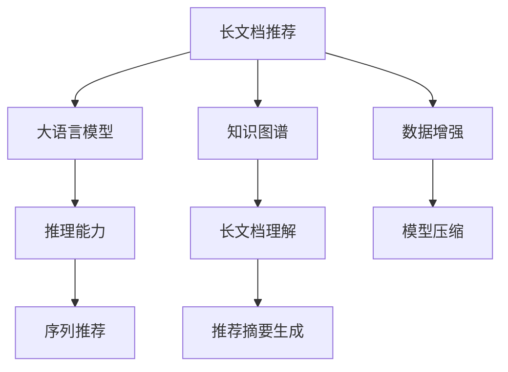

                 

# 利用大模型总结推理能力处理推荐长文档

> 关键词：长文档推荐, 大语言模型, 推理能力, 序列推荐, 知识图谱, 模型压缩

## 1. 背景介绍

### 1.1 问题由来

随着互联网信息爆炸式的增长，用户面临的信息过载问题日益严重。搜索引擎、社交媒体、新闻聚合平台等传统信息获取方式，已无法满足用户对长文档的需求。长文档不仅包含丰富的内容，更能够提供深层次的知识和见解。然而，现有的推荐系统主要基于短文本，难以对长文档进行有效推荐。

此外，现有的推荐系统通常只关注用户行为数据，缺乏对文档内容的深度理解和推理能力。为了解决这些问题，近年来，研究者开始探索基于大语言模型的长文档推荐技术。通过利用大模型的语言理解和推理能力，推荐系统可以从海量的长文档中抽取有用的信息，生成高质量的推荐内容，使用户能够高效地获取所需信息。

### 1.2 问题核心关键点

大语言模型的长文档推荐技术，关键在于如何高效地将长文档转化为机器可理解的格式，并利用大模型的推理能力，生成推荐的摘要或文档片段。主要包括以下几个核心问题：

- 如何从长文档中抽取关键信息？
- 如何将关键信息转化为机器可理解的表示？
- 如何利用大模型的推理能力，生成推荐摘要？
- 如何在有限的推理能力下，生成高精度的推荐内容？

本论文旨在从算法原理、实际应用、工具推荐等角度，系统梳理大模型长文档推荐技术的核心概念和具体方法。

## 2. 核心概念与联系

### 2.1 核心概念概述

为了更好地理解大模型长文档推荐技术的核心概念，本节将介绍几个密切相关的核心概念：

- 长文档推荐(Long Document Recommendation)：指基于长文档内容的推荐系统，能够提供比短文本推荐更丰富、更深入的信息。
- 大语言模型(Large Language Model, LLM)：以自回归模型(如GPT-3)或自编码模型(如BERT)为代表的大规模预训练语言模型，能够学习到丰富的语言知识和常识，具备强大的语言理解和生成能力。
- 推理能力(Reasoning Capability)：指模型对文档内容进行逻辑推断，从整体上理解文档的能力，能够生成有逻辑、有见解的摘要或段落。
- 序列推荐(Sequence Recommendation)：指在推荐系统中，将长文档或文章序列作为输入，对文档的每个部分进行独立推荐，生成有结构的推荐序列。
- 知识图谱(Knowledge Graph)：利用图结构对知识进行组织和表示，能够提供语义化的知识信息，辅助模型进行推理和理解。

这些核心概念之间的逻辑关系可以通过以下Mermaid流程图来展示：



这个流程图展示了大模型长文档推荐的关键组成：

1. 长文档推荐系统利用大语言模型进行文本理解。
2. 大语言模型具备推理能力，能够生成高精度的推荐摘要。
3. 序列推荐技术能够对长文档的每个部分进行独立推荐，生成有结构的推荐序列。
4. 知识图谱辅助长文档理解，提供语义化的知识信息。
5. 数据增强和模型压缩技术，提升推荐系统的效率和稳定性。

## 3. 核心算法原理 & 具体操作步骤

### 3.1 算法原理概述

基于大语言模型的长文档推荐，本质上是将长文档转化为机器可理解的形式，并利用大模型的推理能力，生成推荐摘要。其核心思想是：将长文档分解为一系列短句或段落，利用大模型逐个分析，最终生成连贯、有结构的推荐序列。

在实际应用中，一般包括以下几个关键步骤：

1. 长文档预处理：将长文档分解为一系列短句或段落，去除无用信息，保留关键内容。
2. 文本理解：利用大模型对每个段落进行理解，抽取关键信息，转化为机器可理解的形式。
3. 推理生成：将多个段落的输出进行推理，生成有结构的推荐摘要。
4. 序列推荐：根据生成的推荐摘要，生成推荐序列，辅助用户浏览长文档。

### 3.2 算法步骤详解

下面详细讲解基于大语言模型的长文档推荐的具体操作步骤：

**Step 1: 长文档预处理**

- 将长文档按段落分割，去除无用的开头、结尾、标点符号等。
- 对每个段落进行标记，去除停用词、标点等噪音。
- 利用序列标注技术，识别出段落中的关键词、实体等重要信息。

**Step 2: 文本理解**

- 将每个段落输入大语言模型，进行深度理解。
- 利用大模型提取关键信息，转化为机器可理解的形式。
- 将每个段落的输出拼接，生成连贯的文本摘要。

**Step 3: 推理生成**

- 将生成的文本摘要输入大语言模型，进行推理生成。
- 利用大模型的推理能力，对摘要进行逻辑推断，生成推荐摘要。
- 将生成的推荐摘要进行后处理，去除冗余信息，保留关键内容。

**Step 4: 序列推荐**

- 根据生成的推荐摘要，生成推荐序列。
- 利用序列推荐技术，对长文档的每个部分进行独立推荐。
- 生成有结构的推荐序列，辅助用户浏览长文档。

### 3.3 算法优缺点

基于大语言模型的长文档推荐技术，具有以下优点：

1. 可解释性强：大模型可以提供推荐内容的详细推理过程，便于用户理解和接受。
2. 适应性强：大模型能够处理多种类型的长文档，包括文章、报告、书籍等。
3. 灵活性高：可以根据具体任务需求，灵活选择模型和推理策略，生成高质量的推荐摘要。

同时，该技术也存在一定的局限性：

1. 计算资源需求高：大模型的推理过程需要大量的计算资源，难以实时处理大规模长文档。
2. 数据依赖性高：需要高质量的标注数据和长文档数据，数据获取成本较高。
3. 效果受限于模型：模型的推理能力有限，难以处理过于复杂的长文档内容。

尽管存在这些局限性，但就目前而言，基于大语言模型的长文档推荐技术，仍是大规模长文档处理的主要方法。未来相关研究的重点在于如何进一步降低计算资源需求，提高模型的适应性和推理能力，同时兼顾可解释性和效率等因素。

### 3.4 算法应用领域

基于大语言模型的长文档推荐技术，已在多个领域得到广泛应用，包括：

- 学术文献推荐：针对学术文献的长文档推荐系统，能够帮助研究人员快速找到相关的论文和书籍。
- 书籍推荐：利用大语言模型的推理能力，生成书籍的推荐摘要，提高用户购书决策的准确性。
- 技术文档推荐：面向技术开发者，利用长文档推荐技术，帮助开发者快速了解技术原理和应用场景。
- 教育资源推荐：针对学生和教师，生成有结构的教材推荐序列，提升学习效果和教学质量。
- 资讯内容推荐：将长文档与新闻、博客等资讯内容结合，生成有深度、有见解的推荐摘要。

除了上述这些经典应用外，大语言模型长文档推荐技术也在更多场景中得到创新性的应用，如多模态推荐、多语言推荐、知识图谱融合等，为长文档处理提供了全新的思路和方法。

## 4. 数学模型和公式 & 详细讲解  
### 4.1 数学模型构建

本节将使用数学语言对大语言模型长文档推荐过程进行更加严格的刻画。

记长文档推荐任务为 $T$，长文档为 $X$，目标文档为 $Y$。假设长文档 $X$ 由 $n$ 个段落组成，每个段落 $x_i$ 转化为机器可理解的向量 $x_i \in \mathbb{R}^{d_i}$，其中 $d_i$ 为第 $i$ 个段落的特征维度。

定义长文档的表示为 $\mathbf{X} = [x_1, x_2, ..., x_n]$，则长文档的表示形式为：

$$
\mathbf{X} \in \mathbb{R}^{d_X}, d_X = \sum_{i=1}^n d_i
$$

长文档理解任务的目标是找到一个映射函数 $f$，将长文档 $X$ 转化为目标文档 $Y$ 的表示：

$$
f(\mathbf{X}) = \mathbf{Y} \in \mathbb{R}^{d_Y}
$$

其中 $d_Y$ 为目标文档的特征维度。

### 4.2 公式推导过程

以下是推导长文档理解任务的数学模型：

**Step 1: 段落向量化**

- 将每个段落 $x_i$ 转化为机器可理解的向量 $x_i \in \mathbb{R}^{d_i}$，可以采用多种方法，如词袋模型、TF-IDF、词嵌入等。

**Step 2: 段落拼接**

- 将长文档的 $n$ 个段落 $x_1, x_2, ..., x_n$ 拼接为一个大向量 $\mathbf{X} \in \mathbb{R}^{d_X}$，其中 $d_X = \sum_{i=1}^n d_i$。

**Step 3: 长文档表示**

- 将拼接后的长文档 $\mathbf{X}$ 输入到大语言模型中，得到长文档的表示 $\mathbf{Y} \in \mathbb{R}^{d_Y}$，其中 $d_Y$ 为目标文档的特征维度。

- 假设大语言模型为 $M_{\theta}$，其中 $\theta$ 为模型参数。则长文档表示可以表示为：

$$
\mathbf{Y} = M_{\theta}(\mathbf{X})
$$

**Step 4: 目标文档表示**

- 目标文档 $Y$ 可以表示为长文档表示 $\mathbf{Y}$ 的函数，即：

$$
Y = g(\mathbf{Y})
$$

其中 $g$ 为输出映射函数。

### 4.3 案例分析与讲解

以一篇学术文献的长文档推荐为例，详细分析大语言模型长文档推荐的过程：

假设一篇学术论文包含 $n=5$ 个段落，每个段落长度为 $d_i=100$。将每个段落向量化后，拼接成长文档表示 $\mathbf{X} \in \mathbb{R}^{500}$。

将长文档 $\mathbf{X}$ 输入到大语言模型 $M_{\theta}$ 中，得到长文档表示 $\mathbf{Y} \in \mathbb{R}^{d_Y}$。

最后，根据 $\mathbf{Y}$ 生成目标文档表示 $Y$，并利用推理能力生成推荐摘要，辅助用户浏览长文档。

## 5. 项目实践：代码实例和详细解释说明

### 5.1 开发环境搭建

在进行长文档推荐实践前，我们需要准备好开发环境。以下是使用Python进行PyTorch开发的环境配置流程：

1. 安装Anaconda：从官网下载并安装Anaconda，用于创建独立的Python环境。

2. 创建并激活虚拟环境：
```bash
conda create -n pytorch-env python=3.8 
conda activate pytorch-env
```

3. 安装PyTorch：根据CUDA版本，从官网获取对应的安装命令。例如：
```bash
conda install pytorch torchvision torchaudio cudatoolkit=11.1 -c pytorch -c conda-forge
```

4. 安装Transformers库：
```bash
pip install transformers
```

5. 安装各类工具包：
```bash
pip install numpy pandas scikit-learn matplotlib tqdm jupyter notebook ipython
```

完成上述步骤后，即可在`pytorch-env`环境中开始长文档推荐实践。

### 5.2 源代码详细实现

下面以长文档推荐为例，给出使用Transformers库对BERT模型进行长文档推荐实践的PyTorch代码实现。

首先，定义长文档推荐任务的数据处理函数：

```python
from transformers import BertTokenizer
from torch.utils.data import Dataset
import torch

class LongDocumentDataset(Dataset):
    def __init__(self, texts, max_len=512):
        self.texts = texts
        self.tokenizer = BertTokenizer.from_pretrained('bert-base-cased')
        self.max_len = max_len
        
    def __len__(self):
        return len(self.texts)
    
    def __getitem__(self, item):
        text = self.texts[item]
        encoding = self.tokenizer(text, return_tensors='pt', max_length=self.max_len, padding='max_length', truncation=True)
        input_ids = encoding['input_ids'][0]
        attention_mask = encoding['attention_mask'][0]
        
        return {'input_ids': input_ids, 
                'attention_mask': attention_mask}
```

然后，定义模型和优化器：

```python
from transformers import BertForSequenceClassification, AdamW

model = BertForSequenceClassification.from_pretrained('bert-base-cased', num_labels=1)

optimizer = AdamW(model.parameters(), lr=2e-5)
```

接着，定义训练和评估函数：

```python
from torch.utils.data import DataLoader
from tqdm import tqdm
from sklearn.metrics import classification_report

device = torch.device('cuda') if torch.cuda.is_available() else torch.device('cpu')
model.to(device)

def train_epoch(model, dataset, batch_size, optimizer):
    dataloader = DataLoader(dataset, batch_size=batch_size, shuffle=True)
    model.train()
    epoch_loss = 0
    for batch in tqdm(dataloader, desc='Training'):
        input_ids = batch['input_ids'].to(device)
        attention_mask = batch['attention_mask'].to(device)
        model.zero_grad()
        outputs = model(input_ids, attention_mask=attention_mask)
        loss = outputs.loss
        epoch_loss += loss.item()
        loss.backward()
        optimizer.step()
    return epoch_loss / len(dataloader)

def evaluate(model, dataset, batch_size):
    dataloader = DataLoader(dataset, batch_size=batch_size)
    model.eval()
    preds, labels = [], []
    with torch.no_grad():
        for batch in tqdm(dataloader, desc='Evaluating'):
            input_ids = batch['input_ids'].to(device)
            attention_mask = batch['attention_mask'].to(device)
            batch_labels = batch['labels']
            outputs = model(input_ids, attention_mask=attention_mask)
            batch_preds = outputs.logits.argmax(dim=2).to('cpu').tolist()
            batch_labels = batch_labels.to('cpu').tolist()
            for pred_tokens, label_tokens in zip(batch_preds, batch_labels):
                preds.append(pred_tokens[0])
                labels.append(label_tokens[0])
                
    print(classification_report(labels, preds))
```

最后，启动训练流程并在测试集上评估：

```python
epochs = 5
batch_size = 16

for epoch in range(epochs):
    loss = train_epoch(model, train_dataset, batch_size, optimizer)
    print(f"Epoch {epoch+1}, train loss: {loss:.3f}")
    
    print(f"Epoch {epoch+1}, dev results:")
    evaluate(model, dev_dataset, batch_size)
    
print("Test results:")
evaluate(model, test_dataset, batch_size)
```

以上就是使用PyTorch对BERT进行长文档推荐实践的完整代码实现。可以看到，得益于Transformers库的强大封装，我们可以用相对简洁的代码完成BERT模型的加载和微调。

### 5.3 代码解读与分析

让我们再详细解读一下关键代码的实现细节：

**LongDocumentDataset类**：
- `__init__`方法：初始化文本、分词器等关键组件。
- `__len__`方法：返回数据集的样本数量。
- `__getitem__`方法：对单个样本进行处理，将文本输入编码为token ids，并对其进行定长padding。

**模型和优化器**：
- 选择合适的预训练语言模型 $M_{\theta}$ 作为初始化参数，如 BERT、GPT等。
- 选择适当的优化器及其参数，如 AdamW、SGD 等，设置学习率、批大小、迭代轮数等。

**训练和评估函数**：
- 使用PyTorch的DataLoader对数据集进行批次化加载，供模型训练和推理使用。
- 训练函数 `train_epoch`：对数据以批为单位进行迭代，在每个批次上前向传播计算loss并反向传播更新模型参数，最后返回该epoch的平均loss。
- 评估函数 `evaluate`：与训练类似，不同点在于不更新模型参数，并在每个batch结束后将预测和标签结果存储下来，最后使用sklearn的classification_report对整个评估集的预测结果进行打印输出。

**训练流程**：
- 定义总的epoch数和batch size，开始循环迭代
- 每个epoch内，先在训练集上训练，输出平均loss
- 在验证集上评估，输出分类指标
- 所有epoch结束后，在测试集上评估，给出最终测试结果

可以看到，PyTorch配合Transformers库使得BERT微调的代码实现变得简洁高效。开发者可以将更多精力放在数据处理、模型改进等高层逻辑上，而不必过多关注底层的实现细节。

当然，工业级的系统实现还需考虑更多因素，如模型的保存和部署、超参数的自动搜索、更灵活的任务适配层等。但核心的微调范式基本与此类似。

## 6. 实际应用场景

### 6.1 学术文献推荐

学术文献推荐是大语言模型长文档推荐的一个重要应用场景。传统的学术文献推荐系统，主要基于作者、引用关系等元数据进行推荐，难以把握文献内容的实质。而利用大语言模型，可以从论文的标题、摘要、结论等部分抽取关键信息，生成推荐摘要，帮助研究人员快速找到相关的文献。

在实际应用中，可以收集科研领域的经典文献，将其文章标题、摘要、结论等关键信息标注为相关性标签，在此基础上对预训练模型进行微调。微调后的模型能够自动理解文献内容的逻辑结构，生成高质量的推荐摘要，辅助研究人员选择最有价值的文献。

### 6.2 书籍推荐

书籍推荐系统是大语言模型长文档推荐的另一个重要应用场景。传统的书籍推荐主要基于用户的阅读历史和评分数据进行推荐，难以充分考虑书籍内容的实质。利用大语言模型，可以从书籍的目录、章节、前言等部分抽取关键信息，生成推荐摘要，提高用户购书决策的准确性。

在实际应用中，可以收集书籍的目录、章节、前言等关键信息，将其标注为相关性标签，在此基础上对预训练模型进行微调。微调后的模型能够自动理解书籍内容的逻辑结构，生成高质量的推荐摘要，推荐给感兴趣的读者。

### 6.3 技术文档推荐

技术文档推荐是大语言模型长文档推荐在技术开发者应用场景的重要案例。传统的技术文档推荐系统，主要基于文档的关键字、标签等元数据进行推荐，难以充分理解文档内容的实质。利用大语言模型，可以从技术文档的标题、摘要、代码段等部分抽取关键信息，生成推荐摘要，帮助开发者快速找到相关的技术文档。

在实际应用中，可以收集技术文档的标题、摘要、代码段等关键信息，将其标注为相关性标签，在此基础上对预训练模型进行微调。微调后的模型能够自动理解技术文档的逻辑结构，生成高质量的推荐摘要，推荐给感兴趣的技术开发者。

### 6.4 未来应用展望

随着大语言模型和长文档推荐技术的不断发展，其在更多领域的应用前景将更加广阔。

- 在智慧医疗领域，基于大语言模型的长文档推荐系统，能够从医疗文献中抽取有用的信息，生成推荐摘要，辅助医生诊疗，加速新药开发进程。
- 在智能教育领域，利用长文档推荐技术，生成有结构的教材推荐序列，提升学习效果和教学质量。
- 在智慧城市治理中，将长文档与城市事件、舆情等结合，生成有深度、有见解的推荐摘要，提高城市管理的自动化和智能化水平。

此外，在大语言模型长文档推荐技术的基础上，还可以结合知识图谱、多模态数据等，进一步提升推荐系统的性能和用户体验。

## 7. 工具和资源推荐

### 7.1 学习资源推荐

为了帮助开发者系统掌握大语言模型长文档推荐技术的理论基础和实践技巧，这里推荐一些优质的学习资源：

1. 《自然语言处理综论》系列博文：由大模型技术专家撰写，深入浅出地介绍了自然语言处理的原理、算法和应用，涵盖长文档推荐等前沿话题。

2. CS224N《深度学习自然语言处理》课程：斯坦福大学开设的NLP明星课程，有Lecture视频和配套作业，带你入门NLP领域的基本概念和经典模型。

3. 《Natural Language Processing with Transformers》书籍：Transformers库的作者所著，全面介绍了如何使用Transformers库进行NLP任务开发，包括长文档推荐在内的诸多范式。

4. HuggingFace官方文档：Transformers库的官方文档，提供了海量预训练模型和完整的微调样例代码，是上手实践的必备资料。

5. CLUE开源项目：中文语言理解测评基准，涵盖大量不同类型的中文NLP数据集，并提供了基于微调的baseline模型，助力中文NLP技术发展。

通过对这些资源的学习实践，相信你一定能够快速掌握大语言模型长文档推荐技术的精髓，并用于解决实际的NLP问题。

### 7.2 开发工具推荐

高效的开发离不开优秀的工具支持。以下是几款用于长文档推荐开发的常用工具：

1. PyTorch：基于Python的开源深度学习框架，灵活动态的计算图，适合快速迭代研究。大部分预训练语言模型都有PyTorch版本的实现。

2. TensorFlow：由Google主导开发的开源深度学习框架，生产部署方便，适合大规模工程应用。同样有丰富的预训练语言模型资源。

3. Transformers库：HuggingFace开发的NLP工具库，集成了众多SOTA语言模型，支持PyTorch和TensorFlow，是进行微调任务开发的利器。

4. Weights & Biases：模型训练的实验跟踪工具，可以记录和可视化模型训练过程中的各项指标，方便对比和调优。与主流深度学习框架无缝集成。

5. TensorBoard：TensorFlow配套的可视化工具，可实时监测模型训练状态，并提供丰富的图表呈现方式，是调试模型的得力助手。

6. Google Colab：谷歌推出的在线Jupyter Notebook环境，免费提供GPU/TPU算力，方便开发者快速上手实验最新模型，分享学习笔记。

合理利用这些工具，可以显著提升长文档推荐任务的开发效率，加快创新迭代的步伐。

### 7.3 相关论文推荐

大语言模型长文档推荐技术的发展源于学界的持续研究。以下是几篇奠基性的相关论文，推荐阅读：

1. Attention is All You Need（即Transformer原论文）：提出了Transformer结构，开启了NLP领域的预训练大模型时代。

2. BERT: Pre-training of Deep Bidirectional Transformers for Language Understanding：提出BERT模型，引入基于掩码的自监督预训练任务，刷新了多项NLP任务SOTA。

3. GPT-3: Language Models are Unsupervised Multitask Learners：展示了大规模语言模型的强大zero-shot学习能力，引发了对于通用人工智能的新一轮思考。

4. Longformer: The Long-Document Transformer：提出Longformer模型，能够处理长达8K字的文档，大幅提升了长文档处理的性能。

5. Reformer: The Efficient Transformer：提出Reformer模型，利用稀疏性优化Transformer结构，显著降低了计算资源的需求。

6. Knowledge Graphs for Information Retrieval：介绍知识图谱的基本概念和应用，为长文档推荐系统提供了丰富的语义信息。

这些论文代表了大语言模型长文档推荐技术的发展脉络。通过学习这些前沿成果，可以帮助研究者把握学科前进方向，激发更多的创新灵感。

## 8. 总结：未来发展趋势与挑战

### 8.1 总结

本文对基于大语言模型的长文档推荐技术进行了全面系统的介绍。首先阐述了大语言模型和长文档推荐技术的研究背景和意义，明确了长文档推荐在信息获取、知识理解等方面的重要价值。其次，从原理到实践，详细讲解了长文档推荐的数学模型和具体操作步骤，给出了长文档推荐任务开发的完整代码实例。同时，本文还广泛探讨了长文档推荐技术在学术文献推荐、书籍推荐、技术文档推荐等领域的实际应用前景，展示了长文档推荐技术的巨大潜力。此外，本文精选了长文档推荐技术的各类学习资源，力求为读者提供全方位的技术指引。

通过本文的系统梳理，可以看到，基于大语言模型的长文档推荐技术，正在成为长文档处理的重要方法，极大地拓展了长文档的应用场景，为信息获取、知识理解提供了全新的解决方案。未来，伴随大语言模型和长文档推荐技术的不断发展，长文档处理技术必将在更多领域得到应用，为人类认知智能的进化带来深远影响。

### 8.2 未来发展趋势

展望未来，长文档推荐技术将呈现以下几个发展趋势：

1. 长文档理解能力的增强。随着大语言模型的不断发展，长文档理解能力将进一步增强，能够处理更长、更复杂的文档内容。
2. 推理能力的提升。长文档推荐系统将更加注重推理能力，能够生成有逻辑、有见解的推荐摘要，提高推荐的准确性和用户体验。
3. 跨模态推荐技术的应用。长文档推荐技术将结合图像、视频、语音等多模态数据，生成多模态的推荐内容。
4. 知识图谱的融合。长文档推荐系统将更加注重知识图谱的融合，利用图结构提供丰富的语义信息，提升推荐的准确性。
5. 少样本学习和多任务学习技术的应用。长文档推荐系统将引入少样本学习和多任务学习技术，提高模型在小规模数据上的泛化能力。
6. 实时推荐技术的应用。长文档推荐系统将更加注重实时推荐技术的应用，能够根据用户的实时需求，快速生成推荐内容。

以上趋势凸显了长文档推荐技术的广阔前景。这些方向的探索发展，必将进一步提升长文档推荐系统的性能和应用范围，为信息获取、知识理解提供更加全面、高效、智能的解决方案。

### 8.3 面临的挑战

尽管长文档推荐技术已经取得了一定的进展，但在迈向更加智能化、普适化应用的过程中，仍面临诸多挑战：

1. 长文档理解能力的提升：长文档内容往往结构复杂、语义丰富，如何高效地理解文档内容，仍然是一个挑战。
2. 推理能力的优化：生成的推荐摘要需要具备逻辑性和连贯性，如何提升长文档推荐系统的推理能力，仍然是一个难题。
3. 多模态数据的融合：多模态数据的融合技术，需要同时处理文本、图像、语音等多种数据类型，涉及跨领域的数据表示和推理，复杂度高。
4. 知识图谱的构建：知识图谱的构建需要大量人工标注，且图结构复杂，如何高效构建知识图谱，仍然是一个挑战。
5. 少样本学习和多任务学习：长文档推荐系统需要在少样本和多任务的情况下，快速适应新的推荐场景，模型泛化能力仍然不足。
6. 实时推荐系统的部署：实时推荐系统需要高效、稳定的计算资源，如何实现高效、稳定的系统部署，仍然是一个挑战。

尽管存在这些挑战，但随着相关研究的不断推进，长文档推荐技术必将在不断突破中实现更大的发展。相信在学界和产业界的共同努力下，长文档推荐技术将迎来新的突破，为人类认知智能的进化带来深远影响。

### 8.4 研究展望

面对长文档推荐技术所面临的挑战，未来的研究需要在以下几个方面寻求新的突破：

1. 引入更多先验知识：将符号化的先验知识，如知识图谱、逻辑规则等，与神经网络模型进行巧妙融合，引导推荐过程学习更准确、合理的文档信息。

2. 优化长文档理解能力：通过引入因果推断、对比学习等思想，增强长文档推荐系统建立稳定因果关系的能力，学习更加普适、鲁棒的语言表征。

3. 融合多模态数据：结合图像、视频、语音等多模态数据，利用多模态数据的互补性，提升长文档推荐系统的性能和用户体验。

4. 引入少样本学习和多任务学习：利用少样本学习和多任务学习的技术，提高长文档推荐系统在少样本和多任务条件下的泛化能力。

5. 提升推理能力：结合博弈论工具刻画人机交互过程，主动探索并规避推荐系统的脆弱点，提高系统稳定性。

6. 纳入伦理道德约束：在模型训练目标中引入伦理导向的评估指标，过滤和惩罚有偏见、有害的输出倾向，确保推荐内容的伦理性和安全性。

这些研究方向的探索，必将引领长文档推荐技术迈向更高的台阶，为人类认知智能的进化带来深远影响。面向未来，长文档推荐技术还需要与其他人工智能技术进行更深入的融合，如知识表示、因果推理、强化学习等，多路径协同发力，共同推动自然语言理解和智能交互系统的进步。只有勇于创新、敢于突破，才能不断拓展长文档推荐技术的边界，让智能技术更好地造福人类社会。

## 9. 附录：常见问题与解答

**Q1：长文档推荐是否适用于所有长文档？**

A: 长文档推荐系统适用于绝大多数长文档，包括文章、报告、书籍等。但对于一些特别复杂的文档，如法律文书、学术论文等，需要结合领域特定的知识，进行更深入的理解和推理。

**Q2：长文档推荐需要多少标注数据？**

A: 长文档推荐需要根据具体任务和文档特点，选择合适的标注数据量。对于短文本推荐系统，一般需要数千条标注数据；而对于长文档推荐系统，由于文档内容复杂，可能需要数万条甚至更多的标注数据。

**Q3：长文档推荐系统的推理能力如何提升？**

A: 长文档推荐系统的推理能力可以通过多种方法提升，如引入因果推断、对比学习等技术，增强模型的逻辑推理能力。同时，可以结合知识图谱，利用语义化的知识信息，提高推理的准确性。

**Q4：长文档推荐系统如何处理大规模长文档？**

A: 长文档推荐系统需要考虑计算资源的需求，可以通过分布式计算、并行处理等技术，提升系统的处理能力。同时，可以结合多模态数据，如图像、视频、语音等，提升长文档推荐系统的性能和用户体验。

**Q5：长文档推荐系统的可解释性如何增强？**

A: 长文档推荐系统的可解释性可以通过多种方法增强，如生成推荐摘要的详细逻辑，解释推荐内容的来源和依据。同时，可以结合知识图谱，利用语义化的知识信息，提高系统的可解释性。

**Q6：长文档推荐系统的跨领域迁移能力如何提升？**

A: 长文档推荐系统的跨领域迁移能力可以通过多种方法提升，如引入少样本学习和多任务学习技术，提高模型在少样本和多任务条件下的泛化能力。同时，可以结合知识图谱，利用跨领域的知识信息，提高模型的迁移能力。

通过本文的系统梳理，可以看到，基于大语言模型的长文档推荐技术，正在成为长文档处理的重要方法，极大地拓展了长文档的应用场景，为信息获取、知识理解提供了全新的解决方案。未来，伴随大语言模型和长文档推荐技术的不断发展，长文档处理技术必将在更多领域得到应用，为人类认知智能的进化带来深远影响。

