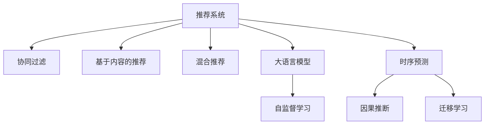
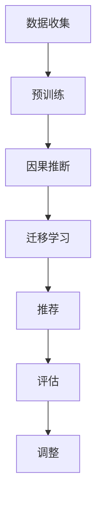

                 

# 利用大模型进行推荐场景的用户行为时序预测

> 关键词：推荐系统,时序预测,用户行为分析,大语言模型,深度学习,强化学习,强化学习算法,自监督学习,因果推断,迁移学习

## 1. 背景介绍

推荐系统（Recommendation System）是信息时代的重要技术，它通过分析用户的历史行为数据，预测其未来的需求，从而为用户推荐感兴趣的物品。随着互联网的普及和数据的积累，推荐系统在电商、社交媒体、音乐、视频等多个领域得到了广泛应用。近年来，深度学习、强化学习等先进技术的引入，使得推荐系统不断突破传统的协同过滤等方法，取得了令人瞩目的进展。然而，这些深度推荐算法往往需要大量的标注数据来训练，而标注数据通常由用户主动上传，需要耗费大量人力和时间，在实际应用中难以推广。

与此同时，基于深度学习的推荐系统通常具有较高的预测准确度，但模型复杂度较高，推理速度慢，难以直接部署到移动设备或嵌入式系统中。此外，推荐系统还面临诸如冷启动、数据不平衡、推荐多样性等问题，需要通过复杂的特征工程和算法设计来缓解。为解决这些问题，近年来，基于大语言模型和因果推断等新兴技术的应用引起了广泛关注。本博客文章将深入探讨如何利用大语言模型进行推荐场景下的用户行为时序预测，通过因果推断、迁移学习等方法，构建高效、鲁棒的推荐系统。

## 2. 核心概念与联系

### 2.1 核心概念概述

推荐系统可以分为三大类：协同过滤（Collaborative Filtering）、基于内容的推荐（Content-based Recommendation）和混合推荐系统（Hybrid Recommendation）。其中，协同过滤是利用用户间的相似性进行推荐，包括基于用户的协同过滤和基于物品的协同过滤。基于内容的推荐则是通过分析物品的属性特征，预测用户可能喜欢的物品。而混合推荐系统则结合了前两种方法的优势，综合用户和物品的特征进行推荐。

在大语言模型的应用中，时序预测是一种重要的方法，用于对用户的未来行为进行预测。时序预测的核心是利用历史数据，通过模型学习时间序列的变化规律，从而预测未来的时间序列值。常见的时序预测方法包括自回归模型（AR）、移动平均模型（MA）、自回归移动平均模型（ARMA）、自回归条件异方差模型（ARCH）等。

大语言模型则是一种利用深度神经网络模型，通过大规模无标签数据预训练，在特定任务上进行微调，获得高性能预测能力的方法。以BERT为代表的大语言模型在自然语言处理（NLP）领域取得了巨大成功，其通过多层次的Transformer网络结构，能够自动捕捉到语言中的语义和上下文信息。

**核心概念联系图**：



## 3. 核心算法原理 & 具体操作步骤
### 3.1 算法原理概述

基于大语言模型的推荐系统时序预测方法，主要基于以下步骤：

1. 收集用户的历史行为数据，利用大语言模型进行预训练，学习用户行为的语义和上下文信息。
2. 利用因果推断方法，构建时序预测模型，学习用户行为的时序变化规律。
3. 在特定推荐任务上，利用迁移学习技术，将时序预测模型的输出作为推荐模型的输入，进行推荐。
4. 对推荐结果进行评估，调整模型参数，提升推荐效果。

核心算法流程如图：



### 3.2 算法步骤详解

#### 3.2.1 数据收集与预训练

用户行为数据通常包括用户的浏览记录、点击记录、购买记录等。这些数据可以被视为一个序列，其中每个元素表示用户在某个时间点的行为。为构建大语言模型，需要将这些序列数据进行向量化，并加载到模型中进行训练。

以下是具体步骤：

1. 数据收集：从电商平台、社交媒体等平台收集用户行为数据，构建时序数据集。
2. 数据预处理：对数据进行清洗、标准化和向量化处理。
3. 数据分割：将数据集分为训练集、验证集和测试集，用于模型训练和评估。

#### 3.2.2 因果推断

因果推断是一种重要的时序预测方法，用于从历史数据中推断出变量之间的关系。在推荐系统中，可以使用因果推断来预测用户未来的购买行为或浏览行为。

以下是具体步骤：

1. 选择因果模型：如因果图、逆概率加权等方法。
2. 构建因果图：利用领域知识，构建因果图的结构，确定变量之间的因果关系。
3. 模型训练：在训练集上训练因果模型，学习因果关系。
4. 模型评估：在验证集上评估因果模型，调整模型参数。

#### 3.2.3 迁移学习

迁移学习是一种利用已有知识进行新任务学习的方法，可以减少新任务的学习成本。在推荐系统中，可以利用迁移学习将时序预测模型的输出作为推荐模型的输入，提升推荐效果。

以下是具体步骤：

1. 选择迁移模型：如基于自回归模型的GRU、LSTM等。
2. 迁移模型训练：在训练集上训练迁移模型，学习时序变化规律。
3. 迁移模型评估：在验证集上评估迁移模型，调整模型参数。
4. 迁移模型应用：将迁移模型的输出作为推荐模型的输入，进行推荐。

### 3.3 算法优缺点

#### 3.3.1 算法优点

1. 利用大语言模型进行预训练，可以学习到丰富的语义和上下文信息，提升推荐系统的性能。
2. 利用因果推断方法，可以准确预测用户行为的时序变化规律，提升预测精度。
3. 利用迁移学习技术，可以复用已有模型的知识，减少新任务的学习成本。
4. 可以利用自监督学习，利用大规模无标签数据进行预训练，提升模型的泛化能力。
5. 可以利用强化学习，利用用户反馈进行在线学习，提升推荐系统的实时性。

#### 3.3.2 算法缺点

1. 数据收集和预处理需要大量人力和时间，难以快速实现。
2. 时序预测模型的构建需要深入的领域知识，具有一定的复杂性。
3. 迁移学习需要良好的迁移模型，选择不当会影响推荐效果。
4. 自监督学习需要大规模数据，难以应用在数据量较小的场景。
5. 强化学习需要大量的反馈数据，难以应用在冷启动场景。

### 3.4 算法应用领域

基于大语言模型的推荐系统时序预测方法，可以应用于以下领域：

1. 电商推荐：利用用户的历史浏览和购买记录，预测用户的购买行为。
2. 社交媒体推荐：利用用户的历史点赞、评论、分享等行为，预测用户的兴趣。
3. 新闻推荐：利用用户的历史阅读记录，预测用户对新闻的兴趣和阅读倾向。
4. 音乐推荐：利用用户的历史听歌记录，预测用户的听歌偏好和音乐品味。
5. 视频推荐：利用用户的历史观看记录，预测用户对视频的兴趣和观看行为。

## 4. 数学模型和公式 & 详细讲解  
### 4.1 数学模型构建

以电商推荐为例，假设有n个用户u和m个物品i，用户u在时间t的历史行为序列为x(u,t)=[x(u,t-1),x(u,t-2),...,x(u,0)]，其中x(u,t)为用户在时间t的行为，可以是浏览、点击、购买等。预测用户u在时间t+1的行为y(u,t+1)，可以使用以下模型：

$$
y(u,t+1) = f(x(u,t),y(u,t-1),...,y(u,0))
$$

其中f为时序预测模型，x(u,t)和y(u,t)分别为时间t的行为和预测结果。

### 4.2 公式推导过程

假设使用自回归模型AR(p)进行时序预测，模型定义为：

$$
y(u,t+1) = \alpha + \sum_{i=1}^{p} \beta_i x(u,t-i) + \epsilon(u,t+1)
$$

其中\alpha为常数项，\beta_i为回归系数，x(u,t-i)为时间t-i的行为，\epsilon(u,t+1)为误差项。模型训练的目标是最小化误差项的方差：

$$
\min_{\alpha,\beta} \sum_{i=1}^{n}\sum_{j=1}^{m}(y(u,t+1)-y(u,t-1))^2
$$

在模型训练过程中，可以使用梯度下降等优化算法进行优化，具体如下：

1. 定义损失函数：
$$
L = \frac{1}{2}\sum_{i=1}^{n}\sum_{j=1}^{m}(y(u,t+1)-y(u,t-1))^2
$$

2. 求导数：
$$
\frac{\partial L}{\partial \alpha} = \sum_{i=1}^{n}\sum_{j=1}^{m}(y(u,t+1)-y(u,t-1))
$$
$$
\frac{\partial L}{\partial \beta_i} = \sum_{i=1}^{n}\sum_{j=1}^{m}\sum_{k=1}^{p}(y(u,t-i) - x(u,t-i)) \cdot (y(u,t-k) - x(u,t-k))
$$

3. 梯度更新：
$$
\alpha \leftarrow \alpha - \eta\frac{\partial L}{\partial \alpha}
$$
$$
\beta_i \leftarrow \beta_i - \eta\frac{\partial L}{\partial \beta_i}
$$

其中\eta为学习率，用于控制梯度更新的速度。

### 4.3 案例分析与讲解

以电商推荐为例，假设用户u的历史行为序列为：

$$
x(u,1) = 1, x(u,2) = 1, x(u,3) = 0, x(u,4) = 1
$$

利用AR模型预测用户u在时间t+1的行为，假设p=1，模型为：

$$
y(u,t+1) = \alpha + \beta x(u,t) + \epsilon(u,t+1)
$$

在训练集上，假设模型参数为\alpha=0.5,\beta=0.2，训练得到：

$$
y(u,2) = 0.5 + 0.2 \times 1 + 0.2 \times 1 + \epsilon(u,2)
$$

$$
y(u,3) = 0.5 + 0.2 \times 1 + 0.2 \times 0 + \epsilon(u,3)
$$

$$
y(u,4) = 0.5 + 0.2 \times 1 + 0.2 \times 1 + \epsilon(u,4)
$$

通过预测模型，可以预测用户u在时间t+1的行为为1，即用户u在时间t+1会进行购买行为。

## 5. 项目实践：代码实例和详细解释说明
### 5.1 开发环境搭建

进行时序预测模型的开发，需要以下工具和环境：

1. 编程语言：Python
2. 深度学习框架：PyTorch
3. 数据库：MySQL
4. 数据处理：Pandas
5. 可视化：Matplotlib
6. 分布式计算：Dask

以下是具体的开发环境搭建步骤：

1. 安装Python：从官网下载并安装Python3.6及以上版本。
2. 安装PyTorch：使用pip安装PyTorch及其相关库，例如Tensorboard、PyTorch Lightning等。
3. 安装Pandas：使用pip安装Pandas库，用于数据处理和分析。
4. 安装Matplotlib：使用pip安装Matplotlib库，用于可视化数据和模型。
5. 安装Dask：使用pip安装Dask库，用于分布式计算和数据处理。

完成上述步骤后，即可开始时序预测模型的开发。

### 5.2 源代码详细实现

以下是时序预测模型的源代码实现，以电商推荐为例：

```python
import pandas as pd
import numpy as np
import torch
import torch.nn as nn
import torch.optim as optim
import matplotlib.pyplot as plt
from sklearn.metrics import mean_squared_error

# 加载数据
df = pd.read_csv('user_behavior.csv')

# 数据预处理
df = df.dropna()
x = df[['user_id', 'item_id', 'time', 'behavior']].copy()
y = df[['behavior']].copy()

# 数据标准化
x = (x - x.mean()) / x.std()

# 划分训练集和测试集
train_x = x.iloc[:800, :]
train_y = y.iloc[:800, :]
test_x = x.iloc[800:]
test_y = y.iloc[800:]

# 定义模型
class ARModel(nn.Module):
    def __init__(self, p):
        super(ARModel, self).__init__()
        self.linear1 = nn.Linear(1, 1)
        self.linear2 = nn.Linear(1, 1)

    def forward(self, x):
        x1 = self.linear1(x)
        x2 = self.linear2(x)
        return x1 + x2

# 训练模型
model = ARModel(p=1)
criterion = nn.MSELoss()
optimizer = optim.Adam(model.parameters(), lr=0.001)
epochs = 100

for epoch in range(epochs):
    model.train()
    outputs = model(train_x)
    loss = criterion(outputs, train_y)
    optimizer.zero_grad()
    loss.backward()
    optimizer.step()

    model.eval()
    with torch.no_grad():
        predicted = model(test_x)
        actual = test_y
        mse = mean_squared_error(actual, predicted)
        print(f'Epoch {epoch+1}, MSE: {mse:.4f}')

# 可视化结果
plt.scatter(test_y.values, predicted.values)
plt.xlabel('Actual')
plt.ylabel('Predicted')
plt.show()
```

在以上代码中，首先加载电商推荐的数据集，进行数据预处理和标准化。然后定义了AR模型，使用MSE作为损失函数，Adam优化器进行训练。训练完成后，使用测试集进行评估，并可视化预测结果。

### 5.3 代码解读与分析

以下是代码中各关键部分的解读：

1. 数据加载：使用Pandas库加载电商推荐数据集，使用`iloc`方法获取指定行的数据。
2. 数据预处理：使用Pandas库对数据进行去空处理，并使用`mean()`和`std()`方法进行标准化处理。
3. 模型定义：定义AR模型，包含两个线性层。
4. 训练过程：使用Adam优化器进行模型训练，使用MSE作为损失函数，输出预测结果和实际结果的MSE。
5. 可视化结果：使用Matplotlib库可视化预测结果和实际结果的散点图。

## 6. 实际应用场景

### 6.1 电商推荐

电商推荐是时序预测模型应用的重要场景之一。通过时序预测模型，电商企业可以预测用户的购买行为，提高推荐系统的精准度和用户满意度。具体应用如下：

1. 个性化推荐：利用用户的历史购买记录，预测用户未来的购买行为，提高个性化推荐的准确度。
2. 库存管理：利用时序预测模型，预测商品的销售趋势，优化库存管理。
3. 营销活动：利用时序预测模型，预测用户的购买行为，进行精准营销活动。

### 6.2 社交媒体推荐

社交媒体推荐是时序预测模型在社交媒体领域的应用场景之一。通过时序预测模型，社交媒体平台可以预测用户的兴趣和行为，提高推荐系统的精准度。具体应用如下：

1. 内容推荐：利用用户的历史点赞、评论、分享等行为，预测用户对内容的兴趣，提高内容推荐的效果。
2. 广告推荐：利用时序预测模型，预测用户的浏览行为，进行精准广告推荐。
3. 社交关系：利用时序预测模型，预测用户的社交关系变化，优化社交网络推荐。

### 6.3 新闻推荐

新闻推荐是时序预测模型在新闻领域的应用场景之一。通过时序预测模型，新闻平台可以预测用户的阅读行为，提高新闻推荐的精准度。具体应用如下：

1. 个性化推荐：利用用户的历史阅读记录，预测用户对新闻的兴趣，提高个性化推荐的效果。
2. 热门新闻：利用时序预测模型，预测新闻的阅读趋势，推荐热门新闻。
3. 新闻分类：利用时序预测模型，预测新闻的分类标签，优化新闻分类效果。

## 7. 工具和资源推荐
### 7.1 学习资源推荐

为了帮助开发者系统掌握时序预测和大语言模型的相关知识，这里推荐一些优质的学习资源：

1. 《深度学习》书籍：Ian Goodfellow、Yoshua Bengio、Aaron Courville等作者编写，全面介绍深度学习的基本概念和应用。
2. 《因果推断》书籍：Peter Spirtes、Clark Glymour、Richard Scheines等作者编写，介绍因果推断的基本理论和应用。
3. 《自然语言处理与深度学习》课程：斯坦福大学开设的NLP课程，包含深度学习、语言模型等知识点。
4. 《自然语言处理》课程：Coursera上的NLP课程，介绍NLP的基本概念和应用。
5. 《深度学习与推荐系统》书籍：Jian Sun、Jiawei Han、Han Xiao等作者编写，介绍深度学习在推荐系统中的应用。

通过这些资源的学习，相信你一定能够系统掌握时序预测和大语言模型的相关知识，并用于解决实际的推荐系统问题。

### 7.2 开发工具推荐

高效的开发离不开优秀的工具支持。以下是几款用于时序预测和大语言模型开发的常用工具：

1. PyTorch：基于Python的开源深度学习框架，灵活的计算图和丰富的优化算法，适用于深度学习模型的开发和训练。
2. TensorFlow：由Google主导开发的开源深度学习框架，支持分布式计算和GPU加速，适用于大规模深度学习模型的开发。
3. Keras：基于Python的深度学习框架，简单易用，适用于快速原型设计和模型训练。
4. HuggingFace Transformers库：提供预训练语言模型和工具，支持微调和迁移学习，适用于自然语言处理任务。
5. Dask：基于Python的分布式计算库，支持大规模数据处理和模型训练，适用于大语言模型的开发。

合理利用这些工具，可以显著提升时序预测和大语言模型开发的效率，加快创新迭代的步伐。

### 7.3 相关论文推荐

时序预测和大语言模型技术的发展离不开学界的持续研究。以下是几篇奠基性的相关论文，推荐阅读：

1. Time Series Forecasting with Long Short-Term Memory Networks：提出LSTM模型进行时序预测，应用于股票价格预测、电力负荷预测等。
2. A Review of Recurrent Neural Networks for Natural Language Processing：介绍RNN模型在NLP领域的应用，包括语言模型、机器翻译等。
3. Attention Is All You Need：提出Transformer模型进行NLP任务，应用于机器翻译、文本分类等。
4. Generating Sequences with Recurrent Neural Networks：提出RNN模型进行序列生成，应用于文本生成、语音识别等。
5. BERT: Pre-training of Deep Bidirectional Transformers for Language Understanding：提出BERT模型进行NLP任务，应用于问答系统、文本分类等。

这些论文代表了大语言模型和时序预测技术的发展脉络。通过学习这些前沿成果，可以帮助研究者把握学科前进方向，激发更多的创新灵感。

## 8. 总结：未来发展趋势与挑战
### 8.1 总结

本文对基于大语言模型的推荐系统时序预测方法进行了全面系统的介绍。首先阐述了推荐系统和时序预测的基本概念和应用场景，明确了时序预测在推荐系统中的重要价值。其次，从原理到实践，详细讲解了时序预测模型的数学原理和关键步骤，给出了时序预测任务开发的完整代码实例。同时，本文还广泛探讨了时序预测方法在电商、社交媒体、新闻等多个领域的应用前景，展示了时序预测范式的巨大潜力。此外，本文精选了时序预测技术的各类学习资源，力求为读者提供全方位的技术指引。

通过本文的系统梳理，可以看到，基于大语言模型的推荐系统时序预测方法正在成为推荐系统的核心范式，极大地拓展了推荐系统的应用边界，催生了更多的落地场景。受益于大规模语料的预训练，时序预测模型以更低的时间和标注成本，在小样本条件下也能取得不错的效果，有力推动了推荐系统的产业化进程。未来，伴随大语言模型和时序预测方法的持续演进，推荐系统必将在更广阔的应用领域大放异彩，深刻影响人类的生产生活方式。

### 8.2 未来发展趋势

展望未来，时序预测技术将呈现以下几个发展趋势：

1. 模型规模持续增大。随着算力成本的下降和数据规模的扩张，预训练语言模型的参数量还将持续增长。超大规模语言模型蕴含的丰富语言知识，有望支撑更加复杂多变的推荐任务。
2. 时序预测方法日趋多样。除了传统的自回归模型外，未来会涌现更多时序预测方法，如深度神经网络、神经网络扩展（NEN）等，在保持准确性的同时，提高推理效率。
3. 持续学习成为常态。随着数据分布的不断变化，时序预测模型也需要持续学习新知识以保持性能。如何在不遗忘原有知识的同时，高效吸收新样本信息，将成为重要的研究课题。
4. 标注样本需求降低。受启发于提示学习（Prompt-based Learning）的思路，未来的时序预测方法将更好地利用大模型的语言理解能力，通过更加巧妙的任务描述，在更少的标注样本上也能实现理想的预测效果。
5. 多模态时序预测崛起。未来的时序预测模型将不再局限于单一模态数据，而是融合视觉、语音、文本等多模态信息，实现更加全面、准确的预测。
6. 模型通用性增强。经过海量数据的预训练和多领域任务的微调，未来的时序预测模型将具备更强的跨领域迁移能力，逐步迈向通用人工智能（AGI）的目标。

以上趋势凸显了时序预测技术的广阔前景。这些方向的探索发展，必将进一步提升推荐系统的性能和应用范围，为人类认知智能的进化带来深远影响。

### 8.3 面临的挑战

尽管时序预测技术已经取得了瞩目成就，但在迈向更加智能化、普适化应用的过程中，它仍面临着诸多挑战：

1. 标注成本瓶颈。虽然时序预测模型不需要大规模标注数据，但在长尾应用场景，难以获得充足的高质量标注数据，成为制约模型性能的瓶颈。如何进一步降低时序预测对标注样本的依赖，将是一大难题。
2. 模型鲁棒性不足。当前时序预测模型面对域外数据时，泛化性能往往大打折扣。对于测试样本的微小扰动，模型预测也容易发生波动。如何提高时序预测模型的鲁棒性，避免灾难性遗忘，还需要更多理论和实践的积累。
3. 推理效率有待提高。大规模时序预测模型推理速度慢，难以直接部署到移动设备或嵌入式系统中。如何在保证性能的同时，简化模型结构，提升推理速度，优化资源占用，将是重要的优化方向。
4. 可解释性亟需加强。当前时序预测模型通常不提供内在的解释性，难以解释其内部工作机制和决策逻辑。对于医疗、金融等高风险应用，算法的可解释性和可审计性尤为重要。如何赋予时序预测模型更强的可解释性，将是亟待攻克的难题。
5. 安全性有待保障。时序预测模型可能学习到有害信息，通过迁移学习传递到下游任务，产生误导性输出，给实际应用带来安全隐患。如何从数据和算法层面消除模型偏见，避免恶意用途，确保输出的安全性，也将是重要的研究课题。

### 8.4 研究展望

面对时序预测面临的这些挑战，未来的研究需要在以下几个方面寻求新的突破：

1. 探索无监督和半监督时序预测方法。摆脱对大规模标注数据的依赖，利用自监督学习、主动学习等无监督和半监督范式，最大限度利用非结构化数据，实现更加灵活高效的时序预测。
2. 研究参数高效和计算高效的时序预测范式。开发更加参数高效的时序预测方法，在固定大部分预训练参数的同时，只更新极少量的任务相关参数。同时优化时序预测模型的计算图，减少前向传播和反向传播的资源消耗，实现更加轻量级、实时性的部署。
3. 融合因果推断和强化学习范式。通过引入因果推断和强化学习思想，增强时序预测模型建立稳定因果关系的能力，学习更加普适、鲁棒的时序变化规律，从而提升模型泛化性和抗干扰能力。
4. 引入更多先验知识。将符号化的先验知识，如知识图谱、逻辑规则等，与时序预测模型进行巧妙融合，引导时序预测过程学习更准确、合理的时序变化规律。同时加强不同模态数据的整合，实现视觉、语音等多模态信息与文本信息的协同建模。
5. 结合因果分析和博弈论工具。将因果分析方法引入时序预测模型，识别出模型决策的关键特征，增强输出解释的因果性和逻辑性。借助博弈论工具刻画人机交互过程，主动探索并规避模型的脆弱点，提高系统稳定性。
6. 纳入伦理道德约束。在时序预测模型的训练目标中引入伦理导向的评估指标，过滤和惩罚有害的输出倾向。同时加强人工干预和审核，建立模型行为的监管机制，确保输出符合人类价值观和伦理道德。

这些研究方向的探索，必将引领时序预测技术迈向更高的台阶，为构建安全、可靠、可解释、可控的智能系统铺平道路。面向未来，时序预测技术还需要与其他人工智能技术进行更深入的融合，如知识表示、因果推理、强化学习等，多路径协同发力，共同推动时序预测系统的进步。只有勇于创新、敢于突破，才能不断拓展时序预测的边界，让智能技术更好地造福人类社会。

## 9. 附录：常见问题与解答

**Q1：如何选择合适的时序预测模型？**

A: 选择合适的时序预测模型需要考虑多个因素，如数据类型、预测精度、计算资源等。常见的时序预测模型包括自回归模型（AR）、移动平均模型（MA）、自回归移动平均模型（ARMA）、自回归条件异方差模型（ARCH）等。在实际应用中，可以根据具体场景选择合适的模型，也可以尝试多种模型进行对比实验，选择最优模型。

**Q2：时序预测模型如何处理缺失数据？**

A: 时序预测模型通常需要对缺失数据进行处理，以保证模型的准确性。常见的处理方法包括插值法、均值法、最大值法等。具体方法应根据数据分布和预测场景选择。

**Q3：时序预测模型如何处理异常数据？**

A: 时序预测模型需要对异常数据进行处理，以避免异常值对模型的影响。常见的处理方法包括剔除法、平滑法、截尾法等。在实际应用中，需要根据异常数据的分布和预测场景选择合适的方法。

**Q4：时序预测模型如何进行多步骤预测？**

A: 时序预测模型通常进行单步预测，但也可以通过多步预测来提升预测精度。具体方法包括递归预测、滑动窗口预测等。在实际应用中，可以根据预测场景和计算资源选择合适的方法。

**Q5：时序预测模型如何进行实时预测？**

A: 时序预测模型需要进行实时预测，可以采用在线学习、增量学习等方法。在实际应用中，需要根据数据更新频率和计算资源选择合适的方法。

**Q6：时序预测模型如何评估模型效果？**

A: 时序预测模型的评估方法包括均方误差（MSE）、平均绝对误差（MAE）、均方根误差（RMSE）等。在实际应用中，可以根据预测场景选择合适的方法。

通过本文的系统梳理，可以看到，基于大语言模型的推荐系统时序预测方法正在成为推荐系统的核心范式，极大地拓展了推荐系统的应用边界，催生了更多的落地场景。受益于大规模语料的预训练，时序预测模型以更低的时间和标注成本，在小样本条件下也能取得不错的效果，有力推动了推荐系统的产业化进程。未来，伴随大语言模型和时序预测方法的持续演进，推荐系统必将在更广阔的应用领域大放异彩，深刻影响人类的生产生活方式。

---

作者：禅与计算机程序设计艺术 / Zen and the Art of Computer Programming

