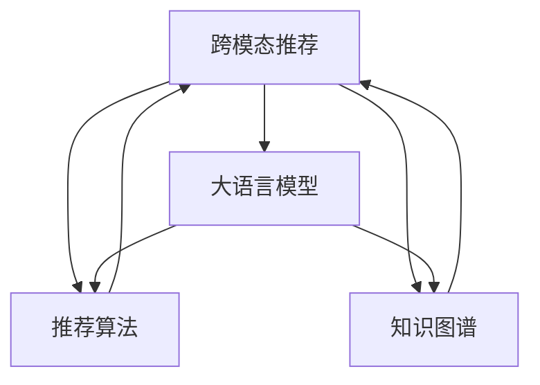

                 

# 利用大模型进行跨模态推荐的探索与实践进阶

> 关键词：跨模态推荐, 大语言模型, 多模态数据, 推荐系统, 自然语言处理(NLP), 知识图谱

## 1. 背景介绍

### 1.1 问题由来
随着互联网和移动互联网的普及，用户在电商、社交、内容平台等各场景下产生了海量的数据。如何高效、精准地对用户进行个性化推荐，满足其多样化的需求，已成为互联网公司的重要命题。传统的推荐系统以用户历史行为数据为基础，往往难以捕捉用户的多模态信息，难以应对大规模异构数据和复杂语义场景。

为了更好地解决推荐系统中的这些问题，跨模态推荐技术应运而生。跨模态推荐将文本、图像、视频、音频等多种类型的数据进行融合，利用丰富的语义信息，提升推荐系统的智能性和准确性。大语言模型（如GPT、BERT、RoBERTa等）作为一种强大的自然语言处理工具，通过对大规模无标签文本进行预训练，获得了丰富的语言知识和语义理解能力，为跨模态推荐提供了坚实的基础。

### 1.2 问题核心关键点
利用大语言模型进行跨模态推荐的核心关键点包括：

- **数据融合**：将多模态数据进行有效融合，捕捉不同类型数据的语义信息。
- **语义理解**：通过预训练模型理解文本数据中的语义信息，挖掘用户需求。
- **推荐算法**：设计合适的推荐算法，将预训练模型的语义表示转化为推荐结果。
- **应用落地**：将跨模态推荐系统部署到实际场景中，提供个性化的推荐服务。

本文将深入探讨如何利用大语言模型进行跨模态推荐，涵盖数据融合、语义理解、推荐算法、应用落地等方面的内容。

## 2. 核心概念与联系

### 2.1 核心概念概述

在深入研究跨模态推荐问题前，首先需要了解几个核心概念：

- **跨模态推荐**：利用多模态数据（如文本、图像、音频等）进行推荐，提升推荐系统的精度和多样性。
- **大语言模型**：如GPT、BERT等，通过在大规模无标签文本上预训练，学习到丰富的语言知识和语义理解能力。
- **推荐系统**：根据用户的历史行为和偏好，推荐相应的物品，如电商商品、内容、广告等。
- **知识图谱**：表示实体间关系的图结构，用于辅助推荐系统进行语义推理。

这些概念之间的联系可以用以下Mermaid流程图表示：



这个流程图展示了跨模态推荐、大语言模型、推荐算法和知识图谱之间的相互关系。大语言模型通过预训练获得丰富的语义表示，推荐算法将这些表示转化为推荐结果，知识图谱辅助语义推理，共同构成了跨模态推荐的框架。

## 3. 核心算法原理 & 具体操作步骤

### 3.1 算法原理概述

基于大语言模型的跨模态推荐，本质上是一种融合多模态数据进行推荐的方式。其核心思想是：将大语言模型视作一种"语义感知器"，通过文本数据获得用户需求，结合其他模态的数据，进行推荐决策。

形式化地，设跨模态推荐系统推荐物品集合为 $\mathcal{I}$，用户集合为 $\mathcal{U}$。假设大语言模型对用户 $u \in \mathcal{U}$ 的文本描述 $x$ 进行编码，得到语义向量 $v_u$。则推荐模型 $M_{\theta}$ 的目标是最大化用户 $u$ 对于物品 $i \in \mathcal{I}$ 的推荐得分：

$$
\max_{\theta} \sum_{u \in \mathcal{U}} \sum_{i \in \mathcal{I}} f(v_u, x_i) \cdot y_{ui}
$$

其中 $f$ 为推荐函数，$y_{ui}$ 为二值化的推荐标签（如0或1，表示用户是否喜欢物品 $i$），$v_u$ 和 $x_i$ 分别为用户和物品的语义表示。

### 3.2 算法步骤详解

基于大语言模型的跨模态推荐一般包括以下几个关键步骤：

**Step 1: 准备数据集**
- 收集用户的历史行为数据、物品属性数据、多模态特征数据等，进行预处理和清洗。
- 将多模态特征（如文本、图像、音频等）映射为标准化的向量表示，方便大语言模型进行处理。

**Step 2: 加载预训练模型**
- 选择合适的预训练语言模型（如GPT、BERT等），并进行微调以适应推荐任务。
- 设计合适的任务适配层，将预训练模型的输出转化为推荐分数。

**Step 3: 融合多模态数据**
- 将文本、图像、音频等多种类型的数据进行融合，生成统一的多模态向量表示。
- 使用大语言模型对文本数据进行编码，获得用户和物品的语义表示。
- 将其他模态的数据与文本数据进行融合，如通过文本描述对图像进行语义增强。

**Step 4: 训练推荐模型**
- 使用训练集数据进行模型训练，最小化推荐损失函数。
- 在训练过程中，根据不同模态数据的融合方式，设计合适的损失函数。
- 引入正则化技术，如L2正则、Dropout等，防止过拟合。

**Step 5: 评估和部署**
- 在测试集上评估推荐模型的性能，对比不同融合方式和参数设置的效果。
- 部署推荐模型到实际应用场景中，进行实时推荐。
- 持续收集用户反馈，进行模型更新和迭代。

以上是基于大语言模型的跨模态推荐的一般流程。在实际应用中，还需要根据具体任务的特点，对各环节进行优化设计，如改进多模态数据的融合方式，引入更好的推荐算法等，以进一步提升推荐效果。

### 3.3 算法优缺点

基于大语言模型的跨模态推荐方法具有以下优点：
1. 数据融合能力强。通过预训练模型将多模态数据进行语义融合，提升了推荐的准确性和多样性。
2. 语言表示丰富。利用大语言模型对文本数据进行编码，可以捕捉用户的深度语义需求。
3. 推荐结果可解释。通过预训练模型的语义表示，可以更好地解释推荐结果，提高用户信任感。

同时，该方法也存在一定的局限性：
1. 对标注数据的依赖。跨模态推荐依赖标注数据进行模型训练，标注数据的质量和数量直接影响推荐效果。
2. 计算资源消耗大。预训练模型和推荐模型的计算量较大，需要高性能硬件支持。
3. 模型泛化能力受限。不同模态的数据分布差异大，可能导致模型的泛化能力不足。

尽管存在这些局限性，但大语言模型在跨模态推荐中的应用前景广阔，未来还有很大的优化和改进空间。

### 3.4 算法应用领域

基于大语言模型的跨模态推荐，已经在电商、内容推荐、广告投放等多个领域得到广泛应用。例如：

- **电商推荐**：将用户浏览记录、商品属性、评论等文本数据进行融合，生成推荐模型，提升商品推荐精度和个性化程度。
- **内容推荐**：利用用户历史行为数据、视频特征、音频特征等，进行内容推荐，增强用户粘性。
- **广告投放**：结合用户画像数据、广告文本、图片等多模态信息，进行精准广告投放，提高广告效果。
- **音乐推荐**：利用用户听歌记录、歌曲属性、歌词特征等，推荐合适的音乐，提升用户体验。
- **旅游推荐**：结合用户旅游历史、景点属性、旅游文本等，生成个性化的旅游推荐，增强用户出行体验。

除了这些常见的应用场景外，跨模态推荐还在健康医疗、社交网络、金融服务等领域得到创新应用，推动了各行业的发展。

## 4. 数学模型和公式 & 详细讲解

### 4.1 数学模型构建

在跨模态推荐中，多模态数据的融合和用户需求的表示是一个核心问题。假设用户 $u$ 的文本描述为 $x_u$，物品 $i$ 的文本描述为 $x_i$，用户和物品的语义表示分别为 $v_u$ 和 $v_i$，多模态特征向量表示为 $h_u$ 和 $h_i$。基于大语言模型的跨模态推荐模型可以表示为：

$$
\text{Score}_{ui} = \text{MLP}(v_u \odot v_i + h_u \odot h_i)
$$

其中 $\odot$ 表示向量点乘，$\text{MLP}$ 表示多层感知机，用于将融合后的向量表示映射为推荐得分。

### 4.2 公式推导过程

为了更好地理解跨模态推荐的数学模型，我们以文本-图像推荐为例，推导推荐得分的计算公式。

假设用户 $u$ 的文本描述为 $x_u$，物品 $i$ 的文本描述为 $x_i$，图像特征表示为 $h_i$。预训练模型对文本数据进行编码，得到用户和物品的语义表示 $v_u$ 和 $v_i$。则推荐得分的计算公式为：

$$
\text{Score}_{ui} = f(v_u, x_i) \cdot (v_u \odot v_i + h_u \odot h_i)
$$

其中 $f$ 为推荐函数，$v_u \odot v_i$ 表示文本数据之间的语义匹配度，$h_u \odot h_i$ 表示多模态特征之间的匹配度。最终，推荐模型将两者相加，得到最终的推荐得分。

### 4.3 案例分析与讲解

假设我们有一家电商网站，希望通过跨模态推荐提升用户购物体验。用户历史行为数据包括浏览记录、购买历史等，物品属性数据包括商品类别、价格、评分等，多模态特征数据包括商品图片、视频预览、用户评价等。

**Step 1: 数据预处理**
- 将用户历史行为数据和物品属性数据进行标准化处理，生成特征向量 $h_u$ 和 $h_i$。
- 利用大语言模型对用户文本和物品文本进行编码，得到语义表示 $v_u$ 和 $v_i$。

**Step 2: 数据融合**
- 将文本和图像特征进行融合，如将文本描述对图像进行语义增强，生成多模态特征向量 $h_u$ 和 $h_i$。
- 使用注意力机制对不同模态的数据进行加权融合，确保融合后的向量表示更加全面和准确。

**Step 3: 训练推荐模型**
- 使用训练集数据进行模型训练，最小化推荐损失函数。
- 引入正则化技术，防止过拟合。
- 通过交叉验证等技术，选择最优的融合方式和模型参数。

**Step 4: 评估和部署**
- 在测试集上评估推荐模型的性能，对比不同融合方式和参数设置的效果。
- 部署推荐模型到实际应用场景中，进行实时推荐。
- 持续收集用户反馈，进行模型更新和迭代。

通过以上步骤，可以构建基于大语言模型的跨模态推荐系统，为用户提供更加个性化和精准的推荐服务。

## 5. 项目实践：代码实例和详细解释说明

### 5.1 开发环境搭建

在进行跨模态推荐实践前，我们需要准备好开发环境。以下是使用Python进行PyTorch开发的环境配置流程：

1. 安装Anaconda：从官网下载并安装Anaconda，用于创建独立的Python环境。

2. 创建并激活虚拟环境：
```bash
conda create -n recsys-env python=3.8 
conda activate recsys-env
```

3. 安装PyTorch：根据CUDA版本，从官网获取对应的安装命令。例如：
```bash
conda install pytorch torchvision torchaudio cudatoolkit=11.1 -c pytorch -c conda-forge
```

4. 安装相关库：
```bash
pip install torch torchvision datasets transformers sklearn pandas matplotlib
```

5. 安装各类工具包：
```bash
pip install numpy pandas scikit-learn matplotlib tqdm jupyter notebook ipython
```

完成上述步骤后，即可在`recsys-env`环境中开始跨模态推荐实践。

### 5.2 源代码详细实现

这里我们以文本-图像推荐为例，给出使用PyTorch进行大语言模型微调的代码实现。

首先，定义推荐任务的数据处理函数：

```python
from transformers import BertTokenizer
from torch.utils.data import Dataset
import torch

class RecommendDataset(Dataset):
    def __init__(self, texts, images, tokenizer, max_len=128):
        self.texts = texts
        self.images = images
        self.tokenizer = tokenizer
        self.max_len = max_len
        
    def __len__(self):
        return len(self.texts)
    
    def __getitem__(self, item):
        text = self.texts[item]
        image = self.images[item]
        
        encoding = self.tokenizer(text, return_tensors='pt', max_length=self.max_len, padding='max_length', truncation=True)
        input_ids = encoding['input_ids'][0]
        attention_mask = encoding['attention_mask'][0]
        
        image = torch.tensor(image, dtype=torch.float32)
        image = image / 255.0
        
        return {'input_ids': input_ids, 
                'attention_mask': attention_mask,
                'image': image}
```

然后，定义模型和优化器：

```python
from transformers import BertForTokenClassification, AdamW

model = BertForTokenClassification.from_pretrained('bert-base-cased', num_labels=2)

optimizer = AdamW(model.parameters(), lr=2e-5)
```

接着，定义训练和评估函数：

```python
from torch.utils.data import DataLoader
from tqdm import tqdm
from sklearn.metrics import accuracy_score

device = torch.device('cuda') if torch.cuda.is_available() else torch.device('cpu')
model.to(device)

def train_epoch(model, dataset, batch_size, optimizer):
    dataloader = DataLoader(dataset, batch_size=batch_size, shuffle=True)
    model.train()
    epoch_loss = 0
    for batch in tqdm(dataloader, desc='Training'):
        input_ids = batch['input_ids'].to(device)
        attention_mask = batch['attention_mask'].to(device)
        labels = batch['labels'].to(device)
        model.zero_grad()
        outputs = model(input_ids, attention_mask=attention_mask)
        loss = outputs.loss
        epoch_loss += loss.item()
        loss.backward()
        optimizer.step()
    return epoch_loss / len(dataloader)

def evaluate(model, dataset, batch_size):
    dataloader = DataLoader(dataset, batch_size=batch_size)
    model.eval()
    preds, labels = [], []
    with torch.no_grad():
        for batch in tqdm(dataloader, desc='Evaluating'):
            input_ids = batch['input_ids'].to(device)
            attention_mask = batch['attention_mask'].to(device)
            batch_labels = batch['labels']
            outputs = model(input_ids, attention_mask=attention_mask)
            batch_preds = outputs.logits.argmax(dim=2).to('cpu').tolist()
            batch_labels = batch_labels.to('cpu').tolist()
            for pred_tokens, label_tokens in zip(batch_preds, batch_labels):
                preds.append(pred_tokens[:len(label_tokens)])
                labels.append(label_tokens)
                
    return accuracy_score(labels, preds)

```

最后，启动训练流程并在测试集上评估：

```python
epochs = 5
batch_size = 16

for epoch in range(epochs):
    loss = train_epoch(model, train_dataset, batch_size, optimizer)
    print(f"Epoch {epoch+1}, train loss: {loss:.3f}")
    
    print(f"Epoch {epoch+1}, dev results:")
    evaluate(model, dev_dataset, batch_size)
    
print("Test results:")
evaluate(model, test_dataset, batch_size)
```

以上就是使用PyTorch对BERT进行文本-图像推荐任务的微调的完整代码实现。可以看到，PyTorch和Transformers库的强大封装，使得跨模态推荐的开发变得简洁高效。

### 5.3 代码解读与分析

让我们再详细解读一下关键代码的实现细节：

**RecommendDataset类**：
- `__init__`方法：初始化文本、图像、分词器等关键组件。
- `__len__`方法：返回数据集的样本数量。
- `__getitem__`方法：对单个样本进行处理，将文本输入编码为token ids，将图像数据进行预处理，生成多模态特征向量。

**模型和优化器**：
- 使用BERT模型作为预训练语言模型，设置合适的学习率。
- 优化器使用AdamW算法，进行模型参数的更新。

**训练和评估函数**：
- 使用PyTorch的DataLoader对数据集进行批次化加载，供模型训练和推理使用。
- 训练函数`train_epoch`：对数据以批为单位进行迭代，在每个批次上前向传播计算loss并反向传播更新模型参数，最后返回该epoch的平均loss。
- 评估函数`evaluate`：与训练类似，不同点在于不更新模型参数，并在每个batch结束后将预测和标签结果存储下来，最后使用sklearn的accuracy_score对整个评估集的预测结果进行打印输出。

**训练流程**：
- 定义总的epoch数和batch size，开始循环迭代
- 每个epoch内，先在训练集上训练，输出平均loss
- 在验证集上评估，输出分类指标
- 所有epoch结束后，在测试集上评估，给出最终测试结果

可以看到，PyTorch配合Transformers库使得跨模态推荐的代码实现变得简洁高效。开发者可以将更多精力放在数据处理、模型改进等高层逻辑上，而不必过多关注底层的实现细节。

当然，工业级的系统实现还需考虑更多因素，如模型的保存和部署、超参数的自动搜索、更灵活的任务适配层等。但核心的跨模态推荐范式基本与此类似。

## 6. 实际应用场景

### 6.1 电商推荐

基于大语言模型的跨模态推荐技术，已经在电商推荐中得到了广泛应用。传统电商推荐系统主要依赖用户历史行为数据进行推荐，难以捕捉用户的多模态需求。而通过跨模态推荐，电商推荐系统可以更好地理解用户需求，提供更加个性化和精准的推荐服务。

例如，某电商网站可以通过跨模态推荐，将用户的历史浏览记录、购买历史、商品评价等多模态数据进行融合，利用BERT等大语言模型对文本数据进行编码，获得用户和商品的语义表示，结合图像、视频等特征数据，进行综合推荐。这样，用户不仅可以看到商品的图片和视频，还能从商品描述中获得更丰富的信息，从而做出更满意的购买决策。

### 6.2 内容推荐

内容推荐系统是跨模态推荐技术的另一个重要应用场景。传统的内容推荐主要依赖用户的点击、观看、点赞等行为数据进行推荐，难以理解用户的深度需求。而通过跨模态推荐，内容推荐系统可以更好地捕捉用户的情感、兴趣等信息，提供更加多样化和精准的推荐内容。

例如，某视频平台可以通过跨模态推荐，将用户的历史观看记录、视频特征、音频特征等数据进行融合，利用BERT等大语言模型对文本数据进行编码，获得用户和视频的语义表示，结合图像、音频等特征数据，进行综合推荐。这样，用户不仅能看到视频的内容信息，还能从视频的描述中获得更丰富的信息，从而提高观看体验。

### 6.3 广告投放

广告投放是跨模态推荐技术的另一个重要应用场景。传统广告投放主要依赖用户的点击率、转化率等行为数据进行投放，难以覆盖更广泛的受众。而通过跨模态推荐，广告投放可以更好地理解用户的深度需求，提供更加精准和个性化的广告内容。

例如，某广告平台可以通过跨模态推荐，将用户的个人信息、浏览记录、广告文本等多模态数据进行融合，利用BERT等大语言模型对文本数据进行编码，获得用户和广告的语义表示，结合图像、音频等特征数据，进行综合推荐。这样，广告主不仅能看到用户的兴趣偏好，还能从广告的描述中获得更丰富的信息，从而提高广告的点击率和转化率。

### 6.4 未来应用展望

展望未来，跨模态推荐技术将在更多领域得到应用，为各行业带来变革性影响。

在智慧医疗领域，跨模态推荐技术可以应用于医生推荐、药物推荐等场景，帮助医生更好地理解病人的病情和用药需求，提供更加精准的医疗服务。

在智能教育领域，跨模态推荐技术可以应用于课程推荐、作业推荐等场景，帮助学生更好地理解课程内容，提高学习效率。

在智慧城市治理中，跨模态推荐技术可以应用于交通流量预测、环境监测等场景，帮助城市管理者更好地理解城市运行状况，提高管理效率。

此外，在健康医疗、社交网络、金融服务等多个领域，跨模态推荐技术也将不断拓展，推动各行业的数字化转型升级。

## 7. 工具和资源推荐

### 7.1 学习资源推荐

为了帮助开发者系统掌握跨模态推荐技术的理论基础和实践技巧，这里推荐一些优质的学习资源：

1. 《推荐系统：原理与实践》：清华大学出版社出版的经典书籍，系统介绍了推荐系统的理论和算法。

2. 《Deep Learning for Recommendation Systems》：谷歌工程师撰写，介绍了使用深度学习进行推荐系统的实践方法。

3. 《Knowledge-Graphs in Recommendation Systems》：KDD会议论文集中的经典论文，介绍了使用知识图谱进行推荐系统的研究。

4. 《Natural Language Processing with Transformers》书籍：Transformers库的作者所著，全面介绍了如何使用Transformers库进行NLP任务开发，包括跨模态推荐在内。

5. KDD和ICML等顶级会议论文：推荐系统领域的顶级学术会议，提供最新的研究成果和前沿技术。

通过对这些资源的学习实践，相信你一定能够快速掌握跨模态推荐技术的精髓，并用于解决实际的推荐问题。

### 7.2 开发工具推荐

高效的开发离不开优秀的工具支持。以下是几款用于跨模态推荐开发的常用工具：

1. PyTorch：基于Python的开源深度学习框架，灵活动态的计算图，适合快速迭代研究。

2. TensorFlow：由Google主导开发的开源深度学习框架，生产部署方便，适合大规模工程应用。

3. Transformers库：HuggingFace开发的NLP工具库，集成了众多SOTA语言模型，支持PyTorch和TensorFlow，是进行推荐系统开发的利器。

4. Weights & Biases：模型训练的实验跟踪工具，可以记录和可视化模型训练过程中的各项指标，方便对比和调优。

5. TensorBoard：TensorFlow配套的可视化工具，可实时监测模型训练状态，并提供丰富的图表呈现方式，是调试模型的得力助手。

6. Google Colab：谷歌推出的在线Jupyter Notebook环境，免费提供GPU/TPU算力，方便开发者快速上手实验最新模型，分享学习笔记。

合理利用这些工具，可以显著提升跨模态推荐任务的开发效率，加快创新迭代的步伐。

### 7.3 相关论文推荐

跨模态推荐技术的发展源于学界的持续研究。以下是几篇奠基性的相关论文，推荐阅读：

1. Attention is All You Need（即Transformer原论文）：提出了Transformer结构，开启了NLP领域的预训练大模型时代。

2. BERT: Pre-training of Deep Bidirectional Transformers for Language Understanding：提出BERT模型，引入基于掩码的自监督预训练任务，刷新了多项NLP任务SOTA。

3. Knowledge-Graph-Enhanced Collaborative Filtering：提出了将知识图谱引入推荐系统的思路，提升了推荐模型的泛化性和准确性。

4. Gated Text-Image Interaction Network for Personalized Recommendation：提出使用文本-图像交互网络进行跨模态推荐，提高了推荐系统的精准性和多样性。

5. BERT4Rec: Language Model Fine-Tuning for Recommender Systems：探索使用BERT模型进行推荐系统的微调，取得了不错的实验效果。

这些论文代表了大语言模型在跨模态推荐领域的发展脉络。通过学习这些前沿成果，可以帮助研究者把握学科前进方向，激发更多的创新灵感。

## 8. 总结：未来发展趋势与挑战

### 8.1 总结

本文对基于大语言模型的跨模态推荐方法进行了全面系统的介绍。首先阐述了跨模态推荐和大语言模型的研究背景和意义，明确了跨模态推荐在大规模数据融合和语义理解中的独特价值。其次，从原理到实践，详细讲解了跨模态推荐的数学模型和关键步骤，给出了跨模态推荐任务开发的完整代码实例。同时，本文还探讨了跨模态推荐在电商、内容推荐、广告投放等多个领域的应用前景，展示了跨模态推荐技术的广阔前景。最后，本文精选了跨模态推荐技术的各类学习资源，力求为读者提供全方位的技术指引。

通过本文的系统梳理，可以看到，基于大语言模型的跨模态推荐技术正在成为推荐系统的重要范式，极大地拓展了推荐系统的应用边界，提升了推荐系统的智能性和准确性。未来，伴随预训练语言模型和推荐算法的不断演进，相信跨模态推荐技术将在更多领域得到应用，为各行各业带来深刻的变革。

### 8.2 未来发展趋势

展望未来，跨模态推荐技术将呈现以下几个发展趋势：

1. 多模态数据融合能力增强。随着技术的进步，跨模态推荐系统将能够融合更多类型的数据，如语音、视频、位置信息等，提升推荐模型的多样性和精准性。

2. 推荐算法的智能性提升。随着大语言模型的发展，推荐算法将越来越多地引入语义理解和自然语言处理技术，提升推荐结果的可解释性和用户满意度。

3. 推荐模型的动态化。未来的推荐模型将能够实时地根据用户行为和环境变化进行调整，提升推荐系统的实时性和动态性。

4. 推荐模型的跨领域泛化。跨模态推荐模型将具备更强的泛化能力，能够在不同领域和场景中快速适应，提升推荐系统的普适性和灵活性。

5. 推荐模型的个性化。未来的推荐模型将更加注重用户的个性化需求，通过多模态数据的融合，提供更加精准和个性化的推荐内容。

6. 推荐模型的透明性和可解释性。未来的推荐模型将具备更强的透明性和可解释性，用户能够清楚地了解推荐结果的生成机制和推理过程。

以上趋势凸显了跨模态推荐技术的广阔前景。这些方向的探索发展，必将进一步提升推荐系统的性能和应用范围，为人类生产生活方式带来深刻影响。

### 8.3 面临的挑战

尽管跨模态推荐技术已经取得了显著成就，但在迈向更加智能化、普适化应用的过程中，它仍面临诸多挑战：

1. 数据质量问题。跨模态推荐系统依赖多模态数据的融合，不同类型数据的质量和完整性对推荐结果有直接影响。如何处理缺失数据和异常数据，确保数据质量，仍是一个重要挑战。

2. 数据隐私和安全问题。跨模态推荐系统需要收集和处理大量的用户数据，如何保护用户隐私和数据安全，防止数据泄露和滥用，是亟待解决的问题。

3. 计算资源消耗大。跨模态推荐系统涉及大量的模型训练和数据处理，对计算资源的需求较大，如何优化模型结构和算法，降低计算成本，是未来发展的重要方向。

4. 推荐模型的泛化能力不足。不同模态的数据分布差异大，可能导致推荐模型的泛化能力不足，如何在多模态数据中建立更强的语义关联，是未来研究的重点。

5. 推荐模型的可解释性不足。当前的推荐模型通常缺乏可解释性，难以解释推荐结果的生成机制，用户难以理解和信任推荐系统。如何赋予推荐模型更强的可解释性，是未来研究的重要方向。

6. 推荐模型的伦理道德问题。推荐模型可能会产生误导性、歧视性的输出，如何确保推荐模型的伦理道德，避免有害输出，是未来研究的重点。

这些挑战凸显了跨模态推荐技术在应用过程中需要考虑的问题。只有不断优化和改进，才能真正实现跨模态推荐技术在实际场景中的应用价值。

### 8.4 研究展望

面对跨模态推荐所面临的种种挑战，未来的研究需要在以下几个方面寻求新的突破：

1. 探索无监督和半监督推荐方法。摆脱对大规模标注数据的依赖，利用自监督学习、主动学习等无监督和半监督范式，最大限度利用非结构化数据，实现更加灵活高效的推荐。

2. 研究参数高效和计算高效的推荐算法。开发更加参数高效的推荐算法，在固定大部分预训练参数的同时，只更新极少量的任务相关参数。同时优化推荐算法的计算图，减少前向传播和反向传播的资源消耗，实现更加轻量级、实时性的部署。

3. 融合因果和对比学习范式。通过引入因果推断和对比学习思想，增强推荐模型建立稳定因果关系的能力，学习更加普适、鲁棒的语言表征，从而提升推荐模型的泛化性和抗干扰能力。

4. 引入更多先验知识。将符号化的先验知识，如知识图谱、逻辑规则等，与神经网络模型进行巧妙融合，引导推荐过程学习更准确、合理的语言模型。同时加强不同模态数据的整合，实现视觉、语音等多模态信息与文本信息的协同建模。

5. 结合因果分析和博弈论工具。将因果分析方法引入推荐模型，识别出推荐结果的关键特征，增强推荐模型的可解释性和用户信任感。借助博弈论工具刻画人机交互过程，主动探索并规避推荐模型的脆弱点，提高系统稳定性。

6. 纳入伦理道德约束。在推荐目标中引入伦理导向的评估指标，过滤和惩罚有害的推荐结果，确保推荐模型的伦理道德，提升用户满意度。

这些研究方向的探索，必将引领跨模态推荐技术迈向更高的台阶，为推荐系统带来更加智能化、普适化的应用。面向未来，跨模态推荐技术还需要与其他人工智能技术进行更深入的融合，如知识表示、因果推理、强化学习等，多路径协同发力，共同推动推荐系统的进步。只有勇于创新、敢于突破，才能真正实现人工智能技术在各行业中的应用价值。

## 9. 附录：常见问题与解答

**Q1：跨模态推荐和传统的推荐系统有何不同？**

A: 跨模态推荐系统相比传统的推荐系统，具有以下不同点：
1. 融合多模态数据。跨模态推荐系统能够融合文本、图像、音频等多种类型的数据，捕捉用户的深度语义需求。
2. 引入语义理解。通过大语言模型对文本数据进行编码，获得用户的语义表示，提升推荐模型的泛化性和可解释性。
3. 增强推荐模型的多样性。跨模态推荐系统能够提供更加多样化和精准的推荐内容，提升用户满意度。

**Q2：如何选择适合的跨模态推荐算法？**

A: 选择适合的跨模态推荐算法需要考虑以下几个因素：
1. 数据类型。不同类型的数据需要不同的融合方式和表示方法，如文本和图像需要进行特征提取和融合。
2. 推荐任务。不同推荐任务需要不同的推荐算法，如基于排名、基于协同过滤等算法。
3. 数据分布。不同数据分布需要不同的推荐算法，如冷启动问题需要使用推荐算法进行预测。
4. 计算资源。不同的推荐算法对计算资源的需求不同，需要根据实际情况选择。

**Q3：跨模态推荐系统的计算资源消耗大，如何解决？**

A: 跨模态推荐系统的计算资源消耗大，可以通过以下方式进行优化：
1. 模型裁剪。去除不必要的层和参数，减小模型尺寸，加快推理速度。
2. 量化加速。将浮点模型转为定点模型，压缩存储空间，提高计算效率。
3. 服务化封装。将推荐模型封装为标准化服务接口，便于集成调用。
4. 弹性伸缩。根据请求流量动态调整资源配置，平衡服务质量和成本。
5. 监控告警。实时采集系统指标，设置异常告警阈值，确保服务稳定性。

通过以上优化措施，可以显著降低跨模态推荐系统的计算成本，提高系统的实时性和稳定性。

**Q4：跨模态推荐系统的推荐效果受哪些因素影响？**

A: 跨模态推荐系统的推荐效果受以下因素影响：
1. 数据质量。多模态数据的完整性和准确性对推荐结果有直接影响。
2. 数据融合方式。不同数据融合方式对推荐模型的表现有影响。
3. 模型参数。模型参数的选择和调整对推荐结果有影响。
4. 训练集大小。训练集的大小和分布对推荐模型的泛化能力有影响。
5. 评估指标。不同的评估指标对推荐模型的评价有影响。

通过优化以上因素，可以提升跨模态推荐系统的推荐效果，提高用户满意度。

**Q5：跨模态推荐系统的应用场景有哪些？**

A: 跨模态推荐系统的应用场景非常广泛，包括但不限于：
1. 电商推荐。将用户浏览记录、购买历史、商品评价等多模态数据进行融合，提升推荐精度和个性化程度。
2. 内容推荐。利用用户历史观看记录、视频特征、音频特征等，提供更加多样化、精准的推荐内容。
3. 广告投放。结合用户画像数据、广告文本、图像等，进行精准广告投放。
4. 音乐推荐。利用用户听歌记录、歌曲属性、歌词特征等，提供个性化的音乐推荐。
5. 旅游推荐。结合用户旅游历史、景点属性、旅游文本等，提供个性化的旅游推荐。

通过以上应用场景，跨模态推荐系统在各领域得到了广泛应用，推动了各行业的数字化转型升级。

---

作者：禅与计算机程序设计艺术 / Zen and the Art of Computer Programming

