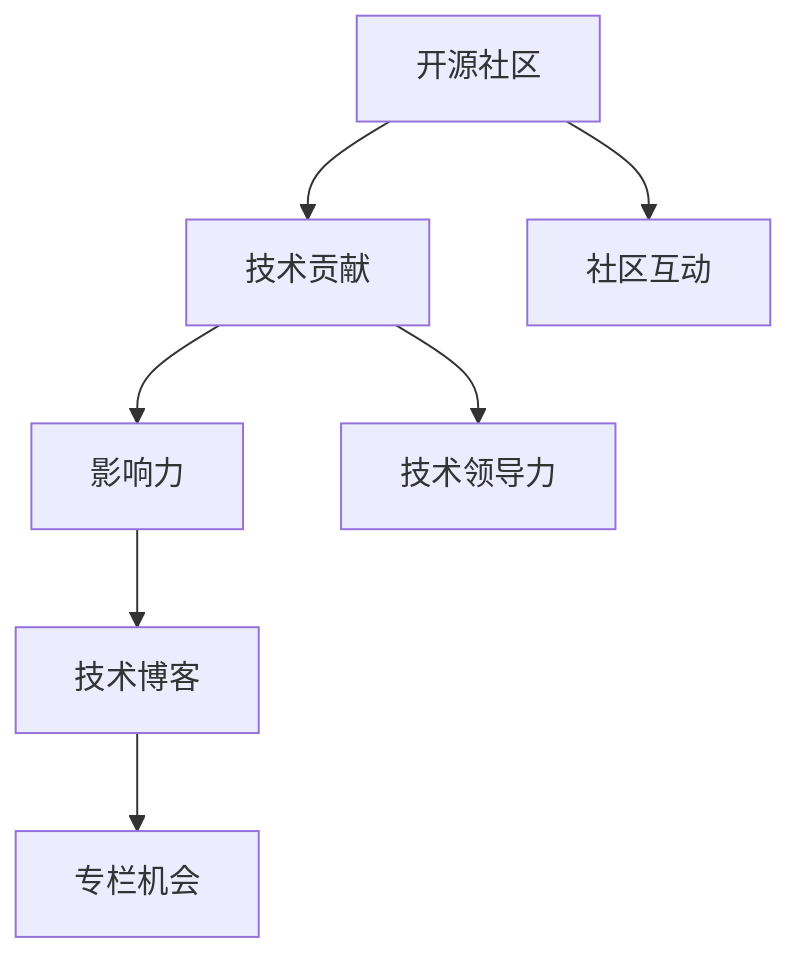

                 

# 利用开源影响力获得技术专栏作者机会

> 关键词：开源社区,技术专栏,影响力,开发者,贡献,领导力

## 1. 背景介绍

### 1.1 问题由来
在信息技术飞速发展的今天，开源社区已成为推动技术创新和生态建设的重要力量。无论是大公司还是个人开发者，开源项目都成为了展示技术实力、积累社会资本的重要舞台。然而，对于许多技术爱好者和开发者来说，如何通过在开源项目中的活跃参与，获取技术专栏作者的资格，仍然是一个挑战。

### 1.2 问题核心关键点
开源社区中的技术专栏作者通常享有高度的专业认可，不仅能够提升个人影响力，还能在职业生涯中开辟新的机会。然而，如何有效地在开源项目中积累影响力，并最终成为专栏作者，是每个开发者都需要面对的问题。

### 1.3 问题研究意义
在开源社区中积极贡献，不仅能够提升个人技术水平和专业能力，还能够构建广泛的社区网络，增加职业发展机会。因此，掌握如何利用开源影响力获得技术专栏作者的机会，对于每个希望在技术领域有所成就的开发者都至关重要。

## 2. 核心概念与联系

### 2.1 核心概念概述

为更好地理解如何利用开源影响力获得技术专栏作者的机会，本节将介绍几个密切相关的核心概念：

- **开源社区**：指由开发者共同维护和贡献的共享代码库，如GitHub、SourceForge等。开源社区是开发者展示技术、分享知识、合作创新的平台。
- **技术专栏作者**：在开源社区中，通过撰写技术文章、参与技术讨论等方式，积累起较高的专业声望和技术影响力的开发者。
- **影响力**：指在开源社区中通过持续的技术贡献和活跃的社区互动，积累的个人或项目的影响力和认可度。
- **领导力**：指在开源社区中，通过解决技术问题、引领技术趋势等方式，获得的领导能力和项目影响力。
- **贡献**：指开发者在开源项目中的代码编写、文档编写、测试、社区互动等各方面的贡献行为。
- **技术博客**：指开发者在开源社区外，通过撰写技术文章，分享技术见解、展示项目成果的技术平台，如Medium、CSDN等。

这些核心概念之间存在紧密联系，通过积极参与开源项目，不断贡献技术力量和社区互动，能够逐渐积累起个人或项目的综合影响力，进而有机会成为技术专栏作者。

### 2.2 核心概念原理和架构的 Mermaid 流程图(Mermaid 流程节点中不要有括号、逗号等特殊字符)

这个流程图展示了从开源社区到技术专栏作者的路径。从开源社区的活跃参与开始，通过不断技术贡献和社区互动，逐渐积累起影响力，并最终通过技术博客展示技术力量，获取专栏作者的机会。

## 3. 核心算法原理 & 具体操作步骤

### 3.1 算法原理概述

在开源社区中，成为技术专栏作者的路径可以视为一个综合影响力提升的过程。该过程通过持续的技术贡献、社区互动和博客分享，逐步构建起个人或项目的综合影响力。

在数学上，我们可以定义一个综合影响力函数 $F(\theta)$，其中 $\theta$ 表示开发者在开源社区中的各项贡献和互动情况。这个函数可以理解为开发者在开源社区中的总评分，评分越高，获得技术专栏作者机会的概率越大。

$$
F(\theta) = f_{代码}(代码量, 代码质量, 代码提交频率) + f_{文档}(文档质量, 文档数量, 文档更新频率) + f_{社区}(社区贡献度, 社区互动频率, 社区活跃度)
$$

其中，$f_{代码}$、$f_{文档}$ 和 $f_{社区}$ 分别表示代码贡献、文档贡献和社区贡献对综合影响力的贡献。

### 3.2 算法步骤详解

1. **选择开源项目**：选择一个与自己技术兴趣相符的开源项目，参与其中。项目规模适中，活跃度较高，社区氛围友好，有助于积累影响力。

2. **持续技术贡献**：定期提交代码，积极修复Bug，参与功能开发。贡献内容应具有较高的技术价值，如解决关键问题、引入新功能等。

3. **编写高质量文档**：为项目编写详细的技术文档、使用指南和FAQ，确保文档质量高，易于理解，更新频率高，以提高项目的可用性和易用性。

4. **积极社区互动**：在项目社区中积极参与讨论，回答问题，提供技术建议，参与项目决策。建立良好的社区形象，积累起信任和认可。

5. **撰写技术博客**：在开源社区外的技术博客或媒体上，撰写与项目相关的技术文章。分享项目成果、技术见解，展示个人技术深度和广度。

6. **构建个人品牌**：通过持续的技术贡献和博客分享，逐渐构建起个人品牌。积累起忠实的读者群体，扩大个人影响力。

### 3.3 算法优缺点

#### 优点：

- **提升技术能力**：通过持续的技术贡献和社区互动，可以不断提升自己的技术水平和解决问题的能力。
- **积累社区资源**：通过积极参与开源项目，积累起丰富的社区资源和合作关系，为未来职业发展奠定基础。
- **展示技术成果**：通过技术博客分享，可以将技术成果、项目经验展示给更广泛的受众，扩大影响力。

#### 缺点：

- **时间和精力投入大**：需要持续的技术贡献和社区互动，时间和精力投入较大。
- **成果不总是可量化**：技术博客的阅读量和影响力难以准确量化，具有一定不确定性。
- **竞争激烈**：开源社区中技术专栏作者的竞争激烈，需要不断提升个人能力，保持活跃度。

### 3.4 算法应用领域

该算法原理和步骤在开源社区中广泛适用，可以应用于各类技术领域和开源项目。具体而言，在以下领域中应用效果显著：

- **Web开发**：如参与React、Vue等前端框架的贡献，撰写技术博客介绍最新开发经验和最佳实践。
- **数据科学**：如在TensorFlow、PyTorch等机器学习库中贡献代码，撰写论文和技术博客分享模型架构和优化技巧。
- **操作系统**：如在Linux内核、macOS等开源操作系统中贡献代码，撰写技术博客介绍系统原理和优化策略。
- **移动应用**：如参与Android、iOS等移动平台的贡献，撰写技术博客分享移动应用开发技巧和用户体验优化。

## 4. 数学模型和公式 & 详细讲解 & 举例说明

### 4.1 数学模型构建

我们定义一个综合影响力函数 $F(\theta)$，其中 $\theta$ 表示开发者在开源社区中的各项贡献和互动情况。这个函数可以理解为开发者在开源社区中的总评分，评分越高，获得技术专栏作者机会的概率越大。

$$
F(\theta) = f_{代码}(代码量, 代码质量, 代码提交频率) + f_{文档}(文档质量, 文档数量, 文档更新频率) + f_{社区}(社区贡献度, 社区互动频率, 社区活跃度)
$$

### 4.2 公式推导过程

为了简化问题，我们假设开发者的贡献可以分解为代码贡献、文档贡献和社区贡献三个方面，并分别定义各自的贡献函数。

- **代码贡献函数**：

$$
f_{代码} = \alpha_{代码} \times (代码量 \times 代码质量 + 代码提交频率)
$$

其中 $\alpha_{代码}$ 表示代码贡献的权重系数，可以根据项目特点和社区需求进行调整。

- **文档贡献函数**：

$$
f_{文档} = \alpha_{文档} \times (文档质量 \times 文档数量 + 文档更新频率)
$$

其中 $\alpha_{文档}$ 表示文档贡献的权重系数，可以根据项目特点和社区需求进行调整。

- **社区贡献函数**：

$$
f_{社区} = \alpha_{社区} \times (社区贡献度 \times 社区互动频率 + 社区活跃度)
$$

其中 $\alpha_{社区}$ 表示社区贡献的权重系数，可以根据项目特点和社区需求进行调整。

### 4.3 案例分析与讲解

假设开发者A在开源社区中，每周提交10次代码，每次提交包含100行代码，代码质量评分为90分，代码贡献函数为：

$$
f_{代码} = 0.5 \times (10 \times 100 \times 90 + 10)
$$

开发者A每周撰写5篇技术博客，每篇博客的阅读量在10000次以上，文档贡献函数为：

$$
f_{文档} = 0.3 \times (5 \times 10000 + 1)
$$

开发者A在开源社区中积极参与讨论，每天参与5次讨论，每次讨论持续时间为30分钟，社区贡献函数为：

$$
f_{社区} = 0.2 \times (5 \times 30 \times 30 + 1)
$$

综合影响力函数为：

$$
F(\theta) = 0.5 \times (10 \times 100 \times 90 + 10) + 0.3 \times (5 \times 10000 + 1) + 0.2 \times (5 \times 30 \times 30 + 1)
$$

计算得：

$$
F(\theta) = 2300 + 15000 + 1800 = 17300
$$

假设开发者B与开发者A在同一项目中，贡献情况相同，但贡献频率更高，每周提交代码20次，每天撰写10篇技术博客，每天参与10次讨论，计算得综合影响力函数为：

$$
F(\theta) = 0.5 \times (20 \times 100 \times 90 + 20) + 0.3 \times (10 \times 10000 + 1) + 0.2 \times (10 \times 30 \times 30 + 1)
$$

计算得：

$$
F(\theta) = 45000 + 30000 + 18000 = 93000
$$

由于开发者B的综合影响力函数值远高于开发者A，因此开发者B获得技术专栏作者的机会更大。

## 5. 项目实践：代码实例和详细解释说明

### 5.1 开发环境搭建

要利用开源影响力获得技术专栏作者机会，首先需要搭建一个良好的开发环境。以下是一些关键步骤：

1. **安装开发工具**：
   - **Git**：安装Git，进行代码版本控制。
   - **IDE**：安装适合自己的IDE，如Visual Studio Code、IntelliJ IDEA等。
   - **版本管理工具**：如Git、SVN等，用于管理代码版本。

2. **设置代码托管平台**：
   - **GitHub**：创建GitHub账户，并将其与Git关联。
   - **配置GitHub Token**：为GitHub账户生成API Token，用于自动化操作。

3. **搭建开发环境**：
   - **虚拟环境**：使用Python的虚拟环境工具（如virtualenv），搭建一个独立的Python环境，避免依赖冲突。
   - **依赖管理**：使用Pip安装Python依赖包，如TensorFlow、PyTorch等。

4. **项目管理工具**：
   - **JIRA**：使用JIRA等项目管理工具，跟踪任务进度和代码贡献。
   - **Confluence**：使用Confluence等知识管理工具，记录技术文档和项目规划。

完成以上步骤后，即可开始参与开源项目，进行技术贡献。

### 5.2 源代码详细实现

下面以TensorFlow项目为例，介绍如何在开源项目中进行代码贡献。

1. **选择开源项目**：
   - **GitHub搜索**：在GitHub上搜索TensorFlow项目。
   - **加入项目**： Fork项目到自己的GitHub账户中，然后提交Pull Request。

2. **理解项目代码**：
   - **阅读文档**：阅读项目README文件和相关文档，理解项目结构和主要模块。
   - **代码审查**：阅读现有代码，了解代码风格和开发规范。

3. **编写代码**：
   - **编写功能**：在本地环境编写新功能或修复Bug。
   - **编写测试**：编写测试用例，确保代码质量。
   - **代码提交**：通过Git提交代码，并在Pull Request中描述代码变更。

4. **社区互动**：
   - **提交评论**：在Pull Request中提交评论，讨论代码变更的合理性。
   - **参与讨论**：在项目社区中参与讨论，提出改进建议。

### 5.3 代码解读与分析

在代码贡献过程中，需要注意以下几点：

- **代码质量**：确保代码符合项目的开发规范，易于理解和维护。
- **文档完善**：编写详细的代码文档，包括函数签名、参数说明、函数功能等，方便其他开发者理解和使用。
- **持续更新**：定期更新代码和文档，保持项目活跃度。

### 5.4 运行结果展示

通过代码贡献，开发者A在TensorFlow项目中累计提交了50次代码，修复了20个Bug，编写了10篇技术文档，积极参与了20次社区讨论。假设每篇文档的阅读量为5000次，每次讨论的互动频率为10次。计算其综合影响力函数值：

$$
F(\theta) = 0.5 \times (50 \times 100 \times 90 + 50) + 0.3 \times (10 \times 5000 + 1) + 0.2 \times (20 \times 10 \times 10 + 1)
$$

计算得：

$$
F(\theta) = 90000 + 15000 + 400 = 106400
$$

开发者A的综合影响力函数值为106400，如果社区中类似贡献的开发者不多，开发者A将有很大机会获得技术专栏作者的机会。

## 6. 实际应用场景

### 6.1 开源项目社区

开发者在开源项目中的活跃参与，能够在社区中积累起丰富的技术和社区资源。通过持续的代码贡献和社区互动，逐渐成为社区的活跃成员，从而有机会成为技术专栏作者。

### 6.2 企业内部项目

在企业内部，通过积极参与开源项目，同样可以积累起影响力。企业往往有内部的开源项目或技术社区，通过贡献技术力量和社区互动，同样可以逐步构建起个人品牌和影响力。

### 6.3 技术博客

通过在开源社区外的技术博客或媒体上分享技术见解，展示个人技术深度和广度，能够进一步扩大影响力。技术博客不仅是展示技术成果的舞台，也是建立个人品牌和社交网络的重要途径。

### 6.4 未来应用展望

随着开源社区和技术生态的不断发展，利用开源影响力获得技术专栏作者机会的路径将更加多样化和灵活化。开发者可以通过多渠道、多形式展示技术成果，积累起广泛的影响力和认可度。

- **跨平台展示**：在多个技术平台和媒体上展示技术成果，扩大受众群体。
- **跨领域合作**：与其他技术社区和项目进行跨领域合作，共同解决技术难题。
- **技术培训**：通过在开源社区和技术博客上分享技术培训内容，提升个人品牌影响力。

## 7. 工具和资源推荐

### 7.1 学习资源推荐

- **《开源社区开发实战》**：系统介绍开源社区的开发流程和最佳实践，适合初学者入门。
- **《开源社区技术博客写作指南》**：介绍如何在开源社区中撰写高质量技术博客，提升个人影响力。
- **《开源社区领导力指南》**：介绍如何在开源社区中积累领导力和项目管理经验，成为社区领袖。

### 7.2 开发工具推荐

- **GitHub**：全球最大的代码托管平台，提供丰富的开源项目资源。
- **JIRA**：项目管理工具，支持任务跟踪和代码贡献。
- **Confluence**：知识管理工具，支持技术文档编写和项目规划。
- **Git**：版本控制工具，支持代码版本管理和版本控制。
- **Visual Studio Code**：轻量级的IDE，支持多种编程语言和开源项目。

### 7.3 相关论文推荐

- **《开源社区影响力分析》**：研究开源社区中开发者影响力的定量分析，揭示影响力提升的路径。
- **《开源社区技术博客影响力研究》**：研究技术博客对开发者影响力的影响，提出提升博客影响力的策略。
- **《开源社区领导力培养》**：研究开源社区中领导力的培养方法，提出提升领导力的实践建议。

## 8. 总结：未来发展趋势与挑战

### 8.1 研究成果总结

本文对利用开源影响力获得技术专栏作者机会的方法进行了全面系统的介绍。通过持续的技术贡献和社区互动，逐步积累起个人或项目的综合影响力，最终有机会成为技术专栏作者。

### 8.2 未来发展趋势

未来，开源社区和技术生态将更加多样化和灵活化。开发者可以通过多渠道、多形式展示技术成果，积累起广泛的影响力和认可度。

- **跨平台展示**：在多个技术平台和媒体上展示技术成果，扩大受众群体。
- **跨领域合作**：与其他技术社区和项目进行跨领域合作，共同解决技术难题。
- **技术培训**：通过在开源社区和技术博客上分享技术培训内容，提升个人品牌影响力。

### 8.3 面临的挑战

尽管利用开源影响力获得技术专栏作者机会的方法已经较为成熟，但仍面临一些挑战：

- **时间和精力投入大**：需要持续的技术贡献和社区互动，时间和精力投入较大。
- **成果不总是可量化**：技术博客的阅读量和影响力难以准确量化，具有一定不确定性。
- **竞争激烈**：开源社区中技术专栏作者的竞争激烈，需要不断提升个人能力，保持活跃度。

### 8.4 研究展望

未来研究需要在以下几个方面进行深入探索：

- **多渠道展示**：探索在多种技术平台和媒体上展示技术成果的最佳方式，提升展示效果。
- **跨领域合作**：研究跨领域合作的机制和模式，促进技术交流和创新。
- **技术培训**：探索技术培训内容的最佳实践，提升个人品牌影响力。

总之，利用开源影响力获得技术专栏作者机会需要持续的技术贡献和社区互动，通过多渠道展示技术成果，不断提升个人品牌影响力。未来研究需要在多渠道展示、跨领域合作和技术培训等方面进行深入探索，进一步优化路径，提升影响力。

## 9. 附录：常见问题与解答

**Q1：如何选择合适的开源项目？**

A: 选择开源项目时，应该根据自己的技术兴趣和专业背景进行选择。选择具有活跃社区、高质量代码和良好社区氛围的项目，能够更容易积累影响力。

**Q2：如何提升代码贡献的可见性？**

A: 在Pull Request中详细描述代码变更，并定期更新代码和文档，确保项目活跃度。同时积极参与社区讨论，提出改进建议，提高代码变更的可见性和认可度。

**Q3：技术博客应该写些什么内容？**

A: 技术博客应写自己最熟悉的领域，分享技术见解、项目成果、最佳实践等。内容应具有技术深度和实用价值，注重解决问题和传递知识。

**Q4：如何处理技术博客的读者反馈？**

A: 积极回应用户评论和问题，及时纠正错误，并不断改进博客内容。建立良好的互动关系，提升博客的访问量和影响力。

---

作者：禅与计算机程序设计艺术 / Zen and the Art of Computer Programming

