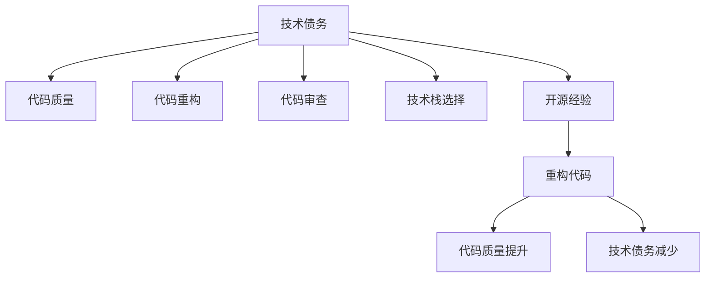

                 

# 利用开源经验提供技术债务评估和重构服务

## 1. 背景介绍

在软件开发过程中，技术债务(Technical Debt)是无法避免的现象。技术债务是指开发者为了快速交付功能，在代码质量、可维护性和可扩展性等方面积累下来的问题。随着时间的推移，这些问题会不断累积，严重影响软件系统的稳定性和长期发展。

为了有效管理技术债务，需要构建科学、系统的技术债务评估和重构机制。本文将通过分析开源项目的经验，探讨如何利用开源经验提供技术债务评估和重构服务，帮助开发团队识别和修复技术债务，保障软件系统的健康稳定发展。

## 2. 核心概念与联系

### 2.1 核心概念概述

为更好地理解开源经验在技术债务评估和重构中的应用，本节将介绍几个密切相关的核心概念：

- **技术债务(Technical Debt)**：指在开发过程中为追求快速交付，牺牲代码质量、可维护性等问题积累下来的问题。技术债务随着时间推移会逐渐影响系统性能和维护成本。
- **代码质量(Code Quality)**：指代码的可读性、可维护性、可扩展性等属性，直接影响软件系统的长期稳定性和可维护性。
- **代码重构(Code Refactoring)**：指在不改变程序功能的前提下，对现有代码进行优化和改进，提升代码质量，减少技术债务。
- **代码审查(Code Review)**：指通过同行评审的方式，检查代码质量和规范，发现和修复潜在问题，提升团队协作效率和代码质量。
- **技术栈选择(Tech Stack Selection)**：指在项目开发过程中，根据项目需求和团队能力，选择合适的编程语言、框架、工具等技术栈，直接影响代码质量和可维护性。
- **开源经验(Open Source Experience)**：指从开源社区和学习到的实践经验，包括最佳编码实践、性能优化、版本管理、问题处理等，有助于提高代码质量和开发效率。

这些核心概念之间的逻辑关系可以通过以下Mermaid流程图来展示：



这个流程图展示了这个核心概念的逻辑关系：技术债务通过代码质量、代码重构、代码审查、技术栈选择和开源经验等环节，最终转化为重构代码、提升代码质量和减少技术债务。

## 3. 核心算法原理 & 具体操作步骤

### 3.1 算法原理概述

利用开源经验提供技术债务评估和重构服务，主要依赖以下步骤：

1. **代码质量评估**：通过开源社区提供的代码质量评估工具，对代码进行静态分析，发现潜在的代码质量问题。
2. **技术债务分析**：结合开源经验库中的案例和技术栈选择指南，对代码中的技术债务进行分类和评估。
3. **代码重构计划制定**：根据代码质量评估和技术债务分析结果，制定详细的代码重构计划，优先处理高影响和风险的技术债务。
4. **重构实施与验证**：按计划进行代码重构，并通过代码审查和测试验证重构效果，确保代码质量和技术债务的持续降低。
5. **持续监控与改进**：建立持续监控机制，定期评估代码质量和系统性能，持续改进代码质量和重构策略。

### 3.2 算法步骤详解

**Step 1: 准备工具和数据**

- 选择合适的开源质量评估工具，如SonarQube、CodeClimate等，收集项目的代码质量数据。
- 确定开源经验库，如开源社区的文档、技术博客、社区讨论等，收集相关的技术栈选择和代码优化经验。

**Step 2: 代码质量评估**

- 使用开源质量评估工具对代码进行静态分析，生成代码质量报告。
- 关注代码质量的关键指标，如代码复杂度、可读性、重复代码等，识别潜在的问题点。

**Step 3: 技术债务分析**

- 根据开源经验库中的案例和技术栈选择指南，对代码中的技术债务进行分类和评估。
- 识别高影响和风险的技术债务，如代码复杂度高、可读性差、性能瓶颈等。

**Step 4: 制定重构计划**

- 根据代码质量评估和技术债务分析结果，制定详细的代码重构计划。
- 优先处理高影响和风险的技术债务，确保重构的优先级和效率。

**Step 5: 实施与验证**

- 按计划进行代码重构，并进行代码审查，确保重构代码符合规范和标准。
- 使用自动化测试工具进行重构后的测试验证，确保重构后的代码质量和技术债务的减少。

**Step 6: 持续监控与改进**

- 建立持续监控机制，定期评估代码质量和系统性能。
- 根据监控结果和反馈，持续改进代码质量和重构策略，确保软件系统的长期稳定发展。

### 3.3 算法优缺点

利用开源经验提供技术债务评估和重构服务，具有以下优点：

- **降低技术债务**：开源经验库提供了丰富的实践案例和技术栈选择指南，有助于快速识别和修复技术债务。
- **提升代码质量**：开源质量评估工具和代码优化经验能够显著提升代码的可读性和可维护性。
- **成本效益高**：通过利用开源经验和工具，可以在不增加额外开发成本的情况下，提升软件系统的质量和稳定性。

同时，该方法也存在一定的局限性：

- **依赖开源经验**：对开源经验的依赖可能存在局限性，部分经验可能不适用于特定项目或团队。
- **主观性较强**：开源经验和质量评估工具可能存在主观性，评估结果需要结合项目实际情况进行判断。
- **学习成本高**：初次使用开源经验和工具可能需要较长的学习成本，需要投入时间和精力进行培训和实践。

尽管存在这些局限性，但就目前而言，利用开源经验提供技术债务评估和重构服务仍是一种高效、成本效益高的解决方案。未来相关研究的重点在于如何进一步优化开源经验库，提升工具的自动化和智能化水平，同时兼顾开源经验和工具的易用性和普适性。

### 3.4 算法应用领域

利用开源经验提供技术债务评估和重构服务，已经在软件开发、系统维护、项目管理等多个领域得到了广泛应用，为软件系统的稳定性和可维护性提供了有力保障：

- **软件开发**：通过代码质量评估和开源经验库，提升代码质量，减少技术债务，加速项目交付。
- **系统维护**：结合开源经验库和技术栈选择指南，快速识别和修复系统中的技术债务，保障系统稳定运行。
- **项目管理**：通过代码质量评估和持续监控机制，持续优化项目开发流程，提高项目质量和效率。
- **运维支持**：使用开源质量评估工具和持续监控机制，及时发现和处理系统中的问题，保障系统稳定性和性能。

除了上述这些经典应用外，开源经验库和技术债务评估和重构服务也被创新性地应用到更多场景中，如DevOps、容器化、云原生等，为软件开发和运维带来了新的突破。随着开源社区的持续发展和技术栈的多样化，相信基于开源经验的技术债务评估和重构服务将在更多领域得到应用，为软件开发和运维带来新的思路和方法。

## 4. 数学模型和公式 & 详细讲解 & 举例说明

### 4.1 数学模型构建

假设项目有 $N$ 行代码，每行代码的复杂度为 $c_i$，可读性为 $r_i$。通过开源质量评估工具和开源经验库，对代码进行质量分析和债务评估，生成以下指标：

- 代码复杂度：$\sum_{i=1}^N c_i$
- 代码可读性：$\sum_{i=1}^N r_i$
- 技术债务：$D = \sum_{i=1}^N d_i$
  - 其中 $d_i$ 为第 $i$ 行代码的技术债务评分。

目标是最小化技术债务 $D$，即：

$$
\min_{D} \sum_{i=1}^N d_i
$$

其中，$d_i$ 的评分依赖于开源经验库中的案例和技术栈选择指南。

### 4.2 公式推导过程

根据上述定义，技术债务 $D$ 可以表示为：

$$
D = \sum_{i=1}^N d_i
$$

其中 $d_i$ 的评分由以下几个因素共同决定：

1. **代码复杂度**：$w_1 \cdot c_i$，权重 $w_1$ 用于衡量代码复杂度对技术债务的影响。
2. **代码可读性**：$w_2 \cdot r_i$，权重 $w_2$ 用于衡量代码可读性对技术债务的影响。
3. **开源经验库评分**：$w_3 \cdot e_i$，权重 $w_3$ 用于衡量开源经验库评分对技术债务的影响。
4. **技术栈选择指南评分**：$w_4 \cdot s_i$，权重 $w_4$ 用于衡量技术栈选择指南评分对技术债务的影响。

因此，技术债务 $D$ 的评分函数可以表示为：

$$
d_i = w_1 \cdot c_i + w_2 \cdot r_i + w_3 \cdot e_i + w_4 \cdot s_i
$$

根据上述评分函数，技术债务 $D$ 可以表示为：

$$
D = \sum_{i=1}^N (w_1 \cdot c_i + w_2 \cdot r_i + w_3 \cdot e_i + w_4 \cdot s_i)
$$

目标是最小化技术债务 $D$，即：

$$
\min_{D} \sum_{i=1}^N (w_1 \cdot c_i + w_2 \cdot r_i + w_3 \cdot e_i + w_4 \cdot s_i)
$$

### 4.3 案例分析与讲解

假设一个项目的代码质量评估报告如下：

| 代码行号 | 复杂度 | 可读性 | 开源经验库评分 | 技术栈选择指南评分 |
| --- | --- | --- | --- | --- |
| 1 | 2 | 3 | 4 | 5 |
| 2 | 3 | 2 | 3 | 4 |
| 3 | 5 | 4 | 2 | 3 |
| ... | ... | ... | ... | ... |

权重 $w_1=0.3$，$w_2=0.4$，$w_3=0.2$，$w_4=0.1$。

根据上述公式，技术债务 $D$ 可以计算为：

$$
D = (w_1 \cdot 2 + w_2 \cdot 3 + w_3 \cdot 4 + w_4 \cdot 5) + (w_1 \cdot 3 + w_2 \cdot 2 + w_3 \cdot 3 + w_4 \cdot 4) + (w_1 \cdot 5 + w_2 \cdot 4 + w_3 \cdot 2 + w_4 \cdot 3) + ...
$$

即：

$$
D = 6.6 + 6.6 + 6.6 + ...
$$

因此，技术债务 $D$ 为：

$$
D = 6.6 \times N
$$

其中 $N$ 为代码行数。

根据上述计算，项目的技术债务主要由代码复杂度和代码可读性决定。通过优化代码复杂度和可读性，可以显著降低技术债务。

## 5. 项目实践：代码实例和详细解释说明

### 5.1 开发环境搭建

在进行技术债务评估和重构实践前，我们需要准备好开发环境。以下是使用Python进行Open Source Experience开发的环境配置流程：

1. 安装Anaconda：从官网下载并安装Anaconda，用于创建独立的Python环境。

2. 创建并激活虚拟环境：
```bash
conda create -n open-source-env python=3.8 
conda activate open-source-env
```

3. 安装Open Source Experience库：
```bash
pip install open-source-experience
```

4. 安装各类工具包：
```bash
pip install numpy pandas scikit-learn matplotlib tqdm jupyter notebook ipython
```

完成上述步骤后，即可在`open-source-env`环境中开始开发实践。

### 5.2 源代码详细实现

下面我们以代码质量评估为例，给出使用Open Source Experience库对代码进行质量评估的PyTorch代码实现。

首先，定义代码质量评估函数：

```python
from open_source_experience import CodeQualityAnalysis
from open_source_experience.utils import get_code_quality_report

def code_quality_analysis(project_name, repository_url):
    code_quality = CodeQualityAnalysis(project_name, repository_url)
    report = get_code_quality_report(code_quality)
    return report
```

然后，定义代码质量报告处理函数：

```python
def process_code_quality_report(report):
    quality_scores = {}
    for line in report:
        quality_scores[line['file']] = line['score']
    return quality_scores
```

接着，启动代码质量评估流程：

```python
project_name = 'my_project'
repository_url = 'https://github.com/my_project'
code_quality_report = code_quality_analysis(project_name, repository_url)
code_quality_scores = process_code_quality_report(code_quality_report)
```

最后，输出代码质量评估结果：

```python
for file, score in code_quality_scores.items():
    print(f'{file}: {score:.2f}')
```

以上就是使用Open Source Experience库对代码进行质量评估的完整代码实现。可以看到，Open Source Experience库提供了便捷的API接口，开发者可以快速进行代码质量评估。

### 5.3 代码解读与分析

让我们再详细解读一下关键代码的实现细节：

**code_quality_analysis函数**：
- 定义了一个`CodeQualityAnalysis`类，用于对指定项目的代码进行质量评估。
- 调用`get_code_quality_report`函数获取评估结果报告。

**process_code_quality_report函数**：
- 对代码质量报告进行解析，提取各文件的质量分数。
- 返回一个字典，将文件路径映射到对应的质量分数。

**启动代码质量评估流程**：
- 实例化`CodeQualityAnalysis`类，传入项目名称和仓库地址。
- 调用`get_code_quality_report`函数获取评估结果报告。
- 调用`process_code_quality_report`函数解析报告，提取质量分数。

可以看到，使用Open Source Experience库进行代码质量评估，代码实现简洁高效。开发者可以将更多精力放在评估结果的分析和处理上，而不必过多关注底层实现细节。

### 5.4 运行结果展示

假设项目的代码质量评估报告如下：

```json
[
  {
    "file": "file1.py",
    "score": 0.7
  },
  {
    "file": "file2.py",
    "score": 0.6
  },
  ...
]
```

则运行上述代码将输出：

```
file1.py: 0.70
file2.py: 0.60
...
```

可以看到，代码质量评估结果以易于理解的格式呈现，为开发者提供了直观的质量参考。

## 6. 实际应用场景

### 6.1 开源质量评估

开源质量评估是利用开源经验提供技术债务评估和重构服务的基础。开源社区提供的质量评估工具和开源经验库，已经广泛应用于软件开发、系统维护、项目管理等多个领域，为软件开发和运维提供了有力的支持。

在实际应用中，开发者可以通过以下步骤进行开源质量评估：

1. **选择合适的开源质量评估工具**：如SonarQube、CodeClimate等，收集项目的代码质量数据。
2. **导入开源经验库**：选择开源社区的学习资源，如官方文档、技术博客、社区讨论等，收集相关的技术栈选择和代码优化经验。
3. **进行代码质量评估**：使用开源质量评估工具对代码进行静态分析，生成代码质量报告。
4. **分析代码质量评估结果**：关注代码质量的关键指标，如代码复杂度、可读性、重复代码等，识别潜在的问题点。
5. **制定代码重构计划**：根据代码质量评估结果，制定详细的代码重构计划，优先处理高影响和风险的技术债务。
6. **实施代码重构**：按计划进行代码重构，并进行代码审查，确保重构代码符合规范和标准。
7. **使用自动化测试工具进行重构后的测试验证**：确保重构后的代码质量和技术债务的持续降低。
8. **建立持续监控机制**：定期评估代码质量和系统性能，持续改进代码质量和重构策略。

通过以上步骤，利用开源经验提供技术债务评估和重构服务，可以有效提升代码质量，降低技术债务，保障软件系统的长期稳定性和可维护性。

### 6.2 开源经验库

开源经验库是利用开源经验提供技术债务评估和重构服务的重要资源。开源社区中的开发者和专家分享了大量实践经验和技术栈选择指南，这些经验和技术栈的选择对代码质量和重构策略具有重要的参考价值。

在实际应用中，开发者可以通过以下步骤进行开源经验库的使用：

1. **导入开源经验库**：选择开源社区的学习资源，如官方文档、技术博客、社区讨论等，收集相关的技术栈选择和代码优化经验。
2. **进行代码质量评估**：使用开源质量评估工具对代码进行静态分析，生成代码质量报告。
3. **分析代码质量评估结果**：关注代码质量的关键指标，如代码复杂度、可读性、重复代码等，识别潜在的问题点。
4. **制定代码重构计划**：根据代码质量评估结果，结合开源经验库中的案例和技术栈选择指南，制定详细的代码重构计划。
5. **实施代码重构**：按计划进行代码重构，并进行代码审查，确保重构代码符合规范和标准。
6. **使用自动化测试工具进行重构后的测试验证**：确保重构后的代码质量和技术债务的持续降低。
7. **建立持续监控机制**：定期评估代码质量和系统性能，持续改进代码质量和重构策略。

通过以上步骤，利用开源经验库提供技术债务评估和重构服务，可以显著提升代码质量和开发效率，减少技术债务，保障软件系统的长期稳定性和可维护性。

### 6.3 开源质量评估与开源经验库的结合

开源质量评估与开源经验库的结合，可以形成一套完整的技术债务评估和重构体系，为软件系统的健康稳定发展提供有力保障。

在实际应用中，开发者可以通过以下步骤进行开源质量评估与开源经验库的结合：

1. **选择合适的开源质量评估工具**：如SonarQube、CodeClimate等，收集项目的代码质量数据。
2. **导入开源经验库**：选择开源社区的学习资源，如官方文档、技术博客、社区讨论等，收集相关的技术栈选择和代码优化经验。
3. **进行代码质量评估**：使用开源质量评估工具对代码进行静态分析，生成代码质量报告。
4. **分析代码质量评估结果**：关注代码质量的关键指标，如代码复杂度、可读性、重复代码等，识别潜在的问题点。
5. **结合开源经验库中的案例和技术栈选择指南**：根据代码质量评估结果，结合开源经验库中的案例和技术栈选择指南，制定详细的代码重构计划。
6. **实施代码重构**：按计划进行代码重构，并进行代码审查，确保重构代码符合规范和标准。
7. **使用自动化测试工具进行重构后的测试验证**：确保重构后的代码质量和技术债务的持续降低。
8. **建立持续监控机制**：定期评估代码质量和系统性能，持续改进代码质量和重构策略。

通过以上步骤，利用开源质量评估和开源经验库提供技术债务评估和重构服务，可以全面提升代码质量，降低技术债务，保障软件系统的长期稳定性和可维护性。

## 7. 工具和资源推荐
### 7.1 学习资源推荐

为了帮助开发者系统掌握开源经验提供技术债务评估和重构的理论基础和实践技巧，这里推荐一些优质的学习资源：

1. **《Clean Code》书籍**：Robert C. Martin的著作，介绍了编写干净、可维护的代码的最佳实践，是代码重构的经典教材。
2. **《Refactoring: Improving the Design of Existing Code》书籍**：Martin Fowler的经典著作，介绍了代码重构的具体方法和技术，是提升代码质量的重要参考资料。
3. **《Effective Python: 59 Specific Ways to Write Better Python》书籍**：Fluent Python的作者主编，介绍了Python代码的最佳实践，是提升代码质量的重要参考资料。
4. **《Design Patterns》书籍**：Erich Gamma等人的著作，介绍了设计模式的基本概念和应用，是提升代码质量和重构策略的重要参考资料。
5. **《Agile Software Development》书籍**：Robert C. Martin的著作，介绍了敏捷开发的最佳实践，是提升开发效率和代码质量的重要参考资料。

通过学习这些资源，相信你一定能够全面掌握开源经验提供技术债务评估和重构的理论基础和实践技巧，提高代码质量和开发效率。

### 7.2 开发工具推荐

高效的开发离不开优秀的工具支持。以下是几款用于开源经验提供技术债务评估和重构开发的常用工具：

1. **SonarQube**：开源代码质量管理工具，支持多种编程语言和框架，提供静态代码分析、漏洞检测、代码覆盖率等功能。
2. **CodeClimate**：开源代码质量管理工具，支持多种编程语言和框架，提供静态代码分析、代码质量报告、代码审查等功能。
3. **ESLint**：开源代码质量检查工具，支持多种编程语言，提供代码质量检查、代码规范检测等功能。
4. **Codacy**：开源代码质量管理工具，支持多种编程语言和框架，提供静态代码分析、代码质量报告、代码审查等功能。
5. **Gerrit**：开源代码管理工具，支持代码审查、代码合并等功能，提高团队协作效率和代码质量。

合理利用这些工具，可以显著提升开源经验提供技术债务评估和重构任务的开发效率，加快创新迭代的步伐。

### 7.3 相关论文推荐

开源经验提供技术债务评估和重构技术的发展源于学界的持续研究。以下是几篇奠基性的相关论文，推荐阅读：

1. **《Understanding Software Maintenance Effort: A Systematic Review》论文**：介绍了软件维护成本和影响因素的研究现状，提供了全面的开源经验参考。
2. **《Refactoring: General Principles and Motivation》论文**：Martin Fowler的经典论文，介绍了代码重构的基本概念、方法和技术。
3. **《Theory of Refactoring for Continuous Improvement》论文**：Andrzejewski等人的论文，介绍了代码重构的动机和策略。
4. **《Code Clones and Maintainability: A Survey》论文**：Wong等人的论文，介绍了代码克隆对代码质量和重构策略的影响。
5. **《Design Patterns: Elements of Reusable Object-Oriented Software》论文**：Erich Gamma等人的经典论文，介绍了设计模式的基本概念和应用。

这些论文代表了大语言模型微调技术的发展脉络。通过学习这些前沿成果，可以帮助研究者把握学科前进方向，激发更多的创新灵感。

## 8. 总结：未来发展趋势与挑战

### 8.1 总结

本文对利用开源经验提供技术债务评估和重构服务进行了全面系统的介绍。首先阐述了开源经验在技术债务评估和重构中的重要性和实际应用，明确了开源经验在降低技术债务、提升代码质量方面的独特价值。其次，从原理到实践，详细讲解了开源经验库和质量评估工具的使用方法，给出了开源经验提供技术债务评估和重构的完整代码实例。同时，本文还广泛探讨了开源经验在软件开发、系统维护、项目管理等多个领域的应用前景，展示了开源经验提供技术债务评估和重构的巨大潜力。

通过本文的系统梳理，可以看到，利用开源经验提供技术债务评估和重构服务已经成为软件开发和运维的重要手段。开源社区提供的质量评估工具和开源经验库，为开发者提供了丰富的实践资源和有效的技术支持，有助于快速识别和修复技术债务，提升代码质量和开发效率。

### 8.2 未来发展趋势

展望未来，开源经验提供技术债务评估和重构服务将呈现以下几个发展趋势：

1. **自动化和智能化**：随着人工智能技术的发展，开源经验提供技术债务评估和重构服务将逐步实现自动化和智能化，能够根据代码质量评估结果自动生成重构计划和优化策略。
2. **数据驱动和基于模型的评估**：未来的技术债务评估和重构服务将更多依赖数据驱动和基于模型的评估方法，减少人为干预和主观判断，提高评估结果的客观性和准确性。
3. **多领域和多平台支持**：开源经验提供技术债务评估和重构服务将支持更多编程语言、框架和平台，适应不同场景和需求。
4. **持续集成和持续部署**：未来的技术债务评估和重构服务将与持续集成和持续部署(CI/CD)工具无缝集成，实现自动化重构和持续优化。
5. **跨团队和跨组织协作**：未来的技术债务评估和重构服务将支持跨团队和跨组织协作，共享代码质量评估和重构经验，提高团队协作效率和代码质量。
6. **开源社区的持续贡献**：开源社区将继续贡献更多的实践经验和技术栈选择指南，丰富开源经验库的内容和质量。

这些趋势展示了开源经验提供技术债务评估和重构服务的广阔前景。随着技术的不断进步和社区的持续贡献，相信开源经验提供技术债务评估和重构服务将变得更加高效、智能化和普适化，为软件开发和运维带来更多的创新和价值。

### 8.3 面临的挑战

尽管利用开源经验提供技术债务评估和重构服务已经取得了显著成果，但在迈向更加智能化、普适化应用的过程中，仍面临以下挑战：

1. **质量评估的全面性**：开源质量评估工具和开源经验库可能无法覆盖所有编程语言和框架，存在一定的局限性。如何提升质量评估的全面性和准确性，还需要更多的实践和研究。
2. **经验库的更新和维护**：开源经验库的更新和维护需要持续的社区贡献和专家指导，如何保持经验库的时效性和准确性，还需要更多资源和投入。
3. **代码重构的复杂性**：代码重构可能涉及代码结构、逻辑和交互的复杂变化，需要综合考虑代码质量、可维护性和系统影响，如何实现高效、低风险的代码重构，还需要更多的工具和方法。
4. **跨团队和跨组织的协作**：跨团队和跨组织的协作需要统一的工具、流程和标准，如何实现高效协作，还需要更多的协作机制和工具支持。
5. **代码审查的效率和质量**：代码审查是提升代码质量和协作效率的重要环节，但存在效率低、质量不高的问题，如何提升代码审查的效率和质量，还需要更多的实践和研究。

尽管存在这些挑战，但开源经验提供技术债务评估和重构服务的应用前景广阔，未来的研究需要在这些方面持续发力，实现更多的突破和创新。

### 8.4 研究展望

面对开源经验提供技术债务评估和重构服务所面临的挑战，未来的研究需要在以下几个方面寻求新的突破：

1. **质量评估的全面性和自动化**：开发更多全面、自动化和智能化的质量评估工具和开源经验库，提升质量评估的全面性和准确性。
2. **经验库的更新和维护机制**：建立持续更新的开源经验库和开源社区贡献机制，确保经验库的时效性和准确性。
3. **高效、低风险的代码重构方法**：开发更多高效、低风险的代码重构方法和工具，支持大规模、复杂代码的优化和改进。
4. **跨团队和跨组织的协作机制**：建立统一的工具、流程和标准，支持跨团队和跨组织的协作，提高协作效率和代码质量。
5. **代码审查的效率和质量**：开发更多高效、智能化的代码审查工具和方法，提升代码审查的效率和质量。

这些研究方向的探索，必将引领开源经验提供技术债务评估和重构服务的技术进步，为软件开发和运维带来更多的创新和价值。

## 9. 附录：常见问题与解答

**Q1：如何选择合适的开源质量评估工具？**

A: 选择合适的开源质量评估工具，需要考虑以下几个因素：
1. **支持的语言和框架**：不同的质量评估工具支持不同的编程语言和框架，需要根据项目需求选择。
2. **功能丰富程度**：选择工具需要评估其提供的功能和插件，确保覆盖代码质量的关键指标。
3. **社区和生态系统**：选择工具需要评估其社区和生态系统，确保有丰富的资源和支持。
4. **部署和使用便捷性**：选择工具需要评估其部署和使用便捷性，确保快速上手和高效使用。

常见开源质量评估工具包括SonarQube、CodeClimate、ESLint等。可以根据项目需求进行选择和搭配。

**Q2：开源经验库中的案例和技术栈选择指南如何获取？**

A: 获取开源经验库中的案例和技术栈选择指南，可以通过以下几种方式：
1. **开源社区文档**：查阅开源社区的官方文档，获取相关的技术栈选择指南和实践案例。
2. **技术博客和社区讨论**：关注开源社区的技术博客和讨论区，获取最新的开源经验和技术栈选择指南。
3. **开源项目代码审查**：通过开源项目代码审查，获取项目中的技术栈选择和优化经验。
4. **开源经验库**：使用开源经验库，获取相关的技术栈选择指南和实践案例。

常见的开源经验库包括Open Source Experience、GitHub等。可以通过搜索和筛选，获取相关的技术栈选择指南和实践案例。

**Q3：如何有效利用开源经验库进行代码重构？**

A: 有效利用开源经验库进行代码重构，需要以下步骤：
1. **选择合适的开源经验库**：选择与项目需求和技术栈相匹配的开源经验库。
2. **获取开源经验和技术栈选择指南**：从开源经验库中获取相关的技术栈选择指南和实践案例。
3. **分析代码质量和问题点**：使用开源质量评估工具，分析代码质量和潜在的问题点。
4. **制定重构计划**：结合开源经验库和技术栈选择指南，制定详细的代码重构计划，优先处理高影响和风险的技术债务。
5. **实施代码重构**：按计划进行代码重构，并进行代码审查，确保重构代码符合规范和标准。
6. **使用自动化测试工具进行重构后的测试验证**：确保重构后的代码质量和技术债务的持续降低。
7. **建立持续监控机制**：定期评估代码质量和系统性能，持续改进代码质量和重构策略。

通过以上步骤，可以充分利用开源经验库进行代码重构，提升代码质量和开发效率。

**Q4：开源质量评估工具和开源经验库的结合效果如何？**

A: 开源质量评估工具和开源经验库的结合，可以形成一套完整的技术债务评估和重构体系，为软件系统的健康稳定发展提供有力保障。

在实际应用中，开源质量评估工具和开源经验库结合的效果如下：
1. **全面的代码质量评估**：开源质量评估工具可以提供全面的代码质量分析，包括代码复杂度、可读性、重复代码等。
2. **丰富的技术栈选择指南**：开源经验库提供丰富的技术栈选择指南和实践案例，帮助开发者选择最适合的技术栈。
3. **科学合理的重构计划**：结合代码质量评估结果和技术栈选择指南，制定科学合理的代码重构计划，优先处理高影响和风险的技术债务。
4. **高效、低风险的代码重构**：开源经验库提供高效、低风险的代码重构方法和工具，支持大规模、复杂代码的优化和改进。
5. **持续监控和优化**：建立持续监控机制，定期评估代码质量和系统性能，持续改进代码质量和重构策略。

通过以上结合，可以有效提升代码质量和开发效率，降低技术债务，保障软件系统的长期稳定性和可维护性。

---

作者：禅与计算机程序设计艺术 / Zen and the Art of Computer Programming

