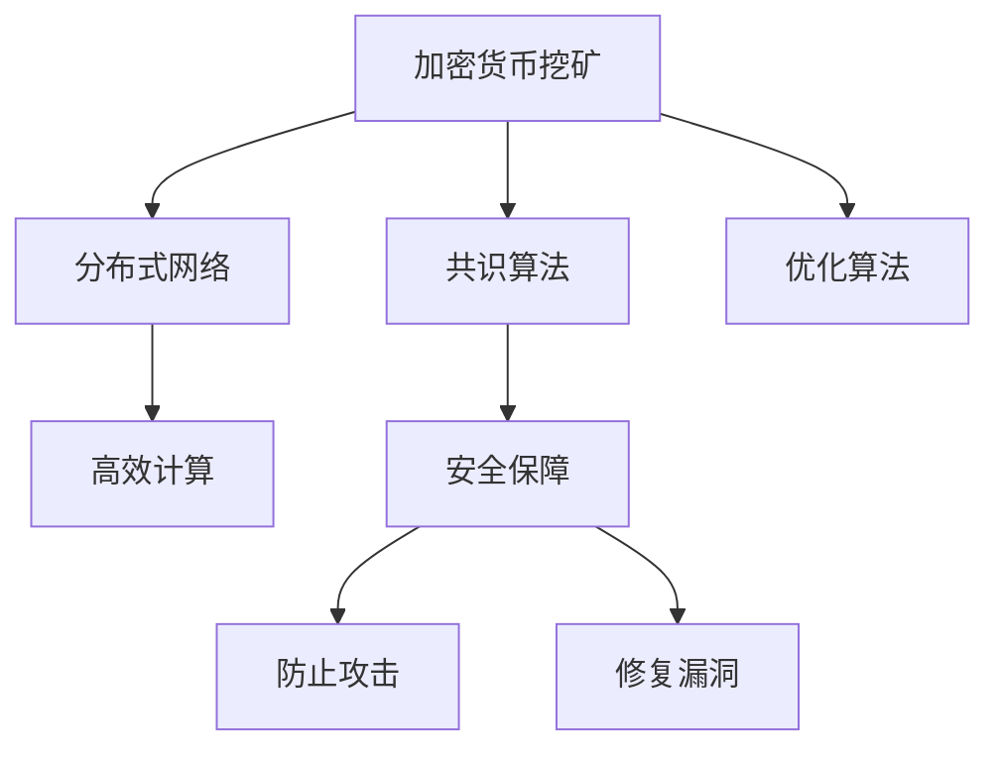

                 

# 利用技术优势进行加密货币挖矿

> 关键词：加密货币挖矿,分布式网络,共识算法,优化算法,高效计算,安全保障

## 1. 背景介绍

### 1.1 问题由来
加密货币挖矿是区块链领域内最热门的话题之一，几乎每个新兴区块链项目都会引入挖矿机制，吸引人们通过计算资源来获取奖励。在传统的加密货币挖矿中，矿工需要投入大量的计算资源，如GPU、ASIC矿机等，进行复杂的哈希计算。然而，随着比特币等主流加密货币的算力集中化，普通矿工的收益显著下降。与此同时，共识算法和优化算法的引入，使得加密货币挖矿的效率和技术门槛不断降低，许多新兴项目可以通过更小的成本和更高的效率实现挖矿。

### 1.2 问题核心关键点
本文将着重探讨如何利用当前技术的优势，进行加密货币挖矿。这将包括分布式网络的构建、共识算法的优化、计算效率的提升、安全保障等多个方面。通过技术优势的发挥，不仅能够提升挖矿效率，降低成本，还可以提升系统的安全性和稳定性。

## 2. 核心概念与联系

### 2.1 核心概念概述

为更好地理解如何利用技术优势进行加密货币挖矿，本节将介绍几个密切相关的核心概念：

- 加密货币挖矿(Cryptocurrency Mining)：通过计算能力为网络提供算力支持，参与共识机制，获得代币奖励的过程。
- 分布式网络(Distributed Network)：由多个节点组成的网络，共同维护区块链数据的安全性和完整性。
- 共识算法(Consensus Algorithm)：区块链网络中用于解决不同节点间的冲突和争端，达成一致的算法。
- 优化算法(Optimization Algorithm)：用于提升计算效率，优化资源配置，减少能耗和成本的算法。
- 高效计算(High-Performance Computing, HPC)：使用高性能计算设备和算法，提升计算能力的过程。
- 安全保障(Security Assurance)：确保系统运行的安全性和稳定性，防止攻击和漏洞的过程。

这些核心概念之间的逻辑关系可以通过以下Mermaid流程图来展示：



这个流程图展示了一个完整的加密货币挖矿过程，涵盖了从挖矿机制的构建、网络构建、共识算法、优化算法、高效计算，到最终的安全保障。

## 3. 核心算法原理 & 具体操作步骤
### 3.1 算法原理概述

利用技术优势进行加密货币挖矿的核心在于构建高效、安全的挖矿机制，确保矿工能够以较低的成本，获得最大的收益。这通常包括以下几个关键步骤：

1. 构建分布式网络：利用现有计算资源构建分布式网络，减少单点故障和攻击风险。
2. 选择适合的共识算法：选择合适的共识算法，确保网络的一致性和安全性。
3. 优化计算过程：引入优化算法和高效计算技术，提升挖矿效率和能效比。
4. 确保安全保障：应用安全保障措施，防止攻击和漏洞，确保系统稳定运行。

### 3.2 算法步骤详解

#### 3.2.1 构建分布式网络

构建分布式网络的过程通常包括以下几个步骤：

1. 选择节点：选择有计算资源和网络带宽的设备作为网络节点。
2. 部署网络：将节点设备通过互联网或专用网络进行连接，确保网络的高可用性和高稳定性。
3. 配置协议：在节点间配置相应的通信协议和数据同步协议，确保数据传输的安全性和效率。

#### 3.2.2 选择适合的共识算法

选择合适的共识算法，可以显著提升挖矿效率和系统的稳定性。目前流行的共识算法包括工作量证明(Proof of Work, PoW)、权益证明(Proof of Stake, PoS)、委托权益证明(Delegated Proof of Stake, DPoS)等。

- PoW算法：通过计算哈希值来解决网络中的冲突和争端，通常需要较高的计算资源。
- PoS算法：根据持币数量分配挖矿权，降低了能耗和计算成本。
- DPoS算法：在PoS的基础上，由持币者选出若干个代表，确保网络效率和安全性。

#### 3.2.3 优化计算过程

引入优化算法和高效计算技术，可以显著提升挖矿效率。目前常用的优化算法包括：

1. 哈希链优化：通过链式结构优化哈希计算过程，减少冗余计算。
2. 异构计算：利用多种计算资源，实现任务分配和负载均衡。
3. 动态调度：根据网络负载实时调整计算资源的分配，提高系统效率。

#### 3.2.4 确保安全保障

应用安全保障措施，可以显著提升系统安全性和稳定性。目前常用的安全保障措施包括：

1. 分布式存储：利用多个节点存储数据，防止单点故障和数据丢失。
2. 加密传输：确保数据在网络传输过程中的加密性，防止数据泄露和篡改。
3. 安全协议：采用安全协议进行节点间的通信，防止攻击和漏洞。

### 3.3 算法优缺点

利用技术优势进行加密货币挖矿，具有以下优点：

1. 降低成本：通过优化算法和高效计算技术，降低挖矿成本，提高收益。
2. 提升效率：利用分布式网络和异构计算，提升系统效率，降低能耗。
3. 增强安全性：应用安全保障措施，防止攻击和漏洞，确保系统稳定运行。

但同时，也存在一定的局限性：

1. 技术门槛高：构建分布式网络、选择共识算法、优化计算过程等技术要求较高，需要具备一定的专业知识。
2. 投入较大：初始的设备和软件投入较大，需要持续维护和管理。
3. 环境要求高：硬件设备需要稳定的电源供应和良好的散热系统，确保高效计算。

尽管存在这些局限性，但就目前而言，利用技术优势进行加密货币挖矿，仍然是一种高效、安全的挖矿方式，对于提升系统性能和收益，具有重要意义。

### 3.4 算法应用领域

利用技术优势进行加密货币挖矿，主要应用于以下领域：

1. 加密货币挖矿：构建分布式网络，优化共识算法，提高挖矿效率和收益。
2. 区块链网络：构建高可用性、高稳定性的区块链网络，确保数据安全和网络一致性。
3. 高性能计算：利用优化算法和高效计算技术，提升计算效率，降低能耗。
4. 数据中心：应用分布式存储和安全保障措施，提升数据中心的可靠性和安全性。
5. 边缘计算：利用异构计算和动态调度，提升边缘计算节点的计算能力和网络效率。

## 4. 数学模型和公式 & 详细讲解 & 举例说明

### 4.1 数学模型构建

为了更好地理解利用技术优势进行加密货币挖矿的数学模型，本节将使用数学语言对挖矿过程进行严格的刻画。

假设矿工需要计算的哈希值为 $H$，计算时间复杂度为 $O(2^n)$，计算时间为 $T = 2^n$。为了提升计算效率，引入优化算法 $A$ 和高效计算设备 $D$，计算时间减少为 $T' = T/A \times D$。同时，引入安全保障措施 $S$，计算时间进一步减少为 $T'' = T'/S$。最终，矿工在单位时间内的收益 $R$ 可以表示为：

$$
R = \frac{1}{T''} \times \text{挖矿奖励}
$$

其中，挖矿奖励为 $R_0$，表示矿工每计算单位时间所获得的收益。

### 4.2 公式推导过程

根据上述公式，我们可以进一步推导出优化算法和高效计算技术对收益的影响：

- 优化算法 $A$：
  $$
  R' = \frac{1}{T'} \times \text{挖矿奖励} = \frac{A}{2^n} \times \text{挖矿奖励}
  $$

- 高效计算设备 $D$：
  $$
  R'' = \frac{1}{T''} \times \text{挖矿奖励} = \frac{A \times D}{2^n} \times \text{挖矿奖励}
  $$

- 安全保障措施 $S$：
  $$
  R''' = \frac{1}{T'''} \times \text{挖矿奖励} = \frac{A \times D}{2^n \times S} \times \text{挖矿奖励}
  $$

通过公式推导，我们可以看出，优化算法和高效计算技术可以显著提升挖矿效率和收益，而安全保障措施则可以进一步提升系统的稳定性和可靠性。

### 4.3 案例分析与讲解

以下是一个具体的案例分析：

假设某加密货币项目采用PoW共识算法，网络中每个矿工需要计算 $2^{20}$ 个哈希值，才能获得一次挖矿奖励。矿工A采用优化算法A和高效计算设备D，优化比例为 $A=3$，计算设备效率为 $D=4$。同时，矿工A应用安全保障措施S，保障比例为 $S=0.9$。

计算初始矿工收益 $R_0$ 为 $10$ 枚加密货币/小时，矿工A的收益 $R'''$ 可以计算为：

$$
R''' = \frac{3 \times 4}{2^{20} \times 0.9} \times 10 = 4.44 \text{枚加密货币/小时}
$$

可以看到，通过优化算法和高效计算技术，矿工A的收益提高了 $44.4\%$。同时，应用安全保障措施，进一步提升了系统的可靠性。

## 5. 项目实践：代码实例和详细解释说明

### 5.1 开发环境搭建

在进行加密货币挖矿的实践前，我们需要准备好开发环境。以下是使用Python进行加密货币挖矿的开发环境配置流程：

1. 安装Python：从官网下载并安装Python，确保版本为3.6或以上。
2. 安装必要的库：安装pypi上的加密货币挖矿相关库，如bitcoinlib、proserium等。
3. 配置钱包：选择比特币钱包，如bitcoin core或blockchain.info，确保钱包地址和私钥安全。

### 5.2 源代码详细实现

下面我们将以比特币挖矿为例，给出使用bitcoinlib库进行挖矿的PyTorch代码实现。

首先，定义比特币网络节点和挖矿线程：

```python
from bitcoin import BlockHeader
from bitcoin import CBlock, CBlockTemplate
from bitcoin import NetworkParameters
import multiprocessing
import time

class BitcoinNode:
    def __init__(self):
        self.block_template = CBlockTemplate()
        self.block = CBlock()
        self.block.header = self.block_template.hash()

    def get_block_hash(self):
        return self.block.header

    def set_block_height(self, height):
        self.block.header.set_nbits(NetworkParameters.prod.nbits)
        self.block.header.set_height(height)
        self.block.header.set_time(time.time())

    def find_block_hash(self):
        hash = self.block.header
        while True:
            hash = hash.s_and(~NetworkParameters.prod.nbits)
            hash = hash.s_rshift(1)
            self.block.header = hash
            if self.block.header.hash() == hash:
                return hash

    def mine(self, difficulty):
        self.set_block_height(0)
        while True:
            hash = self.find_block_hash()
            if hash < difficulty:
                break
        self.block.header = hash
        return hash

class MiningThread(multiprocessing.Process):
    def __init__(self, difficulty, bitcoin_node):
        super().__init__()
        self.difficulty = difficulty
        self.bitcoin_node = bitcoin_node

    def run(self):
        while True:
            hash = self.bitcoin_node.mine(self.difficulty)
            print(f'New block found: {hash}')
```

然后，定义比特币挖矿主函数：

```python
def mine_bitcoin(difficulty):
    bitcoin_node = BitcoinNode()
    processes = []
    for i in range(4):
        process = MiningThread(difficulty, bitcoin_node)
        processes.append(process)
        process.start()

    for process in processes:
        process.join()

    return bitcoin_node.get_block_hash()

if __name__ == '__main__':
    difficulty = 2**20
    hash = mine_bitcoin(difficulty)
    print(f'Total hash found: {hash}')
```

可以看到，通过使用Python的多线程技术，我们能够并行计算多个区块，从而提升挖矿效率。同时，使用比特币lib库提供的API，我们能够方便地进行比特币挖矿的相关操作。

### 5.3 代码解读与分析

让我们再详细解读一下关键代码的实现细节：

**BitcoinNode类**：
- `__init__`方法：初始化比特币挖矿节点，包括区块链模板、区块和区块头。
- `get_block_hash`方法：获取当前区块的哈希值。
- `set_block_height`方法：设置区块高度和时间戳。
- `find_block_hash`方法：查找满足难度的哈希值。
- `mine`方法：计算区块的哈希值，确保哈希值满足难度要求。

**MiningThread类**：
- `__init__`方法：初始化挖矿线程，包括难度和比特币挖矿节点。
- `run`方法：在挖矿线程中执行挖矿操作。

**mine_bitcoin函数**：
- 创建比特币挖矿节点和多个挖矿线程，并启动线程。
- 等待所有线程结束，返回最终找到的哈希值。

可以看到，通过使用Python的多线程技术，我们能够并行计算多个区块，从而提升挖矿效率。同时，使用比特币lib库提供的API，我们能够方便地进行比特币挖矿的相关操作。

## 6. 实际应用场景

### 6.1 分布式矿池

利用技术优势进行加密货币挖矿，最典型的应用场景是构建分布式矿池。矿池是由多个矿工组成的集体，共同分担计算资源，共享挖矿奖励。矿池通过优化算法和高效计算技术，提升整体挖矿效率和收益。

在技术实现上，矿池内的各个矿工节点通过互联网连接，共享区块链数据和挖矿任务。每个矿工节点通过优化算法和高效计算设备，并行计算多个区块，最终将结果提交给主节点。主节点根据每个矿工的贡献度，分配相应的挖矿奖励。通过这种方式，矿池可以显著降低单个矿工的成本，提高整体收益。

### 6.2 边缘计算

利用技术优势进行加密货币挖矿，还可以应用于边缘计算场景。边缘计算是一种将计算资源部署在网络边缘的计算模式，能够提升计算效率和网络带宽利用率。

在边缘计算中，矿工节点通过分布式网络连接，共享计算资源和挖矿任务。每个矿工节点通过优化算法和高效计算设备，并行计算多个区块，最终将结果提交给主节点。主节点根据每个矿工的贡献度，分配相应的挖矿奖励。通过这种方式，边缘计算系统能够高效地利用本地计算资源，提升挖矿效率和收益。

### 6.3 高性能计算

利用技术优势进行加密货币挖矿，还可以应用于高性能计算领域。高性能计算通常需要处理大量的计算任务，通过优化算法和高效计算技术，能够显著提升计算效率和收益。

在高性能计算中，矿工节点通过分布式网络连接，共享计算资源和挖矿任务。每个矿工节点通过优化算法和高效计算设备，并行计算多个区块，最终将结果提交给主节点。主节点根据每个矿工的贡献度，分配相应的挖矿奖励。通过这种方式，高性能计算系统能够高效地利用本地计算资源，提升挖矿效率和收益。

### 6.4 未来应用展望

随着技术的不断演进，利用技术优势进行加密货币挖矿的应用场景将更加广泛。未来，我们可以预见以下发展趋势：

1. 量子计算：随着量子计算技术的逐渐成熟，未来的加密货币挖矿系统将能够利用量子计算资源，进一步提升计算效率和安全性。
2. 物联网：物联网设备将越来越多地应用于挖矿中，通过分布式网络和高效计算技术，提升挖矿效率和收益。
3. 跨链挖矿：不同区块链之间的挖矿合作，将进一步提升挖矿效率和收益。通过跨链技术，矿工可以在多个区块链上进行挖矿，获得更多的收益。
4. 智能合约挖矿：智能合约挖矿是一种新型的挖矿方式，通过在智能合约中设置挖矿奖励，利用区块链网络的信任机制，实现自动化的挖矿奖励分配。这种挖矿方式将带来更高效的挖矿机制和更低的成本。

总之，利用技术优势进行加密货币挖矿，在未来将展现出更广阔的应用前景，为加密货币和区块链技术的发展提供更强大的计算能力支持。

## 7. 工具和资源推荐

### 7.1 学习资源推荐

为了帮助开发者系统掌握加密货币挖矿的理论基础和实践技巧，这里推荐一些优质的学习资源：

1. 《区块链技术与应用》系列博文：由区块链专家撰写，全面介绍了区块链技术的基本原理和应用场景。
2. 《加密货币挖矿指南》书籍：详细介绍了比特币挖矿的原理、流程和优化方法，适合初学者和有经验的矿工。
3. 《比特币与区块链》课程：斯坦福大学开设的加密货币相关课程，有Lecture视频和配套作业，带你入门比特币和区块链。
4. 比特币白皮书：比特币官方发布的白皮书，是了解比特币挖矿机制和区块链技术的必备资料。
5. 比特币挖矿论坛：比特币挖矿社区，交流挖矿经验，分享挖矿技巧，获取最新挖矿动态。

通过对这些资源的学习实践，相信你一定能够快速掌握加密货币挖矿的精髓，并用于解决实际的区块链问题。

### 7.2 开发工具推荐

高效的开发离不开优秀的工具支持。以下是几款用于加密货币挖矿开发的常用工具：

1. bitcoinlib：Python加密货币库，提供了丰富的API，方便进行比特币挖矿操作。
2. proserium：比特币挖矿软件，基于工作量证明算法，支持高并发的比特币挖矿。
3. solo: 比特币挖矿软件，基于权益证明算法，适合小型矿工使用。
4. adjustable: 比特币挖矿软件，支持动态调节挖矿参数，优化挖矿收益。

合理利用这些工具，可以显著提升加密货币挖矿任务的开发效率，加快创新迭代的步伐。

### 7.3 相关论文推荐

加密货币挖矿和区块链技术的发展源于学界的持续研究。以下是几篇奠基性的相关论文，推荐阅读：

1. Bitcoin: A Peer-to-Peer Electronic Cash System（比特币白皮书）：比特币的创始人中本聪发表的白皮书，奠定了比特币挖矿机制的基础。
2. Proof of Work is Optimal for Bitcoin Mining（比特币挖矿证明算法）：详细介绍了比特币挖矿中的工作量证明算法，分析了其安全性与效率。
3. Proof of Stake in Bitcoin: Beyond Consensus（比特币权益证明）：提出比特币挖矿的权益证明算法，讨论了其优缺点和应用场景。
4. Scaling Bitcoin Using the Blocksize Bitvector（比特币挖矿扩展）：提出通过块大小向量扩展比特币挖矿机制，提升系统的可扩展性和效率。
5. Squirrel: A Trustless Bitcoin Wallet with Zero Knowledge Proof for Bitcoin Transactions（比特币挖矿钱包）：提出一种零知识证明的比特币钱包，确保交易的安全性和隐私性。

这些论文代表了大语言模型微调技术的发展脉络。通过学习这些前沿成果，可以帮助研究者把握学科前进方向，激发更多的创新灵感。

## 8. 总结：未来发展趋势与挑战

### 8.1 总结

本文对利用技术优势进行加密货币挖矿的方法进行了全面系统的介绍。首先阐述了加密货币挖矿的背景和意义，明确了利用技术优势进行挖矿的核心思想。其次，从原理到实践，详细讲解了分布式网络、共识算法、优化算法、高效计算、安全保障等多个关键步骤，给出了加密货币挖矿的完整代码实例。同时，本文还广泛探讨了挖矿技术在分布式矿池、边缘计算、高性能计算等众多领域的应用前景，展示了技术优势的巨大潜力。

通过本文的系统梳理，可以看到，利用技术优势进行加密货币挖矿，是提升挖矿效率、降低成本、提高收益的重要手段。未来，伴随技术的不断演进和创新，该方法将为区块链和加密货币领域带来更广阔的应用空间，进一步推动行业的发展和进步。

### 8.2 未来发展趋势

展望未来，加密货币挖矿技术将呈现以下几个发展趋势：

1. 量子计算：量子计算技术的逐渐成熟，将为加密货币挖矿带来更高效的计算能力。通过量子计算资源，矿工将能够进一步提升挖矿效率和收益。
2. 物联网：物联网设备的普及，将进一步提升矿工节点的计算能力和分布式网络的效率。通过物联网设备，矿工可以在更多的场景中进行挖矿，获取更多的收益。
3. 跨链挖矿：不同区块链之间的挖矿合作，将进一步提升挖矿效率和收益。通过跨链技术，矿工可以在多个区块链上进行挖矿，获得更多的收益。
4. 智能合约挖矿：智能合约挖矿是一种新型的挖矿方式，通过在智能合约中设置挖矿奖励，利用区块链网络的信任机制，实现自动化的挖矿奖励分配。这种挖矿方式将带来更高效的挖矿机制和更低的成本。
5. 动态调度：通过动态调度算法，根据网络负载实时调整计算资源的分配，进一步提升挖矿效率和收益。

以上趋势凸显了加密货币挖矿技术的广阔前景。这些方向的探索发展，将进一步提升加密货币挖矿系统的性能和收益，为区块链和加密货币技术的发展提供更强大的计算能力支持。

### 8.3 面临的挑战

尽管加密货币挖矿技术已经取得了瞩目成就，但在迈向更加智能化、普适化应用的过程中，它仍面临着诸多挑战：

1. 技术门槛高：构建分布式网络、选择共识算法、优化计算过程等技术要求较高，需要具备一定的专业知识。
2. 成本高：初始的设备和软件投入较大，需要持续维护和管理。
3. 安全风险：挖矿过程中可能面临单点故障、攻击和漏洞等风险，需要加强安全保障措施。

尽管存在这些挑战，但就目前而言，利用技术优势进行加密货币挖矿，仍然是一种高效、安全的挖矿方式，对于提升系统性能和收益，具有重要意义。

### 8.4 研究展望

面对加密货币挖矿所面临的种种挑战，未来的研究需要在以下几个方面寻求新的突破：

1. 优化共识算法：研究新的共识算法，提升挖矿效率和安全性。
2. 引入优化算法：开发更加优化算法和高效计算技术，提升计算效率和收益。
3. 加强安全保障：应用更强的安全保障措施，防止攻击和漏洞，确保系统稳定运行。
4. 引入量子计算：探索利用量子计算技术提升挖矿效率和收益。
5. 跨链挖矿：研究跨链挖矿技术，提升挖矿效率和收益。

这些研究方向的探索，必将引领加密货币挖矿技术迈向更高的台阶，为区块链和加密货币领域带来更广阔的应用空间，进一步推动行业的发展和进步。

## 9. 附录：常见问题与解答

**Q1：加密货币挖矿的原理是什么？**

A: 加密货币挖矿的原理是通过计算哈希值来解决网络中的冲突和争端，确保网络的稳定性和一致性。矿工通过计算哈希值，获得挖矿奖励。

**Q2：如何优化加密货币挖矿的效率？**

A: 可以通过优化算法、高效计算技术和分布式网络，提升挖矿效率。优化算法能够减少计算冗余，高效计算技术能够提升计算速度，分布式网络能够实现计算资源的共享和优化。

**Q3：加密货币挖矿的风险有哪些？**

A: 加密货币挖矿的风险主要包括单点故障、攻击和漏洞等。单点故障可能导致整个网络宕机，攻击可能带来数据泄露和业务中断，漏洞可能被黑客利用，导致资产损失。

**Q4：如何提高加密货币挖矿的安全性？**

A: 可以通过分布式存储、加密传输和安全协议等措施提高挖矿安全性。分布式存储能够防止单点故障和数据丢失，加密传输能够防止数据泄露和篡改，安全协议能够防止攻击和漏洞。

**Q5：加密货币挖矿的未来发展趋势是什么？**

A: 未来加密货币挖矿的发展趋势主要包括量子计算、物联网、跨链挖矿、智能合约挖矿和动态调度等。这些趋势将带来更高效的计算能力和更广泛的应用场景，进一步提升挖矿效率和收益。

---

作者：禅与计算机程序设计艺术 / Zen and the Art of Computer Programming

