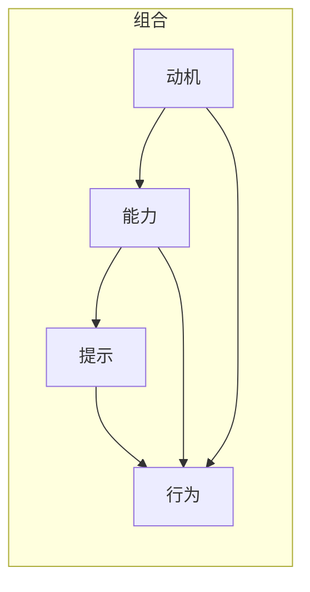

                 

# 利用福格行为模型改善团队习惯

> 关键词：行为设计,福格模型,习惯养成,团队管理,改善流程

## 1. 背景介绍

### 1.1 问题由来
在当今快速变化和竞争激烈的工作环境中，团队的表现和效率直接关系到组织的成败。然而，许多团队面临的挑战并非是缺乏资源或技术，而是缺乏有效的工作习惯。习惯对于个人和团队来说，是工作效率、创新能力以及团队合作的基石。但是，形成和维护良好的工作习惯并不是一件容易的事，尤其对于繁忙的团队来说，往往缺乏系统的方法来指导实践。

### 1.2 问题核心关键点
福格行为模型（Fogg's Model）作为一种行为科学工具，能够帮助我们理解如何通过最小的干预，改变个人和团队的行为。该模型由斯坦福大学行为科学家、畅销书作者宾·福格提出，主张“行为=动机*能力*提示”，强调了动机、能力和提示对行为改变的重要性。本文旨在探讨如何利用福格行为模型，在团队管理中培养和优化良好的工作习惯。

## 2. 核心概念与联系

### 2.1 核心概念概述

福格行为模型（Fogg's Model）：由行为科学家宾·福格提出，强调行为改变的三要素：动机、能力和提示。通过设计合理的工作提示，增强动机和能力，使个人和团队能够更自然地养成良好习惯。

动机（Motivation）：人们执行某个行为的意愿，可以是内在的（如成就感）或外在的（如奖励）。

能力（Ability）：执行某个行为所需的体力、脑力和时间资源，即是否具备执行行为的物理和心理条件。

提示（Prompts）：触发行为的条件，即能够触发特定行为的提示或线索。

通过这三个要素的组合，福格模型提供了一个可操作的框架，使个人和团队能够更有效地改变行为。

### 2.2 核心概念原理和架构的 Mermaid 流程图



## 3. 核心算法原理 & 具体操作步骤

### 3.1 算法原理概述

福格行为模型通过“动机+能力+提示”的三要素组合，为改善团队习惯提供了一个有效的框架。具体来说，该模型认为，只有当动机、能力和提示三个要素都具备时，一个行为才能被执行。因此，改变行为的关键在于，增强动机、简化能力、设计有针对性的提示。

### 3.2 算法步骤详解

**Step 1: 确定目标习惯**

首先，团队需要明确希望养成的习惯是什么。这一步骤需要全员参与，并设定一个具体的、可测量的、可实现的目标。例如，“每天在团队会议开始前进行5分钟的回顾和计划”。

**Step 2: 评估动机**

通过问询团队成员的动机，了解为什么这个习惯对他们重要。例如，“为什么你们觉得每天回顾和计划重要？”根据回答，团队可以更好地设计能够激发动机的策略。

**Step 3: 提升能力**

设计简单的、无须花费大量精力的行动步骤，以降低执行难度。例如，设定“提前一天准备好明天的回顾和计划材料”。这将使行动变得简单、容易，即使在没有额外资源的情况下也能执行。

**Step 4: 设计提示**

设计明确的、频繁的、自动的、易于识别的提示，以触发预期行为。例如，“每天早上第一件事，拿出今天的回顾和计划材料”。

**Step 5: 反复迭代**

实施上述步骤后，团队需要持续监测习惯养成的情况，并根据反馈进行迭代。可能需要多次调整动机、能力和提示，才能找到最佳组合。

### 3.3 算法优缺点

福格行为模型通过将复杂的改变行为任务分解为可操作的步骤，使个人和团队更容易执行，具有以下优点：

1. 简单易行：模型提供了一个可操作的框架，使复杂的行为改变变得可管理和可执行。
2. 高效实用：通过明确动机、提升能力和设计提示，能够快速见效。
3. 灵活性高：模型适用于各种类型的工作习惯，可以根据具体情况进行调整。

同时，福格行为模型也存在一些局限性：

1. 假设过于理想：模型假设所有行为都可以被分解为动机、能力和提示，但在某些复杂情境下，这一假设可能不成立。
2. 依赖团队成员的自我控制：模型效果依赖团队成员的自我控制能力，对于自律性较低的成员可能效果不明显。
3. 需要频繁监测和调整：需要持续的反馈和调整，对于忙碌的团队来说可能难以维持。

### 3.4 算法应用领域

福格行为模型适用于各种类型的组织和个人，尤其是团队管理。例如：

- 软件开发团队：每天进行代码审查和Bug跟踪，以提升代码质量和工作效率。
- 市场营销团队：定期分析市场趋势和竞争对手，以调整市场策略。
- 客户服务团队：每日例会回顾当天服务情况和客户反馈，以改进服务质量。

## 4. 数学模型和公式 & 详细讲解 & 举例说明

### 4.1 数学模型构建

福格行为模型虽然是行为科学模型，但在数学上可以表述为：

$$
行为 = 动机 \times 能力 \times 提示
$$

这里的动机、能力和提示都是变量，可以通过设计干预来调整。模型的目标是将行为设置为1，即实现预期行为的发生。

### 4.2 公式推导过程

1. **动机（Motivation）**：定义为动机强度，通常用$M$表示。
2. **能力（Ability）**：定义为执行行为所需的时间和资源，通常用$A$表示。
3. **提示（Prompt）**：定义为行为触发时的可见性和频率，通常用$P$表示。

将这些变量代入行为模型公式，得到：

$$
行为 = M \times A \times P
$$

目标是将$行为$设置为1，即：

$$
M \times A \times P = 1
$$

为了使行为发生，我们至少需要使$M$、$A$和$P$中的一个因子大于1，这将使总和大于1，从而触发预期行为。

### 4.3 案例分析与讲解

**案例1：提升团队会议的效率**

- **动机（M）**：团队成员希望会议更高效，减少时间浪费。
- **能力（A）**：提前准备会议材料（议题、会议记录等），使会议更容易进行。
- **提示（P）**：每天早上第一件事，查看今天的会议议程。

通过这种方式，团队能够有效地触发和维持高效的会议习惯。

**案例2：改进团队沟通**

- **动机（M）**：团队成员希望更快地解决问题，减少沟通障碍。
- **能力（A）**：使用统一的沟通工具（如Slack），简化沟通流程。
- **提示（P）**：每次有问题时，立即在沟通工具上发帖讨论。

通过这些设计，团队能够快速、高效地解决问题，提升沟通效率。

## 5. 项目实践：代码实例和详细解释说明

### 5.1 开发环境搭建

在Python中使用行为设计库BDL（Behavior Design Library）进行行为设计。

```python
pip install bdlib
```

### 5.2 源代码详细实现

以下是使用BDL进行行为设计的示例代码：

```python
from bdlib import BehaviorDesign

# 定义行为设计
design = BehaviorDesign('养成每天早上写日志的习惯')

# 添加动机
design.add_motivation('改善时间管理', strength=5)
design.add_motivation('提高个人效率', strength=3)

# 提升能力
design.add_ability('每天早上预留15分钟', cost=1)
design.add_ability('每天早上准备好日志模板', cost=2)

# 设计提示
design.add_prompt('每天早上起床后第一件事', frequency=1)
design.add_prompt('看到床边设置好的日志模板', frequency=1)

# 运行行为设计
design.run()
```

### 5.3 代码解读与分析

- ** BehaviorDesign**类：用于创建新的行为设计，通过类的方法和属性来设置动机、能力、提示。
- **add_motivation**方法：用于添加动机，可以通过`strength`参数设置动机的强度。
- **add_ability**方法：用于提升能力，可以通过`cost`参数设置能力提升所需的资源。
- **add_prompt**方法：用于设计提示，可以通过`frequency`参数设置提示的频率。

### 5.4 运行结果展示

运行上述代码后，BDL会生成一系列的执行计划和建议，帮助团队成员逐步养成目标习惯。例如：

- 每天早上6:30设定闹钟，提醒开始写日志。
- 在床头放置日志模板，减少早上搜寻模板的时间。
- 提前一天准备好日志内容，减轻早晨的压力。

## 6. 实际应用场景

### 6.1 智能办公环境

智能办公环境利用福格行为模型，帮助员工养成高效工作的习惯。例如，通过设定智能提醒、优化工作流程等，使得员工能够自然地遵循高效的工作习惯。

**实际应用：**在智能办公软件中嵌入行为设计功能，帮助员工自动记录会议记录、进行任务分配和进度跟踪，同时提醒员工保持高效工作状态。

**效果：**员工工作效率显著提升，会议记录和任务跟踪变得更加有条不紊，日常工作的组织和执行变得更加高效。

### 6.2 远程工作团队

远程工作团队常常面临沟通和协作难题。利用福格行为模型，团队可以设计有效的沟通习惯，确保远程协作的顺畅。

**实际应用：**设定每日固定的沟通时间，使用统一的协作工具，并在工具中设定提醒，确保团队成员定期进行信息共享和反馈。

**效果：**远程团队的沟通效率大大提升，信息共享更加及时，任务执行更加有序，团队协作变得更加紧密。

### 6.3 教育机构

教育机构利用福格行为模型，帮助学生养成高效学习的习惯。例如，通过设定固定的学习时间和复习计划，鼓励学生定期回顾和总结所学内容。

**实际应用：**在校园应用程序中嵌入行为设计功能，帮助学生设置学习目标、制定学习计划，并通过提醒和激励机制，确保学生按照计划进行学习。

**效果：**学生学习效率和成绩显著提升，学习习惯更加稳定，课堂和课外学习变得更加高效。

## 7. 工具和资源推荐

### 7.1 学习资源推荐

1. **《行为设计：改变习惯的策略》**：宾·福格著，介绍了福格行为模型的核心思想和具体应用案例。
2. **《习惯的力量》**：查尔斯·杜希格著，分析了习惯的形成机制和改变方法。
3. **Coursera课程《改变习惯的设计》**：由宾·福格开设，深入讲解福格行为模型的应用。
4. **Behavior Design Library官方文档**：BDL的官方文档，提供了详细的API和使用示例。

### 7.2 开发工具推荐

1. **BDL（Behavior Design Library）**：行为设计库，提供简单易用的API，帮助团队设计行为习惯。
2. **Slack**：强大的协作工具，通过设定提醒和自动化流程，帮助团队养成良好的沟通习惯。
3. **Trello**：任务管理工具，通过设定任务优先级和提醒，帮助团队管理任务和进度。
4. **Google Calendar**：日程管理工具，通过设定提醒和自动生成日程，帮助团队安排和遵循工作习惯。

### 7.3 相关论文推荐

1. **《行为科学：影响个人、群体和组织》**：宾·福格著，深入分析了行为科学的核心原理和实际应用。
2. **《习惯的力量：为什么我们做我们想要做的事，而不想做的事？》**：查尔斯·杜希格著，探讨了习惯的形成机制和改变方法。
3. **《改变行为的设计原则》**：皮特·基奇曼和伊恩·本顿著，介绍了基于行为设计改变行为的具体方法和案例。

## 8. 总结：未来发展趋势与挑战

### 8.1 研究成果总结

福格行为模型在团队管理中表现出了巨大的潜力，通过设计合理的提示和提升能力，能够有效改善工作习惯，提升团队绩效。然而，模型的应用仍面临一些挑战，如需要频繁的监测和调整，以及依赖团队成员的自我控制能力。

### 8.2 未来发展趋势

1. **自动化与智能化**：未来的行为设计将更加智能化，通过AI技术自动监测行为变化，提供个性化的行为设计建议。
2. **多渠道集成**：行为设计将与其他管理工具和平台无缝集成，提供跨平台的行为管理能力。
3. **个性化定制**：根据不同团队和成员的特定需求，提供高度定制化的行为设计方案。
4. **数据驱动**：通过大数据分析，实时监测行为效果，不断优化行为设计。

### 8.3 面临的挑战

1. **数据隐私**：行为设计需要收集大量个人和团队数据，如何保障数据隐私和安全是一个重要问题。
2. **系统复杂性**：行为设计的复杂性和多样性，可能给系统设计和实现带来困难。
3. **用户接受度**：用户对行为设计的接受度和适应度，可能因个体差异而不同。

### 8.4 研究展望

未来的研究将在以下几个方面展开：

1. **数据隐私保护**：开发更加安全、隐私保护的行为设计系统，确保数据安全。
2. **跨平台集成**：推动行为设计与不同管理工具的深度集成，提供无缝的用户体验。
3. **个性化定制**：开发更加智能的行为设计推荐系统，根据用户行为和反馈提供个性化建议。
4. **多学科融合**：结合心理学、社会学等多学科知识，提升行为设计的科学性和实用性。

总之，福格行为模型为改善团队习惯提供了一个系统的、可操作的框架，具有广阔的应用前景和研究价值。未来，随着技术的不断进步和应用的深入，福格行为模型将更加智能化、自动化，为团队管理提供更强大的支持。

## 9. 附录：常见问题与解答

**Q1：福格行为模型是否适用于所有团队？**

A: 福格行为模型适用于各类团队，但需要根据团队的实际情况进行个性化调整。对于特别复杂的团队，可能需要额外的干预措施。

**Q2：如何确定动机强度？**

A: 动机强度可以通过问卷调查、面谈等方式，了解团队成员的期望和需求。例如，“你为什么想提高团队会议效率？”“你觉得哪些因素能够激励你？”

**Q3：如何评估能力提升？**

A: 能力提升可以通过设定明确的行动步骤和资源消耗来评估。例如，“每天预留15分钟进行会议准备，是否可行？”“使用简单的模板是否可以节省时间？”

**Q4：如何设计有效的提示？**

A: 设计提示需要考虑频次、可见性和触发条件。例如，“每天早上起床后第一件事查看会议议程”“看到会议模板立即准备”。

**Q5：如何监测和调整行为设计？**

A: 通过设定监测指标和反馈机制，定期评估行为设计的执行效果，并根据反馈进行调整。例如，“每周回顾会议记录，评估会议效率”“根据反馈调整会议流程和工具”。

通过深入理解福格行为模型，并在团队管理中灵活应用，我们可以更好地改善工作习惯，提升团队效率和绩效。未来，随着技术的进步和应用的普及，福格行为模型将为更多团队带来实际的改进和优化。

