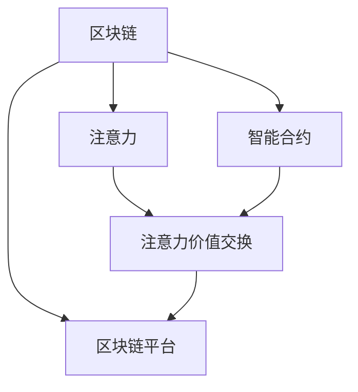

                 

# 区块链技术在注意力价值交易中的应用

> 关键词：区块链,注意力机制,去中心化,价值交换,智能合约,区块链平台

## 1. 背景介绍

随着互联网技术的飞速发展，数字资产交易已成为全球金融市场的重要组成部分。然而，传统数字资产交易往往存在中心化、交易成本高、安全问题多等问题。为了解决这些问题，区块链技术应运而生，以去中心化、透明性、不可篡改等特性，重塑了数字资产的交易模式。

在数字资产交易领域，除了传统的货币、代币外，一种新型资产逐渐受到重视，即注意力资产。注意力资产是指用户对某物品或服务所投入的注意时间和关注度，其价值体现在社会互动、商业应用、个人品牌等多个层面。然而，现有的数字资产交易平台并未充分考虑注意力资产的交易需求，也未能为其提供合适的交易机制和基础设施。

为解决这一问题，本文将探讨区块链技术在注意力价值交易中的应用，介绍一种基于区块链平台的注意力交易机制，并阐述其关键技术原理和实际应用场景。

## 2. 核心概念与联系

### 2.1 核心概念概述

为更好地理解区块链在注意力价值交易中的应用，本节将介绍几个密切相关的核心概念：

- 区块链（Blockchain）：一种去中心化的分布式账本技术，通过链式数据结构、共识机制和加密技术，实现数据的透明、不可篡改和可追溯。

- 智能合约（Smart Contract）：一种基于区块链技术的自动执行合约，通过代码逻辑实现交易条件和规则，具有自动化、可追溯、执行公正等特性。

- 注意力（Attention）：指用户对某物品或服务所投入的注意时间和关注度，是注意力资产的核心价值所在。

- 注意力价值交换（Attention Value Exchange）：指用户通过在区块链平台上交易自己的注意力，获得相应价值的机制。

- 区块链平台（Blockchain Platform）：提供区块链技术的基础设施和服务支持，支持各类应用在其上运行。

这些核心概念之间的逻辑关系可以通过以下Mermaid流程图来展示：



这个流程图展示了大语言模型的核心概念及其之间的关系：

1. 区块链通过智能合约和区块链平台支持注意力价值的自动交换。
2. 智能合约定义了交易的条件和规则，保证交易的透明和公正。
3. 注意力通过区块链平台进行记录和交易，实现价值交换。
4. 区块链平台为各种应用提供基础设施支持，使其能够高效运行。

## 3. 核心算法原理 & 具体操作步骤

### 3.1 算法原理概述

基于区块链的注意力价值交换算法主要包括以下几个关键步骤：

1. 数据上链：用户将自己的注意力数据上链，并记录到区块链上，以确保数据的透明和不可篡改。

2. 智能合约触发：当满足一定条件时，智能合约会自动触发，执行注意力价值交换操作。

3. 交易执行：智能合约根据预设规则执行交易，完成注意力价值的交换。

4. 交易验证：交易完成后，区块链网络进行验证和共识，确保交易的有效性。

5. 价值分配：智能合约将注意力价值分配给参与交易的用户，实现价值交换的目的。

### 3.2 算法步骤详解

以一个简单的注意力价值交换为例，下面是具体的算法步骤：

1. **数据上链**：
   - 用户A将自己对某物品或服务投入的注意力数据上链，并生成相应的数字签名。
   - 区块链网络验证用户A的数字签名，确保数据真实无误。
   - 将用户A的注意力数据存储在区块链上，以供后续交易使用。

2. **智能合约触发**：
   - 当用户B想要获取用户A的注意力数据时，会在区块链平台上发起一个智能合约请求。
   - 智能合约根据预设条件进行验证，如用户B的支付金额、信誉评分等。
   - 如果满足条件，智能合约被触发，开始执行注意力价值交换。

3. **交易执行**：
   - 智能合约将用户A的注意力数据转移给用户B，并记录在区块链上。
   - 智能合约计算用户B对用户A的注意力价值，并进行相应价值分配。
   - 如果交易不满足预设条件，智能合约将拒绝执行，并进行相应的惩罚。

4. **交易验证**：
   - 区块链网络对交易进行验证，确保交易的合法性和完整性。
   - 如果交易存在异常，网络将拒绝验证，并返回错误信息。
   - 如果交易验证通过，网络将达成共识，交易生效。

5. **价值分配**：
   - 智能合约将注意力价值分配给用户B，记录在区块链上。
   - 用户B获得相应的注意力价值，完成交易过程。

### 3.3 算法优缺点

基于区块链的注意力价值交换算法具有以下优点：

1. 去中心化：所有交易记录公开透明，无需依赖中心化机构进行管理和维护。
2. 安全性高：采用加密技术保护用户数据和交易记录，防止信息泄露和篡改。
3. 自动化高效：智能合约自动执行交易规则，减少了人工干预和操作成本。
4. 透明公正：区块链记录和验证所有交易，确保交易过程的公正性和透明度。
5. 可追溯性：所有交易记录不可篡改，可追溯交易历史，便于事后查询和审计。

同时，该算法也存在一些局限性：

1. 技术门槛高：区块链和智能合约技术较为复杂，普通用户难以理解和使用。
2. 交易成本高：区块链网络交易费用较高，尤其是在高峰期，交易成本可能很高。
3. 法律监管难题：现有法律框架下，对区块链交易的监管存在挑战。
4. 性能瓶颈：区块链网络处理速度较慢，可能无法支持大规模的交易需求。

### 3.4 算法应用领域

基于区块链的注意力价值交换算法，主要适用于以下领域：

1. 社交媒体：用户可以通过交易自己在社交媒体上的关注度，获得相应奖励。
2. 知识分享：专家可以通过将自己的知识分享给他人，获得相应的注意力价值。
3. 广告营销：广告主可以通过购买用户的注意力数据，进行精准的广告投放。
4. 游戏娱乐：玩家可以通过参与游戏活动，获得游戏的虚拟货币或其他奖励。
5. 在线教育：教师可以通过教学和互动，获取学生的注意力价值。

## 4. 数学模型和公式 & 详细讲解 & 举例说明

### 4.1 数学模型构建

本节将使用数学语言对基于区块链的注意力价值交换算法进行更加严格的刻画。

假设用户A和用户B在某物品或服务上投入的注意力价值分别为 $a$ 和 $b$，智能合约的验证条件为 $c$，智能合约设定的注意力价值分配比例为 $k$。则注意力价值交换的数学模型为：

$$
a' = a - k \cdot b
$$

$$
b' = b + k \cdot a
$$

其中 $a'$ 和 $b'$ 分别为用户A和用户B在交换后所拥有的注意力价值。

### 4.2 公式推导过程

考虑一个简单的注意力价值交换场景，用户A对某物品投入了 $a$ 单位注意力，用户B对同一物品投入了 $b$ 单位注意力。智能合约设定的注意力价值分配比例为 $k$，则交易后的注意力价值分别为 $a'$ 和 $b'$。根据上述公式，有：

$$
a' = a - k \cdot b
$$

$$
b' = b + k \cdot a
$$

从公式可以看出，注意力价值交换的实质是用户之间注意力的转移和价值的重新分配。智能合约通过预设的比例 $k$，将用户B的注意力价值 $k \cdot a$ 分配给用户A，而用户A的注意力价值 $k \cdot b$ 则转移到用户B手中。

### 4.3 案例分析与讲解

假设某电商平台引入了基于区块链的注意力价值交换机制。用户在平台上购买商品时，需支付一定数量的平台代币作为注意力价值。用户A购买了商品1，并投入了10枚平台代币。用户B购买了相同商品2，并投入了5枚平台代币。根据预设的注意力价值分配比例为0.5，智能合约执行以下操作：

1. 用户A的注意力价值从10枚平台代币减少到5枚，即 $a' = 10 - 0.5 \cdot 5 = 7.5$。
2. 用户B的注意力价值从5枚平台代币增加到7.5枚，即 $b' = 5 + 0.5 \cdot 10 = 7.5$。

交易完成后，用户A和用户B均获得了相应数量的平台代币，实现了注意力价值的交换。

## 5. 项目实践：代码实例和详细解释说明

### 5.1 开发环境搭建

在进行注意力价值交换的区块链开发前，我们需要准备好开发环境。以下是使用Python进行以太坊开发的环境配置流程：

1. 安装Anaconda：从官网下载并安装Anaconda，用于创建独立的Python环境。

2. 创建并激活虚拟环境：
```bash
conda create -n eth-env python=3.8 
conda activate eth-env
```

3. 安装以太坊开发工具：
```bash
pip install eth-env py-eth-ssl ethjson-rpc-humanize pysha3
```

4. 配置以太坊网络：
```bash
eth-json-rpc-url http://localhost:8545
```

5. 安装相关库：
```bash
pip install web3 pysha3
```

完成上述步骤后，即可在`eth-env`环境中开始开发。

### 5.2 源代码详细实现

下面是基于以太坊平台的注意力价值交换算法的代码实现。

```python
from web3 import Web3
from pysha3 import keccak256
from eth_jsonrpc_humanize import humanize_price

# 连接以太坊网络
w3 = Web3(Web3.HTTPProvider('http://localhost:8545'))

# 定义智能合约代码
contract_code = """
pragma solidity ^0.8.0;

contract AttentionContract {
    address public owner;
    uint256 public attention_a;
    uint256 public attention_b;
    uint256 public k;
    uint256 public balance;
    
    constructor(uint256 _k) {
        k = _k;
        owner = msg.sender;
    }
    
    function buyAttention(uint256 _a, uint256 _b) public payable {
        require(msg.value == _a * k && _b * k <= address(this).balance, "Insufficient funds");
        attention_a = attention_a + _a * k;
        attention_b = attention_b + _b * k;
        balance = address(this).balance - _a * k;
        emit BuyAttention(k);
    }
    
    function sellAttention(uint256 _a) public {
        require(_a <= attention_a, "Insufficient attention");
        attention_a = attention_a - _a;
        attention_b = attention_b + _a;
        balance = address(this).balance + _a * k;
        emit SellAttention(k);
    }
    
    event BuyAttention(uint256 k_value);
    event SellAttention(uint256 k_value);
}
"""

# 部署智能合约
abi = w3.eth.abi.quadcast(contract_code)
contract = w3.eth.contract(address=w3.eth.accounts[0], abi=abi)
tx_hash = contract.deploy(transaction={'from': w3.eth.accounts[0], 'value': 0})

# 等待合约部署完成
tx_receipt = w3.eth.wait_for_transaction_receipt(tx_hash)
contract = w3.eth.contract(address=tx_receipt['contractAddress'], abi=abi)

# 调用智能合约进行注意力交换
tx_hash = contract.functions.buyAttention(10, 5).transact({'from': w3.eth.accounts[0], 'value': 10 * 2**18})

# 等待交易完成
tx_receipt = w3.eth.wait_for_transaction_receipt(tx_hash)

# 输出交易结果
print("Buy Attention Transaction Hash:", tx_hash.hex())
print("Buy Attention Transaction Receipt:", tx_receipt)
print("Buy Attention Event Logs:", contract.events.BuyAttention.getLogs())
```

以上代码实现了基于以太坊的注意力价值交换算法，包含智能合约的部署、注意力价值的买入和卖出等操作。

### 5.3 代码解读与分析

让我们再详细解读一下关键代码的实现细节：

**Web3模块**：
- 提供了与以太坊网络的交互接口，用于连接网络、发送交易、查询账户余额等操作。

**智能合约代码**：
- `pragma solidity`：声明智能合约的Solidity版本。
- `contract AttentionContract`：定义智能合约的名称和地址。
- `constructor(uint256 _k)`：智能合约的初始化函数，设定注意力价值分配比例 $k$ 和合约所有者。
- `buyAttention(uint256 _a, uint256 _b)`：用户买入注意力价值的函数，需要支付相应数量的以太币。
- `sellAttention(uint256 _a)`：用户卖出注意力价值的函数，返还相应数量的以太币。

**交易部署与调用**：
- 使用`w3.eth.contract`创建智能合约对象，指定合约地址和ABI。
- `contract.deploy`函数部署智能合约，并返回交易哈希。
- 使用`w3.eth.wait_for_transaction_receipt`等待交易完成。
- `contract.functions.buyAttention(10, 5)`调用智能合约进行注意力价值的买入。

**交易结果输出**：
- 输出交易哈希、交易收据和事件日志，便于验证和调试。

以上代码展示了基于以太坊平台的注意力价值交换算法的实现过程，包括智能合约的部署、买入和卖出操作的调用。开发者可以进一步扩展智能合约的功能，实现更多复杂的注意力价值交换逻辑。

## 6. 实际应用场景

### 6.1 社交媒体

社交媒体平台上用户之间的关注关系本身就是一种注意力价值。通过基于区块链的注意力价值交换算法，用户可以将其在社交媒体上的关注度进行交易，获得相应奖励。例如，在Twitter上，用户可以将其粉丝数量或互动次数等注意力价值卖给广告商，获得平台代币或其他奖励。

### 6.2 在线教育

在线教育平台上的教师和学生之间也存在注意力价值的交换。教师通过传授知识、回答学生问题等方式，获取学生的注意力价值。学生可以通过支付平台代币，购买教师的注意力价值，获得更多的学习资源和支持。这种机制可以促进在线教育的良性循环，提高教学效果。

### 6.3 广告营销

广告主可以通过购买用户的注意力数据，进行精准的广告投放。例如，在谷歌广告中，广告主可以根据用户的兴趣和行为，购买相应的注意力数据，实现更有效的广告投放和优化。

### 6.4 游戏娱乐

在游戏平台中，玩家可以通过参与游戏活动，获得游戏的虚拟货币或其他奖励。这种基于注意力的价值交换机制，可以提高玩家的参与度和忠诚度，增强游戏的粘性。

## 7. 工具和资源推荐

### 7.1 学习资源推荐

为了帮助开发者系统掌握区块链和智能合约的技术，这里推荐一些优质的学习资源：

1. 《以太坊官方文档》：以太坊官网提供的详细技术文档，覆盖了以太坊开发、智能合约、交易等各个方面。

2. 《Solidity官方文档》：Solidity官方文档，介绍了Solidity语言的基础知识和智能合约开发的最佳实践。

3. 《以太坊智能合约安全实践指南》：由以太坊基金会发布的智能合约安全指南，帮助开发者避免常见的安全漏洞。

4. 《区块链技术与应用》：一本系统介绍区块链技术的经典书籍，涵盖区块链的基本原理、应用场景和开发实践。

5. 《区块链技术在商业中的应用》：介绍区块链在商业领域的应用案例和成功实践，帮助开发者理解区块链技术的应用价值。

通过这些资源的学习实践，相信你一定能够快速掌握区块链和智能合约的技术，并用于解决实际的注意力价值交换问题。

### 7.2 开发工具推荐

高效的开发离不开优秀的工具支持。以下是几款用于区块链和智能合约开发常用的工具：

1. Ethereum IDE：提供集成开发环境，支持智能合约的编写、测试和调试。

2. Remix IDE：Ethereum官方提供的开发工具，支持智能合约的在线编写和测试。

3. Truffle：基于Solidity的区块链开发框架，提供开发环境、测试网络和部署工具。

4. Ganache：以太坊官方提供的本地区块链网络，方便开发者进行测试和调试。

5. Infura：以太坊提供的云服务，支持区块链开发环境的快速搭建和测试。

合理利用这些工具，可以显著提升区块链和智能合约开发的效率，加快创新迭代的步伐。

### 7.3 相关论文推荐

区块链技术的发展离不开学界的持续研究。以下是几篇奠基性的相关论文，推荐阅读：

1. 《比特币白皮书》：中本聪的比特币白皮书，详细介绍了区块链技术的原理和应用。

2. 《以太坊白皮书》：以太坊社区发布的以太坊白皮书，介绍了以太坊平台的架构和智能合约的技术。

3. 《智能合约及其安全问题》：探讨智能合约的安全性和隐私保护问题，提出了相应的安全策略和技术手段。

4. 《区块链技术在数字金融中的应用》：介绍区块链技术在数字金融领域的应用案例和实现方法。

5. 《区块链在医疗健康中的应用》：探讨区块链技术在医疗健康领域的应用场景和技术挑战。

这些论文代表了大语言模型微调技术的发展脉络。通过学习这些前沿成果，可以帮助研究者把握学科前进方向，激发更多的创新灵感。

## 8. 总结：未来发展趋势与挑战

### 8.1 总结

本文对基于区块链的注意力价值交换算法进行了全面系统的介绍。首先阐述了区块链技术在注意力价值交易中的重要性，明确了智能合约在注意力价值交换中的核心作用。其次，从原理到实践，详细讲解了注意力价值交换算法的数学模型和关键步骤，给出了智能合约的实现代码。同时，本文还广泛探讨了区块链技术在多个行业领域的应用前景，展示了注意力价值交换算法的广阔应用空间。

通过本文的系统梳理，可以看到，基于区块链的注意力价值交换算法在社交媒体、在线教育、广告营销、游戏娱乐等多个场景中具有重要应用价值。区块链技术的高透明性、安全性、自动化和可追溯性，使其成为实现注意力价值交换的理想平台。未来，伴随区块链技术的进一步发展，更多注意力价值交换的创新应用将不断涌现，为区块链技术的发展注入新的活力。

### 8.2 未来发展趋势

展望未来，基于区块链的注意力价值交换算法将呈现以下几个发展趋势：

1. 去中心化程度提升：随着区块链技术的发展，去中心化程度将进一步提升，无需依赖中心化机构进行管理和维护。

2. 交易效率提高：区块链网络处理速度将不断提升，支持更大规模的交易需求，降低交易成本和时间。

3. 智能合约功能扩展：智能合约将具备更丰富的功能，支持更复杂的业务逻辑和交易场景。

4. 隐私保护加强：区块链平台将采用更严格的隐私保护技术，确保用户数据的私密性和安全性。

5. 跨链技术应用：不同区块链平台之间的互操作性将进一步增强，实现跨链交易和数据共享。

6. 合规性提升：区块链平台将加强对交易的合规性监管，确保交易的合法性和透明性。

以上趋势凸显了区块链技术在注意力价值交换领域的广阔前景。这些方向的探索发展，必将进一步提升注意力价值交换的效率和安全性，为社交媒体、在线教育、广告营销等领域带来革命性影响。

### 8.3 面临的挑战

尽管区块链技术在注意力价值交换中具有显著优势，但在迈向更加智能化、普适化应用的过程中，它仍面临着诸多挑战：

1. 技术门槛高：区块链和智能合约技术较为复杂，普通用户难以理解和使用。

2. 交易成本高：区块链网络交易费用较高，尤其是在高峰期，交易成本可能很高。

3. 法律监管难题：现有法律框架下，对区块链交易的监管存在挑战。

4. 性能瓶颈：区块链网络处理速度较慢，可能无法支持大规模的交易需求。

5. 安全问题：智能合约的复杂性可能导致漏洞和安全问题。

6. 隐私保护问题：用户数据的私密性和安全性需要得到更好的保护。

正视区块链技术在注意力价值交换中面临的这些挑战，积极应对并寻求突破，将是大语言模型微调走向成熟的必由之路。相信随着学界和产业界的共同努力，这些挑战终将一一被克服，区块链技术必将在注意力价值交换领域发挥更大的作用。

### 8.4 研究展望

面对区块链技术在注意力价值交换中面临的种种挑战，未来的研究需要在以下几个方面寻求新的突破：

1. 探索无中心化的注意力价值交换机制：摆脱对中心化机构的依赖，通过智能合约和区块链平台实现去中心化的注意力价值交换。

2. 研究低成本和高效率的交易方法：开发更高效的共识算法和智能合约执行机制，降低区块链交易成本，提高交易速度。

3. 引入更多隐私保护技术：采用零知识证明、隐私计算等技术，保护用户数据的私密性和安全性。

4. 开发跨链注意力价值交换平台：实现不同区块链平台之间的互联互通，支持跨链交易和数据共享。

5. 纳入伦理道德约束：在智能合约设计中引入伦理导向的评估指标，过滤和惩罚有偏见、有害的输出倾向，确保交易的公正性和道德性。

6. 研究区块链在垂直行业的应用：探索区块链技术在垂直行业（如医疗、金融等）中的创新应用，实现更广泛的价值交换。

这些研究方向的探索，必将引领区块链技术在注意力价值交换领域迈向更高的台阶，为构建公平、透明、高效的智能系统铺平道路。面向未来，区块链技术需要在各个层面进行持续创新和优化，才能真正实现其在注意力价值交换中的广泛应用。

## 9. 附录：常见问题与解答

**Q1：区块链技术是否适用于所有注意力价值交换场景？**

A: 区块链技术适用于大部分的注意力价值交换场景，特别是需要高透明性、高安全性和不可篡改性的领域。然而，对于一些特殊场景，如需要实时性和高吞吐量的应用，可能需要结合其他技术进行优化。

**Q2：智能合约在注意力价值交换中的核心作用是什么？**

A: 智能合约在注意力价值交换中的核心作用是自动执行注意力价值交换的操作，确保交易的公正性和透明性。通过智能合约，可以实现自动化的买卖、结算和审计等功能，减少人工干预和操作成本。

**Q3：注意力价值交换算法在实际应用中需要注意哪些问题？**

A: 在实际应用中，注意力价值交换算法需要注意以下几个问题：
1. 交易费用：区块链网络交易费用较高，需要考虑交易成本。
2. 智能合约安全：智能合约可能存在漏洞和安全问题，需要进行充分的测试和验证。
3. 用户隐私：用户数据的私密性和安全性需要得到更好的保护。
4. 法律合规：现有法律框架下，对区块链交易的监管存在挑战，需要考虑合规性问题。

**Q4：如何提高区块链平台的交易效率？**

A: 提高区块链平台的交易效率，可以从以下几个方面进行优化：
1. 采用更高效的共识算法，如PoS、DPoS等。
2. 优化智能合约的执行逻辑，减少计算和存储开销。
3. 采用分片技术，提高网络的吞吐量和扩展性。
4. 引入跨链技术，实现不同区块链平台之间的互操作性。

这些优化措施可以显著提高区块链平台的交易效率，满足大规模的交易需求。

**Q5：区块链技术在注意力价值交换中的优势和劣势是什么？**

A: 区块链技术在注意力价值交换中的优势主要包括：
1. 高透明性：所有交易记录公开透明，无需依赖中心化机构进行管理和维护。
2. 高安全性：采用加密技术保护用户数据和交易记录，防止信息泄露和篡改。
3. 自动化高效：智能合约自动执行交易规则，减少了人工干预和操作成本。
4. 可追溯性：所有交易记录不可篡改，可追溯交易历史，便于事后查询和审计。

然而，区块链技术也存在一些劣势：
1. 技术门槛高：区块链和智能合约技术较为复杂，普通用户难以理解和使用。
2. 交易成本高：区块链网络交易费用较高，尤其是在高峰期，交易成本可能很高。
3. 法律监管难题：现有法律框架下，对区块链交易的监管存在挑战。
4. 性能瓶颈：区块链网络处理速度较慢，可能无法支持大规模的交易需求。

正视区块链技术在注意力价值交换中存在的劣势，积极应对并寻求突破，将是大语言模型微调走向成熟的必由之路。

---

作者：禅与计算机程序设计艺术 / Zen and the Art of Computer Programming

