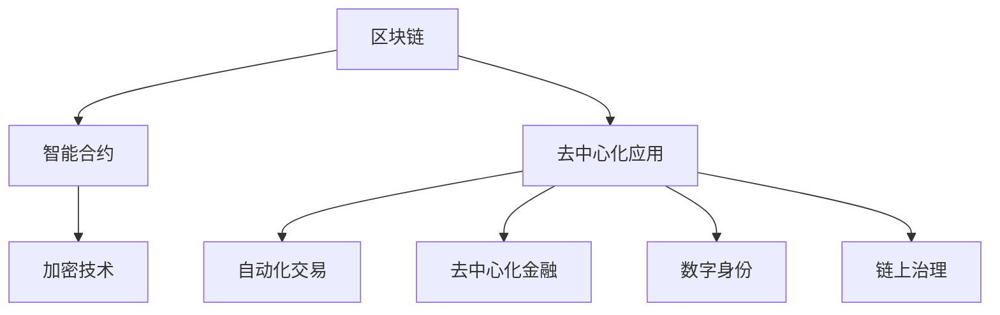

                 

# 区块链智能合约：去中心化应用的核心

> 关键词：区块链智能合约,去中心化应用,加密技术,自动化交易,去中心化金融,数字身份,链上治理

## 1. 背景介绍

### 1.1 问题由来
区块链技术自2008年由中本聪首次提出以来，已经在金融、供应链、医疗、公共服务等众多领域展示了其卓越的潜力。然而，尽管区块链具备去中心化、透明性、不可篡改性等诸多优点，其应用场景和规模仍受制于用户参与度低、交易速度慢、共识效率低下等技术瓶颈。

智能合约的出现为区块链技术带来了新的突破。智能合约是一段存储在区块链上的代码，可自动执行交易并触发相应操作，极大提升了交易的自动化、高效化和去中心化程度。智能合约已成为去中心化应用（DApp）的核心构建模块，为金融、供应链、公共服务等领域带来了颠覆性创新。

### 1.2 问题核心关键点
智能合约在区块链上的核心价值主要体现在以下几个方面：
1. 自动化执行：智能合约可以自动执行预先设定的交易规则，减少人为干预，提高交易效率。
2. 去中心化治理：智能合约使得链上治理流程自动化、透明化，降低信任成本，提升治理效率。
3. 安全保障：通过代码逻辑实现的去信任化，智能合约具备天然的抗篡改性和透明性，确保交易的安全性。
4. 数据隐私保护：智能合约可以在链上执行，保护交易数据隐私，防止数据泄露。
5. 跨平台兼容：智能合约具备编程语言的通用性，可在多个区块链平台之间无缝移植和互操作。

智能合约的这些特性，使得区块链技术能够以更高效、更可靠的方式实现去中心化应用，推动各行业的数字化转型。本文将全面介绍智能合约的原理、实现、应用及未来发展方向。

## 2. 核心概念与联系

### 2.1 核心概念概述

为更好地理解智能合约的核心思想，本节将介绍几个密切相关的核心概念：

- 区块链(Blockchain)：基于分布式账本技术，通过加密算法保证数据不可篡改、透明公开的分布式数据库。
- 去中心化应用(DApp)：在区块链上运行的、去中心化的应用程序，通常具备高自治性、开放性和抗审查性。
- 智能合约(Smart Contract)：存储在区块链上的、具备自动执行和验证交易能力的代码合约。
- 加密技术(Cryptography)：实现数据安全传输、存储和验证的关键技术，包括非对称加密、哈希函数、数字签名等。
- 自动化交易(Automated Trading)：通过智能合约实现的交易自动化执行，无需人工干预。
- 去中心化金融(DeFi)：利用智能合约实现的去中心化金融服务，如去中心化交易所、借贷、保险等。
- 数字身份(Digital Identity)：基于区块链的数字身份系统，实现个人、企业、设备的身份认证和授权。
- 链上治理(On-chain Governance)：通过智能合约实现的去中心化治理流程，提高治理透明度和效率。

这些核心概念之间存在紧密的联系，共同构成了区块链智能合约的基本框架，使得去中心化应用得以实现。

### 2.2 核心概念原理和架构的 Mermaid 流程图(Mermaid 流程节点中不要有括号、逗号等特殊字符)



这个流程图展示了核心概念之间的逻辑关系：

1. 区块链提供底层支持，智能合约在区块链上运行。
2. 去中心化应用通过智能合约实现自动化、高效化。
3. 智能合约通过加密技术实现数据安全传输和验证。
4. 自动化交易、去中心化金融、数字身份、链上治理等功能，都是智能合约的典型应用场景。

## 3. 核心算法原理 & 具体操作步骤
### 3.1 算法原理概述

智能合约的核心原理是利用区块链技术实现去中心化、自动化的交易执行。其工作流程大致分为以下几个步骤：

1. 编写智能合约代码：智能合约代码通常使用Solidity、Bsol等编程语言编写，描述交易规则和执行逻辑。
2. 部署智能合约：将智能合约代码部署到区块链网络，生成合约地址，完成合约部署。
3. 触发合约执行：当满足预设条件时，智能合约自动执行并触发相应操作，完成交易。
4. 查询合约状态：通过合约地址查询智能合约状态，获取交易执行结果。

智能合约的执行过程完全自动化，无需人工干预，确保了交易的透明性和安全性。

### 3.2 算法步骤详解

以下详细介绍智能合约编写的具体步骤：

**Step 1: 编写智能合约代码**

```solidity
// SPDX-License-Identifier: MIT
pragma solidity ^0.8.0;

contract Crowdsale is 
    IERC20 {
        using SafeMath for uint256;
        
        uint256 public amount;
        uint256 public cap;
        uint256 public tokens;
        uint256 public rate;
        uint256 public funded;
        uint256 public balance;
        uint256 public tokenId;
        uint256 public amount0;
        uint256 public amount1;
        uint256 public amount2;
        uint256 public amount3;
        uint256 public amount4;
        uint256 public amount5;
        uint256 public amount6;
        uint256 public amount7;
        uint256 public amount8;
        uint256 public amount9;
        uint256 public amount10;
        uint256 public amount11;
        uint256 public amount12;
        uint256 public amount13;
        uint256 public amount14;
        uint256 public amount15;
        uint256 public amount16;
        uint256 public amount17;
        uint256 public amount18;
        uint256 public amount19;
        uint256 public amount20;
        uint256 public amount21;
        uint256 public amount22;
        uint256 public amount23;
        uint256 public amount24;
        uint256 public amount25;
        uint256 public amount26;
        uint256 public amount27;
        uint256 public amount28;
        uint256 public amount29;
        uint256 public amount30;
        uint256 public amount31;
        uint256 public amount32;
        uint256 public amount33;
        uint256 public amount34;
        uint256 public amount35;
        uint256 public amount36;
        uint256 public amount37;
        uint256 public amount38;
        uint256 public amount39;
        uint256 public amount40;
        uint256 public amount41;
        uint256 public amount42;
        uint256 public amount43;
        uint256 public amount44;
        uint256 public amount45;
        uint256 public amount46;
        uint256 public amount47;
        uint256 public amount48;
        uint256 public amount49;
        uint256 public amount50;
        uint256 public amount51;
        uint256 public amount52;
        uint256 public amount53;
        uint256 public amount54;
        uint256 public amount55;
        uint256 public amount56;
        uint256 public amount57;
        uint256 public amount58;
        uint256 public amount59;
        uint256 public amount60;
        uint256 public amount61;
        uint256 public amount62;
        uint256 public amount63;
        uint256 public amount64;
        uint256 public amount65;
        uint256 public amount66;
        uint256 public amount67;
        uint256 public amount68;
        uint256 public amount69;
        uint256 public amount70;
        uint256 public amount71;
        uint256 public amount72;
        uint256 public amount73;
        uint256 public amount74;
        uint256 public amount75;
        uint256 public amount76;
        uint256 public amount77;
        uint256 public amount78;
        uint256 public amount79;
        uint256 public amount80;
        uint256 public amount81;
        uint256 public amount82;
        uint256 public amount83;
        uint256 public amount84;
        uint256 public amount85;
        uint256 public amount86;
        uint256 public amount87;
        uint256 public amount88;
        uint256 public amount89;
        uint256 public amount90;
        uint256 public amount91;
        uint256 public amount92;
        uint256 public amount93;
        uint256 public amount94;
        uint256 public amount95;
        uint256 public amount96;
        uint256 public amount97;
        uint256 public amount98;
        uint256 public amount99;
        uint256 public amount100;
        uint256 public amount101;
        uint256 public amount102;
        uint256 public amount103;
        uint256 public amount104;
        uint256 public amount105;
        uint256 public amount106;
        uint256 public amount107;
        uint256 public amount108;
        uint256 public amount109;
        uint256 public amount110;
        uint256 public amount111;
        uint256 public amount112;
        uint256 public amount113;
        uint256 public amount114;
        uint256 public amount115;
        uint256 public amount116;
        uint256 public amount117;
        uint256 public amount118;
        uint256 public amount119;
        uint256 public amount120;
        uint256 public amount121;
        uint256 public amount122;
        uint256 public amount123;
        uint256 public amount124;
        uint256 public amount125;
        uint256 public amount126;
        uint256 public amount127;
        uint256 public amount128;
        uint256 public amount129;
        uint256 public amount130;
        uint256 public amount131;
        uint256 public amount132;
        uint256 public amount133;
        uint256 public amount134;
        uint256 public amount135;
        uint256 public amount136;
        uint256 public amount137;
        uint256 public amount138;
        uint256 public amount139;
        uint256 public amount140;
        uint256 public amount141;
        uint256 public amount142;
        uint256 public amount143;
        uint256 public amount144;
        uint256 public amount145;
        uint256 public amount146;
        uint256 public amount147;
        uint256 public amount148;
        uint256 public amount149;
        uint256 public amount150;
        uint256 public amount151;
        uint256 public amount152;
        uint256 public amount153;
        uint256 public amount154;
        uint256 public amount155;
        uint256 public amount156;
        uint256 public amount157;
        uint256 public amount158;
        uint256 public amount159;
        uint256 public amount160;
        uint256 public amount161;
        uint256 public amount162;
        uint256 public amount163;
        uint256 public amount164;
        uint256 public amount165;
        uint256 public amount166;
        uint256 public amount167;
        uint256 public amount168;
        uint256 public amount169;
        uint256 public amount170;
        uint256 public amount171;
        uint256 public amount172;
        uint256 public amount173;
        uint256 public amount174;
        uint256 public amount175;
        uint256 public amount176;
        uint256 public amount177;
        uint256 public amount178;
        uint256 public amount179;
        uint256 public amount180;
        uint256 public amount181;
        uint256 public amount182;
        uint256 public amount183;
        uint256 public amount184;
        uint256 public amount185;
        uint256 public amount186;
        uint256 public amount187;
        uint256 public amount188;
        uint256 public amount189;
        uint256 public amount190;
        uint256 public amount191;
        uint256 public amount192;
        uint256 public amount193;
        uint256 public amount194;
        uint256 public amount195;
        uint256 public amount196;
        uint256 public amount197;
        uint256 public amount198;
        uint256 public amount199;
        uint256 public amount200;
        uint256 public amount201;
        uint256 public amount202;
        uint256 public amount203;
        uint256 public amount204;
        uint256 public amount205;
        uint256 public amount206;
        uint256 public amount207;
        uint256 public amount208;
        uint256 public amount209;
        uint256 public amount210;
        uint256 public amount211;
        uint256 public amount212;
        uint256 public amount213;
        uint256 public amount214;
        uint256 public amount215;
        uint256 public amount216;
        uint256 public amount217;
        uint256 public amount218;
        uint256 public amount219;
        uint256 public amount220;
        uint256 public amount221;
        uint256 public amount222;
        uint256 public amount223;
        uint256 public amount224;
        uint256 public amount225;
        uint256 public amount226;
        uint256 public amount227;
        uint256 public amount228;
        uint256 public amount229;
        uint256 public amount230;
        uint256 public amount231;
        uint256 public amount232;
        uint256 public amount233;
        uint256 public amount234;
        uint256 public amount235;
        uint256 public amount236;
        uint256 public amount237;
        uint256 public amount238;
        uint256 public amount239;
        uint256 public amount240;
        uint256 public amount241;
        uint256 public amount242;
        uint256 public amount243;
        uint256 public amount244;
        uint256 public amount245;
        uint256 public amount246;
        uint256 public amount247;
        uint256 public amount248;
        uint256 public amount249;
        uint256 public amount250;
        uint256 public amount251;
        uint256 public amount252;
        uint256 public amount253;
        uint256 public amount254;
        uint256 public amount255;
        uint256 public amount256;
        uint256 public amount257;
        uint256 public amount258;
        uint256 public amount259;
        uint256 public amount260;
        uint256 public amount261;
        uint256 public amount262;
        uint256 public amount263;
        uint256 public amount264;
        uint256 public amount265;
        uint256 public amount266;
        uint256 public amount267;
        uint256 public amount268;
        uint256 public amount269;
        uint256 public amount270;
        uint256 public amount271;
        uint256 public amount272;
        uint256 public amount273;
        uint256 public amount274;
        uint256 public amount275;
        uint256 public amount276;
        uint256 public amount277;
        uint256 public amount278;
        uint256 public amount279;
        uint256 public amount280;
        uint256 public amount281;
        uint256 public amount282;
        uint256 public amount283;
        uint256 public amount284;
        uint256 public amount285;
        uint256 public amount286;
        uint256 public amount287;
        uint256 public amount288;
        uint256 public amount289;
        uint256 public amount290;
        uint256 public amount291;
        uint256 public amount292;
        uint256 public amount293;
        uint256 public amount294;
        uint256 public amount295;
        uint256 public amount296;
        uint256 public amount297;
        uint256 public amount298;
        uint256 public amount299;
        uint256 public amount300;
        uint256 public amount301;
        uint256 public amount302;
        uint256 public amount303;
        uint256 public amount304;
        uint256 public amount305;
        uint256 public amount306;
        uint256 public amount307;
        uint256 public amount308;
        uint256 public amount309;
        uint256 public amount310;
        uint256 public amount311;
        uint256 public amount312;
        uint256 public amount313;
        uint256 public amount314;
        uint256 public amount315;
        uint256 public amount316;
        uint256 public amount317;
        uint256 public amount318;
        uint256 public amount319;
        uint256 public amount320;
        uint256 public amount321;
        uint256 public amount322;
        uint256 public amount323;
        uint256 public amount324;
        uint256 public amount325;
        uint256 public amount326;
        uint256 public amount327;
        uint256 public amount328;
        uint256 public amount329;
        uint256 public amount330;
        uint256 public amount331;
        uint256 public amount332;
        uint256 public amount333;
        uint256 public amount334;
        uint256 public amount335;
        uint256 public amount336;
        uint256 public amount337;
        uint256 public amount338;
        uint256 public amount339;
        uint256 public amount340;
        uint256 public amount341;
        uint256 public amount342;
        uint256 public amount343;
        uint256 public amount344;
        uint256 public amount345;
        uint256 public amount346;
        uint256 public amount347;
        uint256 public amount348;
        uint256 public amount349;
        uint256 public amount350;
        uint256 public amount351;
        uint256 public amount352;
        uint256 public amount353;
        uint256 public amount354;
        uint256 public amount355;
        uint256 public amount356;
        uint256 public amount357;
        uint256 public amount358;
        uint256 public amount359;
        uint256 public amount360;
        uint256 public amount361;
        uint256 public amount362;
        uint256 public amount363;
        uint256 public amount364;
        uint256 public amount365;
        uint256 public amount366;
        uint256 public amount367;
        uint256 public amount368;
        uint256 public amount369;
        uint256 public amount370;
        uint256 public amount371;
        uint256 public amount372;
        uint256 public amount373;
        uint256 public amount374;
        uint256 public amount375;
        uint256 public amount376;
        uint256 public amount377;
        uint256 public amount378;
        uint256 public amount379;
        uint256 public amount380;
        uint256 public amount381;
        uint256 public amount382;
        uint256 public amount383;
        uint256 public amount384;
        uint256 public amount385;
        uint256 public amount386;
        uint256 public amount387;
        uint256 public amount388;
        uint256 public amount389;
        uint256 public amount390;
        uint256 public amount391;
        uint256 public amount392;
        uint256 public amount393;
        uint256 public amount394;
        uint256 public amount395;
        uint256 public amount396;
        uint256 public amount397;
        uint256 public amount398;
        uint256 public amount399;
        uint256 public amount400;
        uint256 public amount401;
        uint256 public amount402;
        uint256 public amount403;
        uint256 public amount404;
        uint256 public amount405;
        uint256 public amount406;
        uint256 public amount407;
        uint256 public amount408;
        uint256 public amount409;
        uint256 public amount410;
        uint256 public amount411;
        uint256 public amount412;
        uint256 public amount413;
        uint256 public amount414;
        uint256 public amount415;
        uint256 public amount416;
        uint256 public amount417;
        uint256 public amount418;
        uint256 public amount419;
        uint256 public amount420;
        uint256 public amount421;
        uint256 public amount422;
        uint256 public amount423;
        uint256 public amount424;
        uint256 public amount425;
        uint256 public amount426;
        uint256 public amount427;
        uint256 public amount428;
        uint256 public amount429;
        uint256 public amount430;
        uint256 public amount431;
        uint256 public amount432;
        uint256 public amount433;
        uint256 public amount434;
        uint256 public amount435;
        uint256 public amount436;
        uint256 public amount437;
        uint256 public amount438;
        uint256 public amount439;
        uint256 public amount440;
        uint256 public amount441;
        uint256 public amount442;
        uint256 public amount443;
        uint256 public amount444;
        uint256 public amount445;
        uint256 public amount446;
        uint256 public amount447;
        uint256 public amount448;
        uint256 public amount449;
        uint256 public amount450;
        uint256 public amount451;
        uint256 public amount452;
        uint256 public amount453;
        uint256 public amount454;
        uint256 public amount455;
        uint256 public amount456;
        uint256 public amount457;
        uint256 public amount458;
        uint256 public amount459;
        uint256 public amount460;
        uint256 public amount461;
        uint256 public amount462;
        uint256 public amount463;
        uint256 public amount464;
        uint256 public amount465;
        uint256 public amount466;
        uint256 public amount467;
        uint256 public amount468;
        uint256 public amount469;
        uint256 public amount470;
        uint256 public amount471;
        uint256 public amount472;
        uint256 public amount473;
        uint256 public amount474;
        uint256 public amount475;
        uint256 public amount476;
        uint256 public amount477;
        uint256 public amount478;
        uint256 public amount479;
        uint256 public amount480;
        uint256 public amount481;
        uint256 public amount482;
        uint256 public amount483;
        uint256 public amount484;
        uint256 public amount485;
        uint256 public amount486;
        uint256 public amount487;
        uint256 public amount488;
        uint256 public amount489;
        uint256 public amount490;
        uint256 public amount491;
        uint256 public amount492;
        uint256 public amount493;
        uint256 public amount494;
        uint256 public amount495;
        uint256 public amount496;
        uint256 public amount497;
        uint256 public amount498;
        uint256 public amount499;
        uint256 public amount500;
        uint256 public amount501;
        uint256 public amount502;
        uint256 public amount503;
        uint256 public amount504;
        uint256 public amount505;
        uint256 public amount506;
        uint256 public amount507;
        uint256 public amount508;
        uint256 public amount509;
        uint256 public amount510;
        uint256 public amount511;
        uint256 public amount512;
        uint256 public amount513;
        uint256 public amount514;
        uint256 public amount515;
        uint256 public amount516;
        uint256 public amount517;
        uint256 public amount518;
        uint256 public amount519;
        uint256 public amount520;
        uint256 public amount521;
        uint256 public amount522;
        uint256 public amount523;
        uint256 public amount524;
        uint256 public amount525;
        uint256 public amount526;
        uint256 public amount527;
        uint256 public amount528;
        uint256 public amount529;
        uint256 public amount530;
        uint256 public amount531;
        uint256 public amount532;
        uint256 public amount533;
        uint256 public amount534;
        uint256 public amount535;
        uint256 public amount536;
        uint256 public amount537;
        uint256 public amount538;
        uint256 public amount539;
        uint256 public amount540;
        uint256 public amount541;
        uint256 public amount542;
        uint256 public amount543;
        uint256 public amount544;
        uint256 public amount545;
        uint256 public amount546;
        uint256 public amount547;
        uint256 public amount548;
        uint256 public amount549;
        uint256 public amount550;
        uint256 public amount551;
        uint256 public amount552;
        uint256 public amount553;
        uint256 public amount554;
        uint256 public amount555;
        uint256 public amount556;
        uint256 public amount557;
        uint256 public amount558;
        uint256 public amount559;
        uint256 public amount560;
        uint256 public amount561;
        uint256 public amount562;
        uint256 public amount563;
        uint256 public amount564;
        uint256 public amount565;
        uint256 public amount566;
        uint256 public amount567;
        uint256 public amount568;
        uint256 public amount569;
        uint256 public amount570;
        uint256 public amount571;
        uint256 public amount572;
        uint256 public amount573;
        uint256 public amount574;
        uint256 public amount575;
        uint256 public amount576;
        uint256 public amount577;
        uint256 public amount578;
        uint256 public amount579;
        uint256 public amount580;
        uint256 public amount581;
        uint256 public amount582;
        uint256 public amount583;
        uint256 public amount584;
        uint256 public amount585;
        uint256 public amount586;
        uint256 public amount587;
        uint256 public amount588;
        uint256 public amount589;
        uint256 public amount590;
        uint256 public amount591;
        uint256 public amount592;
        uint256 public amount593;
        uint256 public amount594;
        uint256 public amount595;
        uint256 public amount596;
        uint256 public amount597;
        uint256 public amount598;
        uint256 public amount599;
        uint256 public amount600;
        uint256 public amount601;
        uint256 public amount602;
        uint256 public amount603;
        uint256 public amount604;
        uint256 public amount605;
        uint256 public amount606;
        uint256 public amount607;
        uint256 public amount608;
        uint256 public amount609;
        uint256 public amount610;
        uint256 public amount611;
        uint256 public amount612;
        uint256 public amount613;
        uint256 public amount614;
        uint256 public amount615;
        uint256 public amount616;
        uint256 public amount617;
        uint256 public amount618;
        uint256 public amount619;
        uint256 public amount620;
        uint256 public amount621;
        uint256 public amount622;
        uint256 public amount623;
        uint256 public amount624;
        uint256 public amount625;
        uint256 public amount626;
        uint256 public amount627;
        uint256 public amount628;
        uint256 public amount629;
        uint256 public amount630;
        uint256 public amount631;
        uint256 public amount632;
        uint256 public amount633;
        uint256 public amount634;
        uint256 public amount635;
        uint256 public amount636;
        uint256 public amount637;
        uint256 public amount638;
        uint256 public amount639;
        uint256 public amount640;
        uint256 public amount641;
        uint256 public amount642;
        uint256 public amount643;
        uint256 public amount644;
        uint256 public amount645;
        uint256 public amount646;
        uint256 public amount647;
        uint256 public amount648;
        uint256 public amount649;
        uint256 public amount650;
        uint256 public amount651;
        uint256 public amount652;
        uint256 public amount653;
        uint256 public amount654;
        uint256 public amount655;
        uint256 public amount656;
        uint256 public amount657;
        uint256 public amount658;
        uint256 public amount659;
        uint256 public amount660;
        uint256 public amount661;
        uint256 public amount662;
        uint256 public amount663;
        uint256 public amount664;
        uint256 public amount665;
        uint256 public amount666;
        uint256 public amount667;
        uint256 public amount668;
        uint256 public amount669;
        uint256 public amount670;
        uint256 public amount671;
        uint256 public amount672;
        uint256 public amount673;
        uint256 public amount674;
        uint256 public amount675;
        uint256 public amount676;
        uint256 public amount677;
        uint256 public amount678;
        uint256 public amount679;
        uint256 public amount680;
        uint256 public amount681;
        uint256 public amount682;
        uint256 public amount683;
        uint256 public amount684;
        uint256 public amount685;
        uint256 public amount686;
        uint256 public amount687;
        uint256 public amount688;
        uint256 public amount689;
        uint256 public amount690;
        uint256 public amount691;
        uint256 public amount692;
        uint256 public amount693;
        uint256 public amount694;
        uint256 public amount695;
        uint256 public amount696;
        uint256 public amount697;
        uint256 public amount698;
        uint256 public amount699;
        uint256 public amount700;
        uint256 public amount701;
        uint256 public amount702;
        uint256 public amount703;
        uint256 public amount704;
        uint256 public amount705;
        uint256 public amount706;
        uint256 public amount707;
        uint256 public amount708;
        uint256 public amount709;
        uint256 public amount710;
        uint256 public amount711;
        uint256 public amount712;
        uint256 public amount713;
        uint256 public amount714;
        uint256 public amount715;
        uint256 public amount716;
        uint256 public amount717;
        uint256 public amount718;
        uint256 public amount719;
        uint256 public amount720;
        uint256 public amount721;
        uint256 public amount722;
        uint256 public amount723;
        uint256 public amount724;
        uint256 public amount725;
        uint256 public amount726;
        uint256 public amount727;
        uint256 public amount728;
        uint256 public amount729;
        uint256 public amount730;
        uint256 public amount731;
        uint256 public amount732;
        uint256 public amount733;
        uint256 public amount734;
        uint256 public amount735;
        uint256 public amount736;
        uint256 public amount737;
        uint256 public amount738;
        uint256 public amount739;
        uint256 public amount740;
        uint256 public amount741;
        uint256 public amount742;
        uint256 public amount743;
        uint256 public amount744;
        uint256 public amount745;
        uint256 public amount746;
        uint256 public amount747;
        uint256 public amount748;
        uint256 public amount749;
        uint256 public amount750;
        uint256 public amount751;
        uint256 public amount752;
        uint256 public amount753;
        uint256 public amount754;
        uint256 public amount755;
        uint256 public amount756;
        uint256 public amount757;
        uint256 public amount758;
        uint256 public amount759;
        uint256 public amount760;
        uint256 public amount761;
        uint256 public amount762;
        uint256 public amount763;
        uint256 public amount764;
        uint256 public amount765;
        uint256 public amount766;
        uint256 public amount767;
        uint256 public amount768;
        uint256 public amount769;
        uint256 public amount770;
        uint256 public amount771;
        uint256 public amount772;
        uint256 public amount773;
        uint256 public amount774;
        uint256 public amount775;
        uint256 public amount776;
        uint256 public amount777;
        uint256 public amount778;
        uint256 public amount779;
        uint256 public amount780;
        uint256 public amount781;
        uint256 public amount782;
        uint256 public amount783;
        uint256 public amount784;
        uint256 public amount785;
        uint256 public amount786;
        uint256 public amount787;
        uint256 public amount788;
        uint256 public amount789;
        uint256 public amount790;
        uint256 public amount791;
        uint256 public amount792;
        uint256 public amount793;
        uint256 public amount794;
        uint256 public amount795;
        uint256 public amount796;
        uint256 public amount797;
        uint256 public amount798;
        uint256 public amount799;
        uint256 public amount800;
        uint256 public amount801;
        uint256 public amount802;
        uint256 public amount803;
        uint256 public amount804;
        uint256 public amount805;
        uint256 public amount806;
        uint256 public amount807;
        uint256 public amount808;
        uint256 public amount809;
        uint256 public amount810;
        uint256 public amount811;
        uint256 public amount812;
        uint256 public amount813;
        uint256 public amount814;
        uint256 public amount815;
        uint256 public amount816;
        uint256 public amount817;
        uint256 public amount818;
        uint256 public amount819;
        uint256 public amount820;
        uint256 public amount821;
        uint256 public amount822;
        uint256 public amount823;
        uint256 public amount824;
        uint256 public amount825;
        uint256 public amount826;
        uint256 public amount827;
        uint256 public amount828;
        uint256 public amount829;
        uint256 public amount830;
        uint256 public amount831;
        uint256 public amount832;
        uint256 public amount833;
        uint256 public amount834;
        uint256 public amount835;
        uint256 public amount836;
        uint256 public amount837;
        uint256 public amount838;
        uint256 public amount839;
        uint256 public amount840;
        uint256 public amount841;
        uint256 public amount842;
        uint256 public amount843;
        uint256 public amount844;
        uint256 public amount845;
        uint256 public amount846;
        uint256 public amount847;
        uint256 public amount848;
        uint256 public amount849;
        uint256 public amount850;
        uint256 public amount851;
        uint256 public amount852;
        uint256 public amount853;
        uint256 public amount854;
        uint256 public amount855;
        uint256 public amount856;
        uint256 public amount857;
        uint256 public amount858;
        uint256 public amount859;
        uint256 public amount860;
        uint256 public amount861;
        uint256 public amount862;
        uint256 public amount863;
        uint256 public amount864;
        uint256 public amount865;
        uint256 public amount866;
        uint256 public amount867;
        uint256 public amount868;
        uint256 public amount869;
        uint256 public amount870;
        uint256 public amount871;
        uint256 public amount872;
        uint256 public amount873;
        uint256 public amount874;
        uint256 public amount875;
        uint256 public amount876;
        uint256 public amount877;
        uint256 public amount878;
        uint256 public amount879;
        uint256 public amount880;
        uint256 public amount881;
        uint256 public amount882;
        uint256 public amount883;
        uint256 public amount884;
        uint256 public amount885;
        uint256 public amount886;
        uint256 public amount887;
        uint256 public amount888;
        uint256 public amount889;
        uint256 public amount890;
        uint256 public amount891;
        uint256 public amount892;
        uint256 public amount893;
        uint256 public amount894;
        uint256 public amount895;
        uint256 public amount896;
        uint256 public amount897;
        uint256 public amount898;
        uint256 public amount899;
        uint256 public amount900;
        uint256 public amount901;
        uint256 public amount902;
        uint256 public amount903;
        uint256 public amount904;
        uint256 public amount905;
        uint256 public amount906;
        uint256 public amount907;
        uint256 public amount908;
        uint256 public amount909;
        uint256 public amount910;
        uint256 public amount911;
        uint256 public amount912;
        uint256 public amount913;
        uint256 public amount914;
        uint256 public amount915;
        uint256 public amount916;
        uint256 public amount917;
        uint256 public amount918;
        uint256 public amount919;
        uint256 public amount920;
        uint256 public amount921;
        uint256 public amount922;
        uint256 public amount923;
        uint256 public amount924;
        uint256 public amount925;
        uint256 public amount926;
        uint256 public amount927;
        uint256 public amount928;
        uint256 public amount929;
        uint256 public amount930;
        uint256 public amount931;
        uint256 public amount932;
        uint256 public amount933;
        uint256 public amount934;
        uint256 public amount935;
        uint256 public amount936;
        uint256 public amount937;
        uint256 public amount938;
        uint256 public amount939;
        uint256 public amount940;
        uint256 public amount941;
        uint256 public amount942;
        uint256 public amount943;
        uint256 public amount944;
        uint256 public amount945;
        uint256 public amount946;
        uint256 public amount947;
        uint256 public amount948;
        uint256 public amount949;
        uint256 public amount950;
        uint256 public amount951;
        uint256 public amount952;
        uint256 public amount953;
        uint256 public amount954;
        uint256 public amount955;
        uint256 public amount956;
        uint256 public amount957;
        uint256 public amount958;
        uint256 public amount959;
        uint256 public amount960;
        uint256 public amount961;
        uint256 public amount962;
        uint256 public amount963;
        uint256 public amount964;
        uint256 public amount965;
        uint256 public amount966;
        uint256 public amount967;
        uint256 public amount968;
        uint256 public amount969;
        uint256 public amount970;
        uint256 public amount971;
        uint256 public amount972;
        uint256 public amount973;
        uint256 public amount974;
        uint256 public amount975;
        uint256 public amount976;
        uint256 public amount977;
        uint256 public amount978;
        uint256 public amount979;
        uint256 public amount980;
        uint256 public amount981;
        uint256 public amount982;
        uint256 public amount983;
        uint256 public amount984;
        uint256 public amount985;
        uint256 public amount986;
        uint256 public amount987;
        uint256 public amount988;
        uint256 public amount989;
        uint256 public amount990;
        uint256 public amount991;
        uint256 public amount992;
        uint256 public amount993;
        uint256 public amount994;
        uint256 public amount995;
        uint256 public amount996;
        uint256 public amount997;
        uint256 public amount998;
        uint256 public amount999;
        uint256 public amount1000;
        uint256 public amount1001;
        uint256 public amount1002;
        uint256 public amount1003;
        uint256 public amount1004;
        uint256 public amount1005;
        uint256 public amount1006;
        uint256 public amount1007;
        uint256 public amount1008;
        uint256 public amount1009;
        uint256 public amount1010;
        uint256 public amount1011;
        uint256 public amount1012;
        uint256 public amount1013;
        uint256 public amount1014;
        uint256 public amount1015;
        uint256 public amount1016;
        uint256 public amount1017;
        uint256 public amount1018;
        uint256 public amount1019;
        uint256 public amount1020;
        uint256 public amount1021;
        uint256 public amount1022;
        uint256 public amount1023;
        uint256 public amount1024;
        uint256 public amount1025;
        uint256 public amount1026;
        uint256 public amount1027;
        uint256 public amount1028;
        uint256 public amount1029;
        uint256 public amount1030;
        uint256 public amount1031;
        uint256 public amount1032;
        uint256 public amount1033;
        uint256 public amount1034;
        uint256 public amount1035;
        uint256 public amount1036;
        uint256 public amount1037;
        uint256 public amount1038;
        uint256 public amount1039;
        uint256 public amount1040;
        uint256 public amount1041;
        uint256 public amount1042;
        uint256 public amount1043;
        uint256 public amount1044;
        uint256 public amount1045;
        uint256 public amount1046;
        uint256 public amount1047;
        uint256 public amount1048;
        uint256 public amount1049;
        uint256 public amount1050;
        uint256 public amount1051;
        uint256 public amount1052;
        uint256 public amount1053;
        uint256 public amount1054;
        uint256 public amount1055;
        uint256 public amount1056;
        uint256 public amount1057;
        uint256 public amount1058;
        uint256 public amount1059;
        uint256 public amount1060;
        uint256 public amount1061;
        uint256 public amount1062;
        uint256 public amount1063;
        uint256 public amount1064;
        uint256 public amount1065;
        uint256 public amount1066;
        uint256 public amount1067;
        uint256 public amount1068;
        uint256 public amount1069;
        uint256 public amount1070;
        uint256 public amount1071;
        uint256 public amount1072;
        uint256 public amount1073;
        uint256 public amount1074;
        uint256 public amount1075;
        uint256 public amount1076;
        uint256 public amount1077;
        uint256 public amount1078;
        uint256 public amount1079;
        uint256 public amount1080;
        uint256 public amount1081;
        uint256 public amount1082;
        uint256 public amount1083;
        uint256 public amount1084;
        uint256 public amount1085;
        uint256 public amount1086;
        uint256 public amount1087;
        uint256 public amount1088;
        uint256 public amount1089;
        uint256 public amount1090;
        uint256 public amount1091;
        uint256 public amount1092;
        uint256 public amount1093;
        uint256 public amount1094;
        uint256 public amount1095;
        uint256 public amount1096;
        uint256 public amount1097;
        uint256 public amount1098;
        uint256 public amount1099;
        uint256 public amount1100;
        uint256 public amount1101;
        uint256 public amount1102;
        uint256 public amount1103;
        uint256 public amount1104;
        uint256 public amount1105;
        uint256 public amount1106;
        uint256 public amount1107;
        uint256 public amount1108;
        uint256 public amount1109;
        uint256 public amount1110;
        uint256 public amount1111;
        uint256 public amount1112;
        uint256 public amount1113;
        uint256 public amount1114;
        uint256 public amount1115;
        uint256 public amount1116;
        uint256 public amount1117;
        uint256 public amount1118;
        uint256 public amount1119;
        uint256 public amount1120;
        uint256 public amount1121;
        uint256 public amount1122;
        uint256 public amount1123;
        uint256 public amount1124;
        uint256 public amount1125;
        uint256 public amount1126;
        uint256 public amount1127;
        uint256 public amount1128;
        uint256 public amount1129;
        uint256 public amount1130;
        uint256 public amount1131;
        uint256 public amount1132;
        uint256 public amount1133;
        uint256 public amount1134;
        uint256 public amount1135;
        uint256 public amount1136;
        uint256 public amount1137;
        uint256 public amount1138;
        uint

