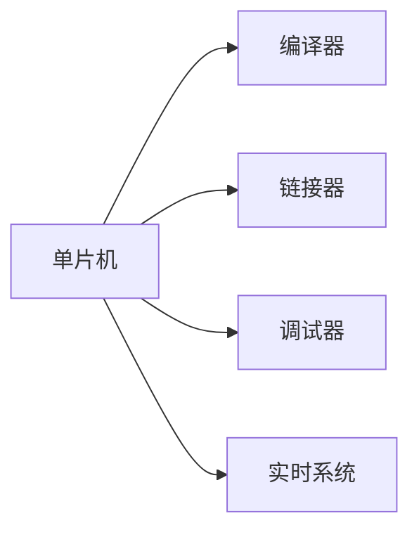

                 

## 1. 背景介绍

### 1.1 问题由来

嵌入式系统是现代科技中不可或缺的一部分，广泛应用于汽车、家电、医疗、消费电子等领域。它们通常具备体积小、功耗低、成本廉等优点，能够嵌入到各种产品中，提供智能控制和数据处理的能力。

嵌入式系统的核心是单片机（Microcontroller Unit, MCU），它是一个集成在一块芯片上的计算机系统，具备CPU、存储器、输入/输出接口等功能。单片机编程是嵌入式系统开发的关键环节，它决定了系统的性能和稳定性。

### 1.2 问题核心关键点

单片机编程的重点在于：
- **编译器**：如何将高级语言（如C/C++）编写的代码转换成单片机可执行的机器码。
- **调试工具**：在开发和调试过程中，如何高效地发现和修复程序中的问题。
- **资源管理**：如何在有限的资源（如内存、存储、时钟频率）下优化程序。
- **实时性**：如何在保证系统响应速度的前提下，实现复杂的控制逻辑。

### 1.3 问题研究意义

掌握单片机编程，不仅能够让你了解计算机硬件的工作原理，还能够在实际项目中灵活运用，提升个人能力和职业竞争力。

## 2. 核心概念与联系

### 2.1 核心概念概述

在单片机编程中，核心概念包括：

- **单片机**：集成有CPU、存储器、输入输出接口的计算机芯片。
- **编译器**：将高级语言代码编译为单片机指令的程序。
- **链接器**：将编译后的目标代码和库文件进行连接，生成可执行程序。
- **调试器**：在开发过程中，对程序进行调试和跟踪的工具。
- **实时系统**：能够实时响应外部事件，保持高效和可靠性的操作系统。

这些概念通过如下Mermaid流程图展示它们之间的联系：



## 3. 核心算法原理 & 具体操作步骤

### 3.1 算法原理概述

单片机编程的核心算法包括编译、连接、调试和实时操作系统调度等。这些算法共同构成了一个完整的嵌入式开发流程。

### 3.2 算法步骤详解

1. **编译步骤**：
   - 编写C/C++程序代码。
   - 使用编译器（如GCC、Keil MDK）将程序编译为目标代码。
   - 对于不同单片机，编译器需要进行相应配置。

2. **链接步骤**：
   - 使用链接器（如GCC、Keil Linker）将目标代码与库文件（如标准库、第三方库）进行链接。
   - 生成最终的可执行程序。

3. **调试步骤**：
   - 使用调试器（如GDB、Keil Debugger）进行程序调试。
   - 设置断点、查看变量值、单步执行代码等操作。

4. **实时系统步骤**：
   - 设计实时任务和调度算法。
   - 实现实时中断和定时器功能。
   - 在单片机中进行任务调度，保持系统实时响应。

### 3.3 算法优缺点

**优点**：
- **效率高**：单片机速度快，处理能力强。
- **可靠性高**：专为嵌入式应用设计，能够处理各种复杂环境。
- **成本低**：集成度高，体积小。

**缺点**：
- **资源有限**：内存、存储、时钟频率等资源有限，限制了程序规模。
- **开发难度大**：需要综合考虑硬件资源和实时性要求。
- **兼容性差**：不同单片机间可能存在兼容性问题。

### 3.4 算法应用领域

单片机编程广泛应用于以下领域：
- **消费电子**：智能家居、智能穿戴设备等。
- **工业控制**：PLC、自动化生产线等。
- **汽车电子**：电子仪表盘、自动驾驶系统等。
- **医疗设备**：生命监测、医疗器械等。

## 4. 数学模型和公式 & 详细讲解 & 举例说明

### 4.1 数学模型构建

单片机编程的数学模型主要基于机器语言和汇编语言。机器语言是一种直接控制硬件的指令集，汇编语言则是一种高级指令集，能够简化程序编写和理解。

### 4.2 公式推导过程

假设有一个简单的单片机程序：

```assembly
MOV A, #0x12
MOV B, A
MOV C, B
```

其对应的汇编语言和机器语言如下：

```assembly
MOV A, #0x12
MOV B, A
MOV C, B
```

```assembly
MOV A, #0x12
MOV B, A
MOV C, B
```

这些汇编指令可以翻译成机器代码：

```assembly
MOV A, #0x12
MOV A, 0x12
MOV A, 0x12
MOV B, A
MOV B, 0x12
MOV C, B
MOV C, 0x12
```

### 4.3 案例分析与讲解

以一个简单的单片机通信为例，分析其编译和连接过程：

1. 编写C程序：

```c
#include <stdio.h>

int main() {
    unsigned char send_data[] = {0x01, 0x02, 0x03};
    unsigned char recv_data[3];
    
    // 发送数据
    // ...
    
    // 接收数据
    // ...
    
    return 0;
}
```

2. 使用编译器进行编译：

```bash
gcc -o example.bin example.c
```

3. 链接生成可执行文件：

```bash
ld -marm example.bin libusart.a -o example
```

其中，`libusart.a`是串口库文件，`-o example`表示生成名为`example`的可执行文件。

## 5. 项目实践：代码实例和详细解释说明

### 5.1 开发环境搭建

- **安装Keil MDK**：可以从STM32官网下载并安装。
- **安装GCC编译器**：在安装Keil MDK时，选择带有GCC编译器的选项。

### 5.2 源代码详细实现

编写一个简单的STM32单片机程序，实现LED的闪烁：

```c
#include "stm32f4xx.h"

void main() {
    RCC_AHB1PeriphClockCmd(RCC_AHB1Periph_GPIOA, ENABLE);
    GPIO_InitTypeDef GPIO_InitStructure;
    GPIO_InitStructure.GPIO_Pin = GPIO_Pin_0;
    GPIO_InitStructure.GPIO_Mode = GPIO_Mode_Out_PP;
    GPIO_InitStructure.GPIO_OType = GPIO_OType_PushPull;
    GPIO_InitStructure.GPIO_Speed = GPIO_Speed_50MHz;
    GPIO_InitStructure.GPIO_OutputType = GPIO_OutputType_PushPull;
    GPIO_Init(GPIOA, &GPIO_InitStructure);
    GPIO_SetBits(GPIOA, GPIO_Pin_0);
    while (1);
}
```

### 5.3 代码解读与分析

1. 包含头文件`stm32f4xx.h`，该文件包含STM32F4系列的寄存器定义。
2. `main`函数为程序的入口点。
3. 开启GPIOA的时钟，并配置GPIOA的引脚0为输出模式。
4. 设置GPIOA引脚0为高电平，然后无限循环。

### 5.4 运行结果展示

编译并下载到STM32F407VET6开发板上，可以看到LED闪烁。

## 6. 实际应用场景

### 6.1 智能家居

单片机广泛应用于智能家居设备中，如智能开关、智能锁、智能灯泡等。这些设备通常需要实时响应用户的操作和环境变化，单片机编程能够保证系统的实时性和稳定性。

### 6.2 工业自动化

在工业自动化中，单片机作为PLC（可编程逻辑控制器）的核心，用于控制生产线的开关、输送、加工等。实时系统调度能够确保生产过程的高效和稳定。

### 6.3 医疗设备

单片机在医疗设备中的应用包括生命监测、手术机器人等。这些设备对实时性和精度有高要求，单片机编程能够提供可靠的控制和数据处理能力。

### 6.4 未来应用展望

随着物联网和5G技术的发展，单片机编程的应用将更加广泛，如智能城市、智能交通、智能农业等。实时系统调度、网络通信、大数据处理等技术的进步，将使单片机编程在更多领域发挥重要作用。

## 7. 工具和资源推荐

### 7.1 学习资源推荐

1. **《嵌入式系统设计与应用》**：该书系统讲解了嵌入式系统的基础知识和设计方法。
2. **《STM32F4系列开发手册》**：详细介绍了STM32F4系列单片机的硬件和软件接口。
3. **Keil MDK官方文档**：提供了Keil MDK的详细使用指南和示例代码。
4. **GCC编译器文档**：提供了GCC编译器的详细使用指南和示例代码。

### 7.2 开发工具推荐

1. **Keil MDK**：STM32系列的集成开发环境，具备强大的编译、调试和链接功能。
2. **GCC编译器**：开源的编译器，适用于各种单片机平台。
3. **GNU Debugger（GDB）**：功能强大的调试工具，支持多种嵌入式平台。
4. **IAR Embedded Workbench**：STM32系列的集成开发环境，具备强大的编译、调试和链接功能。

### 7.3 相关论文推荐

1. **《嵌入式系统设计原理与技术》**：该书详细介绍了嵌入式系统的设计原理和技术实现。
2. **《STM32嵌入式系统设计与开发》**：该书系统讲解了STM32嵌入式系统的设计方法。
3. **《实时操作系统原理与应用》**：该书介绍了实时系统的设计原理和实现方法。

## 8. 总结：未来发展趋势与挑战

### 8.1 总结

单片机编程是嵌入式系统开发的核心技术之一。掌握单片机编程，能够让你灵活应用嵌入式系统的各项功能，提升个人和团队的技术能力。

### 8.2 未来发展趋势

1. **人工智能应用**：单片机将集成更多AI功能，如图像处理、语音识别、自然语言处理等。
2. **边缘计算**：单片机将支持更多的边缘计算功能，如数据存储、数据处理等。
3. **物联网**：单片机将与各种传感器、执行器等设备进行连接，实现物联网应用。

### 8.3 面临的挑战

1. **资源限制**：单片机资源有限，需要高效优化程序。
2. **实时性要求高**：系统需要实时响应各种事件，对算法和调度有高要求。
3. **兼容性和标准化**：不同厂商的单片机存在兼容性问题，需要标准化开发。

### 8.4 研究展望

未来单片机编程的发展方向包括：
- **优化编译器**：提高编译效率和代码质量。
- **开发框架和工具**：提供更强大的开发框架和工具，简化开发过程。
- **硬件加速**：引入硬件加速技术，提高计算效率。

## 9. 附录：常见问题与解答

**Q1：如何优化单片机程序的资源使用？**

A：优化单片机程序的资源使用可以通过以下方法：
- **内存管理**：使用动态内存分配，减少内存使用。
- **代码优化**：减少函数调用、循环优化等。
- **中断处理**：合理设计中断服务函数，减少中断次数。

**Q2：单片机程序如何调试？**

A：单片机程序的调试可以使用以下工具：
- **串口调试**：通过串口输出程序运行状态，进行调试。
- **逻辑分析仪**：分析单片机内部信号，定位问题。
- **JTAG调试**：通过JTAG接口进行调试，获取程序状态。

**Q3：如何设计高效的实时系统？**

A：设计高效的实时系统需要考虑以下几点：
- **任务调度**：设计合理的任务调度算法，确保任务执行的优先级和时间片。
- **中断处理**：优化中断服务函数，减少中断响应时间。
- **资源管理**：合理分配资源，确保各任务有足够的资源执行。

**Q4：单片机程序如何与网络通信？**

A：单片机程序与网络通信可以通过以下方法：
- **串口通信**：通过串口进行简单的网络通信。
- **以太网模块**：使用以太网模块进行网络通信。
- **WiFi模块**：使用WiFi模块进行网络通信。

**Q5：单片机编程的难点是什么？**

A：单片机编程的难点在于：
- **硬件理解**：需要深入理解硬件的工作原理和接口。
- **实时性要求高**：需要设计高效的实时任务和调度算法。
- **资源有限**：需要合理分配和优化资源。

通过不断学习和实践，掌握单片机编程的核心概念和技能，能够更好地应用嵌入式系统的各项功能，推动技术创新和产业发展。

