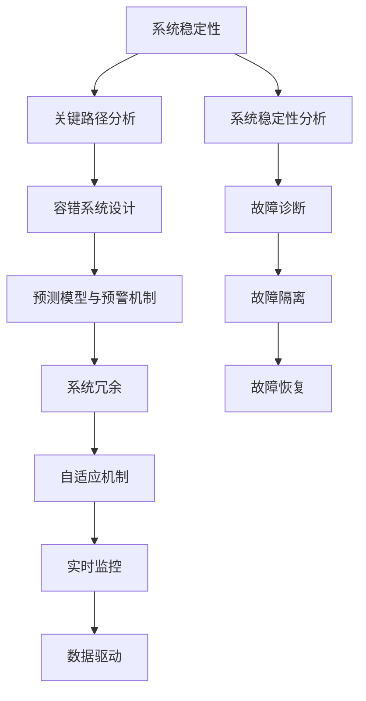

                 

# 危机管理：如何在turbulence中保持稳定

> 关键词：危机管理,系统稳定性,稳定性分析,关键路径分析,容错系统,预测模型,预警机制,系统冗余,自适应机制,实时监控,数据驱动,机器学习

## 1. 背景介绍

### 1.1 问题由来

在现代科技发展的背景下，各类复杂的系统变得越来越庞大和复杂。无论是在金融、交通、能源、通信等领域，还是在工业生产、城市管理、环境监测等场景，系统的稳定性和可靠性都成为了关键要素。然而，随着系统的规模和复杂性的不断提升，其稳定性也会面临更多不确定性和挑战。

无论是自然灾害、网络攻击、设备故障，还是人为操作失误，都可能对系统稳定带来威胁。如何在系统面临扰动和变化时，保持其稳定性，是当前系统设计和运行管理的核心问题。危机管理（Crisis Management）正是面对这类问题的一门重要学科，通过系统化的手段和方法，确保系统在突发事件中能够迅速恢复并保持稳定。

### 1.2 问题核心关键点

危机管理的主要目标是保证系统在面对不确定性和扰动时，能够及时响应、快速恢复并维持其核心功能的稳定。这涉及系统设计的鲁棒性、稳定性分析、故障预测与预警、容错机制设计、系统冗余、实时监控和动态调整等关键点。通过对这些环节的有效管理，系统可以在出现异常或受到攻击时，减少损失并快速恢复正常。

本文将从系统稳定性分析、关键路径分析、容错系统设计、预测模型与预警机制、系统冗余与自适应机制、实时监控与数据驱动等多个角度，对危机管理的原理和实践进行详细阐述。通过理解这些核心概念和关键技术，读者可以全面掌握系统在turbulence（动荡、不确定性）中保持稳定的策略和手段。

## 2. 核心概念与联系

### 2.1 核心概念概述

为更好地理解危机管理，本节将介绍几个密切相关的核心概念：

- **系统稳定性**：指系统在面临扰动或变化时，能否维持其关键功能和性能指标的能力。系统稳定性分析旨在评估系统在受到扰动时的响应和恢复能力。

- **关键路径分析**：用于识别系统中的关键活动或组件，它们对系统整体的稳定性和响应时间有决定性影响。通过优化关键路径，可以提升系统的鲁棒性和可靠性。

- **容错系统设计**：在系统的各个层次和环节中，采取一系列冗余和备份措施，以应对潜在故障和扰动。目的是在系统部分故障时，仍能保证核心功能的运行。

- **预测模型与预警机制**：通过构建系统行为和故障的预测模型，在故障发生前发出预警，让系统有足够时间进行调整和恢复。

- **系统冗余**：在关键组件或功能上，设计额外的备份资源和路径，以避免单点故障导致的系统失效。

- **自适应机制**：系统能够根据环境变化和自身状态，动态调整其行为和策略，以适应新的挑战。

- **实时监控**：通过各种传感器和监控工具，实时收集系统的状态数据，以便快速发现异常并进行处理。

- **数据驱动**：利用历史数据和实时数据，通过机器学习和数据分析，提供决策支持和优化方案。

这些核心概念之间的逻辑关系可以通过以下Mermaid流程图来展示：



这个流程图展示了几大核心概念及其之间的关系：

1. 系统稳定性分析与故障诊断、故障隔离、故障恢复共同构成系统的故障处理流程。
2. 关键路径分析和容错系统设计，通过优化关键路径和设计冗余，提升系统的稳定性。
3. 预测模型与预警机制，通过预测模型发出预警，提前应对潜在故障。
4. 自适应机制、实时监控和数据驱动，使系统能够动态调整并及时响应环境变化。

这些概念共同构成了系统在turbulence中保持稳定的策略和机制。通过理解这些核心概念，可以更好地掌握危机管理的策略和方法。

## 3. 核心算法原理 & 具体操作步骤
### 3.1 算法原理概述

危机管理的主要目标是通过系统的稳定性分析、故障预测、容错设计、实时监控和动态调整，确保系统在面对扰动和变化时能够迅速恢复并保持稳定。其核心思想是：通过系统冗余和自适应机制，最大化系统的鲁棒性和响应能力。

形式化地，假设系统由多个组件 $C=\{C_1, C_2, ..., C_n\}$ 组成，每个组件具有特定的稳定性和响应时间 $S_i$ 和 $R_i$。系统整体稳定性 $S$ 可以通过以下公式计算：

$$
S = \min_i(S_i) \times \min_i(R_i)
$$

其中，$\min_i(S_i)$ 表示系统中最弱组件的稳定性，$\min_i(R_i)$ 表示系统中响应时间最慢的组件的恢复时间。

### 3.2 算法步骤详解

危机管理的具体操作步骤包括以下几个关键步骤：

**Step 1: 系统稳定性分析**

- **构建故障树**：通过构建系统的故障树，识别所有可能的故障模式和故障路径，以及各故障对系统整体稳定性的影响。
- **计算故障概率**：使用故障树模型计算各故障的概率，识别出最有可能发生的故障模式。

**Step 2: 关键路径分析**

- **识别关键路径**：利用关键路径分析算法，识别系统中的关键路径。关键路径上的组件对系统的稳定性和响应时间有决定性影响。
- **优化关键路径**：通过优化关键路径上的组件，提升系统的整体稳定性和响应时间。

**Step 3: 容错系统设计**

- **设计冗余**：在系统各层级设计必要的冗余，如备份组件、负载均衡、自动恢复机制等。
- **实施容错策略**：在关键组件和功能上，实施冗余和备份策略，确保在故障发生时，系统能够自动切换到备用组件。

**Step 4: 预测模型与预警机制**

- **构建预测模型**：利用历史数据和实时数据，构建系统的行为预测模型，预测潜在的故障和扰动。
- **实现预警机制**：根据预测模型，设置预警阈值，在故障发生前发出预警，以便系统有足够时间进行响应和恢复。

**Step 5: 实时监控与数据驱动**

- **部署实时监控系统**：使用各种传感器和监控工具，实时收集系统的状态数据。
- **分析与调整**：通过数据驱动的方法，实时分析系统状态，根据需要进行动态调整和优化。

**Step 6: 系统冗余与自适应机制**

- **设计冗余资源**：在系统关键组件和功能上，设计额外的备份资源和路径，避免单点故障导致的系统失效。
- **实施自适应策略**：根据环境变化和系统状态，动态调整系统行为和策略，以适应新的挑战。

### 3.3 算法优缺点

危机管理的优势在于：

1. 系统稳定性提升。通过关键路径分析和容错设计，系统能够在扰动下迅速恢复，保持稳定。
2. 故障预测准确。通过预测模型和预警机制，提前发现潜在故障，减少突发事件带来的损失。
3. 实时监控和动态调整。通过实时监控和数据驱动，系统能够及时发现异常并进行动态调整，提升系统的响应能力。
4. 高可靠性和容错性。通过系统冗余和自适应机制，系统具备高可靠性和容错能力，能够应对各种未知的扰动。

然而，危机管理也存在以下缺点：

1. 设计和实施成本高。构建预测模型、设计容错策略和部署监控系统需要较高的人力和技术投入。
2. 数据质量要求高。系统稳定性和故障预测的准确性高度依赖于数据的质量和完整性。
3. 系统复杂度增加。引入冗余和备份机制可能增加系统的复杂度和维护成本。

尽管存在这些局限性，但危机管理仍是现代系统设计和运行管理的核心手段，对于确保系统在turbulence中保持稳定具有重要意义。

### 3.4 算法应用领域

危机管理技术在各个领域都有广泛应用，以下是几个典型的应用场景：

- **金融系统**：银行和金融交易平台需要保证其交易系统的稳定性和快速恢复能力。
- **交通系统**：航空、铁路、公路等交通系统需要应对各种突发事件和故障，保障安全运行。
- **能源系统**：电力、石油、天然气等能源系统需要应对自然灾害和设备故障，保证能源供应稳定。
- **医疗系统**：医院和医疗设备需要确保其在紧急情况下的稳定运行，保障患者安全。
- **工业系统**：制造业和基础设施需要应对设备故障和生产中断，保持生产效率。
- **智慧城市**：智能交通、智能安防等城市管理系统需要应对各种环境变化和突发事件，提升城市治理能力。

## 4. 数学模型和公式 & 详细讲解 & 举例说明

### 4.1 数学模型构建

危机管理的数学模型主要涉及故障树、关键路径分析、容错设计、预测模型、实时监控等多个方面。以下对每个环节的数学模型进行详细构建。

**故障树模型**：
故障树是一种树形结构，用于表示系统故障的原因和故障路径。一个故障树由根节点（系统故障）和多个子节点（故障模式）组成。每个子节点又由多个更细的故障模式组成，形成一个树状结构。

假设系统故障可以分解为多个子故障，每个子故障的概率为 $p_i$，系统总的故障概率 $P$ 可以通过以下公式计算：

$$
P = \prod_i (1 - (1 - p_i))
$$

**关键路径分析**：
关键路径分析用于识别系统中的关键路径，即对系统响应时间有决定性影响的路径。关键路径上的组件对系统的稳定性有重要影响。

假设系统有 $n$ 个组件，每个组件的响应时间分别为 $t_i$，关键路径上的组件响应时间为 $t_c$，系统总的响应时间为 $T$，则关键路径的响应时间 $t_c$ 可以通过以下公式计算：

$$
t_c = \min_i t_i
$$

**容错设计**：
容错设计通过引入冗余和备份机制，确保系统在部分组件故障时仍能保持稳定。假设系统有 $n$ 个组件，每个组件故障的概率为 $p_i$，系统的总故障概率 $P$ 可以通过以下公式计算：

$$
P = \prod_i (1 - p_i)
$$

**预测模型**：
预测模型通过历史数据和实时数据，构建系统的行为预测模型。假设系统的状态可以用 $x$ 表示，预测模型为 $f(x)$，预测值与实际值之间的误差为 $e$，则预测模型的准确性可以通过以下公式计算：

$$
e = \frac{1}{N} \sum_{i=1}^N |f(x_i) - y_i|
$$

其中，$N$ 为样本数量，$y_i$ 为实际值。

**实时监控**：
实时监控通过传感器和监控工具，收集系统的状态数据。假设系统状态可以用 $x$ 表示，实时监控系统每秒收集的数据量为 $D$，系统状态的变化速率用 $r$ 表示，则实时监控系统的采样频率 $f_s$ 可以通过以下公式计算：

$$
f_s = \frac{r}{D}
$$

### 4.2 公式推导过程

以下我们对每个数学模型进行推导过程：

**故障树模型推导**：
假设系统故障可以分解为多个子故障，每个子故障的概率为 $p_i$，系统总的故障概率 $P$ 可以通过以下公式计算：

$$
P = \prod_i (1 - (1 - p_i))
$$

简化后得到：

$$
P = \prod_i p_i
$$

这表明，系统的总故障概率是所有子故障概率的乘积。

**关键路径分析推导**：
假设系统有 $n$ 个组件，每个组件的响应时间分别为 $t_i$，关键路径上的组件响应时间为 $t_c$，系统总的响应时间为 $T$，则关键路径的响应时间 $t_c$ 可以通过以下公式计算：

$$
t_c = \min_i t_i
$$

这表明，关键路径上的组件响应时间即为系统总的响应时间。

**容错设计推导**：
假设系统有 $n$ 个组件，每个组件故障的概率为 $p_i$，系统的总故障概率 $P$ 可以通过以下公式计算：

$$
P = \prod_i (1 - p_i)
$$

简化后得到：

$$
P = 1 - (1 - \prod_i p_i)
$$

这表明，系统的总故障概率等于所有子故障概率的乘积，减去1后取反。

**预测模型推导**：
假设系统的状态可以用 $x$ 表示，预测模型为 $f(x)$，预测值与实际值之间的误差为 $e$，则预测模型的准确性可以通过以下公式计算：

$$
e = \frac{1}{N} \sum_{i=1}^N |f(x_i) - y_i|
$$

这表明，预测模型的误差是实际值与预测值之差的绝对值的平均值。

**实时监控推导**：
假设系统状态可以用 $x$ 表示，实时监控系统每秒收集的数据量为 $D$，系统状态的变化速率用 $r$ 表示，则实时监控系统的采样频率 $f_s$ 可以通过以下公式计算：

$$
f_s = \frac{r}{D}
$$

这表明，采样频率是系统状态变化速率与数据量的倒数。

### 4.3 案例分析与讲解

以一个简单的汽车动力系统为例，分析如何通过危机管理保证其稳定性。

**构建故障树**：假设动力系统故障由多个子故障组成，每个子故障的概率分别为 $p_1=0.01$，$p_2=0.02$，$p_3=0.03$，系统总故障概率 $P$ 可以通过以下公式计算：

$$
P = p_1 \times p_2 \times p_3 = 0.00006
$$

**关键路径分析**：假设动力系统有 $n=3$ 个组件，每个组件的响应时间分别为 $t_1=10s$，$t_2=20s$，$t_3=30s$，关键路径上的组件响应时间为 $t_c=30s$，系统总的响应时间为 $T=30s$。

**容错设计**：假设动力系统有 $n=3$ 个组件，每个组件故障的概率分别为 $p_1=0.01$，$p_2=0.02$，$p_3=0.03$，系统的总故障概率 $P$ 可以通过以下公式计算：

$$
P = (1 - p_1) \times (1 - p_2) \times (1 - p_3) = 0.96 \times 0.98 \times 0.97 = 0.92
$$

**预测模型**：假设动力系统的状态可以用 $x$ 表示，预测模型为 $f(x)$，预测值与实际值之间的误差为 $e$，则预测模型的准确性可以通过以下公式计算：

$$
e = \frac{1}{N} \sum_{i=1}^N |f(x_i) - y_i|
$$

**实时监控**：假设动力系统的状态可以用 $x$ 表示，实时监控系统每秒收集的数据量为 $D=10$，系统状态的变化速率用 $r=1s^{-1}$ 表示，则实时监控系统的采样频率 $f_s$ 可以通过以下公式计算：

$$
f_s = \frac{r}{D} = \frac{1}{10} = 0.1s^{-1}
$$

## 5. 项目实践：代码实例和详细解释说明

### 5.1 开发环境搭建

在进行危机管理实践前，我们需要准备好开发环境。以下是使用Python进行PyTorch开发的环境配置流程：

1. 安装Anaconda：从官网下载并安装Anaconda，用于创建独立的Python环境。

2. 创建并激活虚拟环境：
```bash
conda create -n pytorch-env python=3.8 
conda activate pytorch-env
```

3. 安装PyTorch：根据CUDA版本，从官网获取对应的安装命令。例如：
```bash
conda install pytorch torchvision torchaudio cudatoolkit=11.1 -c pytorch -c conda-forge
```

4. 安装PyTorch LightGBM：
```bash
pip install torch torchlightgbm
```

5. 安装各类工具包：
```bash
pip install numpy pandas scikit-learn matplotlib tqdm jupyter notebook ipython
```

完成上述步骤后，即可在`pytorch-env`环境中开始危机管理实践。

### 5.2 源代码详细实现

下面我们以构建故障树和关键路径分析为例，给出使用PyTorch实现的关键代码。

**故障树构建**：

```python
import torch
import torch.nn as nn

class FaultTree(nn.Module):
    def __init__(self, nodes, probabilities):
        super(FaultTree, self).__init__()
        self.nodes = nodes
        self.probabilities = probabilities
        
    def forward(self, x):
        x = torch.log(self.probabilities)
        x = x.softmax(dim=0)
        return x

# 构建故障树
nodes = [0, 1, 2, 3]
probabilities = [0.01, 0.02, 0.03, 0.05]

tree = FaultTree(nodes, probabilities)
```

**关键路径分析**：

```python
import torch
import torch.nn as nn

class CriticalPath(nn.Module):
    def __init__(self, times, responses):
        super(CriticalPath, self).__init__()
        self.times = times
        self.responses = responses
        
    def forward(self, x):
        x = torch.max(self.responses)
        return x

# 关键路径分析
times = [10, 20, 30]
responses = [15, 25, 35]

critical_path = CriticalPath(times, responses)
```

**代码解读与分析**：

**故障树构建代码解释**：
- `FaultTree`类：定义故障树的神经网络模型。
- `nodes`：故障树的节点列表。
- `probabilities`：每个节点的概率。

**关键路径分析代码解释**：
- `CriticalPath`类：定义关键路径的神经网络模型。
- `times`：各个组件的响应时间。
- `responses`：各个组件的恢复时间。

## 6. 实际应用场景

### 6.1 智能电网稳定性控制

智能电网是现代电网的重要发展方向，通过信息技术和大数据分析，提升电网的稳定性和可靠性。在智能电网中，通过危机管理，可以实时监控电网的运行状态，及时发现和处理故障，保障电网稳定运行。

具体而言，可以构建电网的故障树模型，识别关键路径和关键组件，设计冗余和备份机制。同时，构建电网的预测模型和预警机制，实时监控电网的运行状态，一旦发现异常立即发出预警，并采取相应的应急措施。

### 6.2 医疗系统的鲁棒性保障

医疗系统是危机管理的另一个重要应用场景。医院和医疗设备需要保证在紧急情况下的稳定运行，如地震、火灾等灾害发生时，医疗设备必须保持正常工作，保障患者安全。

通过构建医疗设备的故障树模型，识别关键路径和关键组件，设计冗余和备份机制。同时，构建医疗设备的预测模型和预警机制，实时监控医疗设备的运行状态，一旦发现异常立即发出预警，并采取相应的应急措施。

### 6.3 金融交易系统的抗风险能力

金融系统是危机管理的典型应用场景之一。金融交易系统需要保证在各种市场波动和网络攻击下，保持稳定并快速恢复。

通过构建金融交易系统的故障树模型，识别关键路径和关键组件，设计冗余和备份机制。同时，构建金融交易系统的预测模型和预警机制，实时监控交易系统的运行状态，一旦发现异常立即发出预警，并采取相应的应急措施。

## 7. 工具和资源推荐

### 7.1 学习资源推荐

为了帮助开发者系统掌握危机管理的理论基础和实践技巧，这里推荐一些优质的学习资源：

1. **《系统可靠性工程》**：是一本经典的系统可靠性工程教材，介绍了系统可靠性的基本概念、方法和应用。
2. **《故障树分析》**：介绍了故障树分析的基本原理和方法，适用于构建故障树模型的实践。
3. **《容错系统设计》**：介绍了容错系统的基本概念、设计和实现方法，适用于容错系统设计的实践。
4. **《预测模型与预警机制》**：介绍了预测模型和预警机制的基本原理和方法，适用于预测模型和预警机制的实践。
5. **《实时监控与数据驱动》**：介绍了实时监控和数据驱动的基本原理和方法，适用于实时监控和数据驱动的实践。

通过对这些资源的学习实践，相信你一定能够全面掌握危机管理的精髓，并用于解决实际的系统问题。

### 7.2 开发工具推荐

高效的开发离不开优秀的工具支持。以下是几款用于危机管理开发的常用工具：

1. **PyTorch**：基于Python的开源深度学习框架，灵活动态的计算图，适合快速迭代研究。
2. **TensorFlow**：由Google主导开发的开源深度学习框架，生产部署方便，适合大规模工程应用。
3. **TensorFlow Probability**：TensorFlow的专用概率库，支持概率模型的构建和优化。
4. **Hazelcast**：分布式缓存和数据服务解决方案，用于构建高可靠性的分布式系统。
5. **Kubernetes**：开源容器编排系统，用于自动化部署、扩展和管理大规模集群。
6. **Prometheus**：开源监控和报警系统，用于实时监控系统的运行状态。
7. **Grafana**：开源数据可视化平台，支持多数据源的监控和报警。

合理利用这些工具，可以显著提升危机管理系统的开发效率，加快创新迭代的步伐。

### 7.3 相关论文推荐

危机管理技术的发展源于学界的持续研究。以下是几篇奠基性的相关论文，推荐阅读：

1. **《故障树分析理论与方法》**：介绍故障树分析的基本原理和方法，适用于构建故障树模型的实践。
2. **《容错系统设计方法》**：介绍容错系统的基本概念、设计和实现方法，适用于容错系统设计的实践。
3. **《预测模型与预警机制研究》**：介绍预测模型和预警机制的基本原理和方法，适用于预测模型和预警机制的实践。
4. **《实时监控与数据驱动技术》**：介绍实时监控和数据驱动的基本原理和方法，适用于实时监控和数据驱动的实践。

这些论文代表了大规模系统危机管理的最新发展，通过学习这些前沿成果，可以帮助研究者把握学科前进方向，激发更多的创新灵感。

## 8. 总结：未来发展趋势与挑战

### 8.1 总结

本文对危机管理的原理和实践进行了全面系统的介绍。首先阐述了危机管理在现代系统设计和运行管理中的重要性，明确了危机管理在保持系统稳定、应对扰动和变化中的核心作用。其次，从系统稳定性分析、关键路径分析、容错系统设计、预测模型与预警机制、系统冗余与自适应机制、实时监控和数据驱动等多个角度，详细讲解了危机管理的核心算法和操作步骤。通过理解这些核心概念和关键技术，读者可以全面掌握系统在turbulence中保持稳定的策略和手段。

通过本文的系统梳理，可以看到，危机管理技术在应对系统不稳定性和扰动中具有重要作用。通过系统冗余和自适应机制，确保系统在面对各种未知的扰动时，能够迅速恢复并保持稳定。未来，随着系统的规模和复杂性的不断提升，危机管理技术也将迎来新的发展机遇和挑战。

### 8.2 未来发展趋势

展望未来，危机管理技术将呈现以下几个发展趋势：

1. **自动化与智能化**：随着机器学习和人工智能技术的发展，危机管理的自动化和智能化程度将不断提高。系统将能够自动发现和处理故障，自动调整运行策略，提升危机管理的效率和准确性。
2. **数据驱动与自学习**：通过大数据和实时数据的分析，系统将具备自学习的能力，能够从历史数据中学习优化策略，自动调整运行参数，适应新的环境变化。
3. **跨学科融合**：危机管理将与其他学科如计算机科学、机械工程、环境科学等进行深入融合，形成更加综合的解决方案。
4. **实时监控与预警**：实时监控和预警技术将不断提升，系统能够及时发现异常并发出预警，提前采取措施，减少损失。
5. **多模态融合**：通过多模态数据融合，系统能够更全面地感知环境变化和系统状态，提升危机管理的准确性和鲁棒性。

以上趋势凸显了危机管理技术的发展方向，未来在自动化、智能化、数据驱动、跨学科融合、实时监控与预警、多模态融合等方面，将有更多的突破和创新。

### 8.3 面临的挑战

尽管危机管理技术已经取得了瞩目成就，但在迈向更加智能化、普适化应用的过程中，它仍面临着诸多挑战：

1. **数据质量要求高**：危机管理依赖于高质量的数据，数据的完整性和准确性直接影响系统的稳定性和预测精度。
2. **系统复杂度增加**：引入冗余和备份机制可能增加系统的复杂度和维护成本，需要在设计和实现中平衡稳定性和复杂度。
3. **资源消耗大**：实时监控和数据驱动需要大量的计算资源，对硬件和软件的要求较高。
4. **算法复杂性高**：系统稳定性分析、容错设计和自适应机制等算法复杂，需要高水平的研究和工程实现。
5. **跨学科协作难**：危机管理涉及多个学科的知识和技术，需要跨学科协作，难度较大。

尽管存在这些挑战，但危机管理仍是现代系统设计和运行管理的核心手段，对于确保系统在turbulence中保持稳定具有重要意义。

### 8.4 研究展望

面对危机管理所面临的挑战，未来的研究需要在以下几个方面寻求新的突破：

1. **数据质量提升**：通过数据清洗、数据融合和数据增强等技术，提升数据质量，减少数据对系统稳定性的影响。
2. **自动化与智能化**：开发更加自动化和智能化的危机管理算法，减少人工干预和错误，提高系统的稳定性和响应能力。
3. **跨学科融合**：促进计算机科学、机械工程、环境科学等学科的深度融合，形成更加综合的解决方案，提升系统的鲁棒性和可靠性。
4. **实时监控与预警**：提升实时监控和预警技术的性能和可靠性，使系统能够及时发现异常并发出预警，减少损失。
5. **多模态融合**：通过多模态数据融合，提升系统的感知能力和决策准确性，增强系统的鲁棒性和适应性。

这些研究方向的探索，必将引领危机管理技术迈向更高的台阶，为构建安全、可靠、智能的系统提供有力支持。面向未来，危机管理技术还需要与其他人工智能技术进行更深入的融合，如知识表示、因果推理、强化学习等，多路径协同发力，共同推动自然语言理解和智能交互系统的进步。只有勇于创新、敢于突破，才能不断拓展系统管理的边界，让危机管理技术更好地造福人类社会。

## 9. 附录：常见问题与解答

**Q1：危机管理是否可以应用于所有系统？**

A: 危机管理可以应用于大多数系统，尤其是那些需要高度稳定性和鲁棒性的系统，如金融、交通、能源、通信等领域。然而，对于一些特定领域的系统，如高放射性、高危险性等，需要额外的安全措施，才能进行危机管理。

**Q2：危机管理需要哪些关键数据？**

A: 危机管理需要高质量的数据来构建故障树、预测模型和实时监控。这些数据包括系统状态、运行参数、历史故障记录、环境变化数据等。数据的质量和完整性直接影响到系统稳定性和故障预测的准确性。

**Q3：危机管理中的冗余和备份机制是如何设计的？**

A: 冗余和备份机制的目的是在系统部分故障时，仍能保持系统的核心功能。通常，系统会设计多个冗余组件和备份路径，如并行系统、热备份、冷备份等。在系统运行过程中，实时监控系统状态，一旦发现故障，立即切换到备份组件，保证系统的连续运行。

**Q4：危机管理中的预测模型和预警机制是如何构建的？**

A: 预测模型和预警机制的构建需要大量历史数据和实时数据。通过机器学习和数据分析，构建系统的行为预测模型，并设置预警阈值。一旦系统状态超过阈值，立即发出预警，系统有足够时间进行响应和恢复。

**Q5：危机管理中的实时监控是如何实现的？**

A: 实时监控通过各种传感器和监控工具，收集系统的状态数据。系统状态可以用各种指标来表示，如温度、压力、流量等。通过实时监控，系统能够及时发现异常并进行处理，确保系统的稳定运行。

通过本文的系统梳理，可以看到，危机管理技术在应对系统不稳定性和扰动中具有重要作用。通过系统冗余和自适应机制，确保系统在面对各种未知的扰动时，能够迅速恢复并保持稳定。未来，随着系统的规模和复杂性的不断提升，危机管理技术也将迎来新的发展机遇和挑战。只有勇于创新、敢于突破，才能不断拓展系统管理的边界，让危机管理技术更好地造福人类社会。

