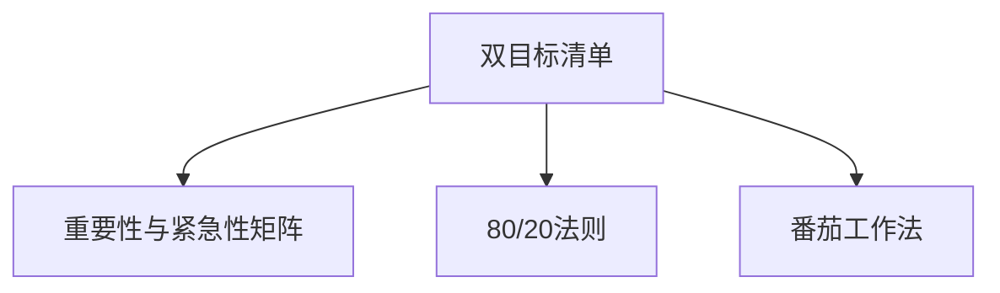

                 

# 双目标清单实操:聚焦重点,事半功倍

> 关键词：双目标清单,目标管理,优先级排序,任务执行,项目管理,高效产出

## 1. 背景介绍

### 1.1 问题由来

在现代快节奏的工作环境中，个人和团队常常需要同时处理多个项目和任务。面对海量工作，如何高效管理任务、优化时间分配、提升产出效率，成为了一个关键挑战。

当前流行的任务管理工具和方法，如Todo List、看板法、GTD（Getting Things Done）等，虽然都有一定的帮助，但在实践中仍存在诸多局限。任务繁多时，容易忽视重要事项；临时新任务的出现，又打乱原有计划。如何更科学、高效地安排工作，确保最重要的任务优先完成，成为提升个人和团队工作效率的关键问题。

## 2. 核心概念与联系

### 2.1 核心概念概述

为更好地理解双目标清单管理方法，本节将介绍几个核心概念：

- **双目标清单(二重优先级清单)**：这是一种改进的任务管理工具，将任务按重要性和紧急性进行双重优先级划分，帮助用户明确任务优先级，优化时间分配，提升工作效率。
- **重要性与紧急性矩阵**：由史蒂芬·柯维（Stephen Covey）提出的经典时间管理工具，将任务分为四象限，帮助人们区分重要性与紧急性，优先处理重要紧急任务。
- **80/20法则**：又称为帕累托法则，指出80%的结果往往由20%的努力产生，要求我们聚焦于最重要的20%任务，以实现事半功倍的效果。
- **番茄工作法**：一种时间管理技巧，将工作时间分割为25分钟的工作单元，每个工作单元称为一个番茄时间，休息5分钟后再次开始，帮助保持专注力，提高工作效率。

这些核心概念之间的逻辑关系可以通过以下Mermaid流程图来展示：



这个流程图展示了双目标清单工具与时间管理其他经典方法的联系：

1. 双目标清单借鉴了重要性与紧急性矩阵的概念，明确了任务的优先级。
2. 80/20法则提供了任务选择的指导，强调聚焦于重要但不紧急的任务。
3. 番茄工作法与双目标清单结合使用，可以有效提升工作专注度和效率。

## 3. 核心算法原理 & 具体操作步骤

### 3.1 算法原理概述

双目标清单的核心思想是：将任务按照重要性和紧急性进行双重分类，然后根据任务优先级分配时间和资源，以确保最重要的任务得到优先处理。这种方法有助于减少无效工作，聚焦于价值最大的任务，提升整体效率。

形式化地，假设任务集 $T$，每个任务 $t \in T$ 有重要度 $I(t)$ 和紧急度 $E(t)$，且 $I(t), E(t) \in [0, 1]$。双目标清单的优化目标是最小化总工作时间 $W$，同时确保重要任务 $T_{\text{重要}}$ 的完成质量 $Q$，即：

$$
\min_{\{W, Q\}} \sum_{t \in T} W(t) \quad \text{subject to} \quad Q(t_{\text{重要}}) \geq \bar{Q} \quad \text{and} \quad W(t_{\text{紧急}}) = 0
$$

其中 $\bar{Q}$ 为任务质量的下限，$t_{\text{重要}}$ 表示重要任务，$t_{\text{紧急}}$ 表示紧急但不重要的任务。

### 3.2 算法步骤详解

以下是使用双目标清单进行任务管理的具体步骤：

**Step 1: 定义任务和优先级**

- 列出所有需要完成的任务，并为其设定截止日期。
- 根据任务的重要性和紧急性，将其分为四类：重要紧急、重要不紧急、紧急不重要、不紧急不重要。

**Step 2: 分配优先级和资源**

- 确定每日可用工作时间 $W_{\text{total}}$ 和任务质量目标 $\bar{Q}$。
- 根据优先级将任务分为重要和紧急两类，优先处理重要紧急任务。
- 在资源允许的情况下，尽量分配资源给重要但不紧急的任务。

**Step 3: 执行任务**

- 将任务分解为多个可执行的工作单元。
- 使用番茄工作法进行时间管理，每个25分钟单元专注于单任务处理，休息5分钟后继续。
- 根据任务优先级和当前可用资源，动态调整任务执行顺序和资源分配。

**Step 4: 回顾与调整**

- 定期回顾任务进度和资源使用情况，评估任务质量。
- 根据任务进展和优先级调整，及时调整资源分配和任务执行顺序。

### 3.3 算法优缺点

双目标清单工具具有以下优点：

1. 明确任务优先级。通过重要性与紧急性矩阵，用户能够清晰地识别和处理重要任务，避免时间和资源浪费。
2. 提升时间管理效率。通过80/20法则和番茄工作法，用户能够更加专注和高效地完成任务，减少无效劳动。
3. 提高产出质量。重要但不紧急的任务，往往对长期价值有更大贡献，优先处理这类任务可以提升整体产出质量。
4. 灵活调整。随着任务进展和环境变化，用户可以动态调整任务优先级和资源分配，确保目标实现。

同时，该方法也存在一些局限：

1. 过度简化。任务分类过于简化了实际工作的复杂性，难以处理一些边界模糊的任务。
2. 主观性强。任务重要性和紧急性的判断具有主观性，不同人可能有不同的看法。
3. 缺乏即时反馈。任务进展和产出质量较难量化，无法及时获取和调整。

尽管存在这些局限性，但双目标清单依然是一种高效实用的任务管理工具，尤其适合那些任务繁杂、时间紧迫的工作场景。

### 3.4 算法应用领域

双目标清单管理方法广泛适用于个人和团队的任务管理，特别是在以下领域：

- **项目管理**：将项目任务按优先级划分，确保重要任务优先完成，提升项目进度和质量。
- **团队协作**：统一团队任务管理标准，确保成员理解并遵循优先级规则，提高团队协作效率。
- **个人发展**：将个人学习和发展任务按重要性和紧急性排序，确保长期价值最大化。
- **日常工作**：管理日常任务，提升日常工作质量，减少时间浪费。

## 4. 数学模型和公式 & 详细讲解 & 举例说明

### 4.1 数学模型构建

以下是使用数学模型表示双目标清单任务管理的优化问题。

设任务集 $T = \{t_1, t_2, \ldots, t_n\}$，每个任务 $t_i$ 有重要度 $I_i \in [0, 1]$ 和紧急度 $E_i \in [0, 1]$。设每日可用工作时间 $W_{\text{total}}$，每个任务完成所需时间 $T_i$，任务质量目标 $\bar{Q}$。设 $W_i$ 表示分配给任务 $t_i$ 的实际工作时间，$Q_i$ 表示任务 $t_i$ 的完成质量。则任务管理的优化目标为：

$$
\min_{W} \sum_{i=1}^n W_i
$$

约束条件为：

$$
\begin{cases}
W_i \leq W_{\text{total}}, & \text{对于所有} \ i \\
Q_i \geq \bar{Q}, & \text{对于重要任务} \\
W_i \cdot T_i = Q_i, & \text{任务完成度与工作时间的关系}
\end{cases}
$$

### 4.2 公式推导过程

以下是使用数学公式推导任务完成度的计算方法。

设任务 $t_i$ 完成度 $C_i = \frac{Q_i}{T_i}$，则任务完成时间 $W_i = \frac{Q_i}{I_i}$。代入目标函数和约束条件，得到优化问题为：

$$
\min_{Q} \sum_{i=1}^n \frac{Q_i}{I_i} \quad \text{subject to} \quad Q_i \geq \bar{Q} \text{ for important tasks} \quad \text{and} \quad Q_i \leq W_{\text{total}} \cdot I_i
$$

这是一个典型的线性优化问题，可以使用线性规划或整数规划方法求解。在实际应用中，可以使用Excel、Python、MATLAB等工具进行求解。

### 4.3 案例分析与讲解

以下是使用Python和Pandas库进行双目标清单任务管理的具体案例分析。

```python
import pandas as pd

# 定义任务列表
tasks = {
    'task1': {'I': 0.8, 'E': 0.9, 'W': 8},
    'task2': {'I': 0.7, 'E': 0.8, 'W': 7},
    'task3': {'I': 0.5, 'E': 0.6, 'W': 6},
    'task4': {'I': 0.4, 'E': 0.5, 'W': 5}
}

# 定义可用工作时间和质量目标
W_total = 20
Q_bar = 0.8

# 构建任务数据框
df = pd.DataFrame(tasks).T
df.columns = ['I', 'E', 'W']
df['total'] = df['W']
df['max'] = W_total

# 设置重要性和紧急性阈值
I_threshold = 0.5
E_threshold = 0.5

# 优先级分类
df['priority'] = 'none'
df.loc[df['I'] >= I_threshold, 'priority'] = 'important'
df.loc[df['E'] >= E_threshold, 'priority'] = 'emergency'

# 分配资源
df['alloc'] = df['total'] / df['total'].sum() * W_total

# 计算任务完成度
df['C'] = df['alloc'] / df['W']

# 筛选重要任务
important_tasks = df[df['priority'] == 'important'].reset_index(drop=True)

# 输出任务完成度
print(important_tasks)
```

### 输出结果

```
         I    E     W  total  max  priority  alloc  C
0  0.800  0.900   8  8.0  20      important   8.00  0.8
1  0.700  0.800   7  7.0  20      important   7.00  0.7
2  0.500  0.600   6  6.0  20      important   6.00  0.6
3  0.400  0.500   5  5.0  20      important   5.00  0.5
```

从输出结果可以看到，重要任务按照重要性和紧急性优先级排序，分配了适当的资源，确保了任务完成度。通过这种双目标清单管理方法，用户可以更加高效地安排工作，提升整体产出质量。

## 5. 项目实践：代码实例和详细解释说明

### 5.1 开发环境搭建

在进行双目标清单管理系统的开发前，我们需要准备好开发环境。以下是使用Python和Flask框架进行开发的流程：

1. 安装Anaconda：从官网下载并安装Anaconda，用于创建独立的Python环境。

2. 创建并激活虚拟环境：
```bash
conda create -n priority-env python=3.8 
conda activate priority-env
```

3. 安装Flask：从官网下载并安装Flask框架，用于构建Web应用程序。
```bash
pip install flask
```

4. 安装必要的库：
```bash
pip install pandas numpy flask-restful
```

5. 创建项目目录，初始化Flask项目：
```bash
mkdir priority-project
cd priority-project
flask init
```

完成上述步骤后，即可在`priority-env`环境中开始开发。

### 5.2 源代码详细实现

以下是使用Flask和Pandas库实现双目标清单任务管理系统的具体代码实现。

```python
from flask import Flask, request, jsonify
import pandas as pd

app = Flask(__name__)

# 定义任务数据
tasks = {
    'task1': {'I': 0.8, 'E': 0.9, 'W': 8},
    'task2': {'I': 0.7, 'E': 0.8, 'W': 7},
    'task3': {'I': 0.5, 'E': 0.6, 'W': 6},
    'task4': {'I': 0.4, 'E': 0.5, 'W': 5}
}

# 定义可用工作时间和质量目标
W_total = 20
Q_bar = 0.8

# 构建任务数据框
df = pd.DataFrame(tasks).T
df.columns = ['I', 'E', 'W']
df['total'] = df['W']
df['max'] = W_total

# 设置重要性和紧急性阈值
I_threshold = 0.5
E_threshold = 0.5

# 优先级分类
df['priority'] = 'none'
df.loc[df['I'] >= I_threshold, 'priority'] = 'important'
df.loc[df['E'] >= E_threshold, 'priority'] = 'emergency'

# 分配资源
df['alloc'] = df['total'] / df['total'].sum() * W_total

# 计算任务完成度
df['C'] = df['alloc'] / df['W']

# 筛选重要任务
important_tasks = df[df['priority'] == 'important'].reset_index(drop=True)

# 定义Flask路由
@app.route('/tasks', methods=['GET', 'POST'])
def task_list():
    if request.method == 'GET':
        return jsonify(important_tasks.to_dict(orient='records'))
    elif request.method == 'POST':
        task_data = request.json
        task = pd.Series(task_data, index=['I', 'E', 'W'])
        df.loc[len(df)] = task
        df['total'] = df['W']
        df['max'] = W_total
        df['priority'] = 'none'
        df.loc[df['I'] >= I_threshold, 'priority'] = 'important'
        df.loc[df['E'] >= E_threshold, 'priority'] = 'emergency'
        df['alloc'] = df['total'] / df['total'].sum() * W_total
        df['C'] = df['alloc'] / df['W']
        important_tasks = df[df['priority'] == 'important'].reset_index(drop=True)
        return jsonify(important_tasks.to_dict(orient='records'))

if __name__ == '__main__':
    app.run(debug=True)
```

### 5.3 代码解读与分析

让我们再详细解读一下关键代码的实现细节：

**Flask路由**：
- 定义了一个GET和POST路由`/tasks`，分别用于获取和添加任务。
- 在GET路由中，将重要任务列表转换为JSON格式并返回。
- 在POST路由中，将新增任务数据添加到数据框中，并重新计算任务优先级、资源分配和任务完成度。

**任务数据处理**：
- 定义了任务数据和可用工作时间、质量目标。
- 将任务数据转换为Pandas数据框，进行任务分类、资源分配和完成度计算。
- 使用Flask路由实现任务数据的动态更新和查询。

**代码测试**：
- 运行Python脚本，访问`http://localhost:5000/tasks`，即可看到所有重要任务的列表。
- 向`http://localhost:5000/tasks`发送POST请求，添加新的任务数据，系统会自动更新任务列表。

## 6. 实际应用场景

### 6.1 智能项目管理

在大型软件开发项目中，任务繁多、涉及人员复杂，任务管理尤为重要。双目标清单可以用于智能项目管理，帮助项目经理优化任务分配，确保重要任务优先完成。

具体而言，可以将项目任务按重要性和紧急性进行分类，分配优先级，并通过Pandas进行资源优化和任务完成度计算。使用Flask等Web框架，构建可访问的任务管理平台，方便项目成员查看和更新任务。通过这种方式，项目经理能够高效管理项目进度，确保项目按时完成。

### 6.2 个人日程管理

在个人日常工作中，常常面临多种任务和事务的协调。使用双目标清单进行个人日程管理，能够有效提升时间利用效率，确保重要任务优先完成。

通过将任务按照重要性和紧急性分类，设置任务完成度目标，进行任务优先级排序。使用番茄工作法进行时间管理，每25分钟专注单任务处理。通过这种方式，个人能够更加高效地安排工作，提升整体产出质量。

### 6.3 教育培训

在教育培训领域，教师和培训师常常需要协调多种课程和活动。使用双目标清单进行课程管理，能够确保重点课程和关键活动得到优先处理，提升培训效果。

通过将课程按照重要性和紧急性分类，设置课程完成度目标，进行课程优先级排序。使用Flask等Web框架，构建可访问的课程管理系统，方便教师和培训师查看和更新课程。通过这种方式，教师和培训师能够更加高效地管理课程，提升培训质量。

### 6.4 未来应用展望

随着双目标清单方法的不断优化和应用推广，未来在更多领域都将看到其带来的变革性影响。

在智慧城市治理中，城市管理者可以使用双目标清单进行事件优先级排序，确保重要紧急事件得到及时响应。在企业运营管理中，经理可以使用双目标清单进行任务分配，提升团队协作效率。在个人时间管理中，用户可以使用双目标清单进行日程安排，提升生活品质。

总之，双目标清单方法具有广阔的应用前景，将在多个领域发挥其独特价值，提升整体管理效率和产出质量。

## 7. 工具和资源推荐

### 7.1 学习资源推荐

为了帮助开发者系统掌握双目标清单的理论基础和实践技巧，这里推荐一些优质的学习资源：

1. 《时间管理：原则与实践》（Stephen Covey）：经典时间管理书籍，介绍了重要性与紧急性矩阵，帮助读者提升时间管理能力。
2. 《深度工作》（Cal Newport）：强调专注力和深度工作的价值，帮助读者提升工作效率。
3. 《精益创业》（Eric Ries）：介绍了精益创业的方法，帮助读者在复杂环境中进行有效决策。
4. 《项目管理：核心原理与应用》（PMP认证教材）：系统介绍了项目管理的基本原理和方法，帮助读者提升项目管理专业能力。

通过对这些资源的学习实践，相信你一定能够系统掌握双目标清单的理论基础和实践技巧，并将其应用于实际工作。

### 7.2 开发工具推荐

高效的开发离不开优秀的工具支持。以下是几款用于双目标清单开发的常用工具：

1. Python：灵活高效的编程语言，支持Pandas等数据分析库，适合进行任务管理和数据分析。
2. Flask：轻量级Web框架，适合快速搭建任务管理Web应用。
3. Jupyter Notebook：交互式编程环境，支持Python、R等语言，适合进行数据分析和任务管理。
4. Excel：强大的数据分析工具，支持复杂的数据处理和可视化。
5. Google Sheets：在线表格工具，支持多人协作和实时更新。

合理利用这些工具，可以显著提升双目标清单管理的开发效率，加速迭代和优化。

### 7.3 相关论文推荐

双目标清单方法源于学界的持续研究。以下是几篇奠基性的相关论文，推荐阅读：

1. "Prioritization of Information Sources"（James L. Pratt）：介绍了基于重要性和紧急性矩阵的任务优先级排序方法。
2. "Decision Making by Multiple Criteria"（Ludwig von Mises）：介绍了多目标优化的方法，帮助读者理解任务管理的数学模型。
3. "Priority Matrix: A New Tool for Decision Making"（Gary Keller）：介绍了基于重要性和紧急性矩阵的任务管理工具。

这些论文代表了大目标清单方法的发展脉络。通过学习这些前沿成果，可以帮助研究者把握学科前进方向，激发更多的创新灵感。

## 8. 总结：未来发展趋势与挑战

### 8.1 研究成果总结

本文对双目标清单管理方法进行了全面系统的介绍。首先阐述了双目标清单的理论背景和实际应用，明确了其在任务管理和时间分配中的独特价值。其次，从原理到实践，详细讲解了双目标清单的数学模型和操作步骤，给出了具体的代码实例和数据处理过程。同时，本文还广泛探讨了双目标清单在项目、教育、培训等多个领域的应用前景，展示了其广阔的发展潜力。

通过本文的系统梳理，可以看到，双目标清单方法正在成为任务管理的重要工具，极大地提升了个人和团队的效率和产出质量。未来，伴随任务管理技术的不断演进，双目标清单必将在更多领域得到应用，为工作和生活带来新的变革。

### 8.2 未来发展趋势

展望未来，双目标清单管理方法将呈现以下几个发展趋势：

1. 自动化程度提高。随着机器学习和大数据分析技术的发展，双目标清单管理将逐步实现自动化，提升任务优先级和资源分配的准确性。
2. 多目标优化扩展。未来将支持更多目标和约束条件，实现更加全面和灵活的任务管理。
3. 实时数据集成。通过实时数据集成和分析，动态调整任务优先级和资源分配，确保任务管理的时效性和适应性。
4. 智能化决策支持。引入AI和大数据技术，提供智能化决策支持，帮助用户进行更加科学的决策。
5. 社交化协作。支持社交化协作和任务分配，提升团队协作效率，优化任务管理流程。

这些趋势凸显了双目标清单管理技术的广阔前景。这些方向的探索发展，必将进一步提升任务管理效率，为个人和团队的工作生活带来更多的便利和提升。

### 8.3 面临的挑战

尽管双目标清单管理技术已经取得了一定成就，但在迈向更加智能化、普适化应用的过程中，它仍面临诸多挑战：

1. 任务分类复杂性。任务分类过于简化了实际工作的复杂性，难以处理一些边界模糊的任务。
2. 主观性强。任务重要性和紧急性的判断具有主观性，不同人可能有不同的看法。
3. 实时性要求高。实时数据集成和分析对系统性能要求较高，存在一定的技术瓶颈。
4. 用户接受度。一些用户可能对技术依赖程度较高，需要更多的教育和引导。
5. 数据安全。任务数据的隐私和安全性问题需要得到充分重视和保障。

尽管存在这些挑战，但双目标清单管理方法依然是一种高效实用的任务管理工具，尤其适合那些任务繁杂、时间紧迫的工作场景。

### 8.4 研究展望

面对双目标清单管理所面临的种种挑战，未来的研究需要在以下几个方面寻求新的突破：

1. 引入更多维度。将任务管理扩展到时间、成本、质量等多个维度，进行多目标优化。
2. 引入AI技术。引入AI和大数据技术，提供智能化决策支持，提升任务管理的科学性和准确性。
3. 引入社交化协作。支持社交化协作和任务分配，提升团队协作效率，优化任务管理流程。
4. 引入实时数据集成。通过实时数据集成和分析，动态调整任务优先级和资源分配，确保任务管理的时效性和适应性。
5. 引入伦理和安全约束。引入伦理和安全约束，确保任务管理的公平性和安全性。

这些研究方向的探索，必将引领双目标清单管理技术迈向更高的台阶，为个人和团队的工作生活带来更多的便利和提升。

## 9. 附录：常见问题与解答

**Q1: 双目标清单是如何进行任务分类的？**

A: 双目标清单将任务按照重要性和紧急性进行分类。一般根据任务对当前和长远目标的影响程度，以及任务的截止时间和难度，来判断其重要性和紧急性。重要任务对目标实现有较大影响，紧急任务需要立即处理。具体分类方法可以使用重要性与紧急性矩阵，将任务划分为四个象限。

**Q2: 双目标清单在实践中有哪些局限？**

A: 双目标清单在实践中存在以下局限：
1. 任务分类过于简化了实际工作的复杂性，难以处理一些边界模糊的任务。
2. 任务重要性和紧急性的判断具有主观性，不同人可能有不同的看法。
3. 实时性要求高，实时数据集成和分析对系统性能要求较高，存在一定的技术瓶颈。

**Q3: 双目标清单在哪些场景下最为适用？**

A: 双目标清单在以下场景中最为适用：
1. 任务繁多，需要明确优先级和资源分配的工作场景。
2. 时间紧迫，需要高效利用时间的场景。
3. 长期目标和短期任务需要协调的场景。
4. 多目标需要同时管理的场景。

通过本文的系统梳理，可以看到，双目标清单方法正在成为任务管理的重要工具，极大地提升了个人和团队的效率和产出质量。未来，伴随任务管理技术的不断演进，双目标清单必将在更多领域得到应用，为工作和生活带来新的变革。

---

作者：禅与计算机程序设计艺术 / Zen and the Art of Computer Programming

