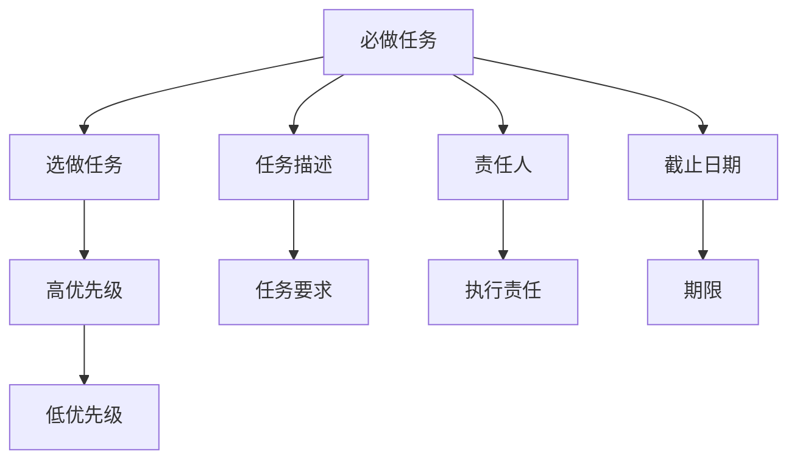

                 

# 双目标清单实操:聚焦重点,事半功倍

双目标清单（Dual-Objective Checklist）是一种高效的项目管理和任务优先级确定方法，特别适合在复杂多变的任务环境中实现对关键任务的聚焦，从而提升工作效果和产出效率。本文将详细介绍双目标清单的原理、操作步骤、优势和实际应用场景，并结合具体代码实例，展示如何在大规模软件开发项目中应用双目标清单，实现聚焦重点、事半功倍的效果。

## 1. 背景介绍

### 1.1 问题由来
在现代软件开发项目中，随着功能需求的日益复杂和迭代速度的加快，项目管理和任务优先级的确定变得愈发重要。传统的项目管理方法，如瀑布模型、敏捷开发等，虽然各有优势，但在处理多目标、高优先级任务时，往往无法做到既覆盖全面，又聚焦关键。

与此同时，随着微服务架构、DevOps、云计算等技术的发展，项目管理和任务优先级确定的要求也随之提高。如何在不同的项目阶段，合理分配资源，快速响应变化，实现项目的顺利交付，成为了开发团队的共同挑战。

### 1.2 问题核心关键点
双目标清单方法的核心在于，将任务列表划分为必做和选做两组，通过明确关键任务的优先级，帮助团队集中精力解决最关键的问题，从而在有限的时间内实现最大的产出效益。该方法的关键点包括：

- **双目标划分**：任务列表分为必做和选做，确保关键任务优先处理。
- **优先级排序**：对必做任务进行优先级排序，决定任务执行的顺序。
- **动态调整**：根据项目进展和需求变化，灵活调整任务优先级。
- **聚焦重点**：通过聚焦关键任务，提升工作效率和产出质量。
- **透明沟通**：通过清晰的优先级传达，促进团队成员之间的有效沟通。

这些关键点共同构成了双目标清单的核心思路，并驱动其广泛应用于各种项目管理场景中。

## 2. 核心概念与联系

### 2.1 核心概念概述

为更好地理解双目标清单方法，本节将介绍几个密切相关的核心概念：

- **必做任务**：项目中必须完成的任务，如核心功能开发、性能优化、安全加固等。
- **选做任务**：项目中可以完成的任务，如边缘功能开发、用户体验优化、文档编写等。
- **优先级**：根据任务的重要性和紧急性，为任务分配的执行顺序，通常使用高、中、低等不同级别。
- **任务描述**：详细记录任务的具体要求和执行步骤，帮助团队成员理解任务内容。
- **责任人**：明确每项任务的执行责任人，确保任务按时完成。
- **截止日期**：为任务设定完成期限，监控任务进度。

这些概念之间的逻辑关系可以通过以下Mermaid流程图来展示：



这个流程图展示了双目标清单的核心逻辑：

1. 任务按必做和选做进行划分。
2. 必做任务进一步按优先级高低进行排序。
3. 选做任务根据需要，灵活调整优先级。
4. 每个任务都需记录详细的描述、责任人和截止日期。

这些概念共同构成了双目标清单的基本框架，使得团队能够有组织、有条理地处理项目任务，提升整体效率和产出质量。

## 3. 核心算法原理 & 具体操作步骤

### 3.1 算法原理概述

双目标清单方法本质上是一种任务优先级确定和资源分配的优化算法。其核心思想是：将项目任务划分为必做和选做两组，根据任务的紧急性和重要性对必做任务进行优先级排序，从而在有限的时间内，优先处理最关键的任务，确保项目成功交付。

形式化地，假设项目任务集为 $T=\{t_i\}_{i=1}^N$，其中 $t_i$ 代表任务 $i$。任务可以分为必做 $T_{mandatory}$ 和选做 $T_{optional}$ 两组。对于必做任务，定义一个优先级函数 $f(t_i)$，表示任务 $t_i$ 的紧急性和重要性。优先级排序后得到任务序列 $P=\{p_i\}_{i=1}^N$，其中 $p_i$ 代表任务 $i$ 的执行顺序。最终的任务执行顺序为 $\{p_i\}_{i=1}^{N_{mandatory}}$，即优先级最高的 $N_{mandatory}$ 个必做任务。

### 3.2 算法步骤详解

双目标清单方法的实施一般包括以下几个关键步骤：

**Step 1: 任务划分**
- 列出项目中的所有任务，区分必做和选做任务。
- 对每个任务进行详细的描述、责任人和截止日期的记录。

**Step 2: 优先级排序**
- 对必做任务按紧急性和重要性进行优先级排序。
- 使用量化指标（如任务复杂度、影响范围、成本等）辅助优先级排序。
- 根据优先级确定必做任务的执行顺序。

**Step 3: 任务分配**
- 根据优先级和团队资源，分配每个任务的执行责任人。
- 定期评估任务进度和优先级，进行动态调整。
- 使用可视化工具（如看板、甘特图等）展示任务进展情况。

**Step 4: 执行监控**
- 实时监控必做任务的执行情况，确保按时完成。
- 记录任务执行过程中的问题和障碍，及时解决。
- 定期召开团队会议，汇报任务进展和调整计划。

### 3.3 算法优缺点

双目标清单方法具有以下优点：
1. 明确任务优先级，聚焦重点，提升工作效率。
2. 任务分配明确，责任清晰，确保任务按时完成。
3. 动态调整任务优先级，适应项目变化，灵活应变。
4. 可视化任务进展，促进团队沟通，提高协作效率。
5. 量化任务紧急性和重要性，提供客观依据，减少主观偏差。

同时，该方法也存在一些局限性：
1. 任务优先级确定可能存在主观性，影响公平性。
2. 需要团队成员之间的高度协作和沟通。
3. 需要定期调整任务优先级，增加管理复杂性。
4. 对于选做任务，优先级不够明确，可能影响整体项目进度。
5. 在动态变化较大的项目中，优先级调整可能不够及时，影响最终结果。

尽管存在这些局限性，但就目前而言，双目标清单方法仍是在复杂多变项目管理场景中的有效工具。未来相关研究的重点在于如何进一步提高任务优先级确定的客观性，减少主观偏差，同时兼顾团队协作和任务灵活性。

### 3.4 算法应用领域

双目标清单方法在各种项目管理场景中都有广泛应用，例如：

- 软件开发项目：区分核心功能开发和边缘功能开发，确保关键功能的按时交付。
- 系统运维项目：区分故障修复和性能优化，优先处理故障修复任务，保证系统稳定性。
- 市场营销项目：区分品牌推广和活动策划，优先处理品牌推广任务，确保品牌形象传播。
- 产品开发项目：区分核心功能开发和辅助功能开发，确保核心功能的优先实现。
- 教育培训项目：区分基础培训和进阶培训，确保基础培训的全面覆盖，再拓展进阶培训。

除了这些具体场景外，双目标清单还适用于其他各类复杂多变项目管理领域，帮助团队在资源有限的情况下，实现最大化的产出效益。

## 4. 数学模型和公式 & 详细讲解  
### 4.1 数学模型构建

本节将使用数学语言对双目标清单方法进行更加严格的刻画。

假设项目任务集为 $T=\{t_i\}_{i=1}^N$，其中 $t_i$ 代表任务 $i$。任务可以分为必做 $T_{mandatory}$ 和选做 $T_{optional}$ 两组。

定义任务的优先级函数 $f(t_i) \in [0,1]$，其中 $0$ 代表最低优先级，$1$ 代表最高优先级。任务的优先级可以由多个指标综合计算得出，如任务复杂度 $c_i$、影响范围 $r_i$、成本 $c_i$ 等。因此，任务的优先级函数可以表示为：

$$
f(t_i) = \alpha c_i + \beta r_i + \gamma l_i
$$

其中 $\alpha, \beta, \gamma$ 为权重系数，分别代表任务复杂度、影响范围和成本的重要性权重。任务的优先级函数可以进一步转化为优先级得分 $p_i = f(t_i)$。

根据优先级得分，对任务进行排序，得到任务序列 $P=\{p_i\}_{i=1}^N$。最终的任务执行顺序为 $\{p_i\}_{i=1}^{N_{mandatory}}$，即优先级最高的 $N_{mandatory}$ 个必做任务。

### 4.2 公式推导过程

以下我们以软件开发项目为例，推导任务优先级得分的计算公式。

假设项目中有 $N$ 个任务，每个任务有 $m$ 个属性 $t_i = (a_{i1}, a_{i2}, ..., a_{im})$，其中 $a_{ij}$ 为任务 $i$ 的第 $j$ 个属性。假设优先级函数 $f(t_i) = \alpha c_i + \beta r_i + \gamma l_i$，其中 $c_i$ 为任务复杂度，$r_i$ 为任务影响范围，$l_i$ 为任务成本。

任务的优先级得分为：

$$
p_i = f(t_i) = \alpha c_i + \beta r_i + \gamma l_i
$$

优先级得分的归一化表示为：

$$
\bar{p}_i = \frac{p_i}{\sum_{i=1}^N p_i}
$$

根据优先级得分 $\bar{p}_i$，对任务进行排序，得到任务序列 $P=\{\bar{p}_i\}_{i=1}^N$。最终的任务执行顺序为 $\{\bar{p}_i\}_{i=1}^{N_{mandatory}}$，即优先级最高的 $N_{mandatory}$ 个必做任务。

### 4.3 案例分析与讲解

假设某软件开发项目有 $N=10$ 个任务，每个任务的属性如下：

| 任务编号 | 复杂度 | 影响范围 | 成本 | 优先级系数 |
|---|---|---|---|---|
| T1 | 高 | 高 | 中 | (0.6, 0.4, 0.3) |
| T2 | 中 | 中 | 低 | (0.4, 0.5, 0.1) |
| T3 | 低 | 低 | 中 | (0.3, 0.3, 0.4) |
| T4 | 低 | 高 | 高 | (0.4, 0.6, 0.5) |
| T5 | 高 | 低 | 低 | (0.7, 0.2, 0.1) |
| T6 | 中 | 低 | 低 | (0.5, 0.3, 0.2) |
| T7 | 高 | 中 | 高 | (0.5, 0.4, 0.1) |
| T8 | 低 | 中 | 中 | (0.3, 0.3, 0.4) |
| T9 | 高 | 高 | 高 | (0.7, 0.5, 0.4) |
| T10 | 中 | 高 | 中 | (0.6, 0.4, 0.2) |

设优先级函数 $f(t_i) = \alpha c_i + \beta r_i + \gamma l_i$，其中 $\alpha=0.6, \beta=0.4, \gamma=0.2$。根据公式计算每个任务的优先级得分 $p_i$，再归一化得到 $\bar{p}_i$，最终得到任务序列 $P=\{\bar{p}_i\}_{i=1}^{10}$，优先级最高的前 3 个任务为 T1、T9、T7。

这个例子展示了如何使用优先级函数计算任务优先级，并通过排序确定必做任务的执行顺序。

## 5. 项目实践：代码实例和详细解释说明
### 5.1 开发环境搭建

在进行双目标清单实践前，我们需要准备好开发环境。以下是使用Python进行Pandas开发的环境配置流程：

1. 安装Anaconda：从官网下载并安装Anaconda，用于创建独立的Python环境。

2. 创建并激活虚拟环境：
```bash
conda create -n pythond-env python=3.8 
conda activate pythond-env
```

3. 安装Pandas：
```bash
conda install pandas
```

4. 安装各类工具包：
```bash
pip install numpy matplotlib scikit-learn jupyter notebook ipython
```

完成上述步骤后，即可在`pythond-env`环境中开始双目标清单实践。

### 5.2 源代码详细实现

下面我们以软件开发项目为例，给出使用Pandas库进行任务优先级排序的PyTorch代码实现。

首先，定义任务优先级得分的计算函数：

```python
import pandas as pd
from sklearn.preprocessing import MinMaxScaler

def calculate_priority_score(task):
    complexity = task['complexity']
    impact = task['impact']
    cost = task['cost']
    priority_weights = [0.6, 0.4, 0.2]  # 复杂度、影响范围、成本的权重系数
    
    # 计算优先级得分
    priority_score = priority_weights[0] * complexity + priority_weights[1] * impact + priority_weights[2] * cost
    return priority_score
```

然后，读取项目任务数据集，并计算每个任务的优先级得分：

```python
# 读取任务数据集
data = pd.read_csv('task_data.csv')

# 计算优先级得分
data['priority_score'] = data.apply(lambda row: calculate_priority_score(row), axis=1)

# 将优先级得分归一化
scaler = MinMaxScaler(feature_range=(0, 1))
data['priority_score'] = scaler.fit_transform(data[['priority_score']])

# 输出归一化后的优先级得分
print(data[['task_name', 'priority_score']])
```

接着，根据优先级得分排序，确定必做任务的执行顺序：

```python
# 排序任务
sorted_tasks = data.sort_values(by='priority_score', ascending=False)

# 输出排序后的任务
print(sorted_tasks[['task_name', 'priority_score']])
```

最后，使用双目标清单方法，对任务进行聚焦：

```python
# 获取优先级最高的前3个必做任务
top_tasks = sorted_tasks.head(3)

# 输出前3个必做任务
print(top_tasks[['task_name', 'priority_score']])
```

以上就是使用Pandas对任务优先级排序的完整代码实现。可以看到，Pandas库提供了高效的数据处理和计算功能，使得任务优先级排序变得简单易行。

### 5.3 代码解读与分析

让我们再详细解读一下关键代码的实现细节：

**calculate_priority_score函数**：
- 计算任务优先级得分，通过公式 $f(t_i) = \alpha c_i + \beta r_i + \gamma l_i$ 实现。

**归一化处理**：
- 使用sklearn的MinMaxScaler对优先级得分进行归一化处理，将得分区间缩放到 $[0,1]$。

**排序和输出**：
- 使用Pandas的sort_values方法对任务按优先级得分进行排序，获取优先级最高的前3个必做任务。

通过以上代码实现，展示了如何使用Pandas进行任务优先级排序，并得到必做任务的执行顺序。这有助于项目团队在有限的时间内，聚焦关键任务，提升项目产出效率。

## 6. 实际应用场景

### 6.1 智能客服系统

智能客服系统通常面临任务繁多且优先级不一的情况。通过双目标清单方法，可以明确核心功能的开发优先级，聚焦关键任务，确保核心功能的按时交付。

在具体应用中，可以将客户常见问题、重要故障处理等关键任务设置为必做任务，优先处理。而对于一些边缘功能，如非核心问题的查询处理、界面优化等，则可以视为选做任务，灵活安排。这样，智能客服系统能够高效运行，及时响应客户需求，提升用户体验。

### 6.2 企业信息化系统

企业信息化系统涉及数据迁移、系统集成、安全加固等多项复杂任务。通过双目标清单方法，可以明确每个任务的优先级，确保关键任务优先处理。

例如，在系统集成任务中，可以将数据迁移、核心模块集成、安全加固等关键功能设为必做任务，优先执行。而对于一些边缘功能，如界面美化、文档编写等，则可以视为选做任务，灵活安排。这样，企业信息化系统能够高效运行，确保关键功能的及时交付，提升企业运营效率。

### 6.3 市场营销活动

市场营销活动涉及品牌推广、广告投放、活动策划等多项任务，任务优先级的确定至关重要。通过双目标清单方法，可以明确品牌推广等关键任务，确保资源投入。

在具体应用中，可以将品牌推广、大客户关系维护等核心任务设为必做任务，优先处理。而对于一些边缘任务，如小型促销活动、社交媒体互动等，则可以视为选做任务，灵活安排。这样，市场营销活动能够高效推进，确保品牌推广任务的顺利实施，提升市场影响力。

### 6.4 未来应用展望

随着项目管理和任务优先级确定方法的不断演进，双目标清单方法将迎来新的发展机遇。未来，该方法可能将在更多领域得到应用，为项目管理和任务执行提供更高效的指导。

在智能制造领域，双目标清单方法可以帮助制造企业确定核心工艺优化、质量控制等关键任务，提升生产效率和产品质量。

在医疗健康领域，双目标清单方法可以帮助医院确定核心手术、病患治疗等关键任务，确保医疗资源的合理分配和高效使用。

在环保能源领域，双目标清单方法可以帮助企业确定关键技术研发、能源减排等任务，提升企业的可持续发展能力。

此外，在教育培训、交通物流、金融科技等众多领域，双目标清单方法也将发挥重要作用，提升各领域的项目管理效率和产出质量。

## 7. 工具和资源推荐
### 7.1 学习资源推荐

为了帮助开发者系统掌握双目标清单的原理和实践技巧，这里推荐一些优质的学习资源：

1. 《项目管理和敏捷开发》系列博文：由项目管理专家撰写，深入浅出地介绍了项目管理的基本概念和常见方法，包括双目标清单的原理和操作步骤。

2. Scrum.org《敏捷开发》课程：Scrum.org认证的敏捷开发课程，涵盖了Scrum、Kanban等多种项目管理方法，适合各类项目管理者学习。

3. Project Management Institute (PMI)认证课程：PMI认证的项目管理专业人员课程，涵盖项目规划、执行、监控和收尾等全过程管理，适合希望系统学习项目管理知识的人士。

4. Udemy《项目管理基础》课程：Udemy上的项目管理课程，涵盖项目管理的基本原理、工具和方法，适合初学者学习。

5. Project Management Institute (PMI)官方网站：PMI官网提供了大量项目管理领域的免费资源，包括白皮书、指南和在线课程，适合系统学习项目管理知识。

通过对这些资源的学习实践，相信你一定能够快速掌握双目标清单的精髓，并用于解决实际的项目管理问题。

### 7.2 开发工具推荐

高效的开发离不开优秀的工具支持。以下是几款用于双目标清单开发的常用工具：

1. JIRA：项目管理工具，支持任务分配、优先级设置、进度跟踪等功能，适合大中型项目管理。

2. Trello：看板式项目管理工具，支持任务移动、进度跟踪、实时更新等功能，适合小型项目管理。

3. Asana：任务管理工具，支持任务分配、进度跟踪、团队协作等功能，适合团队协作和项目管理。

4. Monday.com：流程管理工具，支持任务分配、进度跟踪、实时更新等功能，适合多种项目管理场景。

5. Microsoft Project：项目管理工具，支持任务分配、进度跟踪、资源管理等功能，适合大中型项目管理。

合理利用这些工具，可以显著提升双目标清单的实施效率，加快项目管理任务的进度。

### 7.3 相关论文推荐

双目标清单方法的研究源于项目管理领域的研究进展。以下是几篇奠基性的相关论文，推荐阅读：

1. "The Role of Priority Management in Effective Project Management"：论文探讨了优先级管理在项目管理中的重要性，提出优先级管理的基本框架和方法。

2. "A Comparative Study of Task Prioritization Techniques"：论文对比了多种任务优先级确定方法，包括双目标清单在内，分析其优缺点和适用场景。

3. "Prioritization Techniques for Project Management"：论文详细介绍了任务优先级确定的基本原理和操作步骤，包括优先级函数的计算和任务排序方法。

4. "Project Management Tools and Techniques"：论文总结了多种项目管理工具和技术的优缺点，推荐选择合适的工具进行项目管理。

5. "Agile Project Management: Principles, Practices, and Tools"：书籍全面介绍了敏捷项目管理的方法和工具，包括Scrum、Kanban、双目标清单等。

这些论文和书籍代表了项目管理方法的研究进展，为双目标清单的实践提供了理论基础和操作方法。

## 8. 总结：未来发展趋势与挑战

### 8.1 总结

本文对双目标清单方法进行了全面系统的介绍。首先阐述了双目标清单方法在项目管理中的应用背景和意义，明确了该方法在任务优先级确定、资源分配和聚焦重点方面的独特价值。其次，从原理到实践，详细讲解了双目标清单的数学模型和操作步骤，给出了任务优先级排序的代码实现。同时，本文还广泛探讨了双目标清单方法在多个行业领域的应用场景，展示了其广泛的应用前景。

通过本文的系统梳理，可以看到，双目标清单方法在复杂多变的项目管理环境中，具有明确的优先级确定和资源分配能力，能够显著提升团队的工作效率和产出质量。未来，随着项目管理技术的不断演进，双目标清单方法必将在更广泛的领域中得到应用，带来更多的管理创新和项目成功。

### 8.2 未来发展趋势

展望未来，双目标清单方法将呈现以下几个发展趋势：

1. 工具化和平台化：双目标清单方法将逐渐被各类项目管理工具和平台所集成，形成更加直观易用的界面，提升项目管理效率。

2. 数据驱动和动态调整：双目标清单方法将引入更多数据驱动的优化算法，通过动态调整任务优先级，更好地应对项目变化和需求更新。

3. 多目标优化：双目标清单方法将逐渐扩展到多目标优化，考虑任务优先级、资源限制、客户需求等多种因素，提升项目管理的多维度和适应性。

4. 智能推荐：双目标清单方法将引入人工智能技术，通过分析任务特性和团队历史数据，自动推荐任务优先级和资源分配方案，进一步提升项目管理智能化水平。

5. 跨领域应用：双目标清单方法将逐渐扩展到其他领域，如医疗、教育、交通等，解决多目标、多资源的管理问题，提升领域应用效率。

以上趋势凸显了双目标清单方法在项目管理领域的广阔前景，为项目管理的智能化、高效化和协同化提供了新的方向。这些方向的探索发展，必将进一步提升项目管理的技术水平，促进各领域的数字化转型和智能化升级。

### 8.3 面临的挑战

尽管双目标清单方法已经取得了显著成效，但在实际应用中也面临诸多挑战：

1. 任务优先级确定的主观性：任务优先级往往依赖于项目经理的主观判断，存在一定的偏差。如何在多任务并存时，客观、公平地确定任务优先级，将是未来研究的重点。

2. 动态调整的复杂性：项目在执行过程中，需求和环境变化频繁，如何动态调整任务优先级，保证项目进度和资源分配的合理性，是另一个挑战。

3. 跨团队协作的困难：双目标清单方法需要团队成员之间的紧密协作和沟通，如何在不同团队间进行有效的任务优先级传达，是实际应用中的难题。

4. 工具集成的复杂性：将双目标清单方法集成到各类项目管理工具中，需要解决数据接口、算法优化、用户体验等问题，增加了工具集成的复杂性。

5. 数据质量和量化的准确性：任务优先级得分的计算依赖于数据质量和量化指标的准确性，如何准确获取和处理任务数据，将是未来研究的难点。

6. 管理效果的评价：如何评估双目标清单方法的管理效果，验证其改进项目管理的实际成效，需要建立科学的评价指标和方法。

正视双目标清单方法面临的这些挑战，积极应对并寻求突破，将使双目标清单方法在项目管理中更加实用、可靠，发挥更大的价值。相信随着研究人员的不断努力，这些挑战终将一一克服，双目标清单方法必将在项目管理中发挥更大的作用。

### 8.4 研究展望

面对双目标清单方法所面临的挑战，未来的研究需要在以下几个方面寻求新的突破：

1. 数据驱动的优化算法：引入机器学习等数据驱动的优化算法，通过分析任务数据和历史项目管理经验，自动推荐任务优先级和资源分配方案。

2. 多目标优化的模型：构建多目标优化模型，考虑任务优先级、资源限制、客户需求等多种因素，提升项目管理的多维度和适应性。

3. 任务优先级的动态调整：开发任务优先级的动态调整算法，通过实时监控项目进展和环境变化，及时调整任务优先级，保证项目进度和资源分配的合理性。

4. 跨团队协作的优化：建立跨团队协作的优化机制，通过任务优先级的透明沟通和可视化展示，促进不同团队之间的协作和信息共享。

5. 智能推荐的系统：开发基于人工智能的智能推荐系统，通过任务数据和团队历史数据，自动推荐任务优先级和资源分配方案，提升项目管理智能化水平。

这些研究方向的探索，必将引领双目标清单方法迈向更高的台阶，为项目管理带来更高效、更智能的管理工具和手段。面向未来，双目标清单方法需要与其他项目管理工具和技术进行更深入的融合，共同推动项目管理技术的进步。只有勇于创新、敢于突破，才能不断拓展任务优先级确定的方法，让项目管理更上一层楼。

## 9. 附录：常见问题与解答

**Q1：如何评估双目标清单方法的效果？**

A: 评估双目标清单方法的效果，可以从以下几个方面进行：

1. 任务完成时间：对比使用双目标清单方法前后的任务完成时间，评估任务优先级确定和资源分配的效果。
2. 项目绩效指标：包括项目进度、质量、成本、客户满意度等指标，评估双目标清单方法对项目管理整体绩效的影响。
3. 团队协作效果：通过团队沟通和协作的数据，评估双目标清单方法对团队协作的促进效果。
4. 用户体验评价：通过客户反馈和用户满意度调查，评估双目标清单方法对用户体验的影响。
5. 数据驱动优化：通过数据分析和实验结果，评估双目标清单方法对项目管理工具和算法的优化效果。

通过综合评估这些指标，可以全面了解双目标清单方法在项目管理中的应用效果，不断改进和优化方法。

**Q2：双目标清单方法是否适用于所有类型的项目？**

A: 双目标清单方法在处理多目标、高优先级任务时非常有效，但在一些特定类型的项目中，可能需要结合其他项目管理方法。

例如，在极端不确定性和高风险的项目中，如科研开发、军事任务等，可能需要引入敏捷开发、极限编程等方法，以快速响应变化，灵活应对未知挑战。

在需要严格控制进度和成本的项目中，如大型基础设施建设、软件系统开发等，可能需要引入瀑布模型、关键路径法等方法，确保项目按时交付和成本控制。

在需要高度协作和创新的项目中，如软件开发、创意设计等，可能需要引入设计思维、用户中心设计等方法，促进团队协作和创新。

因此，双目标清单方法适用于多目标、高优先级任务的处理，但具体应用时需要结合项目特点和需求，灵活选择和组合其他项目管理方法。

**Q3：如何选择合适的任务优先级计算方法？**

A: 任务优先级计算方法的选择需要综合考虑项目特点和数据质量。以下是几种常用的任务优先级计算方法：

1. 基于任务重要性和紧急性的方法：如A类任务、B类任务、C类任务等，根据任务的紧急性和重要性进行优先级排序。
2. 基于任务复杂度和资源需求的方法：根据任务复杂度和资源需求，计算任务优先级得分。
3. 基于客户需求和市场影响的方法：根据客户需求和市场影响，计算任务优先级得分。
4. 基于价值和成本的方法：根据任务的价值和成本，计算任务优先级得分。

选择合适的任务优先级计算方法，需要结合项目实际情况，综合考虑任务紧急性、重要性、复杂度、资源需求、客户需求、市场影响、价值和成本等多种因素。

**Q4：双目标清单方法在小型项目中如何应用？**

A: 双目标清单方法在小型项目中同样适用，但可能需要简化步骤和降低复杂度。以下是一些具体建议：

1. 任务划分简化：对于小型项目，可以将任务划分为核心任务和辅助任务，简化优先级划分和排序。
2. 优先级排序简化：根据任务紧急性和重要性，简化优先级排序步骤。
3. 责任人明确：对于小型项目，可以明确每个任务的责任人，简化任务分配和管理。
4. 进度跟踪简化：使用简单的看板或甘特图工具，简化进度跟踪和监控。
5. 团队协作简化：通过定期的团队会议和即时沟通，简化团队协作和沟通。

通过简化步骤和降低复杂度，双目标清单方法可以在小型项目中高效应用，提升项目管理和任务执行的效率。

**Q5：如何平衡任务优先级和资源限制？**

A: 任务优先级和资源限制是项目管理中的重要问题，需要在实际应用中灵活平衡。以下是一些具体建议：

1. 优先级动态调整：在项目执行过程中，根据任务进展和资源使用情况，动态调整任务优先级，保证资源高效利用。
2. 资源优化配置：通过资源优化配置，合理分配资源，确保关键任务有足够的资源支持。
3. 风险管理：在任务优先级确定时，考虑任务的风险因素，优先处理高风险任务，降低项目风险。
4. 数据驱动决策：通过数据分析和实验结果，评估任务优先级和资源分配的效果，进行优化调整。
5. 跨部门协作：通过跨部门协作，优化资源配置和任务优先级，提升项目整体绩效。

通过灵活平衡任务优先级和资源限制，可以确保项目按时交付和高效执行，提升项目管理效果。

通过以上代码实现，展示了如何使用Pandas进行任务优先级排序，并得到必做任务的执行顺序。这有助于项目团队在有限的时间内，聚焦关键任务，提升项目产出效率。

---

作者：禅与计算机程序设计艺术 / Zen and the Art of Computer Programming

