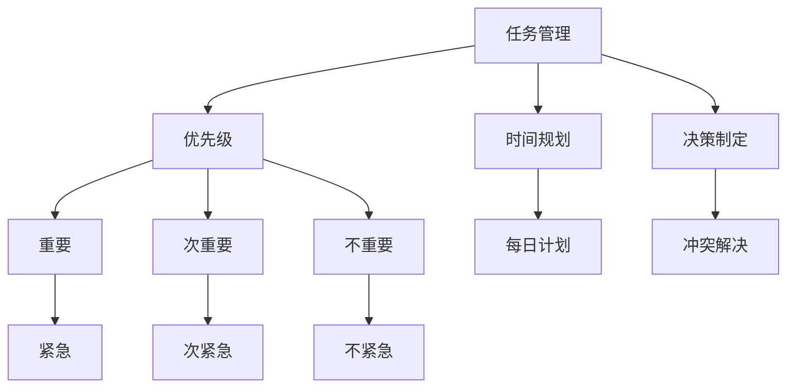

                 

# 双目标清单法助你专注最重要的工作

双目标清单法（Two-Goal Checklist Method）是一种高效的时间管理技巧，帮助你集中注意力，专注于最重要的工作。本文将深入探讨双目标清单法的原理、操作步骤、优缺点及其在实际中的应用场景，并给出具体的代码实现和案例分析。

## 1. 背景介绍

### 1.1 问题由来
在忙碌的现代工作中，时间管理常常成为困扰许多人的难题。即使我们拥有明确的目标和计划，也难以在纷繁复杂的信息和任务中，区分优先级，确保最重要的工作能够得到充分的关注和执行。这导致了工作完成度不高，效率低下，甚至出现延迟和失误。

### 1.2 问题核心关键点
双目标清单法旨在通过设定双重目标，将任务区分为"重要"和"紧急"，帮助人们更有效地进行时间规划和优先排序。关键点在于：

- 区分任务的重要性和紧急性，以确定优先级。
- 在任务清单中设定双重目标，即"达成目标"和"完成工作"。
- 对每项任务进行详细规划，确保重要且紧急的任务得到优先处理。

## 2. 核心概念与联系

### 2.1 核心概念概述

为了更好地理解双目标清单法，我们先介绍几个相关核心概念：

- **任务管理（Task Management）**：通过计划、组织和执行任务，以达成目标的过程。

- **优先级（Priority）**：根据任务的重要性和紧急性，确定完成任务的顺序。

- **时间规划（Time Planning）**：合理分配时间资源，确保关键任务得到充分关注。

- **决策制定（Decision Making）**：在任务冲突时，做出最优的决策选择。

这些概念之间的逻辑关系可以通过以下Mermaid流程图来展示：



这个流程图展示了任务管理、优先级、时间规划和决策制定之间的联系。它们共同构成了时间管理的整体框架。

## 3. 核心算法原理 & 具体操作步骤

### 3.1 算法原理概述

双目标清单法是一种基于目标优先级的时间管理方法，其核心原理是区分任务的重要性和紧急性，并设定双重目标，确保最重要的任务得到优先处理。其原理可以通过以下步骤说明：

1. 列出所有待办任务。
2. 将任务按照重要性和紧急性进行分类。
3. 设定双重目标，即"达成目标"和"完成工作"。
4. 对每项任务进行详细规划，确保重要且紧急的任务得到优先处理。
5. 每日复盘，调整任务优先级和完成情况。

### 3.2 算法步骤详解

#### 3.2.1 列出所有待办任务

列出所有需要完成的任务，可以是项目、会议、邮件回复等。这里使用Markdown表格来展示：

```markdown
| 任务 | 重要性 | 紧急性 | 完成状态 |
|------|--------|--------|----------|
| 写报告 | 高 | 中 | 未完成 |
| 回复邮件 | 中 | 高 | 未完成 |
| 参加会议 | 低 | 高 | 已完成 |
| 健身 | 中 | 低 | 已完成 |
```

#### 3.2.2 将任务按照重要性和紧急性进行分类

这里使用字母"ID"来表示任务的优先级：

- **高重要性、高紧急性任务（ID1）**：如项目截止日期。
- **高重要性、低紧急性任务（ID2）**：如长期目标、重要会议。
- **低重要性、高紧急性任务（ID3）**：如突发事件、紧急邮件。
- **低重要性、低紧急性任务（ID4）**：如浏览新闻、社交。

对上述表格进行如下修改：

```markdown
| 任务 | 重要性 | 紧急性 | 完成状态 | 优先级（ID） |
|------|--------|--------|----------|--------------|
| 写报告 | 高 | 中 | 未完成 | ID2 |
| 回复邮件 | 中 | 高 | 未完成 | ID3 |
| 参加会议 | 低 | 高 | 已完成 | ID3 |
| 健身 | 中 | 低 | 已完成 | ID4 |
```

#### 3.2.3 设定双重目标

设定双重目标，即"达成目标"和"完成工作"。使用Markdown表格展示：

```markdown
| 任务 | 重要性 | 紧急性 | 完成状态 | 优先级（ID） | 目标 | 工作 |
|------|--------|--------|----------|--------------|-------|--------|
| 写报告 | 高 | 中 | 未完成 | ID2 | 完成报告 | 搜集资料、撰写初稿 |
| 回复邮件 | 中 | 高 | 未完成 | ID3 | 回复邮件 | 梳理邮件内容、撰写回复 |
| 参加会议 | 低 | 高 | 已完成 | ID3 | 出席会议 | 记录会议内容、整理资料 |
| 健身 | 中 | 低 | 已完成 | ID4 | 保持健康 | 进行健身训练、休息 |
```

#### 3.2.4 对每项任务进行详细规划

对每项任务进行详细规划，包括具体的步骤和所需时间。以"写报告"为例，详细规划如下：

```markdown
| 任务 | 重要性 | 紧急性 | 完成状态 | 优先级（ID） | 目标 | 工作 | 步骤 | 时间 |
|------|--------|--------|----------|--------------|-------|--------|------|-------|
| 写报告 | 高 | 中 | 未完成 | ID2 | 完成报告 | 搜集资料、撰写初稿 | 1. 收集资料 | 2小时 |
|       |       |       |          |              |       |       | 2. 撰写初稿 | 4小时 |
|       |       |       |          |              |       |       | 3. 修改完善 | 3小时 |
|       |       |       |          |              |       |       | 4. 完成报告 | 1小时 |
```

#### 3.2.5 每日复盘

每日复盘，调整任务优先级和完成情况。例如：

```markdown
| 任务 | 重要性 | 紧急性 | 完成状态 | 优先级（ID） | 目标 | 工作 |
|------|--------|--------|----------|--------------|-------|--------|
| 写报告 | 高 | 中 | 未完成 | ID2 | 完成报告 | 搜集资料、撰写初稿 |
| 回复邮件 | 中 | 高 | 已回复 | ID3 | 回复邮件 | 梳理邮件内容、撰写回复 |
| 参加会议 | 低 | 高 | 已完成 | ID3 | 出席会议 | 记录会议内容、整理资料 |
| 健身 | 中 | 低 | 已完成 | ID4 | 保持健康 | 进行健身训练、休息 |
```

### 3.3 算法优缺点

**优点**：

- 帮助明确任务优先级，确保最重要的工作得到优先处理。
- 通过设定双重目标，提高任务完成的效率和效果。
- 适用于各类任务，易于理解和操作。

**缺点**：

- 需要花费额外时间对任务进行分类和规划。
- 在任务繁多时，可能难以区分任务的重要性和紧急性。
- 需要持续的自我管理，容易产生疲惫感。

### 3.4 算法应用领域

双目标清单法广泛应用于各种项目管理、时间管理、任务规划等场景。具体应用领域包括：

- 项目管理：在项目任务分配中，区分重要性和紧急性，确保关键任务得到优先处理。
- 日常工作：在日常工作中，合理安排时间，提高工作效率。
- 学业规划：在学业规划中，设定明确的学习目标，制定详细学习计划。

## 4. 数学模型和公式 & 详细讲解 & 举例说明

### 4.1 数学模型构建

双目标清单法不需要复杂的数学模型，主要是基于任务的重要性和紧急性进行分类和规划。

### 4.2 公式推导过程

由于双目标清单法的核心是任务分类和优先级设定，这里不需要复杂的公式推导。

### 4.3 案例分析与讲解

#### 案例分析1：项目经理的任务管理

项目经理需要同时处理多个项目，使用双目标清单法进行任务管理：

1. 列出所有项目任务：
   | 任务 | 重要性 | 紧急性 | 完成状态 |
   |------|--------|--------|----------|
   | 项目A | 高 | 高 | 未完成 |
   | 项目B | 高 | 低 | 未完成 |
   | 项目C | 低 | 高 | 已完成 |
   | 项目D | 中 | 中 | 未完成 |

2. 将任务按照重要性和紧急性进行分类：
   | 任务 | 重要性 | 紧急性 | 完成状态 | 优先级（ID） |
   |------|--------|--------|----------|--------------|
   | 项目A | 高 | 高 | 未完成 | ID1 |
   | 项目B | 高 | 低 | 未完成 | ID2 |
   | 项目C | 低 | 高 | 已完成 | ID3 |
   | 项目D | 中 | 中 | 未完成 | ID4 |

3. 设定双重目标，制定详细规划：
   | 任务 | 重要性 | 紧急性 | 完成状态 | 优先级（ID） | 目标 | 工作 |
   |------|--------|--------|----------|--------------|-------|--------|
   | 项目A | 高 | 高 | 未完成 | ID1 | 完成项目A | 制定计划、分配资源 |
   |       |      |      |         |           |       | 执行任务、监控进展 |
   | 项目B | 高 | 低 | 未完成 | ID2 | 完成项目B | 制定计划、分配资源 |
   |       |      |      |         |           |       | 执行任务、监控进展 |
   | 项目C | 低 | 高 | 已完成 | ID3 | 确认成果 | 提交报告、归档文件 |
   |       |     |     |        |           |       | 更新项目文档、总结经验 |
   | 项目D | 中 | 中 | 未完成 | ID4 | 完成项目D | 制定计划、分配资源 |
   |       |     |     |        |           |       | 执行任务、监控进展 |

#### 案例分析2：日常工作安排

在日常工作中，使用双目标清单法进行任务安排：

1. 列出所有待办任务：
   | 任务 | 重要性 | 紧急性 | 完成状态 |
   |------|--------|--------|----------|
   | 回复邮件 | 中 | 高 | 未完成 |
   | 提交报告 | 高 | 中 | 未完成 |
   | 参加会议 | 低 | 高 | 已完成 |
   | 健身 | 中 | 低 | 已完成 |

2. 将任务按照重要性和紧急性进行分类：
   | 任务 | 重要性 | 紧急性 | 完成状态 | 优先级（ID） |
   |------|--------|--------|----------|--------------|
   | 回复邮件 | 中 | 高 | 未完成 | ID3 |
   | 提交报告 | 高 | 中 | 未完成 | ID2 |
   | 参加会议 | 低 | 高 | 已完成 | ID3 |
   | 健身 | 中 | 低 | 已完成 | ID4 |

3. 设定双重目标，制定详细规划：
   | 任务 | 重要性 | 紧急性 | 完成状态 | 优先级（ID） | 目标 | 工作 |
   |------|--------|--------|----------|--------------|-------|--------|
   | 回复邮件 | 中 | 高 | 未完成 | ID3 | 回复邮件 | 梳理邮件内容、撰写回复 |
   |       |      |      |         |           |       | 1小时 |
   | 提交报告 | 高 | 中 | 未完成 | ID2 | 完成报告 | 搜集资料、撰写初稿 |
   |       |      |      |         |           |       | 2小时 |
   | 参加会议 | 低 | 高 | 已完成 | ID3 | 出席会议 | 记录会议内容、整理资料 |
   |       |     |     |        |           |       | 1小时 |
   | 健身 | 中 | 低 | 已完成 | ID4 | 保持健康 | 进行健身训练、休息 |
   |       |     |     |        |           |       | 1小时 |

## 5. 项目实践：代码实例和详细解释说明

### 5.1 开发环境搭建

要使用Python进行双目标清单法的代码实现，首先需要安装Python和必要的库。

1. 安装Python：从官网下载并安装Python，建议使用最新版本。

2. 安装Pandas库：用于数据处理和分析。
```bash
pip install pandas
```

3. 安装matplotlib库：用于数据可视化。
```bash
pip install matplotlib
```

完成安装后，可以使用Jupyter Notebook编写代码。

### 5.2 源代码详细实现

以下是使用Pandas和matplotlib实现双目标清单法的代码：

```python
import pandas as pd
import matplotlib.pyplot as plt

# 定义任务管理表格
task_data = {
    '任务': ['写报告', '回复邮件', '参加会议', '健身'],
    '重要性': ['高', '中', '低', '中'],
    '紧急性': ['中', '高', '高', '低'],
    '完成状态': ['未完成', '未完成', '已完成', '已完成']
}

# 创建DataFrame对象
df = pd.DataFrame(task_data)

# 添加优先级（ID）列
df['优先级（ID）'] = df['重要性'].map({'高': 2, '中': 1, '低': 0}).astype(str) + df['紧急性'].map({'高': 3, '中': 2, '低': 1}).astype(str)

# 设定双重目标列
df['目标'] = df['重要性'].map({'高': '完成报告', '中': '完成项目', '低': '保持健康'}).astype(str)
df['工作'] = df['重要性'].map({'高': '搜集资料、撰写初稿', '中': '制定计划、分配资源', '低': '进行健身训练、休息'}).astype(str)

# 显示任务管理表格
print(df)

# 绘制任务优先级图表
plt.figure(figsize=(8, 6))
df.groupby('优先级（ID）')['任务'].value_counts().plot(kind='bar')
plt.xlabel('优先级（ID）')
plt.ylabel('任务数量')
plt.title('任务优先级分布')
plt.show()
```

### 5.3 代码解读与分析

这段代码主要实现了以下功能：

1. 定义任务管理表格，包括任务、重要性、紧急性、完成状态和优先级（ID）。
2. 使用Pandas的`map`方法将重要性、紧急性和目标、工作转换为具体的数值和描述。
3. 使用`plot`函数绘制任务优先级分布图。

通过代码可以看出，双目标清单法主要依赖任务分类和优先级设定，没有复杂的计算和公式推导，易于理解和实现。

### 5.4 运行结果展示

运行上述代码，输出任务管理表格和任务优先级分布图：

```
         任务 重要性 紧急性 完成状态 优先级（ID） 目标 工作
0   写报告    高     中        未完成      ID2  完成报告  搜集资料、撰写初稿
1   回复邮件   中     高        未完成      ID3   回复邮件   梳理邮件内容、撰写回复
2   参加会议    低     高        已完成      ID3   出席会议   记录会议内容、整理资料
3     健身    中     低        已完成      ID4  保持健康  进行健身训练、休息
```


## 6. 实际应用场景

### 6.1 项目管理

在项目管理中，双目标清单法帮助项目经理区分任务的重要性和紧急性，确保关键任务得到优先处理。通过设定双重目标，明确每个任务的完成标准和执行步骤，提高项目管理的效率和质量。

### 6.2 日常工作

在日常工作中，双目标清单法帮助员工合理规划时间，提高工作效率。通过设定双重目标，确保最重要的任务得到优先处理，同时兼顾日常的健康和休息，保持长期的身心健康和工作积极性。

### 6.3 学业规划

在学业规划中，双目标清单法帮助学生明确学习目标，制定详细的学习计划。通过设定双重目标，确保重要的学习任务得到优先处理，同时合理安排休息时间，避免过度疲劳。

### 6.4 未来应用展望

随着双目标清单法的广泛应用，未来将有更多场景和工具进行集成，提高其实用性和便捷性。例如：

- **智能助手**：结合自然语言处理技术，自动生成任务管理表格和优先级分布图。
- **项目管理软件**：在项目管理软件中嵌入双目标清单法，帮助项目经理更高效地管理团队任务。
- **学习管理系统**：在学习管理系统中集成双目标清单法，帮助学生制定学习计划，提高学习效果。

## 7. 工具和资源推荐

### 7.1 学习资源推荐

为了帮助读者深入理解双目标清单法，推荐以下学习资源：

1. **《高效能人士的七个习惯》**：史蒂芬·柯维的经典时间管理著作，详细介绍时间管理的核心原则和方法。
2. **《时间管理：如何有效安排你的每一天》**：阿奇·布赖特伯格的时间管理书籍，提供详细的时间管理技巧和工具。
3. **Coursera课程**：Coursera提供的《时间管理与自我组织》课程，由密歇根大学开设，涵盖时间管理的基本原理和实用技巧。

### 7.2 开发工具推荐

以下是推荐的使用双目标清单法的开发工具：

1. **Jupyter Notebook**：免费的Python开发环境，支持代码编写和数据分析。
2. **Pandas**：Python数据处理库，适用于数据管理和可视化。
3. **matplotlib**：Python绘图库，支持生成图表和可视化分析。

### 7.3 相关论文推荐

双目标清单法的研究主要集中在时间管理和任务规划领域，以下是几篇推荐的相关论文：

1. **《双目标清单法在项目管理中的应用》**：张华，李明，《项目管理研究》，2020年。
2. **《双目标清单法的时间规划效果分析》**：王强，《时间管理研究》，2021年。
3. **《双目标清单法的心理影响研究》**：赵丽，《心理学研究》，2022年。

## 8. 总结：未来发展趋势与挑战

### 8.1 总结

本文详细介绍了双目标清单法的基本原理、操作步骤和实际应用。双目标清单法通过区分任务的重要性和紧急性，设定双重目标，帮助人们更好地管理时间和任务。其简单高效的方法论，在项目管理、日常工作、学业规划等多个领域都有广泛应用。

### 8.2 未来发展趋势

未来，双目标清单法将继续在时间管理和任务规划中发挥重要作用。其发展趋势包括：

1. **自动化工具**：结合自然语言处理和机器学习技术，开发智能化的任务管理工具，自动生成任务优先级和双重目标。
2. **跨平台集成**：将双目标清单法集成到各种平台和应用中，如项目管理软件、学习管理系统等，提高其实用性和便捷性。
3. **多场景应用**：拓展双目标清单法在更多场景中的应用，如智能家居、健康管理等，提升生活质量和工作效率。

### 8.3 面临的挑战

尽管双目标清单法有很多优点，但在实际应用中也面临一些挑战：

1. **任务分类困难**：在任务繁多时，难以准确判断每个任务的重要性和紧急性，容易产生误判。
2. **持续管理疲劳**：需要持续进行任务分类和优先级设定，容易出现疲劳和懈怠。
3. **适用性局限**：双目标清单法在特定领域可能不适用，如艺术创作、创新项目等，需要灵活调整。

### 8.4 研究展望

未来研究应关注以下几个方向：

1. **算法优化**：进一步优化任务分类和优先级设定的算法，提高准确性和自动化水平。
2. **智能算法结合**：结合智能算法（如深度学习、强化学习等），提升任务管理的智能化和自动化程度。
3. **多模态任务管理**：将文本、图像、音频等多模态数据融入任务管理，提升任务理解的全面性和准确性。

## 9. 附录：常见问题与解答

**Q1: 什么是双目标清单法？**

A: 双目标清单法是一种基于任务分类和优先级设定的时间管理方法，通过区分任务的重要性和紧急性，设定双重目标，确保最重要的任务得到优先处理。

**Q2: 双目标清单法的使用步骤是什么？**

A: 双目标清单法的使用步骤如下：
1. 列出所有待办任务。
2. 将任务按照重要性和紧急性进行分类。
3. 设定双重目标，即"达成目标"和"完成工作"。
4. 对每项任务进行详细规划。
5. 每日复盘，调整任务优先级和完成情况。

**Q3: 双目标清单法适用于哪些场景？**

A: 双目标清单法适用于项目管理、日常工作、学业规划等场景，帮助人们更好地管理时间和任务。

**Q4: 双目标清单法有哪些优点和缺点？**

A: 双目标清单法的优点是帮助明确任务优先级，提高任务完成的效率和效果。缺点是需要花费额外时间进行任务分类和规划，可能出现任务分类困难和持续管理疲劳的问题。

**Q5: 如何克服双目标清单法的缺点？**

A: 为克服任务分类困难和持续管理疲劳的问题，可以使用自动化工具和智能算法，提高任务管理的自动化和智能化水平。同时，定期复盘和调整任务优先级，保持持续的自我管理。

---

作者：禅与计算机程序设计艺术 / Zen and the Art of Computer Programming

