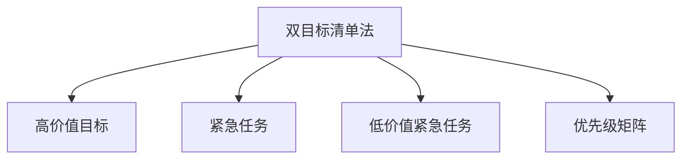

                 

# 双目标清单法助你专注最重要的工作

## 1. 背景介绍

### 1.1 问题由来
在现代快节奏的工作环境中，面对繁杂多样的任务，如何高效、精准地安排工作，成为许多专业人士的挑战。尽管时间管理、项目管理等工具广泛应用，但许多人在实践中仍感到难以高效完成重要工作。而双目标清单法，通过简单且有效的策略，帮助人们明确优先级，专注于最重要的工作。

### 1.2 问题核心关键点
双目标清单法（Two Target List Method）是一种基于目标设定的方法，旨在帮助个人或团队明确工作优先级，合理分配时间和资源。其核心思想是设定两个主要目标，并通过清单工具实现对这些目标的跟踪和优化。该方法特别适用于高复杂度、高时间敏感度的任务场景，如项目规划、产品开发、学术研究等。

## 2. 核心概念与联系

### 2.1 核心概念概述

为更好地理解双目标清单法的原理和操作，本节将介绍几个关键概念：

- **双目标清单法**：一种基于目标设定的方法，通过设定两个主要目标，并利用清单工具实现对目标的跟踪和优化。
- **高价值目标**：指能够带来最大收益或影响的目标，通常指对个人或组织有深远影响的长期项目。
- **紧急任务**：指需要在短时间内完成的任务，通常具有较高的即时回报，但不一定是长期目标。
- **低价值紧急任务**：指紧急但不重要，对长期目标和收益贡献较小的任务。
- **优先级矩阵**：一种用来评估任务优先级的二维矩阵，通过将任务分为紧急和重要两个维度，帮助决策者合理规划时间与资源。

这些概念之间的逻辑关系可以通过以下Mermaid流程图来展示：



## 3. 核心算法原理 & 具体操作步骤

### 3.1 算法原理概述

双目标清单法的基本原理是通过设定两个主要目标，并采用优先级矩阵对任务进行分类，从而明确工作优先级，优化时间和资源分配。其核心在于通过两个关键步骤：

1. **目标设定**：明确两个主要目标，确保它们对个人或组织有深远的影响。
2. **任务分类与优先级排序**：通过优先级矩阵，对所有任务进行分类和排序，将任务分配到高价值目标和低价值紧急任务中，优先完成高价值目标。

### 3.2 算法步骤详解

双目标清单法主要包括以下步骤：

**Step 1: 设定双目标**

- **高价值目标设定**：确定一个或多个对个人或组织有深远影响的长期目标。目标应具备明确性、可达性、相关性、可量化和时效性（SMART原则）。
- **紧急任务设定**：列出需要立即完成的任务，通常是日常工作中突发或突发的紧急事项。

**Step 2: 建立优先级矩阵**

- **任务分类**：使用四象限优先级矩阵，将任务分为高价值目标、低价值紧急任务、低价值非紧急任务、高价值非紧急任务四类。
- **优先级排序**：对每个目标的任务按照紧急程度和重要性进行排序，确保在有限的时间内，优先完成高价值目标，同时避免陷入低价值紧急任务的陷阱。

**Step 3: 执行与跟踪**

- **任务分配**：根据优先级排序，制定每日或每周的工作计划，明确每个任务的时间节点和负责人。
- **定期评估与调整**：定期回顾工作进度，评估任务完成情况，根据实际情况调整目标和任务优先级。
- **反思与优化**：每周或每月进行反思，总结经验教训，优化工作流程和方法，提升工作效率。

### 3.3 算法优缺点

双目标清单法的优点包括：

- **清晰明确**：通过设定明确的目标和优先级矩阵，使工作更加有条理和目的性。
- **高效资源利用**：确保最重要的工作得到优先处理，避免时间和资源浪费在低价值任务上。
- **灵活可调整**：根据实际情况灵活调整目标和任务，适应不断变化的环境和工作需求。

其缺点主要有：

- **实施难度**：需要足够的自律和规划能力，适用于长期目标较为明确、工作环境相对稳定的场景。
- **依赖环境**：依赖团队合作和外部资源支持，在独立工作或资源有限的情况下，效果可能受限。

### 3.4 算法应用领域

双目标清单法广泛应用于项目管理、产品开发、学术研究等高复杂度、高时间敏感度的任务场景。以下是几个典型应用案例：

- **项目管理**：通过设定项目的高价值目标和里程碑，确保关键任务的优先完成，避免资源分散，提升项目整体效率。
- **产品开发**：识别产品的核心价值和市场机会，聚焦关键功能开发，同时处理日常产品维护和市场活动，确保产品战略和战术的统一。
- **学术研究**：明确研究的高价值方向和关键成果，优先完成对领域影响较大的项目，同时处理日常数据收集和文献阅读任务，提升研究深度和广度。
- **个人发展**：设定个人成长的高价值目标，如技能提升、职业转型等，优先处理重要学习任务，避免时间分散在低价值娱乐和社交上。

## 4. 数学模型和公式 & 详细讲解

### 4.1 数学模型构建

双目标清单法不涉及复杂的数学模型，但可以通过简单的优先级矩阵进行任务分类。以下是优先级矩阵的构建和应用：

- **优先级矩阵**：分为两个维度：紧急性和重要性。横轴表示紧急性，纵轴表示重要性，将任务分为四个象限：
  1. 高价值目标：重要且不紧急。
  2. 低价值紧急任务：紧急但不重要。
  3. 低价值非紧急任务：不重要且不紧急。
  4. 高价值非紧急任务：重要但不紧急。

### 4.2 公式推导过程

由于优先级矩阵是一个简单的分类工具，不涉及数学推导，主要通过逻辑推理确定任务分类。以下是一个简化的示例：

假设有一个任务列表如下：

1. 完成项目可行性分析报告（高价值目标，低紧急性）
2. 解决客户投诉（紧急任务，高重要性）
3. 回复日常邮件（低价值紧急任务）
4. 整理办公桌（低价值非紧急任务）
5. 研究竞争对手动态（高价值非紧急任务）

使用优先级矩阵进行分类，如下图所示：

```plaintext
    高紧急性  低紧急性
+-------------+-------------+
|             |             |
| 高价值目标 | 高价值非紧急任务 |
|             |             |
+-------------+-------------+
|             |             |
| 低价值紧急任务 | 低价值非紧急任务 |
|             |             |
+-------------+-------------+
```

### 4.3 案例分析与讲解

假设某项目经理有两个主要目标：提升产品功能和改善客户满意度。通过双目标清单法，项目经理将任务分为四类，并制定优先级排序：

1. **高价值目标**：
   - 实施核心功能更新（高价值目标，低紧急性）
   - 进行市场调研以了解客户需求（高价值目标，低紧急性）

2. **紧急任务**：
   - 解决客户投诉（紧急任务，高重要性）

3. **低价值紧急任务**：
   - 回复日常邮件（低价值紧急任务）

4. **低价值非紧急任务**：
   - 整理办公桌（低价值非紧急任务）

根据优先级排序，项目经理制定每日工作计划，确保高价值目标得到优先处理，同时分配时间处理紧急任务和日常任务，如邮件回复。

## 5. 项目实践：代码实例和详细解释说明

### 5.1 开发环境搭建

为了实现双目标清单法，可以使用简单的文本编辑器和项目管理工具，如Trello、Asana等。以下是基本的搭建步骤：

1. **安装项目管理工具**：下载并安装项目管理工具，如Trello、Asana、JIRA等。
2. **创建项目板**：在项目管理工具中创建一个新的项目板，用于分类和管理任务。
3. **设置目标和任务**：在项目板中设置高价值目标和紧急任务列表，并将所有任务分配到相应的列表中。

### 5.2 源代码详细实现

由于双目标清单法主要涉及任务分类和管理，不涉及编程实现，以下是一个简化的代码示例：

```python
# 导入必要的模块
from trello import Trello
from datetime import datetime

# 创建Trello客户端
trello = Trello('API_KEY', 'API_SECRET')

# 创建项目板
board = trello.create_board('双目标清单法示例')

# 创建高价值目标列表
goal_list = board.create_list('高价值目标')
goal_list.set_description('高价值目标的任务')

# 创建紧急任务列表
urgent_list = board.create_list('紧急任务')
urgent_list.set_description('紧急任务')

# 添加任务
trello.add_card('实施核心功能更新', list_id=goal_list.id_)
trello.add_card('进行市场调研', list_id=goal_list.id_)
trello.add_card('解决客户投诉', list_id=urgent_list.id_)
trello.add_card('回复日常邮件', list_id=urgent_list.id_)
trello.add_card('整理办公桌', list_id=board.create_list('低价值非紧急任务').id_)

# 定义每日工作计划
def daily_plan():
    today = datetime.today().strftime('%Y-%m-%d')
    return f'今日计划：{datetime.today().strftime("%H:%M")} - 处理{today}的高价值目标；{datetime.today().strftime("%H:%M") + " - " + datetime.today().strftime("%H:%M") + "处理紧急任务；' + f'{datetime.today().strftime("%H:%M") + " - " + datetime.today().strftime("%H:%M") + "处理日常邮件'}'

print(daily_plan())
```

### 5.3 代码解读与分析

上述代码示例使用了Trello API，通过Python代码创建了项目板和任务列表，并生成了每日工作计划。Trello作为项目管理工具，支持用户自定义任务分类和管理，非常适合双目标清单法的应用。

## 6. 实际应用场景

### 6.1 项目管理

在项目管理中，双目标清单法通过明确高价值目标和紧急任务，帮助团队聚焦关键项目，避免资源分散，提高项目整体效率。例如，软件开发团队通过设定项目里程碑和高价值功能，确保最重要的任务优先完成，同时处理日常维护和紧急问题。

### 6.2 产品开发

产品开发团队通过设定产品的核心价值和市场机会，聚焦关键功能开发，同时处理日常产品维护和市场活动，确保产品战略和战术的统一。例如，某科技公司通过设定新产品的高价值目标和关键功能，优先完成核心功能开发，同时处理日常市场调研和客户反馈。

### 6.3 学术研究

学术研究通过明确研究的高价值方向和关键成果，聚焦关键研究项目，同时处理日常数据收集和文献阅读任务，提升研究深度和广度。例如，某大学研究团队通过设定高价值研究课题和关键成果，优先处理重要研究任务，同时处理日常数据收集和文献阅读任务。

### 6.4 个人发展

个人发展通过设定个人成长的高价值目标，聚焦重要学习任务，避免时间分散在低价值娱乐和社交上。例如，某职场人士通过设定职业转型和高技能提升目标，优先处理重要学习任务，同时处理日常工作任务。

## 7. 工具和资源推荐

### 7.1 学习资源推荐

为了深入理解双目标清单法的原理和应用，以下是一些推荐的资源：

1. **《高效能人士的七个习惯》**：史蒂芬·柯维的经典著作，介绍了高效能人士的七个习惯，包括目标设定、时间管理等，是理解双目标清单法的经典读物。
2. **《精益创业》**：埃里克·里斯的著作，介绍了精益创业方法论，通过小步快跑、快速迭代的方式，帮助创业者高效实现目标。
3. **《项目管理之美》**：项群著，介绍了项目管理的基本方法和工具，包括双目标清单法的应用。
4. **《GTD：高效能人士的七个习惯》**：大卫·艾伦的著作，介绍了GTD（Getting Things Done）时间管理方法，通过清单工具实现任务管理和目标设定。

通过学习这些资源，可以帮助你更好地理解双目标清单法的核心原理和应用技巧。

### 7.2 开发工具推荐

为了实现双目标清单法的管理功能，以下是一些推荐的工具：

1. **Trello**：基于Web的项目管理工具，支持任务分类、优先级排序、进度跟踪等功能，适合团队协作。
2. **Asana**：基于Web的项目管理工具，支持任务分配、进度跟踪、任务评论等功能，适合团队协作。
3. **JIRA**：基于Web的项目管理工具，支持敏捷开发、任务跟踪、进度管理等功能，适合软件开发团队。
4. **Todoist**：基于Web的任务管理工具，支持任务分类、进度跟踪、提醒设置等功能，适合个人使用。

这些工具都可以方便地与双目标清单法结合，帮助用户高效管理任务和目标。

### 7.3 相关论文推荐

双目标清单法在项目管理、产品开发、学术研究等领域得到了广泛应用。以下是一些相关的学术论文，推荐阅读：

1. **《高效能人士的七个习惯》**：史蒂芬·柯维著，介绍了高效能人士的七个习惯，包括目标设定、时间管理等，是理解双目标清单法的经典读物。
2. **《精益创业》**：埃里克·里斯著，介绍了精益创业方法论，通过小步快跑、快速迭代的方式，帮助创业者高效实现目标。
3. **《项目管理之美》**：项群著，介绍了项目管理的基本方法和工具，包括双目标清单法的应用。
4. **《GTD：高效能人士的七个习惯》**：大卫·艾伦著，介绍了GTD（Getting Things Done）时间管理方法，通过清单工具实现任务管理和目标设定。

这些论文和书籍为理解双目标清单法的理论和实践提供了坚实的基础。

## 8. 总结：未来发展趋势与挑战

### 8.1 研究成果总结

双目标清单法作为一种基于目标设定的方法，通过明确高价值目标和紧急任务，帮助用户高效管理时间和资源，提升工作效率和目标实现。在项目管理、产品开发、学术研究、个人发展等多个领域得到了广泛应用，证明了其有效性和普适性。

### 8.2 未来发展趋势

双目标清单法的未来发展趋势包括以下几个方向：

1. **技术整合**：未来双目标清单法将与其他时间管理工具和技术进行更深入的整合，如人工智能辅助任务分类、自动化进度跟踪等，进一步提升效率。
2. **云平台支持**：随着云技术的普及，未来的双目标清单法将更多地依托云平台实现任务管理，提供更灵活、实时的任务更新和进度跟踪。
3. **多设备支持**：未来的双目标清单法将支持多设备同步，支持用户在任何设备上访问和管理任务，实现无缝协作。
4. **数据分析**：通过数据分析工具，未来的双目标清单法将能够自动生成任务优先级和进度报告，帮助用户优化任务分配和时间管理。

### 8.3 面临的挑战

尽管双目标清单法在实践中已展现出显著的效果，但仍面临一些挑战：

1. **执行难度**：需要用户具备较强的自律性和规划能力，适用于目标明确、工作环境相对稳定的场景。
2. **任务动态性**：在动态变化的工作环境中，任务的优先级和紧急性可能频繁变化，需要不断调整任务分类和管理方法。
3. **工具依赖**：依赖外部工具进行任务管理，工具的稳定性和兼容性可能影响用户的使用体验。

### 8.4 研究展望

未来的双目标清单法研究将在以下几个方面进行探索：

1. **自动化任务分类**：通过人工智能技术，自动分类任务，帮助用户快速生成任务清单和优先级矩阵。
2. **多目标支持**：支持设置多个高价值目标，帮助用户同时处理多个重要任务，提升目标实现效率。
3. **行为分析**：通过行为数据分析，自动调整任务优先级和紧急性，提升任务管理的智能化水平。
4. **跨平台整合**：支持跨平台任务同步和管理，提升用户在不同设备上的使用体验。

## 9. 附录：常见问题与解答

### Q1：双目标清单法适用于所有任务吗？

A：双目标清单法主要适用于高复杂度、高时间敏感度的任务场景，如项目规划、产品开发、学术研究等。对于低复杂度、低时间敏感度的任务，可能不适用。

### Q2：如何设置高价值目标？

A：高价值目标应具备明确性、可达性、相关性、可量化和时效性（SMART原则）。通过自我反思和团队讨论，明确最具有战略意义的目标，确保其对个人或组织有深远的影响。

### Q3：如何在动态变化的工作环境中应用双目标清单法？

A：在动态变化的工作环境中，需要灵活调整任务分类和管理方法。定期回顾工作进度，评估任务完成情况，根据实际情况调整目标和任务优先级，确保任务管理的时效性和灵活性。

### Q4：如何与其他时间管理方法结合应用双目标清单法？

A：双目标清单法可以与其他时间管理方法（如GTD、番茄工作法等）结合应用，形成更为综合的时间管理策略。通过综合应用多种方法，提升时间管理和任务管理的效率和效果。

### Q5：如何提升双目标清单法的执行效果？

A：提升双目标清单法的执行效果，需要具备较强的自律性和规划能力。可以通过设定每日和每周的回顾和反思时间，定期总结经验和教训，优化任务分类和管理方法，提升执行效果。

---

作者：禅与计算机程序设计艺术 / Zen and the Art of Computer Programming

