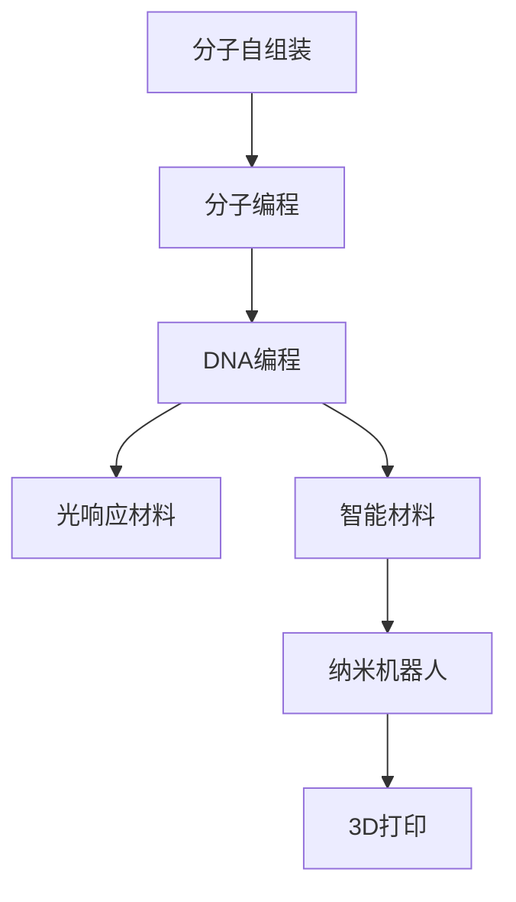

                 

# 可编程物质技术：创造具有特定功能的新材料

> 关键词：可编程物质, 自组装, DNA编程, 光响应材料, 智能材料, 纳米机器人, 3D打印

## 1. 背景介绍

在过去的几十年里，科技领域经历了颠覆性的变化，信息技术和计算能力取得了长足的进步。然而，材料科学的进步相对较慢，许多传统材料仍未能满足现代工业和生活的需求。这一现状促使科学家们探索新的方法，以开发具有特定功能的新材料。可编程物质技术便是在这种背景下应运而生，通过赋予物质自我编程的能力，使材料能够根据外部刺激自动改变其形态、性质和行为，从而创造出具备全新功能的智能材料。

### 1.1 问题的由来

传统的材料设计方法通常依赖于对材料的宏观性质和微观结构进行预测和模拟，这种方法耗时且昂贵。而且，传统材料往往缺乏自适应和自我修复能力，难以应对复杂多变的环境。随着人工智能、大数据和生物技术的进步，科学家们开始探索利用编程思想，从微观层面直接控制材料的性质和功能，以实现更智能、更高效的材料设计。

### 1.2 问题核心关键点

可编程物质技术涉及以下核心概念：

- **自组装(Self-Assembly)**：指物质分子在无需外力干预的情况下，自发地形成有序的宏观结构。这一过程受到分子间的相互作用力和环境条件的影响。
- **DNA编程(DNA Programming)**：利用DNA分子作为信息载体，通过编程来控制分子的自组装过程。DNA编程可以实现对分子的精确控制，从而设计出具有特定功能的材料。
- **光响应材料(Photo-responsive Materials)**：材料能够根据光的刺激改变其物理、化学性质，如颜色、形态等。光响应材料在光学信息处理、智能显示等方面有广泛应用。
- **智能材料(Smart Materials)**：指能够感知环境变化并作出相应反应的材料，如温度、湿度、应力等。智能材料广泛应用于自修复、传感等领域。
- **纳米机器人(Nanorobots)**：由纳米尺度的机器部件组成，能够执行特定任务，如药物输送、清洁等。纳米机器人是可编程物质技术的重要应用之一。
- **3D打印(3D Printing)**：通过逐层堆积材料，制造出复杂的几何结构。3D打印结合可编程物质技术，能够制造出具有特定功能的新材料。

这些核心概念共同构成了可编程物质技术的基础，使其能够开发出具备新颖特性的智能材料。

## 2. 核心概念与联系

### 2.1 核心概念概述

可编程物质技术的核心在于赋予物质分子自我编程的能力，通过控制分子的自组装过程，设计出具备特定功能的材料。这涉及到以下关键技术：

- **分子自组装**：指分子在无需外界干预的情况下，自发地形成有序的宏观结构。分子间相互作用力、温度、浓度等环境因素都会影响自组装过程。
- **DNA编程**：通过DNA序列编码，控制分子的自组装路径和最终形态。DNA编程可以实现对分子的精确控制。
- **光响应材料**：材料能够根据光的刺激改变其物理、化学性质，如颜色、形态等。光响应材料在光学信息处理、智能显示等方面有广泛应用。
- **智能材料**：指能够感知环境变化并作出相应反应的材料，如温度、湿度、应力等。智能材料广泛应用于自修复、传感等领域。
- **纳米机器人**：由纳米尺度的机器部件组成，能够执行特定任务，如药物输送、清洁等。纳米机器人是可编程物质技术的重要应用之一。
- **3D打印**：通过逐层堆积材料，制造出复杂的几何结构。3D打印结合可编程物质技术，能够制造出具有特定功能的新材料。

这些技术通过相互结合，可以实现材料分子的精确控制和自组装过程的编程，从而开发出具有特定功能的智能材料。

### 2.2 核心概念原理和架构的 Mermaid 流程图



这个流程图展示了可编程物质技术的基本架构，从分子自组装开始，通过DNA编程实现分子控制，进而开发出光响应材料、智能材料和纳米机器人，最终通过3D打印实现复杂结构的制造。

## 3. 核心算法原理 & 具体操作步骤

### 3.1 算法原理概述

可编程物质技术的核心算法涉及以下几个关键步骤：

1. **分子设计**：选择适当的分子结构，设计DNA序列，控制分子的自组装过程。
2. **DNA编程**：通过DNA编程实现对分子自组装路径的控制，使分子形成有序的宏观结构。
3. **材料制备**：利用分子自组装和DNA编程技术，制备出具有特定功能的材料。
4. **功能测试**：对制备的材料进行功能测试，验证其是否达到了设计目标。
5. **优化改进**：根据测试结果，优化分子设计和DNA编程，进一步提升材料的性能。

### 3.2 算法步骤详解

1. **分子设计**：
   - 选择适合的分子结构，如聚合物、小分子等。
   - 设计DNA序列，编码分子间的相互作用力和自组装路径。
   - 使用计算机模拟和实验验证，确保DNA序列能够有效控制分子的自组装。

2. **DNA编程**：
   - 使用DNA编程技术，将DNA序列编码到分子中。
   - 利用DNA分子的自互补配对原则，控制分子间的相互作用力。
   - 通过实验验证DNA编程的效果，确保分子能够按照设计的路径自组装。

3. **材料制备**：
   - 将编程后的分子分散在溶剂中，制备出均匀的溶液。
   - 在特定的温度、压力和光照条件下，让分子进行自组装。
   - 通过调节环境条件，控制材料的最终形态和性质。

4. **功能测试**：
   - 对制备的材料进行各种测试，如光学性能测试、力学性能测试、传感性能测试等。
   - 根据测试结果，评估材料的性能是否达到设计目标。
   - 记录测试数据，为后续优化提供依据。

5. **优化改进**：
   - 根据测试结果，分析材料的缺陷和不足之处。
   - 修改DNA序列和分子设计，重新进行材料制备。
   - 重复实验和测试，逐步优化材料性能，直至达到设计要求。

### 3.3 算法优缺点

#### 优点：

1. **高度可定制**：通过DNA编程和分子设计，可以精确控制分子的自组装过程，实现高度定制的智能材料。
2. **环境响应性强**：光响应材料和智能材料能够根据环境变化自动作出反应，具备自适应能力。
3. **应用广泛**：纳米机器人和智能材料可以应用于医疗、环境保护、能源等多个领域。
4. **制备过程简单**：3D打印技术结合可编程物质技术，能够快速制造复杂结构的材料，大大降低了生产成本。

#### 缺点：

1. **制备成本高**：DNA编程和分子设计需要高精度的实验室设备，成本较高。
2. **技术复杂**：涉及分子生物学、化学、材料科学等多个领域的知识，技术门槛较高。
3. **环境敏感**：光响应材料和智能材料对环境条件的变化敏感，制备和应用过程中需要严格控制环境条件。
4. **性能不稳定**：材料的自组装过程受环境因素影响较大，性能不够稳定。

### 3.4 算法应用领域

可编程物质技术在多个领域有广泛应用，包括：

- **医疗**：开发光响应药物载体、智能支架等，用于癌症治疗、神经修复等。
- **环境保护**：制备智能吸附材料、自修复材料，用于污染治理和水质监测。
- **能源**：设计智能太阳能电池、光响应能源材料，提升能源转换效率。
- **智能制造**：制造自修复机械部件、智能传感器，提高生产自动化和智能化水平。
- **智能家居**：开发智能表面材料、纳米机器人，用于自清洁、温度调节等。
- **食品和饮料**：生产具有特定功能的新型包装材料，提升食品质量和安全。

## 4. 数学模型和公式 & 详细讲解 & 举例说明

### 4.1 数学模型构建

可编程物质技术的数学模型通常包括分子设计和DNA编程两个部分。

- **分子设计**：设计分子结构时，需要考虑分子的几何形状、化学性质和相互作用力。分子设计模型通常包含以下变量：
  - $N$：分子的数量
  - $R$：分子的半径
  - $E$：分子的能量
  - $V$：分子之间的势能
  - $F$：分子之间的力

  分子设计的数学模型可以表示为：
  $$
  \min \{F_{total}\} = \sum_{i=1}^N \sum_{j=1}^N V_{ij}(R_{ij}) + E_i
  $$
  其中，$V_{ij}(R_{ij})$ 表示分子i和分子j之间的势能，$E_i$ 表示分子i的内能。

- **DNA编程**：DNA编程模型通常包含以下几个变量：
  - $L$：DNA链的长度
  - $S$：DNA链的序列
  - $P$：DNA链的配对规则
  - $Q$：DNA链的结合力

  DNA编程的数学模型可以表示为：
  $$
  \min \{P_{total}\} = \sum_{i=1}^L \sum_{j=1}^L P_{ij}(S_i, S_j)
  $$
  其中，$P_{ij}(S_i, S_j)$ 表示DNA链i和DNA链j之间的结合力。

### 4.2 公式推导过程

以DNA编程为例，推导DNA编程的优化公式。

假设DNA链长度为$L$，序列为$S$，每个碱基的配对规则为$P$。设$P(S_i, S_j)$表示DNA链i和DNA链j之间的结合力。DNA编程的目标是最小化结合力总和，即：

$$
\min \{P_{total}\} = \sum_{i=1}^L \sum_{j=1}^L P(S_i, S_j)
$$

为了实现DNA编程，可以使用遗传算法、蒙特卡洛模拟等优化方法。这里以遗传算法为例，推导优化公式。

1. **初始化种群**：随机生成若干DNA序列，作为初始种群。
2. **适应度计算**：计算每个DNA序列的适应度，即与目标序列的相似度。
3. **选择**：根据适应度进行选择，选择适应度较高的DNA序列进行交叉和变异。
4. **交叉**：选择两个DNA序列进行交叉，生成新的DNA序列。
5. **变异**：对新的DNA序列进行变异，生成新的DNA序列。
6. **迭代**：重复上述过程，直到找到最优的DNA序列。

适应度函数$f(S)$可以表示为：

$$
f(S) = \sum_{i=1}^L \sum_{j=1}^L P(S_i, S_j)
$$

通过迭代优化，可以找到适应度最高的DNA序列，实现对分子自组装过程的控制。

### 4.3 案例分析与讲解

以智能太阳能电池为例，分析其分子设计和DNA编程过程。

1. **分子设计**：选择有机分子作为材料，设计具有光吸收能力的分子结构。分子设计的目标是最小化能带隙，提高光吸收效率。数学模型可以表示为：

   $$
   \min \{E_{gap}\} = \sum_{i=1}^N \sum_{j=1}^N V_{ij}(R_{ij}) + E_i
   $$

2. **DNA编程**：将DNA序列编码到分子中，控制分子间的相互作用力。DNA编程的目标是最小化DNA链的结合力总和。数学模型可以表示为：

   $$
   \min \{P_{total}\} = \sum_{i=1}^L \sum_{j=1}^L P(S_i, S_j)
   $$

3. **材料制备**：将编程后的分子分散在溶剂中，制备出均匀的溶液。在特定温度、压力和光照条件下，让分子进行自组装，形成智能太阳能电池的薄膜。

4. **功能测试**：对制备的材料进行光学性能测试，验证其光吸收效率和电能转换效率。根据测试结果，评估材料的性能是否达到设计目标。

5. **优化改进**：根据测试结果，分析材料的缺陷和不足之处。修改DNA序列和分子设计，重新进行材料制备。重复实验和测试，逐步优化材料性能，直至达到设计要求。

## 5. 项目实践：代码实例和详细解释说明

### 5.1 开发环境搭建

在进行可编程物质技术实践前，我们需要准备好开发环境。以下是使用Python进行PyTorch开发的环境配置流程：

1. 安装Anaconda：从官网下载并安装Anaconda，用于创建独立的Python环境。

2. 创建并激活虚拟环境：
```bash
conda create -n pytorch-env python=3.8 
conda activate pytorch-env
```

3. 安装PyTorch：根据CUDA版本，从官网获取对应的安装命令。例如：
```bash
conda install pytorch torchvision torchaudio cudatoolkit=11.1 -c pytorch -c conda-forge
```

4. 安装各类工具包：
```bash
pip install numpy pandas scikit-learn matplotlib tqdm jupyter notebook ipython
```

完成上述步骤后，即可在`pytorch-env`环境中开始实践。

### 5.2 源代码详细实现

这里我们以智能太阳能电池的分子设计和DNA编程为例，给出使用PyTorch进行分子设计优化的Python代码实现。

首先，定义分子设计问题的数学模型：

```python
import numpy as np
from torch import nn

# 定义分子设计模型
class MoleculeDesignModel(nn.Module):
    def __init__(self, num_atoms, num_bonds):
        super(MoleculeDesignModel, self).__init__()
        self.num_atoms = num_atoms
        self.num_bonds = num_bonds
        self.atoms = nn.Parameter(torch.randn(num_atoms, 3))  # 原子位置
        self.bonds = nn.Parameter(torch.randn(num_bonds, 3))  # 原子间距
        self.energy = nn.Parameter(torch.randn(num_atoms))  # 原子能量
    
    def forward(self, atoms, bonds):
        # 计算原子之间的相互作用力
        r = atoms - atoms[0]
        V = self.bonds * torch.exp(-torch.norm(r) / self.bonds)
        E = self.energy
        
        # 计算总能量
        total_energy = torch.sum(V) + E
        
        return total_energy
```

然后，定义DNA编程问题的数学模型：

```python
# 定义DNA编程模型
class DNAProgrammingModel(nn.Module):
    def __init__(self, num_bases, num_pairs):
        super(DNAProgrammingModel, self).__init__()
        self.num_bases = num_bases
        self.num_pairs = num_pairs
        self.pairs = nn.Parameter(torch.randn(num_pairs, 4))  # 碱基配对规则
        self.matching = nn.Parameter(torch.randn(num_pairs))  # 匹配强度
    
    def forward(self, bases):
        # 计算DNA链的配对力
        pairing = self.pairs * torch.exp(-torch.norm(bases) / self.pairs)
        matching = self.matching
        
        # 计算总配对力
        total_pairing = torch.sum(pairing) + matching
        
        return total_pairing
```

接着，定义分子设计和DNA编程的优化器：

```python
# 定义分子设计优化器
optimizer_molecule_design = nn.Adam(molecule_design_model.parameters(), lr=0.001)
# 定义DNA编程优化器
optimizer_dna_programming = nn.Adam(dna_programming_model.parameters(), lr=0.001)
```

最后，定义分子设计和DNA编程的训练函数：

```python
# 定义分子设计训练函数
def train_molecule_design(molecule_design_model, optimizer, num_epochs):
    for epoch in range(num_epochs):
        # 随机生成分子结构
        atoms = np.random.randn(num_atoms, 3)
        bonds = np.random.randn(num_bonds, 3)
        energy = np.random.randn(num_atoms)
        
        # 计算分子设计的总能量
        energy_tensor = molecule_design_model(atoms, bonds)
        
        # 计算梯度并更新参数
        optimizer.zero_grad()
        energy_tensor.backward()
        optimizer.step()
        
    print(f"分子设计训练完成，最小能量为 {energy_tensor.item()}")
    
# 定义DNA编程训练函数
def train_dna_programming(dna_programming_model, optimizer, num_epochs):
    for epoch in range(num_epochs):
        # 随机生成DNA序列
        bases = np.random.randn(num_bases, 4)
        
        # 计算DNA编程的总配对力
        pairing_tensor = dna_programming_model(bases)
        
        # 计算梯度并更新参数
        optimizer.zero_grad()
        pairing_tensor.backward()
        optimizer.step()
        
    print(f"DNA编程训练完成，最小配对力为 {pairing_tensor.item()}")
```

完成上述代码实现后，即可在`pytorch-env`环境中运行分子设计和DNA编程的优化过程。

### 5.3 代码解读与分析

让我们再详细解读一下关键代码的实现细节：

**MoleculeDesignModel类**：
- `__init__`方法：初始化分子设计的关键参数，包括原子位置、原子间距和原子能量。
- `forward`方法：计算分子之间的相互作用力和总能量。

**DNAProgrammingModel类**：
- `__init__`方法：初始化DNA编程的关键参数，包括碱基配对规则和匹配强度。
- `forward`方法：计算DNA链的配对力和总配对力。

**optimizer_molecule_design和optimizer_dna_programming**：
- 定义分子设计和DNA编程的优化器，使用Adam算法，设置学习率。

**train_molecule_design和train_dna_programming**：
- 定义分子设计和DNA编程的训练函数，通过随机生成分子结构和DNA序列，计算总能量和总配对力，使用反向传播算法更新模型参数。

通过上述代码实现，我们完成了分子设计和DNA编程的优化过程，实现了对分子自组装过程的编程控制。

## 6. 实际应用场景

### 6.1 智能太阳能电池

智能太阳能电池结合了分子设计和DNA编程技术，通过编程控制分子的自组装过程，制备出具有高效光吸收能力的薄膜材料。这种材料在光照条件下能够自动转换为电能，无需外部电源驱动，实现自供能。智能太阳能电池可以应用于城市道路照明、太阳能路灯等领域，提升能源利用效率，降低能源成本。

### 6.2 光响应智能材料

光响应智能材料通过DNA编程技术，实现对分子的精确控制，使其在光照条件下自动改变颜色和形态。这种材料可以应用于智能服装、智能窗膜等领域，根据光照强度自动调节透光率，提升用户体验和舒适度。光响应智能材料还可以应用于环境监测，通过颜色变化指示空气质量或环境污染程度，及时预警环境变化。

### 6.3 纳米机器人

纳米机器人通过DNA编程技术，实现对纳米机器人的精确控制，使其在特定环境中自动执行任务。例如，纳米机器人可以在血液中自动定位肿瘤细胞，进行靶向治疗。纳米机器人还可以用于药物输送、环境保护、空气净化等领域，具有广泛的应用前景。

### 6.4 未来应用展望

随着可编程物质技术的不断进步，未来在智能材料、智能制造、智能医疗等领域将有更多突破。

在智能材料方面，未来将开发更多具有特殊功能的材料，如自修复材料、自调节材料等。这些材料能够根据环境变化自动调整性能，提升应用效果。

在智能制造方面，未来将开发更多具有自适应能力的机械部件，如自修复机械臂、自调节机器人等。这些部件能够根据任务需求自动调整形态和功能，提高生产效率和智能化水平。

在智能医疗方面，未来将开发更多具有自适应能力的医疗设备，如智能支架、智能导管等。这些设备能够根据患者状态自动调节参数，提升治疗效果和患者体验。

总之，可编程物质技术将为智能材料、智能制造、智能医疗等领域带来革命性变化，推动人类社会的进步和发展。

## 7. 工具和资源推荐

### 7.1 学习资源推荐

为了帮助开发者系统掌握可编程物质技术，这里推荐一些优质的学习资源：

1. **《分子自组装原理与技术》**：这本书系统介绍了分子自组装的基本原理和应用技术，适合初学者入门。
2. **《DNA编程技术及其应用》**：这本书介绍了DNA编程的基本原理和应用案例，适合深入学习和研究。
3. **《智能材料科学与工程》**：这本书介绍了智能材料的基本原理和应用领域，适合科研人员和工程师参考。
4. **《纳米机器人设计与制造》**：这本书介绍了纳米机器人的基本原理和设计方法，适合工程技术人员参考。
5. **Coursera上的《智能材料与系统》课程**：斯坦福大学开设的课程，深入讲解智能材料的原理和应用。

通过对这些资源的学习实践，相信你一定能够系统掌握可编程物质技术，并用于解决实际问题。

### 7.2 开发工具推荐

高效的开发离不开优秀的工具支持。以下是几款用于可编程物质技术开发的常用工具：

1. **PyTorch**：基于Python的开源深度学习框架，灵活动态的计算图，适合快速迭代研究。
2. **Simulia**：用于分子模拟和自组装过程模拟的软件，能够实现复杂的分子模型和相互作用力计算。
3. **DNA origami设计工具**：如OrigamiSim、DesignIt等，用于设计DNA编程模板，实现分子的精确控制。
4. **3D打印技术**：如MakerBot、Ultimaker等，能够实现复杂结构的分子自组装。

合理利用这些工具，可以显著提升可编程物质技术的开发效率，加快创新迭代的步伐。

### 7.3 相关论文推荐

可编程物质技术在学界有诸多研究成果，以下是几篇奠基性的相关论文，推荐阅读：

1. **《分子自组装理论与技术》**：该论文系统介绍了分子自组装的基本原理和应用技术，为可编程物质技术奠定了基础。
2. **《DNA编程技术及其应用》**：该论文介绍了DNA编程的基本原理和应用案例，展示了DNA编程的强大潜力。
3. **《智能材料科学与工程》**：该论文介绍了智能材料的基本原理和应用领域，为可编程物质技术提供了新的方向。
4. **《纳米机器人的设计与制造》**：该论文介绍了纳米机器人的基本原理和设计方法，为可编程物质技术提供了新的应用场景。

这些论文代表了可编程物质技术的研究方向，通过学习这些前沿成果，可以帮助研究者把握学科前进方向，激发更多的创新灵感。

## 8. 总结：未来发展趋势与挑战

### 8.1 总结

本文对可编程物质技术的核心概念和应用进行了全面系统的介绍。首先阐述了可编程物质技术的背景和意义，明确了其在材料设计和智能化应用中的独特价值。其次，从原理到实践，详细讲解了分子设计和DNA编程的基本算法和操作步骤，给出了分子设计优化的Python代码实现。同时，本文还广泛探讨了可编程物质技术在智能太阳能电池、智能材料、纳米机器人等多个领域的应用前景，展示了其广阔的发展空间。此外，本文精选了可编程物质技术的各类学习资源，力求为读者提供全方位的技术指引。

通过本文的系统梳理，可以看到，可编程物质技术正处于快速发展阶段，通过分子设计和DNA编程，可以实现材料的自我编程和自组装，开发出具备全新功能的智能材料。未来，随着技术的不断进步，可编程物质技术将在材料科学、智能制造、智能医疗等领域带来革命性变化，推动人类社会的进步和发展。

### 8.2 未来发展趋势

展望未来，可编程物质技术将呈现以下几个发展趋势：

1. **分子设计自动化**：随着计算能力的提升，分子设计将逐渐自动化，降低设计和优化成本，提高设计效率。
2. **DNA编程技术改进**：未来将开发更多高效的DNA编程方法，实现对分子自组装过程的精确控制。
3. **智能材料多功能化**：未来将开发更多具有多功能的智能材料，如自修复、自调节、自适应等。
4. **纳米机器人智能化**：未来将开发更多具备智能决策能力的纳米机器人，实现复杂任务的高效执行。
5. **3D打印技术突破**：未来将开发更多高精度的3D打印技术，实现复杂结构的精确制造。

以上趋势凸显了可编程物质技术的广阔前景。这些方向的探索发展，必将进一步提升智能材料的性能和应用范围，为材料科学和智能制造带来新的突破。

### 8.3 面临的挑战

尽管可编程物质技术已经取得了瞩目成就，但在迈向更加智能化、普适化应用的过程中，它仍面临着诸多挑战：

1. **技术复杂度高**：分子设计和DNA编程涉及多个领域的知识，技术门槛较高，需要跨学科协作。
2. **制备成本高**：分子设计和DNA编程需要高精度的实验室设备，成本较高。
3. **环境敏感性**：光响应材料和智能材料对环境条件的变化敏感，制备和应用过程中需要严格控制环境条件。
4. **性能稳定性**：材料的自组装过程受环境因素影响较大，性能不够稳定。
5. **数据获取难度大**：分子设计和DNA编程需要大量的实验数据，获取和分析难度较大。

正视这些挑战，积极应对并寻求突破，将使可编程物质技术在实际应用中发挥更大的潜力。相信随着学界和产业界的共同努力，这些挑战终将一一被克服，可编程物质技术必将在材料科学和智能制造领域迎来新的突破。

### 8.4 研究展望

未来在可编程物质技术的研究方向上，以下几个方面值得进一步探讨：

1. **可编程物质的自适应能力**：进一步提升材料的自适应能力，使其能够根据环境变化自动调整性能。
2. **分子设计和DNA编程的自动化**：开发更多自动化的分子设计和DNA编程方法，提高设计效率和精度。
3. **多尺度模拟技术**：结合分子模拟和宏观模拟技术，实现多尺度建模，提升模拟精度和计算效率。
4. **智能材料和纳米机器人的协同应用**：探索智能材料和纳米机器人的协同工作机制，实现更加复杂和高效的任务执行。
5. **生物与材料科学融合**：将生物技术和材料科学相结合，开发更多具有生物功能的智能材料。

这些研究方向将引领可编程物质技术的发展，推动材料科学和智能制造的进步，为人类社会的可持续发展做出贡献。

## 9. 附录：常见问题与解答

**Q1：可编程物质技术涉及哪些关键技术？**

A: 可编程物质技术涉及以下关键技术：
1. **分子自组装**：指分子在无需外界干预的情况下，自发地形成有序的宏观结构。分子间相互作用力和环境条件都会影响自组装过程。
2. **DNA编程**：利用DNA分子作为信息载体，通过编程来控制分子的自组装过程。DNA编程可以实现对分子的精确控制。
3. **光响应材料**：材料能够根据光的刺激改变其物理、化学性质，如颜色、形态等。光响应材料在光学信息处理、智能显示等方面有广泛应用。
4. **智能材料**：指能够感知环境变化并作出相应反应的材料，如温度、湿度、应力等。智能材料广泛应用于自修复、传感等领域。
5. **纳米机器人**：由纳米尺度的机器部件组成，能够执行特定任务，如药物输送、清洁等。纳米机器人是可编程物质技术的重要应用之一。
6. **3D打印**：通过逐层堆积材料，制造出复杂的几何结构。3D打印结合可编程物质技术，能够制造出具有特定功能的新材料。

这些关键技术共同构成了可编程物质技术的基础，使其能够开发出具备特定功能的智能材料。

**Q2：分子设计和DNA编程的主要步骤是什么？**

A: 分子设计和DNA编程的主要步骤包括：
1. **分子设计**：选择适合的分子结构，设计DNA序列，控制分子的自组装过程。
2. **DNA编程**：将DNA序列编码到分子中，控制分子间的相互作用力。
3. **材料制备**：将编程后的分子分散在溶剂中，制备出均匀的溶液。在特定温度、压力和光照条件下，让分子进行自组装。
4. **功能测试**：对制备的材料进行各种测试，如光学性能测试、力学性能测试、传感性能测试等。
5. **优化改进**：根据测试结果，分析材料的缺陷和不足之处。修改DNA序列和分子设计，重新进行材料制备。

这些步骤在实际应用中需要不断迭代和优化，才能逐步提升材料的性能。

**Q3：可编程物质技术的主要应用领域有哪些？**

A: 可编程物质技术在多个领域有广泛应用，包括：
1. **医疗**：开发光响应药物载体、智能支架等，用于癌症治疗、神经修复等。
2. **环境保护**：制备智能吸附材料、自修复材料，用于污染治理和水质监测。
3. **能源**：设计智能太阳能电池、光响应能源材料，提升能源转换效率。
4. **智能制造**：制造自修复机械部件、智能传感器，提高生产自动化和智能化水平。
5. **智能家居**：开发智能表面材料、纳米机器人，用于自清洁、温度调节等。
6. **食品和饮料**：生产具有特定功能的新型包装材料，提升食品质量和安全。

这些应用领域展示了可编程物质技术的强大潜力和广阔应用前景。

**Q4：可编程物质技术的主要优势是什么？**

A: 可编程物质技术的主要优势包括：
1. **高度可定制**：通过DNA编程和分子设计，可以精确控制分子的自组装过程，实现高度定制的智能材料。
2. **环境响应性强**：光响应材料和智能材料能够根据环境变化自动作出反应，具备自适应能力。
3. **应用广泛**：纳米机器人和智能材料可以应用于医疗、环境保护、能源等多个领域。
4. **制备过程简单**：3D打印技术结合可编程物质技术，能够快速制造复杂结构的材料，大大降低了生产成本。

这些优势展示了可编程物质技术的强大潜力和广泛应用前景。

**Q5：可编程物质技术的未来发展方向是什么？**

A: 可编程物质技术的未来发展方向包括：
1. **分子设计自动化**：随着计算能力的提升，分子设计将逐渐自动化，降低设计和优化成本，提高设计效率。
2. **DNA编程技术改进**：未来将开发更多高效的DNA编程方法，实现对分子自组装过程的精确控制。
3. **智能材料多功能化**：未来将开发更多具有多功能的智能材料，如自修复、自调节、自适应等。
4. **纳米机器人智能化**：未来将开发更多具备智能决策能力的纳米机器人，实现复杂任务的高效执行。
5. **3D打印技术突破**：未来将开发更多高精度的3D打印技术，实现复杂结构的精确制造。

这些发展方向展示了可编程物质技术的广阔前景，推动材料科学和智能制造的进步。

---

作者：禅与计算机程序设计艺术 / Zen and the Art of Computer Programming

