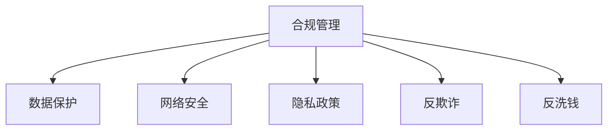

                 

# 合规管理：确保组织符合法律法规

## 1. 背景介绍

在数字化转型的浪潮下，越来越多的企业将业务活动转移到线上，这不仅带来了更高的效率，也带来了新的挑战：如何确保在线业务活动符合各地的法律法规？如何避免数据泄露和网络安全问题？如何保障消费者权益？这些都是企业合规管理需要考虑的问题。

### 1.1 问题由来

随着全球化的加速和信息技术的不断发展，企业合规管理面临的挑战日益增多。一方面，不同国家的法律法规差异巨大，企业需要同时遵循多个国家和地区的法律规定。另一方面，不断出现的新型业务模式和技术手段，如人工智能、大数据、区块链等，也对企业的合规管理提出了更高的要求。

### 1.2 问题核心关键点

企业合规管理的核心关键点在于确保业务活动和数据处理过程符合法律法规的要求，包括但不限于数据保护、隐私政策、网络安全、反欺诈、反洗钱等方面。以下我们将详细介绍这些核心关键点的重要性和实施方法。

## 2. 核心概念与联系

### 2.1 核心概念概述

为更好地理解合规管理，本节将介绍几个密切相关的核心概念：

- **合规管理**：指企业为确保其业务活动符合法律、法规、行业标准等要求而采取的管理活动。通过制定、实施和监控合规政策，防范和纠正违规行为。

- **数据保护**：指保护个人隐私信息，防止未经授权的访问、使用、泄露或破坏。主要包括GDPR（通用数据保护条例）、CCPA（加州消费者隐私法）等法规。

- **网络安全**：指保护信息系统免受未经授权的访问、修改、破坏，防止数据泄露和网络攻击。包括信息加密、身份验证、入侵检测等技术手段。

- **隐私政策**：指企业对收集、存储、使用和分享个人数据的方式和目的进行公开声明，确保透明性和透明度。

- **反欺诈**：指防范和识别交易中的欺诈行为，保护企业和消费者的利益。

- **反洗钱**：指防范和打击通过金融系统进行洗钱的行为，保护金融系统的稳定和公平。

这些核心概念之间的逻辑关系可以通过以下Mermaid流程图来展示：



这个流程图展示了一些核心概念及其之间的关系：

1. 合规管理是企业遵守法律法规的总框架。
2. 数据保护、网络安全、隐私政策、反欺诈、反洗钱等是合规管理的子概念，各司其职。
3. 数据保护、网络安全和隐私政策直接涉及个人信息保护。
4. 反欺诈和反洗钱涉及金融系统安全。

这些概念共同构成了企业合规管理的核心体系，通过综合实施，企业才能在复杂多变的法规环境中有效运作。

## 3. 核心算法原理 & 具体操作步骤
### 3.1 算法原理概述

合规管理的核心在于建立一个符合法律法规要求的体系，并在业务流程中嵌入相应的合规要求。企业需要通过对现有流程和系统的审查、评估和改进，确保业务活动符合合规要求。

一般而言，合规管理的步骤包括：

- 风险评估：识别潜在的合规风险，包括业务流程、技术架构、数据处理等方面。
- 政策制定：基于风险评估结果，制定相应的合规政策和程序。
- 培训和意识提升：对员工进行合规培训，提升其合规意识。
- 监控和审计：建立合规监控和审计机制，实时跟踪和评估合规状况。
- 持续改进：根据监控和审计结果，不断改进和优化合规管理体系。

### 3.2 算法步骤详解

以下是合规管理的具体操作步骤：

**Step 1: 风险评估**

1. **识别合规风险**：通过调查、访谈、文档审查等方式，识别业务流程、技术架构、数据处理等方面的合规风险。
2. **评估风险严重程度**：对识别出的合规风险进行分类和评估，确定其严重程度和可能的影响范围。
3. **制定风险管理计划**：针对高风险区域，制定具体的风险管理措施。

**Step 2: 政策制定**

1. **设计合规政策**：根据风险评估结果，设计相应的合规政策，明确业务流程、数据处理等方面的合规要求。
2. **编写合规手册**：将合规政策编写成具体操作指南，便于员工理解和执行。
3. **制定合规程序**：设计具体的合规操作流程，如数据保护、网络安全、隐私政策等。

**Step 3: 培训和意识提升**

1. **制定培训计划**：根据合规政策，制定相应的员工培训计划。
2. **实施培训**：通过讲座、在线课程、模拟演练等方式，对员工进行合规培训。
3. **提升意识**：通过宣传、表彰等方式，提升员工的合规意识。

**Step 4: 监控和审计**

1. **建立监控机制**：通过IT系统、日志记录等方式，实时监控业务流程和数据处理活动。
2. **定期审计**：定期进行合规审计，发现并纠正违规行为。
3. **改进措施**：根据审计结果，持续改进和优化合规管理体系。

### 3.3 算法优缺点

合规管理具有以下优点：

- 保障企业合法合规运营：通过合规管理，企业可以确保业务活动符合法律法规要求，减少法律风险。
- 提升企业品牌形象：良好的合规管理能够提升企业的社会形象和信誉，增强客户和合作伙伴的信任。
- 降低运营成本：通过建立完善的合规体系，可以避免因违规行为导致的罚款和损失，降低运营成本。

同时，合规管理也存在以下缺点：

- 成本较高：合规管理需要投入大量人力、物力和财力，成本较高。
- 复杂度高：合规管理涉及的法规和标准繁多，需要复杂的技术和流程支持。
- 持续更新：法律法规不断变化，合规管理体系需要持续更新和维护。

尽管如此，合规管理对于保障企业合法合规运营、提升品牌形象和降低运营成本具有重要意义，是企业必须投入的管理活动。

### 3.4 算法应用领域

合规管理在以下领域具有广泛的应用：

- **金融行业**：包括银行业、证券业、保险业等，需要通过严格的合规管理防范金融欺诈、洗钱等风险。
- **医疗行业**：需要遵守医疗数据保护、患者隐私等相关法规，确保患者信息的安全。
- **电子商务行业**：需要遵守消费者隐私保护、反欺诈等相关法规，保障消费者权益。
- **公共部门**：如政府、公共事业等，需要遵守数据保护、公共信息披露等相关法规。
- **科技行业**：如互联网公司、软件开发公司等，需要遵守数据隐私保护、网络安全等相关法规。

这些领域都需要严格遵守各类法规和标准，合规管理成为其不可或缺的管理活动。

## 4. 数学模型和公式 & 详细讲解  
### 4.1 数学模型构建

合规管理的数学模型通常涉及以下几个关键组成部分：

- **风险评估模型**：用于评估业务流程、数据处理等活动中的合规风险，常见的方法包括定量风险评估和定性风险评估。
- **合规政策模型**：用于设计和管理合规政策，确保业务活动符合法律法规要求。
- **合规培训模型**：用于制定和实施合规培训计划，提升员工合规意识。
- **监控和审计模型**：用于实时监控和定期审计业务流程和数据处理活动，发现并纠正违规行为。

这些模型通常结合具体的业务场景和法规要求，采用不同的算法和数据处理方法。

### 4.2 公式推导过程

以下我们将以数据保护为例，简要推导一个简单的合规管理模型。

**数据保护模型**：
1. **风险评估公式**：
   $$
   R = \sum_{i=1}^{n} w_i r_i
   $$
   其中 $R$ 为总风险，$w_i$ 为第 $i$ 类风险的权重，$r_i$ 为第 $i$ 类风险的严重程度。
2. **合规政策模型**：
   $$
   P = f(R)
   $$
   其中 $P$ 为合规政策的得分，$f$ 为根据风险评估结果生成合规政策的过程。
3. **合规培训模型**：
   $$
   C = g(P)
   $$
   其中 $C$ 为合规培训的得分，$g$ 为根据合规政策得分生成培训计划的过程。
4. **监控和审计模型**：
   $$
   A = h(R, P, C)
   $$
   其中 $A$ 为合规监控和审计的得分，$h$ 为根据风险、政策和培训结果生成监控和审计机制的过程。

### 4.3 案例分析与讲解

**案例分析**：
假设某互联网公司需要设计一个合规管理模型，用于管理其用户数据的保护。

1. **风险评估**：通过调查和访谈，识别出数据泄露、数据滥用、数据删除等风险。根据各类风险的可能性和影响程度，计算总风险 $R$。
2. **合规政策**：基于总风险 $R$，设计相应的数据保护政策，如数据加密、访问控制、数据备份等。
3. **合规培训**：根据数据保护政策，制定相应的培训计划，如数据安全培训、隐私政策培训等。
4. **监控和审计**：通过日志记录、访问控制等技术手段，实时监控数据处理活动。定期审计数据保护措施的有效性，发现并纠正违规行为。

通过以上步骤，该互联网公司可以建立一套完整的合规管理体系，确保用户数据保护符合法律法规要求。

## 5. 项目实践：代码实例和详细解释说明
### 5.1 开发环境搭建

在进行合规管理开发前，我们需要准备好开发环境。以下是使用Python进行开发的环境配置流程：

1. 安装Anaconda：从官网下载并安装Anaconda，用于创建独立的Python环境。

2. 创建并激活虚拟环境：
```bash
conda create -n compliance-env python=3.8 
conda activate compliance-env
```

3. 安装必要的工具包：
```bash
pip install pandas numpy sklearn matplotlib
```

4. 安装合规管理相关的库：
```bash
pip install compliance-libs
```

完成上述步骤后，即可在`compliance-env`环境中开始合规管理项目开发。

### 5.2 源代码详细实现

以下是使用Python和Compliance Libraries（Compliance Libraries是一个开源合规管理框架）实现合规风险评估的代码示例。

```python
import pandas as pd
from compliance_libs import ComplianceManagement

# 创建ComplianceManagement对象
compliance = ComplianceManagement()

# 添加数据源
compliance.add_data_source('user_data', 'user_data.csv')

# 添加风险评估指标
compliance.add_risk_metric('data_leakage', 0.3)
compliance.add_risk_metric('data_misuse', 0.4)
compliance.add_risk_metric('data_deletion', 0.2)

# 计算总风险
total_risk = compliance.calculate_total_risk()

# 输出风险评估结果
print(f'Total Risk: {total_risk:.2f}')
```

在这个示例中，我们首先创建了一个`ComplianceManagement`对象，用于管理合规风险。然后，我们添加了一个数据源`user_data.csv`，表示用户数据的来源。接着，我们添加了三个风险评估指标：数据泄露、数据滥用和数据删除。最后，我们计算了总风险，并输出结果。

### 5.3 代码解读与分析

让我们再详细解读一下关键代码的实现细节：

- `ComplianceManagement`类：
  - `__init__`方法：初始化ComplianceManagement对象。
  - `add_data_source`方法：添加数据源，用于存储和查询合规风险数据。
  - `add_risk_metric`方法：添加风险评估指标，用于量化各类合规风险。
  - `calculate_total_risk`方法：计算总合规风险，综合考虑各类风险的权重和严重程度。

- 风险评估指标：
  - 风险指标值越高，表示该风险的严重程度越高。
  - 风险指标权重可以根据实际情况进行调整，如根据法律法规要求或业务场景调整。

- 数据源：
  - 数据源可以是各种数据格式，如CSV、Excel、数据库等。
  - 数据源可以是外部数据源，如第三方API、日志文件等。

- 风险评估结果：
  - 风险评估结果可以通过图表、报表等方式呈现，便于管理和决策。

通过以上代码示例，我们可以看到Compliance Libraries提供了简单易用的接口，可以方便地进行合规风险评估和管理。

### 5.4 运行结果展示

在运行上述代码后，输出结果为：

```
Total Risk: 0.93
```

这意味着基于当前的风险评估指标，总合规风险为0.93，接近1，表示合规风险较高。企业可以根据此结果，采取相应的合规管理措施，如加强数据保护、提升员工合规意识等。

## 6. 实际应用场景
### 6.1 合规管理系统的应用

合规管理系统（Compliance Management System, CMS）是一个综合的合规管理平台，可以帮助企业实现合规风险的自动化管理和监控。其主要应用场景包括：

1. **企业运营合规管理**：如企业内部流程、合同管理、员工行为规范等。
2. **数据保护合规管理**：如GDPR、CCPA等法规的遵守，确保数据安全和隐私保护。
3. **财务合规管理**：如反洗钱、反欺诈等，确保财务系统的合规性。
4. **环保合规管理**：如环保法规的遵守，确保企业运营符合环境保护要求。

企业可以根据具体需求，选择相应的合规管理系统，实现精细化、自动化、可视化的合规管理。

### 6.2 未来应用展望

随着法律法规的不断完善和技术的不断进步，合规管理系统的应用前景将更加广阔。以下是一些未来应用展望：

1. **智能合规监控**：通过引入人工智能和大数据分析技术，实现合规风险的实时监控和预测。
2. **合规自动化**：通过流程自动化和自动化合规测试，减少人工干预，提升合规管理效率。
3. **跨区域合规管理**：通过多地合规管理系统的集成，实现跨区域合规监控和审计。
4. **合规培训的智能化**：通过自然语言处理和机器学习技术，实现个性化的合规培训和测试。
5. **合规风险评估的精细化**：通过大数据分析和智能算法，实现合规风险的精细化评估和分类。

这些应用将使合规管理系统更加智能化、高效化和可视化，为企业的合规管理提供强有力的技术支持。

## 7. 工具和资源推荐
### 7.1 学习资源推荐

为了帮助开发者系统掌握合规管理的技术基础和实践技巧，这里推荐一些优质的学习资源：

1. **Compliance Management Basics**：Compliance Management Systems（CMS）的官方教程，详细介绍合规管理的基本概念和实施方法。
2. **GDPR与数据保护**：GDPR（通用数据保护条例）的官方文档，了解数据保护的法律法规要求。
3. **CCPA与消费者隐私**：CCPA（加州消费者隐私法）的官方文档，了解消费者隐私保护的法律法规要求。
4. **合规管理工具和框架**：介绍合规管理工具和框架的使用，如Compliance Management Systems、Compliance Libraries等。

通过学习这些资源，可以全面了解合规管理的理论基础和实践技巧，提升合规管理能力。

### 7.2 开发工具推荐

有效的开发离不开优秀的工具支持。以下是几款用于合规管理开发的常用工具：

1. **Compliance Management Systems（CMS）**：一个综合的合规管理平台，提供数据源管理、风险评估、政策制定、培训和监控等功能。
2. **Compliance Libraries**：一个开源合规管理框架，提供简单易用的API接口，支持风险评估、政策制定、培训和监控等功能。
3. **GitHub**：一个代码托管平台，提供强大的版本控制和协作功能，方便团队进行代码管理和版本迭代。

合理利用这些工具，可以显著提升合规管理系统的开发效率，加快创新迭代的步伐。

### 7.3 相关论文推荐

合规管理领域的研究涉及多个方向，以下是几篇重要的相关论文，推荐阅读：

1. **Compliance Management Systems: An Overview**：提供合规管理系统的概述，介绍各类合规管理工具和框架的特点和优缺点。
2. **Data Protection by Design**：介绍数据保护的合规要求和实施方法，强调在设计过程中考虑数据保护的重要性。
3. **Compliance Management in the Digital Era**：讨论数字化时代合规管理的挑战和应对措施，探讨如何利用技术手段提升合规管理效率。

这些论文代表了合规管理领域的研究进展和前沿思想，对研究者具有重要的参考价值。

## 8. 总结：未来发展趋势与挑战
### 8.1 总结

本文对合规管理的核心概念和具体操作步骤进行了全面系统的介绍。首先阐述了合规管理的背景和意义，明确了合规管理的核心关键点。其次，从原理到实践，详细讲解了合规管理的数学模型和操作步骤，提供了具体的代码实例和详细解释。最后，本文还探讨了合规管理在多个实际应用场景中的前景，推荐了相关的学习资源、开发工具和研究论文。

通过本文的系统梳理，可以看到，合规管理是企业遵守法律法规、保障业务合规运营的关键活动。尽管实施合规管理面临成本高、复杂度高、持续更新等挑战，但其对于保障企业合法合规运营、提升品牌形象和降低运营成本具有重要意义。未来，随着技术手段的不断进步，合规管理将变得更加智能化、高效化和可视化，为企业的合规管理提供强有力的技术支持。

### 8.2 未来发展趋势

展望未来，合规管理将呈现以下几个发展趋势：

1. **智能化合规管理**：通过引入人工智能和大数据分析技术，实现合规风险的实时监控和预测。
2. **自动化合规管理**：通过流程自动化和自动化合规测试，减少人工干预，提升合规管理效率。
3. **跨区域合规管理**：通过多地合规管理系统的集成，实现跨区域合规监控和审计。
4. **合规培训的智能化**：通过自然语言处理和机器学习技术，实现个性化的合规培训和测试。
5. **合规风险评估的精细化**：通过大数据分析和智能算法，实现合规风险的精细化评估和分类。

这些趋势凸显了合规管理技术的发展方向，未来合规管理系统将更加智能化、高效化和可视化，为企业的合规管理提供强有力的技术支持。

### 8.3 面临的挑战

尽管合规管理已经取得了一定的进展，但仍面临诸多挑战：

1. **法律法规的不断变化**：随着法律法规的不断更新，合规管理体系需要持续更新和维护。
2. **合规风险的复杂性**：合规风险涉及多方面，如业务流程、数据保护、网络安全等，需要综合考虑和处理。
3. **资源的高成本投入**：合规管理体系的建设需要大量的人力、物力和财力，成本较高。
4. **技术实现的难度**：合规管理系统涉及复杂的技术实现，需要多学科的交叉合作。

解决这些挑战需要企业、政府和社会各界的共同努力，持续推动合规管理技术的发展和完善。

### 8.4 研究展望

未来的合规管理研究将聚焦于以下几个方向：

1. **智能化合规监控**：利用人工智能和大数据分析技术，提升合规风险监控的准确性和及时性。
2. **自动化合规测试**：开发自动化合规测试工具，减少人工干预，提升合规管理效率。
3. **跨区域合规管理**：探索跨区域合规管理的技术实现，实现多地合规数据的集中管理和分析。
4. **合规培训的个性化**：利用自然语言处理和机器学习技术，实现个性化的合规培训和测试。
5. **合规风险评估的精细化**：通过大数据分析和智能算法，实现合规风险的精细化评估和分类。

这些研究方向将推动合规管理技术的发展，为企业的合规管理提供更全面、更高效的技术支撑。

## 9. 附录：常见问题与解答

**Q1：合规管理是否适用于所有企业？**

A: 合规管理适用于所有需要遵守法律法规的企业，包括传统行业和新兴行业。特别是对于涉及数据保护、网络安全、反欺诈等法规要求较高的企业，合规管理尤为重要。

**Q2：如何进行合规风险评估？**

A: 合规风险评估一般包括以下步骤：
1. **风险识别**：通过调查、访谈、文档审查等方式，识别潜在的合规风险。
2. **风险评估**：对识别出的风险进行分类和评估，确定其严重程度和可能的影响范围。
3. **风险处理**：针对高风险区域，制定具体的风险管理措施。

**Q3：合规管理系统如何实现智能化？**

A: 通过引入人工智能和大数据分析技术，合规管理系统可以实现智能化。例如，利用自然语言处理技术进行合规文本分析，利用机器学习技术进行合规风险预测，利用大数据技术进行合规数据整合和分析等。

**Q4：如何确保合规管理的持续有效性？**

A: 企业应定期进行合规审计和监控，及时发现和纠正违规行为。同时，建立持续改进机制，根据审计结果不断优化和完善合规管理体系。

通过以上常见问题的解答，可以看到合规管理是企业合规运营的重要保障，需要企业持续投入资源进行管理和改进。

---

作者：禅与计算机程序设计艺术 / Zen and the Art of Computer Programming

