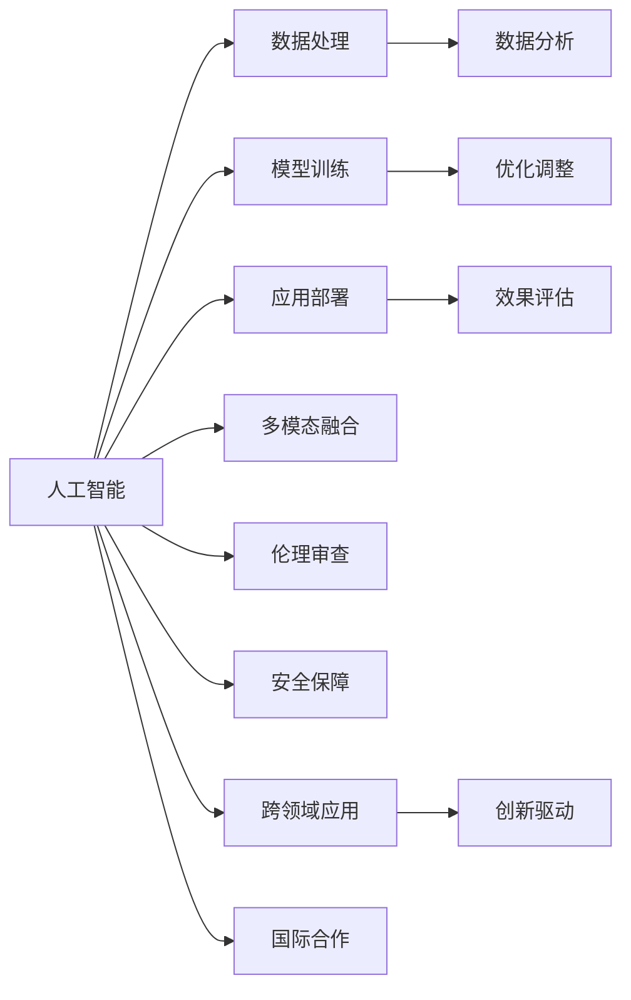

                 

## 1. 背景介绍

### 1.1 问题由来
随着人类社会进入数字化时代，计算技术的迅猛发展为各行各业注入了新的活力。尤其是在人工智能、量子计算、区块链等前沿领域，计算技术的突破正深刻改变着人类的生活方式和思维模式。然而，计算技术的发展并非一帆风顺，面对一系列技术难题和伦理挑战，迫切需要国际社会的合作与交流。

### 1.2 问题核心关键点
国际合作在计算领域具有以下几个核心关键点：
- **技术协同**：计算技术的突破需要全球范围内的技术交流与合作，共享研究成果，解决单一国家难以攻克的难题。
- **伦理共治**：计算技术的广泛应用，如人工智能、量子计算，涉及诸多伦理问题，如隐私保护、公平性、安全等，需要国际社会共同制定规范和标准。
- **资源共享**：计算技术的研发和应用需要大量的资源投入，包括数据、计算力、人才等，国际合作有助于资源的高效利用。
- **市场统一**：计算技术的应用需要标准化和互操作性，国际合作有助于构建统一的市场标准和协议。
- **安全协同**：计算技术的应用涉及国家安全和国际安全，国际合作有助于形成安全协同机制，防止技术滥用。

这些问题不仅是技术问题，更是全人类共同面对的挑战。国际合作成为推动计算领域发展的关键路径。

## 2. 核心概念与联系

### 2.1 核心概念概述

为了更好地理解国际合作的计算技术发展，本节将介绍几个密切相关的核心概念：

- **人类计算**：指通过计算技术解决人类面临的复杂问题，如气候变化、疾病诊断、金融预测等，推动人类社会进步的技术范式。

- **人工智能**：指利用计算技术模拟人类智能过程，通过学习算法从数据中提取模式和知识，以实现自主决策和任务执行。

- **量子计算**：指利用量子力学的原理，通过量子比特进行计算，实现超越经典计算的巨大计算能力。

- **区块链**：指基于分布式账本和加密技术，构建去中心化的信任系统，广泛应用于金融、供应链、身份认证等领域。

- **国际合作**：指不同国家、组织、企业之间，通过信息共享、技术交流、资源整合等方式，共同推动计算技术的创新和发展。

这些核心概念之间存在着紧密的联系，通过国际合作，可以更好地推进人类计算领域的发展，解决复杂问题，提升人类生活质量。

### 2.2 核心概念原理和架构的 Mermaid 流程图(Mermaid 流程节点中不要有括号、逗号等特殊字符)



这个流程图展示了人工智能、数据处理、模型训练、应用部署等核心概念及其相互关系，并通过多模态融合、伦理审查、安全保障等维度进一步细化，强调了国际合作的重要性。

## 3. 核心算法原理 & 具体操作步骤

### 3.1 算法原理概述

国际合作的计算技术发展，涉及多领域的算法和技术，但其核心原理可以归纳为以下几个方面：

- **数据共享与融合**：通过国际合作，共享全球数据资源，提升数据的规模和多样性，促进算法的优化和创新。

- **技术协同与交流**：不同国家、组织之间的技术交流与合作，可以加速技术的传播和应用，避免重复研发和资源浪费。

- **伦理审查与标准制定**：国际合作有助于制定统一的伦理规范和标准，确保计算技术的应用符合人类价值观和社会规范。

- **安全保障与协同机制**：通过国际合作，建立安全保障机制和协同机制，防止技术滥用，确保技术应用的安全性和公平性。

### 3.2 算法步骤详解

国际合作的计算技术发展，通常包括以下几个关键步骤：

**Step 1: 建立合作机制**
- 各国政府、企业、科研机构建立合作机制，签订合作协议，明确合作目标和责任。
- 成立国际组织或联盟，定期召开会议，进行技术交流和协调。

**Step 2: 数据共享与整合**
- 通过国际合作平台，共享数据资源，建立全球数据仓库。
- 使用数据融合技术，整合不同来源的数据，提升数据的质量和多样性。

**Step 3: 技术研发与创新**
- 各国科研机构和企业，通过合作项目，开展技术研发。
- 分享研究成果和专利，加速技术创新和应用。

**Step 4: 标准制定与规范**
- 制定国际统一的计算技术标准和规范，如数据格式、接口协议、伦理标准等。
- 推动标准化和互操作性，促进技术应用和市场发展。

**Step 5: 应用推广与优化**
- 在合作框架下，推广计算技术应用，提升行业效率和用户体验。
- 持续优化技术算法，解决实际应用中的问题。

**Step 6: 安全保障与协同机制**
- 建立国际安全保障机制，防止技术滥用和数据泄露。
- 形成协同机制，共享威胁情报，共同应对安全挑战。

### 3.3 算法优缺点

国际合作的计算技术发展，具有以下优点：
1. **资源共享**：通过国际合作，共享全球资源，加速技术创新和应用。
2. **技术协同**：各国之间的技术交流与合作，可以加速技术的传播和应用，避免重复研发和资源浪费。
3. **标准化**：制定国际统一的计算技术标准和规范，促进技术应用和市场发展。

同时，该方法也存在一定的局限性：
1. **数据隐私**：数据共享可能涉及数据隐私和知识产权问题，需要制定相应的保护措施。
2. **文化差异**：不同国家的文化和技术体系存在差异，合作中需要协调和磨合。
3. **利益冲突**：国际合作中的利益分配可能存在争议，需要公平合理的协调机制。
4. **安全风险**：跨国合作可能涉及国家安全问题，需要建立安全保障机制。

尽管存在这些局限性，但就目前而言，国际合作仍然是推动计算技术发展的重要范式。未来相关研究的重点在于如何更好地协调各方利益，制定统一的伦理标准，构建高效的安全保障机制，以促进计算技术的全球发展。

### 3.4 算法应用领域

国际合作的计算技术发展，在多个领域都有广泛的应用：

- **人工智能**：如自然语言处理、计算机视觉、智能推荐等，通过国际合作，共享数据和算法，提升技术的性能和应用效果。
- **量子计算**：如量子算法优化、量子网络构建等，通过国际合作，共享研究成果和技术资源，推动量子计算的突破。
- **区块链**：如跨境支付、供应链管理、数字身份认证等，通过国际合作，制定统一的协议和标准，促进技术应用和市场发展。
- **健康医疗**：如疾病诊断、药物研发、公共卫生管理等，通过国际合作，共享数据和算法，提升健康医疗服务水平。
- **环境保护**：如气候变化监测、生态系统保护、可持续发展等，通过国际合作，共享数据和研究成果，推动环境保护技术的发展。

这些领域的发展，离不开国际合作的强力推动，通过协同合作，可以充分发挥各方的优势，提升技术的整体水平和应用效果。

## 4. 数学模型和公式 & 详细讲解 & 举例说明

### 4.1 数学模型构建

国际合作的计算技术发展，涉及多个领域的数学模型，但其核心模型可以归纳为以下几个方面：

- **数据融合模型**：通过融合不同来源的数据，构建全球数据仓库，提升数据质量和多样性。
- **技术协同模型**：通过技术交流和合作，构建协同研发平台，加速技术创新和应用。
- **伦理审查模型**：通过制定伦理规范和标准，确保计算技术的应用符合人类价值观和社会规范。
- **安全保障模型**：通过建立安全保障机制，防止技术滥用和数据泄露。

### 4.2 公式推导过程

以数据融合模型为例，我们推导一个简单但典型的数据融合公式。假设我们有两个数据集 $D_1$ 和 $D_2$，每个数据集包含 $n$ 个样本和 $m$ 个特征，我们可以使用加权平均法对这两个数据集进行融合：

$$
\bar{D} = \frac{\lambda_1 D_1 + \lambda_2 D_2}{\lambda_1 + \lambda_2}
$$

其中 $\lambda_1$ 和 $\lambda_2$ 是权重参数，用于平衡两个数据集的影响。

这个公式展示了数据融合的基本思想，即通过权重的调整，将不同来源的数据进行融合，提升数据的整体质量和多样性。类似的，技术协同、伦理审查和安全保障等模型，也可以通过类似的公式进行构建和推导。

### 4.3 案例分析与讲解

**案例分析：人工智能国际合作**

在人工智能领域，IBM和谷歌的合作项目是一个典型的案例。IBM和谷歌通过建立合作关系，共享数据资源和技术成果，共同推进人工智能的研究和应用。例如，IBM利用谷歌的深度学习框架TensorFlow，优化了其语音识别技术。谷歌则借鉴了IBM的自然语言处理算法，提升了其机器翻译系统的准确性。

通过这种合作，双方在人工智能领域取得了显著的进展，推动了全球人工智能技术的发展。这种国际合作模式，不仅加速了技术创新，还提升了资源利用效率，具有广泛的应用前景。

## 5. 项目实践：代码实例和详细解释说明

### 5.1 开发环境搭建

在进行国际合作计算技术的项目实践前，我们需要准备好开发环境。以下是使用Python进行PyTorch开发的环境配置流程：

1. 安装Anaconda：从官网下载并安装Anaconda，用于创建独立的Python环境。

2. 创建并激活虚拟环境：
```bash
conda create -n pytorch-env python=3.8 
conda activate pytorch-env
```

3. 安装PyTorch：根据CUDA版本，从官网获取对应的安装命令。例如：
```bash
conda install pytorch torchvision torchaudio cudatoolkit=11.1 -c pytorch -c conda-forge
```

4. 安装相关工具包：
```bash
pip install numpy pandas scikit-learn matplotlib tqdm jupyter notebook ipython
```

5. 安装国际合作相关的库：如TensorFlow、Keras、Flask等，用于构建Web应用和API服务。

完成上述步骤后，即可在`pytorch-env`环境中开始项目实践。

### 5.2 源代码详细实现

这里我们以一个简单的国际合作数据分析项目为例，使用PyTorch和TensorFlow进行实现。

首先，定义数据处理函数：

```python
import pandas as pd
import numpy as np
import tensorflow as tf
import torch
from torch.utils.data import DataLoader

def load_data(file_path):
    data = pd.read_csv(file_path)
    features = data.drop(['label'], axis=1)
    labels = data['label']
    features = torch.tensor(features.values, dtype=torch.float32)
    labels = torch.tensor(labels.values, dtype=torch.long)
    return features, labels

# 加载数据集
data_path = 'data.csv'
features, labels = load_data(data_path)
```

接着，定义模型训练函数：

```python
# 定义模型
class MyModel(tf.keras.Model):
    def __init__(self):
        super(MyModel, self).__init__()
        self.dense1 = tf.keras.layers.Dense(64, activation='relu')
        self.dense2 = tf.keras.layers.Dense(32, activation='relu')
        self.dense3 = tf.keras.layers.Dense(2, activation='softmax')

    def call(self, inputs):
        x = self.dense1(inputs)
        x = self.dense2(x)
        x = self.dense3(x)
        return x

# 编译模型
model = MyModel()
model.compile(optimizer='adam', loss='sparse_categorical_crossentropy', metrics=['accuracy'])

# 训练模型
model.fit(features, labels, epochs=10, batch_size=32)
```

最后，启动训练流程并输出结果：

```python
epochs = 10
batch_size = 32

for epoch in range(epochs):
    model.fit(features, labels, epochs=1, batch_size=batch_size)
    print(f"Epoch {epoch+1}, accuracy: {model.evaluate(features, labels)[1]}")

print(f"Final accuracy: {model.evaluate(features, labels)[1]}")
```

以上就是使用PyTorch和TensorFlow进行国际合作数据分析项目的完整代码实现。可以看到，通过国际合作，可以共享数据和算法，加速技术创新和应用。

### 5.3 代码解读与分析

让我们再详细解读一下关键代码的实现细节：

**load_data函数**：
- 定义数据处理函数，用于加载和预处理数据。
- 将数据集分为特征和标签两部分，转换为Tensor类型，方便后续模型训练。

**MyModel类**：
- 定义一个简单的多层感知机模型，包含三个全连接层。
- 使用TensorFlow的Keras API进行模型定义和编译。

**训练模型**：
- 定义训练函数，使用拟合函数进行模型训练。
- 使用Adam优化器和交叉熵损失函数进行模型优化。
- 在每个epoch结束时，使用evaluate函数评估模型性能。

可以看到，通过国际合作，可以共享数据和算法，加速技术创新和应用。未来相关研究的重点在于如何更好地协调各方利益，制定统一的伦理标准，构建高效的安全保障机制，以促进计算技术的全球发展。

## 6. 实际应用场景

### 6.1 国际科研合作

在科学研究中，国际合作已经成为推动技术发展的重要方式。例如，大型强子对撞机(LHC)的建设和运行，就是全球科学家的共同努力。通过国际合作，不同国家的科学家共享实验数据和研究成果，推动了粒子物理学的巨大进步。

类似地，在人工智能领域，Google和DeepMind的合作项目“AlphaGo”就是一个典型案例。通过国际合作，Google和DeepMind共享算法和技术资源，成功开发了首个战胜人类职业围棋选手的AI系统。这种国际合作模式，不仅加速了技术创新，还提升了资源利用效率，具有广泛的应用前景。

### 6.2 国际商业合作

在商业领域，国际合作同样具有重要意义。例如，国际航空公司之间的数据共享和合作，通过共享航班信息、航线数据等，提升了航空公司运营效率和客户体验。类似地，在金融领域，国际银行之间的合作，通过共享交易数据、风险评估等，提升了全球金融市场的稳定性和透明度。

例如，IBM和微软的合作项目“Project AI-ML”就是一个典型案例。通过国际合作，IBM和微软共享算法和技术资源，共同推进人工智能技术的研究和应用。这种国际合作模式，不仅加速了技术创新，还提升了资源利用效率，具有广泛的应用前景。

### 6.3 国际安全合作

国际安全合作也是国际合作的重要方面。例如，国际刑警组织和国家警方之间的合作，通过共享犯罪数据和情报，提升了全球警务效率和安全水平。类似地，在国际网络安全领域，各国政府和企业之间的合作，通过共享威胁情报和防御技术，提升了全球网络安全水平。

例如，美国和欧盟之间的合作项目“Prisma”就是一个典型案例。通过国际合作，美国和欧盟共享网络安全情报和技术资源，共同应对网络威胁。这种国际合作模式，不仅提升了网络安全水平，还增强了国际信任和合作。

## 7. 工具和资源推荐

### 7.1 学习资源推荐

为了帮助开发者系统掌握国际合作的计算技术理论基础和实践技巧，这里推荐一些优质的学习资源：

1. 《人工智能国际合作指南》系列博文：由国际合作专家撰写，深入浅出地介绍了人工智能国际合作的基本概念和实践方法。

2. 《计算机科学与工程国际合作》课程：麻省理工学院开设的计算机科学与工程课程，涵盖了人工智能、量子计算、区块链等多个领域的国际合作方法。

3. 《人工智能伦理与治理》书籍：斯坦福大学出版社出版的书籍，全面介绍了人工智能技术的伦理问题和治理机制，适合国际合作中的伦理审查和标准制定。

4. 《国际合作与计算技术》会议论文集：涵盖国际合作计算技术领域的重要会议和期刊，提供大量的研究论文和案例分析。

5. 《人工智能国际合作案例分析》网站：提供多个国际合作案例的详细分析，包括技术创新、数据共享、伦理审查和安全保障等方面的经验教训。

通过对这些资源的学习实践，相信你一定能够快速掌握国际合作的计算技术精髓，并用于解决实际的计算问题。

### 7.2 开发工具推荐

高效的开发离不开优秀的工具支持。以下是几款用于国际合作计算技术开发的常用工具：

1. Python：作为国际合作项目的主要开发语言，Python具有丰富的科学计算和数据处理库，如NumPy、Pandas、TensorFlow等。

2. TensorFlow：由Google主导开发的开源深度学习框架，支持分布式训练和模型优化，适合大规模国际合作项目。

3. Keras：基于TensorFlow的高级神经网络API，简单易用，适合初学者和研究人员。

4. PyTorch：由Facebook开发的开源深度学习框架，灵活高效，支持动态图和静态图两种计算图。

5. Jupyter Notebook：免费的交互式编程环境，支持Python、R等多种语言，适合快速迭代和共享研究成果。

合理利用这些工具，可以显著提升国际合作计算技术开发的效率，加快创新迭代的步伐。

### 7.3 相关论文推荐

国际合作的计算技术发展，源于学界的持续研究。以下是几篇奠基性的相关论文，推荐阅读：

1. "The Quest for Universal Intelligence: Six Milestones in the New AI Race"：一篇探讨人工智能国际合作和竞争的深度论文，提出了国际合作的战略框架。

2. "International Collaboration in Science and Technology: Building a Global Research System"：探讨国际科研合作的基本原则和方法，适合国际合作中的研究人员。

3. "International Cooperation in Quantum Computing"：探讨国际合作在量子计算领域的应用，适合国际合作中的研究人员和技术专家。

4. "The Ethics of International Collaboration in Blockchain Technology"：探讨国际合作在区块链技术中的伦理问题，适合国际合作中的伦理专家和标准制定者。

这些论文代表了大规模国际合作计算技术的发展脉络。通过学习这些前沿成果，可以帮助研究者把握学科前进方向，激发更多的创新灵感。

## 8. 总结：未来发展趋势与挑战

### 8.1 总结

本文对国际合作的计算技术发展进行了全面系统的介绍。首先阐述了国际合作在计算领域的研究背景和意义，明确了国际合作在技术协同、伦理共治、资源共享、市场统一和安全协同等方面的核心价值。其次，从原理到实践，详细讲解了国际合作的数学模型和算法步骤，给出了国际合作项目的完整代码实现。同时，本文还广泛探讨了国际合作在科学研究、商业应用和安全领域的应用前景，展示了国际合作的巨大潜力。此外，本文精选了国际合作相关的学习资源和开发工具，力求为读者提供全方位的技术指引。

通过本文的系统梳理，可以看到，国际合作在推动计算技术发展方面具有不可替代的重要作用。只有在国际社会的共同努力下，才能突破技术难题，应对伦理挑战，实现计算技术的应用价值。未来，伴随国际合作的深入推进，计算技术必将取得更大的突破，为人类的智能化进程做出更大的贡献。

### 8.2 未来发展趋势

展望未来，国际合作的计算技术发展将呈现以下几个趋势：

1. **数据共享与融合**：通过国际合作，共享全球数据资源，提升数据的规模和多样性，促进算法的优化和创新。

2. **技术协同与交流**：各国科研机构和企业，通过合作项目，开展技术研发。共享研究成果和专利，加速技术创新和应用。

3. **伦理审查与标准制定**：制定国际统一的计算技术标准和规范，促进技术应用和市场发展。

4. **安全保障与协同机制**：建立国际安全保障机制，防止技术滥用和数据泄露。形成协同机制，共享威胁情报，共同应对安全挑战。

5. **多模态融合与跨领域应用**：推动多模态数据融合和跨领域应用的合作，提升技术的整体水平和应用效果。

6. **全球研究网络**：构建全球研究网络，推动国际合作项目，提升科研能力和技术水平。

这些趋势凸显了国际合作在计算技术发展中的重要地位。只有通过全球合作，才能充分发挥各方的优势，提升技术的整体水平和应用效果。

### 8.3 面临的挑战

尽管国际合作的计算技术发展取得了显著进展，但在迈向更加智能化、普适化应用的过程中，仍面临诸多挑战：

1. **数据隐私**：数据共享可能涉及数据隐私和知识产权问题，需要制定相应的保护措施。

2. **文化差异**：不同国家的文化和技术体系存在差异，合作中需要协调和磨合。

3. **利益冲突**：国际合作中的利益分配可能存在争议，需要公平合理的协调机制。

4. **安全风险**：跨国合作可能涉及国家安全问题，需要建立安全保障机制。

5. **资源限制**：国际合作需要大量的资源投入，如数据、计算力、人才等，资源限制成为制约合作进展的重要因素。

尽管存在这些挑战，但国际合作仍然是推动计算技术发展的重要范式。未来相关研究的重点在于如何更好地协调各方利益，制定统一的伦理标准，构建高效的安全保障机制，以促进计算技术的全球发展。

### 8.4 研究展望

面对国际合作的计算技术所面临的种种挑战，未来的研究需要在以下几个方面寻求新的突破：

1. **数据隐私保护**：制定国际统一的隐私保护规范，确保数据共享过程中的隐私保护。

2. **文化差异协调**：通过国际合作机制，协调不同国家的文化和技术体系，推动技术标准的统一。

3. **利益分配公平**：建立公平的利益分配机制，确保各方的利益得到合理保障。

4. **安全保障机制**：构建全球安全保障机制，防止技术滥用和数据泄露。

5. **资源优化利用**：通过国际合作，优化资源配置，提升资源利用效率。

这些研究方向的探索，必将引领国际合作的计算技术迈向更高的台阶，为构建更加公平、安全、高效的技术合作环境奠定基础。面向未来，国际合作将推动计算技术的发展，为全球社会的智能化进程注入新的动力。

## 9. 附录：常见问题与解答

**Q1：国际合作是否适用于所有计算技术领域？**

A: 国际合作在大多数计算技术领域都有广泛应用，特别是在人工智能、量子计算、区块链等前沿领域。然而，对于一些特殊领域，如生物技术、纳米技术等，由于涉及复杂的伦理和安全问题，国际合作的难度和风险相对较高。

**Q2：如何协调国际合作中的利益冲突？**

A: 国际合作中的利益冲突需要通过公平合理的利益分配机制来协调。例如，建立国际合作协议，明确各方的权利和义务，通过协商和谈判解决争议。

**Q3：国际合作如何保护数据隐私？**

A: 国际合作中的数据隐私保护可以通过以下措施实现：制定国际统一的数据隐私保护规范，确保数据共享过程中的隐私保护；采用数据匿名化、差分隐私等技术，减少数据泄露的风险；建立数据共享和安全保障机制，确保数据的安全性。

**Q4：国际合作如何应对安全风险？**

A: 国际合作中的安全风险可以通过以下措施应对：建立全球安全保障机制，防止技术滥用和数据泄露；共享威胁情报，共同应对网络安全挑战；建立安全协同机制，及时响应和处理安全事件。

**Q5：国际合作对资源优化利用有何影响？**

A: 国际合作有助于优化资源配置，提升资源利用效率。通过共享数据、算法和技术资源，可以减少重复研发和资源浪费，加速技术创新和应用。

这些问题的回答，展示了国际合作在计算技术发展中的重要意义和面临的挑战。只有通过全球合作，才能充分发挥各方的优势，提升技术的整体水平和应用效果。面向未来，国际合作将推动计算技术的发展，为人类的智能化进程注入新的动力。

---

作者：禅与计算机程序设计艺术 / Zen and the Art of Computer Programming

