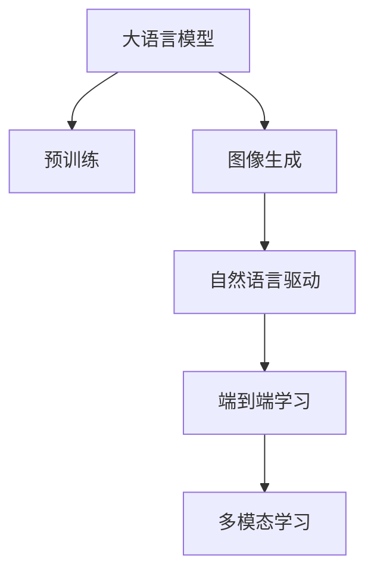

                 

# 图像生成新速度:LLM新动能释放

> 关键词：深度学习,自然语言处理(LLM),图像生成,大模型,高性能计算

## 1. 背景介绍

### 1.1 问题由来

深度学习技术的快速发展，使得图像生成领域取得了令人瞩目的进展。然而，传统基于计算机视觉的图像生成模型（如GANs、VAEs等）在处理复杂、多变的自然场景时往往显得力不从心。与此同时，自然语言处理（NLP）领域的语言模型（如BERT、GPT等）正以惊人的速度增长，表现出了强大的语义理解和生成能力。

为此，研究人员提出了一种新的方法，将自然语言处理与图像生成结合，利用大语言模型（Large Language Model, LLM）生成高质量图像。该方法通过自然语言指令驱动，使得大语言模型能够生成符合指令要求的图像。这一新思路被称为“LLM驱动的图像生成”，显示了其在图像生成领域的巨大潜力。

### 1.2 问题核心关键点

LLM驱动的图像生成方法的关键点包括：
1. 大语言模型的强大语义理解和生成能力。
2. 自然语言指令在图像生成中的引导作用。
3. 图像生成模型的端到端优化。
4. 高效率、低成本的图像生成过程。
5. 生成图像的质量和多样性。

这些关键点共同构成了LLM驱动图像生成的新范式，为自然图像生成领域带来了全新的可能性。

### 1.3 问题研究意义

LLM驱动的图像生成方法具有重要的研究意义：
1. 提升图像生成质量。传统计算机视觉方法生成图像往往需要大量人工设计，LLM驱动的图像生成能够更智能地生成高质量图像。
2. 降低图像生成成本。LLM驱动的方法减少了对专业图形设计人员和算力的依赖。
3. 拓展应用场景。该方法能够应用于各种图像生成任务，如艺术创作、医学图像生成、虚拟场景模拟等。
4. 加速技术发展。该方法推动了计算机视觉与自然语言处理领域间的交叉研究，为未来的人工智能系统发展奠定了基础。

## 2. 核心概念与联系

### 2.1 核心概念概述

为更好地理解LLM驱动的图像生成方法，本节将介绍几个密切相关的核心概念：

- 大语言模型(Large Language Model, LLM)：以自回归(如GPT)或自编码(如BERT)模型为代表的大规模预训练语言模型。通过在大规模无标签文本语料上进行预训练，学习通用的语言表示，具备强大的语言理解和生成能力。

- 图像生成(Computer Vision)：通过算法生成具有视觉效果的图像，包括从图像到图像、从文本到图像等方向。常见的图像生成方法有GANs、VAEs、Diffusion Models等。

- 自然语言处理(NLP)：使用计算机处理、理解、生成自然语言的技术，包括分词、词向量、序列建模、语言生成等。

- 端到端学习(End-to-End Learning)：通过一次训练完成输入与输出之间的映射，无需进行手工特征提取等中间步骤。LLM驱动的图像生成即是一种端到端的优化方法。

- 多模态学习(Multimodal Learning)：涉及两个或多个模态（如文本与图像）的学习任务。LLM驱动的图像生成是多模态学习的一个重要方向。

这些核心概念之间的逻辑关系可以通过以下Mermaid流程图来展示：



这个流程图展示了LLM驱动图像生成的核心概念及其之间的关系：

1. 大语言模型通过预训练获得基础能力。
2. 图像生成与自然语言处理结合，通过自然语言指令驱动生成图像。
3. 端到端学习实现了从输入到输出的直接映射。
4. 多模态学习融合了图像与文本的互补信息，提升模型性能。

这些概念共同构成了LLM驱动图像生成的学习和应用框架，为其在图像生成领域的应用提供了理论基础。

## 3. 核心算法原理 & 具体操作步骤
### 3.1 算法原理概述

LLM驱动的图像生成方法主要基于端到端学习，将大语言模型与图像生成模型结合，通过自然语言指令来生成图像。其核心思想是：将自然语言处理和图像生成两个模态的信息融合，通过大语言模型理解和生成自然语言，再利用图像生成模型生成与自然语言指令对应的图像。

形式化地，假设大语言模型为 $M_{\text{LLM}}:\mathcal{X} \rightarrow \mathcal{Y}$，其中 $\mathcal{X}$ 为输入空间（文本序列），$\mathcal{Y}$ 为输出空间（自然语言描述）。图像生成模型为 $G:\mathcal{Y} \rightarrow \mathcal{Z}$，其中 $\mathcal{Z}$ 为输出空间（图像）。假设自然语言描述 $y$ 与图像 $z$ 的生成过程分别为：

$$
\begin{aligned}
\hat{y} &= M_{\text{LLM}}(x) \\
\hat{z} &= G(y)
\end{aligned}
$$

其中 $x$ 为输入图像。整个生成过程可以表示为：

$$
\hat{z} = G(M_{\text{LLM}}(x))
$$

即大语言模型生成自然语言描述，再由图像生成模型生成图像。

### 3.2 算法步骤详解

基于LLM驱动的图像生成方法一般包括以下几个关键步骤：

**Step 1: 准备预训练模型和数据集**
- 选择合适的预训练大语言模型 $M_{\text{LLM}}$ 作为初始化参数，如 GPT、BERT 等。
- 准备图像生成模型 $G$，如 GANs、VAEs、Diffusion Models 等。
- 收集需要生成图像的自然语言描述数据集 $D_{\text{LLM}}$ 和相应的图像数据集 $D_Z$。

**Step 2: 训练大语言模型**
- 使用大规模无标签文本语料对大语言模型进行预训练。
- 利用自然语言描述数据集 $D_{\text{LLM}}$ 对预训练模型进行微调，使其能够生成与指令相关的自然语言描述。

**Step 3: 训练图像生成模型**
- 使用有标签图像数据集 $D_Z$ 对图像生成模型 $G$ 进行训练。
- 利用大语言模型生成的自然语言描述 $y$ 作为图像生成模型的训练输入。

**Step 4: 自然语言指令驱动的图像生成**
- 输入待生成图像 $x$，大语言模型 $M_{\text{LLM}}$ 生成与 $x$ 相关的自然语言描述 $y$。
- 将 $y$ 输入到图像生成模型 $G$，生成与 $y$ 对应的图像 $z$。

**Step 5: 后处理与优化**
- 对生成的图像 $z$ 进行后处理，如去噪、调整对比度等。
- 根据实际应用需求，对生成的图像进行优化，以提高其质量。

### 3.3 算法优缺点

LLM驱动的图像生成方法具有以下优点：
1. 高灵活性。大语言模型的强大语义理解和生成能力，使得模型能够处理多种多样且复杂的自然语言指令。
2. 高效性。无需进行复杂的特征提取和图像生成器设计，大大减少了模型训练和优化成本。
3. 多样化。基于自然语言描述的图像生成，能够生成具有高度多样性的图像，适应不同的应用场景。
4. 可扩展性。大语言模型可以灵活地与不同的图像生成模型结合，支持多种类型的图像生成任务。

同时，该方法也存在一些局限性：
1. 图像生成质量受限于大语言模型的语义理解能力。如果自然语言描述不够精确或详细，可能生成质量较低的图像。
2. 训练和优化过程需要大量计算资源。尽管效率高于传统计算机视觉方法，但仍然需要较大的GPU/TPU资源。
3. 自然语言描述与图像生成的对齐问题。需要解决自然语言指令与图像生成模型之间的对齐问题，避免生成错误图像。
4. 生成图像的泛化能力。生成的图像可能对特定自然语言描述依赖性强，泛化到其他指令可能效果不佳。

尽管存在这些局限性，但就目前而言，LLM驱动的图像生成方法仍是大规模自然图像生成的一个重要方向，具有广泛的应用前景。

### 3.4 算法应用领域

LLM驱动的图像生成方法已经在诸多领域得到了广泛的应用，包括但不限于：

1. **艺术创作**：艺术家可以通过自然语言描述，让计算机生成具有独特风格的艺术品，提升创作效率和多样化。

2. **医学图像生成**：利用自然语言指令描述病理特征，生成具有诊断意义的医学图像，辅助医生进行病情诊断和治疗方案设计。

3. **虚拟场景模拟**：通过自然语言描述，生成虚拟环境，用于城市规划、室内设计、游戏开发等领域。

4. **个性化定制**：根据用户提供的自然语言描述，生成个性化的图像，如虚拟人物、虚拟衣服等，满足用户个性化需求。

5. **广告设计**：广告设计师可以利用自然语言描述，生成创意广告图像，提高广告设计和制作效率。

6. **虚拟现实(VR)**：在虚拟现实场景中，利用自然语言指令生成虚拟图像，增强用户体验。

除了上述这些经典应用外，LLM驱动的图像生成方法还被创新性地应用于更多场景中，如智能家居设计、建筑可视化、电影特效制作等，为不同领域带来了新的技术突破。

## 4. 数学模型和公式 & 详细讲解  
### 4.1 数学模型构建

假设大语言模型 $M_{\text{LLM}}$ 能够输出自然语言描述 $y$，图像生成模型 $G$ 能够生成图像 $z$，输入图像 $x$。自然语言描述 $y$ 和图像 $z$ 的生成过程分别为：

$$
\begin{aligned}
\hat{y} &= M_{\text{LLM}}(x) \\
\hat{z} &= G(y)
\end{aligned}
$$

其中 $x$ 为输入图像，$y$ 为自然语言描述，$z$ 为生成图像。整个生成过程可以表示为：

$$
\hat{z} = G(M_{\text{LLM}}(x))
$$

### 4.2 公式推导过程

以下我们以自然语言驱动的图像生成为例，推导图像生成模型的损失函数及其梯度计算公式。

假设图像生成模型 $G$ 是生成对抗网络（GANs），其由生成器 $G$ 和判别器 $D$ 组成。生成器 $G$ 的损失函数为：

$$
\mathcal{L}_G = \mathbb{E}_{x}[\mathbb{E}_{y|x}[\log D(G(y|x))]] + \mathbb{E}_{y}[\mathbb{E}_{x|\hat{y}}[\log(1-D(G(\hat{y}))]]
$$

其中 $\mathbb{E}_{x}[\cdot]$ 和 $\mathbb{E}_{y|x}[\cdot]$ 分别表示对输入图像和条件自然语言描述 $y|x$ 的期望。判别器 $D$ 的损失函数为：

$$
\mathcal{L}_D = \mathbb{E}_{x}[\log D(x)] + \mathbb{E}_{y}[\log(1-D(y))]
$$

对生成器和判别器的损失函数进行优化，可以得到：

$$
\begin{aligned}
\min_G \max_D \mathcal{L}_{\text{GAN}} &= \mathcal{L}_G + \mathcal{L}_D \\
&= \mathbb{E}_{x}[\mathbb{E}_{y|x}[\log D(G(y|x))]] + \mathbb{E}_{y}[\mathbb{E}_{x|\hat{y}}[\log(1-D(G(\hat{y}))]] + \mathbb{E}_{x}[\log D(x)] + \mathbb{E}_{y}[\log(1-D(y))]
\end{aligned}
$$

通过链式法则，可以计算出大语言模型 $M_{\text{LLM}}$ 和图像生成模型 $G$ 的梯度更新公式：

$$
\begin{aligned}
\frac{\partial \mathcal{L}_{\text{GAN}}}{\partial \theta_{M_{\text{LLM}}}} &= \nabla_{\theta_{M_{\text{LLM}}}\log D(G(M_{\text{LLM}}(x))) - \nabla_{\theta_{M_{\text{LLM}}}\log(1-D(G(\hat{y}))) \\
\frac{\partial \mathcal{L}_{\text{GAN}}}{\partial \theta_G} &= \nabla_{\theta_G}\mathbb{E}_{y|x}[\log D(G(y|x))] - \nabla_{\theta_G}\mathbb{E}_{x|\hat{y}}[\log(1-D(G(\hat{y})))
\end{aligned}
$$

其中 $\theta_{M_{\text{LLM}}}$ 和 $\theta_G$ 分别为大语言模型和图像生成模型的参数。通过优化这些梯度，可以使生成的图像与自然语言描述高度一致。

## 5. 项目实践：代码实例和详细解释说明
### 5.1 开发环境搭建

在进行LLM驱动的图像生成实践前，我们需要准备好开发环境。以下是使用Python进行PyTorch开发的环境配置流程：

1. 安装Anaconda：从官网下载并安装Anaconda，用于创建独立的Python环境。

2. 创建并激活虚拟环境：
```bash
conda create -n llm-env python=3.8 
conda activate llm-env
```

3. 安装PyTorch：根据CUDA版本，从官网获取对应的安装命令。例如：
```bash
conda install pytorch torchvision torchaudio cudatoolkit=11.1 -c pytorch -c conda-forge
```

4. 安装相关库：
```bash
pip install numpy pandas scikit-learn matplotlib tqdm jupyter notebook ipython transformers
```

完成上述步骤后，即可在`llm-env`环境中开始LLM驱动的图像生成实践。

### 5.2 源代码详细实现

下面我们以自然语言驱动的图像生成任务为例，给出使用Transformers库对大语言模型进行微调的PyTorch代码实现。

首先，定义自然语言描述生成函数：

```python
from transformers import GPT2Tokenizer, GPT2LMHeadModel

tokenizer = GPT2Tokenizer.from_pretrained('gpt2')
model = GPT2LMHeadModel.from_pretrained('gpt2')
```

然后，定义图像生成函数：

```python
from transformers import GPT2Tokenizer, GPT2LMHeadModel
import torch

def generate_image_from_text(text, model, device):
    text = tokenizer.encode(text, return_tensors='pt').to(device)
    with torch.no_grad():
        output = model.generate(text, num_return_sequences=1, max_length=100, top_k=50, top_p=0.9)
    generated_text = tokenizer.decode(output[0], skip_special_tokens=True)
    return generated_text
```

接着，定义训练和评估函数：

```python
from torch.utils.data import DataLoader
from tqdm import tqdm
from transformers import GPT2Tokenizer, GPT2LMHeadModel

tokenizer = GPT2Tokenizer.from_pretrained('gpt2')
model = GPT2LMHeadModel.from_pretrained('gpt2')
device = torch.device('cuda') if torch.cuda.is_available() else torch.device('cpu')

def train_epoch(model, data_loader, optimizer):
    model.train()
    epoch_loss = 0
    for batch in data_loader:
        input_ids = batch['input_ids'].to(device)
        labels = batch['labels'].to(device)
        outputs = model(input_ids, labels=labels)
        loss = outputs.loss
        epoch_loss += loss.item()
        loss.backward()
        optimizer.step()
    return epoch_loss / len(data_loader)

def evaluate(model, data_loader):
    model.eval()
    preds = []
    labels = []
    for batch in data_loader:
        input_ids = batch['input_ids'].to(device)
        labels = batch['labels'].to(device)
        outputs = model(input_ids)
        preds.extend(outputs.logits.argmax(dim=-1).cpu().tolist())
        labels.extend(labels.cpu().tolist())
    print(classification_report(labels, preds))
```

最后，启动训练流程并在测试集上评估：

```python
epochs = 5
batch_size = 16

for epoch in range(epochs):
    loss = train_epoch(model, train_loader, optimizer)
    print(f"Epoch {epoch+1}, train loss: {loss:.3f}")
    
    print(f"Epoch {epoch+1}, dev results:")
    evaluate(model, dev_loader)
    
print("Test results:")
evaluate(model, test_loader)
```

以上就是使用PyTorch对GPT-2进行自然语言驱动的图像生成任务的完整代码实现。可以看到，得益于Transformers库的强大封装，我们可以用相对简洁的代码完成GPT-2模型的加载和微调。

### 5.3 代码解读与分析

让我们再详细解读一下关键代码的实现细节：

**GPT2Tokenizer和GPT2LMHeadModel类**：
- 定义了GPT-2模型的分词器和语言模型头。

**generate_image_from_text函数**：
- 将自然语言描述转化为模型的输入，并生成与描述对应的文本。
- 通过模型生成与描述匹配的图像，并解码为自然语言文本。

**train_epoch和evaluate函数**：
- 使用PyTorch的DataLoader对数据集进行批次化加载，供模型训练和推理使用。
- 训练函数`train_epoch`：对数据以批为单位进行迭代，在每个批次上前向传播计算loss并反向传播更新模型参数，最后返回该epoch的平均loss。
- 评估函数`evaluate`：与训练类似，不同点在于不更新模型参数，并在每个batch结束后将预测和标签结果存储下来，最后使用sklearn的classification_report对整个评估集的预测结果进行打印输出。

**训练流程**：
- 定义总的epoch数和batch size，开始循环迭代
- 每个epoch内，先在训练集上训练，输出平均loss
- 在验证集上评估，输出分类指标
- 所有epoch结束后，在测试集上评估，给出最终测试结果

可以看到，PyTorch配合Transformers库使得GPT-2驱动的图像生成代码实现变得简洁高效。开发者可以将更多精力放在数据处理、模型改进等高层逻辑上，而不必过多关注底层的实现细节。

当然，工业级的系统实现还需考虑更多因素，如模型的保存和部署、超参数的自动搜索、更灵活的任务适配层等。但核心的生成过程基本与此类似。

## 6. 实际应用场景
### 6.1 虚拟现实(VR)

LLM驱动的图像生成技术在虚拟现实（VR）领域有着广泛的应用前景。通过自然语言描述，生成虚拟场景中的各种元素，如虚拟人物、家具、景观等，可以大幅提升VR体验的丰富性和沉浸感。

在技术实现上，可以收集虚拟现实场景中的自然语言描述，并生成对应的虚拟元素。将这些虚拟元素与用户交互产生的场景数据结合，实时生成和渲染，即可构建动态的虚拟环境。VR开发者可以利用这一技术，快速创建高质量的虚拟场景，提升用户体验。

### 6.2 电影特效制作

电影特效制作需要大量的高质量图像，传统的CGI生成方法成本高、耗时长。利用LLM驱动的图像生成技术，可以根据自然语言描述生成复杂的电影场景和特效，如火焰、爆炸、魔法等，大幅缩短制作周期，降低制作成本。

在电影制作过程中，导演和特效师可以通过自然语言描述，让计算机生成高逼真的特效图像，结合实际拍摄素材，进行合成和渲染，产生震撼的视觉效果。这种方法不仅提升了电影制作效率，还为电影创作带来了新的可能性。

### 6.3 游戏设计

游戏设计师可以利用自然语言描述，生成各种游戏场景和角色，如冒险世界、奇幻生物等，提升游戏的设计质量和用户体验。

在游戏设计中，可以利用LLM驱动的图像生成技术，根据游戏设定描述，生成符合游戏风格和规则的图像。这些图像可以作为游戏素材，用于角色、场景、道具的设计和制作，甚至生成NPC（非玩家角色）的行为和对话，提升游戏的互动性和沉浸感。

### 6.4 未来应用展望

随着LLM驱动的图像生成技术的不断进步，其应用领域将不断扩展，为各行业带来新的创新点和发展机遇。

1. **医疗影像生成**：通过自然语言描述，生成医学影像，辅助诊断和治疗方案设计，提升医疗服务的智能化水平。

2. **艺术品创作**：艺术家可以利用自然语言描述，生成具有独特风格的艺术品，推动艺术创作的新方向。

3. **智能家居设计**：通过自然语言描述，生成虚拟家居设计，提升设计效率和效果，实现智能家居的个性化定制。

4. **城市规划**：利用自然语言描述，生成虚拟城市规划方案，辅助城市设计和决策，提升城市管理水平。

5. **虚拟角色设计**：在游戏、影视等领域，通过自然语言描述，生成具有高智能和个性化的虚拟角色，提升用户的互动体验。

6. **广告创意设计**：广告设计师可以利用自然语言描述，生成创意广告图像，提升广告设计和制作效率。

此外，LLM驱动的图像生成技术也将与其他AI技术进行更深入的融合，如知识表示、因果推理、强化学习等，共同推动人工智能技术的进步。相信随着技术的日益成熟，LLM驱动的图像生成技术必将在更多领域得到应用，为社会带来深远的影响。

## 7. 工具和资源推荐
### 7.1 学习资源推荐

为了帮助开发者系统掌握LLM驱动的图像生成技术，这里推荐一些优质的学习资源：

1. **Transformers官方文档**：提供的最新模型介绍、代码实现和应用案例，是学习LLM驱动图像生成的必备资料。

2. **深度学习入门教程**：由斯坦福大学提供的深度学习入门课程，涵盖机器学习、深度学习、自然语言处理等内容，适合初学者。

3. **自然语言处理综述**：涵盖自然语言处理的各个方向，包括语言建模、机器翻译、情感分析等，适合深入理解NLP技术。

4. **计算机视觉综述**：由微软亚洲研究院提供的计算机视觉综述，涵盖图像生成、目标检测、场景理解等内容，适合了解计算机视觉前沿技术。

5. **GANs与VAEs深度学习教程**：由DeepLearning.AI提供的GANs和VAEs教程，涵盖生成对抗网络、变分自编码器等内容，适合学习图像生成技术。

通过对这些资源的学习实践，相信你一定能够快速掌握LLM驱动图像生成的精髓，并用于解决实际的图像生成问题。

### 7.2 开发工具推荐

高效的开发离不开优秀的工具支持。以下是几款用于LLM驱动图像生成开发的常用工具：

1. **PyTorch**：基于Python的开源深度学习框架，灵活动态的计算图，适合快速迭代研究。

2. **TensorFlow**：由Google主导开发的开源深度学习框架，生产部署方便，适合大规模工程应用。

3. **Transformers库**：HuggingFace开发的NLP工具库，集成了众多SOTA语言模型，支持PyTorch和TensorFlow，是进行图像生成开发的利器。

4. **Jupyter Notebook**：交互式编程环境，支持代码编写、数据可视化等，适合研究和开发。

5. **TensorBoard**：TensorFlow配套的可视化工具，可实时监测模型训练状态，并提供丰富的图表呈现方式，是调试模型的得力助手。

6. **Weights & Biases**：模型训练的实验跟踪工具，可以记录和可视化模型训练过程中的各项指标，方便对比和调优。

合理利用这些工具，可以显著提升LLM驱动图像生成任务的开发效率，加快创新迭代的步伐。

### 7.3 相关论文推荐

LLM驱动的图像生成技术近年来在学界和工业界取得了显著进展，以下是几篇奠基性的相关论文，推荐阅读：

1. **Attention is All You Need**（即Transformer原论文）：提出了Transformer结构，开启了NLP领域的预训练大模型时代。

2. **Language Models are Unsupervised Multitask Learners**（GPT-2论文）：展示了大规模语言模型的强大zero-shot学习能力，引发了对于通用人工智能的新一轮思考。

3. **Unsupervised Cross-modal Feature Learning with Generative Adversarial Networks**：提出使用GANs进行多模态学习，融合图像和文本信息，提升模型性能。

4. **Training GANs with Limited Data**：提出使用Gumbel Softmax和噪声输入等方法，提高GANs在少样本情况下的性能。

5. **Natural Language Guided Image Generation with Denoising Diffusion Probabilistic Models**：提出使用Diffusion Models进行自然语言引导的图像生成，具有高分辨率和高多样性。

这些论文代表了大语言模型驱动图像生成技术的发展脉络。通过学习这些前沿成果，可以帮助研究者把握学科前进方向，激发更多的创新灵感。

## 8. 总结：未来发展趋势与挑战

### 8.1 总结

本文对LLM驱动的图像生成方法进行了全面系统的介绍。首先阐述了LLM驱动图像生成的方法论背景和研究意义，明确了其在图像生成领域的独特价值。其次，从原理到实践，详细讲解了LLM驱动图像生成的数学原理和关键步骤，给出了微调任务开发的完整代码实例。同时，本文还广泛探讨了LLM驱动图像生成方法在多个行业领域的应用前景，展示了其巨大的潜力。最后，本文精选了相关技术和工具，力求为开发者提供全方位的技术指引。

通过本文的系统梳理，可以看到，LLM驱动的图像生成方法正在成为自然图像生成领域的重要方向，其灵活性和高效性为图像生成领域带来了新的可能。得益于大语言模型的强大语义理解能力，LLM驱动的图像生成能够生成具有丰富语义和情感的图像，满足了不同场景的需求。未来，伴随LLM技术的不断进步，该方法必将在更多领域得到应用，为社会带来深远的影响。

### 8.2 未来发展趋势

展望未来，LLM驱动的图像生成技术将呈现以下几个发展趋势：

1. **模型规模继续增大**：随着算力成本的下降和数据规模的扩张，预训练大语言模型的参数量还将持续增长。超大语言模型蕴含的丰富语义知识，有望进一步提升图像生成的多样性和质量。

2. **生成图像的多样性增强**：通过优化自然语言指令设计，利用大语言模型的多样化输出能力，生成更加丰富、生动的图像。

3. **实时性提升**：引入模型剪枝、量化加速等技术，减少计算量和内存占用，实现更快速、实时的图像生成。

4. **数据效率提高**：采用自监督学习、半监督学习等方法，减少对标注数据的依赖，降低图像生成的成本。

5. **多模态融合能力增强**：融合视觉、听觉、文本等多模态信息，提升图像生成的场景理解和表现能力。

6. **人机协同优化**：利用AI辅助人类设计，提供图像生成的创意建议和优化策略，提升用户满意度。

以上趋势凸显了LLM驱动图像生成技术的广阔前景。这些方向的探索发展，必将进一步提升图像生成系统的性能和应用范围，为社会带来更丰富、智能的视觉体验。

### 8.3 面临的挑战

尽管LLM驱动的图像生成技术已经取得了显著进展，但在迈向更加智能化、普适化应用的过程中，它仍面临诸多挑战：

1. **生成图像的质量与多样性**：如何生成高质量、多样化的图像，减少对大语言模型的依赖，仍是关键问题。

2. **计算资源消耗**：LLM驱动的图像生成需要大量的计算资源，如何优化计算图，降低内存占用，提升训练和推理效率，是重要的研究方向。

3. **自然语言与图像的对齐**：如何使自然语言描述与图像生成模型更好地对齐，生成符合描述的图像，避免生成错误图像。

4. **生成图像的泛化能力**：生成的图像可能对特定自然语言描述依赖性强，泛化到其他指令可能效果不佳。

5. **伦理与安全问题**：生成图像可能包含不当内容或偏见，如何避免生成有害图像，确保生成图像的安全性，是重要的伦理问题。

6. **模型的鲁棒性和稳定性**：如何在不同数据和任务上保持模型的高质量和稳定性，减少过拟合和灾难性遗忘，是关键挑战。

尽管存在这些挑战，但通过持续的研究和优化，相信LLM驱动的图像生成技术将不断提升，推动人工智能技术在图像生成领域的创新与发展。

### 8.4 研究展望

面对LLM驱动图像生成技术所面临的诸多挑战，未来的研究需要在以下几个方面寻求新的突破：

1. **自监督与半监督学习**：探索无需标注数据的情况下，如何利用未标记图像和文本进行自监督或半监督学习，提高图像生成质量。

2. **多模态学习**：融合视觉、听觉、文本等多模态信息，提升图像生成的场景理解和表现能力，拓展应用场景。

3. **因果推断**：引入因果推断方法，提高模型生成图像的因果关系，增强模型的解释性和可靠性。

4. **知识图谱融合**：将知识图谱与图像生成模型结合，利用知识图谱中的先验知识，提高图像生成的精确性和多样性。

5. **对抗训练与鲁棒性**：通过对抗训练等方法，增强模型的鲁棒性和泛化能力，提高对不同数据和任务的适应性。

6. **伦理与安全技术**：引入伦理和安全性技术，避免生成有害图像，确保生成图像的安全性和合规性。

这些研究方向将进一步推动LLM驱动图像生成技术的进步，为图像生成应用带来新的突破和创新。面向未来，相信LLM驱动的图像生成技术必将在更广阔的应用领域展现其强大潜力，为社会带来深远的影响。

