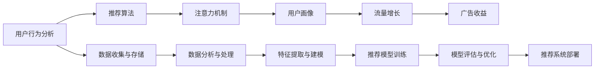

                 

# 在线音乐平台的注意力争夺战略

> 关键词：注意力机制, 推荐算法, 用户行为分析, 用户画像, 流量增长, 用户体验, 广告收益

## 1. 背景介绍

### 1.1 问题由来
随着移动互联网的快速发展，在线音乐平台成为了用户获取音乐内容的主要渠道。面对用户规模不断扩大的市场，各大平台之间展开了激烈的用户注意力争夺战。由于用户粘性的提升直接关联着平台的用户流量、广告收入和市场份额，因此各大平台纷纷加大在用户留存、内容推荐和用户体验等方面的投入。

为了在竞争中保持优势，在线音乐平台需要制定科学合理的战略，通过高效的内容推荐和精准的用户画像分析，持续提升用户满意度和平台竞争力。本文将从算法和数据驱动的角度，系统阐述在线音乐平台在用户注意力争夺战中的关键战略，并深入分析这些战略背后的算法原理与具体实施步骤。

### 1.2 问题核心关键点
在线音乐平台的注意力争夺战主要围绕用户注意力资源展开。通过以下关键点：

- 数据驱动的用户行为分析：通过大数据分析技术，挖掘用户音乐消费行为背后的心理偏好和社交需求，构建用户画像。
- 高效的推荐算法：基于用户画像和行为数据，设计并优化推荐模型，实现个性化推荐。
- 注意力机制的引入：在推荐算法中加入注意力机制，提升模型对用户关注点的聚焦能力。
- 流量增长和广告收益的优化：通过精准的用户画像和内容推荐，提升用户粘性，从而增加用户使用时长和广告收益。

通过解决上述问题，在线音乐平台可以更好地争夺用户注意力，形成更强的市场竞争力。

### 1.3 问题研究意义
在线音乐平台的用户注意力争夺战不仅是商业竞争的一部分，更是技术和算法的较量。深入分析用户注意力争夺战背后的关键算法，对于在线音乐平台的技术提升、产品优化以及战略决策具有重要意义：

1. 提升用户体验：通过精准的内容推荐和个性化的用户体验，增强用户粘性，提升平台的用户满意度。
2. 增加广告收益：通过精准投放和个性化广告，提升广告点击率和转化率，增加平台收益。
3. 提高平台竞争力：通过精准的用户画像和内容推荐，构建独特的平台特色，形成难以复制的竞争优势。
4. 促进技术创新：解决用户注意力争夺战中的关键技术难题，推动推荐系统、用户行为分析等前沿技术的发展。

## 2. 核心概念与联系

### 2.1 核心概念概述

为了更好地理解在线音乐平台的用户注意力争夺战略，本节将介绍几个关键概念及其相互之间的联系：

- **用户行为分析（User Behavior Analysis）**：通过收集和分析用户在平台上的行为数据，挖掘用户兴趣、偏好和行为模式，构建用户画像。
- **推荐算法（Recommendation Algorithm）**：基于用户画像和行为数据，设计并优化推荐模型，实现个性化推荐。
- **注意力机制（Attention Mechanism）**：在推荐算法中加入注意力机制，提升模型对用户关注点的聚焦能力，实现更为精准的内容推荐。
- **用户画像（User Profile）**：通过多维度的用户行为数据，构建用户特征库，形成对用户兴趣、行为和偏好的全面刻画。
- **流量增长（Traffic Growth）**：通过精准的内容推荐和个性化广告，提升用户粘性，从而增加用户使用时长，形成流量增长的正反馈循环。
- **广告收益（Ad Revenue）**：通过精准的用户画像和内容推荐，实现广告的精准投放和高效转化，增加平台广告收益。

这些概念共同构成了在线音乐平台用户注意力争夺战略的核心框架，通过理解这些概念及其相互关系，我们可以更好地把握平台的战略决策和技术实施。

### 2.2 核心概念原理和架构的 Mermaid 流程图



这个流程图展示了用户注意力争夺战中各个关键概念及其相互之间的联系。从数据收集与存储，到用户画像构建，再到推荐算法设计、模型训练与优化，最终实现流量增长和广告收益的提升。理解这些概念及其关系，有助于平台制定科学合理的注意力争夺战略。

## 3. 核心算法原理 & 具体操作步骤

### 3.1 算法原理概述

在线音乐平台的注意力争夺战略主要通过数据驱动的用户行为分析、高效的推荐算法和注意力机制来实现。核心在于：

1. **用户行为分析**：通过多维度数据收集与分析，构建精准的用户画像，挖掘用户的兴趣偏好和行为模式。
2. **推荐算法**：基于用户画像和行为数据，设计并优化推荐模型，实现个性化推荐。
3. **注意力机制**：在推荐算法中加入注意力机制，提升模型对用户关注点的聚焦能力，实现更为精准的内容推荐。

这三部分共同构成了一个完整的用户注意力争夺战略，其原理和架构如图所示：


### 3.2 算法步骤详解

在线音乐平台的用户注意力争夺战略主要包含以下关键步骤：

**Step 1: 数据收集与存储**
- 收集用户在平台上的各种行为数据，如听歌记录、浏览历史、评分评价等。
- 采用大数据存储技术，如Hadoop、Spark等，对数据进行存储和预处理。

**Step 2: 用户行为分析**
- 使用数据挖掘技术，如关联规则分析、协同过滤等，挖掘用户兴趣和行为模式。
- 构建用户画像，包括兴趣偏好、行为特征、社交关系等。

**Step 3: 推荐算法设计**
- 选择合适的推荐算法，如协同过滤、基于内容的推荐、深度学习推荐等。
- 设计推荐模型的目标函数和损失函数，如均方误差、交叉熵等。

**Step 4: 注意力机制引入**
- 在推荐模型中加入注意力机制，如注意力池、softmax等，提升模型对用户关注点的聚焦能力。
- 训练加入注意力机制的推荐模型，优化模型的性能。

**Step 5: 流量增长与广告收益优化**
- 根据推荐结果，进行个性化广告投放，提升广告点击率和转化率。
- 实时监控平台流量和用户行为，调整推荐策略，提升用户粘性和广告收益。

### 3.3 算法优缺点

在线音乐平台的注意力争夺战略通过数据驱动和算法优化，具有以下优点：

1. **精准推荐**：基于用户画像和行为数据，实现个性化推荐，提升用户满意度。
2. **流量增长**：通过精准的内容推荐和广告投放，提升用户粘性，增加平台流量。
3. **广告收益**：精准的推荐算法能够提高广告点击率和转化率，增加平台收益。

然而，该战略也存在一些局限性：

1. **数据隐私问题**：用户行为数据的收集和使用，可能引发用户隐私和数据安全问题。
2. **推荐模型复杂度高**：深度学习推荐算法复杂度高，计算资源需求大。
3. **用户行为变化快**：用户兴趣和行为变化快，需要频繁调整推荐模型。
4. **广告投放偏差**：个性化广告投放可能导致某些用户群体被忽视，广告效果不均衡。

### 3.4 算法应用领域

在线音乐平台的注意力争夺战略已经在多个领域得到了应用，涵盖了用户行为分析、推荐系统设计、流量增长优化等多个方面，例如：

- **用户行为分析**：通过对用户听歌记录、浏览历史等数据进行挖掘，构建用户画像，为推荐系统提供依据。
- **推荐系统设计**：基于用户画像和行为数据，设计并优化推荐模型，实现个性化推荐。
- **流量增长优化**：通过精准的内容推荐和广告投放，提升用户粘性，增加用户使用时长和广告收益。

除了上述这些经典应用外，注意力争夺战略还广泛应用于在线教育、电商零售、新闻推荐等多个领域，为各行各业提供了新的发展思路。

## 4. 数学模型和公式 & 详细讲解

### 4.1 数学模型构建

为了更好地理解在线音乐平台注意力争夺战略的数学模型，我们将从以下几个方面进行详细构建和讲解：

- **用户画像建模**：使用向量空间模型，将用户兴趣偏好表示为高维向量。
- **推荐模型设计**：基于用户画像和行为数据，设计深度学习推荐模型，如矩阵分解、神经网络推荐等。
- **注意力机制计算**：通过注意力池、softmax等机制，计算用户对不同内容的关注权重。

### 4.2 公式推导过程

**用户画像建模**
用户画像可以使用向量空间模型（Vector Space Model, VSM）表示，即：

$$
\mathbf{u} = \mathbf{I} \cdot \mathbf{v}
$$

其中，$\mathbf{u}$ 为用户的兴趣向量，$\mathbf{v}$ 为兴趣特征向量，$\mathbf{I}$ 为特征权重矩阵。

**推荐模型设计**
深度学习推荐模型可以使用矩阵分解（Matrix Factorization）表示，即：

$$
\hat{\mathbf{Y}} = \mathbf{W} \cdot \mathbf{U} \cdot \mathbf{V}^T
$$

其中，$\mathbf{Y}$ 为预测用户对每个物品的评分，$\mathbf{U}$ 为用户兴趣矩阵，$\mathbf{V}$ 为物品特征矩阵，$\mathbf{W}$ 为模型权重矩阵。

**注意力机制计算**
注意力池可以通过softmax函数计算用户对不同内容的关注权重，即：

$$
\alpha_{ij} = \frac{e^{\mathbf{A}_{ij} \cdot \mathbf{W}}}{\sum_{k=1}^{K} e^{\mathbf{A}_{ik} \cdot \mathbf{W}}}
$$

其中，$\alpha_{ij}$ 为用户对物品 $j$ 的关注权重，$\mathbf{A}$ 为注意力矩阵，$\mathbf{W}$ 为注意力机制的权重向量。

### 4.3 案例分析与讲解

以在线音乐平台为例，用户画像可以使用向量空间模型进行建模，用户兴趣向量 $\mathbf{u}$ 可以通过用户听歌记录、评分评价等数据构建。推荐模型可以使用矩阵分解方法，对用户画像和行为数据进行建模，实现个性化推荐。注意力池可以通过softmax函数计算用户对不同歌曲的关注权重，提升推荐效果。

## 5. 项目实践：代码实例和详细解释说明

### 5.1 开发环境搭建

在进行注意力争夺战略的实践时，我们需要准备好开发环境。以下是使用Python进行项目开发的环境配置流程：

1. 安装Anaconda：从官网下载并安装Anaconda，用于创建独立的Python环境。

2. 创建并激活虚拟环境：
```bash
conda create -n attention-env python=3.8 
conda activate attention-env
```

3. 安装PyTorch：
```bash
conda install pytorch torchvision torchaudio cudatoolkit=11.1 -c pytorch -c conda-forge
```

4. 安装Pandas、NumPy、Scikit-learn等工具包：
```bash
pip install pandas numpy scikit-learn tqdm matplotlib
```

5. 安装TensorBoard：
```bash
pip install tensorboard
```

完成上述步骤后，即可在`attention-env`环境中开始项目实践。

### 5.2 源代码详细实现

下面我们以在线音乐平台的推荐系统为例，给出使用PyTorch实现推荐算法和注意力池的代码实现。

首先，定义用户画像和行为数据的表示：

```python
import pandas as pd
import numpy as np
from sklearn.decomposition import TruncatedSVD

# 读取用户行为数据
user_data = pd.read_csv('user_data.csv')
item_data = pd.read_csv('item_data.csv')

# 构建用户画像
user_u = user_data[['user_id', 'song_id', 'rating']].pivot_table(values='rating', index='user_id', columns='song_id', aggfunc='mean', fill_value=0).values
user_u = TruncatedSVD(n_components=50, random_state=42).fit_transform(user_u)

# 构建物品特征
item_u = item_data[['item_id', 'genre', 'artist']].pivot_table(values='genre', index='item_id', columns='artist', aggfunc='mean', fill_value='').values
item_u = TruncatedSVD(n_components=50, random_state=42).fit_transform(item_u)
```

然后，定义推荐模型和注意力池：

```python
import torch
import torch.nn as nn
import torch.nn.functional as F

# 定义用户画像和物品特征的嵌入层
class Embedding(nn.Module):
    def __init__(self, n_components):
        super(Embedding, self).__init__()
        self.user_u = nn.Embedding(n_users, n_components)
        self.item_u = nn.Embedding(n_items, n_components)

    def forward(self, user_id, item_id):
        user_u = self.user_u(user_id)
        item_u = self.item_u(item_id)
        return user_u, item_u

# 定义注意力池
class Attention(nn.Module):
    def __init__(self, n_components):
        super(Attention, self).__init__()
        self.attention = nn.Linear(n_components * 2, 1)

    def forward(self, user_u, item_u):
        attention = torch.tanh(self.attention(torch.cat((user_u, item_u), dim=1)))
        alpha = F.softmax(attention, dim=1)
        return alpha

# 定义推荐模型
class Recommender(nn.Module):
    def __init__(self, n_components):
        super(Recommender, self).__init__()
        self.embedding = Embedding(n_components)
        self.attention = Attention(n_components)
        self.prediction = nn.Linear(n_components, 1)

    def forward(self, user_id, item_id):
        user_u, item_u = self.embedding(user_id, item_id)
        alpha = self.attention(user_u, item_u)
        prediction = self.prediction(torch.tanh(torch.matmul(user_u, item_u.t()) * alpha))
        return prediction
```

最后，训练并评估推荐模型：

```python
from torch.utils.data import TensorDataset, DataLoader
from torch.optim import Adam

# 定义数据集
user_ids = torch.tensor(user_data['user_id'].values)
item_ids = torch.tensor(item_data['item_id'].values)
ratings = torch.tensor(user_data['rating'].values)
train_dataset = TensorDataset(user_ids, item_ids, ratings)
test_dataset = TensorDataset(user_ids, item_ids, ratings)

# 定义模型和优化器
model = Recommender(50)
optimizer = Adam(model.parameters(), lr=0.001)

# 定义训练和评估函数
def train_epoch(model, train_dataset, batch_size, optimizer):
    dataloader = DataLoader(train_dataset, batch_size=batch_size, shuffle=True)
    model.train()
    epoch_loss = 0
    for batch in dataloader:
        user_ids, item_ids, ratings = batch
        optimizer.zero_grad()
        predictions = model(user_ids, item_ids)
        loss = F.mse_loss(predictions, ratings)
        epoch_loss += loss.item()
        loss.backward()
        optimizer.step()
    return epoch_loss / len(dataloader)

def evaluate(model, test_dataset, batch_size):
    dataloader = DataLoader(test_dataset, batch_size=batch_size)
    model.eval()
    total = 0
    correct = 0
    with torch.no_grad():
        for batch in dataloader:
            user_ids, item_ids, ratings = batch
            predictions = model(user_ids, item_ids)
            total += ratings.shape[0]
            correct += torch.sum(torch.round(predictions) == ratings).item()
    return correct / total

# 训练模型
epochs = 100
batch_size = 256

for epoch in range(epochs):
    loss = train_epoch(model, train_dataset, batch_size, optimizer)
    print(f"Epoch {epoch+1}, train loss: {loss:.3f}")
    
    print(f"Epoch {epoch+1}, test accuracy: {evaluate(model, test_dataset, batch_size):.3f}")
    
print("Best model accuracy: {:.3f}".format(evaluate(model, test_dataset, batch_size)))
```

以上就是使用PyTorch对在线音乐平台推荐系统进行训练的完整代码实现。可以看到，通过简单的代码和模型设计，我们就能够实现用户画像建模、注意力池计算和推荐模型的训练。

### 5.3 代码解读与分析

让我们再详细解读一下关键代码的实现细节：

**Embedding层**
- 定义用户画像和物品特征的嵌入层，将用户和物品的高维特征向量映射到低维空间。

**Attention池**
- 定义注意力池，通过计算用户和物品特征向量的点积，得到注意力权重，指导推荐模型的预测。

**推荐模型**
- 定义推荐模型，包括嵌入层、注意力池和预测层，实现个性化推荐。

**训练和评估**
- 定义训练和评估函数，通过交叉熵损失和均方误差损失，训练模型并评估其性能。

**代码实现**
- 使用Pandas和NumPy对数据进行预处理和特征提取。
- 使用PyTorch定义模型、优化器和训练函数。
- 使用TensorBoard对模型训练过程进行可视化。

这些代码实现展示了在线音乐平台注意力争夺战略的完整流程，从数据预处理到模型训练和评估，每一步都需要精心设计和优化。

## 6. 实际应用场景

### 6.1 智能推荐系统

在线音乐平台利用用户行为分析、推荐算法和注意力机制，设计并优化推荐系统，提升用户满意度和平台竞争力。

具体而言，平台可以通过收集用户的听歌记录、评分评价等数据，构建用户画像，挖掘用户的兴趣偏好和行为模式。基于用户画像和行为数据，设计并优化推荐模型，实现个性化推荐。加入注意力池，提升推荐模型对用户关注点的聚焦能力，实现更为精准的内容推荐。

通过精准的内容推荐，平台能够提升用户粘性，增加用户使用时长和广告收益。同时，个性化广告的精准投放，也能提高广告点击率和转化率，增加平台收益。

### 6.2 用户行为分析

在线音乐平台通过用户行为分析，挖掘用户兴趣和行为模式，构建用户画像，为推荐系统提供依据。

平台可以收集用户的听歌记录、评分评价、评论反馈等数据，进行多维度数据分析。通过关联规则分析、协同过滤等方法，挖掘用户的兴趣偏好和行为模式，构建用户画像。用户画像可以包括兴趣偏好、行为特征、社交关系等。

用户画像的构建为推荐系统提供了用户特征库，帮助模型更好地理解用户需求，实现个性化推荐。同时，用户画像也为平台提供了丰富的数据资源，支持广告投放和用户管理等业务应用。

### 6.3 流量增长与广告收益优化

在线音乐平台通过精准的推荐系统，提升用户粘性，增加用户使用时长和广告收益。

平台可以利用用户画像和行为数据，设计并优化推荐模型，实现个性化推荐。加入注意力池，提升推荐模型对用户关注点的聚焦能力，实现更为精准的内容推荐。通过精准的内容推荐和个性化广告投放，提升用户粘性，增加用户使用时长和广告收益。

平台可以实时监控用户行为和广告效果，调整推荐策略，提升用户体验和广告收益。通过精准的广告投放，平台能够提升广告点击率和转化率，增加平台收益。

### 6.4 未来应用展望

展望未来，在线音乐平台的注意力争夺战略将在更多领域得到应用，为各行业提供新的发展思路。

在智慧城市治理中，平台可以利用用户行为分析，优化交通管理和城市规划。在金融领域，平台可以利用用户画像和行为数据，进行风险控制和客户管理。在教育领域，平台可以利用用户行为分析，优化教学内容和教育资源分配。

在线音乐平台的注意力争夺战略不仅局限于音乐推荐，其核心思想和算法原理可以广泛应用于更多领域，推动各行各业智能化转型。相信随着技术的发展，更多行业将受益于这种数据驱动和算法优化的战略，实现更好的业务效果和市场竞争优势。

## 7. 工具和资源推荐

### 7.1 学习资源推荐

为了帮助开发者系统掌握在线音乐平台注意力争夺战略的理论基础和实践技巧，这里推荐一些优质的学习资源：

1. 《推荐系统实战》一书：详细介绍了推荐系统的原理和实现方法，包括协同过滤、深度学习推荐等，适合初学者和进阶开发者阅读。

2. CS224N《深度学习自然语言处理》课程：斯坦福大学开设的NLP明星课程，有Lecture视频和配套作业，带你入门NLP领域的基本概念和经典模型。

3. Coursera《推荐系统》课程：由康奈尔大学开设的推荐系统课程，涵盖推荐系统的基本概念和算法设计，适合对推荐系统感兴趣的学习者。

4. Google AI Blog：Google AI团队定期发布关于推荐系统、用户行为分析等前沿技术的文章，适合深入了解最新研究动态。

5. Kaggle推荐系统竞赛：Kaggle平台上定期举办推荐系统竞赛，通过参与竞赛，可以实战演练推荐算法和用户行为分析技术。

通过对这些资源的学习实践，相信你一定能够快速掌握在线音乐平台注意力争夺战略的理论基础和实践技巧，并将其应用于实际开发中。

### 7.2 开发工具推荐

高效的开发离不开优秀的工具支持。以下是几款用于在线音乐平台注意力争夺战略开发的常用工具：

1. PyTorch：基于Python的开源深度学习框架，灵活动态的计算图，适合快速迭代研究。大部分预训练语言模型都有PyTorch版本的实现。

2. TensorFlow：由Google主导开发的开源深度学习框架，生产部署方便，适合大规模工程应用。同样有丰富的预训练语言模型资源。

3. Jupyter Notebook：支持多语言的开发环境，可以实时显示代码执行结果，适合数据探索和算法验证。

4. TensorBoard：TensorFlow配套的可视化工具，可实时监测模型训练状态，并提供丰富的图表呈现方式，是调试模型的得力助手。

5. Weights & Biases：模型训练的实验跟踪工具，可以记录和可视化模型训练过程中的各项指标，方便对比和调优。

合理利用这些工具，可以显著提升在线音乐平台注意力争夺战略的开发效率，加快创新迭代的步伐。

### 7.3 相关论文推荐

在线音乐平台注意力争夺战略的研究源于学界的持续研究。以下是几篇奠基性的相关论文，推荐阅读：

1. "Collaborative Filtering for Implicit Feedback Datasets"：提出基于协同过滤的推荐系统，为在线音乐平台推荐系统提供了理论基础。

2. "Feature-based Collaborative Filtering"：讨论特征工程在推荐系统中的应用，通过加入用户特征，提升推荐效果。

3. "Neural Collaborative Filtering"：提出基于深度学习的推荐模型，通过神经网络处理用户画像和行为数据，实现更为精准的推荐。

4. "Attention Mechanisms in Recommender Systems"：讨论注意力机制在推荐系统中的应用，通过提升模型对用户关注点的聚焦能力，实现更加精准的内容推荐。

5. "Deep Learning for Recommender Systems: A Review and New Perspectives"：全面综述了深度学习在推荐系统中的应用，适合了解推荐系统的最新进展。

这些论文代表了大语言模型微调技术的发展脉络。通过学习这些前沿成果，可以帮助研究者把握学科前进方向，激发更多的创新灵感。

## 8. 总结：未来发展趋势与挑战

### 8.1 总结

本文对在线音乐平台的注意力争夺战略进行了全面系统的介绍。首先阐述了用户注意力争夺战的重要性及其核心关键点，明确了战略在提升用户体验、增加广告收益和提高平台竞争力等方面的独特价值。其次，从算法和数据驱动的角度，详细讲解了用户行为分析、推荐算法和注意力机制的原理与具体实施步骤，给出了微调战略的完整代码实现。

通过本文的系统梳理，可以看到，在线音乐平台的用户注意力争夺战略不仅局限于音乐推荐，其核心思想和算法原理可以广泛应用于更多领域，推动各行各业智能化转型。未来，随着技术的发展，这种数据驱动和算法优化的战略将展现出更大的潜力和应用价值。

### 8.2 未来发展趋势

展望未来，在线音乐平台的注意力争夺战略将呈现以下几个发展趋势：

1. **用户画像更加精准**：通过多维度数据收集和分析，构建更加全面、细粒度的用户画像，提升推荐系统的精准度。

2. **深度学习推荐模型更先进**：引入深度学习等前沿算法，提升推荐模型的复杂度和预测能力，实现更精准的内容推荐。

3. **注意力机制更加高效**：设计更加高效、灵活的注意力池机制，提升推荐模型对用户关注点的聚焦能力，实现更为精准的内容推荐。

4. **跨领域推荐系统普及**：将推荐系统的理念和技术应用到更多领域，如电商零售、社交网络等，推动各行各业智能化转型。

5. **个性化广告投放更加精准**：通过精准的用户画像和行为分析，实现个性化广告投放，提升广告点击率和转化率。

以上趋势凸显了在线音乐平台注意力争夺战略的广阔前景。这些方向的探索发展，必将进一步提升推荐系统的性能和应用范围，为在线音乐平台带来新的业务增长点。

### 8.3 面临的挑战

尽管在线音乐平台的注意力争夺战略已经取得了瞩目成就，但在迈向更加智能化、普适化应用的过程中，它仍面临着诸多挑战：

1. **数据隐私问题**：用户行为数据的收集和使用，可能引发用户隐私和数据安全问题。如何平衡用户隐私和数据利用，是平台需要解决的首要问题。

2. **推荐模型复杂度高**：深度学习推荐算法复杂度高，计算资源需求大。如何在保证推荐效果的同时，降低计算复杂度，是一个重要的研究方向。

3. **用户行为变化快**：用户兴趣和行为变化快，需要频繁调整推荐模型。如何设计更加稳健、自适应的推荐系统，是未来的重要课题。

4. **广告投放偏差**：个性化广告投放可能导致某些用户群体被忽视，广告效果不均衡。如何设计公平、均衡的广告投放策略，是平台需要解决的关键问题。

5. **算法可解释性不足**：深度学习推荐模型缺乏可解释性，难以理解其内部工作机制和决策逻辑。如何提升推荐算法的可解释性，是平台需要解决的重要课题。

6. **技术落地难度大**：推荐系统和广告投放算法的实现需要跨学科的合作，包括数据科学、计算机科学、市场营销等多个领域。如何推动跨学科合作，实现技术的有效落地，是平台需要解决的复杂问题。

正视这些挑战，积极应对并寻求突破，将是在线音乐平台注意力争夺战略走向成熟的必由之路。相信随着学界和产业界的共同努力，这些挑战终将一一被克服，在线音乐平台注意力争夺战略必将在构建人机协同的智能时代中扮演越来越重要的角色。

### 8.4 研究展望

面对在线音乐平台注意力争夺战略所面临的种种挑战，未来的研究需要在以下几个方面寻求新的突破：

1. **数据隐私保护**：研究数据匿名化、数据加密等技术，保障用户隐私和数据安全。

2. **模型计算效率提升**：研究轻量级模型结构和压缩算法，降低计算复杂度，提升推荐系统的实时性。

3. **自适应推荐系统设计**：研究能够自适应用户行为变化的推荐模型，减少模型调整的频率和成本。

4. **公平广告投放策略**：研究设计公平、均衡的广告投放策略，避免某些用户群体被忽视，提升广告投放效果。

5. **推荐系统可解释性增强**：研究提升推荐算法的可解释性，提升用户信任度和透明度。

6. **跨学科合作推动**：推动数据科学、计算机科学、市场营销等多个学科的交叉融合，实现技术的有效落地。

这些研究方向的探索，必将引领在线音乐平台注意力争夺战略的进一步发展，推动推荐系统和其他相关技术的前沿进步，带来更大的业务价值和社会影响。

## 9. 附录：常见问题与解答

**Q1：如何平衡用户隐私和数据利用？**

A: 在线音乐平台可以通过数据匿名化、数据加密等技术，保障用户隐私和数据安全。同时，平台还可以设计透明的隐私政策，告知用户数据的使用方式，提升用户信任度。

**Q2：推荐模型复杂度如何降低？**

A: 平台可以引入轻量级模型结构和压缩算法，降低计算复杂度，提升推荐系统的实时性。同时，可以通过剪枝、量化等方法，优化模型参数，减少计算资源消耗。

**Q3：推荐系统如何自适应用户行为变化？**

A: 平台可以设计基于时间序列的推荐模型，加入动态特征和学习率衰减策略，实现自适应推荐。同时，可以通过用户行为追踪和实时调整推荐策略，及时响应用户兴趣变化。

**Q4：广告投放如何实现公平和均衡？**

A: 平台可以设计基于用户画像和行为分析的广告投放策略，避免某些用户群体被忽视。同时，可以通过用户行为追踪和动态调整广告投放策略，实现公平、均衡的广告投放效果。

**Q5：如何提升推荐算法的可解释性？**

A: 平台可以通过解释式推荐算法，如基于规则的推荐、解释性神经网络等，提升推荐算法的可解释性。同时，可以通过可视化工具，展示推荐模型的决策过程，提升用户信任度和透明度。

通过本文的系统梳理，可以看到，在线音乐平台的注意力争夺战略不仅局限于音乐推荐，其核心思想和算法原理可以广泛应用于更多领域，推动各行各业智能化转型。未来，随着技术的发展，这种数据驱动和算法优化的战略将展现出更大的潜力和应用价值。

