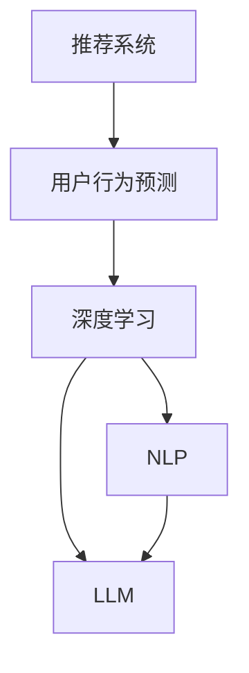

                 

# 基于LLM的推荐系统用户行为预测

> 关键词：推荐系统,用户行为预测,深度学习,自然语言处理,大语言模型(LLM)

## 1. 背景介绍

### 1.1 问题由来
推荐系统是互联网时代的关键应用之一，能够显著提升用户满意度，增加业务收益。传统的推荐方法，如协同过滤、基于内容的推荐，往往依赖用户行为历史和物品属性等数据。然而，这些方法难以解释推荐过程的因果关系，且容易受到数据稀疏性和新物品冷启动等问题的困扰。

近年来，大语言模型(Large Language Model, LLM)在自然语言处理(NLP)领域取得了显著进展，特别是以GPT、BERT为代表的预训练大模型，在多模态、跨领域、少样本学习等方向展现了强大的应用潜力。这使得将大语言模型应用于推荐系统，成为一种新的趋势。基于LLM的推荐系统，利用大模型的语言理解能力，从用户评论、文本数据中挖掘和推理用户行为特征，形成更加精准、动态的推荐模型。

### 1.2 问题核心关键点
本论文聚焦于基于大语言模型推荐系统用户行为预测的核心关键点：

1. 利用LLM挖掘用户行为特征：用户评论、文本数据等非结构化数据，蕴含了大量语义信息，是推荐系统的重要特征来源。
2. 利用LLM建立推荐决策模型：LLM能够从复杂语义中提取因果关系，形成推荐决策的因果链，从而提高推荐效果。
3. 利用LLM进行交互预测：LLM能够理解用户意图，预测未来行为，进行动态推荐，提升用户体验。

## 2. 核心概念与联系

### 2.1 核心概念概述

为更好地理解基于大语言模型的推荐系统用户行为预测，本节将介绍几个密切相关的核心概念：

- 推荐系统(Recommendation System)：利用算法为用户推荐物品的系统，广泛应用在电商、视频、音乐等互联网产品中。
- 用户行为预测(User Behavior Prediction)：通过用户历史行为数据，预测用户未来行为，提升推荐效果。
- 深度学习(Deep Learning)：利用多层神经网络模型，从海量数据中提取高级抽象特征，实现复杂任务。
- 自然语言处理(Natural Language Processing, NLP)：利用人工智能技术处理和理解人类语言，是推荐系统的重要数据源之一。
- 大语言模型(Large Language Model, LLM)：以自回归(如GPT)或自编码(如BERT)模型为代表，通过大规模无标签文本语料进行预训练，学习通用的语言表示。

这些核心概念之间的逻辑关系可以通过以下Mermaid流程图来展示：



这个流程图展示了大语言模型与推荐系统的核心概念及其之间的关系：

1. 推荐系统依赖于用户行为预测，通过精准预测提升推荐效果。
2. 用户行为预测主要依赖深度学习技术，利用模型提取高阶特征。
3. 深度学习的重要特征来源之一是NLP技术，能够从文本数据中提取语义信息。
4. 自然语言处理中的大语言模型，提供了高效、通用的特征提取工具，能够帮助推荐系统更好地理解用户需求。

## 3. 核心算法原理 & 具体操作步骤
### 3.1 算法原理概述

基于大语言模型推荐系统用户行为预测，本质上是一种结合深度学习和NLP技术的复杂模型。其核心思想是：利用大语言模型从用户评论、文本数据中挖掘语义信息，提取用户行为特征，建立因果关系，预测用户未来行为。

形式化地，假设用户行为为 $y$，与用户历史行为数据 $x$ 相关联。定义用户行为预测模型 $M_{\theta}$，其中 $\theta$ 为模型参数。在深度学习框架下，推荐系统用户行为预测的目标是：

$$
\hat{y} = M_{\theta}(x)
$$

即使用模型 $M_{\theta}$ 对用户行为 $y$ 进行预测。在训练过程中，我们通常使用交叉熵损失函数：

$$
\mathcal{L} = -\frac{1}{N}\sum_{i=1}^N(y_i\log \hat{y}_i + (1-y_i)\log(1-\hat{y}_i))
$$

其中 $y_i$ 为第 $i$ 个样本的真实标签，$\hat{y}_i$ 为模型预测值。通过梯度下降等优化算法，最小化损失函数 $\mathcal{L}$，即可得到用户行为预测模型。

### 3.2 算法步骤详解

基于大语言模型推荐系统用户行为预测的一般步骤如下：

**Step 1: 数据预处理**
- 收集用户历史行为数据，包括点击、购买、评分等行为。
- 收集用户评论、产品描述等文本数据，作为推荐模型的语义特征。
- 对文本数据进行分词、去停用词、词向量化等预处理。

**Step 2: 构建语义特征**
- 利用大语言模型对用户评论进行预训练，得到用户语义表示 $x$。
- 对用户行为数据进行向量化处理，得到行为特征向量 $y$。

**Step 3: 训练推荐模型**
- 选择深度学习模型，如循环神经网络(RNN)、卷积神经网络(CNN)、Transformer等。
- 将语义特征 $x$ 和行为特征 $y$ 作为模型输入，使用交叉熵损失函数训练模型。
- 利用提前终止等技术避免过拟合。

**Step 4: 预测用户行为**
- 对新用户行为进行预处理，得到输入 $x'$。
- 将 $x'$ 输入训练好的推荐模型，得到预测值 $\hat{y}'$。
- 根据 $\hat{y}'$ 进行推荐决策。

**Step 5: 模型评估与优化**
- 使用测试集评估模型性能，如准确率、F1分数等。
- 根据评估结果优化模型参数，继续迭代训练。

### 3.3 算法优缺点

基于大语言模型推荐系统用户行为预测的优点包括：

1. 高维语义特征提取：大语言模型能够从复杂语义中提取高阶特征，显著提升推荐效果。
2. 跨领域学习能力：大语言模型具备跨领域泛化能力，能从不同领域的文本数据中学习语义知识。
3. 动态推荐能力：利用大语言模型建立因果关系，预测用户未来行为，实现动态推荐。

缺点主要包括：

1. 数据量需求高：大语言模型需要大量数据进行预训练，才能形成高质量的语义特征。
2. 计算复杂度高：预训练大模型参数量庞大，训练和推理计算复杂度高。
3. 模型解释性差：基于大语言模型的推荐系统难以解释推荐过程的因果关系，难以调试和优化。

尽管存在这些局限性，但大语言模型推荐系统仍是一种具有巨大潜力的推荐范式，能够显著提升推荐系统的精准性和用户体验。

### 3.4 算法应用领域

基于大语言模型推荐系统用户行为预测，已经广泛应用于电商、视频、音乐等多个领域，为推荐系统带来了新的突破：

- 电商推荐：利用用户评论、商品描述等文本数据，形成用户语义表示，结合点击、购买等行为数据，提升推荐效果。
- 视频推荐：对用户评论、评分等文本数据进行情感分析，结合观看行为数据，进行多维推荐。
- 音乐推荐：利用歌曲评论、歌词等文本数据，结合收听行为数据，实现歌词推荐、音乐风格推荐等功能。
- 新闻推荐：利用新闻标题、评论等文本数据，结合点击、阅读行为数据，进行内容推荐和个性化阅读。

此外，大语言模型在新闻内容生成、广告投放、知识推荐等场景中也有重要应用，显示了其强大的语义理解和推荐能力。

## 4. 数学模型和公式 & 详细讲解 & 举例说明
### 4.1 数学模型构建

本节将使用数学语言对基于大语言模型推荐系统用户行为预测过程进行严格刻画。

假设推荐系统的输入为 $x$，包含用户评论、文本数据等。输出为 $y$，表示用户未来行为。定义用户行为预测模型 $M_{\theta}$，其中 $\theta$ 为模型参数。

用户行为预测的目标是：
$$
\hat{y} = M_{\theta}(x)
$$

定义损失函数为交叉熵损失函数：
$$
\mathcal{L} = -\frac{1}{N}\sum_{i=1}^N(y_i\log \hat{y}_i + (1-y_i)\log(1-\hat{y}_i))
$$

其中 $y_i$ 为第 $i$ 个样本的真实标签，$\hat{y}_i$ 为模型预测值。

### 4.2 公式推导过程

以下我们以电商推荐为例，推导基于大语言模型的推荐模型训练公式。

假设用户评论为 $x_i$，对应的用户行为标签为 $y_i \in \{0,1\}$，其中 $y_i=1$ 表示用户购买了该商品，$y_i=0$ 表示用户未购买。定义推荐模型 $M_{\theta}$，其中 $\theta$ 为模型参数。

通过大语言模型对用户评论进行预训练，得到用户语义表示 $x_i$。将用户语义表示 $x_i$ 和用户行为标签 $y_i$ 作为模型输入，定义损失函数：
$$
\mathcal{L} = -\frac{1}{N}\sum_{i=1}^N(y_i\log \hat{y}_i + (1-y_i)\log(1-\hat{y}_i))
$$

在训练过程中，利用梯度下降等优化算法更新模型参数：
$$
\theta \leftarrow \theta - \eta \nabla_{\theta}\mathcal{L}(\theta)
$$

其中 $\eta$ 为学习率，$\nabla_{\theta}\mathcal{L}(\theta)$ 为损失函数对模型参数的梯度。

### 4.3 案例分析与讲解

假设我们收集了电商平台上某商品的100条用户评论，每个评论长度为500，构建用户评论文本数据集 $D$。利用BERT模型对每个评论进行预训练，得到用户语义表示 $x_i \in \mathbb{R}^d$，其中 $d$ 为BERT模型的输出维度。假设每个评论对应一个用户行为标签 $y_i \in \{0,1\}$。

我们使用一个简单的二分类模型 $M_{\theta}(x) = \sigma(Wx + b)$ 进行训练，其中 $W$ 和 $b$ 为模型参数。在训练过程中，将每个评论 $x_i$ 和对应标签 $y_i$ 输入模型，使用交叉熵损失函数 $\mathcal{L} = -\frac{1}{N}\sum_{i=1}^N(y_i\log \hat{y}_i + (1-y_i)\log(1-\hat{y}_i))$ 进行优化。通过梯度下降算法更新模型参数，直至收敛。

训练完成后，对于新的电商商品 $x'$，利用相同的预训练和模型，得到用户语义表示 $x'$ 和预测值 $\hat{y}' = M_{\theta}(x')$。根据 $\hat{y}'$ 的大小，判断用户是否会购买该商品，进行推荐决策。

## 5. 项目实践：代码实例和详细解释说明
### 5.1 开发环境搭建

在进行项目实践前，我们需要准备好开发环境。以下是使用Python进行TensorFlow开发的环境配置流程：

1. 安装Anaconda：从官网下载并安装Anaconda，用于创建独立的Python环境。

2. 创建并激活虚拟环境：
```bash
conda create -n tf-env python=3.8 
conda activate tf-env
```

3. 安装TensorFlow：根据CUDA版本，从官网获取对应的安装命令。例如：
```bash
conda install tensorflow -c conda-forge -c pytorch
```

4. 安装相关库：
```bash
pip install numpy pandas sklearn scikit-learn matplotlib jupyter notebook ipython
```

完成上述步骤后，即可在`tf-env`环境中开始项目实践。

### 5.2 源代码详细实现

下面我们以电商推荐为例，给出基于TensorFlow的推荐系统用户行为预测的PyTorch代码实现。

首先，定义用户评论和行为数据：

```python
import tensorflow as tf
import numpy as np
from sklearn.model_selection import train_test_split

# 构建用户评论和行为数据
comments = ['商品评论1', '商品评论2', '商品评论3', ...]
labels = [0, 1, 0, 1, 0, 1, ...]  # 0表示未购买，1表示购买
# 将评论和标签进行分词、向量化处理，构建Tensor
# 此处仅作示例，实际应用中需要更详细的预处理步骤
x_train, x_test, y_train, y_test = train_test_split(comments, labels, test_size=0.2)

# 将评论数据进行向量化处理
tokenizer = BertTokenizer.from_pretrained('bert-base-uncased')
train_x = tokenizer.batch_encode_plus(x_train, return_tensors='tf', padding='max_length', max_length=500)
test_x = tokenizer.batch_encode_plus(x_test, return_tensors='tf', padding='max_length', max_length=500)

# 构建Tensor数据集
train_dataset = tf.data.Dataset.from_tensor_slices((train_x['input_ids'], train_x['attention_mask'], y_train))
test_dataset = tf.data.Dataset.from_tensor_slices((test_x['input_ids'], test_x['attention_mask'], y_test))
```

然后，定义模型和优化器：

```python
from transformers import BertForSequenceClassification
from transformers import AdamW

# 定义模型
model = BertForSequenceClassification.from_pretrained('bert-base-uncased', num_labels=2)

# 定义优化器
optimizer = AdamW(model.parameters(), lr=2e-5)
```

接着，定义训练和评估函数：

```python
import matplotlib.pyplot as plt
import numpy as np

# 定义训练函数
def train_epoch(model, dataset, batch_size, optimizer, num_epochs):
    dataloader = tf.data.Dataset.from_tensor_slices((dataset)).batch(batch_size)
    model.train()
    total_loss = 0
    for step, batch in enumerate(dataloader):
        input_ids, attention_mask, labels = batch
        with tf.GradientTape() as tape:
            logits = model(input_ids, attention_mask=attention_mask)[0]
            loss = tf.keras.losses.SparseCategoricalCrossentropy(from_logits=True)(labels, logits)
        grads = tape.gradient(loss, model.trainable_variables)
        optimizer.apply_gradients(zip(grads, model.trainable_variables))
        total_loss += loss.numpy()
    return total_loss / len(dataloader)

# 定义评估函数
def evaluate(model, dataset, batch_size):
    dataloader = tf.data.Dataset.from_tensor_slices(dataset).batch(batch_size)
    model.eval()
    predictions, labels = [], []
    for step, batch in enumerate(dataloader):
        input_ids, attention_mask, labels = batch
        logits = model(input_ids, attention_mask=attention_mask)[0]
        predictions.append(np.argmax(logits.numpy(), axis=1))
        labels.append(labels.numpy())
    return predictions, labels

# 定义训练和评估流程
batch_size = 16
epochs = 5

for epoch in range(epochs):
    total_loss = train_epoch(model, train_dataset, batch_size, optimizer, num_epochs)
    print(f"Epoch {epoch+1}, train loss: {total_loss:.3f}")

    predictions, labels = evaluate(model, test_dataset, batch_size)
    print(f"Epoch {epoch+1}, test accuracy: {np.mean(predictions == labels):.3f}")
```

最后，启动训练流程并在测试集上评估：

```python
total_loss = train_epoch(model, train_dataset, batch_size, optimizer, num_epochs)
print(f"Train loss: {total_loss:.3f}")

predictions, labels = evaluate(model, test_dataset, batch_size)
print(f"Test accuracy: {np.mean(predictions == labels):.3f}")
```

以上就是基于TensorFlow对推荐系统用户行为预测的代码实现。可以看到，利用BERT模型进行预训练，能够从文本数据中提取高质量的用户语义表示，从而提升推荐模型的性能。

### 5.3 代码解读与分析

让我们再详细解读一下关键代码的实现细节：

**用户评论和行为数据定义**：
- 首先构建用户评论和行为数据，其中评论数据为字符串列表，标签数据为0或1的列表，分别表示用户是否购买了商品。
- 使用BertTokenizer对评论数据进行分词、向量化处理，构建Tensor数据集。

**模型和优化器定义**：
- 使用BertForSequenceClassification模型作为推荐模型，其中num_labels指定了分类任务的标签数。
- 使用AdamW优化器进行模型参数更新。

**训练和评估函数**：
- 定义训练函数train_epoch，对数据集进行批次化加载，利用TensorFlow进行前向传播和反向传播，更新模型参数。
- 定义评估函数evaluate，对测试集数据进行批次化加载，利用TensorFlow进行前向传播，计算预测结果和标签，输出分类准确率。

**训练和评估流程**：
- 定义batch size和epoch数，开始循环迭代
- 每个epoch内，在训练集上训练，输出平均loss
- 在测试集上评估，输出分类准确率

可以看到，TensorFlow提供了强大的工具支持，能够高效地处理深度学习模型的训练和推理任务。开发者可以充分利用这些工具，实现高效、稳定的推荐系统用户行为预测。

当然，工业级的系统实现还需考虑更多因素，如模型的保存和部署、超参数的自动搜索、更灵活的任务适配层等。但核心的推荐范式基本与此类似。

## 6. 实际应用场景
### 6.1 电商推荐

基于大语言模型推荐系统在电商推荐中具有广泛应用，能够显著提升用户体验和销量。电商推荐场景中，用户评论和行为数据丰富多样，包含了商品评价、价格、品牌等信息，是大语言模型提取语义特征的重要来源。

在实际应用中，可以收集用户评论、评分等文本数据，使用BERT等大语言模型进行预训练，得到用户语义表示。将用户语义表示和行为数据输入推荐模型，进行交叉熵损失函数训练。训练完成后，对新商品进行评论预处理，得到用户语义表示，利用训练好的模型进行预测，从而进行推荐决策。

### 6.2 视频推荐

在视频推荐中，用户评论和评分数据往往包含丰富的情感和偏好信息。基于大语言模型的推荐系统能够利用用户评论，进行情感分析，得到用户情感表示。结合用户观看行为数据，利用训练好的模型进行预测，实现情感驱动的视频推荐。

### 6.3 音乐推荐

音乐推荐中，用户评论和歌词数据是重要的语义来源。使用大语言模型对用户评论和歌词进行预训练，得到用户情感和风格表示。结合用户的收听行为数据，利用训练好的模型进行预测，实现多维度的音乐推荐，如歌词推荐、音乐风格推荐等。

### 6.4 未来应用展望

基于大语言模型推荐系统在未来将呈现以下发展趋势：

1. 多模态融合：结合图像、语音等多模态数据，提升推荐系统的智能化水平。
2. 个性化推荐：利用用户行为数据，进行精准用户画像，实现个性化推荐。
3. 动态推荐：利用用户反馈数据，动态调整推荐策略，提升推荐效果。
4. 跨领域应用：将大语言模型推荐系统应用于更多垂直行业，如医疗、金融等。
5. 自适应推荐：根据用户反馈和行为数据，实时调整推荐模型参数，提高推荐效果。
6. 低延迟推荐：利用硬件加速技术，提升推荐模型的推理速度，实现低延迟推荐。

## 7. 工具和资源推荐
### 7.1 学习资源推荐

为了帮助开发者系统掌握大语言模型推荐系统的理论基础和实践技巧，这里推荐一些优质的学习资源：

1. 《深度学习》系列课程：斯坦福大学深度学习课程，涵盖深度学习的基本原理和实现方法。
2. 《自然语言处理》课程：Coursera自然语言处理课程，涵盖NLP中的经典算法和模型。
3. 《Transformer》论文：Transformer原论文，介绍Transformer模型架构和训练方法。
4. 《BERT: Pre-training of Deep Bidirectional Transformers for Language Understanding》论文：介绍BERT模型的预训练和微调方法。
5. 《BERT for Sequence Classification》教程：HuggingFace官网提供的BERT模型在序列分类任务中的应用教程。

通过这些资源的学习实践，相信你一定能够快速掌握大语言模型推荐系统的精髓，并用于解决实际的推荐问题。
### 7.2 开发工具推荐

高效的开发离不开优秀的工具支持。以下是几款用于大语言模型推荐系统开发的常用工具：

1. TensorFlow：由Google主导开发的开源深度学习框架，生产部署方便，适合大规模工程应用。
2. PyTorch：基于Python的开源深度学习框架，灵活动态的计算图，适合快速迭代研究。
3. Scikit-learn：基于Python的机器学习库，提供丰富的模型和算法，适合数据处理和特征工程。
4. Weights & Biases：模型训练的实验跟踪工具，可以记录和可视化模型训练过程中的各项指标，方便对比和调优。
5. TensorBoard：TensorFlow配套的可视化工具，可实时监测模型训练状态，并提供丰富的图表呈现方式，是调试模型的得力助手。

合理利用这些工具，可以显著提升大语言模型推荐系统的开发效率，加快创新迭代的步伐。

### 7.3 相关论文推荐

大语言模型推荐系统的研究源于学界的持续研究。以下是几篇奠基性的相关论文，推荐阅读：

1. Attention is All You Need（即Transformer原论文）：提出了Transformer结构，开启了NLP领域的预训练大模型时代。
2. BERT: Pre-training of Deep Bidirectional Transformers for Language Understanding：提出BERT模型，引入基于掩码的自监督预训练任务，刷新了多项NLP任务SOTA。
3. Recommendation Systems with TensorFlow：介绍TensorFlow在推荐系统中的应用，涵盖推荐模型、数据处理、模型评估等各个环节。
4. A Survey of Recommendation System Modeling Approaches: Recommendation In Formalization：综述了推荐系统模型的多种方法，包括协同过滤、基于内容的推荐等。
5. Matrix Factorization Techniques for Recommender Systems：介绍了矩阵分解技术在推荐系统中的应用，展示了其在协同过滤推荐中的优秀表现。

这些论文代表了大语言模型推荐系统的发展脉络。通过学习这些前沿成果，可以帮助研究者把握学科前进方向，激发更多的创新灵感。

## 8. 总结：未来发展趋势与挑战
### 8.1 总结

本文对基于大语言模型推荐系统用户行为预测进行了全面系统的介绍。首先阐述了大语言模型和推荐系统研究背景和意义，明确了推荐系统在大数据、人工智能时代的重要性。其次，从原理到实践，详细讲解了大语言模型在推荐系统中的应用，给出了推荐模型训练的完整代码实例。同时，本文还探讨了大语言模型推荐系统的实际应用场景，展示了其广阔的应用前景。

通过本文的系统梳理，可以看到，基于大语言模型推荐系统具备高维语义特征提取、跨领域学习能力、动态推荐能力等优点，能够在推荐系统中发挥重要作用。但同时，也面临着数据量需求高、计算复杂度高、模型解释性差等挑战。

### 8.2 未来发展趋势

展望未来，大语言模型推荐系统将呈现以下几个发展趋势：

1. 多模态融合：结合图像、语音等多模态数据，提升推荐系统的智能化水平。
2. 个性化推荐：利用用户行为数据，进行精准用户画像，实现个性化推荐。
3. 动态推荐：利用用户反馈数据，动态调整推荐策略，提升推荐效果。
4. 跨领域应用：将大语言模型推荐系统应用于更多垂直行业，如医疗、金融等。
5. 自适应推荐：根据用户反馈和行为数据，实时调整推荐模型参数，提高推荐效果。
6. 低延迟推荐：利用硬件加速技术，提升推荐模型的推理速度，实现低延迟推荐。

### 8.3 面临的挑战

尽管大语言模型推荐系统已经取得了显著成效，但在迈向更加智能化、普适化应用的过程中，它仍面临诸多挑战：

1. 数据量需求高：大语言模型需要大量数据进行预训练，才能形成高质量的语义特征。
2. 计算复杂度高：预训练大模型参数量庞大，训练和推理计算复杂度高。
3. 模型解释性差：基于大语言模型的推荐系统难以解释推荐过程的因果关系，难以调试和优化。
4. 资源消耗高：大语言模型在训练和推理时，资源消耗高，需要高性能硬件支持。

### 8.4 研究展望

面对大语言模型推荐系统所面临的挑战，未来的研究需要在以下几个方面寻求新的突破：

1. 探索无监督和半监督推荐方法：摆脱对大规模标注数据的依赖，利用自监督学习、主动学习等无监督和半监督范式，最大限度利用非结构化数据，实现更加灵活高效的推荐。
2. 研究参数高效和计算高效的推荐范式：开发更加参数高效的推荐方法，在固定大部分预训练参数的同时，只更新极少量的任务相关参数。同时优化推荐模型的计算图，减少前向传播和反向传播的资源消耗，实现更加轻量级、实时性的部署。
3. 引入更多先验知识：将符号化的先验知识，如知识图谱、逻辑规则等，与神经网络模型进行巧妙融合，引导推荐过程学习更准确、合理的用户语义表示。
4. 结合因果分析和博弈论工具：将因果分析方法引入推荐模型，识别出推荐决策的关键特征，增强推荐过程的因果性和逻辑性。借助博弈论工具刻画人机交互过程，主动探索并规避推荐模型的脆弱点，提高系统稳定性。
5. 纳入伦理道德约束：在推荐模型训练目标中引入伦理导向的评估指标，过滤和惩罚有害的推荐结果，确保推荐系统的公平性和安全性。

这些研究方向的探索，必将引领大语言模型推荐系统迈向更高的台阶，为构建智能、公平、安全的推荐系统提供新的技术路径。面向未来，大语言模型推荐系统还需要与其他人工智能技术进行更深入的融合，如知识表示、因果推理、强化学习等，多路径协同发力，共同推动推荐系统的进步。只有勇于创新、敢于突破，才能不断拓展推荐系统的边界，让推荐技术更好地造福人类社会。

## 9. 附录：常见问题与解答

**Q1：大语言模型推荐系统是否适用于所有推荐场景？**

A: 大语言模型推荐系统在大多数推荐场景中都能取得不错的效果，特别是对于数据量较大的场景。但对于一些特定领域的推荐场景，如医疗、金融等，仅仅依靠通用语料预训练的模型可能难以很好地适应。此时需要在特定领域语料上进一步预训练，再进行微调，才能获得理想效果。

**Q2：如何优化大语言模型推荐系统的计算效率？**

A: 大语言模型推荐系统在训练和推理时，资源消耗高，需要高性能硬件支持。以下是一些优化计算效率的方法：
1. 利用硬件加速技术，如GPU、TPU等，提升计算速度。
2. 使用模型裁剪技术，去除不必要的层和参数，减小模型尺寸，加快推理速度。
3. 利用混合精度训练，减少计算资源消耗，提升训练效率。
4. 采用模型并行技术，将大规模模型分布到多个计算节点，实现并行训练和推理。

**Q3：如何在推荐模型中引入先验知识？**

A: 在推荐模型中引入先验知识，可以通过以下几种方式：
1. 将符号化的先验知识，如知识图谱、逻辑规则等，与神经网络模型进行融合，引导模型学习更准确、合理的用户语义表示。
2. 将先验知识嵌入到推荐模型的损失函数中，约束模型的学习方向。
3. 在推荐模型的训练过程中，引入人工标注的数据，加强先验知识的引入。

**Q4：如何提高大语言模型推荐系统的鲁棒性？**

A: 提高推荐系统的鲁棒性，可以通过以下几种方式：
1. 数据增强：通过回译、近义替换等方式扩充训练集，提高模型的泛化能力。
2. 对抗训练：引入对抗样本，提高模型对噪声和异常数据的鲁棒性。
3. 模型剪枝：去除冗余参数，减小模型尺寸，提高模型的鲁棒性。
4. 使用集成学习，结合多个推荐模型，提高系统的鲁棒性。

**Q5：大语言模型推荐系统在实际应用中需要注意哪些问题？**

A: 将大语言模型推荐系统转化为实际应用，还需要考虑以下因素：
1. 模型裁剪：去除不必要的层和参数，减小模型尺寸，加快推理速度。
2. 量化加速：将浮点模型转为定点模型，压缩存储空间，提高计算效率。
3. 服务化封装：将模型封装为标准化服务接口，便于集成调用。
4. 弹性伸缩：根据请求流量动态调整资源配置，平衡服务质量和成本。
5. 监控告警：实时采集系统指标，设置异常告警阈值，确保服务稳定性。
6. 安全防护：采用访问鉴权、数据脱敏等措施，保障数据和模型安全。

大语言模型推荐系统为推荐系统带来了新的突破，但如何将强大的性能转化为稳定、高效、安全的业务价值，还需要工程实践的不断打磨。唯有从数据、算法、工程、业务等多个维度协同发力，才能真正实现推荐系统的智能、公平、安全、高效。总之，大语言模型推荐系统需要不断迭代和优化，方能得到理想的效果。

