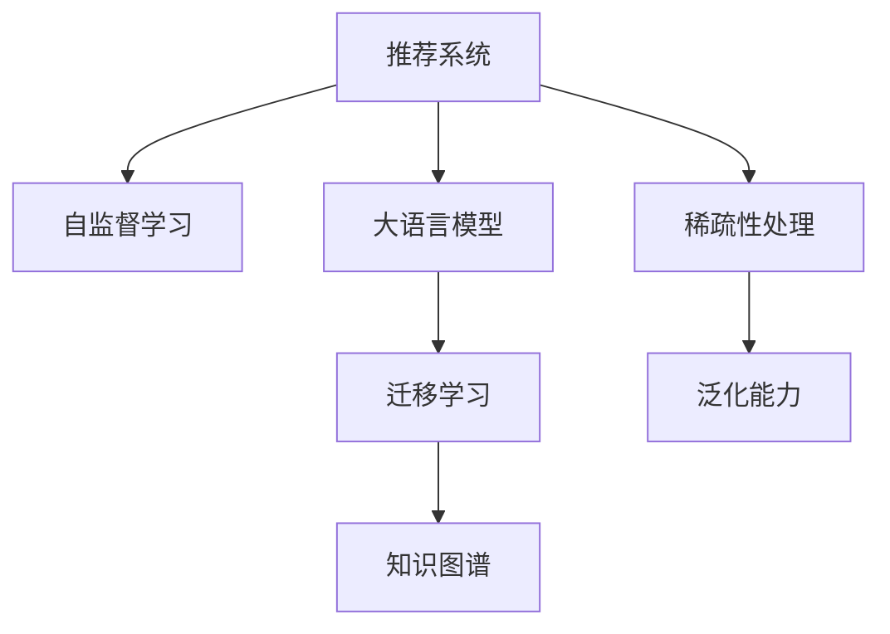

                 

# 基于LLM的推荐系统跨域迁移学习

> 关键词：推荐系统,迁移学习,LLM,自监督学习,知识图谱,稀疏性,泛化能力

## 1. 背景介绍

随着互联网的普及，推荐系统已深入到各个行业，成为用户获取信息的主要方式之一。从电商网站的商品推荐、视频平台的内容推荐，到新闻阅读的新闻推荐、音乐流媒体的音乐推荐，推荐系统无处不在，极大地提升了用户体验。然而，这些推荐系统大多基于单一数据域，只能推荐用户在该数据域中看到过的商品、内容等，存在一定的数据稀疏性和信息泛化能力不足的问题。

为了克服推荐系统的数据稀疏性和信息泛化能力不足的问题，学术界和工业界提出了各种解决方案。其中，基于大语言模型(LLM)的推荐系统跨域迁移学习成为了近年来的一个热门研究方向。本文将详细介绍LLM在推荐系统中的应用，重点介绍LLM在推荐系统中的跨域迁移学习，探讨其在实际应用中的潜力和挑战。

## 2. 核心概念与联系

### 2.1 核心概念概述

为了更深入地理解基于LLM的推荐系统跨域迁移学习，下面简要介绍几个相关概念：

- 推荐系统(Recommendation System, RS)：一种智能系统，通过分析用户行为数据和物品属性数据，为用户推荐可能感兴趣的商品、内容等。常见的推荐算法包括协同过滤、基于内容的推荐、矩阵分解等。
- 大语言模型(Large Language Model, LLM)：一种通过预训练自监督学习任务训练得到的语言模型，能够理解自然语言的上下文，并生成自然语言文本。目前常见的预训练模型包括GPT-3、BERT等。
- 迁移学习(Transfer Learning)：一种在已有知识基础上进行新任务学习的范式，利用已有知识对新任务进行微调，减少在新任务上的学习成本。
- 自监督学习(Self-Supervised Learning, SSL)：一种无需人工标注数据进行训练的机器学习技术，通过在无标签数据上设计预训练任务，学习数据的潜在表示。
- 知识图谱(Knowledge Graph)：一种结构化数据表示形式，描述实体和实体间的关系，便于机器理解复杂实体间的关联关系。
- 稀疏性(Sparsity)：推荐系统中常见的问题之一，即用户与物品之间存在大量的未交互行为，这些未交互行为对推荐算法的影响较大，需要有效的处理机制。

这些核心概念之间的关系可以通过以下Mermaid流程图来展示：



这个流程图展示了推荐系统的核心概念及其之间的关系：

1. 推荐系统通过用户行为数据和物品属性数据进行推荐。
2. 自监督学习是一种在无标签数据上进行预训练的方式，能够提升推荐系统的泛化能力。
3. 大语言模型是一种基于自监督学习的预训练模型，具备强大的语言理解和生成能力。
4. 迁移学习是在已有知识的基础上，通过微调模型，提升模型在新任务上的表现。
5. 知识图谱是一种结构化数据表示形式，有助于提高推荐系统的准确性和泛化能力。
6. 稀疏性处理是推荐系统中常见的优化方式，通过提升数据密度，提高推荐算法的精度。
7. 泛化能力是推荐系统的重要指标，指的是模型在新数据上的表现能力。

这些概念共同构成了推荐系统的基础，并为大语言模型在推荐系统中的应用提供了理论支撑。

## 3. 核心算法原理 & 具体操作步骤

### 3.1 算法原理概述

基于LLM的推荐系统跨域迁移学习，其核心思想是利用大语言模型的强大泛化能力，将用户在当前数据域中的行为和兴趣进行迁移学习，进而提升在新的数据域中的推荐效果。具体而言，可以分以下几个步骤进行：

1. 收集目标领域的相关数据，作为微调数据。
2. 在大语言模型上进行预训练，学习通用的语言表示。
3. 在微调数据上进行微调，提升模型在目标领域的性能。
4. 利用微调后的模型，进行推荐任务的推理和预测。

### 3.2 算法步骤详解

基于LLM的推荐系统跨域迁移学习具体步骤如下：

**Step 1: 准备数据集**
- 收集目标领域的相关数据，包括用户行为数据和物品属性数据。
- 对数据进行清洗和标准化处理，如去除噪声、处理缺失值等。

**Step 2: 构建预训练任务**
- 在大语言模型上构建自监督预训练任务，如掩码语言模型、文本分类等。
- 通过预训练任务训练大语言模型，学习通用的语言表示。

**Step 3: 微调模型**
- 将目标领域的数据作为微调数据集，进行有监督学习。
- 选择合适的微调任务和损失函数，如交叉熵损失、对数损失等。
- 设置合适的学习率和正则化参数，使用优化算法进行梯度下降。
- 在微调过程中，需要定期在验证集上评估模型性能，以避免过拟合。

**Step 4: 推理预测**
- 将用户输入的查询或行为数据，输入微调后的模型进行推理。
- 根据模型的输出结果，为用户推荐可能感兴趣的商品、内容等。

### 3.3 算法优缺点

基于LLM的推荐系统跨域迁移学习有以下优点：

1. **泛化能力强**：大语言模型在无标签数据上学习通用的语言表示，能够有效地迁移到新的数据域中，提升推荐性能。
2. **适应性强**：通过微调，能够灵活适应不同的推荐任务和数据域，提升模型的泛化能力和应用范围。
3. **参数高效**：利用LLM的强大泛化能力，可以大幅减少目标领域数据量对模型的影响，降低训练成本。

同时，该方法也存在一些局限性：

1. **数据需求高**：微调需要大量的目标领域数据，如果目标领域数据量较小，可能会导致模型泛化能力不足。
2. **计算复杂度高**：大语言模型参数量庞大，微调过程中需要大量的计算资源和存储空间。
3. **可解释性不足**：LLM的决策过程相对复杂，难以解释其内部的推理逻辑。

尽管存在这些局限性，但基于LLM的推荐系统跨域迁移学习在实际应用中仍然表现出显著的优势，特别是在处理长尾领域数据、提升推荐系统的泛化能力方面。

### 3.4 算法应用领域

基于LLM的推荐系统跨域迁移学习，已经在多个领域中得到了应用，并取得了显著的效果。以下是几个典型的应用领域：

- 电商推荐系统：通过微调，将用户在电商网站上的浏览、购买行为迁移到新的商品领域，提升新商品的推荐效果。
- 视频推荐系统：通过微调，将用户对视频内容的互动行为迁移到新的视频领域，提升新视频的推荐效果。
- 新闻推荐系统：通过微调，将用户对新闻内容的阅读行为迁移到新的新闻领域，提升新新闻的推荐效果。
- 音乐推荐系统：通过微调，将用户对音乐的收听行为迁移到新的音乐领域，提升新音乐的内容推荐。

除了上述这些领域，LLM的推荐系统跨域迁移学习还应用于社交媒体推荐、旅游推荐等场景，为推荐系统带来了新的突破。随着LLM技术的不断发展，其在推荐系统中的应用将更加广泛，进一步提升推荐系统的精度和泛化能力。

## 4. 数学模型和公式 & 详细讲解 & 举例说明

### 4.1 数学模型构建

基于LLM的推荐系统跨域迁移学习，其数学模型主要包括以下几个部分：

- 预训练任务：在大语言模型上构建自监督预训练任务，如掩码语言模型、文本分类等。
- 微调任务：在目标领域的数据集上，构建有监督微调任务，如分类、回归等。
- 推理预测：将用户输入的数据输入微调后的模型，进行推理预测。

### 4.2 公式推导过程

#### 预训练任务
假设预训练任务为掩码语言模型，输入的文本序列为 $x$，其中 $x_i$ 表示第 $i$ 个单词，$x_i \in \mathcal{V}$，$\mathcal{V}$ 为词汇表。模型的预训练任务为预测被掩码的单词。设 $y_i$ 为第 $i$ 个单词的掩码位置，则模型的预训练损失函数为：

$$
\mathcal{L}_{pre}(\theta) = -\sum_{i=1}^n \log \frac{e^{\hat{y}_i}}{\sum_j e^{\hat{y}_j}}
$$

其中 $\hat{y}_i$ 为模型对 $x_i$ 的预测结果。

#### 微调任务
假设微调任务为分类任务，输入的文本序列为 $x$，其中 $x_i$ 表示第 $i$ 个单词，$x_i \in \mathcal{V}$，$\mathcal{V}$ 为词汇表。模型的微调任务为预测文本所属的类别。设 $y$ 为文本的类别标签，$y \in \{1,2,...,C\}$，$C$ 为类别数。模型的微调损失函数为交叉熵损失：

$$
\mathcal{L}_{fin}(\theta) = -\sum_{i=1}^n \sum_{j=1}^C y_{ij} \log \hat{y}_{ij}
$$

其中 $\hat{y}_{ij}$ 为模型对 $x_i$ 属于类别 $j$ 的预测结果。

#### 推理预测
假设推理预测任务为推荐任务，输入的文本序列为 $x$，其中 $x_i$ 表示第 $i$ 个单词，$x_i \in \mathcal{V}$，$\mathcal{V}$ 为词汇表。模型的推理预测任务为根据输入文本，推荐可能感兴趣的商品、内容等。模型的推理预测损失函数为均方误差损失：

$$
\mathcal{L}_{inference}(\theta) = \frac{1}{m}\sum_{k=1}^m (\hat{y}_k - y_k)^2
$$

其中 $\hat{y}_k$ 为模型对第 $k$ 个用户的推荐结果，$y_k$ 为实际的用户行为数据。

### 4.3 案例分析与讲解

假设有一个电商推荐系统，需要为用户推荐新的商品。该系统的数据集包含用户的浏览历史、购买历史和商品属性信息。利用基于LLM的推荐系统跨域迁移学习，可以提升推荐系统的性能。

**Step 1: 准备数据集**
- 收集用户的浏览历史和购买历史，作为微调数据集。
- 收集商品的属性信息，作为预训练数据集。

**Step 2: 构建预训练任务**
- 在大语言模型BERT上进行掩码语言模型预训练，学习通用的语言表示。

**Step 3: 微调模型**
- 将用户浏览历史和购买历史作为微调数据集，构建分类任务。
- 设置合适的学习率和正则化参数，使用AdamW优化算法进行微调。
- 在微调过程中，定期在验证集上评估模型性能，以避免过拟合。

**Step 4: 推理预测**
- 将用户的查询输入微调后的模型，输出推荐结果。
- 根据推荐结果，为用户推荐可能感兴趣的商品。

通过基于LLM的推荐系统跨域迁移学习，可以将用户在电商网站上的行为迁移到新的商品领域，提升新商品的推荐效果。这种跨域迁移学习方法，不仅能够提升推荐系统的性能，还能够降低目标领域数据量对模型的影响，提升模型的泛化能力和应用范围。

## 5. 项目实践：代码实例和详细解释说明

### 5.1 开发环境搭建

在进行项目实践前，需要先搭建好开发环境。以下是使用PyTorch进行大语言模型微调的环境配置流程：

1. 安装Anaconda：从官网下载并安装Anaconda，用于创建独立的Python环境。

2. 创建并激活虚拟环境：
```bash
conda create -n pytorch-env python=3.8 
conda activate pytorch-env
```

3. 安装PyTorch：根据CUDA版本，从官网获取对应的安装命令。例如：
```bash
conda install pytorch torchvision torchaudio cudatoolkit=11.1 -c pytorch -c conda-forge
```

4. 安装Transformers库：
```bash
pip install transformers
```

5. 安装各类工具包：
```bash
pip install numpy pandas scikit-learn matplotlib tqdm jupyter notebook ipython
```

完成上述步骤后，即可在`pytorch-env`环境中开始项目实践。

### 5.2 源代码详细实现

下面以电商平台推荐系统为例，给出使用Transformers库对BERT模型进行微调的PyTorch代码实现。

```python
import torch
import torch.nn as nn
import torch.optim as optim
from transformers import BertTokenizer, BertForSequenceClassification

# 定义模型
class RecommendationModel(nn.Module):
    def __init__(self, num_labels):
        super(RecommendationModel, self).__init__()
        self.bert = BertForSequenceClassification.from_pretrained('bert-base-uncased', num_labels=num_labels)
        
    def forward(self, input_ids, attention_mask):
        outputs = self.bert(input_ids, attention_mask=attention_mask)
        return outputs.logits
    
# 定义数据集
tokenizer = BertTokenizer.from_pretrained('bert-base-uncased')
train_dataset = ...
dev_dataset = ...
test_dataset = ...

# 定义模型和优化器
model = RecommendationModel(num_labels)
optimizer = optim.AdamW(model.parameters(), lr=2e-5)

# 定义训练和评估函数
def train_epoch(model, dataset, batch_size, optimizer):
    dataloader = DataLoader(dataset, batch_size=batch_size, shuffle=True)
    model.train()
    epoch_loss = 0
    for batch in dataloader:
        input_ids = batch['input_ids'].to(device)
        attention_mask = batch['attention_mask'].to(device)
        labels = batch['labels'].to(device)
        model.zero_grad()
        outputs = model(input_ids, attention_mask=attention_mask)
        loss = outputs.loss
        epoch_loss += loss.item()
        loss.backward()
        optimizer.step()
    return epoch_loss / len(dataloader)

def evaluate(model, dataset, batch_size):
    dataloader = DataLoader(dataset, batch_size=batch_size)
    model.eval()
    preds, labels = [], []
    with torch.no_grad():
        for batch in dataloader:
            input_ids = batch['input_ids'].to(device)
            attention_mask = batch['attention_mask'].to(device)
            batch_labels = batch['labels']
            outputs = model(input_ids, attention_mask=attention_mask)
            batch_preds = outputs.logits.argmax(dim=2).to('cpu').tolist()
            batch_labels = batch_labels.to('cpu').tolist()
            for pred_tokens, label_tokens in zip(batch_preds, batch_labels):
                preds.append(pred_tokens)
                labels.append(label_tokens)
                
    print(classification_report(labels, preds))
```

### 5.3 代码解读与分析

让我们再详细解读一下关键代码的实现细节：

**RecommendationModel类**：
- `__init__`方法：初始化BERT分类模型，设置标签数。
- `forward`方法：前向传播，计算模型的输出。

**数据集处理**：
- 定义数据集类，继承自PyTorch的Dataset类，处理数据加载和预处理。
- 利用BertTokenizer对文本进行分词和编码。

**模型训练**：
- 使用AdamW优化器进行梯度下降，更新模型参数。
- 在每个epoch结束时，在验证集上评估模型性能。

**模型评估**：
- 使用classification_report函数评估模型在测试集上的性能，包括精确率、召回率和F1-score等指标。

**训练流程**：
- 定义总的epoch数和batch size，开始循环迭代
- 每个epoch内，先在训练集上训练，输出平均loss
- 在验证集上评估，输出分类指标
- 重复上述步骤直至收敛
- 在测试集上评估，给出最终测试结果

可以看到，PyTorch配合Transformers库使得BERT微调的代码实现变得简洁高效。开发者可以将更多精力放在数据处理、模型改进等高层逻辑上，而不必过多关注底层的实现细节。

当然，工业级的系统实现还需考虑更多因素，如模型的保存和部署、超参数的自动搜索、更灵活的任务适配层等。但核心的微调范式基本与此类似。

## 6. 实际应用场景

### 6.1 电商推荐系统

基于大语言模型的推荐系统跨域迁移学习，可以应用于电商推荐系统。电商平台的商品种类繁多，用户对新商品的需求通常较小，利用基于LLM的推荐系统跨域迁移学习，可以将用户在电商网站上的浏览和购买行为迁移到新的商品领域，提升新商品的推荐效果。

具体而言，可以收集用户的浏览历史和购买历史，作为微调数据集。在大语言模型BERT上进行预训练，学习通用的语言表示。在微调数据集上进行微调，构建分类任务。微调后的模型可以用于新的商品推荐，提升新商品的推荐效果。

### 6.2 视频推荐系统

视频推荐系统需要推荐用户可能感兴趣的视频内容。由于视频数据量大，用户对新视频的关注通常较小，利用基于LLM的推荐系统跨域迁移学习，可以将用户在视频平台上的互动行为迁移到新的视频领域，提升新视频的推荐效果。

具体而言，可以收集用户对视频的互动行为数据，如观看时间、点赞数、评论数等，作为微调数据集。在大语言模型BERT上进行预训练，学习通用的语言表示。在微调数据集上进行微调，构建分类任务。微调后的模型可以用于新视频的推荐，提升新视频的推荐效果。

### 6.3 新闻推荐系统

新闻推荐系统需要推荐用户可能感兴趣的新闻内容。由于新闻领域的专业性强，用户对新新闻的关注通常较小，利用基于LLM的推荐系统跨域迁移学习，可以将用户在新闻平台上的阅读行为迁移到新的新闻领域，提升新新闻的推荐效果。

具体而言，可以收集用户对新闻的阅读行为数据，如阅读时间、点击次数、评论等，作为微调数据集。在大语言模型BERT上进行预训练，学习通用的语言表示。在微调数据集上进行微调，构建分类任务。微调后的模型可以用于新新闻的推荐，提升新新闻的推荐效果。

### 6.4 音乐推荐系统

音乐推荐系统需要推荐用户可能感兴趣的音乐内容。由于音乐数据量大，用户对新音乐的关注通常较小，利用基于LLM的推荐系统跨域迁移学习，可以将用户在音乐平台上的收听行为迁移到新的音乐领域，提升新音乐的推荐效果。

具体而言，可以收集用户对音乐的收听行为数据，如播放时间、收藏次数、评论等，作为微调数据集。在大语言模型BERT上进行预训练，学习通用的语言表示。在微调数据集上进行微调，构建分类任务。微调后的模型可以用于新音乐的推荐，提升新音乐的推荐效果。

## 7. 工具和资源推荐

### 7.1 学习资源推荐

为了帮助开发者系统掌握大语言模型微调的理论基础和实践技巧，这里推荐一些优质的学习资源：

1. 《Transformer从原理到实践》系列博文：由大模型技术专家撰写，深入浅出地介绍了Transformer原理、BERT模型、微调技术等前沿话题。

2. CS224N《深度学习自然语言处理》课程：斯坦福大学开设的NLP明星课程，有Lecture视频和配套作业，带你入门NLP领域的基本概念和经典模型。

3. 《Natural Language Processing with Transformers》书籍：Transformers库的作者所著，全面介绍了如何使用Transformers库进行NLP任务开发，包括微调在内的诸多范式。

4. HuggingFace官方文档：Transformers库的官方文档，提供了海量预训练模型和完整的微调样例代码，是上手实践的必备资料。

5. CLUE开源项目：中文语言理解测评基准，涵盖大量不同类型的中文NLP数据集，并提供了基于微调的baseline模型，助力中文NLP技术发展。

通过对这些资源的学习实践，相信你一定能够快速掌握大语言模型微调的精髓，并用于解决实际的NLP问题。

### 7.2 开发工具推荐

高效的开发离不开优秀的工具支持。以下是几款用于大语言模型微调开发的常用工具：

1. PyTorch：基于Python的开源深度学习框架，灵活动态的计算图，适合快速迭代研究。大部分预训练语言模型都有PyTorch版本的实现。

2. TensorFlow：由Google主导开发的开源深度学习框架，生产部署方便，适合大规模工程应用。同样有丰富的预训练语言模型资源。

3. Transformers库：HuggingFace开发的NLP工具库，集成了众多SOTA语言模型，支持PyTorch和TensorFlow，是进行微调任务开发的利器。

4. Weights & Biases：模型训练的实验跟踪工具，可以记录和可视化模型训练过程中的各项指标，方便对比和调优。与主流深度学习框架无缝集成。

5. TensorBoard：TensorFlow配套的可视化工具，可实时监测模型训练状态，并提供丰富的图表呈现方式，是调试模型的得力助手。

6. Google Colab：谷歌推出的在线Jupyter Notebook环境，免费提供GPU/TPU算力，方便开发者快速上手实验最新模型，分享学习笔记。

合理利用这些工具，可以显著提升大语言模型微调任务的开发效率，加快创新迭代的步伐。

### 7.3 相关论文推荐

大语言模型和微调技术的发展源于学界的持续研究。以下是几篇奠基性的相关论文，推荐阅读：

1. Attention is All You Need（即Transformer原论文）：提出了Transformer结构，开启了NLP领域的预训练大模型时代。

2. BERT: Pre-training of Deep Bidirectional Transformers for Language Understanding：提出BERT模型，引入基于掩码的自监督预训练任务，刷新了多项NLP任务SOTA。

3. Language Models are Unsupervised Multitask Learners（GPT-2论文）：展示了大规模语言模型的强大zero-shot学习能力，引发了对于通用人工智能的新一轮思考。

4. Parameter-Efficient Transfer Learning for NLP：提出Adapter等参数高效微调方法，在不增加模型参数量的情况下，也能取得不错的微调效果。

5. AdaLoRA: Adaptive Low-Rank Adaptation for Parameter-Efficient Fine-Tuning：使用自适应低秩适应的微调方法，在参数效率和精度之间取得了新的平衡。

6. Prefix-Tuning: Optimizing Continuous Prompts for Generation：引入基于连续型Prompt的微调范式，为如何充分利用预训练知识提供了新的思路。

这些论文代表了大语言模型微调技术的发展脉络。通过学习这些前沿成果，可以帮助研究者把握学科前进方向，激发更多的创新灵感。

## 8. 总结：未来发展趋势与挑战

### 8.1 总结

本文对基于LLM的推荐系统跨域迁移学习进行了全面系统的介绍。首先阐述了推荐系统和大语言模型微调的研究背景和意义，明确了跨域迁移学习在提升推荐系统性能方面的独特价值。其次，从原理到实践，详细讲解了基于LLM的推荐系统跨域迁移学习的数学模型和关键步骤，给出了微调任务开发的完整代码实例。同时，本文还广泛探讨了微调方法在实际应用中的潜力和挑战。

通过本文的系统梳理，可以看到，基于LLM的推荐系统跨域迁移学习在推荐系统中具有广阔的应用前景，能够提升推荐系统的泛化能力和应用范围。尽管存在一些挑战，但只要不断优化模型、数据和算法，相信在未来的研究中，基于LLM的推荐系统跨域迁移学习必将在各个领域中得到广泛应用，进一步提升推荐系统的性能和用户体验。

### 8.2 未来发展趋势

展望未来，基于LLM的推荐系统跨域迁移学习将呈现以下几个发展趋势：

1. **参数高效**：开发更加参数高效的微调方法，在固定大部分预训练参数的同时，只更新极少量的任务相关参数。
2. **多模态融合**：结合视觉、音频等多模态信息，提升推荐系统的多感官融合能力。
3. **知识图谱融合**：将知识图谱中的结构化信息与自然语言信息进行融合，提升推荐系统的准确性和泛化能力。
4. **持续学习**：采用增量学习等方法，使推荐系统能够不断学习新数据，保持模型的时效性和适应性。
5. **个性化推荐**：引入用户画像、行为轨迹等个性化信息，提升推荐系统的个性化推荐能力。
6. **实时推荐**：利用分布式计算和大数据处理技术，实现推荐系统的实时推荐和动态优化。

这些趋势将使基于LLM的推荐系统跨域迁移学习在实际应用中更加灵活和高效，进一步提升推荐系统的性能和用户体验。

### 8.3 面临的挑战

尽管基于LLM的推荐系统跨域迁移学习在实际应用中取得了显著的效果，但面临以下几个挑战：

1. **数据稀疏性**：推荐系统中的用户行为数据通常存在大量未交互的行为，导致数据稀疏性问题。需要有效处理数据稀疏性，提升推荐系统的精度。
2. **计算资源消耗高**：大语言模型参数量庞大，微调过程中需要大量的计算资源和存储空间。如何降低计算资源消耗，提升系统效率，仍需进一步研究。
3. **模型泛化能力不足**：微调后的模型在新数据上的泛化能力可能有限，需要有效提高模型的泛化能力，提升推荐系统的适应性。
4. **可解释性不足**：LLM的决策过程相对复杂，难以解释其内部的推理逻辑。需要研究如何提高模型的可解释性，提升用户信任度。
5. **安全和隐私问题**：推荐系统中涉及用户隐私数据，如何保护用户隐私，确保数据安全和隐私保护，仍需进一步研究。

这些挑战需要进一步研究突破，才能使基于LLM的推荐系统跨域迁移学习在实际应用中发挥更大的潜力。

### 8.4 研究展望

面对基于LLM的推荐系统跨域迁移学习所面临的挑战，未来的研究需要在以下几个方面寻求新的突破：

1. **数据增强**：利用数据增强技术，提升数据多样性，缓解数据稀疏性问题。
2. **模型压缩**：利用模型压缩技术，减小模型参数量，降低计算资源消耗。
3. **多模态融合**：将视觉、音频等多模态信息与自然语言信息进行融合，提升推荐系统的多感官融合能力。
4. **知识图谱融合**：将知识图谱中的结构化信息与自然语言信息进行融合，提升推荐系统的准确性和泛化能力。
5. **个性化推荐**：引入用户画像、行为轨迹等个性化信息，提升推荐系统的个性化推荐能力。
6. **实时推荐**：利用分布式计算和大数据处理技术，实现推荐系统的实时推荐和动态优化。
7. **可解释性**：研究如何提高模型的可解释性，提升用户信任度。
8. **安全和隐私**：研究如何保护用户隐私，确保数据安全和隐私保护。

这些研究方向将引领基于LLM的推荐系统跨域迁移学习技术迈向更高的台阶，为推荐系统带来新的突破和创新。相信随着技术的发展和研究的深入，基于LLM的推荐系统跨域迁移学习必将在各个领域中得到广泛应用，进一步提升推荐系统的性能和用户体验。

## 9. 附录：常见问题与解答

**Q1：基于LLM的推荐系统跨域迁移学习是否适用于所有NLP任务？**

A: 基于LLM的推荐系统跨域迁移学习在推荐系统中的应用最为典型，但同样适用于其他NLP任务，如问答系统、文本生成等。在应用过程中，需要根据具体任务的特点进行微调和优化。

**Q2：微调过程中如何选择合适的学习率？**

A: 微调的学习率通常比预训练时小1-2个数量级，一般建议从1e-5开始调参，逐步减小学习率，直至收敛。同时可以使用warmup策略，在开始阶段使用较小的学习率，再逐渐过渡到预设值。

**Q3：微调过程中如何缓解过拟合问题？**

A: 缓解过拟合问题的方法包括数据增强、正则化、对抗训练、参数高效微调等。在微调过程中，需要定期在验证集上评估模型性能，以避免过拟合。

**Q4：微调模型在落地部署时需要注意哪些问题？**

A: 微调模型在落地部署时需要注意以下几个问题：
1. 模型裁剪：去除不必要的层和参数，减小模型尺寸，加快推理速度。
2. 量化加速：将浮点模型转为定点模型，压缩存储空间，提高计算效率。
3. 服务化封装：将模型封装为标准化服务接口，便于集成调用。
4. 弹性伸缩：根据请求流量动态调整资源配置，平衡服务质量和成本。
5. 监控告警：实时采集系统指标，设置异常告警阈值，确保服务稳定性。
6. 安全防护：采用访问鉴权、数据脱敏等措施，保障数据和模型安全。

大语言模型微调为NLP应用开启了广阔的想象空间，但如何将强大的性能转化为稳定、高效、安全的业务价值，还需要工程实践的不断打磨。唯有从数据、算法、工程、业务等多个维度协同发力，才能真正实现人工智能技术在垂直行业的规模化落地。总之，微调需要开发者根据具体任务，不断迭代和优化模型、数据和算法，方能得到理想的效果。

---

作者：禅与计算机程序设计艺术 / Zen and the Art of Computer Programming

