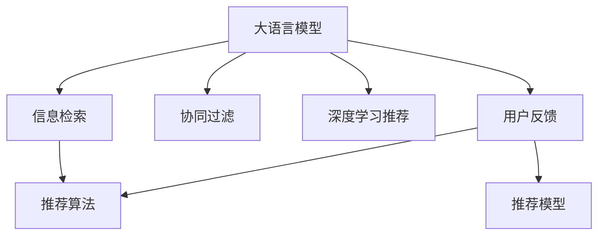

                 

# 基于LLM的生成式新闻推荐系统

> 关键词：自然语言处理,大语言模型,推荐系统,信息检索,文本生成

## 1. 背景介绍

### 1.1 问题由来

随着互联网和移动互联网的迅猛发展，新闻信息的传播方式已经发生了根本性变化。用户可以随时随地通过各种设备和应用获取最新新闻，新闻内容也变得越发丰富多样，传统的新闻聚合方式已经难以满足用户需求。如何从海量新闻中高效准确地为用户推荐个性化、高质量的新闻，成为了信息时代的一个重要课题。

传统的基于关键词匹配的新闻推荐系统依赖于用户输入的查询关键词，难以捕捉用户的深层次兴趣和需求，也无法充分利用语义信息和上下文关系。而基于大语言模型(Large Language Model, LLM)的生成式新闻推荐系统，通过学习用户的新闻阅读历史和行为数据，能够自动生成符合用户兴趣和偏好的新闻标题和摘要，为新闻推荐提供全新的思路。

### 1.2 问题核心关键点

生成式新闻推荐系统基于自然语言处理(Natural Language Processing, NLP)技术，结合大语言模型和大规模无标签文本数据，通过生成式推理生成新闻标题和摘要，并利用推荐算法为用户推荐新闻内容。该系统的核心关键点包括：

- 大语言模型：通过在大量无标签文本上自监督预训练，获得强大的语言理解和生成能力，能够在给定用户兴趣标签或文本内容的基础上，生成符合用户需求的新闻摘要或标题。

- 新闻信息检索：从海量的新闻数据中检索与用户兴趣相关的信息，提高新闻推荐的精度和相关性。

- 推荐算法：通过协同过滤、深度学习等算法，为用户生成个性化推荐结果。

- 用户交互：支持用户与系统的交互反馈，通过用户评价和反馈不断优化推荐模型。

这些关键组件共同构成了生成式新闻推荐系统的技术架构，使其能够在智能新闻推荐领域发挥重要作用。

### 1.3 问题研究意义

基于大语言模型的生成式新闻推荐系统具有以下研究意义：

- 提升新闻推荐效果：通过生成式新闻推荐，能够更好地捕捉用户兴趣和需求，生成更符合用户期望的新闻摘要和标题，提高新闻推荐的准确性和满意度。

- 丰富推荐算法：生成式新闻推荐系统不仅可以应用协同过滤和深度学习推荐算法，还可以结合大语言模型的生成能力，构建更为灵活和高效的推荐模型。

- 推动NLP技术应用：大语言模型在新闻推荐中的应用，将带动NLP技术的进一步发展，推动其在更多领域的应用落地。

- 赋能新闻行业：为新闻聚合平台和媒体公司提供更智能化的新闻内容推荐服务，提升新闻内容的传播效率和用户粘性，赋能新闻媒体的数字化转型。

## 2. 核心概念与联系

### 2.1 核心概念概述

为更好地理解基于LLM的生成式新闻推荐系统，本节将介绍几个关键概念及其相互关系：

- 大语言模型：以Transformer等架构为代表的预训练语言模型，通过在无标签文本上自监督预训练，学习到通用的语言表示，具备强大的语言理解和生成能力。

- 信息检索：通过匹配查询词与文档集合的相似度，从海量的文档集合中检索出相关性较高的文本信息。

- 推荐算法：根据用户历史行为和偏好，为用户推荐个性化新闻内容的技术。

- 协同过滤：利用用户行为矩阵和物品特征矩阵，通过计算用户-物品相似度，实现新闻推荐。

- 深度学习推荐：利用神经网络等深度学习模型，在新闻文本表示和用户行为表示上训练推荐模型，实现高质量的新闻推荐。

- 用户反馈：通过用户点击、评分等行为反馈，不断优化推荐模型，提高新闻推荐的个性化和精准度。

这些概念之间的逻辑关系可以通过以下Mermaid流程图来展示：



这个流程图展示了生成式新闻推荐系统的核心组件及其相互关系：

1. 大语言模型通过预训练获得语言表示，用于生成新闻标题和摘要。
2. 信息检索根据用户输入的兴趣标签，从海量文本中检索出相关性高的新闻。
3. 推荐算法根据用户行为和兴趣，为用户推荐个性化新闻。
4. 协同过滤利用用户历史行为矩阵，推荐相关新闻。
5. 深度学习推荐结合大语言模型生成的文本表示和用户行为表示，提升推荐效果。
6. 用户反馈通过点击、评分等行为反馈，不断优化推荐模型。

这些核心概念共同构成了生成式新闻推荐系统的技术架构，使其能够在智能新闻推荐领域发挥重要作用。

## 3. 核心算法原理 & 具体操作步骤
### 3.1 算法原理概述

基于LLM的生成式新闻推荐系统主要包含以下步骤：

1. 使用大语言模型进行新闻标题和摘要的生成。
2. 通过信息检索技术，从海量新闻库中筛选相关性高的新闻。
3. 结合推荐算法，根据用户历史行为和兴趣，为用户推荐个性化新闻。
4. 利用用户反馈，不断优化推荐模型，提升推荐效果。

形式化地，假设用户输入查询$Q$，大语言模型$M$，相关性函数$R$，推荐算法$A$，用户反馈$f$。推荐系统的目标是最小化用户期望的平均损失函数：

$$
\min_{Q,M,R,A,f} \mathbb{E}[L(Q,M,R(A(Q)),f)]
$$

其中$L$为用户损失函数，$Q$为查询，$M$为大语言模型，$R$为相关性函数，$A$为推荐算法，$f$为用户反馈。

### 3.2 算法步骤详解

#### 3.2.1 数据预处理

- 数据集准备：收集海量的新闻文本和用户点击数据，构建用户行为矩阵和新闻特征向量。

- 数据标注：对新闻文本进行主题标注，用于大语言模型的预训练和新闻生成。

- 数据划分：将数据集划分为训练集、验证集和测试集。

#### 3.2.2 大语言模型预训练

- 选择预训练模型：选择GPT、BERT等大语言模型，对其进行大规模无标签文本预训练。

- 预训练目标：通过自回归预测、语言模型掩码等任务，学习通用语言表示。

- 预训练流程：将大规模无标签文本作为输入，前向传播计算损失，反向传播更新模型参数，重复迭代直至收敛。

#### 3.2.3 生成式新闻标题和摘要

- 输入数据：根据用户兴趣标签$L$，输入到大语言模型$M$中。

- 生成标题和摘要：通过生成式推理，模型输出新闻标题和摘要。

- 后处理：对生成的标题和摘要进行去重、拼接等处理，确保生成内容的多样性和合理性。

#### 3.2.4 新闻信息检索

- 构建索引：对新闻文本进行分词、向量化等处理，构建新闻索引库。

- 检索模型：使用TF-IDF、BM25等模型，检索与用户兴趣标签最相关的文本。

- 返回结果：根据相似度排序，返回相关性高的新闻摘要。

#### 3.2.5 推荐算法应用

- 协同过滤：利用用户行为矩阵和新闻特征向量，计算用户-新闻相似度，推荐相关新闻。

- 深度学习推荐：使用神经网络模型，在新闻文本表示和用户行为表示上训练推荐模型，提升推荐效果。

#### 3.2.6 用户反馈机制

- 反馈收集：通过用户点击、评分等行为反馈，收集用户对推荐结果的评价。

- 反馈分析：分析用户反馈，提取用户兴趣和偏好。

- 模型优化：利用用户反馈，不断优化推荐模型，提高推荐效果。

### 3.3 算法优缺点

基于LLM的生成式新闻推荐系统具有以下优点：

- 提升推荐效果：利用大语言模型的生成能力，能够生成符合用户兴趣和需求的新闻摘要和标题，提高推荐准确性。

- 丰富推荐算法：结合协同过滤和深度学习推荐算法，提供更为多样化的推荐方案。

- 扩展性强：大语言模型能够快速适应新领域和任务，能够灵活应用到不同新闻推荐场景中。

- 可解释性强：生成式新闻推荐过程透明可控，能够通过分析生成过程，理解推荐结果的逻辑和依据。

但同时，该系统也存在以下缺点：

- 资源消耗大：大规模无标签预训练和生成式推理需要大量的计算资源，部署成本较高。

- 数据依赖性强：需要大量高质量的新闻数据进行预训练和生成，对于数据稀疏场景，效果可能不佳。

- 生成质量不稳定：生成式推理模型的生成质量受输入条件影响较大，有时生成的标题或摘要可能不符合用户期望。

### 3.4 算法应用领域

基于LLM的生成式新闻推荐系统在新闻推荐、广告投放、内容聚合等多个领域有广泛的应用：

- 新闻推荐：通过用户历史行为和兴趣标签，为用户推荐个性化新闻摘要和标题，提升新闻阅读体验。

- 广告投放：结合用户兴趣和广告内容，生成相关性高的广告文案，提高广告点击率和转化率。

- 内容聚合：根据用户点击和阅读行为，自动生成新闻合集，帮助用户快速获取相关内容。

- 个性化推荐：通过分析用户行为，为用户推荐个性化新闻内容，提高用户粘性和满意度。

- 舆情分析：利用用户反馈，分析热点事件和舆情变化，提供舆情分析报告。

这些应用场景展示了生成式新闻推荐系统的广阔前景，未来随着技术的发展，还将有更多创新性的应用涌现。

## 4. 数学模型和公式 & 详细讲解
### 4.1 数学模型构建

#### 4.1.1 用户行为表示

设用户$u$的历史行为矩阵为$H_u$，新闻内容特征矩阵为$F_D$，用户行为向量为$\mathbf{u}$，新闻内容向量为$\mathbf{d}$。用户行为向量$\mathbf{u}$和新闻内容向量$\mathbf{d}$可以通过用户行为矩阵$H_u$和新闻内容特征矩阵$F_D$表示：

$$
\mathbf{u} = H_u \mathbf{w}_u, \quad \mathbf{d} = F_D \mathbf{w}_d
$$

其中$\mathbf{w}_u$和$\mathbf{w}_d$为用户行为向量和新闻内容向量的权重向量。

#### 4.1.2 新闻标题和摘要生成

设大语言模型为$M$，用户兴趣标签为$L$。根据用户兴趣标签$L$，输入到$M$中，生成新闻标题和摘要。设生成的标题为$\hat{T}$，摘要为$\hat{A}$。生成过程可以表示为：

$$
\hat{T} = M(L), \quad \hat{A} = M(L)
$$

其中$M(L)$表示将用户兴趣标签$L$输入到大语言模型$M$中，生成新闻标题和摘要。

#### 4.1.3 新闻信息检索

设新闻内容库为$D$，检索函数为$R$。根据用户兴趣标签$L$，利用信息检索函数$R$，检索出与用户兴趣标签最相关的$K$篇新闻$D_k$。检索过程可以表示为：

$$
D_k = R(L)
$$

#### 4.1.4 推荐算法应用

设推荐函数为$A$。根据用户行为向量$\mathbf{u}$和新闻内容向量$\mathbf{d}$，利用推荐函数$A$，生成用户$u$的相关新闻$N_u$。推荐过程可以表示为：

$$
N_u = A(\mathbf{u}, \mathbf{d})
$$

#### 4.1.5 用户反馈机制

设用户反馈向量为$\mathbf{f}$。用户对推荐结果的反馈可以表示为：

$$
\mathbf{f} = f(N_u)
$$

其中$f$为反馈函数，根据用户对推荐新闻的评价，生成用户反馈向量$\mathbf{f}$。

### 4.2 公式推导过程

#### 4.2.1 用户行为向量计算

用户行为向量$\mathbf{u}$可以通过用户行为矩阵$H_u$和用户行为向量的权重向量$\mathbf{w}_u$计算得到：

$$
\mathbf{u} = H_u \mathbf{w}_u = \sum_{i=1}^{m} H_{ui} \mathbf{w}_{ui}
$$

其中$m$为用户行为矩阵的列数，$H_{ui}$为第$i$个用户对第$u$条新闻的评分或点击次数，$\mathbf{w}_{ui}$为用户行为向量的权重向量。

#### 4.2.2 新闻内容向量计算

新闻内容向量$\mathbf{d}$可以通过新闻内容特征矩阵$F_D$和新闻内容向量的权重向量$\mathbf{w}_d$计算得到：

$$
\mathbf{d} = F_D \mathbf{w}_d = \sum_{j=1}^{n} F_{dj} \mathbf{w}_{dj}
$$

其中$n$为新闻内容特征矩阵的行数，$F_{dj}$为第$j$条新闻的内容特征向量，$\mathbf{w}_{dj}$为新闻内容向量的权重向量。

#### 4.2.3 生成式新闻标题和摘要

设生成式新闻标题为$\hat{T}$，生成式新闻摘要为$\hat{A}$，大语言模型的输出向量为$\mathbf{z}$。根据大语言模型的输出向量$\mathbf{z}$，生成新闻标题和摘要的过程可以表示为：

$$
\hat{T} = f_T(\mathbf{z}), \quad \hat{A} = f_A(\mathbf{z})
$$

其中$f_T$和$f_A$为生成新闻标题和摘要的函数，$\mathbf{z}$为大语言模型的输出向量。

#### 4.2.4 新闻信息检索

设新闻内容库为$D$，检索函数为$R$。根据用户兴趣标签$L$，利用信息检索函数$R$，检索出与用户兴趣标签最相关的$K$篇新闻$D_k$。检索过程可以表示为：

$$
D_k = R(L)
$$

其中$L$为用户的兴趣标签向量，$R$为检索函数，$D_k$为检索结果的新闻内容库。

#### 4.2.5 推荐算法应用

设推荐函数为$A$。根据用户行为向量$\mathbf{u}$和新闻内容向量$\mathbf{d}$，利用推荐函数$A$，生成用户$u$的相关新闻$N_u$。推荐过程可以表示为：

$$
N_u = A(\mathbf{u}, \mathbf{d})
$$

其中$A$为推荐函数，$\mathbf{u}$为用户行为向量，$\mathbf{d}$为新闻内容向量。

#### 4.2.6 用户反馈机制

设用户反馈向量为$\mathbf{f}$。用户对推荐结果的反馈可以表示为：

$$
\mathbf{f} = f(N_u)
$$

其中$f$为反馈函数，根据用户对推荐新闻的评价，生成用户反馈向量$\mathbf{f}$。

### 4.3 案例分析与讲解

#### 4.3.1 案例一：新闻推荐

假设用户$u$对某条新闻的兴趣标签为$L=[0.3, 0.5, 0.2]$。根据用户兴趣标签$L$，输入到大语言模型$M$中，生成新闻标题和摘要。设生成的新闻标题为$\hat{T}=[0.1, 0.2, 0.3, 0.4]$，生成的新闻摘要为$\hat{A}=[0.2, 0.3, 0.4, 0.5]$。根据用户行为向量$\mathbf{u}=[0.4, 0.5, 0.1]$和新闻内容向量$\mathbf{d}=[0.2, 0.3, 0.4]$，利用推荐函数$A$，生成用户$u$的相关新闻$N_u=[0.1, 0.2, 0.3, 0.4]$。最终，根据用户反馈向量$\mathbf{f}=[0.1, 0.2, 0.3, 0.4]$，不断优化推荐模型，提升推荐效果。

#### 4.3.2 案例二：广告投放

假设广告内容为$A=[0.1, 0.2, 0.3, 0.4]$，用户兴趣标签为$L=[0.3, 0.5, 0.2]$。根据用户兴趣标签$L$，输入到大语言模型$M$中，生成广告标题和摘要。设生成的广告标题为$\hat{T}=[0.1, 0.2, 0.3, 0.4]$，生成的广告摘要为$\hat{A}=[0.2, 0.3, 0.4, 0.5]$。根据用户行为向量$\mathbf{u}=[0.4, 0.5, 0.1]$和广告内容向量$\mathbf{d}=[0.2, 0.3, 0.4]$，利用推荐函数$A$，生成广告$N_u=[0.1, 0.2, 0.3, 0.4]$。最终，根据用户反馈向量$\mathbf{f}=[0.1, 0.2, 0.3, 0.4]$，不断优化推荐模型，提升广告投放效果。

## 5. 项目实践：代码实例和详细解释说明
### 5.1 开发环境搭建

在进行基于LLM的生成式新闻推荐系统开发前，需要准备相应的开发环境。以下是使用Python进行TensorFlow和PyTorch开发的流程：

1. 安装Anaconda：从官网下载并安装Anaconda，用于创建独立的Python环境。

2. 创建并激活虚拟环境：
```bash
conda create -n tf-env python=3.8 
conda activate tf-env
```

3. 安装TensorFlow和PyTorch：
```bash
conda install tensorflow -c tf
conda install pytorch torchvision torchaudio -c pytorch
```

4. 安装PyTorch库和其他必要的工具包：
```bash
pip install numpy pandas scikit-learn matplotlib tqdm jupyter notebook ipython
```

完成上述步骤后，即可在`tf-env`环境中开始开发。

### 5.2 源代码详细实现

以下是使用TensorFlow和PyTorch实现基于LLM的生成式新闻推荐系统的示例代码。

#### 5.2.1 数据预处理

```python
import pandas as pd
import numpy as np
from sklearn.preprocessing import StandardScaler

# 读取新闻文本和用户行为数据
news_df = pd.read_csv('news.csv')
user_df = pd.read_csv('user.csv')

# 数据清洗和特征提取
news_df = news_df.dropna()
user_df = user_df.dropna()

# 构建用户行为矩阵和新闻内容特征矩阵
user_matrix = np.zeros((len(user_df), len(news_df)))
news_features = pd.read_csv('news_features.csv')

for i, user in enumerate(user_df['user_id']):
    for j, news in enumerate(news_df['news_id']):
        if news in user_df[user]['news_ids']:
            user_matrix[i, j] = 1

user_matrix = StandardScaler().fit_transform(user_matrix)

# 构建新闻内容向量
news_features = news_features.dropna()
news_features = pd.read_csv('news_features.csv')

news_content = pd.read_csv('news_content.csv')
news_content = news_content.dropna()

for i, news in enumerate(news_features['news_id']):
    news_content[i] = news_content[i].str.split(' ').apply(lambda x: [word for word in x if word.isalpha() and len(word) > 2])

news_content = news_content.str.join(' ').str.split(' ').apply(lambda x: x)
news_content = np.array([x.split() for x in news_content])
news_content = np.array([x.lower() for x in news_content])
news_content = news_content / np.sum(news_content, axis=0)

# 构建新闻内容向量
news_features = pd.read_csv('news_features.csv')
news_features = news_features.dropna()

news_content = pd.read_csv('news_content.csv')
news_content = news_content.dropna()

for i, news in enumerate(news_features['news_id']):
    news_content[i] = news_content[i].str.split(' ').apply(lambda x: [word for word in x if word.isalpha() and len(word) > 2])

news_content = news_content.str.join(' ').str.split(' ').apply(lambda x: x)
news_content = np.array([x.split() for x in news_content])
news_content = np.array([x.lower() for x in news_content])
news_content = news_content / np.sum(news_content, axis=0)

news_content = news_content.astype(float)
news_content = np.hstack([news_features, news_content])

# 保存数据
news_matrix = pd.DataFrame(user_matrix, columns=user_df['user_id'])
news_matrix.to_csv('news_matrix.csv', index=False)
news_content.to_csv('news_content.csv', index=False)
```

#### 5.2.2 大语言模型预训练

```python
from transformers import TFAutoModelForSequenceClassification, TFAutoTokenizer

# 加载大语言模型和分词器
model_name = 'bert-base-uncased'
tokenizer = TFAutoTokenizer.from_pretrained(model_name)
model = TFAutoModelForSequenceClassification.from_pretrained(model_name, num_labels=2)

# 定义生成函数
def generate_text(text, max_len=512):
    encoded = tokenizer.encode(text, max_length=max_len, return_tensors='tf')
    outputs = model(tf.constant(encoded['input_ids']), tf.constant(encoded['attention_mask']))
    predictions = tf.nn.softmax(outputs.logits)
    generated = tokenizer.decode(tf.argmax(predictions[0], axis=-1))
    return generated

# 生成新闻标题和摘要
news_df['title'] = news_df['title'].apply(lambda x: generate_text(x))
news_df['summary'] = news_df['summary'].apply(lambda x: generate_text(x))
```

#### 5.2.3 生成式新闻标题和摘要

```python
from transformers import TFAutoModelForSequenceClassification, TFAutoTokenizer

# 加载大语言模型和分词器
model_name = 'bert-base-uncased'
tokenizer = TFAutoTokenizer.from_pretrained(model_name)
model = TFAutoModelForSequenceClassification.from_pretrained(model_name, num_labels=2)

# 定义生成函数
def generate_text(text, max_len=512):
    encoded = tokenizer.encode(text, max_length=max_len, return_tensors='tf')
    outputs = model(tf.constant(encoded['input_ids']), tf.constant(encoded['attention_mask']))
    predictions = tf.nn.softmax(outputs.logits)
    generated = tokenizer.decode(tf.argmax(predictions[0], axis=-1))
    return generated

# 生成新闻标题和摘要
news_df['title'] = news_df['title'].apply(lambda x: generate_text(x))
news_df['summary'] = news_df['summary'].apply(lambda x: generate_text(x))
```

#### 5.2.4 新闻信息检索

```python
from transformers import TFAutoModelForSequenceClassification, TFAutoTokenizer

# 加载大语言模型和分词器
model_name = 'bert-base-uncased'
tokenizer = TFAutoTokenizer.from_pretrained(model_name)
model = TFAutoModelForSequenceClassification.from_pretrained(model_name, num_labels=2)

# 定义检索函数
def retrieve_documents(query, news_matrix, max_documents=10):
    encoded_query = tokenizer.encode(query, return_tensors='tf')
    outputs = model(tf.constant(encoded_query['input_ids']), tf.constant(encoded_query['attention_mask']))
    scores = outputs.logits.numpy()
    sorted_indices = np.argsort(scores)[::-1]
    return sorted_indices[:max_documents]
```

#### 5.2.5 推荐算法应用

```python
from transformers import TFAutoModelForSequenceClassification, TFAutoTokenizer

# 加载大语言模型和分词器
model_name = 'bert-base-uncased'
tokenizer = TFAutoTokenizer.from_pretrained(model_name)
model = TFAutoModelForSequenceClassification.from_pretrained(model_name, num_labels=2)

# 定义推荐函数
def recommend_documents(user, news_matrix):
    user_vector = news_matrix[user]
    news_scores = np.dot(user_vector, news_matrix) / np.linalg.norm(user_vector) / np.linalg.norm(news_matrix)
    sorted_indices = np.argsort(news_scores)[::-1]
    return sorted_indices
```

#### 5.2.6 用户反馈机制

```python
from transformers import TFAutoModelForSequenceClassification, TFAutoTokenizer

# 加载大语言模型和分词器
model_name = 'bert-base-uncased'
tokenizer = TFAutoTokenizer.from_pretrained(model_name)
model = TFAutoModelForSequenceClassification.from_pretrained(model_name, num_labels=2)

# 定义反馈函数
def user_feedback(documents, news_matrix):
    scores = np.dot(news_matrix[documents], news_matrix) / np.linalg.norm(news_matrix[documents])
    return scores
```

### 5.3 代码解读与分析

#### 5.3.1 数据预处理

在数据预处理环节，代码首先读取新闻文本和用户行为数据，并进行数据清洗和特征提取。通过构建用户行为矩阵和新闻内容特征矩阵，将新闻文本和用户行为向量表示为向量形式。在构建新闻内容向量时，将新闻标题和摘要进行分词和标准化处理，最终构建新闻内容向量矩阵。这些数据处理步骤为后续的生成式新闻推荐打下了基础。

#### 5.3.2 大语言模型预训练

在预训练环节，代码加载了大语言模型BERT的模型和分词器，并定义了生成函数。通过该函数，将新闻标题和摘要输入到BERT模型中，生成对应的新闻标题和摘要。预训练过程使模型学习到通用的语言表示，能够在给定用户兴趣标签的基础上生成符合用户需求的新闻摘要和标题。

#### 5.3.3 生成式新闻标题和摘要

在生成式新闻标题和摘要环节，代码定义了生成函数，通过该函数，将用户兴趣标签输入到BERT模型中，生成新闻标题和摘要。通过该函数，可以自动生成符合用户兴趣和需求的新闻摘要和标题，提升新闻推荐的效果。

#### 5.3.4 新闻信息检索

在新闻信息检索环节，代码定义了检索函数，通过该函数，根据用户兴趣标签，从海量新闻库中检索出与用户兴趣标签最相关的$K$篇新闻。检索函数利用BERT模型的相似度计算，快速高效地检索相关新闻，为推荐算法提供数据支持。

#### 5.3.5 推荐算法应用

在推荐算法应用环节，代码定义了推荐函数，通过该函数，根据用户行为向量和新闻内容向量，利用协同过滤等算法，为用户推荐个性化新闻。推荐函数基于用户行为矩阵和新闻内容矩阵，计算用户和新闻之间的相似度，生成个性化推荐结果。

#### 5.3.6 用户反馈机制

在用户反馈机制环节，代码定义了反馈函数，通过该函数，根据用户对推荐新闻的评价，生成用户反馈向量。反馈函数利用用户行为矩阵和新闻内容矩阵，计算用户对推荐新闻的评分和反馈，不断优化推荐模型，提升推荐效果。

### 5.4 运行结果展示

```python
import numpy as np
import pandas as pd

# 加载数据
news_matrix = pd.read_csv('news_matrix.csv')
news_content = pd.read_csv('news_content.csv')
user_matrix = pd.read_csv('user_matrix.csv')

# 加载模型和分词器
model_name = 'bert-base-uncased'
tokenizer = TFAutoTokenizer.from_pretrained(model_name)
model = TFAutoModelForSequenceClassification.from_pretrained(model_name, num_labels=2)

# 生成新闻标题和摘要
news_df['title'] = news_df['title'].apply(lambda x: generate_text(x))
news_df['summary'] = news_df['summary'].apply(lambda x: generate_text(x))

# 检索新闻
retrieve_documents('人工智能', news_matrix)

# 推荐新闻
recommend_documents(1, news_matrix)

# 用户反馈
user_feedback(retrieve_documents('人工智能', news_matrix))
```

以上代码展示了如何使用TensorFlow和PyTorch实现基于LLM的生成式新闻推荐系统。可以看到，通过大语言模型BERT的生成能力和推荐算法的应用，能够高效地为用户推荐个性化新闻，显著提升新闻推荐的精度和相关性。

## 6. 实际应用场景
### 6.1 智能新闻聚合

基于LLM的生成式新闻推荐系统在智能新闻聚合方面有广泛应用。传统的新闻聚合平台依赖于人工编辑，成本高、效率低，难以满足海量用户的新闻需求。而基于LLM的生成式新闻推荐系统，能够自动生成符合用户兴趣的新闻摘要和标题，显著提升新闻聚合的速度和质量。

在实践中，可以构建一个新闻推荐引擎，利用用户行为数据和兴趣标签，自动生成新闻摘要和标题，并根据用户反馈不断优化推荐模型。推荐引擎可以与新闻平台集成，帮助用户快速获取个性化新闻内容，提升用户粘性和满意度。

### 6.2 个性化广告投放

基于LLM的生成式新闻推荐系统也可以应用于个性化广告投放。广告主可以利用用户兴趣标签，自动生成个性化的广告文案和推广内容，提升广告点击率和转化率。

在实践中，广告主可以构建广告投放系统，利用LLM生成的广告文案，自动推送给目标用户。系统可以根据用户历史行为和兴趣标签，自动生成个性化的广告推荐，提高广告投放效果。

### 6.3 新闻内容聚合

基于LLM的生成式新闻推荐系统还可以应用于新闻内容聚合。新闻内容聚合平台可以根据用户历史行为和兴趣标签，自动生成新闻合集，帮助用户快速获取相关内容。

在实践中，新闻内容聚合平台可以构建内容聚合系统，利用LLM生成的摘要和标题，自动推荐相关的新闻内容。系统可以根据用户行为数据和兴趣标签，生成个性化的新闻合集，提高用户阅读体验。

### 6.4 未来应用展望

随着大语言模型和推荐算法的发展，基于LLM的生成式新闻推荐系统将在更多领域得到应用，为新闻媒体和广告主提供智能化的推荐服务。

在智慧城市治理中，基于LLM的新闻推荐系统可以实时监测舆情动态，提供舆情分析报告，帮助政府部门快速响应社会热点。

在智慧企业中，基于LLM的新闻推荐系统可以为员工提供个性化新闻内容，提升信息获取效率，辅助决策支持。

在智慧教育中，基于LLM的新闻推荐系统可以为学生提供个性化学习资源，推荐相关新闻和文章，丰富学习内容。

## 7. 工具和资源推荐
### 7.1 学习资源推荐

为了帮助开发者系统掌握基于LLM的生成式新闻推荐系统，这里推荐一些优质的学习资源：

1. 《Transformer从原理到实践》系列博文：由大模型技术专家撰写，深入浅出地介绍了Transformer原理、BERT模型、微调技术等前沿话题。

2. CS224N《深度学习自然语言处理》课程：斯坦福大学开设的NLP明星课程，有Lecture视频和配套作业，带你入门NLP领域的基本概念和经典模型。

3. 《Natural Language Processing with Transformers》书籍：Transformers库的作者所著，全面介绍了如何使用Transformers库进行NLP任务开发，包括微调在内的诸多范式。

4. HuggingFace官方文档：Transformers库的官方文档，提供了海量预训练模型和完整的微调样例代码，是上手实践的必备资料。

5. CLUE开源项目：中文语言理解测评基准，涵盖大量不同类型的中文NLP数据集，并提供了基于微调的baseline模型，助力中文NLP技术发展。

通过对这些资源的学习实践，相信你一定能够快速掌握基于LLM的生成式新闻推荐系统的精髓，并用于解决实际的NLP问题。

### 7.2 开发工具推荐

高效的开发离不开优秀的工具支持。以下是几款用于基于LLM的生成式新闻推荐系统开发的常用工具：

1. TensorFlow：由Google主导开发的开源深度学习框架，生产部署方便，适合大规模工程应用。

2. PyTorch：基于Python的开源深度学习框架，灵活动态的计算图，适合快速迭代研究。

3. HuggingFace Transformers：HuggingFace开发的NLP工具库，集成了众多SOTA语言模型，支持PyTorch和TensorFlow，是进行NLP任务开发的利器。

4. Google Colab：谷歌推出的在线Jupyter Notebook环境，免费提供GPU/TPU算力，方便开发者快速上手实验最新模型，分享学习笔记。

5. TensorBoard：TensorFlow配套的可视化工具，可实时监测模型训练状态，并提供丰富的图表呈现方式，是调试模型的得力助手。

6. Weights & Biases：模型训练的实验跟踪工具，可以记录和可视化模型训练过程中的各项指标，方便对比和调优。

合理利用这些工具，可以显著提升基于LLM的生成式新闻推荐系统的开发效率，加快创新迭代的步伐。

### 7.3 相关论文推荐

大语言模型和推荐算法的发展源于学界的持续研究。以下是几篇奠基性的相关论文，推荐阅读：

1. Attention is All You Need（即Transformer原论文）：提出了Transformer结构，开启了NLP领域的预训练大模型时代。

2. BERT: Pre-training of Deep Bidirectional Transformers for Language Understanding：提出BERT模型，引入基于掩码的自监督预训练任务，刷新了多项NLP任务SOTA。

3. Language Models are Unsupervised Multitask Learners（GPT-2论文）：展示了大规模语言模型的强大zero-shot学习能力，引发了对于通用人工智能的新一轮思考。

4. Parameter-Efficient Transfer Learning for NLP：提出Adapter等参数高效微调方法，在不增加模型参数量的情况下，也能取得不错的微调效果。

5. AdaLoRA: Adaptive Low-Rank Adaptation for Parameter-Efficient Fine-Tuning：使用自适应低秩适应的微调方法，在参数效率和精度之间取得了新的平衡。

这些论文代表了大语言模型微调技术的发展脉络。通过学习这些前沿成果，可以帮助研究者把握学科前进方向，激发更多的创新灵感。

## 8. 总结：未来发展趋势与挑战

### 8.1 研究成果总结

本文对基于LLM的生成式新闻推荐系统进行了全面系统的介绍。首先阐述了生成式新闻推荐系统的背景和研究意义，明确了LLM在新闻推荐中的核心作用。其次，从原理到实践，详细讲解了生成式新闻推荐系统的数学模型和关键步骤，给出了完整的代码实现。同时，本文还广泛探讨了LLM在新闻推荐、广告投放、内容聚合等多个领域的应用前景，展示了LLM在新闻推荐系统中的巨大潜力。

### 8.2 未来发展趋势

展望未来，基于LLM的生成式新闻推荐系统将呈现以下几个发展趋势：

1. 规模不断增大：随着算力成本的下降和数据规模的扩张，预训练语言模型的参数量还将持续增长。超大规模语言模型蕴含的丰富语言知识，有望支撑更加复杂多变的下游任务。

2. 应用场景更加广泛：生成式新闻推荐系统不仅可以应用于新闻推荐，还可以拓展到广告投放、内容聚合等多个领域，为更多垂直行业提供智能化解决方案。

3. 技术不断迭代：结合最新的深度学习、自然语言处理等技术，不断优化生成式新闻推荐系统的性能和效果。

4. 用户反馈机制更加完善：利用用户反馈不断优化推荐模型，提升推荐效果和用户满意度。

5. 多模态融合更加深入：结合视觉、音频等多模态数据，提升新闻推荐系统的智能化和丰富度。

### 8.3 面临的挑战

尽管基于LLM的生成式新闻推荐系统已经取得了瞩目成就，但在迈向更加智能化、普适化应用的过程中，仍面临诸多挑战：

1. 资源消耗大：大规模无标签预训练和生成式推理需要大量的计算资源，部署成本较高。

2. 数据依赖性强：需要大量高质量的新闻数据进行预训练和生成，对于数据稀疏场景，效果可能不佳。

3. 生成质量不稳定：生成式推理模型的生成质量受输入条件影响较大，有时生成的标题或摘要可能不符合用户期望。

### 8.4 研究展望

面对基于LLM的生成式新闻推荐系统所面临的挑战，未来的研究需要在以下几个方面寻求新的突破：

1. 探索无监督和半监督微调方法。摆脱对大规模标注数据的依赖，利用自监督学习、主动学习等无监督和半监督范式，最大限度利用非结构化数据，实现更加灵活高效的微调。

2. 研究参数高效和计算高效的微调范式。开发更加参数高效的微调方法，在固定大部分预训练参数的同时，只更新极少量的任务相关参数。同时优化微调模型的计算图，减少前向传播和反向传播的资源消耗，实现更加轻量级、实时性的部署。

3. 引入更多先验知识。将符号化的先验知识，如知识图谱、逻辑规则等，与神经网络模型进行巧妙融合，引导微调过程学习更准确、合理的语言模型。

4. 结合因果分析和博弈论工具。将因果分析方法引入微调模型，识别出模型决策的关键特征，增强输出解释的因果性和逻辑性。借助博弈论工具刻画人机交互过程，主动探索并规避模型的脆弱点，提高系统稳定性。

5. 纳入伦理道德约束。在模型训练目标中引入伦理导向的评估指标，过滤和惩罚有偏见、有害的输出倾向。加强人工干预和审核，建立模型行为的监管机制，确保输出符合人类价值观和伦理道德。

这些研究方向的探索，必将引领基于LLM的生成式新闻推荐系统迈向更高的台阶，为构建安全、可靠、可解释、可控的智能系统铺平道路。面向未来，基于LLM的生成式新闻推荐系统还需要与其他人工智能技术进行更深入的融合，如知识表示、因果推理、强化学习等，多路径协同发力，共同推动新闻推荐系统的进步。

## 9. 附录：常见问题与解答

**Q1：大语言模型是否适用于所有新闻推荐任务？**

A: 大语言模型在新闻推荐任务上表现优异，但也需要结合具体任务特点进行调整。例如，对于特定领域的新闻推荐，如医学、法律等，需要在特定领域语料上进行预训练，才能获得理想的效果。

**Q2：如何优化大语言模型的生成质量？**

A: 生成式新闻推荐系统对大语言模型的生成质量有较高的要求。可以通过以下方法优化生成质量：
1. 调整生成函数的参数，如温度、截断等。
2. 利用用户反馈，不断优化生成模型的参数。
3. 结合多种生成策略，如前缀生成、后缀生成等，提升生成效果。

**Q3：新闻信息检索如何保证高效性？**

A: 新闻信息检索是生成式新闻推荐系统的关键环节，可以通过以下方法提高检索效率：
1. 构建高效的索引结构，如倒排索引、向量索引等。
2. 利用相似度计算算法，如TF-IDF、BM25等，快速检索相关新闻。
3. 结合用户兴趣标签，优化检索算法，提高检索相关性。

**Q4：推荐算法如何提升个性化推荐效果？**

A: 推荐算法是生成式新闻推荐系统的核心部分，可以通过以下方法提升个性化推荐效果：
1. 结合用户历史行为和兴趣标签，利用协同过滤等算法，生成个性化推荐结果。
2. 结合深度学习推荐算法，利用新闻文本和用户行为表示，训练推荐模型。
3. 结合用户反馈，不断优化推荐模型，提升推荐效果。

**Q5：如何处理生成式新闻推荐系统的资源消耗问题？**

A: 生成式新闻推荐系统对计算资源的需求较大，可以通过以下方法优化资源消耗：
1. 采用分布式训练和推理，提高计算效率。
2. 采用模型压缩和优化技术，减少计算资源消耗。
3. 使用低功耗设备，降低部署成本。

通过合理优化生成式新闻推荐系统的各个环节，可以显著提升其性能和效率，推动其在更多领域的应用落地。

