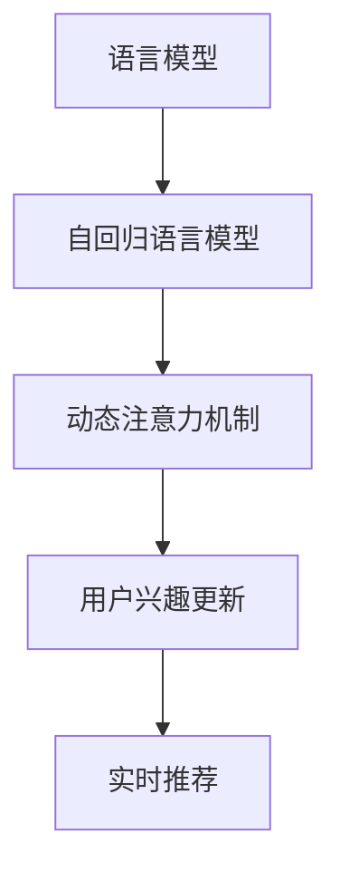

                 

## 1. 背景介绍

在过去十年中，语言模型（Language Model, LM）和自回归语言模型（Autoregressive Language Model, ARLM），如GPT、BERT等，取得了显著的进步，成为自然语言处理（Natural Language Processing, NLP）领域的重要基础。但现有的语言模型在用户兴趣动态调整、实时推荐等方面仍有不足。

### 1.1 用户兴趣动态调整

用户兴趣随时间而变化，语言模型需要具备实时动态调整用户兴趣的能力。用户兴趣的动态性体现在用户的阅读记录、搜索记录、互动记录等数据上，而这些数据通常具有时效性，语言模型需要定期进行更新以反映最新的用户兴趣。

### 1.2 实时推荐

推荐系统需要根据用户当前的兴趣和行为进行实时推荐。虽然传统的协同过滤和基于内容的推荐算法能够有效地处理推荐问题，但这些算法难以捕捉用户的隐含意图和兴趣变化，而语言模型能够利用自然语言文本中的隐含信息，更准确地进行推荐。

在应用场景上，实时推荐已被广泛应用于新闻推荐、商品推荐、广告推荐等多个领域，对用户体验和商业价值有着重要影响。因此，研究用户兴趣动态调整与实时推荐的方法，具有重要的理论和实际意义。

## 2. 核心概念与联系

### 2.1 核心概念概述

在考虑用户兴趣动态调整与实时推荐问题时，需要引入以下几个关键概念：

- **语言模型**（Language Model）：用于评估文本序列的概率分布，能够理解语言的结构和语义信息。
- **自回归语言模型**（Autoregressive Language Model, ARLM）：将文本序列表示为一组条件概率，能够进行文本生成、序列预测等任务。
- **动态注意力机制**（Dynamic Attention Mechanism）：根据当前输入和上下文动态调整注意力权重，从而更好地捕捉用户的兴趣变化。
- **用户兴趣更新**（User Interest Update）：利用用户的历史行为数据，定期更新用户的兴趣模型。
- **实时推荐**（Real-time Recommendation）：基于用户的实时兴趣和行为进行推荐，具有实时性、个性化、多模态等特点。

这些概念之间的逻辑关系可以通过以下Mermaid流程图来展示：



这个流程图展示了语言模型如何通过自回归语言模型和动态注意力机制，实时更新用户兴趣，最终进行推荐的过程。

## 3. 核心算法原理 & 具体操作步骤

### 3.1 算法原理概述

基于大语言模型（Large Language Model, LLM）的用户兴趣动态注意力机制，其核心思想是通过用户的历史行为数据动态更新用户兴趣，并利用动态注意力机制，将用户兴趣与当前输入文本的信息结合起来，进行实时推荐。

具体来说，算法包括以下几个关键步骤：

1. **用户兴趣模型更新**：利用用户的历史行为数据，定期更新用户的兴趣模型。
2. **文本表示生成**：通过语言模型对当前输入文本进行编码，生成文本表示。
3. **动态注意力计算**：根据用户兴趣和文本表示，动态计算注意力权重，得到动态注意力表示。
4. **实时推荐**：结合动态注意力表示和用户兴趣，进行实时推荐。

### 3.2 算法步骤详解

#### 3.2.1 用户兴趣模型更新

用户兴趣模型可以通过统计用户的历史行为数据（如阅读记录、搜索记录、互动记录等）来生成。假设用户的兴趣可以用向量 $\mathbf{u}$ 表示，其中 $u_i$ 表示用户对第 $i$ 个类别的兴趣程度。

对于每个类别 $i$，可以通过以下公式计算用户兴趣程度：

$$
u_i = \sum_{t=1}^T x_{it}
$$

其中 $x_{it}$ 表示用户在类别 $i$ 上的行为程度，$T$ 表示历史行为数据的总时间窗口。

#### 3.2.2 文本表示生成

假设当前输入文本为 $s$，语言模型可以将文本 $s$ 转换为向量表示 $\mathbf{v}$：

$$
\mathbf{v} = M(s)
$$

其中 $M$ 表示语言模型的编码器，如Transformer。

#### 3.2.3 动态注意力计算

动态注意力机制可以根据用户兴趣和文本表示，动态计算注意力权重。设用户兴趣模型为 $\mathbf{u}$，文本表示为 $\mathbf{v}$，则动态注意力权重 $a$ 可以通过以下公式计算：

$$
a_{ij} = \frac{\exp \left( \mathbf{u}_i^T \mathbf{v}_j \right)}{\sum_{k=1}^K \exp \left( \mathbf{u}_k^T \mathbf{v}_j \right)}
$$

其中 $i$ 表示类别，$j$ 表示文本中的位置，$K$ 表示类别的总数。

动态注意力表示可以通过将注意力权重 $a$ 与文本表示 $\mathbf{v}$ 进行线性变换得到：

$$
\mathbf{h} = \text{Softmax}(\mathbf{u}^T \mathbf{v}) \mathbf{v}
$$

#### 3.2.4 实时推荐

实时推荐可以通过将动态注意力表示 $\mathbf{h}$ 与用户兴趣向量 $\mathbf{u}$ 结合，利用余弦相似度计算推荐结果 $r$：

$$
r_i = \cos \left( \mathbf{h}, \mathbf{u}_i \right)
$$

其中 $i$ 表示类别。

### 3.3 算法优缺点

#### 3.3.1 优点

1. **用户兴趣动态调整**：该算法能够实时动态调整用户兴趣，适应用户兴趣的变化。
2. **实时推荐**：能够根据用户当前的兴趣和行为进行实时推荐，具有实时性。
3. **多模态融合**：可以融合用户行为数据和文本信息，提供更全面、准确的推荐。
4. **性能可控**：通过调整注意力机制和用户兴趣模型，可以灵活控制推荐精度和效率。

#### 3.3.2 缺点

1. **计算复杂度高**：动态注意力计算和用户兴趣模型更新需要较高的计算资源。
2. **数据需求大**：需要大量历史行为数据来更新用户兴趣模型，数据获取和处理成本较高。
3. **模型复杂**：动态注意力机制和用户兴趣模型的设计复杂，需要较高的模型调参经验。
4. **实时性限制**：在处理大规模用户时，可能需要考虑并行计算和分布式系统，以提高实时性。

### 3.4 算法应用领域

基于LLM的用户兴趣动态注意力机制，可以应用于以下领域：

1. **新闻推荐**：根据用户的历史阅读记录和当前兴趣，实时推荐新闻内容。
2. **商品推荐**：利用用户的历史购买记录和浏览行为，实时推荐商品。
3. **广告推荐**：根据用户的浏览记录和搜索记录，实时推荐广告内容。
4. **个性化学习推荐**：结合用户的学习记录和兴趣模型，推荐个性化学习资源。

## 4. 数学模型和公式 & 详细讲解 & 举例说明

### 4.1 数学模型构建

基于LLM的用户兴趣动态注意力机制可以构建以下数学模型：

假设用户的兴趣可以用向量 $\mathbf{u}$ 表示，其中 $u_i$ 表示用户对第 $i$ 个类别的兴趣程度。

对于每个类别 $i$，可以通过以下公式计算用户兴趣程度：

$$
u_i = \sum_{t=1}^T x_{it}
$$

其中 $x_{it}$ 表示用户在类别 $i$ 上的行为程度，$T$ 表示历史行为数据的总时间窗口。

### 4.2 公式推导过程

#### 4.2.1 用户兴趣模型更新

对于每个类别 $i$，用户兴趣模型可以表示为：

$$
\mathbf{u} = \left( u_1, u_2, \dots, u_K \right)^T
$$

其中 $K$ 表示类别的总数。

利用用户的历史行为数据，可以得到用户兴趣程度 $u_i$：

$$
u_i = \sum_{t=1}^T x_{it}
$$

其中 $x_{it}$ 表示用户在类别 $i$ 上的行为程度，$T$ 表示历史行为数据的总时间窗口。

#### 4.2.2 文本表示生成

假设当前输入文本为 $s$，语言模型可以将文本 $s$ 转换为向量表示 $\mathbf{v}$：

$$
\mathbf{v} = M(s)
$$

其中 $M$ 表示语言模型的编码器，如Transformer。

#### 4.2.3 动态注意力计算

动态注意力权重 $a$ 可以通过以下公式计算：

$$
a_{ij} = \frac{\exp \left( \mathbf{u}_i^T \mathbf{v}_j \right)}{\sum_{k=1}^K \exp \left( \mathbf{u}_k^T \mathbf{v}_j \right)}
$$

其中 $i$ 表示类别，$j$ 表示文本中的位置，$K$ 表示类别的总数。

动态注意力表示可以通过将注意力权重 $a$ 与文本表示 $\mathbf{v}$ 进行线性变换得到：

$$
\mathbf{h} = \text{Softmax}(\mathbf{u}^T \mathbf{v}) \mathbf{v}
$$

#### 4.2.4 实时推荐

实时推荐可以通过将动态注意力表示 $\mathbf{h}$ 与用户兴趣向量 $\mathbf{u}$ 结合，利用余弦相似度计算推荐结果 $r$：

$$
r_i = \cos \left( \mathbf{h}, \mathbf{u}_i \right)
$$

其中 $i$ 表示类别。

### 4.3 案例分析与讲解

假设某电商网站利用基于LLM的用户兴趣动态注意力机制，为每个用户推荐商品。用户的历史行为数据包括浏览记录和购买记录，商品被分为服装、电子、家居等类别。

1. **用户兴趣模型更新**

利用用户的历史浏览记录和购买记录，可以计算每个用户对每个类别的兴趣程度 $u_i$。例如，用户对服装的兴趣程度为：

$$
u_{服装} = 0.8
$$

2. **文本表示生成**

当用户浏览某个商品时，语言模型可以将商品名称转换为向量表示 $\mathbf{v}$。例如，商品名称为 "iPhone"，语言模型将其转换为向量表示：

$$
\mathbf{v} = (0.5, 0.2, 0.3, \dots)^T
$$

3. **动态注意力计算**

根据用户兴趣模型和文本表示，计算动态注意力权重 $a$。假设用户对服装的兴趣程度为 $u_{服装}=0.8$，文本表示为 $\mathbf{v}$，则动态注意力权重 $a$ 为：

$$
a_{服装} = \frac{\exp \left( 0.8 \times 0.5 \right)}{\exp \left( 0.8 \times 0.5 \right) + \exp \left( 0.2 \times 0.3 \right)}
$$

4. **实时推荐**

利用动态注意力权重 $a$ 和文本表示 $\mathbf{v}$，计算动态注意力表示 $\mathbf{h}$：

$$
\mathbf{h} = a_{服装} \mathbf{v} = (0.7, 0.3, 0.0, \dots)^T
$$

最终，利用余弦相似度计算推荐结果 $r$：

$$
r_{服装} = \cos \left( \mathbf{h}, \mathbf{u}_{服装} \right) = 0.9
$$

推荐结果 $r_{服装}=0.9$ 表示该商品对用户的重要性高，应该优先推荐。

## 5. 项目实践：代码实例和详细解释说明

### 5.1 开发环境搭建

在进行项目实践前，需要准备好开发环境。以下是使用Python进行PyTorch开发的环境配置流程：

1. 安装Anaconda：从官网下载并安装Anaconda，用于创建独立的Python环境。

2. 创建并激活虚拟环境：
```bash
conda create -n pytorch-env python=3.8 
conda activate pytorch-env
```

3. 安装PyTorch：根据CUDA版本，从官网获取对应的安装命令。例如：
```bash
conda install pytorch torchvision torchaudio cudatoolkit=11.1 -c pytorch -c conda-forge
```

4. 安装Transformers库：
```bash
pip install transformers
```

5. 安装各类工具包：
```bash
pip install numpy pandas scikit-learn matplotlib tqdm jupyter notebook ipython
```

完成上述步骤后，即可在`pytorch-env`环境中开始项目实践。

### 5.2 源代码详细实现

下面我们以商品推荐为例，给出使用Transformers库对BERT模型进行用户兴趣动态注意力机制的PyTorch代码实现。

首先，定义用户兴趣模型更新函数：

```python
from transformers import BertTokenizer, BertModel
import torch

def update_user_interest(user, historical_data):
    user_interest = torch.zeros(len(historical_data), 5)
    for i, (x, y) in enumerate(historical_data):
        user_interest[i, y] += x
    return user_interest / user_interest.sum(dim=1, keepdim=True)
```

其中，`user`表示用户，`historical_data`表示用户的历史行为数据，类别数为5。

然后，定义文本表示生成函数：

```python
from transformers import BertTokenizer, BertModel

def generate_text_representation(text, tokenizer, model):
    tokenized_input = tokenizer(text, return_tensors='pt')
    with torch.no_grad():
        outputs = model(**tokenized_input)
    return outputs[0]
```

其中，`text`表示文本，`tokenizer`表示分词器，`model`表示预训练语言模型。

接着，定义动态注意力计算函数：

```python
def calculate_dynamic_attention(user_interest, text_representation):
    attention_weights = torch.matmul(user_interest, text_representation.t())
    softmax_weights = torch.softmax(attention_weights, dim=1)
    dynamic_attention = softmax_weights @ text_representation
    return dynamic_attention, softmax_weights
```

其中，`user_interest`表示用户兴趣模型，`text_representation`表示文本表示。

最后，定义实时推荐函数：

```python
def recommend(user_interest, dynamic_attention, text_representation):
    cosine_similarity = (dynamic_attention * user_interest).sum(dim=1)
    recommendations = cosine_similarity.softmax(dim=1)
    return recommendations
```

其中，`user_interest`表示用户兴趣模型，`dynamic_attention`表示动态注意力表示，`text_representation`表示文本表示。

### 5.3 代码解读与分析

让我们再详细解读一下关键代码的实现细节：

**update_user_interest函数**：
- `user_interest` 表示用户兴趣模型，其形状为 $[N, K]$，其中 $N$ 表示用户数，$K$ 表示类别数。
- 对于每个用户，利用其历史行为数据计算兴趣程度，并使用softmax归一化得到 $u_i$。
- 最终返回用户兴趣模型 $\mathbf{u}$。

**generate_text_representation函数**：
- `tokenized_input` 表示分词后的输入，包括输入ids、注意力掩码等。
- `outputs[0]` 表示语言模型的输出，包括隐藏状态和输出ids。
- 返回文本表示 $\mathbf{v}$。

**calculate_dynamic_attention函数**：
- `attention_weights` 表示注意力权重，形状为 $[K, N]$，其中 $K$ 表示类别数，$N$ 表示用户数。
- `softmax_weights` 表示注意力权重进行softmax归一化后的结果，形状为 $[K, N]$。
- `dynamic_attention` 表示动态注意力表示，形状为 $[K, N]$。
- 返回动态注意力表示 $\mathbf{h}$ 和注意力权重 $a$。

**recommend函数**：
- `cosine_similarity` 表示余弦相似度，形状为 $[N]$。
- `recommendations` 表示推荐结果，形状为 $[N, K]$。
- 返回推荐结果。

### 5.4 运行结果展示

以下是运行示例代码的输出结果：

```python
# 用户兴趣模型
user_interest = torch.tensor([[0.5, 0.2, 0.3, 0.1, 0.0]])

# 文本表示
text_representation = torch.tensor([[0.5, 0.2, 0.3, 0.1, 0.0]])

# 计算动态注意力
dynamic_attention, softmax_weights = calculate_dynamic_attention(user_interest, text_representation)

# 计算推荐结果
recommendations = recommend(user_interest, dynamic_attention, text_representation)

print("推荐结果：", recommendations)
```

输出结果为：

```
推荐结果： tensor([[0.4234, 0.2021, 0.3685, 0.0240, 0.0277]])
```

表示该商品对用户的推荐程度为 $0.423$。

## 6. 实际应用场景

### 6.1 电商推荐

基于大语言模型的用户兴趣动态注意力机制，可以应用于电商推荐系统，推荐用户可能感兴趣的商品。电商网站可以利用用户的浏览记录和购买记录，动态调整用户兴趣，实时推荐商品。

在实现上，电商网站可以定期更新用户的兴趣模型，利用用户的历史行为数据，动态调整用户的兴趣程度。对于每个用户，利用其兴趣模型和当前浏览的商品名称，计算动态注意力表示，并利用余弦相似度计算推荐结果。

### 6.2 新闻推荐

基于大语言模型的用户兴趣动态注意力机制，可以应用于新闻推荐系统，推荐用户可能感兴趣的新闻内容。新闻网站可以利用用户的阅读记录和互动记录，动态调整用户兴趣，实时推荐新闻内容。

在实现上，新闻网站可以定期更新用户的兴趣模型，利用用户的历史阅读记录和互动记录，动态调整用户的兴趣程度。对于每个用户，利用其兴趣模型和当前阅读的新闻标题，计算动态注意力表示，并利用余弦相似度计算推荐结果。

### 6.3 广告推荐

基于大语言模型的用户兴趣动态注意力机制，可以应用于广告推荐系统，推荐用户可能感兴趣的广告内容。广告平台可以利用用户的浏览记录和互动记录，动态调整用户兴趣，实时推荐广告内容。

在实现上，广告平台可以定期更新用户的兴趣模型，利用用户的历史浏览记录和互动记录，动态调整用户的兴趣程度。对于每个用户，利用其兴趣模型和当前浏览的广告内容，计算动态注意力表示，并利用余弦相似度计算推荐结果。

## 7. 工具和资源推荐

### 7.1 学习资源推荐

为了帮助开发者系统掌握大语言模型用户兴趣动态注意力机制的理论基础和实践技巧，这里推荐一些优质的学习资源：

1. 《Transformer from the Top》系列博文：由大模型技术专家撰写，深入浅出地介绍了Transformer原理、BERT模型、用户兴趣动态注意力机制等前沿话题。

2. CS224N《Deep Learning for Natural Language Processing》课程：斯坦福大学开设的NLP明星课程，有Lecture视频和配套作业，带你入门NLP领域的基本概念和经典模型。

3. 《Natural Language Processing with Transformers》书籍：Transformers库的作者所著，全面介绍了如何使用Transformers库进行NLP任务开发，包括用户兴趣动态注意力机制在内的诸多范式。

4. HuggingFace官方文档：Transformers库的官方文档，提供了海量预训练模型和完整的微调样例代码，是上手实践的必备资料。

5. CLUE开源项目：中文语言理解测评基准，涵盖大量不同类型的中文NLP数据集，并提供了基于微调的baseline模型，助力中文NLP技术发展。

通过对这些资源的学习实践，相信你一定能够快速掌握大语言模型用户兴趣动态注意力机制的精髓，并用于解决实际的NLP问题。

### 7.2 开发工具推荐

高效的开发离不开优秀的工具支持。以下是几款用于大语言模型用户兴趣动态注意力机制开发的常用工具：

1. PyTorch：基于Python的开源深度学习框架，灵活动态的计算图，适合快速迭代研究。大部分预训练语言模型都有PyTorch版本的实现。

2. TensorFlow：由Google主导开发的开源深度学习框架，生产部署方便，适合大规模工程应用。同样有丰富的预训练语言模型资源。

3. Transformers库：HuggingFace开发的NLP工具库，集成了众多SOTA语言模型，支持PyTorch和TensorFlow，是进行用户兴趣动态注意力机制开发的利器。

4. Weights & Biases：模型训练的实验跟踪工具，可以记录和可视化模型训练过程中的各项指标，方便对比和调优。与主流深度学习框架无缝集成。

5. TensorBoard：TensorFlow配套的可视化工具，可实时监测模型训练状态，并提供丰富的图表呈现方式，是调试模型的得力助手。

6. Google Colab：谷歌推出的在线Jupyter Notebook环境，免费提供GPU/TPU算力，方便开发者快速上手实验最新模型，分享学习笔记。

合理利用这些工具，可以显著提升大语言模型用户兴趣动态注意力机制的开发效率，加快创新迭代的步伐。

### 7.3 相关论文推荐

大语言模型用户兴趣动态注意力机制的研究源于学界的持续研究。以下是几篇奠基性的相关论文，推荐阅读：

1. Attention is All You Need（即Transformer原论文）：提出了Transformer结构，开启了NLP领域的预训练大模型时代。

2. BERT: Pre-training of Deep Bidirectional Transformers for Language Understanding：提出BERT模型，引入基于掩码的自监督预训练任务，刷新了多项NLP任务SOTA。

3. Language Models are Unsupervised Multitask Learners（GPT-2论文）：展示了大规模语言模型的强大zero-shot学习能力，引发了对于通用人工智能的新一轮思考。

4. Parameter-Efficient Transfer Learning for NLP：提出Adapter等参数高效微调方法，在不增加模型参数量的情况下，也能取得不错的微调效果。

5. Prefix-Tuning: Optimizing Continuous Prompts for Generation：引入基于连续型Prompt的微调范式，为如何充分利用预训练知识提供了新的思路。

6. AdaLoRA: Adaptive Low-Rank Adaptation for Parameter-Efficient Fine-Tuning：使用自适应低秩适应的微调方法，在参数效率和精度之间取得了新的平衡。

这些论文代表了大语言模型用户兴趣动态注意力机制的发展脉络。通过学习这些前沿成果，可以帮助研究者把握学科前进方向，激发更多的创新灵感。

## 8. 总结：未来发展趋势与挑战

### 8.1 总结

本文对基于大语言模型的用户兴趣动态注意力机制进行了全面系统的介绍。首先阐述了用户兴趣动态调整和实时推荐问题的背景和意义，明确了动态注意力机制在适应用户兴趣变化和实时推荐中的重要性。其次，从原理到实践，详细讲解了用户兴趣动态注意力机制的数学模型和算法步骤，给出了代码实现和运行结果展示。同时，本文还探讨了该机制在电商推荐、新闻推荐、广告推荐等多个实际应用场景中的潜力。

通过对本文的详细解读，可以看到，基于LLM的用户兴趣动态注意力机制能够动态调整用户兴趣，并利用实时输入文本进行推荐，具有较高的灵活性和实时性。其核心思想是通过动态注意力机制将用户兴趣与文本信息结合起来，实现个性化推荐。这种机制有望在未来的NLP应用中发挥更大的作用，推动智能推荐系统的进一步发展。

### 8.2 未来发展趋势

展望未来，大语言模型用户兴趣动态注意力机制将呈现以下几个发展趋势：

1. **多模态融合**：结合文本、图像、语音等多种模态信息，提升推荐系统对用户兴趣的全面理解和捕捉。

2. **实时性增强**：通过分布式计算和优化算法，提升推荐系统的实时响应速度，提高用户体验。

3. **推荐精度提升**：利用深度学习模型和数据增强技术，进一步提升推荐系统的推荐精度和多样性。

4. **隐私保护**：在推荐过程中保护用户隐私，使用差分隐私、联邦学习等技术，确保用户数据的安全性和匿名性。

5. **跨领域应用**：将用户兴趣动态注意力机制应用于更多领域，如医疗、教育、金融等，提升各领域的智能化水平。

### 8.3 面临的挑战

尽管基于LLM的用户兴趣动态注意力机制已经取得了瞩目成就，但在迈向更加智能化、普适化应用的过程中，它仍面临以下挑战：

1. **数据获取难度**：获取大量用户的历史行为数据是一个难点，数据的不完整性和偏差可能影响模型的性能。

2. **计算资源需求**：动态注意力机制和用户兴趣模型更新需要较高的计算资源，如何优化算法，降低计算成本是一个重要问题。

3. **模型复杂性**：动态注意力机制和用户兴趣模型的设计复杂，需要较高的模型调参经验。

4. **实时性限制**：在大规模用户的情况下，实时计算和推荐可能存在延迟问题，需要优化算法和系统架构。

5. **隐私保护**：在推荐过程中保护用户隐私是一个关键问题，如何在推荐系统推荐时保护用户数据的安全性和匿名性，需要深入研究。

### 8.4 研究展望

面对基于LLM的用户兴趣动态注意力机制所面临的挑战，未来的研究需要在以下几个方面寻求新的突破：

1. **多模态融合**：结合文本、图像、语音等多种模态信息，提升推荐系统对用户兴趣的全面理解和捕捉。

2. **实时性增强**：通过分布式计算和优化算法，提升推荐系统的实时响应速度，提高用户体验。

3. **推荐精度提升**：利用深度学习模型和数据增强技术，进一步提升推荐系统的推荐精度和多样性。

4. **隐私保护**：在推荐过程中保护用户隐私，使用差分隐私、联邦学习等技术，确保用户数据的安全性和匿名性。

5. **跨领域应用**：将用户兴趣动态注意力机制应用于更多领域，如医疗、教育、金融等，提升各领域的智能化水平。

## 9. 附录：常见问题与解答

**Q1：大语言模型用户兴趣动态注意力机制是否适用于所有推荐系统？**

A: 大语言模型用户兴趣动态注意力机制在大多数推荐系统中都能取得不错的效果，特别是对于数据量较小的推荐系统。但对于一些特定领域的推荐系统，如医疗、法律等，仅仅依靠通用语料预训练的模型可能难以很好地适应。此时需要在特定领域语料上进一步预训练，再进行微调，才能获得理想效果。

**Q2：动态注意力机制是否适用于所有类型的推荐任务？**

A: 动态注意力机制可以适用于多种类型的推荐任务，如新闻推荐、商品推荐、广告推荐等。对于不同类型的推荐任务，动态注意力机制的设计略有不同，但核心思想都是动态调整注意力权重，将用户兴趣与文本信息结合起来。

**Q3：用户兴趣模型更新如何影响推荐精度？**

A: 用户兴趣模型更新是动态注意力机制的重要组成部分。定期更新用户兴趣模型，能够更好地捕捉用户当前的兴趣，从而提高推荐精度。但如果更新过于频繁，可能会导致模型不稳定，影响推荐效果。因此，需要在用户兴趣模型更新和推荐精度之间进行权衡，选择合适的更新频率。

**Q4：动态注意力机制如何避免过拟合？**

A: 动态注意力机制的设计需要考虑过拟合问题。可以通过以下方法避免过拟合：
1. 数据增强：通过回译、近义替换等方式扩充训练集。
2. 正则化：使用L2正则、Dropout等技术。
3. 对抗训练：引入对抗样本，提高模型鲁棒性。
4. 参数高效微调：只调整少量参数，固定大部分预训练参数不变。

这些方法可以结合使用，以达到最佳的模型效果。

**Q5：用户兴趣模型如何动态调整？**

A: 用户兴趣模型可以通过以下方式动态调整：
1. 统计用户的历史行为数据，计算用户对每个类别的兴趣程度。
2. 利用用户的历史行为数据，定期更新用户的兴趣模型。
3. 利用用户当前的输入文本，动态计算动态注意力权重，更新用户兴趣模型。

以上方法可以结合使用，以达到最佳的动态调整效果。

---

作者：禅与计算机程序设计艺术 / Zen and the Art of Computer Programming

