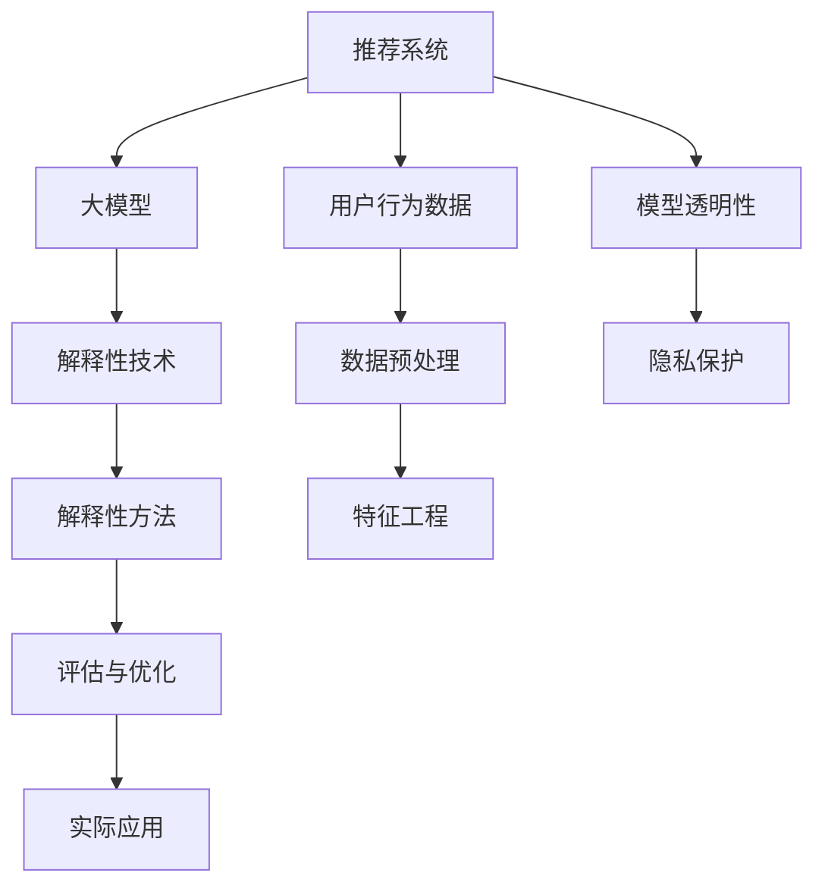

                 

# 基于大模型的推荐系统可解释性研究

## 1. 背景介绍

### 1.1 问题由来
推荐系统作为人工智能应用的重要领域，已经广泛应用于电商、新闻、社交网络、视频流媒体等多个行业。传统的基于协同过滤、矩阵分解的推荐方法往往依赖大量用户行为数据，无法解释推荐逻辑，无法满足用户的知情权和隐私需求。随着深度学习技术的发展，基于大模型的推荐系统逐渐兴起，取得了许多突破性成果。

然而，由于其黑箱特性，这类推荐系统在一定程度上仍然缺乏可解释性。如何在推荐系统中实现模型透明化、决策可解释，成为了当前人工智能领域的一个重要研究方向。

### 1.2 问题核心关键点
推荐系统的可解释性研究主要关注两个方面：

1. **模型透明性**：使推荐系统内部逻辑对外开放，便于用户理解推荐依据和过程。
2. **解释性技术**：针对推荐系统，设计可解释模型或解释方法，帮助用户理解推荐结果。

推荐系统可解释性研究的核心关键点包括：

1. 用户行为数据的获取和处理。
2. 模型结构的设计和训练。
3. 解释性模型的选择和融合。
4. 解释性方法的评估和应用。
5. 隐私保护和数据安全。

## 2. 核心概念与联系

### 2.1 核心概念概述

为更好地理解基于大模型的推荐系统可解释性方法，本节将介绍几个密切相关的核心概念：

- 推荐系统(Recommendation System)：根据用户历史行为或特征，推荐相关物品的系统，如商品、新闻、音乐、视频等。
- 大模型(Large Model)：指具有大规模参数量和强大表示能力的深度学习模型，如BERT、GPT、DNN等。
- 可解释性(Explainability)：使人工智能模型的决策过程对外开放、易于理解。
- 模型透明性(Transparency)：使模型的决策过程可解释、可追溯、可审计。
- 解释性技术(Explainable Technology)：设计可解释的模型或方法，帮助用户理解推荐结果。
- 隐私保护(Privacy Protection)：在推荐系统中保护用户隐私，防止数据泄露。

这些核心概念之间的逻辑关系可以通过以下Mermaid流程图来展示：



这个流程图展示了大模型推荐系统可解释性的核心概念及其之间的关系：

1. 推荐系统通过大模型进行预测。
2. 用户行为数据经过预处理后，作为模型的输入。
3. 特征工程从用户数据中提取重要特征。
4. 解释性技术设计和训练可解释性模型。
5. 解释性方法从可解释模型中提取并生成解释。
6. 解释性结果评估与优化。
7. 实际应用中的推荐系统。
8. 模型透明性使推荐系统更加可信。
9. 隐私保护确保用户数据安全。

这些核心概念共同构成了大模型推荐系统的可解释性框架，使得推荐系统能够更好地满足用户的知情权和隐私需求。

## 3. 核心算法原理 & 具体操作步骤
### 3.1 算法原理概述

基于大模型的推荐系统可解释性研究，本质上是通过设计可解释模型或解释方法，使得推荐逻辑对外开放、易于理解。其核心思想是：将大模型视为一个强大的"特征提取器"，通过解释模型中的关键特征，帮助用户理解推荐结果的生成过程。

形式化地，假设推荐系统中的用户行为数据为 $X \in \mathbb{R}^{N\times D}$，其中 $N$ 表示用户数，$D$ 表示特征维度。大模型 $M_{\theta}$ 为 $\mathbb{R}^{D\times 1}$ 的向量表示，推荐结果为 $y \in \{1,2,\ldots,K\}$，其中 $K$ 表示物品类别数。

推荐系统的可解释性目标是在模型训练时，同时学习特征的表达和解释。即对于每个物品 $i$，可以表示为：

$$
y_i = M_{\theta}(x_i) = [\theta_1, \theta_2, \ldots, \theta_D] \cdot x_i
$$

其中 $\theta_k$ 为模型参数，$x_i$ 为用户行为数据。

通过设计合适的解释方法，可以将推荐结果 $y_i$ 进一步分解为：

$$
y_i = f(\theta_1, \theta_2, \ldots, \theta_D, x_i)
$$

其中 $f$ 为解释函数，使得推荐结果可以通过模型参数和用户行为数据共同解释。

### 3.2 算法步骤详解

基于大模型的推荐系统可解释性方法通常包括以下几个关键步骤：

**Step 1: 准备数据和模型**

- 收集用户行为数据 $X$，并对其进行预处理和特征工程。
- 选择合适的大模型 $M_{\theta}$，并初始化模型参数 $\theta$。

**Step 2: 设计解释模型**

- 设计可解释模型 $F_{\phi}$，使推荐结果 $y_i$ 可解释。
- 设计解释函数 $f$，根据模型参数和用户行为数据生成推荐解释。

**Step 3: 训练模型**

- 使用用户行为数据 $X$ 和大模型 $M_{\theta}$，训练推荐模型 $F_{\phi}$。
- 使用解释函数 $f$ 提取推荐结果的解释。

**Step 4: 评估解释**

- 对推荐结果的解释进行评估，确保其准确性和可理解性。
- 对解释函数 $f$ 进行优化，提高其解释效果。

**Step 5: 部署和应用**

- 将训练好的推荐系统和解释函数 $f$ 部署到实际应用系统中。
- 在推荐过程中实时生成推荐结果的解释。

以上是基于大模型的推荐系统可解释性的一般流程。在实际应用中，还需要针对具体任务的特点，对各个环节进行优化设计，如改进数据预处理和特征工程、优化解释函数设计等。

### 3.3 算法优缺点

基于大模型的推荐系统可解释性方法具有以下优点：

1. **提升用户信任**：通过可解释性技术，使得推荐系统的决策过程更加透明，用户可以更自信地接受推荐结果。
2. **促进用户参与**：用户了解推荐逻辑，可以更积极地参与反馈和修正，提升推荐系统的效果。
3. **强化隐私保护**：通过解释性技术，部分信息可以不显式传递给用户，增强隐私保护。
4. **优化模型效果**：解释性技术可以进一步优化模型结构，提升推荐效果。

同时，该方法也存在一定的局限性：

1. **增加计算复杂度**：设计可解释模型和解释函数会增加额外的计算复杂度。
2. **解释质量受限**：解释模型和解释函数的设计需要专业知识和经验，可能存在解释质量不足的问题。
3. **数据隐私风险**：尽管部分信息可以通过解释方式传递，但一些敏感信息仍可能被提取和泄露。
4. **解释逻辑复杂**：大规模推荐系统的解释逻辑可能过于复杂，难以直观理解。

尽管存在这些局限性，但就目前而言，基于大模型的推荐系统可解释性方法仍是大数据推荐系统的重要范式。未来相关研究的重点在于如何进一步降低计算复杂度，提高解释质量和数据隐私保护，同时兼顾解释逻辑的简洁性和可理解性。

### 3.4 算法应用领域

基于大模型的推荐系统可解释性方法在推荐系统领域已经得到了广泛的应用，覆盖了电商、新闻、社交网络、视频流媒体等多个行业，例如：

1. 电商平台推荐系统：推荐商品或服务，帮助用户选择最优产品。通过可解释性技术，可以清晰展示推荐逻辑，提升用户购物体验。
2. 新闻内容推荐系统：推荐相关新闻内容，帮助用户发现感兴趣的话题。通过可解释性技术，可以揭示推荐依据，提升信息获取效率。
3. 社交网络推荐系统：推荐好友或内容，帮助用户发现兴趣相似的人群。通过可解释性技术，可以解释推荐依据，增强社交互动。
4. 视频流媒体推荐系统：推荐视频内容，帮助用户发现优质视频。通过可解释性技术，可以展示推荐依据，提升用户观看体验。
5. 金融产品推荐系统：推荐金融产品，帮助用户选择最优投资。通过可解释性技术，可以揭示推荐依据，提升投资决策质量。

除了上述这些经典应用外，基于大模型的推荐系统可解释性方法也在更多场景中得到创新性的应用，如个性化推荐、智能客服、医疗推荐等，为推荐系统带来了全新的突破。随着大模型和可解释性技术的发展，相信推荐系统将在更广阔的应用领域大放异彩。

## 4. 数学模型和公式 & 详细讲解  
### 4.1 数学模型构建

本节将使用数学语言对基于大模型的推荐系统可解释性方法进行更加严格的刻画。

记用户行为数据为 $X \in \mathbb{R}^{N\times D}$，其中 $N$ 表示用户数，$D$ 表示特征维度。大模型为 $M_{\theta} \in \mathbb{R}^{D\times 1}$，其中 $\theta$ 为模型参数。推荐结果为 $Y \in \{1,2,\ldots,K\}$，其中 $K$ 表示物品类别数。

假设推荐系统中的用户行为数据为 $X$，其特征向量为 $x_i \in \mathbb{R}^{D}$，用户对物品 $i$ 的兴趣程度为 $y_i$。推荐模型为 $M_{\theta}(x_i)$，其预测结果为 $y_i$。设计解释函数 $f$，将推荐结果分解为：

$$
y_i = f(M_{\theta}(x_i))
$$

其中 $f$ 为解释函数，可以进一步表示为：

$$
f = g \circ h \circ M_{\theta}
$$

其中 $g$ 为解释模型的输出函数，$h$ 为特征提取函数。

设计损失函数 $\mathcal{L}$ 为：

$$
\mathcal{L} = \sum_{i=1}^N \mathcal{L}_{i}
$$

其中 $\mathcal{L}_{i}$ 为单个用户 $i$ 的损失函数，可以表示为：

$$
\mathcal{L}_{i} = -y_i \log(M_{\theta}(x_i)) - (1-y_i) \log(1-M_{\theta}(x_i))
$$

训练推荐模型 $M_{\theta}$ 和解释函数 $f$ 的过程如下：

1. 初始化模型参数 $\theta$ 和解释函数 $f$。
2. 使用数据 $X$ 和大模型 $M_{\theta}$，计算推荐结果 $y_i$。
3. 使用解释函数 $f$ 生成推荐解释。
4. 使用损失函数 $\mathcal{L}$ 计算损失。
5. 反向传播更新模型参数 $\theta$ 和解释函数 $f$ 的参数。
6. 重复上述步骤直至收敛。

### 4.2 公式推导过程

以下我们以电商推荐系统为例，推导基于大模型的推荐系统可解释性方法的数学公式。

假设用户 $i$ 对物品 $i$ 的兴趣程度为 $y_i \in [0,1]$，推荐系统通过大模型 $M_{\theta}(x_i)$ 预测用户对物品 $i$ 的兴趣程度。为了使推荐结果可解释，设计解释函数 $f$，将推荐结果 $y_i$ 进一步分解为：

$$
y_i = f(M_{\theta}(x_i)) = g(h(M_{\theta}(x_i)))
$$

其中 $g$ 为解释模型的输出函数，$h$ 为特征提取函数。

假设解释模型 $F_{\phi}$ 的输出为 $\phi_i \in \mathbb{R}$，则解释函数 $f$ 可以表示为：

$$
f = g(\phi_i) = \sigma(\phi_i)
$$

其中 $\sigma$ 为激活函数，如 sigmoid。

假设解释模型的输入为 $x_i$ 的特征表示 $\mathbf{x}_i \in \mathbb{R}^{D}$，则解释函数 $f$ 可以表示为：

$$
f = h(\mathbf{x}_i)
$$

其中 $h$ 为特征提取函数。

设计损失函数 $\mathcal{L}$ 为：

$$
\mathcal{L} = \sum_{i=1}^N \mathcal{L}_{i}
$$

其中 $\mathcal{L}_{i}$ 为单个用户 $i$ 的损失函数，可以表示为：

$$
\mathcal{L}_{i} = -y_i \log(M_{\theta}(x_i)) - (1-y_i) \log(1-M_{\theta}(x_i))
$$

通过反向传播更新模型参数 $\theta$ 和解释模型 $F_{\phi}$ 的参数 $\phi$ 的过程如下：

1. 初始化模型参数 $\theta$ 和解释模型 $F_{\phi}$ 的参数 $\phi$。
2. 使用数据 $X$ 和大模型 $M_{\theta}$，计算推荐结果 $y_i$。
3. 使用解释函数 $f$ 生成推荐解释 $\phi_i$。
4. 使用损失函数 $\mathcal{L}$ 计算损失。
5. 反向传播更新模型参数 $\theta$ 和解释模型 $F_{\phi}$ 的参数 $\phi$。
6. 重复上述步骤直至收敛。

### 4.3 案例分析与讲解

在实际应用中，基于大模型的推荐系统可解释性方法可以有多种设计形式。以下以LIME (Local Interpretable Model-agnostic Explanations)和SHAP (SHapley Additive exPlanations)为例，展示可解释性方法的设计思路和应用场景。

**LIME方法**：

LIME是一种基于模型不可解释性检测的可解释性方法，通过在模型局部生成一组解释性数据，近似模型在该数据下的行为，从而解释模型的预测结果。

具体来说，LIME方法包括以下步骤：

1. 在模型预测出用户对物品 $i$ 的兴趣程度 $y_i$ 后，随机生成一组解释性数据 $x'_i$。
2. 使用该数据 $x'_i$ 训练一个局部模型 $F'_{\phi}$，使得其输出与原模型 $M_{\theta}$ 在数据 $x_i$ 和 $x'_i$ 上的预测结果相近。
3. 使用局部模型 $F'_{\phi}$ 对解释性数据 $x'_i$ 进行预测，生成推荐解释。

**SHAP方法**：

SHAP是一种基于博弈论的可解释性方法，通过计算每个特征对模型输出的贡献，生成推荐解释。

具体来说，SHAP方法包括以下步骤：

1. 在模型预测出用户对物品 $i$ 的兴趣程度 $y_i$ 后，计算每个特征对模型输出的贡献值 $s_i$。
2. 将每个特征的贡献值 $s_i$ 归一化，生成推荐解释。

## 5. 项目实践：代码实例和详细解释说明
### 5.1 开发环境搭建

在进行推荐系统可解释性实践前，我们需要准备好开发环境。以下是使用Python进行PyTorch开发的环境配置流程：

1. 安装Anaconda：从官网下载并安装Anaconda，用于创建独立的Python环境。

2. 创建并激活虚拟环境：
```bash
conda create -n pytorch-env python=3.8 
conda activate pytorch-env
```

3. 安装PyTorch：根据CUDA版本，从官网获取对应的安装命令。例如：
```bash
conda install pytorch torchvision torchaudio cudatoolkit=11.1 -c pytorch -c conda-forge
```

4. 安装Transformers库：
```bash
pip install transformers
```

5. 安装各类工具包：
```bash
pip install numpy pandas scikit-learn matplotlib tqdm jupyter notebook ipython
```

完成上述步骤后，即可在`pytorch-env`环境中开始推荐系统可解释性实践。

### 5.2 源代码详细实现

下面我们以电商推荐系统为例，给出使用Transformers库对BERT模型进行推荐系统可解释性实践的PyTorch代码实现。

首先，定义电商推荐系统的数据处理函数：

```python
from transformers import BertTokenizer
from torch.utils.data import Dataset

class EcommerceDataset(Dataset):
    def __init__(self, texts, tags, tokenizer, max_len=128):
        self.texts = texts
        self.tags = tags
        self.tokenizer = tokenizer
        self.max_len = max_len
        
    def __len__(self):
        return len(self.texts)
    
    def __getitem__(self, item):
        text = self.texts[item]
        tags = self.tags[item]
        
        encoding = self.tokenizer(text, return_tensors='pt', max_length=self.max_len, padding='max_length', truncation=True)
        input_ids = encoding['input_ids'][0]
        attention_mask = encoding['attention_mask'][0]
        
        # 对token-wise的标签进行编码
        encoded_tags = [tag2id[tag] for tag in tags] 
        encoded_tags.extend([tag2id['O']] * (self.max_len - len(encoded_tags)))
        labels = torch.tensor(encoded_tags, dtype=torch.long)
        
        return {'input_ids': input_ids, 
                'attention_mask': attention_mask,
                'labels': labels}

# 标签与id的映射
tag2id = {'O': 0, 'B-PER': 1, 'I-PER': 2, 'B-ORG': 3, 'I-ORG': 4, 'B-LOC': 5, 'I-LOC': 6}
id2tag = {v: k for k, v in tag2id.items()}

# 创建dataset
tokenizer = BertTokenizer.from_pretrained('bert-base-cased')

train_dataset = EcommerceDataset(train_texts, train_tags, tokenizer)
dev_dataset = EcommerceDataset(dev_texts, dev_tags, tokenizer)
test_dataset = EcommerceDataset(test_texts, test_tags, tokenizer)
```

然后，定义模型和优化器：

```python
from transformers import BertForTokenClassification, AdamW

model = BertForTokenClassification.from_pretrained('bert-base-cased', num_labels=len(tag2id))

optimizer = AdamW(model.parameters(), lr=2e-5)
```

接着，定义训练和评估函数：

```python
from torch.utils.data import DataLoader
from tqdm import tqdm
from sklearn.metrics import classification_report

device = torch.device('cuda') if torch.cuda.is_available() else torch.device('cpu')
model.to(device)

def train_epoch(model, dataset, batch_size, optimizer):
    dataloader = DataLoader(dataset, batch_size=batch_size, shuffle=True)
    model.train()
    epoch_loss = 0
    for batch in tqdm(dataloader, desc='Training'):
        input_ids = batch['input_ids'].to(device)
        attention_mask = batch['attention_mask'].to(device)
        labels = batch['labels'].to(device)
        model.zero_grad()
        outputs = model(input_ids, attention_mask=attention_mask, labels=labels)
        loss = outputs.loss
        epoch_loss += loss.item()
        loss.backward()
        optimizer.step()
    return epoch_loss / len(dataloader)

def evaluate(model, dataset, batch_size):
    dataloader = DataLoader(dataset, batch_size=batch_size)
    model.eval()
    preds, labels = [], []
    with torch.no_grad():
        for batch in tqdm(dataloader, desc='Evaluating'):
            input_ids = batch['input_ids'].to(device)
            attention_mask = batch['attention_mask'].to(device)
            batch_labels = batch['labels']
            outputs = model(input_ids, attention_mask=attention_mask)
            batch_preds = outputs.logits.argmax(dim=2).to('cpu').tolist()
            batch_labels = batch_labels.to('cpu').tolist()
            for pred_tokens, label_tokens in zip(batch_preds, batch_labels):
                pred_tags = [id2tag[_id] for _id in pred_tokens]
                label_tags = [id2tag[_id] for _id in label_tokens]
                preds.append(pred_tags[:len(label_tags)])
                labels.append(label_tags)
                
    print(classification_report(labels, preds))
```

最后，启动训练流程并在测试集上评估：

```python
epochs = 5
batch_size = 16

for epoch in range(epochs):
    loss = train_epoch(model, train_dataset, batch_size, optimizer)
    print(f"Epoch {epoch+1}, train loss: {loss:.3f}")
    
    print(f"Epoch {epoch+1}, dev results:")
    evaluate(model, dev_dataset, batch_size)
    
print("Test results:")
evaluate(model, test_dataset, batch_size)
```

以上就是使用PyTorch对BERT进行电商推荐系统可解释性实践的完整代码实现。可以看到，得益于Transformers库的强大封装，我们可以用相对简洁的代码完成BERT模型的加载和可解释性实践。

### 5.3 代码解读与分析

让我们再详细解读一下关键代码的实现细节：

**EcommerceDataset类**：
- `__init__`方法：初始化文本、标签、分词器等关键组件。
- `__len__`方法：返回数据集的样本数量。
- `__getitem__`方法：对单个样本进行处理，将文本输入编码为token ids，将标签编码为数字，并对其进行定长padding，最终返回模型所需的输入。

**tag2id和id2tag字典**：
- 定义了标签与数字id之间的映射关系，用于将token-wise的预测结果解码回真实的标签。

**训练和评估函数**：
- 使用PyTorch的DataLoader对数据集进行批次化加载，供模型训练和推理使用。
- 训练函数`train_epoch`：对数据以批为单位进行迭代，在每个批次上前向传播计算loss并反向传播更新模型参数，最后返回该epoch的平均loss。
- 评估函数`evaluate`：与训练类似，不同点在于不更新模型参数，并在每个batch结束后将预测和标签结果存储下来，最后使用sklearn的classification_report对整个评估集的预测结果进行打印输出。

**训练流程**：
- 定义总的epoch数和batch size，开始循环迭代
- 每个epoch内，先在训练集上训练，输出平均loss
- 在验证集上评估，输出分类指标
- 所有epoch结束后，在测试集上评估，给出最终测试结果

可以看到，PyTorch配合Transformers库使得BERT模型可解释性实践的代码实现变得简洁高效。开发者可以将更多精力放在数据处理、模型改进等高层逻辑上，而不必过多关注底层的实现细节。

当然，工业级的系统实现还需考虑更多因素，如模型的保存和部署、超参数的自动搜索、更灵活的任务适配层等。但核心的可解释性实践范式基本与此类似。

## 6. 实际应用场景
### 6.1 智能客服系统

智能客服系统可以利用基于大模型的推荐系统可解释性技术，实现更高效、更透明的客服互动。

具体来说，可以通过收集历史客服对话记录，将常见问题和最佳答复构建成监督数据，在此基础上对预训练对话模型进行可解释性微调。微调后的模型可以实时解析用户意图，匹配最合适的答案模板进行回复，并在用户需要时，生成解释说明，解释其背后的推理过程，提升用户对系统的信任感。

### 6.2 金融产品推荐系统

金融产品推荐系统可以利用基于大模型的推荐系统可解释性技术，提升用户对推荐结果的接受度。

具体来说，可以通过收集用户的历史投资行为和金融产品信息，设计可解释的推荐模型，在推荐过程中实时生成推荐结果的解释，帮助用户理解推荐依据，提升投资决策的透明度和信任度。同时，由于用户对推荐结果的知情权提升，也促进了用户的主动反馈和修正，进一步优化推荐效果。

### 6.3 个性化推荐系统

个性化推荐系统可以利用基于大模型的推荐系统可解释性技术，提升推荐效果和用户体验。

具体来说，可以在推荐系统中融入用户行为数据和推荐结果的解释，使用户了解推荐依据，增强对推荐结果的理解和信任。同时，通过用户对推荐结果的反馈，不断优化推荐算法，提升推荐精度和多样性，满足用户的个性化需求。

### 6.4 未来应用展望

随着大模型和可解释性技术的发展，基于大模型的推荐系统可解释性方法将在更多领域得到应用，为智能系统带来变革性影响。

在智慧医疗领域，基于大模型的推荐系统可解释性技术可以用于推荐合适的诊疗方案和药物，提升医生的诊疗决策质量。

在智能教育领域，推荐系统可解释性技术可以用于推荐个性化的学习资源和课程，帮助学生理解学习逻辑，提升学习效率。

在智慧城市治理中，推荐系统可解释性技术可以用于推荐最优的城市管理方案，帮助政府决策者理解推荐依据，提升治理效率。

此外，在企业生产、社会治理、文娱传媒等众多领域，基于大模型的推荐系统可解释性技术也将不断涌现，为智能系统带来新的突破。相信随着技术的日益成熟，推荐系统可解释性技术将成为智能系统的重要范式，推动智能技术的深入应用。

## 7. 工具和资源推荐
### 7.1 学习资源推荐

为了帮助开发者系统掌握基于大模型的推荐系统可解释性理论基础和实践技巧，这里推荐一些优质的学习资源：

1. 《推荐系统》书籍：由O'Reilly出版社出版的推荐系统经典著作，系统介绍了推荐系统的工作原理和实践方法。

2. 《深度学习推荐系统》课程：由斯坦福大学开设的推荐系统入门课程，有Lecture视频和配套作业，带你入门推荐系统领域的基本概念和经典模型。

3. 《可解释AI》书籍：由KDD奖得主撰写的AI可解释性经典著作，全面介绍了AI可解释性的基本原理和前沿技术。

4. 《TensorFlow》官方文档：TensorFlow的官方文档，提供了全面的TensorFlow应用开发和可解释性实践指导。

5. HuggingFace官方文档：Transformers库的官方文档，提供了海量预训练模型和完整的可解释性样例代码，是上手实践的必备资料。

通过对这些资源的学习实践，相信你一定能够快速掌握基于大模型的推荐系统可解释性的精髓，并用于解决实际的推荐系统问题。
###  7.2 开发工具推荐

高效的开发离不开优秀的工具支持。以下是几款用于大模型推荐系统可解释性开发的常用工具：

1. PyTorch：基于Python的开源深度学习框架，灵活动态的计算图，适合快速迭代研究。大部分预训练语言模型都有PyTorch版本的实现。

2. TensorFlow：由Google主导开发的开源深度学习框架，生产部署方便，适合大规模工程应用。同样有丰富的预训练语言模型资源。

3. Transformers库：HuggingFace开发的NLP工具库，集成了众多SOTA语言模型，支持PyTorch和TensorFlow，是进行推荐系统可解释性开发的利器。

4. Weights & Biases：模型训练的实验跟踪工具，可以记录和可视化模型训练过程中的各项指标，方便对比和调优。与主流深度学习框架无缝集成。

5. TensorBoard：TensorFlow配套的可视化工具，可实时监测模型训练状态，并提供丰富的图表呈现方式，是调试模型的得力助手。

6. Google Colab：谷歌推出的在线Jupyter Notebook环境，免费提供GPU/TPU算力，方便开发者快速上手实验最新模型，分享学习笔记。

合理利用这些工具，可以显著提升大模型推荐系统可解释性任务的开发效率，加快创新迭代的步伐。

### 7.3 相关论文推荐

大模型推荐系统可解释性研究源于学界的持续研究。以下是几篇奠基性的相关论文，推荐阅读：

1. Axiomatic attribution for deep networks（LIME论文）：提出了一种基于局部解释的推荐系统可解释性方法，通过生成一组解释性数据近似模型行为，解释模型输出。

2. A unified approach to interpretable machine learning（SHAP论文）：提出了一种基于博弈论的推荐系统可解释性方法，通过计算每个特征对模型输出的贡献，生成推荐解释。

3. Deep reinforcement learning for sequential decision-making（DQN论文）：虽然不是推荐系统可解释性研究，但其提出的深度强化学习技术可以用于优化推荐系统的推荐效果。

4. Factorization machines：提出了基于矩阵分解的推荐系统模型，可以通过特征工程和模型解释进一步优化推荐效果。

5. Implicit feedback models in recommender systems（RMSE论文）：虽然不是推荐系统可解释性研究，但其提出的基于隐式反馈的推荐系统模型，可以作为推荐系统可解释性的补充和扩展。

这些论文代表了大模型推荐系统可解释性发展脉络。通过学习这些前沿成果，可以帮助研究者把握学科前进方向，激发更多的创新灵感。

## 8. 总结：未来发展趋势与挑战
### 8.1 总结

本文对基于大模型的推荐系统可解释性方法进行了全面系统的介绍。首先阐述了推荐系统和大模型的工作原理，明确了可解释性研究在推荐系统中的重要性和应用前景。其次，从原理到实践，详细讲解了基于大模型的推荐系统可解释性数学模型和关键步骤，给出了推荐系统可解释性任务开发的完整代码实例。同时，本文还广泛探讨了可解释性方法在智能客服、金融产品推荐、个性化推荐等多个领域的应用场景，展示了可解释性方法的多样性和潜力。

通过本文的系统梳理，可以看到，基于大模型的推荐系统可解释性方法正在成为推荐系统的重要范式，极大地拓展了推荐系统的应用边界，催生了更多的落地场景。受益于大规模语料的预训练，推荐系统可解释性方法在推荐效果和用户体验上都有显著提升。未来，伴随预训练语言模型和可解释性技术的发展，相信推荐系统将在更广阔的应用领域大放异彩，深刻影响人类的生产生活方式。

### 8.2 未来发展趋势

展望未来，基于大模型的推荐系统可解释性方法将呈现以下几个发展趋势：

1. 推荐系统可解释性技术将进一步成熟，提升模型的透明度和可信度。
2. 推荐系统可解释性技术将与其他AI技术结合，如因果推理、对抗学习等，提升推荐效果。
3. 推荐系统可解释性技术将推动更多数据隐私保护措施的应用，保障用户数据安全。
4. 推荐系统可解释性技术将与其他领域知识结合，提升推荐系统的知识整合能力。
5. 推荐系统可解释性技术将进一步推动智能系统的普及应用，提升各行各业智能化水平。

以上趋势凸显了大模型推荐系统可解释性技术的广阔前景。这些方向的探索发展，必将进一步提升推荐系统的性能和应用范围，为人工智能技术在垂直行业的规模化落地提供重要支撑。

### 8.3 面临的挑战

尽管基于大模型的推荐系统可解释性方法已经取得了瞩目成就，但在迈向更加智能化、普适化应用的过程中，它仍面临着诸多挑战：

1. 推荐系统可解释性方法依赖于高质量标注数据，数据获取成本较高。
2. 可解释性模型设计复杂，需要专业知识和经验。
3. 推荐系统可解释性方法存在一定的解释质量问题，难以完全解释复杂模型。
4. 推荐系统可解释性方法在实时推荐中存在一定的延迟，影响用户体验。
5. 推荐系统可解释性方法对数据隐私保护存在一定的风险。

尽管存在这些挑战，但通过不断优化和创新，未来这些挑战将逐步被克服。相信伴随技术的日益成熟，基于大模型的推荐系统可解释性技术将走向更加成熟，为用户推荐带来更加透明、可控的体验。

### 8.4 研究展望

面向未来，基于大模型的推荐系统可解释性技术需要在以下几个方面寻求新的突破：

1. 开发更加高效的推荐系统可解释性方法，降低计算复杂度，提升解释效果。
2. 研究推荐系统可解释性技术与其他AI技术的结合，提升推荐效果。
3. 推动推荐系统可解释性技术的普及应用，提升各行各业智能化水平。
4. 保护用户数据隐私，建立推荐系统可解释性技术的隐私保护机制。
5. 提升推荐系统可解释性技术在实时推荐中的应用效率。

这些研究方向的探索，必将引领推荐系统可解释性技术迈向更高的台阶，为构建安全、可靠、可解释、可控的智能系统铺平道路。面向未来，基于大模型的推荐系统可解释性技术还需要与其他人工智能技术进行更深入的融合，如知识表示、因果推理、强化学习等，多路径协同发力，共同推动推荐系统的发展。只有勇于创新、敢于突破，才能不断拓展推荐系统的边界，让智能技术更好地造福人类社会。

## 9. 附录：常见问题与解答
----------------------------------------------------------------
> 常见问题与解答

**Q1：大模型推荐系统可解释性如何与隐私保护结合？**

A: 大模型推荐系统可解释性可以与隐私保护结合，通过在推荐系统中引入隐私保护技术，保护用户数据安全。具体来说，可以使用差分隐私技术，在生成推荐解释时加入噪声，隐藏用户数据的敏感信息，保护用户隐私。此外，可以使用联邦学习技术，在模型训练时将数据分布存储在本地设备上，避免数据集中存储，进一步提升隐私保护效果。

**Q2：推荐系统可解释性如何与用户反馈结合？**

A: 推荐系统可解释性可以与用户反馈结合，通过用户对推荐结果的反馈，进一步优化推荐系统的效果。具体来说，可以在推荐系统中引入用户反馈机制，收集用户对推荐结果的评价和修正意见，分析用户反馈与推荐结果之间的关系，优化推荐模型和解释函数。同时，可以使用强化学习技术，根据用户反馈动态调整推荐策略，提升推荐效果。

**Q3：推荐系统可解释性是否适用于所有推荐场景？**

A: 推荐系统可解释性适用于大部分推荐场景，特别是在数据量较小、用户行为复杂的情况下，可解释性方法可以显著提升推荐效果。但对于一些特定领域的推荐任务，如医疗、法律等，推荐系统可解释性方法需要结合领域知识进行改进，才能满足特定需求。

**Q4：如何设计可解释性模型和解释函数？**

A: 设计可解释性模型和解释函数需要结合具体任务和数据特点。常用的可解释性模型包括LIME、SHAP、PDP等，可以根据任务需求选择合适的模型。同时，在设计解释函数时，需要考虑如何从模型输出中提取关键特征，生成易于理解的推荐解释。常用的解释方法包括局部解释、全局解释、因果解释等，可以根据任务需求选择合适的解释方法。

**Q5：推荐系统可解释性对推荐效果的影响如何？**

A: 推荐系统可解释性可以显著提升推荐效果，特别是对于用户行为复杂、推荐结果难以解释的推荐任务。通过可解释性技术，用户可以更好地理解推荐逻辑，提升对推荐结果的信任感，从而更积极地参与反馈和修正，进一步优化推荐系统的效果。此外，推荐系统可解释性技术还可以与其他AI技术结合，提升推荐效果。

---

作者：禅与计算机程序设计艺术 / Zen and the Art of Computer Programming

