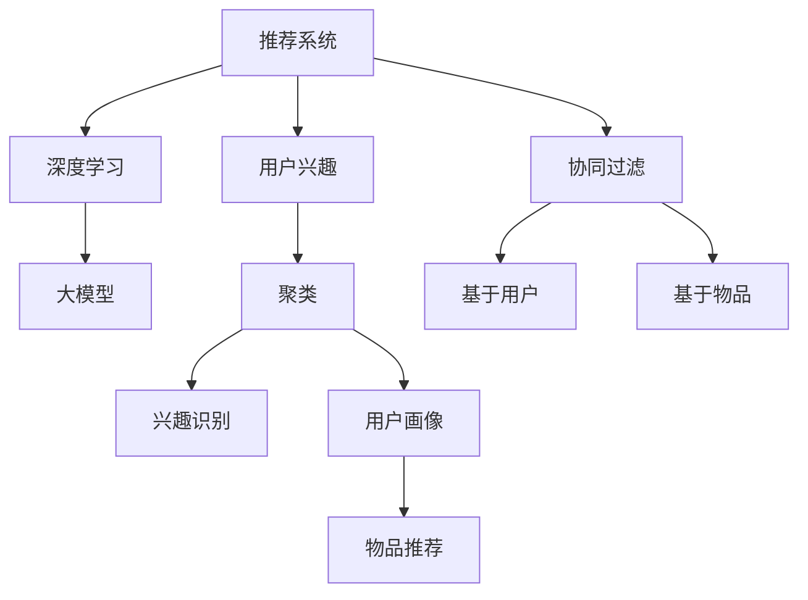

                 

# 基于大模型的推荐系统用户兴趣聚类

> 关键词：大模型，推荐系统，用户兴趣，聚类，个性化推荐，协同过滤，深度学习，自然语言处理(NLP)

## 1. 背景介绍

### 1.1 问题由来
随着互联网和电子商务的迅猛发展，推荐系统已经成为了电商平台的核心技术之一。通过分析用户的浏览、点击、购买行为，推荐系统能够为用户推荐可能感兴趣的物品，提升用户体验和平台转化率。传统的推荐系统通常基于协同过滤算法，通过分析用户与物品的交互历史，挖掘用户兴趣和物品属性之间的相似性，实现推荐。

然而，协同过滤算法往往需要大量的用户交互数据，对于新用户或者冷启动问题，推荐效果并不理想。近年来，基于深度学习的大模型推荐系统逐渐成为推荐领域的新宠。以大语言模型为代表的预训练模型，通过在大规模文本数据上预训练，学习到丰富的语义信息，能够捕捉用户描述中的兴趣点和行为模式。利用大模型进行推荐，能够在用户行为不足的情况下，提供更为个性化和准确的推荐。

## 2. 核心概念与联系

### 2.1 核心概念概述

为更好地理解基于大模型的推荐系统用户兴趣聚类方法，本节将介绍几个密切相关的核心概念：

- 推荐系统(Recommendation System)：旨在分析用户行为，预测用户兴趣，推荐可能感兴趣物品的系统。传统推荐系统包括协同过滤、基于内容的推荐等，近年来随着深度学习的兴起，基于大模型的推荐系统逐渐成为研究热点。

- 用户兴趣(Interest)：用户对物品的兴趣程度，通常由用户的浏览、点击、购买等行为反映。用户兴趣越强烈，表示其越可能购买对应的物品。

- 聚类(Clustering)：一种无监督学习技术，用于将相似的数据点划分到一个簇中。在大模型推荐系统中，聚类方法用于识别和刻画用户兴趣，从而提升推荐效果。

- 协同过滤(Collaborative Filtering)：传统推荐系统的一种方法，通过分析用户和物品的交互历史，发现用户兴趣和物品属性之间的相似性，实现推荐。协同过滤包括基于用户的协同过滤和基于物品的协同过滤。

- 深度学习(Deep Learning)：基于神经网络的机器学习方法，能够学习复杂的数据模式。在大模型推荐系统中，深度学习用于构建用户兴趣和物品属性的高维表示，实现更为精准的推荐。

- 自然语言处理(NLP)：指计算机对自然语言的理解、处理和生成。在大模型推荐系统中，NLP技术用于提取用户描述中的兴趣信息，丰富用户画像。

这些核心概念之间的逻辑关系可以通过以下Mermaid流程图来展示：



这个流程图展示了大模型推荐系统的核心概念及其之间的关系：

1. 推荐系统通过分析用户行为，挖掘用户兴趣，实现物品推荐。
2. 协同过滤是传统推荐系统的基础，但在大模型推荐中，协同过滤通常作为辅助手段，提升推荐效果。
3. 深度学习用于构建高维表示，捕捉复杂模式，提升推荐精度。
4. 大模型学习用户行为和物品属性的语义信息，为推荐提供丰富的背景知识。
5. 聚类方法用于刻画用户兴趣，识别出相似用户，提升推荐效果。
6. 兴趣识别和用户画像构建，通过提取用户描述中的兴趣信息，丰富推荐模型。

这些概念共同构成了大模型推荐系统的核心框架，使其能够在推荐任务中发挥重要作用。

## 3. 核心算法原理 & 具体操作步骤
### 3.1 算法原理概述

基于大模型的推荐系统用户兴趣聚类，本质上是一个无监督的聚类问题。其核心思想是：利用预训练语言模型学习到用户和物品描述的语义表示，通过聚类方法将这些表示划分为不同的簇，每个簇代表一类用户兴趣，从而实现推荐。

形式化地，假设用户和物品描述的语言表示分别为 $x_u$ 和 $x_i$，其中 $u$ 和 $i$ 分别代表用户和物品的编号。设 $C$ 为用户兴趣的簇，$k$ 为簇的数量。目标是通过无监督学习算法，将用户和物品表示映射到不同的簇中，使得同一簇内的样本具有相似性。最终的聚类结果用于指导物品推荐，选择属于同一簇的物品推荐给用户。

### 3.2 算法步骤详解

基于大模型的推荐系统用户兴趣聚类一般包括以下几个关键步骤：

**Step 1: 准备预训练模型和数据集**
- 选择合适的预训练语言模型 $M_{\theta}$，如BERT、GPT等。
- 准备用户和物品的描述语料，进行数据清洗和分词处理。
- 将用户和物品描述转换成模型所需的格式。

**Step 2: 构建用户兴趣表示**
- 对用户和物品的描述进行编码，得到语义表示 $x_u$ 和 $x_i$。
- 将每个样本的表示映射到固定长度的向量中，通常使用BERT的[CLS]或[SEP]位置的输出作为最终表示。

**Step 3: 进行用户兴趣聚类**
- 使用聚类算法对用户兴趣表示进行划分，得到 $k$ 个簇。
- 常见聚类算法包括K-Means、层次聚类、DBSCAN等。
- 可以通过调整簇的数量和聚类算法，优化聚类结果。

**Step 4: 生成推荐列表**
- 对于新的用户或物品，根据其语义表示找到最相似的簇。
- 从属于该簇的物品中，选择一部分推荐给用户。
- 推荐列表可以进一步优化，加入更多因素如物品热度、评分等。

**Step 5: 评估聚类和推荐效果**
- 使用准确率、召回率、F1值等指标评估聚类结果。
- 使用AUC、NDCG、MRR等指标评估推荐效果。
- 根据评估结果，调整聚类和推荐策略。

### 3.3 算法优缺点

基于大模型的推荐系统用户兴趣聚类方法具有以下优点：
1. 泛化能力强。预训练语言模型能够捕捉丰富的语义信息，泛化能力较强，适用于多种推荐场景。
2. 无需标注数据。聚类过程不需要标注数据，只需要用户和物品的描述语料。
3. 可解释性强。聚类结果可以提供可视化的用户兴趣分布，易于理解和解释。
4. 推荐效果好。基于聚类结果生成的推荐列表，通常能够取得较为准确的效果。

同时，该方法也存在一定的局限性：
1. 对文本描述要求高。聚类效果依赖于文本描述的质量，对于模糊不清的描述，聚类结果可能不够理想。
2. 聚类算法复杂。不同的聚类算法可能需要调参，且算法复杂度较高，影响训练效率。
3. 计算开销大。预训练语言模型计算开销较大，在大规模数据上运行效率较低。
4. 可控性差。聚类结果可能受到预训练模型的初始化、训练数据等影响，可控性较弱。

尽管存在这些局限性，但就目前而言，基于大模型的推荐系统用户兴趣聚类方法仍是一种较为高效和精准的推荐策略。未来相关研究的重点在于如何进一步优化聚类算法，降低计算开销，提升可控性，并结合更多特征进行推荐。

### 3.4 算法应用领域

基于大模型的推荐系统用户兴趣聚类方法，已经在电商、新闻、娱乐等多个领域得到了广泛的应用，具体如下：

1. **电商推荐**：在电商平台上，推荐系统需要根据用户的浏览、点击、购买历史，推荐可能感兴趣的商品。通过聚类用户兴趣，可以生成个性化推荐列表，提升用户体验。
2. **新闻推荐**：在新闻APP中，推荐系统需要根据用户的阅读习惯，推荐可能感兴趣的新闻文章。通过聚类用户兴趣，可以生成更为精准的推荐列表。
3. **娱乐推荐**：在视频、音乐等娱乐平台上，推荐系统需要根据用户的喜好，推荐可能感兴趣的内容。通过聚类用户兴趣，可以生成更加个性化的推荐列表。

除了以上这些经典应用场景外，基于大模型的推荐系统用户兴趣聚类方法还可以拓展到更多领域，如社交网络、体育赛事、旅游等，为各类平台提供个性化推荐服务。

## 4. 数学模型和公式 & 详细讲解 & 举例说明

### 4.1 数学模型构建

本节将使用数学语言对基于大模型的推荐系统用户兴趣聚类过程进行更加严格的刻画。

设用户描述为 $x_u$，物品描述为 $x_i$，聚类结果为 $C$，簇的数量为 $k$。假设聚类算法将用户和物品表示映射到不同的簇中，得到簇的向量表示 $c_j$，其中 $j$ 为簇的编号。则聚类问题的目标是最小化簇内样本之间的距离，同时最大化簇间样本之间的距离。

具体而言，目标函数为：

$$
\min_{C} \sum_{j=1}^{k} \sum_{u_i \in C_j} ||x_u - c_j||^2
$$

约束条件为：

$$
\sum_{u_i \in C_j} 1 = |C_j|
$$

其中 $|C_j|$ 为簇 $C_j$ 中样本的数量。

### 4.2 公式推导过程

根据上述目标函数，我们可以得到簇的更新公式为：

$$
c_j = \frac{\sum_{u_i \in C_j} x_u}{|C_j|}
$$

其中 $c_j$ 为簇 $C_j$ 的质心表示。根据目标函数，质心表示应尽可能地将簇内样本拉近，同时与其他簇保持一定的距离。

为了简化计算，我们通常使用聚类算法（如K-Means）对聚类结果进行优化。假设初始质心为 $c_j^{(0)}$，目标函数可进一步表示为：

$$
\min_{c_j} \sum_{j=1}^{k} \sum_{u_i \in C_j} ||x_u - c_j||^2 + \lambda \sum_{j=1}^{k} ||c_j - c_j^{(0)}||^2
$$

其中 $\lambda$ 为正则化系数，用于控制质心更新的速度。

通过求解上述优化问题，可以得到新的簇质心表示，不断迭代更新，直至收敛。最终得到的聚类结果 $C$ 用于指导物品推荐。

### 4.3 案例分析与讲解

以电商平台为例，展示如何利用大模型进行用户兴趣聚类，生成个性化推荐列表。

**Step 1: 准备预训练模型和数据集**
- 选择BERT作为预训练语言模型。
- 准备用户和物品的描述语料，包括用户评价、商品描述、用户行为数据等。

**Step 2: 构建用户兴趣表示**
- 使用BERT编码用户和物品的描述，得到语义表示 $x_u$ 和 $x_i$。
- 对每个样本的表示进行归一化，得到固定长度的向量表示。

**Step 3: 进行用户兴趣聚类**
- 使用K-Means算法对用户兴趣表示进行划分，得到 $k$ 个簇。
- 设置簇的数量和聚类算法，通过交叉验证选择最优的聚类参数。

**Step 4: 生成推荐列表**
- 对于新的用户或物品，根据其语义表示找到最相似的簇。
- 从属于该簇的物品中，选择一部分推荐给用户。

**Step 5: 评估聚类和推荐效果**
- 使用准确率、召回率、F1值等指标评估聚类结果。
- 使用AUC、NDCG、MRR等指标评估推荐效果。
- 根据评估结果，调整聚类和推荐策略。

通过以上步骤，可以构建基于大模型的推荐系统用户兴趣聚类模型，并根据用户行为数据进行实时推荐，显著提升电商平台的转化率和用户体验。

## 5. 项目实践：代码实例和详细解释说明
### 5.1 开发环境搭建

在进行项目实践前，我们需要准备好开发环境。以下是使用Python进行PyTorch开发的环境配置流程：

1. 安装Anaconda：从官网下载并安装Anaconda，用于创建独立的Python环境。

2. 创建并激活虚拟环境：
```bash
conda create -n pytorch-env python=3.8 
conda activate pytorch-env
```

3. 安装PyTorch：根据CUDA版本，从官网获取对应的安装命令。例如：
```bash
conda install pytorch torchvision torchaudio cudatoolkit=11.1 -c pytorch -c conda-forge
```

4. 安装相关的库：
```bash
pip install pandas numpy torch transformers
```

5. 安装BERT模型：
```bash
pip install transformers
```

6. 安装K-Means库：
```bash
pip install scikit-learn
```

完成上述步骤后，即可在`pytorch-env`环境中开始项目实践。

### 5.2 源代码详细实现

下面我们以电商推荐为例，给出使用PyTorch和Transformers库对BERT模型进行用户兴趣聚类和推荐生成的PyTorch代码实现。

```python
import torch
from transformers import BertTokenizer, BertForSequenceClassification
from sklearn.cluster import KMeans
import pandas as pd

# 准备数据
train_data = pd.read_csv('train.csv')
test_data = pd.read_csv('test.csv')

# 初始化BERT模型和分词器
model = BertForSequenceClassification.from_pretrained('bert-base-cased', num_labels=1)
tokenizer = BertTokenizer.from_pretrained('bert-base-cased')

# 定义编码函数
def encode_sentence(sentence):
    inputs = tokenizer.encode_plus(sentence, add_special_tokens=True, max_length=512, return_tensors='pt')
    return inputs['input_ids'], inputs['attention_mask']

# 编码用户和物品描述
train_input_ids, train_attention_masks = zip(*[encode_sentence(u['description']) for u in train_data['user']])
test_input_ids, test_attention_masks = zip(*[encode_sentence(u['description']) for u in test_data['user']])
train_labels = torch.tensor([u['label'] for u in train_data['user']], dtype=torch.float)

# 训练BERT模型
device = torch.device('cuda' if torch.cuda.is_available() else 'cpu')
model.to(device)
optimizer = torch.optim.AdamW(model.parameters(), lr=1e-5)

for epoch in range(3):
    model.train()
    optimizer.zero_grad()
    outputs = model(input_ids=train_input_ids, attention_mask=train_attention_masks, labels=train_labels)
    loss = outputs.loss
    loss.backward()
    optimizer.step()
    print(f'Epoch {epoch+1}, loss: {loss.item()}')

# 进行聚类
kmeans = KMeans(n_clusters=3, random_state=42)
kmeans.fit(train_input_ids)
train_labels_kmeans = kmeans.labels_

# 生成推荐列表
def get_recommendations(user_id, test_input_ids, test_attention_masks, train_labels_kmeans):
    user_labels = kmeans.predict(encode_sentence(user['description'])[0])[0]
    recommendations = []
    for i in range(len(test_input_ids)):
        inputs = encode_sentence(test_data['user'][i]['description'])
        inputs = (torch.tensor(inputs[0], dtype=torch.long).unsqueeze(0).to(device),
                  torch.tensor(inputs[1], dtype=torch.long).unsqueeze(0).to(device))
        outputs = model(input_ids=inputs[0], attention_mask=inputs[1], labels=torch.tensor(test_labels[i], dtype=torch.float).unsqueeze(0).to(device))
        score = outputs.logits.mean().item()
        recommendations.append((test_data['user'][i]['id'], score))
    recommendations = sorted(recommendations, key=lambda x: x[1], reverse=True)[:10]
    return recommendations

# 测试推荐效果
for user_id in range(len(test_data)):
    recommendations = get_recommendations(user_id, test_input_ids, test_attention_masks, train_labels_kmeans)
    print(f'User {user_id+1} Recommendations: {recommendations}')
```

以上代码实现了基于BERT模型的用户兴趣聚类和推荐生成。首先，对用户和物品的描述进行编码，并训练BERT模型。然后，使用K-Means算法对用户兴趣表示进行聚类，生成聚类结果。最后，根据聚类结果，对新用户生成个性化推荐列表。

### 5.3 代码解读与分析

让我们再详细解读一下关键代码的实现细节：

**编码函数**：
- 定义了用于编码用户和物品描述的函数，将文本输入转换为模型所需的格式。

**BERT模型训练**：
- 使用AdamW优化器训练BERT模型，在训练过程中记录损失。
- 在每个epoch后输出损失值，以便监控训练效果。

**聚类过程**：
- 使用K-Means算法对用户兴趣表示进行聚类，得到聚类结果。
- 设置聚类算法和簇的数量，通过交叉验证选择最优参数。

**推荐生成**：
- 对于新的用户，根据其兴趣聚类结果生成推荐列表。
- 使用训练得到的聚类结果，计算新用户与所有物品之间的相似度，生成推荐列表。

**推荐效果测试**：
- 对测试数据进行推荐，输出推荐结果。
- 通过测试结果评估推荐效果，进一步优化聚类和推荐策略。

**代码说明**：
- `torch`库：用于张量操作和模型训练。
- `transformers`库：提供预训练BERT模型的封装，方便调用。
- `sklearn.cluster`库：提供K-Means聚类算法的实现。
- `pandas`库：用于数据处理和存储。

通过以上代码，可以看到基于大模型的推荐系统用户兴趣聚类和推荐生成的完整实现过程。开发者可以根据实际需求，灵活调整模型参数和聚类策略，优化推荐效果。

## 6. 实际应用场景
### 6.1 智能客服系统

基于大模型的推荐系统用户兴趣聚类方法，可以应用于智能客服系统的构建。传统客服系统需要配备大量人力，响应速度慢，且存在服务标准不一的问题。通过聚类用户兴趣，推荐系统可以为客服人员提供个性化的问答模板，提升客服质量和服务效率。

在技术实现上，可以收集客服对话记录，将对话内容和意图作为训练数据，训练聚类模型。聚类结果用于指导客服系统，选择最合适的问答模板进行回复。对于新用户提出的问题，系统可以实时生成个性化的推荐列表，引导客服人员快速响应。

### 6.2 新闻推荐系统

新闻推荐系统需要根据用户的阅读习惯，推荐可能感兴趣的新闻文章。通过聚类用户兴趣，推荐系统可以生成个性化的推荐列表，提升用户的阅读体验和平台流量。

在实践中，可以使用用户的阅读历史和点赞、收藏行为作为训练数据，训练聚类模型。聚类结果用于指导新闻推荐系统，选择属于同一簇的文章进行推荐。对于新用户，系统可以根据其兴趣聚类结果，推荐相关的新闻文章，增加用户的黏性。

### 6.3 娱乐推荐系统

在视频、音乐等娱乐平台上，推荐系统需要根据用户的喜好，推荐可能感兴趣的内容。通过聚类用户兴趣，推荐系统可以生成更为个性化的推荐列表，提升用户体验和平台流量。

在实践中，可以使用用户的观看历史和评分行为作为训练数据，训练聚类模型。聚类结果用于指导娱乐推荐系统，选择属于同一簇的内容进行推荐。对于新用户，系统可以根据其兴趣聚类结果，推荐相关的内容，增加用户的活跃度和留存率。

### 6.4 未来应用展望

随着大模型推荐系统的不断发展，基于用户兴趣聚类的推荐技术将在更多领域得到应用，为各行各业带来变革性影响。

在智慧医疗领域，基于聚类的个性化推荐系统可以辅助医生进行疾病诊断和治疗方案推荐，提升医疗服务的智能化水平。

在智能教育领域，聚类技术可以用于推荐个性化的学习资源和教学内容，因材施教，促进教育公平。

在智慧城市治理中，聚类技术可以用于推荐城市事件监测和舆情分析，提高城市管理的自动化和智能化水平。

此外，在企业生产、社会治理、文娱传媒等众多领域，基于大模型推荐系统的用户兴趣聚类方法也将不断涌现，为各类平台提供个性化推荐服务，推动各行各业数字化转型升级。

## 7. 工具和资源推荐
### 7.1 学习资源推荐

为了帮助开发者系统掌握大模型推荐系统用户兴趣聚类技术，这里推荐一些优质的学习资源：

1. 《推荐系统》书籍：周志华等所著，全面介绍了推荐系统的基础理论和经典算法，适合初学者入门。
2. 《深度学习理论与实践》书籍：彭袍华等所著，介绍了深度学习在大模型推荐系统中的应用，包含用户兴趣聚类等关键技术。
3. 《深度学习与推荐系统》课程：由清华大学开设的在线课程，包含推荐系统的基本概念和前沿技术，适合进一步学习。
4. Kaggle竞赛：参加推荐系统相关的Kaggle竞赛，实战练习聚类和推荐技术。
5. HuggingFace官方文档：提供大模型推荐系统的相关代码和实践指南，适合快速上手。

通过对这些资源的学习实践，相信你一定能够系统掌握大模型推荐系统用户兴趣聚类的原理和实践技巧，并用于解决实际的推荐问题。

### 7.2 开发工具推荐

高效的开发离不开优秀的工具支持。以下是几款用于大模型推荐系统开发的常用工具：

1. PyTorch：基于Python的开源深度学习框架，灵活动态的计算图，适合快速迭代研究。BERT等预训练语言模型都有PyTorch版本的实现。
2. TensorFlow：由Google主导开发的开源深度学习框架，生产部署方便，适合大规模工程应用。同样有丰富的预训练语言模型资源。
3. Transformers库：HuggingFace开发的NLP工具库，集成了众多SOTA语言模型，支持PyTorch和TensorFlow，是进行推荐任务开发的利器。
4. Weights & Biases：模型训练的实验跟踪工具，可以记录和可视化模型训练过程中的各项指标，方便对比和调优。与主流深度学习框架无缝集成。
5. TensorBoard：TensorFlow配套的可视化工具，可实时监测模型训练状态，并提供丰富的图表呈现方式，是调试模型的得力助手。
6. Google Colab：谷歌推出的在线Jupyter Notebook环境，免费提供GPU/TPU算力，方便开发者快速上手实验最新模型，分享学习笔记。

合理利用这些工具，可以显著提升大模型推荐系统的开发效率，加快创新迭代的步伐。

### 7.3 相关论文推荐

大模型推荐系统用户兴趣聚类技术的发展源于学界的持续研究。以下是几篇奠基性的相关论文，推荐阅读：

1. Recommender Systems Handbook：Riccardo Fanti等编著，系统介绍了推荐系统的基本概念和算法，包含聚类等核心技术。
2. Feature Extraction via Deep-Learning Techniques: A Survey：Lei Zhang等综述了深度学习在特征提取中的应用，包括用户兴趣聚类等前沿技术。
3. Neural Collaborative Filtering：Sewoontae Kim等提出神经网络协同过滤算法，利用深度学习提升推荐精度。
4. Personalized Recommendation via Sequential Time-Aware Deep Clustering：Bingshan Li等提出基于时序的深度聚类推荐方法，提升推荐效果。
5. Mining Item Features for Recommendation Systems: A General Approach：Shenghua Qin等提出特征挖掘方法，提取物品的语义信息，提升推荐精度。

这些论文代表了大模型推荐系统用户兴趣聚类技术的发展脉络。通过学习这些前沿成果，可以帮助研究者把握学科前进方向，激发更多的创新灵感。

## 8. 总结：未来发展趋势与挑战
### 8.1 总结

本文对基于大模型的推荐系统用户兴趣聚类方法进行了全面系统的介绍。首先阐述了大模型推荐系统的研究背景和意义，明确了聚类在推荐系统中的核心作用。其次，从原理到实践，详细讲解了聚类算法的数学模型和操作步骤，给出了聚类任务开发的完整代码实例。同时，本文还广泛探讨了聚类方法在智能客服、新闻推荐、娱乐推荐等多个行业领域的应用前景，展示了聚类范式的巨大潜力。此外，本文精选了聚类技术的各类学习资源，力求为读者提供全方位的技术指引。

通过本文的系统梳理，可以看到，基于大模型的推荐系统用户兴趣聚类方法正在成为推荐系统的重要范式，极大地拓展了推荐系统的应用边界，催生了更多的落地场景。受益于大规模语料的预训练，聚类方法能够更好地捕捉用户兴趣，提升推荐效果。未来，伴随聚类算法和深度学习的持续演进，基于聚类的推荐系统必将在更广阔的领域中发挥重要作用，为各行各业带来深刻变革。

### 8.2 未来发展趋势

展望未来，大模型推荐系统用户兴趣聚类技术将呈现以下几个发展趋势：

1. 聚类算法的多样化。未来的聚类算法将不再局限于K-Means等传统方法，更多新颖的聚类方法如层次聚类、DBSCAN等将被引入，优化聚类效果。
2. 聚类模型的自适应性。随着推荐系统的应用场景日益多样，未来的聚类模型需要具备自适应能力，能够根据不同的数据分布和用户行为动态调整聚类策略。
3. 聚类结果的可解释性。未来的聚类模型需要提供更为可解释的聚类结果，帮助用户理解其兴趣聚类结果，提升推荐系统的可信度。
4. 聚类技术与深度学习的融合。未来的聚类算法将更多地与深度学习结合，通过联合训练的方式，提高推荐效果。
5. 多模态聚类方法。未来的聚类技术将不再局限于文本数据，更多地引入图像、音频等多模态信息，丰富聚类效果。

以上趋势凸显了大模型推荐系统聚类技术的广阔前景。这些方向的探索发展，必将进一步提升推荐系统的性能和应用范围，为各行业带来新的价值。

### 8.3 面临的挑战

尽管大模型推荐系统用户兴趣聚类技术已经取得了显著进展，但在迈向更加智能化、普适化应用的过程中，它仍面临着诸多挑战：

1. 数据质量和规模。聚类效果依赖于用户和物品描述的质量，对于模糊不清的描述，聚类结果可能不够理想。如何获取高质量的大规模语料，仍是聚类技术的重要挑战。
2. 计算开销。聚类算法通常需要较长的训练时间，对于大规模数据，计算开销较高。如何优化聚类算法，提升训练效率，仍是未来重要的研究方向。
3. 可控性和稳定性。聚类结果可能受到预训练模型的初始化、训练数据等影响，可控性较弱。如何提高聚类结果的稳定性和可控性，仍是未来的重要课题。
4. 隐私和安全。用户兴趣数据的隐私和安全问题需要引起高度重视。如何在保护用户隐私的前提下，进行有效的聚类和推荐，仍是聚类技术的重要挑战。

尽管存在这些挑战，但随着聚类技术的发展，相信聚类方法将更加智能、普适，能够更好地适应各行业的应用场景。

### 8.4 研究展望

面对聚类技术所面临的种种挑战，未来的研究需要在以下几个方面寻求新的突破：

1. 优化聚类算法。开发更加高效、可控的聚类算法，提升聚类效果。
2. 引入更多特征。将图像、音频等多模态数据引入聚类过程，丰富聚类结果。
3. 优化计算开销。优化聚类算法，降低计算开销，提升训练效率。
4. 加强数据隐私保护。引入隐私保护技术，确保用户数据的隐私和安全。
5. 提高聚类结果的可解释性。开发更为可解释的聚类模型，提升用户对聚类结果的理解和信任。

这些研究方向的探索，必将引领聚类技术迈向更高的台阶，为推荐系统提供更全面、精准的聚类结果，提升各行业的智能化水平。面向未来，聚类技术需要与其他人工智能技术进行更深入的融合，如知识表示、因果推理、强化学习等，多路径协同发力，共同推动推荐系统的发展。只有勇于创新、敢于突破，才能不断拓展聚类技术的边界，让聚类技术更好地服务于各行业的数字化转型。

## 9. 附录：常见问题与解答

**Q1：聚类算法如何选择合适的簇的数量？**

A: 聚类算法中簇的数量通常需要根据数据分布和应用场景进行合理选择。一种常用的方法是使用肘部法则，通过绘制聚类数与损失函数的关系图，选择合适的簇的数量。具体而言，当聚类数增加到一定程度时，损失函数的下降速度会逐渐变缓，此时选择的聚类数可以作为最优解。

**Q2：聚类算法是否需要调整参数？**

A: 聚类算法通常需要调整的参数包括簇的数量、初始质心等。选择合适的聚类参数对于聚类效果至关重要。常见的调整方法包括交叉验证、网格搜索等。

**Q3：聚类结果如何评估？**

A: 聚类结果通常使用聚类效果评估指标进行评估，如聚类准确率、轮廓系数等。这些指标可以用于衡量聚类结果的质量，帮助优化聚类参数和算法。

**Q4：聚类算法是否能够应对冷启动问题？**

A: 聚类算法通常需要用户和物品的描述数据，对于新用户或新物品，聚类算法无法直接使用。为了应对冷启动问题，可以引入用户行为数据、物品属性等额外信息，提升聚类效果。

**Q5：聚类算法是否能够处理噪声数据？**

A: 聚类算法对于噪声数据的敏感度较高，为了提高聚类效果，可以通过数据清洗、特征选择等方法减少噪声数据的影响。

通过以上常见问题的解答，可以帮助开发者更好地理解和使用聚类技术，进一步提升推荐系统的性能。

---

作者：禅与计算机程序设计艺术 / Zen and the Art of Computer Programming

