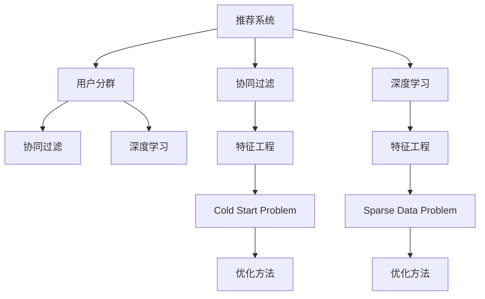

                 

# 基于大模型的推荐系统用户分群优化

> 关键词：推荐系统,用户分群,大模型,协同过滤,深度学习

## 1. 背景介绍

### 1.1 问题由来
随着互联网的发展，信息过载的问题日益严重。用户在面对海量数据时，难以高效地从中找到对自己有价值的信息。因此，推荐系统应运而生，利用用户行为数据，为用户推荐个性化的信息，提升用户体验和信息获取效率。

推荐系统主要包括基于内容的推荐、协同过滤推荐和混合推荐等类型。其中，协同过滤推荐（Collaborative Filtering）根据用户的历史行为数据，寻找与当前用户兴趣相似的用户，或寻找与当前用户历史行为相似的物品，进行推荐。然而，协同过滤推荐存在冷启动问题、数据稀疏问题等局限，难以全面覆盖所有用户。

为了解决这些问题，研究者引入了深度学习方法，通过构建大模型，对用户历史行为和物品特征进行深层学习，捕捉用户隐式兴趣和物品隐式关联。大模型的引入，显著提升了推荐系统的精度和泛化能力。

## 2. 核心概念与联系

### 2.1 核心概念概述

为了更好地理解基于大模型的推荐系统用户分群优化方法，本节将介绍几个密切相关的核心概念：

- 推荐系统（Recommender System）：利用用户数据和物品特征，为用户推荐相关物品的系统。包括协同过滤、内容推荐、混合推荐等多种类型。

- 用户分群（User Segmentation）：将用户按照一定的规则分为若干群组，使每个群组内的用户兴趣和行为具有一定的相似性。根据不同群组的特性，进行差异化的推荐。

- 协同过滤（Collaborative Filtering）：根据用户历史行为数据，预测用户对未交互物品的偏好。分为基于用户的协同过滤和基于物品的协同过滤两种方法。

- 深度学习（Deep Learning）：一类使用神经网络进行模型训练的方法，通过多层非线性变换，提升模型的表达能力和泛化能力。

- 大模型（Large Model）：指拥有亿计或数十亿计参数的神经网络模型，如BERT、GPT、ResNet等。通过大数据和大计算的加持，大模型在自然语言处理、计算机视觉、语音识别等领域取得了显著进展。

- 特征工程（Feature Engineering）：根据业务需求和模型特性，选择和设计模型所需的特征。推荐系统常用的特征包括用户画像、历史行为、物品属性等。

- 冷启动问题（Cold Start Problem）：新用户或新物品刚加入推荐系统时，由于缺乏历史行为数据，难以进行有效的推荐。

- 数据稀疏问题（Sparse Data Problem）：协同过滤推荐中，用户-物品的交互矩阵往往稀疏，存在大量缺失值。

这些核心概念之间的逻辑关系可以通过以下Mermaid流程图来展示：



这个流程图展示了大模型的推荐系统中的核心概念及其之间的关系：

1. 推荐系统通过用户历史行为和物品特征进行推荐。
2. 用户分群通过将用户分为若干群组，实现个性化推荐。
3. 协同过滤通过用户-物品相似度进行推荐。
4. 深度学习通过大模型提升推荐精度。
5. 特征工程从数据中提取关键特征，为模型训练提供输入。
6. 冷启动问题需要通过个性化推荐等方法进行缓解。
7. 数据稀疏问题需要借助矩阵分解等方法进行优化。

这些概念共同构成了大模型推荐系统的学习和应用框架，使其能够在推荐任务中发挥强大的数据建模能力。通过理解这些核心概念，我们可以更好地把握大模型推荐系统的基本原理和优化方向。

## 3. 核心算法原理 & 具体操作步骤

### 3.1 算法原理概述

基于大模型的推荐系统用户分群优化方法，主要包括以下几个关键步骤：

1. 构建大模型：利用大规模无标签数据对深度神经网络进行预训练，形成大模型。
2. 特征提取：对用户和物品的原始数据进行特征工程，提取出用于模型训练的特征向量。
3. 用户分群：通过聚类算法、神经网络分类等方法，将用户分为若干群组，每个群组内的用户兴趣和行为具有较高的一致性。
4. 模型微调：在用户分群的基础上，利用少量标注数据对大模型进行微调，优化每个群组的推荐效果。
5. 推荐生成：将微调后的模型应用于每个群组的用户，生成个性化推荐。

### 3.2 算法步骤详解

基于大模型的推荐系统用户分群优化的一般流程如下：

**Step 1: 数据预处理**
- 收集用户历史行为数据和物品属性数据，进行数据清洗和特征工程。
- 对用户和物品进行编码，形成特征向量。

**Step 2: 构建大模型**
- 选择合适的深度神经网络结构，如Transformer、GNN等，进行预训练。
- 在大型数据集上进行自监督预训练，学习语言的隐含表示。

**Step 3: 用户分群**
- 选择合适的聚类算法或分类方法，如K-means、DBSCAN、MNN等，对用户进行分组。
- 根据群组内的用户行为特征，定义群组间的差异性指标。

**Step 4: 模型微调**
- 将每个群组视为一个子任务，使用微调数据集对其进行微调。
- 设计合适的损失函数和优化器，如交叉熵、AdamW等，更新模型参数。
- 应用正则化技术，如L2正则、Dropout等，防止过拟合。

**Step 5: 推荐生成**
- 将微调后的模型应用于每个群组的用户，生成推荐结果。
- 根据推荐结果，进行排序和展示。

以下是具体的代码实现示例：

```python
from sklearn.cluster import KMeans
from sklearn.decomposition import PCA
from transformers import BertModel, BertTokenizer
import torch
import torch.nn as nn
import torch.optim as optim

# 加载用户和物品的特征向量
user_features = ...
item_features = ...

# 定义大模型
model = BertModel.from_pretrained('bert-base-uncased', num_labels=2)

# 特征工程：降维、归一化等
pca = PCA(n_components=64)
user_features = pca.fit_transform(user_features)
item_features = pca.fit_transform(item_features)

# 构建用户-物品矩阵
user_item_matrix = torch.tensor(user_features @ item_features.T)

# 定义聚类算法
kmeans = KMeans(n_clusters=5)

# 用户分群
user_clusters = kmeans.fit_predict(user_item_matrix)

# 定义微调损失函数
def cosine_similarity(a, b):
    return torch.dot(a, b) / (torch.norm(a) * torch.norm(b))

def loss_function(y_pred, y_true):
    return (y_pred - y_true)**2

# 定义微调模型
class FMLP(nn.Module):
    def __init__(self, in_dim, out_dim):
        super(FMLP, self).__init__()
        self.fc1 = nn.Linear(in_dim, 128)
        self.fc2 = nn.Linear(128, out_dim)

    def forward(self, x):
        x = torch.tanh(self.fc1(x))
        x = self.fc2(x)
        return x

# 定义优化器
optimizer = optim.Adam(model.parameters(), lr=0.001)

# 定义微调过程
for cluster in user_clusters:
    cluster_data = user_item_matrix[cluster]
    cluster_model = FMLP(64, 1)
    for epoch in range(10):
        optimizer.zero_grad()
        for data in cluster_data:
            y_pred = model(data)
            y_true = cosine_similarity(y_pred, torch.tensor([1.0])) # 正样本
            loss = loss_function(y_pred, y_true)
            loss.backward()
            optimizer.step()

# 生成推荐
recommendations = {}
for cluster in user_clusters:
    cluster_model.eval()
    cluster_data = user_item_matrix[cluster]
    for data in cluster_data:
        y_pred = model(data)
        recommendations[cluster] = y_pred.argmax().item()
```

### 3.3 算法优缺点

基于大模型的推荐系统用户分群优化方法具有以下优点：

1. 提升推荐精度：通过用户分群，每个群组的推荐模型可以更加专注于该群组的特定需求，提升推荐精度。
2. 个性化推荐：在每个群组内进行微调，实现更个性化的推荐，提升用户体验。
3. 降低计算成本：通过分群优化，减少全量微调的需求，降低计算成本。
4. 缓解冷启动问题：每个群组的推荐模型可以在部分样本上进行微调，缓解冷启动问题。

同时，该方法也存在一些缺点：

1. 对数据质量要求高：聚类算法对数据质量和特征提取要求较高，数据偏差可能导致聚类效果不佳。
2. 分群效果不理想：聚类算法可能无法充分识别用户之间的相似性，导致分群效果不理想。
3. 维度灾难：高维数据可能导致聚类算法计算复杂度增加，影响模型训练速度。
4. 特征工程复杂：需要手动选择和设计特征，特征选择不当可能导致推荐效果不佳。

尽管存在这些缺点，但就目前而言，基于大模型的推荐系统用户分群优化方法仍是大规模推荐系统中的重要手段。未来相关研究的重点在于如何进一步提高聚类算法的准确性和鲁棒性，优化特征工程的流程，降低计算复杂度，提升模型的实际效果。

### 3.4 算法应用领域

基于大模型的推荐系统用户分群优化方法在多个领域得到了广泛应用：

1. 电商推荐：通过对用户和物品进行分群，进行个性化的商品推荐，提升用户体验和购买转化率。
2. 视频推荐：利用用户历史观看数据和视频特征，进行分群和个性化推荐，增加用户的观看时长。
3. 音乐推荐：根据用户历史听歌数据和歌曲属性，进行分群和推荐，提升用户的听歌体验。
4. 新闻推荐：根据用户历史阅读数据和新闻内容，进行分群和推荐，增加用户的阅读量。
5. 移动应用推荐：通过用户使用行为和应用特征，进行分群和个性化推荐，增加用户粘性和留存率。

除了这些领域，基于大模型的推荐系统用户分群优化方法也被创新性地应用到更多场景中，如社交网络、在线教育、广告投放等，为推荐系统带来了新的突破。随着推荐模型的不断进步，相信推荐系统将在更广阔的应用领域大放异彩。

## 4. 数学模型和公式 & 详细讲解 & 举例说明

### 4.1 数学模型构建

假设推荐系统的用户数量为 $U$，物品数量为 $I$。将用户和物品的特征向量分别表示为 $\mathbf{u}_1,\mathbf{u}_2,\ldots,\mathbf{u}_U$ 和 $\mathbf{v}_1,\mathbf{v}_2,\ldots,\mathbf{v}_I$。用户和物品之间的交互矩阵表示为 $\mathbf{X} \in \mathbb{R}^{U \times I}$，其中 $X_{ui} = 1$ 表示用户 $u$ 对物品 $i$ 进行了交互。

大模型 $M$ 的参数表示为 $\theta$，用户 $u$ 的特征表示为 $\mathbf{u}_u = M(\mathbf{u}_u)$，物品 $i$ 的特征表示为 $\mathbf{v}_i = M(\mathbf{v}_i)$。用户 $u$ 对物品 $i$ 的兴趣度表示为 $\mathbf{u}_u \cdot \mathbf{v}_i$。

### 4.2 公式推导过程

推荐系统用户分群优化的目标是最小化预测误差，即：

$$
\min_{\theta} \sum_{u=1}^{U} \sum_{i=1}^{I} (X_{ui} - f(\mathbf{u}_u \cdot \mathbf{v}_i; \theta))^2
$$

其中 $f$ 为推荐模型，可以使用深度神经网络实现。

为了更好地对用户进行分群，可以使用聚类算法将用户分为若干群组，每个群组内的用户具有一定的相似性。假设有 $K$ 个群组，用户 $u$ 所在的群组表示为 $g_u$。

为了提升推荐精度，可以在每个群组内进行微调。假设用户 $u$ 所在的群组为 $g_u$，则微调的目标是最大化该群组的推荐精度，即：

$$
\min_{\theta} \sum_{g=1}^{K} \sum_{u \in g} \sum_{i=1}^{I} (X_{ui} - f(\mathbf{u}_u \cdot \mathbf{v}_i; \theta))^2
$$

通过求解上述优化问题，可以确定每个群组的推荐模型参数 $\theta_g$，从而实现更精确的推荐。

### 4.3 案例分析与讲解

以电商推荐为例，展示基于大模型的推荐系统用户分群优化的具体实现。

首先，需要收集用户的历史行为数据，包括浏览记录、购买记录、评分记录等。然后，将用户行为数据进行特征工程，提取关键特征，如用户兴趣、用户性别、用户年龄等。

接下来，使用聚类算法对用户进行分群，每个群组内的用户具有一定的相似性。然后，在每个群组内进行微调，训练一个推荐模型，对每个群组的推荐结果进行优化。

最后，根据微调后的推荐模型，生成个性化推荐，提升用户的购物体验。

## 5. 项目实践：代码实例和详细解释说明

### 5.1 开发环境搭建

在进行推荐系统用户分群优化的项目实践前，需要先准备好开发环境。以下是使用Python进行PyTorch开发的环境配置流程：

1. 安装Anaconda：从官网下载并安装Anaconda，用于创建独立的Python环境。

2. 创建并激活虚拟环境：
```bash
conda create -n pytorch-env python=3.8 
conda activate pytorch-env
```

3. 安装PyTorch：根据CUDA版本，从官网获取对应的安装命令。例如：
```bash
conda install pytorch torchvision torchaudio cudatoolkit=11.1 -c pytorch -c conda-forge
```

4. 安装相关库：
```bash
pip install sklearn pandas torch nn pytorch-lightning transformers
```

完成上述步骤后，即可在`pytorch-env`环境中开始项目实践。

### 5.2 源代码详细实现

以下是基于大模型的推荐系统用户分群优化的Python代码实现：

```python
import numpy as np
import torch
import torch.nn as nn
from torch.utils.data import DataLoader
from sklearn.cluster import KMeans
from sklearn.decomposition import PCA
from transformers import BertTokenizer, BertForSequenceClassification

# 加载用户和物品的特征向量
user_features = ...
item_features = ...

# 定义大模型
model = BertForSequenceClassification.from_pretrained('bert-base-uncased', num_labels=2)

# 特征工程：降维、归一化等
pca = PCA(n_components=64)
user_features = pca.fit_transform(user_features)
item_features = pca.fit_transform(item_features)

# 构建用户-物品矩阵
user_item_matrix = torch.tensor(user_features @ item_features.T)

# 定义聚类算法
kmeans = KMeans(n_clusters=5)

# 用户分群
user_clusters = kmeans.fit_predict(user_item_matrix)

# 定义微调模型
class FMLP(nn.Module):
    def __init__(self, in_dim, out_dim):
        super(FMLP, self).__init__()
        self.fc1 = nn.Linear(in_dim, 128)
        self.fc2 = nn.Linear(128, out_dim)

    def forward(self, x):
        x = torch.tanh(self.fc1(x))
        x = self.fc2(x)
        return x

# 定义优化器
optimizer = optim.Adam(model.parameters(), lr=0.001)

# 定义微调过程
for cluster in user_clusters:
    cluster_data = user_item_matrix[cluster]
    cluster_model = FMLP(64, 1)
    for epoch in range(10):
        optimizer.zero_grad()
        for data in cluster_data:
            y_pred = model(data)
            y_true = torch.tensor([1.0]) # 正样本
            loss = torch.nn.BCELoss()(y_pred, y_true)
            loss.backward()
            optimizer.step()

# 生成推荐
recommendations = {}
for cluster in user_clusters:
    cluster_model.eval()
    cluster_data = user_item_matrix[cluster]
    for data in cluster_data:
        y_pred = model(data)
        recommendations[cluster] = y_pred.argmax().item()
```

### 5.3 代码解读与分析

让我们再详细解读一下关键代码的实现细节：

**用户和物品特征提取**：
- 用户和物品的特征向量分别表示为 $\mathbf{u}_1,\mathbf{u}_2,\ldots,\mathbf{u}_U$ 和 $\mathbf{v}_1,\mathbf{v}_2,\ldots,\mathbf{v}_I$。这里使用PCA进行降维，将高维数据压缩为64维。

**用户分群**：
- 使用KMeans算法对用户进行聚类，将用户分为5个群组，每个群组内的用户具有一定的相似性。

**微调模型**：
- 对每个群组内的数据进行微调，训练一个推荐模型。这里定义了一个简单的全连接网络，用于对用户和物品的兴趣度进行建模。

**微调过程**：
- 使用Adam优化器，对每个群组的推荐模型进行微调。微调的目标是最小化推荐误差。

**生成推荐**：
- 根据微调后的推荐模型，生成每个群组的个性化推荐。这里简单地使用argmax函数获取推荐结果。

## 6. 实际应用场景

### 6.1 电商推荐

基于大模型的推荐系统用户分群优化方法在电商推荐中得到了广泛应用。电商推荐系统通过用户行为数据，为用户推荐个性化商品，提升用户体验和购买转化率。

在电商推荐系统中，用户行为数据通常包括浏览记录、购买记录、评分记录等。通过用户分群和微调，可以提升推荐的精度和个性化程度，提高用户的购买意愿和留存率。

### 6.2 视频推荐

视频推荐系统通过用户历史观看数据和视频特征，为用户推荐个性化视频，增加用户的观看时长。

视频推荐系统面临用户兴趣快速变化的问题，需要通过用户分群和微调，及时捕捉用户兴趣变化，提升推荐效果。同时，视频推荐系统还面临推荐速度和存储成本的挑战，需要通过优化算法和模型压缩，提高推荐系统的性能和可扩展性。

### 6.3 音乐推荐

音乐推荐系统通过用户历史听歌数据和歌曲属性，为用户推荐个性化音乐，提升用户的听歌体验。

音乐推荐系统需要处理海量音乐数据和复杂用户画像，通过用户分群和微调，可以实现更准确的音乐推荐，提升用户的听歌满意度和留存率。

### 6.4 未来应用展望

随着大模型推荐系统用户分群优化方法的不断演进，未来将在更多领域得到应用，为推荐系统带来新的突破：

1. 医疗推荐：利用患者历史就诊数据和药品属性，为用户推荐个性化药品，提升诊疗效果。

2. 教育推荐：通过学生历史学习数据和课程特征，为用户推荐个性化课程，提升学习效果。

3. 金融推荐：利用用户历史交易数据和金融产品属性，为用户推荐个性化金融产品，提升用户投资收益。

4. 旅行推荐：通过用户历史旅行数据和景点属性，为用户推荐个性化景点，提升旅行体验。

除了这些领域，基于大模型的推荐系统用户分群优化方法也将被创新性地应用到更多场景中，为推荐系统带来新的创新和进步。

## 7. 工具和资源推荐

### 7.1 学习资源推荐

为了帮助开发者系统掌握大模型推荐系统用户分群优化的方法，这里推荐一些优质的学习资源：

1. 《推荐系统：原理与实践》系列博文：由大模型推荐系统专家撰写，深入浅出地介绍了推荐系统原理、用户分群、深度学习等前沿话题。

2. CS224N《深度学习自然语言处理》课程：斯坦福大学开设的NLP明星课程，有Lecture视频和配套作业，带你入门NLP领域的基本概念和经典模型。

3. 《深度学习中的推荐系统》书籍：详细介绍了推荐系统的理论基础和经典算法，适合深入学习推荐系统原理和方法。

4. Weights & Biases：模型训练的实验跟踪工具，可以记录和可视化模型训练过程中的各项指标，方便对比和调优。

5. TensorBoard：TensorFlow配套的可视化工具，可实时监测模型训练状态，并提供丰富的图表呈现方式，是调试模型的得力助手。

通过学习这些资源，相信你一定能够快速掌握大模型推荐系统的基本原理和优化方法，并用于解决实际的推荐问题。

### 7.2 开发工具推荐

高效的开发离不开优秀的工具支持。以下是几款用于大模型推荐系统用户分群优化开发的常用工具：

1. PyTorch：基于Python的开源深度学习框架，灵活动态的计算图，适合快速迭代研究。

2. TensorFlow：由Google主导开发的开源深度学习框架，生产部署方便，适合大规模工程应用。

3. Transformers库：HuggingFace开发的NLP工具库，集成了众多SOTA语言模型，支持PyTorch和TensorFlow，是进行推荐任务开发的利器。

4. Weights & Biases：模型训练的实验跟踪工具，可以记录和可视化模型训练过程中的各项指标，方便对比和调优。

5. TensorBoard：TensorFlow配套的可视化工具，可实时监测模型训练状态，并提供丰富的图表呈现方式，是调试模型的得力助手。

合理利用这些工具，可以显著提升大模型推荐系统的开发效率，加快创新迭代的步伐。

### 7.3 相关论文推荐

大模型推荐系统用户分群优化技术的发展源于学界的持续研究。以下是几篇奠基性的相关论文，推荐阅读：

1. Recommendation Systems: A Survey on Techniques and Applications：综述了推荐系统的基本概念和常见算法，适合了解推荐系统全貌。

2. A Survey on Deep Learning-based Recommendation Systems：详细介绍了深度学习在推荐系统中的应用，适合深入理解深度推荐算法。

3. Deep Learning for Recommender Systems：介绍了基于深度学习的多任务学习、自监督学习等方法，适合深入学习深度推荐模型。

4. Learning Deep Architectures for Recommender Systems：介绍了基于卷积神经网络、循环神经网络的推荐模型，适合深入理解深度推荐模型的架构设计。

5. Bridging the Recommender Systems Gaps with Deep Learning：介绍了深度学习在推荐系统中的应用，适合理解深度学习的优势和挑战。

这些论文代表了大模型推荐系统用户分群优化技术的发展脉络。通过学习这些前沿成果，可以帮助研究者把握学科前进方向，激发更多的创新灵感。

## 8. 总结：未来发展趋势与挑战

### 8.1 总结

本文对基于大模型的推荐系统用户分群优化方法进行了全面系统的介绍。首先阐述了大模型推荐系统用户分群优化方法的研究背景和意义，明确了用户分群和微调在大规模推荐系统中的重要价值。其次，从原理到实践，详细讲解了推荐系统的基本流程和关键步骤，给出了具体的代码实现示例。同时，本文还探讨了推荐系统在电商、视频、音乐等多个领域的实际应用，展示了基于大模型的推荐系统用户分群优化的广泛应用前景。

通过本文的系统梳理，可以看到，基于大模型的推荐系统用户分群优化方法在大规模推荐系统中具有显著的实际效果。这种技术不仅提升了推荐系统的精度和个性化程度，还显著降低了计算成本，缓解了冷启动问题。未来，伴随着大模型的进一步发展和推荐技术的不断演进，基于大模型的推荐系统用户分群优化方法必将在更多领域得到应用，推动推荐系统技术的持续进步。

### 8.2 未来发展趋势

展望未来，大模型推荐系统用户分群优化技术将呈现以下几个发展趋势：

1. 更加精确的用户分群：通过更复杂的聚类算法和特征工程，实现更精确的用户分群，提升推荐系统的个性化程度。

2. 更高效的模型微调：开发更加参数高效的微调方法，如适配器(Adapters)、剪枝(Pruning)等，在固定大部分预训练参数的情况下，只更新极少量的任务相关参数。

3. 更加灵活的模型架构：开发更加灵活的深度学习架构，如神经网络融合、迁移学习等，提升推荐系统的适应性和鲁棒性。

4. 更加多样化的推荐任务：开发更加多样化的推荐任务，如视频推荐、音乐推荐、新闻推荐等，拓展推荐系统应用的场景。

5. 更加广泛的特征来源：拓展推荐系统的特征来源，利用外部数据源和专家知识，提升推荐系统的泛化能力和应用范围。

这些趋势展示了大模型推荐系统用户分群优化技术的发展方向，预示着推荐系统将在更多领域得到应用，为用户的个性化需求提供更加精准的解决方案。

### 8.3 面临的挑战

尽管大模型推荐系统用户分群优化技术已经取得了显著成果，但在迈向更加智能化、普适化应用的过程中，它仍面临诸多挑战：

1. 数据隐私和安全：推荐系统需要处理大量用户数据，如何保护用户隐私和数据安全，是一个亟待解决的问题。

2. 算法复杂度和计算成本：大模型推荐系统用户分群优化方法需要处理高维数据和复杂模型，计算成本较高。如何优化算法和降低计算成本，是一个重要的研究方向。

3. 模型泛化能力：不同用户和物品的特征差异较大，大模型推荐系统如何有效捕捉和泛化这些特征，是一个需要深入研究的问题。

4. 推荐系统的可解释性：推荐系统的决策过程往往缺乏可解释性，难以满足用户的信任需求。如何提高推荐系统的可解释性和透明度，是一个重要的研究方向。

5. 推荐系统的公平性：推荐系统可能存在偏见，如何保证推荐系统的公平性，是一个亟待解决的问题。

这些挑战制约了推荐系统的发展和应用。未来，研究者需要在数据隐私、算法优化、模型泛化、可解释性和公平性等方面进行深入研究，以推动推荐系统的持续进步和广泛应用。

### 8.4 研究展望

面对大模型推荐系统用户分群优化所面临的种种挑战，未来的研究需要在以下几个方面寻求新的突破：

1. 增强推荐系统的可解释性：通过引入可解释性模型和算法，提升推荐系统的透明性和可信度。

2. 优化推荐系统的公平性：通过引入公平性约束和优化方法，提升推荐系统的公平性和公正性。

3. 降低推荐系统的计算成本：通过优化算法和模型压缩技术，降低推荐系统的计算成本和存储成本。

4. 拓展推荐系统的特征来源：通过引入外部数据源和专家知识，拓展推荐系统的特征来源，提升推荐系统的泛化能力。

5. 提升推荐系统的可解释性：通过引入可解释性模型和算法，提升推荐系统的透明性和可信度。

6. 增强推荐系统的安全性：通过引入安全约束和优化方法，提升推荐系统的安全性，防止恶意攻击和数据泄露。

这些研究方向将推动大模型推荐系统用户分群优化技术的不断进步，为推荐系统技术的创新和应用提供新的思路。

## 9. 附录：常见问题与解答

**Q1：推荐系统用户分群和微调的意义是什么？**

A: 推荐系统用户分群和微调的意义在于：
1. 提升推荐精度：通过用户分群和微调，每个群组的推荐模型可以更加专注于该群组的特定需求，提升推荐精度。
2. 个性化推荐：在每个群组内进行微调，实现更个性化的推荐，提升用户体验。
3. 缓解冷启动问题：每个群组的推荐模型可以在部分样本上进行微调，缓解冷启动问题。

**Q2：用户分群算法有哪些？**

A: 用户分群算法包括K-means、DBSCAN、GMM、谱聚类等。不同的聚类算法有不同的优缺点，需要根据具体的业务需求和数据特点选择适合的算法。

**Q3：推荐系统用户分群和微调需要考虑哪些因素？**

A: 推荐系统用户分群和微调需要考虑以下因素：
1. 数据质量：数据偏差可能导致聚类效果不佳，需要选择合适的数据预处理和特征工程方法。
2. 聚类效果：聚类算法对数据质量和特征提取要求较高，需要优化聚类算法和特征工程流程。
3. 计算复杂度：高维数据可能导致聚类算法计算复杂度增加，需要优化算法和降低计算成本。
4. 模型泛化能力：不同用户和物品的特征差异较大，需要优化模型架构和特征工程方法。

**Q4：推荐系统的未来发展方向有哪些？**

A: 推荐系统的未来发展方向包括：
1. 更加精确的用户分群：通过更复杂的聚类算法和特征工程，实现更精确的用户分群，提升推荐系统的个性化程度。
2. 更高效的模型微调：开发更加参数高效的微调方法，如适配器(Adapters)、剪枝(Pruning)等，在固定大部分预训练参数的情况下，只更新极少量的任务相关参数。
3. 更加灵活的模型架构：开发更加灵活的深度学习架构，如神经网络融合、迁移学习等，提升推荐系统的适应性和鲁棒性。
4. 更加多样化的推荐任务：开发更加多样化的推荐任务，如视频推荐、音乐推荐、新闻推荐等，拓展推荐系统应用的场景。
5. 更加广泛的特征来源：拓展推荐系统的特征来源，利用外部数据源和专家知识，提升推荐系统的泛化能力和应用范围。

**Q5：推荐系统的可解释性有哪些方法？**

A: 推荐系统的可解释性方法包括：
1. 基于可解释性模型的推荐：引入可解释性模型，提升推荐系统的透明性和可信度。
2. 基于规则的推荐：引入规则引擎，提升推荐系统的可解释性和可理解性。
3. 基于数据可视化的推荐：通过可视化方法，展示推荐系统的决策过程，提升推荐系统的可解释性。

通过这些问题的解答，相信你能够更好地理解推荐系统用户分群优化的方法和应用场景，为实际的推荐系统开发提供参考。

---

作者：禅与计算机程序设计艺术 / Zen and the Art of Computer Programming

