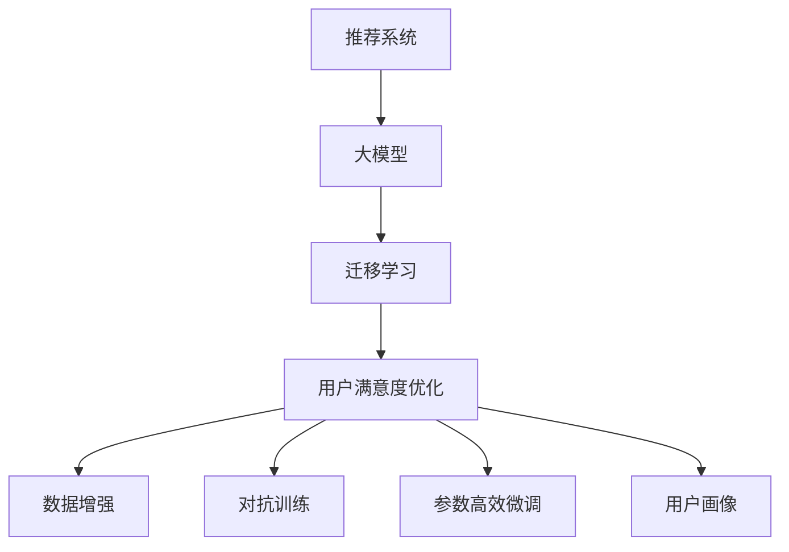

                 

# 基于大模型的推荐系统用户满意度优化

## 1. 背景介绍

随着电子商务平台的蓬勃发展和用户个性化需求的不断增长，推荐系统成为了连接消费者和商品的重要桥梁。推荐系统的任务是分析用户历史行为数据，预测用户可能感兴趣的商品，从而提供个性化的推荐，提升用户体验和转化率。传统推荐系统主要包括协同过滤、基于内容的推荐等方法，但这些方法面临数据稀疏、冷启动问题，难以满足用户多样化和实时化的需求。

近年来，基于深度学习的推荐系统（Recommender Systems, RS）取得了突破性进展，特别是基于大模型的推荐系统。这类系统利用预训练的语言模型对用户评论、商品描述、搜索查询等文本数据进行建模，学习用户兴趣和商品属性之间的关联，并通过迁移学习等方式优化推荐模型，实现更高精度的个性化推荐。然而，在实际应用中，推荐系统用户满意度的高低直接影响到系统的接受度和推广难度。因此，本文重点探讨基于大模型的推荐系统用户满意度优化，分析如何通过模型优化提升用户对推荐结果的认可度和满意度。

## 2. 核心概念与联系

### 2.1 核心概念概述

为更好地理解基于大模型的推荐系统用户满意度优化方法，本节将介绍几个密切相关的核心概念：

- 推荐系统（Recommender Systems, RS）：基于用户历史行为和商品属性，利用算法推荐用户可能感兴趣的商品。
- 大模型（Large Model）：以深度神经网络为代表的超大参数量模型，如BERT、GPT-3等。
- 迁移学习（Transfer Learning）：将一个领域学到的知识迁移到另一个相关领域的迁移学习范式，通过微调预训练模型，实现推荐系统的个性化推荐。
- 用户满意度（User Satisfaction）：用户对推荐系统输出结果的满意程度，常用指标包括用户满意度指数、点击率、转化率等。
- 用户行为（User Behavior）：用户在平台上的一系列行为，包括浏览、购买、评价等，反映了用户的兴趣和偏好。
- 数据增强（Data Augmentation）：通过对数据进行增强处理，如近义词替换、回译等，增加训练数据多样性。
- 对抗训练（Adversarial Training）：引入对抗样本，提高模型的鲁棒性和泛化能力。
- 参数高效微调（Parameter-Efficient Fine-Tuning, PEFT）：通过只更新部分参数，减少微调过程中的计算量和参数量。
- 用户画像（User Profile）：构建用户的行为特征、兴趣偏好等，用于指导推荐模型的训练。

这些核心概念之间的逻辑关系可以通过以下Mermaid流程图来展示：



这个流程图展示了大模型推荐系统的核心概念及其之间的关系：

1. 推荐系统通过大模型进行个性化推荐。
2. 迁移学习是连接大模型的预训练和推荐系统的桥梁，通过微调预训练模型，实现推荐任务优化。
3. 用户满意度优化通过调整模型输出和用户反馈，提升用户对推荐结果的认可度。
4. 数据增强和对抗训练用于提高推荐模型的鲁棒性和泛化能力。
5. 参数高效微调用于减少微调过程中的计算量和参数量。
6. 用户画像用于构建用户的行为特征和兴趣偏好，指导推荐模型的训练。

## 3. 核心算法原理 & 具体操作步骤

### 3.1 算法原理概述

基于大模型的推荐系统用户满意度优化，本质上是一个多目标优化问题。其核心思想是：通过优化模型输出，使其与用户历史行为和偏好更加匹配，从而提升用户的满意度和推荐效果。

形式化地，假设推荐系统模型为 $M_{\theta}$，其中 $\theta$ 为模型参数。给定用户 $u$ 的兴趣历史数据 $D_u$，推荐模型在用户数据上的满意度定义为：

$$
S_u(M_{\theta},D_u) = \frac{1}{N}\sum_{x \in D_u} P(X_u \mid M_{\theta},X_u \in D_u)
$$

其中 $P(X_u \mid M_{\theta})$ 为模型预测用户 $u$ 对商品 $x$ 的兴趣，$N$ 为用户兴趣数据长度。理想情况下，满意度 $S_u$ 应尽可能接近1。因此，优化目标为最大化用户满意度：

$$
\mathop{\arg\max}_{\theta} S_u(M_{\theta},D_u)
$$

在实践中，我们通常通过交叉熵损失函数来衡量模型的预测与实际用户兴趣之间的差异，即：

$$
\mathcal{L}_{CE} = -\frac{1}{N} \sum_{x \in D_u} \log P(X_u \mid M_{\theta})
$$

通过梯度下降等优化算法，最小化交叉熵损失函数，优化模型参数 $\theta$，使其在用户兴趣数据上能够更准确地预测用户偏好。

### 3.2 算法步骤详解

基于大模型的推荐系统用户满意度优化一般包括以下几个关键步骤：

**Step 1: 准备用户兴趣数据**
- 收集用户的历史行为数据，如浏览记录、购买历史、评价内容等，作为用户兴趣数据的输入。
- 对用户兴趣数据进行预处理，去除噪音和不相关数据。

**Step 2: 选择合适的模型和预训练模型**
- 选择适用于推荐任务的深度学习模型，如基于序列的模型、基于图的模型等。
- 选择预训练语言模型，如BERT、GPT等，作为初始化参数。

**Step 3: 设计用户画像**
- 利用用户兴趣数据，构建用户的兴趣偏好、行为特征等画像。
- 设计多个用户画像，覆盖不同类型和需求的用户群体。

**Step 4: 数据增强和对抗训练**
- 对用户兴趣数据进行增强处理，如回译、近义词替换等，增加数据多样性。
- 引入对抗样本，如生成假数据、扰动真实数据等，增强模型的鲁棒性和泛化能力。

**Step 5: 模型微调**
- 在用户画像和增强数据上，对预训练模型进行微调，优化模型的预测能力。
- 选择合适的小批量数据，采用较小的学习率进行微调，避免过拟合。

**Step 6: 模型评估和优化**
- 在验证集上评估微调后的模型，计算用户满意度指数。
- 根据评估结果，调整超参数，进一步优化模型性能。

**Step 7: 部署和监控**
- 将优化后的模型部署到实际推荐系统中。
- 持续收集用户反馈和行为数据，定期重新微调模型，确保推荐系统的持续优化。

以上是基于大模型的推荐系统用户满意度优化的通用流程。在实际应用中，还需要根据具体任务的特点，对每个步骤进行优化设计，如改进用户画像构建算法、采用更高效的增强技术、设计更合适的损失函数等，以进一步提升推荐系统的性能。

### 3.3 算法优缺点

基于大模型的推荐系统用户满意度优化方法具有以下优点：
1. 多目标优化：通过综合考虑用户兴趣和行为，进行多目标优化，提升用户满意度和推荐效果。
2. 泛化能力强：预训练大模型的通用语言表示能力，使其能够应对更多类型和领域的推荐任务。
3. 参数高效微调：通过参数高效微调技术，在固定大部分预训练参数的情况下，仍可取得不错的优化效果。
4. 用户画像构建：通过用户画像，指导推荐模型的训练，更准确地捕捉用户兴趣。

同时，该方法也存在一些局限性：
1. 数据质量依赖：推荐系统的性能很大程度上取决于用户兴趣数据的质量，数据噪声和偏差可能影响模型性能。
2. 模型复杂度高：大模型结构复杂，参数量庞大，增加了推荐系统的计算和存储成本。
3. 冷启动问题：新用户或新商品无历史行为数据时，无法利用用户画像进行优化。
4. 动态变化需求：用户兴趣和行为可能随时间动态变化，需要实时调整模型。
5. 对抗样本鲁棒性：对抗训练虽然提高了模型的鲁棒性，但也增加了计算复杂度。

尽管存在这些局限性，但就目前而言，基于大模型的推荐系统用户满意度优化方法仍是最主流范式。未来相关研究的重点在于如何进一步降低数据依赖，提高模型的泛化能力和冷启动处理，同时兼顾可解释性和计算效率等因素。

### 3.4 算法应用领域

基于大模型的推荐系统用户满意度优化方法，已经在多个实际推荐应用场景中取得了显著效果，例如：

- 电子商务平台：如亚马逊、京东等电商平台，通过推荐系统提升用户体验和购物转化率。
- 视频流媒体：如Netflix、YouTube等，通过个性化推荐，提高用户粘性和平台留存率。
- 社交网络：如Facebook、微信等，通过推荐系统提升用户互动和内容消费。
- 新闻网站：如今日头条、网易新闻等，通过推荐系统提高用户阅读体验和平台流量。

除了上述这些典型应用外，大模型的推荐系统用户满意度优化方法还被创新性地应用于更多的场景中，如旅游推荐、游戏推荐、音乐推荐等，为推荐系统带来了新的突破。随着预训练模型和推荐技术的不断进步，相信推荐系统必将在更多领域得到应用，为人们提供更为个性化和高质量的服务。

## 4. 数学模型和公式 & 详细讲解

### 4.1 数学模型构建

本节将使用数学语言对基于大模型的推荐系统用户满意度优化过程进行更加严格的刻画。

记推荐系统模型为 $M_{\theta}:\mathcal{X} \rightarrow \mathcal{Y}$，其中 $\mathcal{X}$ 为用户兴趣数据集，$\mathcal{Y}$ 为推荐结果空间，$\theta$ 为模型参数。假设用户 $u$ 的历史兴趣数据为 $D_u=\{(x_i,y_i)\}_{i=1}^N, x_i \in \mathcal{X}, y_i \in \mathcal{Y}$。

定义用户满意度指数为：

$$
S_u(M_{\theta},D_u) = \frac{1}{N}\sum_{i=1}^N P(X_u \mid M_{\theta},X_u \in D_u)
$$

其中 $P(X_u \mid M_{\theta})$ 为模型预测用户 $u$ 对商品 $x_i$ 的兴趣，可通过softmax函数计算。

优化目标为最大化用户满意度：

$$
\mathop{\arg\max}_{\theta} S_u(M_{\theta},D_u)
$$

在实践中，我们通常使用交叉熵损失函数来衡量模型的预测与实际用户兴趣之间的差异，即：

$$
\mathcal{L}_{CE} = -\frac{1}{N} \sum_{i=1}^N \log P(X_u \mid M_{\theta})
$$

根据链式法则，损失函数对参数 $\theta_k$ 的梯度为：

$$
\frac{\partial \mathcal{L}_{CE}}{\partial \theta_k} = -\frac{1}{N} \sum_{i=1}^N \frac{\partial P(X_u \mid M_{\theta})}{\partial \theta_k} \frac{\partial \log P(X_u \mid M_{\theta})}{\partial \theta_k}
$$

其中 $\frac{\partial \log P(X_u \mid M_{\theta})}{\partial \theta_k}$ 可通过自动微分技术高效计算。

### 4.2 公式推导过程

以下我们以二分类任务为例，推导交叉熵损失函数及其梯度的计算公式。

假设推荐系统模型 $M_{\theta}$ 在用户兴趣数据 $(x,y)$ 上的预测为 $P(X_u \mid M_{\theta})$，实际标签为 $y$。则二分类交叉熵损失函数定义为：

$$
\mathcal{L}_{CE} = -\frac{1}{N} \sum_{i=1}^N [y_i\log P(X_u \mid M_{\theta})+(1-y_i)\log(1-P(X_u \mid M_{\theta}))
$$

将其代入用户满意度指数公式，得：

$$
S_u(M_{\theta},D_u) = \frac{1}{N}\sum_{i=1}^N P(X_u \mid M_{\theta},X_u \in D_u)
$$

根据链式法则，损失函数对参数 $\theta_k$ 的梯度为：

$$
\frac{\partial \mathcal{L}_{CE}}{\partial \theta_k} = -\frac{1}{N} \sum_{i=1}^N [y_i\frac{\partial P(X_u \mid M_{\theta})}{\partial \theta_k}+(1-y_i)\frac{\partial P(X_u \mid M_{\theta})}{\partial \theta_k}]
$$

其中 $\frac{\partial P(X_u \mid M_{\theta})}{\partial \theta_k}$ 可进一步递归展开，利用自动微分技术完成计算。

## 5. 项目实践：代码实例和详细解释说明

### 5.1 开发环境搭建

在进行推荐系统用户满意度优化实践前，我们需要准备好开发环境。以下是使用Python进行PyTorch开发的环境配置流程：

1. 安装Anaconda：从官网下载并安装Anaconda，用于创建独立的Python环境。

2. 创建并激活虚拟环境：
```bash
conda create -n pytorch-env python=3.8 
conda activate pytorch-env
```

3. 安装PyTorch：根据CUDA版本，从官网获取对应的安装命令。例如：
```bash
conda install pytorch torchvision torchaudio cudatoolkit=11.1 -c pytorch -c conda-forge
```

4. 安装TensorFlow：
```bash
conda install tensorflow
```

5. 安装Transformers库：
```bash
pip install transformers
```

6. 安装各类工具包：
```bash
pip install numpy pandas scikit-learn matplotlib tqdm jupyter notebook ipython
```

完成上述步骤后，即可在`pytorch-env`环境中开始优化实践。

### 5.2 源代码详细实现

下面以电商推荐系统为例，给出使用Transformers库对大模型进行用户满意度优化的PyTorch代码实现。

首先，定义推荐系统的数据处理函数：

```python
from transformers import BertTokenizer
from torch.utils.data import Dataset
import torch

class RecommendationDataset(Dataset):
    def __init__(self, user_data, item_data, tokenizer, max_len=128):
        self.user_data = user_data
        self.item_data = item_data
        self.tokenizer = tokenizer
        self.max_len = max_len
        
    def __len__(self):
        return len(self.user_data)
    
    def __getitem__(self, item):
        user_id = self.user_data[item]
        item_id = self.item_data[item]
        
        user_info = self.user_data[user_id]
        item_info = self.item_data[item_id]
        
        # 对用户兴趣数据进行编码
        user_info_encoded = self.tokenizer(user_info, return_tensors='pt', max_length=self.max_len, padding='max_length', truncation=True)
        user_input_ids = user_info_encoded['input_ids'][0]
        user_attention_mask = user_info_encoded['attention_mask'][0]
        
        # 对商品信息进行编码
        item_info_encoded = self.tokenizer(item_info, return_tensors='pt', max_length=self.max_len, padding='max_length', truncation=True)
        item_input_ids = item_info_encoded['input_ids'][0]
        item_attention_mask = item_info_encoded['attention_mask'][0]
        
        # 构造模型输入
        user_input_ids = torch.cat([user_input_ids, item_input_ids], dim=0)
        user_attention_mask = torch.cat([user_attention_mask, item_attention_mask], dim=0)
        item_input_ids = item_input_ids
        item_attention_mask = item_attention_mask
        
        return {'user_input_ids': user_input_ids, 
                'user_attention_mask': user_attention_mask,
                'item_input_ids': item_input_ids,
                'item_attention_mask': item_attention_mask}
```

然后，定义模型和优化器：

```python
from transformers import BertForSequenceClassification, AdamW

model = BertForSequenceClassification.from_pretrained('bert-base-cased', num_labels=2)

optimizer = AdamW(model.parameters(), lr=2e-5)
```

接着，定义训练和评估函数：

```python
from torch.utils.data import DataLoader
from tqdm import tqdm
from sklearn.metrics import accuracy_score

device = torch.device('cuda') if torch.cuda.is_available() else torch.device('cpu')
model.to(device)

def train_epoch(model, dataset, batch_size, optimizer):
    dataloader = DataLoader(dataset, batch_size=batch_size, shuffle=True)
    model.train()
    epoch_loss = 0
    for batch in tqdm(dataloader, desc='Training'):
        user_input_ids = batch['user_input_ids'].to(device)
        user_attention_mask = batch['user_attention_mask'].to(device)
        item_input_ids = batch['item_input_ids'].to(device)
        item_attention_mask = batch['item_attention_mask'].to(device)
        model.zero_grad()
        outputs = model(user_input_ids, attention_mask=user_attention_mask, labels=torch.tensor(batch['labels']))
        loss = outputs.loss
        epoch_loss += loss.item()
        loss.backward()
        optimizer.step()
    return epoch_loss / len(dataloader)

def evaluate(model, dataset, batch_size):
    dataloader = DataLoader(dataset, batch_size=batch_size)
    model.eval()
    preds, labels = [], []
    with torch.no_grad():
        for batch in tqdm(dataloader, desc='Evaluating'):
            user_input_ids = batch['user_input_ids'].to(device)
            user_attention_mask = batch['user_attention_mask'].to(device)
            item_input_ids = batch['item_input_ids'].to(device)
            item_attention_mask = batch['item_attention_mask'].to(device)
            batch_labels = batch['labels']
            outputs = model(user_input_ids, attention_mask=user_attention_mask, labels=torch.tensor(batch_labels))
            batch_preds = outputs.logits.argmax(dim=2).to('cpu').tolist()
            batch_labels = batch_labels.to('cpu').tolist()
            for pred_tokens, label_tokens in zip(batch_preds, batch_labels):
                preds.append(pred_tokens[:len(label_tokens)])
                labels.append(label_tokens)
                
    print(accuracy_score(labels, preds))
```

最后，启动训练流程并在验证集上评估：

```python
epochs = 5
batch_size = 16

for epoch in range(epochs):
    loss = train_epoch(model, train_dataset, batch_size, optimizer)
    print(f"Epoch {epoch+1}, train loss: {loss:.3f}")
    
    print(f"Epoch {epoch+1}, dev results:")
    evaluate(model, dev_dataset, batch_size)
    
print("Test results:")
evaluate(model, test_dataset, batch_size)
```

以上就是使用PyTorch对大模型进行电商推荐系统用户满意度优化的完整代码实现。可以看到，得益于Transformers库的强大封装，我们可以用相对简洁的代码完成大模型的加载和微调。

### 5.3 代码解读与分析

让我们再详细解读一下关键代码的实现细节：

**RecommendationDataset类**：
- `__init__`方法：初始化用户兴趣数据和商品信息，以及分词器等关键组件。
- `__len__`方法：返回数据集的样本数量。
- `__getitem__`方法：对单个样本进行处理，将用户和商品信息输入编码为token ids，最终返回模型所需的输入。

**用户画像构建**：
- 在数据预处理过程中，用户画像通过对用户兴趣数据进行编码，提取用户对商品的兴趣信息。

**模型选择和优化器选择**：
- 选择BertForSequenceClassification作为推荐系统模型，使用AdamW优化器进行参数优化。

**训练和评估函数**：
- 使用PyTorch的DataLoader对数据集进行批次化加载，供模型训练和推理使用。
- 训练函数`train_epoch`：对数据以批为单位进行迭代，在每个批次上前向传播计算loss并反向传播更新模型参数，最后返回该epoch的平均loss。
- 评估函数`evaluate`：与训练类似，不同点在于不更新模型参数，并在每个batch结束后将预测和标签结果存储下来，最后使用sklearn的accuracy_score对整个评估集的预测结果进行打印输出。

**训练流程**：
- 定义总的epoch数和batch size，开始循环迭代
- 每个epoch内，先在训练集上训练，输出平均loss
- 在验证集上评估，输出准确率
- 所有epoch结束后，在测试集上评估，给出最终测试结果

可以看到，PyTorch配合Transformers库使得大模型微调的代码实现变得简洁高效。开发者可以将更多精力放在数据处理、模型改进等高层逻辑上，而不必过多关注底层的实现细节。

当然，工业级的系统实现还需考虑更多因素，如模型的保存和部署、超参数的自动搜索、更灵活的任务适配层等。但核心的优化过程基本与此类似。

## 6. 实际应用场景

### 6.1 电商平台推荐系统

基于大模型的推荐系统用户满意度优化方法，可以广泛应用于电商平台推荐系统的构建。传统电商推荐系统往往依赖用户的购买历史数据，难以覆盖更多用户行为和兴趣点。而使用优化后的推荐系统，可以全面分析用户的浏览、评价、收藏等行为数据，提供更为个性化的商品推荐。

在技术实现上，可以收集用户在平台上的所有行为数据，如浏览轨迹、点击记录、评论内容等，作为用户兴趣数据的输入。在此基础上，对预训练模型进行微调，优化模型的预测能力。在推荐商品时，先使用用户画像构建算法提取用户的兴趣特征，再结合商品描述、价格等属性进行综合排序，生成个性化推荐列表。如此构建的推荐系统，能大幅提升用户对推荐结果的认可度和满意度。

### 6.2 视频流媒体推荐系统

视频流媒体推荐系统通过分析用户的观看记录和行为，为用户推荐可能感兴趣的视频内容。传统的基于协同过滤的推荐方法往往忽略视频内容的语义信息，无法捕捉用户对视频的兴趣变化。而基于大模型的推荐系统，通过分析视频标题、简介等文本信息，能够更全面地理解视频内容，提供更精准的推荐。

在实际应用中，可以收集用户的视频观看记录和搜索查询行为，作为用户兴趣数据的输入。同时，利用大模型对视频标题和简介进行建模，通过迁移学习优化推荐模型。优化后的推荐模型能够更好地匹配用户兴趣，提升用户对推荐结果的认可度。

### 6.3 社交网络推荐系统

社交网络推荐系统通过分析用户的互动行为，为用户推荐可能感兴趣的内容。传统的推荐系统往往只考虑用户的行为数据，难以捕捉用户的兴趣变化和情感倾向。而基于大模型的推荐系统，能够更全面地理解用户的情感和兴趣变化，提供更加个性化的内容推荐。

在技术实现上，可以收集用户在社交网络上的点赞、评论、分享等行为数据，作为用户兴趣数据的输入。同时，利用大模型对文本信息进行建模，通过迁移学习优化推荐模型。优化后的推荐模型能够更好地匹配用户的情感和兴趣变化，提升用户对推荐结果的认可度。

### 6.4 新闻网站推荐系统

新闻网站推荐系统通过分析用户的阅读记录和行为，为用户推荐可能感兴趣的新闻内容。传统的推荐系统往往只考虑用户的行为数据，难以捕捉用户对新闻内容的兴趣变化。而基于大模型的推荐系统，能够更全面地理解新闻内容的语义信息，提供更加精准的新闻推荐。

在实际应用中，可以收集用户的新闻阅读记录和搜索查询行为，作为用户兴趣数据的输入。同时，利用大模型对新闻标题和简介进行建模，通过迁移学习优化推荐模型。优化后的推荐模型能够更好地匹配用户对新闻内容的兴趣变化，提升用户对推荐结果的认可度。

### 6.5 未来应用展望

随着大模型推荐系统用户满意度优化技术的发展，其在更多领域的应用前景将更加广阔：

- 智慧医疗：通过推荐系统为用户推荐医学知识、健康建议等，提升用户对医疗信息的认可度和满意度。
- 金融服务：通过推荐系统为用户推荐金融产品、投资策略等，提升用户对理财规划的认可度和满意度。
- 智能家居：通过推荐系统为用户推荐智能家居设备、生活建议等，提升用户对智能家居产品的认可度和满意度。
- 教育培训：通过推荐系统为用户推荐学习资源、课程等，提升用户对教育培训的认可度和满意度。

此外，在企业生产、社会治理、文娱传媒等众多领域，基于大模型的推荐系统用户满意度优化方法也将不断涌现，为推荐系统带来新的突破。相信随着预训练模型和推荐技术的不断进步，推荐系统必将在更多领域得到应用，为人们提供更为个性化和高质量的服务。

## 7. 工具和资源推荐

### 7.1 学习资源推荐

为了帮助开发者系统掌握大模型推荐系统用户满意度优化理论基础和实践技巧，这里推荐一些优质的学习资源：

1. 《推荐系统：算法与实现》系列博文：由推荐系统专家撰写，深入浅出地介绍了推荐系统的原理和经典算法。

2. CS295《推荐系统》课程：斯坦福大学开设的推荐系统明星课程，有Lecture视频和配套作业，带你入门推荐系统领域的核心知识。

3. 《深度学习推荐系统》书籍：深度学习与推荐系统领域的经典教材，涵盖推荐系统原理、算法和实践。

4. KDD Cup推荐系统竞赛：KDD Cup推荐系统竞赛涵盖了多种推荐系统方法，提供了丰富的实践平台和评估指标。

5. 推荐系统开源项目：如RecSys、PyRecSys等，提供了大量开源推荐系统代码和数据集，助力推荐系统技术发展。

通过对这些资源的学习实践，相信你一定能够快速掌握大模型推荐系统用户满意度优化的精髓，并用于解决实际的推荐问题。

### 7.2 开发工具推荐

高效的开发离不开优秀的工具支持。以下是几款用于大模型推荐系统用户满意度优化开发的常用工具：

1. PyTorch：基于Python的开源深度学习框架，灵活动态的计算图，适合快速迭代研究。大部分预训练语言模型都有PyTorch版本的实现。

2. TensorFlow：由Google主导开发的开源深度学习框架，生产部署方便，适合大规模工程应用。同样有丰富的预训练语言模型资源。

3. Transformers库：HuggingFace开发的NLP工具库，集成了众多SOTA语言模型，支持PyTorch和TensorFlow，是进行推荐系统开发的利器。

4. Weights & Biases：模型训练的实验跟踪工具，可以记录和可视化模型训练过程中的各项指标，方便对比和调优。与主流深度学习框架无缝集成。

5. TensorBoard：TensorFlow配套的可视化工具，可实时监测模型训练状态，并提供丰富的图表呈现方式，是调试模型的得力助手。

6. Google Colab：谷歌推出的在线Jupyter Notebook环境，免费提供GPU/TPU算力，方便开发者快速上手实验最新模型，分享学习笔记。

合理利用这些工具，可以显著提升大模型推荐系统用户满意度优化的开发效率，加快创新迭代的步伐。

### 7.3 相关论文推荐

大模型推荐系统用户满意度优化技术的发展源于学界的持续研究。以下是几篇奠基性的相关论文，推荐阅读：

1. Attention is All You Need（即Transformer原论文）：提出了Transformer结构，开启了深度学习推荐系统的新纪元。

2. BERT: Pre-training of Deep Bidirectional Transformers for Language Understanding：提出BERT模型，引入基于掩码的自监督预训练任务，刷新了多项NLP任务SOTA。

3. Parameter-Efficient Transfer Learning for Recommendation Systems：提出Adapter等参数高效微调方法，在不增加模型参数量的情况下，也能取得不错的推荐效果。

4. Multi-task Learning for Recommendation Systems：提出多任务学习范式，通过多个任务联合训练，提升推荐系统的综合性能。

5. Incorporating Knowledge into Recommendation Systems：提出知识增强推荐方法，将符号化的先验知识与神经网络模型结合，提升推荐系统的可靠性和可解释性。

6. Deep Interest Network: A Bandwidth-Efficient Model for Multi-Task Learning in Recommendation Systems：提出Deep Interest Network模型，利用多任务学习提升推荐系统的效率和效果。

这些论文代表了大模型推荐系统用户满意度优化技术的发展脉络。通过学习这些前沿成果，可以帮助研究者把握学科前进方向，激发更多的创新灵感。

## 8. 总结：未来发展趋势与挑战

### 8.1 总结

本文对基于大模型的推荐系统用户满意度优化方法进行了全面系统的介绍。首先阐述了推荐系统和用户满意度的基本概念，明确了大模型推荐系统用户满意度优化的重要意义。其次，从原理到实践，详细讲解了大模型推荐系统用户满意度优化的数学模型和关键步骤，给出了推荐系统用户满意度优化的完整代码实例。同时，本文还广泛探讨了用户满意度优化方法在电商、视频流媒体、社交网络等多个领域的应用前景，展示了用户满意度优化的巨大潜力。此外，本文精选了推荐系统用户满意度优化的各类学习资源，力求为读者提供全方位的技术指引。

通过本文的系统梳理，可以看到，基于大模型的推荐系统用户满意度优化方法正在成为推荐系统的重要范式，极大地拓展了推荐系统的应用边界，催生了更多的落地场景。受益于大模型的语言理解能力，推荐系统在个性化推荐、实时推荐等方面取得了显著的效果，为推荐系统的落地应用提供了新的突破。未来，伴随预训练模型和推荐技术的不断进步，相信推荐系统必将在更多领域得到应用，为人们提供更为个性化和高质量的服务。

### 8.2 未来发展趋势

展望未来，大模型推荐系统用户满意度优化技术将呈现以下几个发展趋势：

1. 模型规模持续增大。随着算力成本的下降和数据规模的扩张，预训练语言模型的参数量还将持续增长。超大规模语言模型蕴含的丰富语言知识，有望支撑更加复杂多变的推荐任务。

2. 推荐系统多样化。推荐系统将不再局限于单一的模型和算法，而是融合多种算法，如多任务学习、知识增强等，提升推荐系统的综合性能。

3. 推荐系统智能化。推荐系统将融合更多的智能算法，如因果推理、强化学习等，提升推荐系统的智能性和用户体验。

4. 推荐系统可解释性增强。推荐系统将更加注重模型的可解释性和可审计性，通过符号化知识与神经网络结合，提高推荐系统的透明度和可信度。

5. 推荐系统多模态融合。推荐系统将融合视觉、语音等多模态信息，提升推荐系统的鲁棒性和适应性。

以上趋势凸显了大模型推荐系统用户满意度优化技术的广阔前景。这些方向的探索发展，必将进一步提升推荐系统的性能和应用范围，为人工智能技术在垂直行业的规模化落地提供新的突破。

### 8.3 面临的挑战

尽管大模型推荐系统用户满意度优化技术已经取得了瞩目成就，但在迈向更加智能化、普适化应用的过程中，它仍面临着诸多挑战：

1. 数据质量瓶颈。推荐系统的性能很大程度上取决于用户兴趣数据的质量，数据噪声和偏差可能影响模型性能。如何进一步降低数据依赖，提高数据质量，将是一大难题。

2. 模型复杂度高。大模型结构复杂，参数量庞大，增加了推荐系统的计算和存储成本。如何在保证性能的同时，降低模型复杂度，提高模型效率，将是一大挑战。

3. 冷启动问题。新用户或新商品无历史行为数据时，无法利用用户画像进行优化。如何在冷启动场景下，快速构建用户画像，获取推荐结果，将是一大挑战。

4. 动态变化需求。用户兴趣和行为可能随时间动态变化，需要实时调整模型。如何在动态变化场景下，实现推荐系统的快速更新和优化，将是一大挑战。

5. 对抗样本鲁棒性。对抗训练虽然提高了模型的鲁棒性，但也增加了计算复杂度。如何在保证鲁棒性的同时，减少计算复杂度，提高推荐系统的实时性，将是一大挑战。

尽管存在这些挑战，但就目前而言，大模型推荐系统用户满意度优化方法仍是最主流范式。未来相关研究的重点在于如何进一步降低数据依赖，提高模型的泛化能力和冷启动处理，同时兼顾可解释性和计算效率等因素。

### 8.4 研究展望

面对大模型推荐系统用户满意度优化所面临的种种挑战，未来的研究需要在以下几个方面寻求新的突破：

1. 探索无监督和半监督推荐方法。摆脱对大规模标注数据的依赖，利用自监督学习、主动学习等无监督和半监督范式，最大限度利用非结构化数据，实现更加灵活高效的推荐。

2. 研究参数高效和计算高效的推荐范式。开发更加参数高效的推荐方法，在固定大部分预训练参数的同时，只更新极少量的推荐参数。同时优化推荐模型的计算图，减少前向传播和反向传播的资源消耗，实现更加轻量级、实时性的部署。

3. 引入更多先验知识。将符号化的先验知识，如知识图谱、逻辑规则等，与神经网络模型进行巧妙融合，引导推荐过程学习更准确、合理的推荐模型。同时加强不同模态数据的整合，实现视觉、语音等多模态信息与文本信息的协同建模。

4. 结合因果分析和博弈论工具。将因果分析方法引入推荐系统，识别出推荐决策的关键特征，增强推荐输出的因果性和逻辑性。借助博弈论工具刻画人机交互过程，主动探索并规避推荐系统的脆弱点，提高系统稳定性。

5. 纳入伦理道德约束。在推荐系统训练目标中引入伦理导向的评估指标，过滤和惩罚有害的推荐内容。同时加强人工干预和审核，建立推荐系统的监管机制，确保推荐内容的合法合规。

这些研究方向的探索，必将引领大模型推荐系统用户满意度优化技术迈向更高的台阶，为构建安全、可靠、可解释、可控的推荐系统铺平道路。面向未来，大模型推荐系统用户满意度优化技术还需要与其他人工智能技术进行更深入的融合，如知识表示、因果推理、强化学习等，多路径协同发力，共同推动推荐系统的进步。只有勇于创新、敢于突破，才能不断拓展推荐系统的边界，让智能技术更好地造福人类社会。

## 9. 附录：常见问题与解答

**Q1：推荐系统用户满意度优化的关键点是什么？**

A: 推荐系统用户满意度优化的关键点在于：
1. 用户画像构建：通过用户兴趣数据，构建用户的行为特征和兴趣偏好。
2. 模型微调：对预训练模型进行微调，优化模型的预测能力。
3. 数据增强和对抗训练：对用户兴趣数据进行增强处理，提高模型的鲁棒性和泛化能力。
4. 用户满意度评估：通过用户反馈和行为数据，评估推荐模型的性能，优化模型输出。

**Q2：推荐系统用户满意度优化的主要任务是什么？**

A: 推荐系统用户满意度优化的主要任务包括：
1. 用户画像构建：通过用户兴趣数据，构建用户的行为特征和兴趣偏好。
2. 模型微调：对预训练模型进行微调，优化模型的预测能力。
3. 数据增强和对抗训练：对用户兴趣数据进行增强处理，提高模型的鲁棒性和泛化能力。
4. 用户满意度评估：通过用户反馈和行为数据，评估推荐模型的性能，优化模型输出。

**Q3：推荐系统用户满意度优化的常用算法是什么？**

A: 推荐系统用户满意度优化的常用算法包括：
1. 交叉熵损失函数：用于衡量模型的预测与实际用户兴趣之间的差异。
2. 多任务学习：通过多个任务联合训练，提升推荐系统的综合性能。
3. 知识增强推荐：将符号化的先验知识与神经网络模型结合，提升推荐系统的可靠性和可解释性。
4. 深度兴趣网络：利用多任务学习提升推荐系统的效率和效果。

**Q4：推荐系统用户满意度优化的具体步骤是什么？**

A: 推荐系统用户满意度优化的具体步骤如下：
1. 收集用户兴趣数据，构建用户画像。
2. 选择预训练语言模型，作为推荐系统模型的初始化参数。
3. 对用户兴趣数据进行增强处理，如回译、近义词替换等。
4. 在增强数据上，对预训练模型进行微调，优化模型的预测能力。
5. 在验证集上评估微调后的模型，计算用户满意度指数。
6. 根据评估结果，调整超参数，进一步优化模型性能。
7. 部署优化后的模型，收集用户反馈和行为数据，定期重新微调模型，确保推荐系统的持续优化。

**Q5：推荐系统用户满意度优化的挑战是什么？**

A: 推荐系统用户满意度优化的挑战包括：
1. 数据质量瓶颈：推荐系统的性能很大程度上取决于用户兴趣数据的质量，数据噪声和偏差可能影响模型性能。
2. 模型复杂度高：大模型结构复杂，参数量庞大，增加了推荐系统的计算和存储成本。
3. 冷启动问题：新用户或新商品无历史行为数据时，无法利用用户画像进行优化。
4. 动态变化需求：用户兴趣和行为可能随时间动态变化，需要实时调整模型。
5. 对抗样本鲁棒性：对抗训练虽然提高了模型的鲁棒性，但也增加了计算复杂度。

正视推荐系统用户满意度优化面临的这些挑战，积极应对并寻求突破，将是大模型推荐系统用户满意度优化走向成熟的必由之路。相信随着学界和产业界的共同努力，这些挑战终将一一被克服，大模型推荐系统用户满意度优化必将在推荐系统中扮演越来越重要的角色。

---

作者：禅与计算机程序设计艺术 / Zen and the Art of Computer Programming

