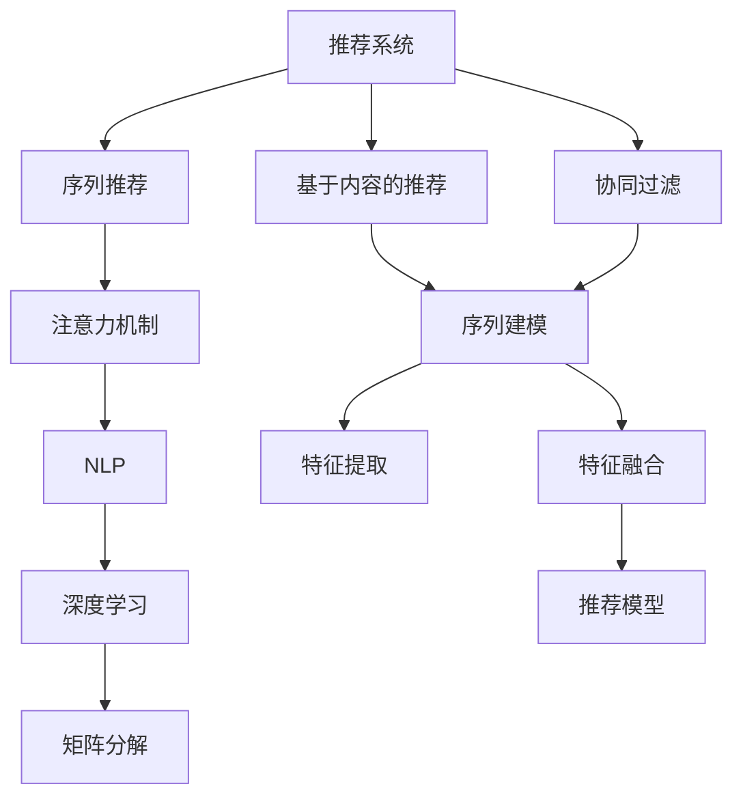

                 

# 基于注意力机制的序列化推荐模型

> 关键词：推荐系统, 序列推荐, 注意力机制, 自然语言处理(NLP), 序列建模, 深度学习

## 1. 背景介绍

### 1.1 问题由来
推荐系统是互联网领域中最具代表性的应用之一，旨在通过精准匹配用户的兴趣与商品，提升用户体验和商家效益。传统的推荐系统主要采用协同过滤、基于内容的推荐等方法，依赖用户行为数据和物品属性数据，难以应对动态变化的用户需求和长尾商品的需求。

近年来，随着深度学习技术的兴起，序列化推荐模型开始受到越来越多的关注。基于序列化推荐模型，推荐系统可以从用户的浏览、点击、购买等行为序列中，挖掘出潜在的兴趣模式和兴趣序列，实现更精准、更个性化的推荐。特别是对于个性化较强的购物、音乐、视频等推荐场景，序列化推荐模型在效果上远远超越了传统的推荐方法。

本文将从注意力机制入手，深入介绍基于注意力机制的序列化推荐模型，探讨其在推荐系统中的应用，并对比传统推荐方法的优劣。

### 1.2 问题核心关键点
基于注意力机制的序列化推荐模型，是一种将深度学习技术应用于推荐系统的新型范式。其核心思想是，通过捕捉用户和商品之间的交互序列，利用注意力机制对序列进行建模，从中提取用户和商品的兴趣特征，从而实现精准的推荐。

与传统的推荐方法相比，该方法具有以下显著优势：
1. 更准确地捕捉用户和商品的动态交互模式。
2. 能够有效处理长尾商品和大规模数据。
3. 具有较好的泛化能力和鲁棒性。
4. 在一定程度上减轻了冷启动问题。

本节将详细阐述注意力机制在序列化推荐模型中的原理和应用，并结合实例进行深入分析。

## 2. 核心概念与联系

### 2.1 核心概念概述

为更好地理解基于注意力机制的序列化推荐模型，本节将介绍几个密切相关的核心概念：

- 推荐系统(Recommendation System)：利用用户行为数据和物品属性数据，为用户推荐商品或服务的系统。推荐系统包括基于内容的推荐、协同过滤、矩阵分解等方法，可以有效提升用户体验和商家效益。

- 序列推荐(Sequential Recommendation)：利用用户的行为序列，捕捉用户兴趣模式和兴趣序列，从而进行推荐。序列推荐通过深入分析用户的浏览、点击、购买等行为序列，可以挖掘出用户潜在的兴趣，实现精准推荐。

- 注意力机制(Attention Mechanism)：一种机器学习技术，通过计算注意力权重，对输入序列中各个元素的重要性进行评估，并加权求和，从而获得更加准确的输出。注意力机制被广泛应用于自然语言处理(NLP)、计算机视觉、信号处理等领域，用于提升模型的泛化能力和推理能力。

- 自然语言处理(NLP)：研究如何让计算机处理、理解、生成人类语言的技术。NLP涉及文本分类、信息抽取、机器翻译、语音识别等任务，与推荐系统有诸多交叉点。

- 深度学习(Deep Learning)：一种利用多层神经网络进行学习和推理的技术，具有较强的自适应和学习能力。深度学习在推荐系统中被广泛应用于序列建模、特征提取、特征融合等环节。

- 矩阵分解(Matrix Factorization)：一种基于矩阵因式分解的推荐方法，通过分解用户-商品矩阵，发现用户与商品之间的潜在关联。

这些核心概念之间的逻辑关系可以通过以下Mermaid流程图来展示：



这个流程图展示了几大核心概念之间的联系：

1. 推荐系统包括多种推荐方法，如基于内容的推荐、协同过滤、矩阵分解等。
2. 序列推荐通过捕捉用户行为序列，深入挖掘用户兴趣，提升推荐精度。
3. 注意力机制通过计算注意力权重，提升模型泛化能力。
4. NLP与推荐系统有诸多交叉点，如文本分类、信息抽取、机器翻译等。
5. 深度学习被广泛应用于序列建模、特征提取、特征融合等环节。
6. 矩阵分解通过分解用户-商品矩阵，找到用户与商品之间的潜在关联。

## 3. 核心算法原理 & 具体操作步骤
### 3.1 算法原理概述

基于注意力机制的序列化推荐模型，通过捕捉用户和商品之间的交互序列，利用注意力机制对序列进行建模，从而提取用户和商品的兴趣特征。具体而言，模型包括两部分：用户编码器和商品编码器。

用户编码器通过捕捉用户的历史行为序列，利用注意力机制，计算出用户的兴趣表示。商品编码器通过捕捉商品的历史交互序列，利用注意力机制，计算出商品的特征表示。最终，用户编码器和商品编码器的输出，通过相似度计算，得到用户的商品推荐列表。

模型训练时，采用交叉熵损失函数，最小化预测值与真实标签之间的差异。同时，利用正则化技术，防止模型过拟合。

### 3.2 算法步骤详解

基于注意力机制的序列化推荐模型训练和应用的一般步骤包括：

**Step 1: 准备数据集**
- 收集用户和商品的历史交互数据，形成序列数据集。
- 将序列数据进行归一化处理，以保证数据的一致性。

**Step 2: 设计模型架构**
- 设计用户编码器和商品编码器的模型架构，包括输入层、注意力层、编码层等。
- 选择合适的注意力机制，如点乘注意力、多头注意力等。
- 定义模型输出层，如全连接层、softmax层等。

**Step 3: 初始化模型参数**
- 初始化模型参数，包括权重和偏置等。
- 设置学习率、迭代次数等超参数。

**Step 4: 执行前向传播**
- 对输入序列进行预处理，如padding、截断等。
- 将预处理后的序列输入用户编码器和商品编码器，计算注意力权重。
- 根据注意力权重，计算用户的兴趣表示和商品的特征表示。
- 计算用户的商品推荐列表，并进行解码。

**Step 5: 执行反向传播**
- 计算预测值与真实标签之间的交叉熵损失。
- 根据损失函数，计算模型参数的梯度。
- 使用优化器更新模型参数。

**Step 6: 重复迭代**
- 重复执行前向传播和反向传播，直到收敛。

**Step 7: 模型评估**
- 在验证集上评估模型性能，如准确率、召回率、F1值等。
- 根据评估结果，调整超参数和模型架构。

**Step 8: 部署模型**
- 将训练好的模型保存，并集成到推荐系统中。
- 在实时推荐过程中，输入用户的行为序列，生成推荐列表。

以上是基于注意力机制的序列化推荐模型的一般流程。在实际应用中，还需要针对具体任务和数据特点进行优化设计，如改进注意力机制、调整模型架构、引入正则化技术等，以进一步提升模型性能。

### 3.3 算法优缺点

基于注意力机制的序列化推荐模型具有以下优点：
1. 更准确地捕捉用户和商品的动态交互模式。
2. 能够有效处理长尾商品和大规模数据。
3. 具有较好的泛化能力和鲁棒性。
4. 在一定程度上减轻了冷启动问题。

同时，该方法也存在一些局限性：
1. 计算复杂度较高。特别是多头注意力机制，需要计算多层的注意力权重，增加了模型的计算负担。
2. 数据依赖性强。模型性能很大程度上依赖于用户和商品的历史交互数据，获取高质量数据成本较高。
3. 模型的可解释性不足。模型的决策过程复杂，难以解释其内部工作机制。
4. 模型的泛化能力有一定限制。对于新的用户或商品，模型可能需要较多的训练数据才能获得理想的推荐结果。

尽管存在这些局限性，但基于注意力机制的序列化推荐模型在推荐系统中的应用，已经取得了显著的性能提升，成为推荐系统领域的一个重要研究方向。

### 3.4 算法应用领域

基于注意力机制的序列化推荐模型，已经在电商、音乐、视频、新闻等多个领域得到了广泛应用，为推荐系统带来了革命性的改变。以下是几个典型的应用场景：

- 电商推荐系统：通过捕捉用户的浏览、点击、购买行为序列，为用户推荐商品。序列化推荐模型可以有效处理长尾商品，提升用户购物体验。

- 音乐推荐系统：通过捕捉用户的听歌历史和互动行为，为用户推荐歌曲。序列化推荐模型可以有效捕捉用户对不同歌曲的偏好和兴趣，提升音乐推荐的多样性和精准度。

- 视频推荐系统：通过捕捉用户的观看历史和互动行为，为用户推荐视频。序列化推荐模型可以有效捕捉用户对不同视频的偏好和兴趣，提升视频推荐的多样性和精准度。

- 新闻推荐系统：通过捕捉用户的阅读历史和互动行为，为用户推荐新闻。序列化推荐模型可以有效捕捉用户对不同新闻的偏好和兴趣，提升新闻推荐的多样性和精准度。

这些领域的应用，展示了序列化推荐模型的广泛适用性和巨大潜力，为用户提供了更个性化的推荐服务，提升了用户的满意度和忠诚度。

## 4. 数学模型和公式 & 详细讲解  
### 4.1 数学模型构建

本节将使用数学语言对基于注意力机制的序列化推荐模型进行更加严格的刻画。

记用户行为序列为 $X=(X_1,X_2,...,X_t)$，商品序列为 $Y=(Y_1,Y_2,...,Y_t)$，其中 $X_t,Y_t$ 分别表示用户在时间 $t$ 的浏览行为和购买行为。假设模型为用户和商品分别设计了一个编码器 $F_{user}$ 和 $F_{item}$，模型输出为用户对每个商品的兴趣度 $R_u(Y)$。

用户编码器 $F_{user}$ 的输入为 $X$，输出为 $U=(U_1,U_2,...,U_t)$。商品编码器 $F_{item}$ 的输入为 $Y$，输出为 $V=(V_1,V_2,...,V_t)$。注意力机制 $Attention$ 的输入为 $U$ 和 $V$，输出为 $A=(A_1,A_2,...,A_t)$，其中 $A_t$ 表示用户对商品 $Y_t$ 的注意力权重。

最终推荐模型的输出为 $R_u(Y) = \sum_{t=1}^T U_tA_t$，即用户对商品 $Y$ 的兴趣度。

### 4.2 公式推导过程

以点乘注意力机制为例，进行推导：

定义注意力机制为 $Attention(U,V)=softmax(\frac{U^TQV}{\sqrt{d}})$，其中 $Q$ 为查询矩阵，$V$ 为值矩阵，$softmax$ 为softmax函数。

将注意力机制应用于用户编码器 $F_{user}$ 和商品编码器 $F_{item}$ 的输出 $U$ 和 $V$，得到注意力权重 $A_t = \frac{U_t^TQV}{\sqrt{d}}$。

将注意力权重 $A_t$ 与用户编码器 $F_{user}$ 的输出 $U_t$ 相乘，得到用户对商品 $Y_t$ 的兴趣表示 $Z_t = U_tA_t$。

最终推荐模型输出为用户对商品序列的兴趣度：$R_u(Y) = \sum_{t=1}^T Z_t$。

在得到推荐模型输出后，定义交叉熵损失函数 $\ell(Y,\hat{Y}) = -\sum_{t=1}^T Y_t\log \hat{Y}_t$，用于衡量模型预测值与真实标签之间的差异。

优化目标为：$\theta^* = \mathop{\arg\min}_{\theta} \ell(Y,\hat{Y})$，其中 $\theta$ 为模型参数。

通过梯度下降等优化算法，模型参数不断更新，直到损失函数收敛。

## 5. 项目实践：代码实例和详细解释说明
### 5.1 开发环境搭建

在进行序列化推荐模型实践前，我们需要准备好开发环境。以下是使用Python进行TensorFlow开发的环境配置流程：

1. 安装Anaconda：从官网下载并安装Anaconda，用于创建独立的Python环境。

2. 创建并激活虚拟环境：
```bash
conda create -n tf-env python=3.8 
conda activate tf-env
```

3. 安装TensorFlow：从官网获取对应的安装命令。例如：
```bash
pip install tensorflow==2.7
```

4. 安装各类工具包：
```bash
pip install numpy pandas scikit-learn matplotlib tqdm jupyter notebook ipython
```

完成上述步骤后，即可在`tf-env`环境中开始模型训练。

### 5.2 源代码详细实现

这里我们以电商推荐系统为例，给出使用TensorFlow对基于注意力机制的序列化推荐模型进行训练的代码实现。

首先，定义模型参数和超参数：

```python
import tensorflow as tf
from tensorflow.keras.layers import Input, Embedding, Dense, TimeDistributed, Concatenate, Bidirectional, Dot, Activation, Dropout
from tensorflow.keras import Model, Sequential
from tensorflow.keras.optimizers import Adam
from tensorflow.keras.layers import MultiHeadAttention

# 定义模型参数
user_dim = 128
item_dim = 128
embedding_dim = 64
attention_dim = 64
dropout_rate = 0.5
learning_rate = 1e-3

# 定义超参数
batch_size = 256
epochs = 10
training_steps = len(train_dataset) // batch_size
validation_steps = len(dev_dataset) // batch_size
```

然后，定义模型架构：

```python
# 定义用户编码器
user_encoder = Sequential()
user_encoder.add(Embedding(user_dim, embedding_dim, input_length=sequence_length, mask_zero=True))
user_encoder.add(Bidirectional(LSTM(embedding_dim, return_sequences=True)))
user_encoder.add(Dropout(dropout_rate))
user_encoder.add(Dense(attention_dim, activation='relu'))

# 定义商品编码器
item_encoder = Sequential()
item_encoder.add(Embedding(item_dim, embedding_dim, input_length=sequence_length, mask_zero=True))
item_encoder.add(Dense(attention_dim, activation='relu'))

# 定义注意力机制
attention = MultiHeadAttention(num_heads=4, key_dim=attention_dim)

# 定义用户-商品相似度计算
dot_product = Dot(axes=(2, 2), normalize=True)

# 定义输出层
output_layer = Dense(1, activation='sigmoid')

# 定义模型架构
model = Model(inputs=[user_input, item_input], outputs=output_layer(dot_product([user_encoder(user_input), item_encoder(item_input)])))
```

接着，定义模型训练流程：

```python
# 定义优化器和损失函数
optimizer = Adam(learning_rate=learning_rate)
loss_fn = tf.keras.losses.BinaryCrossentropy()

# 定义训练过程
model.compile(optimizer=optimizer, loss=loss_fn)
model.fit([user_sequence, item_sequence], user_label, epochs=epochs, batch_size=batch_size,
          validation_data=([dev_user_sequence, dev_item_sequence], dev_user_label))
```

最后，启动模型训练并在测试集上评估：

```python
# 在测试集上评估模型
test_loss = model.evaluate([test_user_sequence, test_item_sequence], test_user_label, verbose=0)
print('Test loss:', test_loss)
```

以上就是使用TensorFlow对基于注意力机制的序列化推荐模型进行训练和评估的完整代码实现。可以看到，TensorFlow框架提供了丰富的API和工具，使得模型的定义和训练变得相对简单。

### 5.3 代码解读与分析

让我们再详细解读一下关键代码的实现细节：

**模型架构定义**：
- `Embedding`层：将用户和商品序列转换为稠密向量。
- `Bidirectional LSTM`层：对用户和商品序列进行双向编码，提取序列特征。
- `Dropout`层：防止过拟合。
- `Dense`层：将LSTM的输出转换为注意力机制所需的中间向量。
- `MultiHeadAttention`层：定义注意力机制，计算用户和商品的注意力权重。
- `Dot`层：计算用户和商品的相似度。
- `Dense`层：输出推荐结果。

**训练过程定义**：
- `Adam`优化器：自适应学习率优化器，适合处理大规模数据。
- `BinaryCrossentropy`损失函数：用于处理二分类问题。
- `fit`方法：定义模型的训练过程，包括模型参数的优化和损失函数的计算。

**测试集评估**：
- `evaluate`方法：在测试集上评估模型性能，输出测试损失值。

可以看到，TensorFlow的高级API和组件大大简化了模型的定义和训练过程，降低了开发的复杂度。在实际应用中，还需要对模型进行调参和优化，以达到最优性能。

## 6. 实际应用场景
### 6.1 电商推荐系统

电商推荐系统是序列化推荐模型最重要的应用场景之一。通过捕捉用户的浏览、点击、购买行为序列，为用户推荐商品，可以有效提升用户购物体验和商家效益。

在电商推荐系统中，序列化推荐模型可以从用户的浏览历史中，提取用户的兴趣特征和兴趣序列，从而实现精准推荐。例如，当用户浏览某一类商品时，系统可以根据其浏览历史，推荐相关的商品，提升用户的购买意愿。

### 6.2 音乐推荐系统

音乐推荐系统通过捕捉用户的听歌历史和互动行为，为用户推荐歌曲。序列化推荐模型可以有效捕捉用户对不同歌曲的偏好和兴趣，提升音乐推荐的多样性和精准度。

在音乐推荐系统中，序列化推荐模型可以分析用户的听歌历史，识别出用户的音乐偏好和兴趣序列，从而为用户推荐更多适合的音乐。例如，当用户听某一类音乐时，系统可以根据其听歌历史，推荐相关的音乐，提升用户的听歌体验。

### 6.3 视频推荐系统

视频推荐系统通过捕捉用户的观看历史和互动行为，为用户推荐视频。序列化推荐模型可以有效捕捉用户对不同视频的偏好和兴趣，提升视频推荐的多样性和精准度。

在视频推荐系统中，序列化推荐模型可以分析用户的观看历史，识别出用户对不同视频的偏好和兴趣序列，从而为用户推荐更多的相关视频。例如，当用户观看某一类视频时，系统可以根据其观看历史，推荐相关的视频，提升用户的观看体验。

### 6.4 新闻推荐系统

新闻推荐系统通过捕捉用户的阅读历史和互动行为，为用户推荐新闻。序列化推荐模型可以有效捕捉用户对不同新闻的偏好和兴趣，提升新闻推荐的多样性和精准度。

在新闻推荐系统中，序列化推荐模型可以分析用户的阅读历史，识别出用户对不同新闻的偏好和兴趣序列，从而为用户推荐更多相关的新闻。例如，当用户阅读某一类新闻时，系统可以根据其阅读历史，推荐相关的新闻，提升用户的阅读体验。

## 7. 工具和资源推荐
### 7.1 学习资源推荐

为了帮助开发者系统掌握序列化推荐模型的理论基础和实践技巧，这里推荐一些优质的学习资源：

1. 《深度学习》课程：斯坦福大学开设的深度学习课程，涵盖深度学习的基础理论、框架使用、应用场景等，是深度学习领域的经典课程。

2. 《自然语言处理入门》课程：清华大学开设的自然语言处理课程，从基本概念到模型算法，全面介绍了NLP领域的知识，适合初学者学习。

3. 《TensorFlow实战深度学习》书籍：介绍TensorFlow框架的使用和深度学习模型的构建，包含大量实例和代码，是TensorFlow学习的优质资源。

4. 《序列推荐系统：理论和实践》书籍：介绍序列推荐系统的理论基础和实践方法，涵盖序列建模、注意力机制、推荐算法等，是序列推荐系统的权威书籍。

5. 《推荐系统》论文集：包含推荐系统领域的经典论文，涵盖协同过滤、矩阵分解、序列推荐等算法，是研究推荐系统的宝贵资源。

通过对这些资源的学习实践，相信你一定能够快速掌握序列化推荐模型的精髓，并用于解决实际的推荐问题。

### 7.2 开发工具推荐

高效的开发离不开优秀的工具支持。以下是几款用于序列化推荐模型开发的常用工具：

1. TensorFlow：谷歌开源的深度学习框架，支持分布式计算和GPU加速，适合大规模模型的训练和推理。

2. PyTorch：Facebook开源的深度学习框架，支持动态图和静态图，适合快速迭代和研究。

3. Keras：高层次的深度学习API，支持TensorFlow、Theano等后端，易于上手和部署。

4. scikit-learn：Python的机器学习库，提供了丰富的机器学习算法和工具，支持数据预处理和模型评估。

5. Jupyter Notebook：交互式的Python开发环境，支持代码编写、数据可视化和模型调试，适合快速实验和共享。

合理利用这些工具，可以显著提升序列化推荐模型的开发效率，加快创新迭代的步伐。

### 7.3 相关论文推荐

序列化推荐技术的发展源于学界的持续研究。以下是几篇奠基性的相关论文，推荐阅读：

1. Sequence Modeling with Recurrent Neural Networks（Sequoia论文）：介绍序列建模的LSTM模型，提出了多个任务，如文本生成、语音识别等，为序列推荐系统奠定了基础。

2. Attention Is All You Need（Transformer论文）：提出Transformer模型，利用注意力机制进行序列建模，极大地提升了模型的泛化能力和推理能力。

3. Sequence-to-Sequence Learning with Neural Networks（Seq2Seq论文）：介绍Seq2Seq模型，利用神经网络进行序列转换，广泛应用于机器翻译、文本摘要等任务。

4. Neural Architectures for Named Entity Recognition（Bert论文）：提出BERT模型，利用掩码语言模型进行预训练，实现了SOTA的NLP效果。

5. Attention-Based Recommender Systems（CBF论文）：提出基于注意力机制的推荐系统，利用注意力机制捕捉用户和商品的兴趣序列，提升了推荐模型的效果。

这些论文代表了大语言模型微调技术的进展，通过学习这些前沿成果，可以帮助研究者把握学科前进方向，激发更多的创新灵感。

## 8. 总结：未来发展趋势与挑战

### 8.1 总结

本文对基于注意力机制的序列化推荐模型进行了全面系统的介绍。首先阐述了序列化推荐模型和注意力机制的研究背景和意义，明确了序列化推荐模型在推荐系统中的应用价值。其次，从原理到实践，详细讲解了序列化推荐模型的数学原理和关键步骤，给出了模型训练的完整代码实例。同时，本文还探讨了序列化推荐模型在电商、音乐、视频、新闻等多个领域的应用场景，展示了序列化推荐模型的广泛适用性和巨大潜力。最后，本文精选了序列化推荐模型的各类学习资源，力求为读者提供全方位的技术指引。

通过本文的系统梳理，可以看到，基于注意力机制的序列化推荐模型正成为推荐系统领域的重要范式，极大地提升了推荐模型的精准度和个性化水平，为用户提供了更优质的服务。未来，伴随深度学习技术的不断演进和推荐算法的研究进展，序列化推荐模型必将在推荐系统领域发挥更大的作用，推动NLP和推荐系统技术的进步。

### 8.2 未来发展趋势

展望未来，序列化推荐模型将呈现以下几个发展趋势：

1. 模型规模持续增大。随着深度学习模型的不断演化，序列化推荐模型的规模也将不断增大，从而具备更强的表达能力和泛化能力。

2. 多模态融合成为常态。在推荐系统中，多模态信息（如文本、图像、音频等）的融合，将显著提升推荐模型的表现，为用户提供更全面的服务。

3. 个性化推荐更精准。随着用户行为的动态变化，序列化推荐模型需要更精准地捕捉用户兴趣序列，从而提升个性化推荐的效果。

4. 模型的可解释性增强。对于推荐模型的决策过程进行解释，将帮助用户更好地理解推荐结果，提升用户的信任感和满意度。

5. 推荐系统的鲁棒性提升。推荐系统需要具备更强的鲁棒性，能够处理异常数据和噪声，保证推荐结果的稳定性和可靠性。

6. 推荐模型的安全性保障。推荐模型需要具备更强的安全性，避免恶意攻击和数据泄露，保护用户隐私。

这些趋势将推动序列化推荐模型的不断优化和创新，从而更好地服务于推荐系统的应用场景，提升用户体验和商家效益。

### 8.3 面临的挑战

尽管序列化推荐模型在推荐系统中的应用取得了显著进展，但在迈向更加智能化、普适化应用的过程中，仍面临诸多挑战：

1. 数据获取成本高。序列化推荐模型需要大量高质量的用户行为数据，但获取这些数据的成本较高，特别是在用户隐私保护政策严格的市场环境中。

2. 模型训练时间长。序列化推荐模型需要处理大规模数据，模型训练时间和计算资源消耗较大，难以满足实时推荐的要求。

3. 冷启动问题。对于新用户或新商品，序列化推荐模型需要较多的训练数据才能获得理想的推荐结果，难以解决冷启动问题。

4. 模型泛化能力有限。序列化推荐模型在不同领域和不同数据集上的泛化能力仍需进一步提升，避免在特定数据集上出现过拟合现象。

5. 模型的可解释性不足。序列化推荐模型的决策过程复杂，难以解释其内部工作机制，用户难以理解和信任推荐结果。

6. 模型的安全性不足。推荐模型需要具备更强的安全性，避免恶意攻击和数据泄露，保护用户隐私。

这些挑战需要未来的研究不断突破，推动序列化推荐模型的进步，提升推荐系统的性能和用户体验。

### 8.4 研究展望

面向未来，序列化推荐模型的研究需要在以下几个方面寻求新的突破：

1. 探索无监督和半监督学习。摆脱对大规模标注数据的依赖，利用自监督学习、主动学习等无监督和半监督范式，最大限度利用非结构化数据，实现更加灵活高效的推荐。

2. 研究参数高效和计算高效的推荐范式。开发更加参数高效的推荐方法，在固定大部分预训练参数的同时，只更新极少量的任务相关参数。同时优化推荐模型的计算图，减少前向传播和反向传播的资源消耗，实现更加轻量级、实时性的部署。

3. 引入更多先验知识。将符号化的先验知识，如知识图谱、逻辑规则等，与神经网络模型进行巧妙融合，引导推荐过程学习更准确、合理的推荐序列。同时加强不同模态数据的整合，实现视觉、语音等多模态信息与文本信息的协同建模。

4. 结合因果分析和博弈论工具。将因果分析方法引入推荐模型，识别出模型决策的关键特征，增强推荐结果的因果性和逻辑性。借助博弈论工具刻画人机交互过程，主动探索并规避推荐模型的脆弱点，提高系统稳定性。

5. 纳入伦理道德约束。在推荐模型的训练目标中引入伦理导向的评估指标，过滤和惩罚有害的推荐结果，避免推荐系统的负面影响。同时加强人工干预和审核，建立推荐模型的监管机制，确保推荐结果符合人类价值观和伦理道德。

这些研究方向的探索，将引领序列化推荐模型迈向更高的台阶，为推荐系统带来更多的创新和突破，从而实现更加智能、可靠、个性化的推荐服务。

## 9. 附录：常见问题与解答

**Q1：序列化推荐模型是否适用于所有推荐系统任务？**

A: 序列化推荐模型适用于个性化较强的推荐任务，如购物、音乐、视频等。但对于一些需要高度结构化和规则化的推荐任务，如新闻、体育赛事推荐等，传统的协同过滤、矩阵分解等方法仍具有较好的效果。

**Q2：序列化推荐模型是否需要大量标注数据？**

A: 序列化推荐模型对标注数据的依赖较少，但仍然需要大量高质量的用户行为数据。这些数据可以通过爬取网站、APP等在线平台获得，但需要注意隐私保护和数据标注的合法性。

**Q3：序列化推荐模型如何处理冷启动问题？**

A: 序列化推荐模型可以通过引入多模态数据和上下文信息，减轻冷启动问题。例如，通过分析用户的浏览历史和互动行为，结合用户的地理位置、时间等信息，可以更准确地预测用户的兴趣。

**Q4：序列化推荐模型如何进行模型优化？**

A: 序列化推荐模型可以通过超参数调优、模型压缩、分布式训练等方法进行优化。例如，选择合适的注意力机制和编码器结构，调整模型超参数，减少模型参数量，加快模型训练速度，从而提升推荐模型的性能。

**Q5：序列化推荐模型在实际部署中需要注意哪些问题？**

A: 在实际部署中，序列化推荐模型需要注意以下几个问题：
1. 数据隐私保护：确保用户数据的安全性，避免数据泄露和滥用。
2. 模型推理效率：优化模型推理过程，提高推理速度和响应时间。
3. 系统稳定性：通过监控和异常检测，确保推荐系统的稳定性和可靠性。

总之，序列化推荐模型具有巨大的应用潜力，但其发展和应用仍然面临诸多挑战。只有通过不断创新和优化，才能充分发挥其优势，实现推荐系统的智能化和普适化。

---

作者：禅与计算机程序设计艺术 / Zen and the Art of Computer Programming

