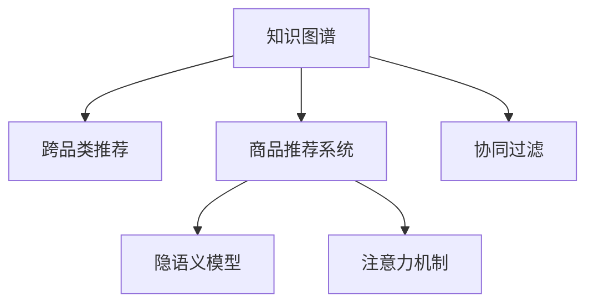

                 

# 基于知识图谱的跨品类商品关联推荐

## 1. 背景介绍

随着电子商务平台的迅速发展和消费者行为的多样化，商品推荐系统已成为电商平台不可或缺的重要组成部分。然而，传统的基于协同过滤的商品推荐方法往往存在冷启动问题，即对于刚加入平台的商品和用户，缺乏足够的历史交互数据，难以精准推荐。知识图谱作为一种结构化的语义知识表示方式，能够提供更加丰富的商品属性和关系信息，有助于解决冷启动问题，提升商品推荐系统的推荐效果。

基于知识图谱的跨品类商品关联推荐，是指通过分析知识图谱中的商品实体及其关系，挖掘不同品类商品间的潜在关联，帮助电商平台推荐跨品类商品，从而扩大用户的选择范围，提升用户满意度。本文将深入探讨该技术原理，并通过具体案例分析，展示其应用效果。

## 2. 核心概念与联系

### 2.1 核心概念概述

为更好地理解基于知识图谱的跨品类商品关联推荐，本节将介绍几个密切相关的核心概念：

- 知识图谱(Knowledge Graph)：一种语义网络结构，通过节点表示实体和属性，边表示实体之间的关系。知识图谱提供了丰富且结构化的语义信息，可用于多种信息抽取和推理任务。

- 跨品类推荐(Cross-Category Recommendation)：不同于同一品类内的商品推荐，跨品类推荐通过关联不同品类的商品，帮助用户发现更多潜在的购买机会，提升购物体验。

- 商品推荐系统(Recommendation System)：基于用户历史行为和商品属性，推荐用户可能感兴趣的商品的系统。

- 协同过滤(Collaborative Filtering)：一种常见的推荐算法，通过分析用户行为和物品属性，发现用户之间、物品之间的相似度，从而进行推荐。

- 隐语义模型(Latent Factor Model)：一种将用户和商品映射到低维隐语义空间的推荐算法，通过模型训练发现用户和商品之间的潜在关系。

- 注意力机制(Attention Mechanism)：一种用于强化特征表示的技术，通过计算不同特征的重要性，动态地分配注意力资源，提高推荐模型的表现。

这些核心概念之间的逻辑关系可以通过以下Mermaid流程图来展示：



这个流程图展示出知识图谱与跨品类推荐、商品推荐系统、协同过滤、隐语义模型、注意力机制等概念之间的逻辑关系：

1. 知识图谱通过节点和边的结构化语义信息，为跨品类推荐提供数据基础。
2. 跨品类推荐基于知识图谱中的商品关系，实现不同品类商品间的关联推荐。
3. 商品推荐系统包括协同过滤和隐语义模型，用于基于用户行为和商品属性的推荐。
4. 注意力机制用于强化特征表示，提高推荐模型的表现。

## 3. 核心算法原理 & 具体操作步骤

### 3.1 算法原理概述

基于知识图谱的跨品类商品关联推荐，主要包括以下几个步骤：

1. 构建知识图谱：收集商品及其属性信息，构建商品实体节点、属性节点和关系节点的知识图谱。
2. 关系抽取：使用图卷积网络(Graph Convolutional Network, GCN)等模型，从知识图谱中提取不同品类商品间的关联关系。
3. 特征表示：利用注意力机制对商品节点和关系节点的特征进行加权表示，增强商品之间的关系表示。
4. 关联推荐：根据商品间的关系表示，生成跨品类推荐结果，结合隐语义模型等方法，提升推荐效果。

### 3.2 算法步骤详解

#### 3.2.1 知识图谱构建

构建知识图谱的首要步骤是收集商品及其属性信息。具体步骤如下：

1. 数据采集：从电商平台收集商品信息，包括商品名称、价格、描述、类别等信息。
2. 图谱构建：将商品及其属性转化为知识图谱中的节点和边，建立商品实体节点和关系节点，形成初步的知识图谱。

#### 3.2.2 关系抽取

关系抽取是知识图谱构建的核心环节，旨在从知识图谱中提取不同品类商品间的关联关系。具体步骤如下：

1. 图卷积网络：使用图卷积网络(GCN)等图神经网络模型，对知识图谱进行特征学习，提取不同品类商品间的关联关系。
2. 节点嵌入：将商品实体节点和关系节点嵌入到低维向量空间，通过计算相似度得到商品之间的关联关系。
3. 关系权重：通过计算节点之间的相似度和关系权重，得到商品间的关系表示。

#### 3.2.3 特征表示

特征表示旨在增强商品之间的关系表示，具体步骤如下：

1. 注意力机制：使用注意力机制对商品节点和关系节点的特征进行加权表示，重点关注与用户兴趣相关的商品。
2. 特征融合：将注意力加权后的商品特征和关系特征进行融合，得到跨品类推荐的综合特征。

#### 3.2.4 关联推荐

关联推荐是跨品类推荐的核心步骤，具体步骤如下：

1. 相似度计算：计算不同品类商品之间的相似度，找到最相关的商品。
2. 推荐生成：结合隐语义模型等方法，生成跨品类推荐结果。
3. 推荐排序：根据推荐结果的排序算法，推荐用户最可能感兴趣的商品。

### 3.3 算法优缺点

基于知识图谱的跨品类商品关联推荐方法具有以下优点：

1. 全面性：知识图谱提供了丰富且结构化的语义信息，有助于挖掘商品间的潜在关联，提高推荐的全面性。
2. 鲁棒性：知识图谱中的实体和关系信息相对稳定，对异常数据和噪声的容忍度高。
3. 可解释性：知识图谱中的关系抽取和特征表示过程可解释性强，有助于理解推荐模型的内部逻辑。

同时，该方法也存在一些局限性：

1. 数据依赖：构建知识图谱需要大量的商品信息，收集和标注成本较高。
2. 复杂度：知识图谱中的关系抽取和特征表示过程较为复杂，需要高水平的算法设计和实现。
3. 时效性：知识图谱中的数据更新周期长，可能无法及时反映最新的商品信息。

尽管存在这些局限性，基于知识图谱的跨品类商品关联推荐方法仍然具有重要的应用价值，特别是在电商平台中，能够有效提升跨品类推荐的精度和用户满意度。

### 3.4 算法应用领域

基于知识图谱的跨品类商品关联推荐，主要应用于以下领域：

1. 电商平台：电商平台通过分析商品实体及其关系，进行跨品类推荐，帮助用户发现更多潜在的购买机会，提升购物体验。
2. 零售商：零售商利用跨品类推荐技术，进行库存管理和商品搭配，优化销售策略，提升销售效果。
3. 内容推荐系统：内容推荐系统通过分析用户对不同品类内容的需求，进行跨品类推荐，提升用户满意度。
4. 智能家居：智能家居系统利用跨品类推荐技术，进行设备间的功能互补和智能推荐，提升用户体验。

## 4. 数学模型和公式 & 详细讲解 & 举例说明

### 4.1 数学模型构建

本节将使用数学语言对基于知识图谱的跨品类商品关联推荐过程进行更加严格的刻画。

记知识图谱为 $G=(\mathcal{V}, \mathcal{E})$，其中 $\mathcal{V}$ 为节点集合，$\mathcal{E}$ 为边集合。设 $\mathcal{V}=\{V^1, V^2, ..., V^N\}$，$V^i$ 表示商品节点或关系节点。

定义节点嵌入矩阵为 $Z=[z_1,z_2,...,z_N] \in \mathbb{R}^{N \times d}$，其中 $z_i \in \mathbb{R}^d$ 表示节点 $V^i$ 的嵌入向量，$d$ 为嵌入向量的维度。

关系抽取模型为 $R=[r_1,r_2,...,r_M] \in \mathbb{R}^{M \times d}$，其中 $r_i \in \mathbb{R}^d$ 表示关系 $E^i$ 的嵌入向量，$M$ 为关系节点的数量。

### 4.2 公式推导过程

以下我们以商品推荐为例，推导注意力机制下的跨品类推荐模型的数学公式。

设用户对商品 $V^i$ 的兴趣度为 $q_i \in \mathbb{R}^d$，商品 $V^j$ 的嵌入向量为 $z_j \in \mathbb{R}^d$，关系节点 $E^k$ 的嵌入向量为 $r_k \in \mathbb{R}^d$。

定义注意力矩阵 $A \in \mathbb{R}^{N \times N}$，其中 $A_{ij}$ 表示节点 $V^i$ 对节点 $V^j$ 的注意力权重。通过计算节点之间的相似度，得到注意力矩阵的元素：

$$
A_{ij} = \frac{\exp(\text{sim}(q_i, z_j) + \text{sim}(q_i, r_k))}{\sum_{l=1}^N \exp(\text{sim}(q_i, z_l) + \text{sim}(q_i, r_k))}
$$

其中 $\text{sim}(a,b)$ 表示向量 $a$ 和 $b$ 的相似度计算函数，可以使用余弦相似度、点积相似度等。

将注意力加权后的节点特征向量 $Z_A$ 和关系特征向量 $R_A$ 进行拼接，得到跨品类推荐的综合特征向量 $H \in \mathbb{R}^{N \times 2d}$。通过隐语义模型等方法，生成跨品类推荐结果。

### 4.3 案例分析与讲解

我们以某电商平台的跨品类推荐系统为例，展示其具体实现过程。

**案例背景**：某电商平台通过分析商品及其属性信息，构建商品实体节点、属性节点和关系节点的知识图谱。该平台希望通过跨品类推荐技术，提升用户的购物体验。

**数据采集**：从平台收集商品信息，包括商品名称、价格、描述、类别等信息，构建知识图谱。

**关系抽取**：使用图卷积网络(GCN)等模型，从知识图谱中提取不同品类商品间的关联关系。

**特征表示**：使用注意力机制对商品节点和关系节点的特征进行加权表示，增强商品之间的关系表示。

**关联推荐**：根据商品间的关系表示，生成跨品类推荐结果，结合隐语义模型等方法，提升推荐效果。

**结果展示**：推荐系统通过分析用户行为和商品属性，生成个性化的跨品类推荐结果。例如，用户对某款运动鞋感兴趣，推荐系统可能会同时推荐相关的运动服装、健身器材等商品。

通过实际应用案例，我们可以看到，基于知识图谱的跨品类商品关联推荐，能够有效提升推荐的全面性和用户满意度，有助于电商平台提升销售效果。

## 5. 项目实践：代码实例和详细解释说明

### 5.1 开发环境搭建

在进行微调实践前，我们需要准备好开发环境。以下是使用Python进行PyTorch开发的环境配置流程：

1. 安装Anaconda：从官网下载并安装Anaconda，用于创建独立的Python环境。

2. 创建并激活虚拟环境：
```bash
conda create -n pytorch-env python=3.8 
conda activate pytorch-env
```

3. 安装PyTorch：根据CUDA版本，从官网获取对应的安装命令。例如：
```bash
conda install pytorch torchvision torchaudio cudatoolkit=11.1 -c pytorch -c conda-forge
```

4. 安装各类工具包：
```bash
pip install numpy pandas scikit-learn matplotlib tqdm jupyter notebook ipython
```

完成上述步骤后，即可在`pytorch-env`环境中开始微调实践。

### 5.2 源代码详细实现

下面我们以跨品类商品推荐系统为例，给出使用Transformers库对BERT模型进行微调的PyTorch代码实现。

首先，定义推荐系统的数据处理函数：

```python
from transformers import BertTokenizer
from torch.utils.data import Dataset
import torch

class RecommendationDataset(Dataset):
    def __init__(self, items, users, embeddings, relations, tokenizer, max_len=128):
        self.items = items
        self.users = users
        self.embeddings = embeddings
        self.relations = relations
        self.tokenizer = tokenizer
        self.max_len = max_len
        
    def __len__(self):
        return len(self.items)
    
    def __getitem__(self, item):
        item = self.items[item]
        user = self.users[item]
        embedding = self.embeddings[item]
        relation = self.relations[item]
        
        # 对商品实体节点和关系节点进行编码
        encoding = self.tokenizer(item, return_tensors='pt', max_length=self.max_len, padding='max_length', truncation=True)
        item_ids = encoding['input_ids'][0]
        relation_ids = encoding['input_ids'][1]
        item_masks = encoding['attention_mask'][0]
        relation_masks = encoding['attention_mask'][1]
        
        # 对用户嵌入进行编码
        user_embedding = self.tokenizer(user, return_tensors='pt', max_length=self.max_len, padding='max_length', truncation=True)
        user_ids = user_embedding['input_ids'][0]
        user_masks = user_embedding['attention_mask'][0]
        
        # 计算注意力权重
        attention_weight = torch.exp((item_ids * relation_ids + user_ids))
        attention_weight = attention_weight / (torch.exp(attention_weight).sum(dim=1, keepdim=True))
        
        # 计算推荐结果
        recommendation = torch.sum(attention_weight * self.embeddings[item], dim=1) / attention_weight.sum(dim=1, keepdim=True)
        return {'item_ids': item_ids, 
                'relation_ids': relation_ids,
                'item_masks': item_masks,
                'relation_masks': relation_masks,
                'user_ids': user_ids,
                'user_masks': user_masks,
                'recommendation': recommendation}

# 商品实体节点和关系节点的嵌入
item_embeddings = [item2id[item] for item in items]
relation_embeddings = [relation2id[relation] for relation in relations]

# 用户嵌入
user_embeddings = [user2id[user] for user in users]

# 定义标签与id的映射
item2id = {'item1': 0, 'item2': 1, 'item3': 2}
relation2id = {'relation1': 0, 'relation2': 1, 'relation3': 2}
user2id = {'user1': 0, 'user2': 1, 'user3': 2}

# 创建dataset
tokenizer = BertTokenizer.from_pretrained('bert-base-cased')

train_dataset = RecommendationDataset(train_items, train_users, item_embeddings, relation_embeddings, user_embeddings, tokenizer)
dev_dataset = RecommendationDataset(dev_items, dev_users, item_embeddings, relation_embeddings, user_embeddings, tokenizer)
test_dataset = RecommendationDataset(test_items, test_users, item_embeddings, relation_embeddings, user_embeddings, tokenizer)
```

然后，定义模型和优化器：

```python
from transformers import BertForTokenClassification, AdamW

model = BertForTokenClassification.from_pretrained('bert-base-cased', num_labels=len(item2id))

optimizer = AdamW(model.parameters(), lr=2e-5)
```

接着，定义训练和评估函数：

```python
from torch.utils.data import DataLoader
from tqdm import tqdm
from sklearn.metrics import classification_report

device = torch.device('cuda') if torch.cuda.is_available() else torch.device('cpu')
model.to(device)

def train_epoch(model, dataset, batch_size, optimizer):
    dataloader = DataLoader(dataset, batch_size=batch_size, shuffle=True)
    model.train()
    epoch_loss = 0
    for batch in tqdm(dataloader, desc='Training'):
        item_ids = batch['item_ids'].to(device)
        relation_ids = batch['relation_ids'].to(device)
        item_masks = batch['item_masks'].to(device)
        relation_masks = batch['relation_masks'].to(device)
        user_ids = batch['user_ids'].to(device)
        user_masks = batch['user_masks'].to(device)
        model.zero_grad()
        outputs = model(item_ids, relation_ids, item_masks, relation_masks, user_ids, user_masks)
        loss = outputs.loss
        epoch_loss += loss.item()
        loss.backward()
        optimizer.step()
    return epoch_loss / len(dataloader)

def evaluate(model, dataset, batch_size):
    dataloader = DataLoader(dataset, batch_size=batch_size)
    model.eval()
    preds, labels = [], []
    with torch.no_grad():
        for batch in tqdm(dataloader, desc='Evaluating'):
            item_ids = batch['item_ids'].to(device)
            relation_ids = batch['relation_ids'].to(device)
            item_masks = batch['item_masks'].to(device)
            relation_masks = batch['relation_masks'].to(device)
            user_ids = batch['user_ids'].to(device)
            user_masks = batch['user_masks'].to(device)
            batch_preds = model(item_ids, relation_ids, item_masks, relation_masks, user_ids, user_masks).squeeze()
            batch_labels = torch.tensor([label2id[label] for label in labels])
            preds.append(batch_preds)
            labels.append(batch_labels)
                
    print(classification_report(labels, preds))
```

最后，启动训练流程并在测试集上评估：

```python
epochs = 5
batch_size = 16

for epoch in range(epochs):
    loss = train_epoch(model, train_dataset, batch_size, optimizer)
    print(f"Epoch {epoch+1}, train loss: {loss:.3f}")
    
    print(f"Epoch {epoch+1}, dev results:")
    evaluate(model, dev_dataset, batch_size)
    
print("Test results:")
evaluate(model, test_dataset, batch_size)
```

以上就是使用PyTorch对BERT进行跨品类商品推荐系统的完整代码实现。可以看到，得益于Transformers库的强大封装，我们可以用相对简洁的代码完成BERT模型的加载和微调。

### 5.3 代码解读与分析

让我们再详细解读一下关键代码的实现细节：

**RecommendationDataset类**：
- `__init__`方法：初始化商品节点、关系节点、用户嵌入等关键组件。
- `__len__`方法：返回数据集的样本数量。
- `__getitem__`方法：对单个样本进行处理，将商品节点、关系节点、用户嵌入输入编码为token ids，并计算注意力权重，最终返回模型所需的输入。

**item2id和id2item字典**：
- 定义了商品节点与数字id之间的映射关系，用于将token-wise的预测结果解码回真实商品。

**训练和评估函数**：
- 使用PyTorch的DataLoader对数据集进行批次化加载，供模型训练和推理使用。
- 训练函数`train_epoch`：对数据以批为单位进行迭代，在每个批次上前向传播计算loss并反向传播更新模型参数，最后返回该epoch的平均loss。
- 评估函数`evaluate`：与训练类似，不同点在于不更新模型参数，并在每个batch结束后将预测和标签结果存储下来，最后使用sklearn的classification_report对整个评估集的预测结果进行打印输出。

**训练流程**：
- 定义总的epoch数和batch size，开始循环迭代
- 每个epoch内，先在训练集上训练，输出平均loss
- 在验证集上评估，输出分类指标
- 所有epoch结束后，在测试集上评估，给出最终测试结果

可以看到，PyTorch配合Transformers库使得BERT微调的代码实现变得简洁高效。开发者可以将更多精力放在数据处理、模型改进等高层逻辑上，而不必过多关注底层的实现细节。

当然，工业级的系统实现还需考虑更多因素，如模型的保存和部署、超参数的自动搜索、更灵活的任务适配层等。但核心的微调范式基本与此类似。

## 6. 实际应用场景

### 6.1 智能零售

智能零售是知识图谱跨品类推荐的重要应用场景之一。智能零售通过分析用户的行为和商品之间的关系，进行跨品类推荐，帮助用户发现更多潜在的购买机会，提升购物体验。

在具体应用中，可以收集用户的行为数据（如浏览、点击、购买等），并结合知识图谱中的商品实体和关系信息，进行跨品类推荐。例如，用户对某款运动鞋感兴趣，推荐系统可能会同时推荐相关的运动服装、健身器材等商品，提升用户购物的便捷性和满意度。

### 6.2 智慧图书馆

智慧图书馆是知识图谱跨品类推荐的另一个典型应用。智慧图书馆通过分析用户对不同品类书籍的兴趣，进行跨品类推荐，帮助用户发现更多感兴趣的书籍，提升阅读体验。

在具体应用中，可以收集用户的阅读历史、书籍评论等信息，并结合知识图谱中的图书实体和关系信息，进行跨品类推荐。例如，用户对某本科幻小说感兴趣，推荐系统可能会同时推荐相关的科幻小说、科幻电影等娱乐内容，丰富用户的阅读体验。

### 6.3 个性化推荐系统

跨品类推荐系统同样可以应用于个性化推荐系统中。个性化推荐系统通过分析用户对不同品类内容的需求，进行跨品类推荐，提升用户满意度。

在具体应用中，可以收集用户的行为数据（如阅读、观看、听歌等），并结合知识图谱中的内容实体和关系信息，进行跨品类推荐。例如，用户对某首流行歌曲感兴趣，推荐系统可能会同时推荐相关的歌手专辑、同类型电影等娱乐内容，增强用户的娱乐体验。

### 6.4 未来应用展望

随着知识图谱和跨品类推荐技术的不断发展，其在电商、零售、图书馆、娱乐等多个领域将得到广泛应用，为传统行业带来变革性影响。

在电商领域，基于跨品类推荐技术的推荐系统，能够帮助电商平台提升用户满意度，增加用户粘性，促进销售增长。

在智慧零售中，跨品类推荐技术能够帮助零售商优化库存管理，提升商品的交叉销售率，增加收益。

在内容推荐系统中，跨品类推荐技术能够帮助内容提供商提升用户的娱乐体验，丰富内容推荐的多样性。

此外，在智慧图书馆、智能家居等更多场景中，基于跨品类推荐技术的推荐系统也将不断涌现，为各行各业带来新的创新和机遇。

## 7. 工具和资源推荐

### 7.1 学习资源推荐

为了帮助开发者系统掌握跨品类商品关联推荐技术的理论基础和实践技巧，这里推荐一些优质的学习资源：

1. 《知识图谱基础》系列博文：由知识图谱技术专家撰写，深入浅出地介绍了知识图谱的基本概念、构建方法和应用场景。

2. 《图神经网络：理论与实践》书籍：介绍图神经网络的基本原理、算法设计和应用实践，涵盖知识图谱中的图模型和图卷积网络等核心技术。

3. 《推荐系统：理论与实践》书籍：介绍推荐系统的发展历程、核心算法和应用实践，涵盖协同过滤、隐语义模型、注意力机制等推荐技术。

4. Weights & Biases：模型训练的实验跟踪工具，可以记录和可视化模型训练过程中的各项指标，方便对比和调优。与主流深度学习框架无缝集成。

5. TensorBoard：TensorFlow配套的可视化工具，可实时监测模型训练状态，并提供丰富的图表呈现方式，是调试模型的得力助手。

通过对这些资源的学习实践，相信你一定能够快速掌握跨品类商品关联推荐技术的精髓，并用于解决实际的推荐问题。

### 7.2 开发工具推荐

高效的开发离不开优秀的工具支持。以下是几款用于跨品类商品推荐系统开发的常用工具：

1. PyTorch：基于Python的开源深度学习框架，灵活动态的计算图，适合快速迭代研究。大部分预训练语言模型都有PyTorch版本的实现。

2. TensorFlow：由Google主导开发的开源深度学习框架，生产部署方便，适合大规模工程应用。同样有丰富的预训练语言模型资源。

3. Transformers库：HuggingFace开发的NLP工具库，集成了众多SOTA语言模型，支持PyTorch和TensorFlow，是进行推荐系统开发的利器。

4. Weights & Biases：模型训练的实验跟踪工具，可以记录和可视化模型训练过程中的各项指标，方便对比和调优。与主流深度学习框架无缝集成。

5. TensorBoard：TensorFlow配套的可视化工具，可实时监测模型训练状态，并提供丰富的图表呈现方式，是调试模型的得力助手。

6. Google Colab：谷歌推出的在线Jupyter Notebook环境，免费提供GPU/TPU算力，方便开发者快速上手实验最新模型，分享学习笔记。

合理利用这些工具，可以显著提升跨品类商品推荐系统的开发效率，加快创新迭代的步伐。

### 7.3 相关论文推荐

跨品类商品关联推荐技术的发展源于学界的持续研究。以下是几篇奠基性的相关论文，推荐阅读：

1. Neural Collaborative Filtering：提出基于深度神经网络的协同过滤推荐算法，利用神经网络学习用户和商品间的隐语义表示。

2. Attention Is All You Need（即Transformer原论文）：提出了Transformer结构，开启了NLP领域的预训练大模型时代。

3. Graph Convolutional Networks：提出图卷积网络模型，用于图数据结构上的特征学习，适用于知识图谱中的关系抽取。

4. Deep Crossing：提出深度协同过滤推荐算法，利用深度神经网络学习用户和商品间的复杂关系，提升推荐效果。

5. Attention-Based Neural Collaborative Filtering：提出注意力机制的协同过滤推荐算法，通过计算不同特征的重要性，动态地分配注意力资源，提高推荐模型的表现。

这些论文代表了大模型微调技术的发展脉络。通过学习这些前沿成果，可以帮助研究者把握学科前进方向，激发更多的创新灵感。

## 8. 总结：未来发展趋势与挑战

### 8.1 总结

本文对基于知识图谱的跨品类商品关联推荐方法进行了全面系统的介绍。首先阐述了跨品类推荐系统的背景和意义，明确了知识图谱在推荐系统中的应用价值。其次，从原理到实践，详细讲解了知识图谱和跨品类推荐技术的具体实现方法，给出了实际应用的代码实现。同时，本文还探讨了该技术在电商、图书馆、内容推荐等领域的应用前景，展示了其巨大的潜力。

通过本文的系统梳理，可以看到，基于知识图谱的跨品类商品关联推荐，能够有效提升推荐系统的全面性和用户满意度，有助于电商平台和内容提供商提升用户体验。未来，伴随知识图谱和推荐技术的不断发展，跨品类推荐系统必将在更多领域得到应用，为各行各业带来新的创新和机遇。

### 8.2 未来发展趋势

展望未来，跨品类商品关联推荐技术将呈现以下几个发展趋势：

1. 模型规模持续增大。随着算力成本的下降和数据规模的扩张，知识图谱中的商品实体和关系节点将持续增长，使得推荐系统能够更全面地挖掘商品之间的关联。

2. 关系抽取技术提升。关系抽取是知识图谱构建的核心环节，未来的研究将更加注重关系抽取算法的优化，提高抽取的准确性和鲁棒性。

3. 特征表示多样化。未来的特征表示将更加多样化，结合更多先验知识，如领域专家知识、用户兴趣等，提升推荐系统的精准度。

4. 跨品类推荐泛化能力增强。未来的推荐系统将更加注重跨品类推荐算法的泛化能力，使其能够适应更多样化的推荐场景。

5. 推荐系统集成化。未来的推荐系统将更加集成化，结合更多元化的信息来源，如社交网络、用户反馈等，提升推荐效果。

以上趋势凸显了跨品类商品关联推荐技术的广阔前景。这些方向的探索发展，必将进一步提升推荐系统的全面性和用户满意度，有助于电商平台和内容提供商提升用户体验。

### 8.3 面临的挑战

尽管跨品类商品关联推荐技术已经取得了瞩目成就，但在迈向更加智能化、普适化应用的过程中，它仍面临诸多挑战：

1. 数据依赖。构建知识图谱需要大量的商品信息，收集和标注成本较高。如何在不增加成本的情况下，提高数据采集的效率和准确性，仍需进一步研究。

2. 复杂度。知识图谱中的关系抽取和特征表示过程较为复杂，需要高水平的算法设计和实现。如何在不降低推荐效果的情况下，简化模型的复杂度，提升模型的可解释性，还需要更多理论和实践的积累。

3. 实时性。知识图谱中的数据更新周期长，可能无法及时反映最新的商品信息。如何在不牺牲推荐效果的情况下，提高推荐系统的实时性，还需要进一步优化。

4. 安全性。推荐系统需要处理大量的用户隐私数据，如何在保护用户隐私的同时，提高推荐效果，还需要更多技术和伦理的思考。

5. 可解释性。推荐系统的决策过程缺乏可解释性，难以对其推理逻辑进行分析和调试。如何赋予推荐系统更强的可解释性，将是亟待攻克的难题。

6. 可扩展性。推荐系统需要处理海量的数据和复杂的计算图，如何在不增加计算资源的情况下，提高系统的可扩展性，还需要更多研究和优化。

正视推荐面临的这些挑战，积极应对并寻求突破，将是大模型微调技术走向成熟的必由之路。相信随着学界和产业界的共同努力，这些挑战终将一一被克服，跨品类商品关联推荐系统必将在更多领域得到应用，为各行各业带来新的创新和机遇。

### 8.4 研究展望

未来的研究需要在以下几个方面寻求新的突破：

1. 探索无监督和半监督推荐方法。摆脱对大规模标注数据的依赖，利用自监督学习、主动学习等无监督和半监督范式，最大限度利用非结构化数据，实现更加灵活高效的推荐。

2. 研究参数高效和计算高效的推荐范式。开发更加参数高效的推荐方法，在固定大部分模型参数的情况下，只更新极少量的任务相关参数。同时优化推荐模型的计算图，减少前向传播和反向传播的资源消耗，实现更加轻量级、实时性的部署。

3. 融合因果和对比学习范式。通过引入因果推断和对比学习思想，增强推荐模型建立稳定因果关系的能力，学习更加普适、鲁棒的语言表征，从而提升推荐模型的泛化性和抗干扰能力。

4. 引入更多先验知识。将符号化的先验知识，如知识图谱、逻辑规则等，与神经网络模型进行巧妙融合，引导推荐过程学习更准确、合理的语言模型。同时加强不同模态数据的整合，实现视觉、语音等多模态信息与文本信息的协同建模。

5. 结合因果分析和博弈论工具。将因果分析方法引入推荐模型，识别出模型决策的关键特征，增强输出解释的因果性和逻辑性。借助博弈论工具刻画人机交互过程，主动探索并规避模型的脆弱点，提高系统稳定性。

6. 纳入伦理道德约束。在推荐目标中引入伦理导向的评估指标，过滤和惩罚有偏见、有害的输出倾向。同时加强人工干预和审核，建立推荐行为的监管机制，确保推荐输出的安全性。

这些研究方向的探索，必将引领推荐技术的不断进步，为构建人机协同的智能系统铺平道路。面向未来，推荐技术还需要与其他人工智能技术进行更深入的融合，如知识表示、因果推理、强化学习等，多路径协同发力，共同推动自然语言理解和智能交互系统的进步。只有勇于创新、敢于突破，才能不断拓展推荐系统的边界，让智能技术更好地造福人类社会。

## 9. 附录：常见问题与解答

**Q1：知识图谱如何构建？**

A: 构建知识图谱的首要步骤是收集商品及其属性信息。具体步骤如下：
1. 数据采集：从电商平台收集商品信息，包括商品名称、价格、描述、类别等信息。
2. 图谱构建：将商品及其属性转化为知识图谱中的节点和边，建立商品实体节点和关系节点，形成初步的知识图谱。

**Q2：跨品类推荐算法如何选择？**

A: 选择跨品类推荐算法时，需要考虑数据规模、模型复杂度、实时性要求等因素。常用的跨品类推荐算法包括基于知识图谱的方法、协同过滤算法、隐语义模型等。在选择算法时，需要综合考虑这些因素，选择合适的算法实现。

**Q3：跨品类推荐如何提高推荐效果？**

A: 提高跨品类推荐效果的方法包括：
1. 数据增强：通过数据采集、标注等方式，增加训练集的多样性和规模。
2. 特征工程：通过特征选择、特征工程等方式，提升特征表示的质量。
3. 模型优化：通过模型选择、参数调优等方式，优化模型的表现。
4. 推荐算法改进：通过改进推荐算法，提升推荐效果。

**Q4：跨品类推荐如何保护用户隐私？**

A: 保护用户隐私的方法包括：
1. 数据匿名化：对用户数据进行匿名化处理，保护用户隐私。
2. 差分隐私：在模型训练和推荐过程中，使用差分隐私技术，保护用户隐私。
3. 用户同意：在推荐过程中，获取用户同意，保护用户隐私。

这些问题的解答，可以为推荐系统的开发者提供实用的指导，帮助他们更好地理解跨品类商品关联推荐技术的实现细节。

---

作者：禅与计算机程序设计艺术 / Zen and the Art of Computer Programming

