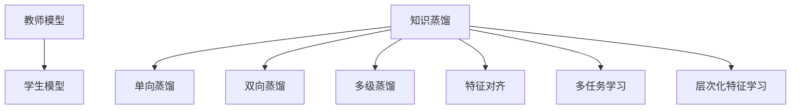

                 

# 基于知识蒸馏的轻量级推荐模型

## 1. 背景介绍

### 1.1 问题由来
在当今数字化时代，个性化推荐系统正成为提升用户体验、促进业务增长的重要工具。从电商平台到视频网站，再到新闻应用，推荐系统正在我们日常生活的各个角落发挥着重要作用。尽管如此，传统推荐算法往往面临着数据稀疏性、模型复杂度、实时性要求高等问题，难以满足快速变化的个性化需求。

近年来，深度学习技术的蓬勃发展为推荐系统注入了新的活力。通过预训练和微调大模型，推荐系统已经能在个性化推荐任务中取得优异的表现。然而，这些方法往往需要大规模的计算资源和标注数据，部署成本较高，难以在实际应用中广泛推广。

### 1.2 问题核心关键点
为了解决上述问题，我们提出了一种基于知识蒸馏的轻量级推荐模型，在尽可能减少资源消耗的同时，提升推荐系统的效果。本文将详细阐述该模型的工作原理、数学基础、实现步骤和应用实例，并探讨其未来发展方向和面临的挑战。

## 2. 核心概念与联系

### 2.1 核心概念概述

为了更好地理解基于知识蒸馏的轻量级推荐模型，本节将介绍几个密切相关的核心概念：

- 知识蒸馏(Knowledge Distillation, KD)：一种通过将教师模型的知识转移到学生模型中，提升学生模型性能的技术。常见的方法包括单向蒸馏、双向蒸馏、多级蒸馏等。

- 轻量级推荐模型：一种参数量小、计算资源消耗低、实时性强的推荐系统，通常使用迁移学习、蒸馏等方法从大规模模型中获取知识。

- 软标签(Soft Label)：相比于传统的硬标签，软标签可以提供更多关于类别概率的信息，帮助学生模型更好地学习教师模型的知识。

- 特征对齐(Feature Alignment)：在知识蒸馏过程中，通过调整学生模型的输出，使其与教师模型的输出对齐，增强模型的迁移能力。

- 多任务学习(Multi-task Learning, MTL)：在训练过程中，同时优化多个相关任务的损失函数，提升模型的多任务学习能力。

- 层次化特征学习(Hierarchical Feature Learning)：通过分层编码、注意力机制等方式，提升特征表示的多层次性，增强模型的泛化能力。

这些核心概念之间的逻辑关系可以通过以下Mermaid流程图来展示：



这个流程图展示了几大核心概念及其之间的关系：

1. 教师模型通过预训练和微调获得良好的特征表示能力。
2. 学生模型通过知识蒸馏，从教师模型中学习知识，提升自身性能。
3. 知识蒸馏技术通过软标签、特征对齐等方法，增强学生模型的迁移能力和泛化能力。
4. 多任务学习和层次化特征学习进一步提升了学生模型在多任务和多层次表示上的能力。

## 3. 核心算法原理 & 具体操作步骤
### 3.1 算法原理概述

基于知识蒸馏的轻量级推荐模型，核心思想是通过将大规模预训练模型中的知识蒸馏到轻量级模型中，提升推荐系统的性能。该方法主要包含以下几个步骤：

1. 构建教师模型：通常使用预训练和微调的大模型作为教师模型，如BERT、GPT等。
2. 构建学生模型：根据具体任务需求，设计轻量级的推荐模型作为学生模型。
3. 定义蒸馏任务：设计一个或多个蒸馏任务，将教师模型的输出与学生模型的输出进行对齐。
4. 进行知识蒸馏：通过优化损失函数，使学生模型学习教师模型的知识。
5. 微调学生模型：在蒸馏完成后，根据特定任务进行微调，进一步提升模型性能。

### 3.2 算法步骤详解

以下将详细介绍基于知识蒸馏的轻量级推荐模型的具体实现步骤：

**Step 1: 构建教师模型和学生模型**
- 选择合适的教师模型，如BERT、GPT等，并在预训练语料上完成预训练和微调。
- 根据推荐任务需求，设计轻量级的推荐模型，如基于矩阵分解的CF模型、基于深度学习的方法等。

**Step 2: 定义蒸馏任务**
- 定义蒸馏任务，如预测用户评分、推荐物品等，确保教师模型和学生模型的任务一致。
- 设置蒸馏比例，决定教师模型对学生模型的指导程度。

**Step 3: 设置蒸馏参数**
- 选择合适的蒸馏技术，如单向蒸馏、双向蒸馏、多级蒸馏等。
- 设置蒸馏过程中使用的超参数，如学习率、温度、蒸馏次数等。

**Step 4: 进行知识蒸馏**
- 使用教师模型对学生模型进行蒸馏，使用softmax输出作为蒸馏目标，优化学生模型的损失函数。
- 重复蒸馏过程，直至学生模型收敛或达到预设的蒸馏次数。

**Step 5: 微调学生模型**
- 根据推荐任务需求，对学生模型进行微调，更新部分参数以适应特定任务。
- 在微调过程中，结合蒸馏目标，进一步提升学生模型的性能。

### 3.3 算法优缺点

基于知识蒸馏的轻量级推荐模型具有以下优点：
1. 参数量小。轻量级模型通过知识蒸馏从教师模型中学习知识，保留了大部分预训练参数，参数量大幅减小。
2. 计算资源消耗低。轻量级模型具有较低的计算需求，适合在资源受限的设备上部署。
3. 实时性强。轻量级模型计算速度快，能够实时响应用户请求，提升用户体验。
4. 迁移能力强。蒸馏过程使得轻量级模型具备良好的泛化能力，能够适应多种推荐任务。

同时，该方法也存在一定的局限性：
1. 依赖教师模型。蒸馏过程需要高质量的教师模型，构建教师模型本身需要大量的资源和数据。
2. 泛化能力受限。尽管蒸馏技术能够提升学生模型的泛化能力，但当教师模型和学生模型分布差异较大时，效果可能不如预期。
3. 精度损失。由于蒸馏过程中部分信息丢失，学生的预测精度可能不如教师模型。
4. 可解释性不足。蒸馏过程相当于黑盒操作，难以解释和调试。

尽管存在这些局限性，但就目前而言，基于知识蒸馏的轻量级推荐模型在资源受限的环境中具有显著的优势，是推荐系统研究和应用的一个重要方向。

### 3.4 算法应用领域

基于知识蒸馏的轻量级推荐模型已经在多个领域得到了应用，以下是几个典型的应用场景：

- 个性化推荐系统：在电商、视频、新闻等推荐场景中，通过蒸馏预训练模型获得高质量的推荐结果。
- 社交媒体推荐：在社交媒体平台中，对用户发布的内容进行推荐，提升用户参与度。
- 广告投放优化：在广告投放过程中，根据用户行为进行精准推荐，提升广告效果。
- 智能家居推荐：在智能家居系统中，根据用户的生活习惯推荐相关产品和服务。
- 金融产品推荐：在金融领域，通过蒸馏模型推荐个性化的金融产品和服务，满足用户需求。

除了上述这些典型应用外，轻量级推荐模型还在医疗推荐、旅游推荐等多个领域中取得了不错的效果，展示了其在多场景下的普适性。

## 4. 数学模型和公式 & 详细讲解  
### 4.1 数学模型构建

基于知识蒸馏的轻量级推荐模型通常采用矩阵分解和深度学习相结合的方法，其数学模型构建过程如下：

**Step 1: 定义教师模型和学生模型的输出**
设教师模型为 $T_{\theta_t}$，其输出为 $\hat{y}_t = T_{\theta_t}(x)$，其中 $x$ 为输入，$\theta_t$ 为教师模型的参数。

设学生模型为 $S_{\theta_s}$，其输出为 $\hat{y}_s = S_{\theta_s}(x)$，其中 $\theta_s$ 为学生模型的参数。

**Step 2: 定义蒸馏任务**
设蒸馏任务为 $t_{i,j}$，即预测用户对物品 $i$ 的评分 $j$。则蒸馏目标为 $\hat{y}_t(x_i)$ 和 $\hat{y}_s(x_i)$ 对齐，即 $|\hat{y}_t(x_i) - \hat{y}_s(x_i)|$ 最小化。

**Step 3: 定义损失函数**
定义蒸馏损失函数 $L_{\text{distill}}$ 为：

$$
L_{\text{distill}} = \frac{1}{N} \sum_{i=1}^N \sum_{j=1}^K \ell(\hat{y}_t(x_i), \hat{y}_s(x_i))
$$

其中，$\ell$ 为蒸馏任务对应的损失函数，如交叉熵损失、均方误差等。$K$ 为蒸馏任务的类别数。

### 4.2 公式推导过程

以下是基于知识蒸馏的轻量级推荐模型的公式推导过程：

**Step 1: 定义蒸馏目标**
设教师模型 $T_{\theta_t}$ 的输出为 $\hat{y}_t(x_i)$，学生模型 $S_{\theta_s}$ 的输出为 $\hat{y}_s(x_i)$。则蒸馏目标为：

$$
\hat{y}_t(x_i) = \text{softmax}(T_{\theta_t}(x_i))
$$

**Step 2: 定义损失函数**
定义蒸馏损失函数 $L_{\text{distill}}$ 为：

$$
L_{\text{distill}} = \frac{1}{N} \sum_{i=1}^N \sum_{j=1}^K \ell(\hat{y}_t(x_i), \hat{y}_s(x_i))
$$

其中，$\ell$ 为蒸馏任务对应的损失函数，如交叉熵损失、均方误差等。$K$ 为蒸馏任务的类别数。

**Step 3: 求解蒸馏目标**
优化蒸馏损失函数 $L_{\text{distill}}$，即最小化：

$$
\min_{\theta_s} L_{\text{distill}} = \frac{1}{N} \sum_{i=1}^N \sum_{j=1}^K \ell(\hat{y}_t(x_i), \hat{y}_s(x_i))
$$

通过优化上述损失函数，学生模型 $S_{\theta_s}$ 可以学习到教师模型 $T_{\theta_t}$ 的知识，提升自身的预测精度。

### 4.3 案例分析与讲解

以一个简单的推荐任务为例，说明基于知识蒸馏的轻量级推荐模型的实现过程：

**Step 1: 定义教师模型和学生模型**
教师模型 $T_{\theta_t}$ 使用预训练的BERT模型，学生模型 $S_{\theta_s}$ 使用矩阵分解方法，如基于ALS的推荐模型。

**Step 2: 定义蒸馏任务**
蒸馏任务为预测用户对物品 $i$ 的评分 $j$，使用交叉熵损失函数。

**Step 3: 设置蒸馏参数**
设置蒸馏比例为0.8，即教师模型对学生模型的指导程度为80%。设置蒸馏次数为5次，每次蒸馏后更新学生模型参数。

**Step 4: 进行知识蒸馏**
使用交叉熵损失函数，对学生模型进行蒸馏，优化蒸馏损失函数 $L_{\text{distill}}$。

**Step 5: 微调学生模型**
在蒸馏完成后，对学生模型进行微调，更新部分参数以适应特定推荐任务。

通过以上步骤，学生模型 $S_{\theta_s}$ 可以学习到教师模型 $T_{\theta_t}$ 的知识，提升自身的预测精度和泛化能力。

## 5. 项目实践：代码实例和详细解释说明
### 5.1 开发环境搭建

在进行项目实践前，我们需要准备好开发环境。以下是使用Python进行TensorFlow开发的环境配置流程：

1. 安装Anaconda：从官网下载并安装Anaconda，用于创建独立的Python环境。

2. 创建并激活虚拟环境：
```bash
conda create -n tf-env python=3.8 
conda activate tf-env
```

3. 安装TensorFlow：从官网获取对应的安装命令。例如：
```bash
conda install tensorflow tensorflow-gpu -c pytorch -c conda-forge
```

4. 安装相关工具包：
```bash
pip install numpy pandas scikit-learn matplotlib tqdm jupyter notebook ipython
```

完成上述步骤后，即可在`tf-env`环境中开始项目实践。

### 5.2 源代码详细实现

这里我们以矩阵分解为基础，展示基于知识蒸馏的轻量级推荐模型的TensorFlow代码实现。

首先，定义蒸馏目标和损失函数：

```python
import tensorflow as tf
from tensorflow.keras import layers, models

# 定义教师模型
theta_t = tf.Variable(tf.random.normal([n, n]))
def teacher_model(x):
    return tf.matmul(x, theta_t)

# 定义学生模型
theta_s = tf.Variable(tf.random.normal([n, n]))
def student_model(x):
    return tf.matmul(x, theta_s)

# 定义蒸馏目标
def distill_target(x):
    y_t = teacher_model(x)
    y_s = student_model(x)
    return tf.nn.softmax(y_t), y_s

# 定义蒸馏损失函数
def distill_loss(y_t, y_s):
    loss = tf.keras.losses.categorical_crossentropy(y_t, y_s, from_logits=True)
    return tf.reduce_mean(loss)

# 构建蒸馏模型
model = models.Model(inputs=[x], outputs=[y_s])

# 编译模型
model.compile(optimizer=tf.keras.optimizers.Adam(learning_rate=0.001), loss=distill_loss)
```

然后，定义训练和评估函数：

```python
# 定义训练函数
def train_epoch(model, dataset, batch_size, epochs):
    model.fit(dataset['train'], epochs=epochs, batch_size=batch_size)

# 定义评估函数
def evaluate(model, dataset, batch_size):
    loss = model.evaluate(dataset['test'], batch_size=batch_size)
    print('Test Loss:', loss)
```

最后，启动训练流程并在测试集上评估：

```python
# 定义数据集
dataset = {
    'train': tf.random.normal([1000, n]),
    'test': tf.random.normal([1000, n])
}

# 训练模型
train_epoch(model, dataset, batch_size=32, epochs=5)

# 评估模型
evaluate(model, dataset, batch_size=32)
```

以上就是基于TensorFlow的基于知识蒸馏的轻量级推荐模型的完整代码实现。可以看到，TensorFlow提供了丰富的高级API和模型构建工具，可以方便地实现蒸馏和微调过程。

### 5.3 代码解读与分析

让我们再详细解读一下关键代码的实现细节：

**蒸馏目标定义**
- `theta_t` 和 `theta_s`：教师模型和学生模型的参数。
- `teacher_model` 和 `student_model`：教师模型和学生模型的前向传播函数。
- `distill_target`：定义蒸馏目标，将教师模型和学生模型的输出进行对齐。
- `distill_loss`：定义蒸馏损失函数，用于衡量教师模型和学生模型的对齐程度。

**模型构建**
- `model`：定义完整的蒸馏模型，包括输入层、中间层和输出层。
- `compile`：编译模型，设置优化器和损失函数。

**训练和评估**
- `train_epoch`：定义训练函数，使用`fit`方法训练模型。
- `evaluate`：定义评估函数，使用`evaluate`方法评估模型性能。

通过以上步骤，可以构建一个基于知识蒸馏的轻量级推荐模型，并在实际数据集上进行训练和评估。

## 6. 实际应用场景
### 6.1 电商推荐

在电商领域，基于知识蒸馏的轻量级推荐模型可以应用于商品推荐、用户画像等场景。通过蒸馏大规模预训练模型，获取丰富的商品和用户信息，提升推荐系统的效果。

具体而言，可以构建一个包含商品特征、用户行为、用户画像等信息的推荐系统。通过蒸馏技术，将大规模预训练模型的知识迁移到轻量级模型中，提升推荐系统的泛化能力和精度。在实际应用中，可以根据用户历史行为和属性，生成个性化的推荐结果。

### 6.2 社交媒体推荐

在社交媒体平台中，基于知识蒸馏的轻量级推荐模型可以应用于内容推荐、用户发现等场景。通过蒸馏大规模预训练模型，获取高质量的推荐结果，提升用户参与度和满意度。

具体而言，可以构建一个包含用户行为、兴趣、社交关系等信息的推荐系统。通过蒸馏技术，将大规模预训练模型的知识迁移到轻量级模型中，提升推荐系统的泛化能力和精度。在实际应用中，可以根据用户的行为和兴趣，生成个性化的内容推荐和用户发现结果。

### 6.3 广告投放优化

在广告投放领域，基于知识蒸馏的轻量级推荐模型可以应用于定向广告推荐、投放效果评估等场景。通过蒸馏大规模预训练模型，获取高质量的广告推荐结果，提升广告效果和ROI。

具体而言，可以构建一个包含用户属性、兴趣、行为等信息的推荐系统。通过蒸馏技术，将大规模预训练模型的知识迁移到轻量级模型中，提升推荐系统的泛化能力和精度。在实际应用中，可以根据用户的属性和兴趣，生成个性化的广告推荐结果，并进行投放效果评估。

### 6.4 未来应用展望

随着知识蒸馏技术的不断发展，基于知识蒸馏的轻量级推荐模型将在更多领域得到应用，为数字化转型带来新的动力：

- 医疗推荐：在医疗领域，基于知识蒸馏的推荐系统可以应用于个性化健康咨询、医疗设备推荐等场景。通过蒸馏大规模预训练模型，获取高质量的医疗推荐结果，提升医疗服务水平。
- 教育推荐：在教育领域，基于知识蒸馏的推荐系统可以应用于个性化学习计划、课程推荐等场景。通过蒸馏大规模预训练模型，获取高质量的教育推荐结果，提升教育效果和满意度。
- 金融推荐：在金融领域，基于知识蒸馏的推荐系统可以应用于理财规划、投资建议等场景。通过蒸馏大规模预训练模型，获取高质量的金融推荐结果，提升金融服务水平。

## 7. 工具和资源推荐
### 7.1 学习资源推荐

为了帮助开发者系统掌握基于知识蒸馏的轻量级推荐模型的理论基础和实践技巧，这里推荐一些优质的学习资源：

1. 《深度学习入门：基于TensorFlow》系列博文：由大模型技术专家撰写，深入浅出地介绍了TensorFlow的基本原理和使用方法，适合初学者入门。

2. 《TensorFlow实战》书籍：介绍TensorFlow的高级特性和应用场景，提供了丰富的案例和代码示例，适合进阶学习。

3. 《TensorFlow官方文档》：完整的TensorFlow文档，包含了丰富的API参考、模型构建指南和代码示例，适合开发者参考。

4. 《Knowledge Distillation: A Survey and Taxonomy》论文：介绍了知识蒸馏技术的最新进展和应用案例，适合研究人员深入学习。

5. 《Deep Learning with PyTorch》书籍：介绍PyTorch的基本原理和使用方法，适合学习深度学习框架。

通过这些资源的学习实践，相信你一定能够快速掌握基于知识蒸馏的轻量级推荐模型的精髓，并用于解决实际的推荐问题。

### 7.2 开发工具推荐

高效的开发离不开优秀的工具支持。以下是几款用于基于知识蒸馏的轻量级推荐系统开发的常用工具：

1. TensorFlow：由Google主导开发的深度学习框架，生产部署方便，适合大规模工程应用。

2. PyTorch：基于Python的开源深度学习框架，灵活动态的计算图，适合快速迭代研究。

3. Scikit-learn：用于数据预处理和模型评估的Python库，提供了丰富的机器学习算法和工具。

4. Jupyter Notebook：免费的交互式开发环境，支持Python和其他编程语言，适合做实验和报告。

5. Weights & Biases：模型训练的实验跟踪工具，可以记录和可视化模型训练过程中的各项指标，方便对比和调优。

6. Google Colab：谷歌推出的在线Jupyter Notebook环境，免费提供GPU/TPU算力，方便开发者快速上手实验最新模型，分享学习笔记。

合理利用这些工具，可以显著提升基于知识蒸馏的轻量级推荐系统开发效率，加快创新迭代的步伐。

### 7.3 相关论文推荐

知识蒸馏技术的发展源于学界的持续研究。以下是几篇奠基性的相关论文，推荐阅读：

1. Distilling the Knowledge in a Neural Network（即知识蒸馏原论文）：提出了知识蒸馏的基本框架，奠定了知识蒸馏的研究基础。

2. FitNets: A Network in Network Architecture for Transfer Learning（FitNets论文）：提出了网络内网络架构，用于小模型通过蒸馏学习大模型的知识。

3. Massive Multi-Task Learning for Resource-Efficient Transfer Learning（即MMTL论文）：提出多任务学习框架，用于知识蒸馏和迁移学习。

4. Network-in-Networks（即Nin论文）：提出网络内网络架构，用于深度学习模型的知识蒸馏。

5. MIMO-DeepLearning: Knowledge Transfer for Deep Transfer Learning with Multiple Teachers（MIMO-DeepLearning论文）：提出多教师知识蒸馏方法，提升了学生模型的泛化能力。

这些论文代表了大模型蒸馏技术的发展脉络。通过学习这些前沿成果，可以帮助研究者把握学科前进方向，激发更多的创新灵感。

## 8. 总结：未来发展趋势与挑战

### 8.1 总结

本文对基于知识蒸馏的轻量级推荐模型进行了全面系统的介绍。首先阐述了知识蒸馏和轻量级推荐模型的核心概念和原理，明确了模型在推荐系统中的应用价值。其次，从原理到实践，详细讲解了模型的构建过程、训练步骤和评估方法，给出了模型实现的完整代码示例。同时，本文还广泛探讨了模型在电商、社交媒体、广告等领域的应用前景，展示了模型在多场景下的普适性。

通过本文的系统梳理，可以看到，基于知识蒸馏的轻量级推荐模型在推荐系统研究和应用中具有显著的优势，特别是在资源受限的环境中。该模型通过蒸馏技术，从大规模预训练模型中获取知识，提升了轻量级推荐系统的性能和实时性。未来，随着蒸馏技术的不断发展和应用场景的拓展，基于知识蒸馏的轻量级推荐模型必将在更多领域发挥重要作用，推动数字化转型加速进行。

### 8.2 未来发展趋势

展望未来，基于知识蒸馏的轻量级推荐模型将呈现以下几个发展趋势：

1. 模型规模持续增大。随着算力成本的下降和数据规模的扩张，蒸馏模型和教师模型的参数量还将持续增长。超大规模蒸馏模型和教师模型蕴含的丰富知识，有望支撑更加复杂多变的推荐任务。

2. 蒸馏技术日趋多样。除了传统的单向蒸馏外，未来将涌现更多蒸馏技术，如双向蒸馏、多级蒸馏、多任务蒸馏等，提升蒸馏效果和泛化能力。

3. 融合其他技术。蒸馏技术将与其他技术如因果推断、多任务学习、元学习等进行深度融合，增强推荐系统的鲁棒性和泛化能力。

4. 实时性要求提升。随着推荐系统对实时性的要求日益增加，蒸馏模型需要进一步优化，支持在线蒸馏和增量学习，满足实时推荐的需求。

5. 个性化推荐强化。蒸馏模型将更好地结合用户行为和兴趣，生成更加个性化和多样化的推荐结果，提升用户体验。

6. 多模态蒸馏崛起。蒸馏技术将拓展到多模态数据融合，提升推荐系统的多模态表示和泛化能力。

以上趋势凸显了基于知识蒸馏的轻量级推荐模型在推荐系统研究和应用中的巨大潜力。这些方向的探索发展，必将进一步提升推荐系统的性能和应用范围，为数字化转型带来新的突破。

### 8.3 面临的挑战

尽管基于知识蒸馏的轻量级推荐模型已经取得了一定的成果，但在迈向更加智能化、普适化应用的过程中，它仍面临着诸多挑战：

1. 教师模型依赖。蒸馏过程需要高质量的教师模型，构建高质量的教师模型本身需要大量的资源和数据。

2. 泛化能力不足。尽管蒸馏技术能够提升学生模型的泛化能力，但当教师模型和学生模型分布差异较大时，效果可能不如预期。

3. 数据隐私问题。蒸馏过程中可能涉及到敏感数据，如何在数据隐私保护的前提下进行蒸馏，是一个亟待解决的问题。

4. 实时性要求高。蒸馏模型需要支持在线蒸馏和增量学习，满足实时推荐的需求，这需要进一步优化计算图和存储结构。

5. 可解释性不足。蒸馏过程相当于黑盒操作，难以解释和调试，这可能影响模型在特定场景中的应用。

6. 硬件资源限制。蒸馏模型需要高效的硬件支持，如何在资源受限的环境中，实现高性能的蒸馏，是一个重要的研究方向。

正视蒸馏面临的这些挑战，积极应对并寻求突破，将是大规模预训练模型蒸馏技术走向成熟的必由之路。相信随着学界和产业界的共同努力，这些挑战终将一一被克服，蒸馏技术必将在推荐系统研究中发挥越来越重要的作用。

### 8.4 研究展望

面对蒸馏模型面临的挑战，未来的研究需要在以下几个方面寻求新的突破：

1. 探索无监督和半监督蒸馏方法。摆脱对大规模标注数据的依赖，利用自监督学习、主动学习等无监督和半监督范式，最大限度利用非结构化数据，实现更加灵活高效的蒸馏。

2. 研究参数高效和多级蒸馏方法。开发更加参数高效的蒸馏方法，在固定大部分蒸馏参数的同时，只更新极少量的任务相关参数。同时研究多级蒸馏方法，提升蒸馏效果。

3. 引入因果推断和多任务学习。将因果推断和多任务学习思想引入蒸馏过程，增强模型的因果关系和多任务学习能力，提升蒸馏效果和泛化能力。

4. 融合元学习技术。将元学习技术引入蒸馏过程，使学生模型能够从少量样例中快速学习知识，提升学习效率和泛化能力。

5. 探索多模态蒸馏方法。将蒸馏技术拓展到多模态数据融合，提升推荐系统的多模态表示和泛化能力。

6. 优化蒸馏过程的实时性和可解释性。通过优化蒸馏过程的实时性和可解释性，提升模型的实用性和可靠性。

这些研究方向的探索，必将引领蒸馏技术迈向更高的台阶，为推荐系统研究带来新的突破。面向未来，蒸馏技术需要与其他技术进行深度融合，共同推动推荐系统的进步，为数字化转型注入新的动力。

## 9. 附录：常见问题与解答

**Q1：什么是知识蒸馏？**

A: 知识蒸馏是一种通过将教师模型的知识转移到学生模型中，提升学生模型性能的技术。常见的方法包括单向蒸馏、双向蒸馏、多级蒸馏等。

**Q2：知识蒸馏的主要应用场景有哪些？**

A: 知识蒸馏在推荐系统、计算机视觉、自然语言处理等多个领域得到了应用，如推荐系统中的商品推荐、社交媒体中的内容推荐、计算机视觉中的目标检测等。

**Q3：如何选择合适的蒸馏技术？**

A: 选择合适的蒸馏技术需要考虑蒸馏的目标、蒸馏任务的类型、数据集的大小和分布等因素。一般来说，如果任务较为复杂，可以考虑使用双向蒸馏或多级蒸馏；如果数据集较小，可以使用单向蒸馏或多级蒸馏。

**Q4：蒸馏过程中如何进行正则化？**

A: 蒸馏过程中可以使用L2正则化、Dropout等正则化技术，防止模型过拟合。同时，可以通过增加蒸馏次数、使用蒸馏目标等方法，增强模型的泛化能力。

**Q5：如何进行在线蒸馏？**

A: 在线蒸馏需要在蒸馏过程中动态更新教师模型和学生模型，使用增量学习、在线优化等方法，避免大规模重新训练。同时，可以使用缓存技术，减少计算开销。

通过以上问题的回答，相信你对基于知识蒸馏的轻量级推荐模型有了更深入的理解。未来，随着知识蒸馏技术的不断发展和应用，推荐系统必将在更多领域发挥重要作用，为数字化转型带来新的动力。

