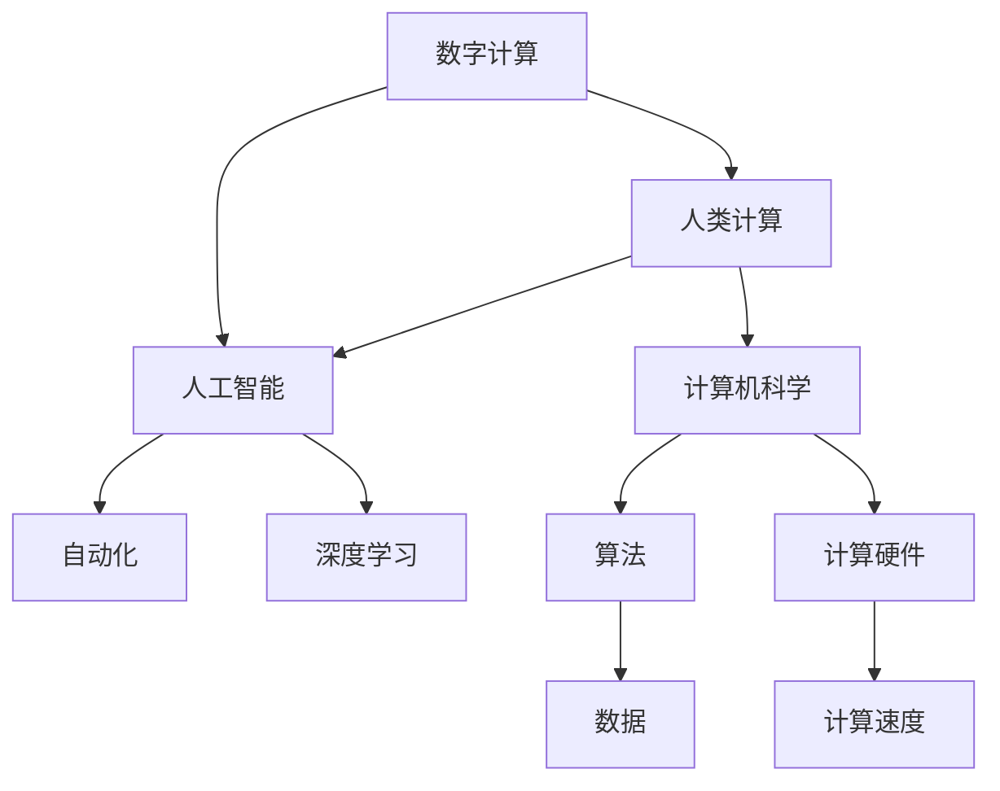

                 

# 塑造数字时代：人类计算的关键作用

> 关键词：数字计算, 人类计算, 人工智能, 自动化, 深度学习, 计算机科学, 未来发展

## 1. 背景介绍

### 1.1 问题由来

随着科技的迅猛发展，数字时代的到来已经不可避免。从智能手机的普及到5G网络的布局，从大数据的爆发到人工智能的崛起，数字技术正在深刻改变我们的生产生活方式。在这个背景下，人类计算的角色变得愈发重要。

人工智能(AI)技术的突飞猛进，尤其是在深度学习、计算机视觉、自然语言处理等领域，展示了其巨大的潜力。然而，人工智能的发展并不是孤立的，而是建立在人类计算的深厚基础之上。没有人类计算的奠基，AI技术根本无法产生巨大的价值。

### 1.2 问题核心关键点

人工智能的核心是计算。计算需要算法、数据、硬件等多方面的支持。其中，人类计算扮演了至关重要的角色。人类计算不仅是算法设计的基石，也是数据标注的来源，更是硬件发展的驱动。

### 1.3 问题研究意义

研究人类计算的作用和未来趋势，对于理解人工智能技术的发展，推动科技创新，具有重要意义：

1. **理解AI发展路径**：人类计算是AI发展不可或缺的一部分。理解人类计算的作用，有助于把握AI技术的未来发展方向。
2. **推动科技创新**：人类计算能力的高低直接影响到AI技术的进展速度和应用效果。
3. **促进产业升级**：人类计算能力的提升，可以加速AI技术的落地应用，推动各行业的数字化转型。
4. **改善人类生活质量**：人类计算能力的增强，将带来更多智能化的应用场景，提升人们的生活质量。

## 2. 核心概念与联系

### 2.1 核心概念概述

要理解人类计算的作用，首先需要了解以下几个核心概念：

- **数字计算**：使用计算机等数字设备进行的数据处理、分析和计算。
- **人类计算**：人类通过手工、思维、实验等手段进行的数据处理、分析和计算。
- **人工智能**：通过算法和计算，使计算机具备类似于人类的智能。
- **自动化**：通过算法和计算，实现某些任务的自动化处理，减少人工干预。
- **深度学习**：一种基于人工神经网络的机器学习技术，擅长处理非线性、高维数据。
- **计算机科学**：研究计算机和计算的理论、算法和应用学科。

这些概念之间的联系可以通过以下Mermaid流程图来展示：



这个流程图展示了数字计算、人类计算、人工智能、自动化、深度学习、计算机科学之间的逻辑关系：

1. 数字计算和人类计算是AI的基础。
2. 人工智能依赖自动化和深度学习，实现智能化处理。
3. 深度学习使用算法和数据，是AI的核心技术。
4. 计算机科学研究算法和硬件，支撑AI的发展。

## 3. 核心算法原理 & 具体操作步骤

### 3.1 算法原理概述

人工智能的算法设计需要以人类计算为基础。从算法思想到实现，每个环节都离不开人类智慧的贡献。

- **算法设计**：许多经典算法的灵感来源于人类计算中的逻辑和思维。例如，随机梯度下降算法(SGD)就是受到人类打靶游戏(SHOT)的启发。
- **数据标注**：大数据时代的很多数据需要人工标注。例如，自然语言处理中的词向量训练，需要人工标注大量的句子与词对应的关系。
- **模型优化**：深度学习模型的优化需要大量人类计算资源。例如，GPU加速训练，需要人类设计高效的计算图和优化器。

### 3.2 算法步骤详解

人工智能的算法开发和优化，需要经过以下关键步骤：

1. **问题建模**：将现实问题转化为计算问题，并选择合适的数学模型。
2. **数据获取**：收集、整理、清洗数据，确保数据的质量和多样性。
3. **算法设计**：基于问题建模，设计合适的算法框架和计算策略。
4. **模型训练**：使用数据训练模型，优化模型参数，提升模型效果。
5. **模型评估**：使用测试数据评估模型效果，调整模型参数。
6. **模型部署**：将模型部署到实际应用环境中，进行实时推理。

### 3.3 算法优缺点

人工智能算法的设计和优化，具有以下优点：

1. **高效性**：自动化和算法优化可以大幅提升计算效率，减少人工干预。
2. **可扩展性**：算法可以应用于各种数据和任务，具有广泛的适用性。
3. **精确性**：深度学习等先进算法，可以处理复杂的非线性问题，提高计算精度。

同时，算法也存在一些缺点：

1. **过度依赖数据**：算法的有效性依赖于高质量的数据。数据偏差可能导致算法失效。
2. **复杂度高**：高级算法的实现和优化复杂，需要大量的计算资源。
3. **黑盒性**：复杂的算法往往难以解释，缺乏透明性。
4. **对抗攻击**：深度学习模型容易受到对抗样本的攻击，影响安全性和可靠性。

### 3.4 算法应用领域

人工智能算法在各个领域都有广泛的应用：

- **医疗领域**：图像识别、病历分析、药物研发等。
- **金融领域**：风险评估、股票预测、交易策略等。
- **工业领域**：智能制造、质量控制、供应链优化等。
- **农业领域**：精准农业、农作物识别、病虫害预测等。
- **交通领域**：自动驾驶、交通流量分析、事故预测等。

## 4. 数学模型和公式 & 详细讲解 & 举例说明

### 4.1 数学模型构建

人工智能的算法开发，依赖于数学模型的构建。以下是几个常用的数学模型及其构建方法：

- **线性回归模型**：用于预测数值型数据，模型为 $y = w_0 + w_1x_1 + w_2x_2 + \cdots + w_nx_n + b$。
- **逻辑回归模型**：用于分类问题，模型为 $p(y=1|x) = \frac{1}{1+\exp(-z)}$，其中 $z = w_0 + w_1x_1 + w_2x_2 + \cdots + w_nx_n$。
- **卷积神经网络模型**：用于图像处理，模型为 $h = f(W*x + b)$，其中 $W$ 为卷积核，$x$ 为输入图像，$b$ 为偏置项，$f$ 为激活函数。
- **循环神经网络模型**：用于序列数据处理，模型为 $h_t = f(W*h_{t-1} + b)$，其中 $W$ 为权重矩阵，$h_t$ 为当前时间步的隐藏状态。

### 4.2 公式推导过程

以逻辑回归模型为例，推导其梯度下降优化的公式：

$$
p(y=1|x) = \frac{1}{1+\exp(-z)}
$$

对损失函数 $L = -\frac{1}{N}\sum_{i=1}^N(y_i\log p(y_i|x_i) + (1-y_i)\log(1-p(y_i|x_i)))$ 求导，得到：

$$
\frac{\partial L}{\partial w_j} = -\frac{1}{N}\sum_{i=1}^N\frac{\partial p(y_i|x_i)}{\partial w_j}
$$

其中 $\frac{\partial p(y_i|x_i)}{\partial w_j} = (p(y_i|x_i)-\hat{p}(y_i|x_i))x_{ij}$，$\hat{p}(y_i|x_i)$ 为预测值。

### 4.3 案例分析与讲解

以图像识别任务为例，展示使用卷积神经网络模型的过程：

- **数据准备**：收集和标注大量图像数据，如MNIST手写数字数据集。
- **模型构建**：设计卷积神经网络，包含卷积层、池化层、全连接层等。
- **模型训练**：使用反向传播算法训练模型，优化损失函数。
- **模型评估**：使用测试数据集评估模型效果，调整超参数。
- **模型部署**：将模型部署到实际应用中，进行实时推理。

## 5. 项目实践：代码实例和详细解释说明

### 5.1 开发环境搭建

为了进行人工智能项目实践，需要搭建合适的开发环境。以下是使用Python和TensorFlow搭建环境的流程：

1. 安装Anaconda：从官网下载并安装Anaconda，用于创建独立的Python环境。
2. 创建并激活虚拟环境：
```bash
conda create -n tf-env python=3.8 
conda activate tf-env
```

3. 安装TensorFlow：
```bash
conda install tensorflow -c conda-forge
```

4. 安装TensorBoard：
```bash
pip install tensorboard
```

5. 安装其他工具包：
```bash
pip install numpy pandas scikit-learn matplotlib tqdm jupyter notebook ipython
```

完成上述步骤后，即可在`tf-env`环境中开始项目实践。

### 5.2 源代码详细实现

以下是一个使用TensorFlow进行图像分类的示例代码，展示卷积神经网络模型的构建和训练过程：

```python
import tensorflow as tf
from tensorflow.keras import layers, models

# 构建卷积神经网络模型
model = models.Sequential([
    layers.Conv2D(32, (3,3), activation='relu', input_shape=(28,28,1)),
    layers.MaxPooling2D((2,2)),
    layers.Conv2D(64, (3,3), activation='relu'),
    layers.MaxPooling2D((2,2)),
    layers.Conv2D(64, (3,3), activation='relu'),
    layers.Flatten(),
    layers.Dense(64, activation='relu'),
    layers.Dense(10)
])

# 编译模型
model.compile(optimizer='adam',
              loss=tf.keras.losses.SparseCategoricalCrossentropy(from_logits=True),
              metrics=['accuracy'])

# 加载和预处理数据
mnist = tf.keras.datasets.mnist
(x_train, y_train), (x_test, y_test) = mnist.load_data()
x_train = x_train.reshape(-1, 28, 28, 1) / 255.0
x_test = x_test.reshape(-1, 28, 28, 1) / 255.0

# 训练模型
model.fit(x_train, y_train, epochs=5, batch_size=64, validation_data=(x_test, y_test))

# 评估模型
model.evaluate(x_test, y_test)
```

### 5.3 代码解读与分析

让我们再详细解读一下关键代码的实现细节：

**Sequential模型**：
- 使用`Sequential`类创建一个序列模型，按照顺序排列各层。
- 包含卷积层、池化层、全连接层等基本组件。

**模型编译**：
- 使用`compile`方法编译模型，指定优化器、损失函数和评估指标。
- 使用`SparseCategoricalCrossentropy`作为损失函数，用于多分类问题。

**数据加载与预处理**：
- 使用`keras.datasets.mnist`加载MNIST手写数字数据集。
- 将数据转换为模型所需的格式，并进行归一化处理。

**模型训练**：
- 使用`fit`方法训练模型，指定训练轮数、批次大小和验证集。
- 在每个epoch结束后，输出模型在训练集和验证集上的效果。

**模型评估**：
- 使用`evaluate`方法评估模型在测试集上的表现。

可以看到，TensorFlow的API非常简洁易用，适合快速迭代实验和模型构建。

## 6. 实际应用场景

### 6.1 医疗领域

人工智能在医疗领域的应用非常广泛，涵盖疾病诊断、影像分析、药物研发等多个方面。例如，IBM的Watson Health利用深度学习技术，实现了癌症诊断和治疗方案推荐。

在实际应用中，通常需要收集和整理大量医疗数据，包括病历、影像、基因组数据等。数据预处理和标注需要耗费大量人力。通过人工智能算法，可以显著提升诊断和治疗的效率和精度。

### 6.2 金融领域

金融行业是人工智能应用的另一重要领域。AI可以用于风险评估、股票预测、交易策略等多个方面。例如，JP Morgan使用AI算法，实现了股票价格预测和交易自动化。

在金融领域，数据质量尤为重要。金融数据通常包含大量非结构化信息，如新闻、评论、财务报告等。通过深度学习等算法，可以从这些数据中提取有价值的信息，辅助决策。

### 6.3 自动驾驶

自动驾驶技术是人工智能在交通领域的重要应用。通过传感器、摄像头等设备，收集大量道路数据。利用深度学习等算法，可以实时感知道路环境，做出驾驶决策。

自动驾驶技术的核心在于数据处理和模型优化。高质量的数据集和高效的算法设计，是实现安全、可靠自动驾驶的关键。

### 6.4 未来应用展望

未来，人工智能的应用领域将更加广泛。例如：

- **教育领域**：AI可以用于个性化教学、智能辅导、自动评估等，提升教育效果。
- **能源领域**：AI可以用于能源管理、智能电网、可再生能源预测等，优化能源利用效率。
- **环境保护**：AI可以用于气候预测、生态监测、资源管理等，促进可持续发展。
- **社会治理**：AI可以用于智慧城市、公共安全、灾害预警等，提升社会治理能力。

## 7. 工具和资源推荐

### 7.1 学习资源推荐

为了深入理解人工智能技术，推荐以下学习资源：

1. Coursera《深度学习专项课程》：由斯坦福大学吴恩达教授讲授，全面覆盖深度学习的基本概念和前沿技术。
2. Deep Learning by Ian Goodfellow书籍：经典深度学习教材，深入浅出地介绍了深度学习的基础理论和技术实现。
3. TensorFlow官方文档：TensorFlow的官方文档，详细介绍了API、教程和案例。
4. Kaggle数据集：包含大量公开的数据集，适合数据科学和机器学习的学习和竞赛。
5. arXiv论文库：深度学习领域的研究论文，适合科研和技术学习。

### 7.2 开发工具推荐

为了高效进行人工智能项目开发，推荐以下开发工具：

1. Jupyter Notebook：轻量级、交互式的数据分析和模型开发平台。
2. PyCharm：全功能的Python IDE，支持代码调试、版本控制等。
3. VSCode：轻量级、可扩展的代码编辑器，支持多种编程语言和工具集成。
4. Anaconda：Python环境的便捷管理工具，支持虚拟环境创建和依赖管理。
5. TensorBoard：TensorFlow的可视化工具，用于实时监控模型训练状态。

### 7.3 相关论文推荐

以下是几篇具有里程碑意义的深度学习论文，推荐阅读：

1. LeCun Y., Bottou L., Bengio Y., Haffner P. et al. Gradient-based learning applied to document recognition. Proceedings of the IEEE. 1998.
2. Hinton G.E., Osindero S., Teh Y.W. A fast learning algorithm for deep belief nets. Neural Computation. 2006.
3. Kingma D.P., Ba J.L. Adam: A method for stochastic optimization. Journal of Machine Learning Research. 2014.
4. Goodfellow I., Bengio Y., Courville A. Deep Learning. MIT Press. 2016.
5. He K., Zhang X., Ren S., Sun J. Deep residual learning for image recognition. Proceedings of the IEEE Conference on Computer Vision and Pattern Recognition. 2016.

## 8. 总结：未来发展趋势与挑战

### 8.1 研究成果总结

人工智能技术的发展，离不开人类计算的支持。从算法设计到数据标注，从模型训练到应用部署，每个环节都体现了人类智慧的贡献。

### 8.2 未来发展趋势

未来，人工智能的发展将继续依赖于人类计算的进步：

1. **计算资源提升**：随着计算硬件的发展，如GPU、TPU、量子计算等，计算资源将大幅提升。
2. **算法优化**：更高效的算法和模型将不断涌现，提升计算速度和精度。
3. **数据获取**：更多高质量的数据将促进AI技术的进步。
4. **跨领域应用**：AI技术将在更多领域得到应用，提升各行各业的效率和效果。
5. **持续学习**：AI模型将具备持续学习的能力，适应数据分布的变化。

### 8.3 面临的挑战

尽管AI技术发展迅猛，但仍然面临以下挑战：

1. **数据隐私**：大规模数据收集和处理可能涉及隐私问题，需要谨慎处理。
2. **算法公平性**：AI算法可能存在偏见，需要设计和应用公平性评估指标。
3. **系统安全性**：AI系统容易受到攻击，需要加强安全防护。
4. **解释性**：复杂的AI模型难以解释，缺乏透明性。
5. **跨模态融合**：不同模态的数据融合难度较大，需要解决技术瓶颈。

### 8.4 研究展望

未来，人工智能技术的发展方向需要更多关注：

1. **数据隐私保护**：通过加密、匿名化等手段，保护数据隐私。
2. **公平性和透明度**：设计公平性评估指标，增强AI系统的透明度。
3. **系统安全**：加强AI系统的安全防护，防止恶意攻击。
4. **跨模态融合**：开发跨模态数据融合技术，提升AI系统的综合能力。
5. **持续学习**：研究持续学习算法，增强AI系统的自适应能力。

## 9. 附录：常见问题与解答

**Q1: 人工智能和人类计算的区别是什么？**

A: 人工智能是利用计算机进行智能化处理的技术，而人类计算则是人类通过手工、思维、实验等手段进行数据处理和分析。虽然两者都涉及计算，但计算的主体不同。

**Q2: 人工智能技术在医疗领域有哪些应用？**

A: 人工智能技术在医疗领域的应用包括疾病诊断、影像分析、治疗方案推荐、药物研发等。例如，IBM的Watson Health利用深度学习技术，实现了癌症诊断和治疗方案推荐。

**Q3: 如何提高人工智能模型的准确性和鲁棒性？**

A: 提高模型的准确性和鲁棒性，需要多方面措施：
1. 收集和清洗高质量的数据，避免数据偏差。
2. 设计合理的算法和模型结构，提升计算精度。
3. 引入对抗训练和正则化技术，提高模型的鲁棒性。
4. 持续监控和优化模型，适应数据分布的变化。

**Q4: 人工智能技术在金融领域有哪些应用？**

A: 人工智能技术在金融领域的应用包括风险评估、股票预测、交易策略等。例如，JP Morgan使用AI算法，实现了股票价格预测和交易自动化。

**Q5: 如何设计高效的人工智能算法？**

A: 设计高效的人工智能算法，需要考虑以下因素：
1. 选择合适的算法框架和模型结构。
2. 优化算法的计算图，提高计算效率。
3. 使用GPU等高性能硬件，加速模型训练。
4. 引入正则化和对抗训练等技术，提高模型的鲁棒性。
5. 持续监控和优化模型，适应数据分布的变化。

通过理解和掌握这些关键概念和实践技巧，可以更好地设计和优化人工智能算法，推动技术的发展和应用。

---

作者：禅与计算机程序设计艺术 / Zen and the Art of Computer Programming

