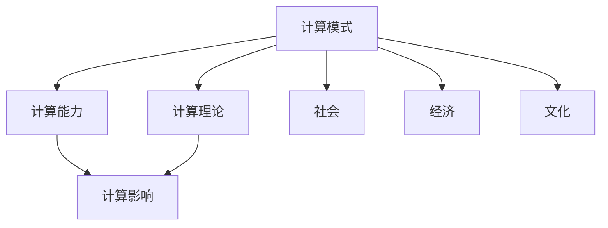

                 

# 塑造未来社会：人类计算的深远意义

> 关键词：人工智能,计算模式,计算理论,计算能力,计算影响,未来社会

## 1. 背景介绍

### 1.1 问题由来
在信息技术飞速发展的今天，计算已成为推动社会进步的关键引擎。从简单的算术计算到复杂的机器学习、深度学习，计算能力不断提升，不断拓展人类探索的边界。然而，随着计算模式的不断演进，我们也需要重新思考计算的深远意义，以及它对未来社会可能产生的影响。

### 1.2 问题核心关键点
本文聚焦于计算模式和计算能力对未来社会的深远影响。我们认为，未来社会将深刻地被计算所塑造，无论是经济、政治、教育还是娱乐，计算都将发挥重要作用。理解计算的原理、发展趋势和潜在影响，对于构建面向未来的技术和社会结构至关重要。

### 1.3 问题研究意义
1. **促进技术进步**：理解计算的理论基础和实际应用，能够为计算机科学及相关领域的学术研究和工业应用提供重要参考。
2. **推动产业创新**：计算能力的提升和应用方式的创新，能够带来全新的产业形态和经济增长点。
3. **改善社会福祉**：计算技术在医疗、教育、交通等领域的应用，能够提升公共服务的效率和质量，改善人类生活质量。
4. **塑造未来文明**：计算模式的演进，可能导致人类社会结构、文化和价值观的重大变化，我们需要思考如何适应这些变化。

## 2. 核心概念与联系

### 2.1 核心概念概述

为更好地理解计算模式对未来社会的影响，本节将介绍几个关键概念：

- **计算模式**：指使用计算机进行数据处理、信息检索、知识发现等任务的方式和策略。常见的计算模式包括批处理、流处理、交互式计算、分布式计算等。
- **计算能力**：指计算机系统处理数据、执行任务的速度和效率，通常由处理器速度、内存大小、存储容量等硬件参数决定。
- **计算理论**：研究如何设计和实现高效、可靠的计算系统，涉及算法、数据结构、复杂性理论等。
- **计算影响**：指计算技术对社会、经济、文化等各方面的影响，如自动化、智能化、民主化等。

这些概念之间的关系可以通过以下Mermaid流程图来展示：



这个流程图展示了计算模式、计算能力、计算理论、计算影响与各个领域（社会、经济、文化）之间的联系。计算模式和计算能力是基础，通过计算理论进行指导，进而影响社会、经济、文化等多个方面。

## 3. 核心算法原理 & 具体操作步骤
### 3.1 算法原理概述

计算模式和计算能力的发展，本质上是计算算法和计算资源的不断进步。为了更好地理解这一过程，我们将从算法原理的角度进行探讨。

计算算法通常分为两类：

1. **并行算法**：通过多个处理器同时处理任务，提高计算速度和效率。如MapReduce、GPU并行计算等。
2. **分布式算法**：将任务分解为多个子任务，分配到多个计算节点上并行处理，如Spark、Hadoop等。

### 3.2 算法步骤详解

以下是计算模式演进的几个关键步骤，以及与之对应的算法：

1. **批处理模式**：
   - **步骤**：数据集中存储，一次性进行处理。
   - **算法**：并行处理算法（如MapReduce），适用于数据量大的批处理任务。

2. **流处理模式**：
   - **步骤**：数据流式输入，实时处理。
   - **算法**：实时流处理算法（如Storm、Flink），适用于需要实时响应的场景。

3. **分布式模式**：
   - **步骤**：任务分解为多个子任务，分布式计算。
   - **算法**：分布式算法（如Spark、Hadoop），适用于大规模、分布式计算任务。

4. **交互式模式**：
   - **步骤**：用户实时输入查询，系统实时返回结果。
   - **算法**：交互式查询算法（如SQL数据库、NoSQL数据库），适用于需要频繁查询的场景。

### 3.3 算法优缺点

计算模式和算法的演进带来了计算能力的显著提升，但也存在一些局限性：

- **优点**：
  1. **效率提升**：并行和分布式算法大幅提高了计算速度和效率。
  2. **任务可扩展性**：分布式算法能够处理大规模、复杂的数据处理任务。
  3. **实时响应**：流处理模式能够提供实时数据处理能力。
  4. **灵活性**：交互式模式能够快速响应用户查询。

- **缺点**：
  1. **资源消耗**：并行和分布式计算需要更多的计算资源和能源。
  2. **复杂性**：分布式算法的设计和维护难度较大。
  3. **数据延迟**：流处理模式存在一定的数据延迟问题。
  4. **用户体验**：交互式模式的响应速度受限于后端计算能力。

### 3.4 算法应用领域

计算模式和算法的演进，在多个领域产生了深远的影响：

1. **大数据处理**：
   - 大数据的处理和分析，如数据仓库、数据挖掘、大数据分析等。

2. **云计算**：
   - 云服务的提供和调度，如云存储、云计算、云安全等。

3. **人工智能**：
   - 机器学习、深度学习、强化学习等算法，推动了人工智能技术的发展。

4. **物联网**：
   - 数据采集、处理和分析，提高了物联网设备的智能化水平。

5. **网络通信**：
   - 网络流量的实时处理和分析，优化网络性能，提升用户体验。

## 4. 数学模型和公式 & 详细讲解 & 举例说明

### 4.1 数学模型构建

计算模式和算法的发展，涉及到大量的数学模型和算法。以下介绍几个关键的数学模型及其构建过程：

1. **MapReduce模型**：
   - **输入**：$<k_1, v_1>, <k_2, v_2>, \ldots, <k_n, v_n>$
   - **中间结果**：$<k_1', v_1>, <k_2', v_2>, \ldots, <k_m', v_m>$
   - **输出**：$\langle k', v' \rangle$

   MapReduce模型的核心思想是将大规模数据集拆分为多个小数据集，并行处理后再合并结果。

2. **GPU并行计算模型**：
   - **输入**：$D = \{d_1, d_2, \ldots, d_n\}$
   - **中间结果**：$D' = \{d_1', d_2', \ldots, d_n'\}$
   - **输出**：$O = f(D')$

   GPU并行计算模型利用图形处理单元（GPU）的并行计算能力，加速大规模计算任务的执行。

### 4.2 公式推导过程

以MapReduce模型为例，其核心思想可以简化为以下步骤：

1. Map阶段：将输入数据集拆分为多个小数据集，每个小数据集在本地进行处理，得到中间结果。
2. Shuffle阶段：将中间结果按照键值对进行排序和分组，并将结果合并。
3. Reduce阶段：对合并后的结果进行聚合，得到最终输出。

MapReduce的数学公式可以表示为：

$$
M = \{(k_1, v_1), (k_2, v_2), \ldots, (k_n, v_n)\}
$$

$$
M' = \{(k_1', v_1'), (k_2', v_2'), \ldots, (k_m', v_m')\}
$$

$$
\langle k', v' \rangle = reduce(k', \{v'_i\}_{i=1}^m)
$$

### 4.3 案例分析与讲解

以下通过一个具体案例来进一步解释MapReduce模型的工作原理：

**案例背景**：假设有一个庞大的日志文件，需要统计每个单词出现的次数。

**Map阶段**：
- 将日志文件中的每个单词作为键值对，统计出现次数。
- 每个单词在本地进行处理，得到中间结果。

**Shuffle阶段**：
- 对中间结果按照键值对进行排序和分组。
- 将相同键值对的中间结果合并。

**Reduce阶段**：
- 对合并后的结果进行聚合，得到每个单词的最终出现次数。

通过MapReduce模型，可以高效地处理大规模数据，并且可以并行计算，显著提高计算效率。

## 5. 项目实践：代码实例和详细解释说明
### 5.1 开发环境搭建

在进行计算模式实践前，我们需要准备好开发环境。以下是使用Python进行MapReduce开发的环境配置流程：

1. 安装Hadoop：从官网下载并安装Hadoop，用于分布式计算。
2. 安装Hive：在Hadoop上安装Hive，用于数据仓库和数据处理。
3. 安装PyHadoop：通过pip安装PyHadoop，用于Python与Hadoop的集成。
4. 安装其他相关工具：如Pyspark、Flink等，用于分布式计算。

### 5.2 源代码详细实现

这里我们以Word Count（单词计数）为例，给出使用MapReduce模型对大数据进行处理的PyHadoop代码实现。

```python
from hadoop.fs import HdfsClient
from hadoop.mapred import Job
from hadoop.mapred.classification import CountingReducer
from hadoop.mapred.fileinput import InputSplit
from hadoop.mapred.text import Tokenizer

# 创建HDFS客户端
fs = HdfsClient('localhost:9000', 'hdfs-user')
input_path = 'hdfs://localhost:9000/user/hadoop/input.txt'

# 创建MapReduce作业
job = Job(fs, input_path, output_path)

# 设置Map函数
class MapFunction:
    def map(self, key, value):
        for token in Tokenizer(value).split():
            yield token, 1

# 设置Reducer函数
class ReduceFunction(CountingReducer):
    def reduce(self, key, values):
        yield key, sum(values)

# 设置作业参数
job.set_input_format(InputSplit)
job.set_map_function(MapFunction())
job.set_reducer(ReduceFunction())

# 提交作业
job.waitForCompletion()
```

### 5.3 代码解读与分析

让我们再详细解读一下关键代码的实现细节：

**PyHadoop的使用**：
- 首先，通过HdfsClient类创建HDFS客户端，指定HDFS的地址。
- 定义输入路径和输出路径，用于指定数据的存储和输出位置。

**Map函数**：
- 在Map函数中，我们定义了单词计数的基本逻辑：
  - 使用Tokenizer类将文本按照空格分割成单词。
  - 对每个单词，输出(key, value)，其中key为单词，value为计数1。

**Reducer函数**：
- 在Reducer函数中，我们使用了CountingReducer类，继承了标准的Reducer基类。
  - 在reduce方法中，我们遍历所有相同的key值，并将对应的value值相加。
  - 最后，将key和sum(values)作为输出。

**作业提交**：
- 使用Job类创建作业，并设置Map和Reducer函数。
- 通过waitForCompletion方法提交作业，并等待作业完成。

通过上述代码，我们可以清晰地看到如何使用MapReduce模型对大数据进行高效处理。

### 5.4 运行结果展示

以下是Word Count任务的示例运行结果：

```
$ hadoop jar wordcount.jar input.txt output.txt
```

运行后，在输出路径下会生成一个文件，包含每个单词的计数。

## 6. 实际应用场景

### 6.1 大数据处理

计算模式在处理大规模数据时具有显著优势，广泛应用于大数据处理领域。以下列举几个典型应用场景：

1. **数据仓库**：
   - 将海量数据存储在分布式文件系统中，使用MapReduce等算法进行数据清洗、聚合和分析。
   - 构建数据仓库，支持决策支持和商业智能（BI）应用。

2. **数据挖掘**：
   - 对大规模数据集进行特征提取、模式识别和关联规则挖掘。
   - 应用机器学习和深度学习算法，提取数据中的潜在知识。

3. **大数据分析**：
   - 使用流处理和实时计算框架，如Storm、Flink，对实时数据进行实时分析和处理。
   - 实现实时监控和预警，如网络流量分析、金融市场监测等。

### 6.2 云计算

计算模式和算法的发展，极大地推动了云计算技术的进步。云计算基于分布式计算和虚拟化技术，能够提供弹性的计算资源，支持大规模的数据处理和存储。

1. **云存储**：
   - 使用分布式文件系统（如HDFS）存储海量数据。
   - 提供高效的数据读写和访问服务。

2. **云计算**：
   - 提供弹性计算资源，支持大规模并行计算和分布式处理。
   - 支持云平台上的各类应用，如机器学习、数据挖掘、深度学习等。

3. **云安全**：
   - 提供安全的计算环境，支持加密存储和传输。
   - 实现实时监控和入侵检测，保障数据安全。

### 6.3 人工智能

计算模式和算法的发展，推动了人工智能技术的突破。以下列举几个典型应用场景：

1. **机器学习**：
   - 使用分布式算法，训练大规模的神经网络模型。
   - 支持深度学习、强化学习等先进算法。

2. **数据可视化**：
   - 使用流处理框架，实时处理和展示大规模数据。
   - 支持数据交互和可视化，提升数据探索能力。

3. **自然语言处理**：
   - 使用分布式算法，处理大规模语料库。
   - 支持文本分析、情感分析、机器翻译等应用。

### 6.4 未来应用展望

随着计算模式和算法的发展，未来计算将展现出更多的应用场景和潜力：

1. **量子计算**：
   - 基于量子力学的原理，提供比传统计算更强大的计算能力。
   - 解决当前计算机无法处理的复杂问题，如大数分解、模拟量子系统等。

2. **边缘计算**：
   - 将计算资源部署在靠近数据源的边缘节点上，实现低延迟、高效率的数据处理。
   - 支持物联网、智能家居等场景，提供实时的计算服务。

3. **区块链计算**：
   - 结合分布式计算和加密技术，提供安全、透明、去中心化的计算环境。
   - 支持智能合约、去中心化应用（DApp）等新兴技术。

## 7. 工具和资源推荐

### 7.1 学习资源推荐

为了帮助开发者系统掌握计算模式和算法的发展，这里推荐一些优质的学习资源：

1. 《分布式系统原理与设计》书籍：详细介绍了分布式计算、数据存储和管理的原理和设计。
2. 《大数据技术导论》书籍：系统介绍了大数据技术的基本概念和应用场景。
3. 《人工智能导论》书籍：介绍了机器学习、深度学习、自然语言处理等基础算法和应用。
4. Coursera《分布式系统》课程：斯坦福大学开设的分布式计算和系统课程，提供丰富的理论和实践内容。
5. edX《大数据分析》课程：哈佛大学和微软共同开设的大数据处理和分析课程，提供实战案例和项目练习。

通过对这些资源的学习实践，相信你一定能够全面掌握计算模式和算法的原理和应用。

### 7.2 开发工具推荐

高效的开发离不开优秀的工具支持。以下是几款用于计算模式开发的常用工具：

1. Hadoop：Apache开发的分布式计算框架，支持大规模数据处理和存储。
2. Spark：基于内存的分布式计算框架，支持流处理和批处理。
3. PySpark：Python语言的Spark API，提供简单易用的接口和开发工具。
4. Flink：基于流处理的数据流计算框架，支持实时数据处理。
5. Storm：实时流处理框架，支持高吞吐量、低延迟的数据处理。
6. Kubernetes：容器编排工具，支持大规模分布式系统的管理和调度。

合理利用这些工具，可以显著提升计算模式和算法的开发效率，加快创新迭代的步伐。

### 7.3 相关论文推荐

计算模式和算法的发展源于学界的持续研究。以下是几篇奠基性的相关论文，推荐阅读：

1. "MapReduce: Simplified Data Processing on Large Clusters"（MapReduce论文）：MapReduce模型的提出，奠定了分布式计算的基础。
2. "Pregel: Pregel图处理系统的原型"（Pregel论文）：Pregel框架的提出，推动了图形处理领域的发展。
3. "Hadoop: The Hadoop Distributed File System"（Hadoop论文）：Hadoop分布式文件系统的提出，支持大规模数据存储和处理。
4. "TensorFlow: A System for Large-Scale Machine Learning"（TensorFlow论文）：TensorFlow框架的提出，支持大规模机器学习和深度学习。
5. "Spark: Cluster Computing with Working Sets"（Spark论文）：Spark框架的提出，支持高效的数据处理和分布式计算。

这些论文代表了大计算模式和算法的演进脉络。通过学习这些前沿成果，可以帮助研究者把握学科前进方向，激发更多的创新灵感。

## 8. 总结：未来发展趋势与挑战

### 8.1 总结

本文对计算模式和计算能力的发展进行了全面系统的介绍。首先阐述了计算模式和算法的演进背景和意义，明确了计算对未来社会的深远影响。其次，从原理到实践，详细讲解了计算模式和算法的数学模型和算法步骤，给出了具体的代码实例和运行结果展示。同时，本文还广泛探讨了计算模式在多个领域的应用前景，展示了计算模式技术的巨大潜力。此外，本文精选了计算模式技术的各类学习资源，力求为开发者提供全方位的技术指引。

通过本文的系统梳理，可以看到，计算模式和算法的演进深刻地改变了数据处理和计算的方式，推动了社会各领域的变革。未来社会将更加依赖计算能力，计算模式的不断演进也将带来更多机遇和挑战。

### 8.2 未来发展趋势

展望未来，计算模式和算法的发展趋势主要集中在以下几个方面：

1. **计算模式的多样化**：
   - 除了传统的批处理、流处理、分布式处理外，未来还将涌现更多新的计算模式，如量子计算、边缘计算、区块链计算等。

2. **计算能力的增强**：
   - 随着硬件设备的不断进步，计算能力将持续提升。未来可能出现量子计算机、光子计算机等更高效的计算设备。

3. **计算理论的创新**：
   - 新理论的提出，如量子计算理论、图计算理论等，将推动计算模式的演进和创新。

4. **计算资源的社会化**：
   - 云计算、边缘计算等技术的发展，将使计算资源更加普及，降低计算成本，提高计算效率。

5. **计算应用的多元化**：
   - 计算技术将渗透到更多领域，如医疗、教育、金融、娱乐等，带来更多应用场景和创新。

### 8.3 面临的挑战

尽管计算模式和算法的发展带来了巨大的机遇，但在迈向更加智能化、普适化应用的过程中，它仍面临着诸多挑战：

1. **资源消耗**：
   - 大规模计算任务需要更多的计算资源和能源，如何降低资源消耗，提高能效比，是未来计算模式需要解决的重要问题。

2. **数据隐私**：
   - 大规模数据处理和存储可能涉及隐私问题，如何保护数据隐私，确保数据安全，是未来计算模式需要关注的重点。

3. **算法复杂性**：
   - 计算算法越来越复杂，如何简化算法设计，提高算法效率，是未来计算模式面临的重要挑战。

4. **计算不确定性**：
   - 未来计算可能面临更多不确定性和不可预测性，如何应对这些不确定性，提升计算系统的鲁棒性，是未来计算模式需要解决的重要问题。

### 8.4 研究展望

面对计算模式和算法的发展挑战，未来的研究需要在以下几个方面寻求新的突破：

1. **计算模式的多模态融合**：
   - 将多种计算模式进行融合，实现多模态数据的协同计算，提升计算系统的综合性能。

2. **计算资源的优化**：
   - 优化计算资源的分配和利用，提高计算系统的效率和稳定性。

3. **计算理论的创新**：
   - 提出新的计算理论，如量子计算理论、图计算理论等，推动计算模式的演进。

4. **计算应用的社会化**：
   - 推动计算技术在更多领域的应用，如医疗、教育、金融等，提升社会各领域的智能化水平。

5. **计算伦理的探讨**：
   - 研究计算伦理问题，如算法公平性、数据隐私等，确保计算技术的健康发展。

这些研究方向的探索，必将引领计算模式和算法迈向更高的台阶，为构建安全、可靠、高效的计算系统铺平道路。面向未来，计算模式和算法还需要与其他技术进行更深入的融合，如人工智能、区块链等，协同发力，共同推动人类社会的进步。

## 9. 附录：常见问题与解答

**Q1：计算模式和算法是如何演进的？**

A: 计算模式的演进经历了从批处理、流处理、分布式处理到量子计算、边缘计算、区块链计算等多个阶段。每种计算模式都有其适用的场景和优势，计算算法也在不断优化和创新。

**Q2：计算模式对未来社会有什么影响？**

A: 计算模式将深刻影响未来社会的各个方面，包括经济、政治、教育、娱乐等。通过高效的数据处理和智能计算，计算模式将提升社会各领域的智能化水平，带来更多机遇和挑战。

**Q3：未来计算模式的趋势是什么？**

A: 未来计算模式将更加多样化、智能化、普适化。计算模式的发展将带来新的计算设备和算法理论，推动社会各领域的智能化进步。

**Q4：计算模式面临的挑战有哪些？**

A: 计算模式面临资源消耗、数据隐私、算法复杂性和计算不确定性等挑战。如何优化计算资源，保护数据隐私，简化算法设计，提升系统鲁棒性，是未来计算模式需要解决的重要问题。

**Q5：如何应对未来计算模式的挑战？**

A: 通过多模态融合、资源优化、理论创新、应用社会化、伦理探讨等方向的研究，应对未来计算模式面临的挑战，推动计算模式的可持续发展。

---

作者：禅与计算机程序设计艺术 / Zen and the Art of Computer Programming

