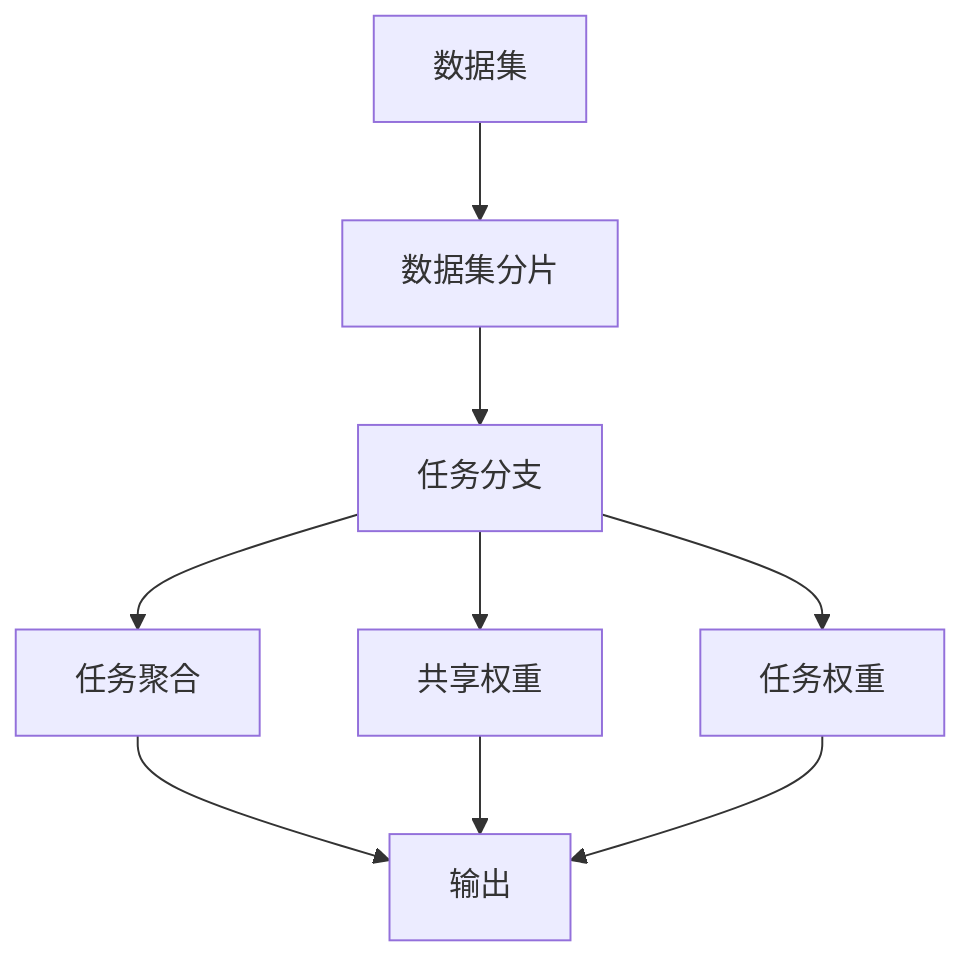

                 

## 1. 背景介绍

在深度学习的浪潮中，复杂的多任务学习（Multi-task Learning, MTL）已成为热门研究领域。它不仅能提升模型对单一任务的预测能力，还能在多个任务之间建立关联，通过知识共享与迁移，提高整体的泛化性能。然而，如何高效地管理多个任务，同时避免冗余训练和过拟合，是MTL中的重要问题。

本文聚焦于一种新颖的深度神经网络架构——多任务深度神经网络（Multi-task Deep Neural Network, MoE），介绍其核心思想、核心算法、操作步骤及应用场景，通过具体的数学模型和代码实例，帮助读者深入理解并掌握MoE的精髓，以期在实际项目中充分发挥其潜力。

## 2. 核心概念与联系

### 2.1 核心概念概述

多任务深度神经网络（MoE）是一种特殊的深度神经网络，旨在管理多个相关任务。其核心思想是：利用不同的网络分支或组件，并行地进行任务训练，从而实现高效的多任务学习。

在MoE中，每个任务对应一个分支，所有分支共享权重，但不同分支的权重调整速度不同。通过这种方式，MoE能够同时处理多个相关任务，避免冗余训练和过拟合。

MoE模型包含以下关键组件：

1. **任务分支（Task Branches）**：每个分支处理一个特定任务，分支之间共享权重。
2. **共享权重（Shared Weight）**：不同分支共享同一份权重矩阵，减小模型参数规模。
3. **任务权重（Task Weight）**：用于调节不同任务在最终预测中的重要性。
4. **任务聚合（Task Aggregation）**：通过某种方式将各个分支的预测结果进行组合，得到最终的多任务预测结果。

### 2.2 核心概念原理和架构的 Mermaid 流程图



该图展示了MoE模型的核心架构：

1. 数据集被分为若干个子集，每个子集对应一个任务。
2. 每个子集通过一个独立的任务分支进行处理。
3. 不同分支共享同一份权重矩阵，减小模型参数规模。
4. 每个任务分支的输出通过任务权重进行加权，得到最终的多任务预测结果。

## 3. 核心算法原理 & 具体操作步骤

### 3.1 算法原理概述

MoE模型的训练分为两个阶段：预训练和微调。预训练阶段主要是利用无标签数据进行任务分支的初始化训练，微调阶段则利用有标签数据进一步优化各个任务分支和任务权重。

在预训练阶段，所有任务分支共享同一份权重矩阵。通过无监督学习任务，如自编码、预训练语言模型等，使得每个任务分支学习到相关的特征表示。

在微调阶段，每个任务分支在各自的任务上进一步训练，并根据标签数据调整任务权重，使得模型能够更好地适应具体任务。

### 3.2 算法步骤详解

**Step 1: 数据预处理**
- 将数据集分为多个子集，每个子集对应一个任务。
- 对每个子集进行标准化处理，使得数据均值为0，方差为1。

**Step 2: 预训练阶段**
- 初始化共享权重矩阵 $W$。
- 利用无监督学习任务对每个任务分支进行预训练。
- 根据预训练任务计算损失函数，更新共享权重矩阵 $W$。

**Step 3: 微调阶段**
- 对每个任务分支在各自的任务上进行有监督训练，计算任务分支的损失函数。
- 计算每个任务分支的权重 $\beta_i$，使得任务分支的预测更接近真实标签。
- 根据任务权重调整每个任务分支的预测，计算最终多任务预测结果的损失函数。
- 更新共享权重矩阵 $W$ 和任务权重 $\beta_i$。

**Step 4: 任务聚合**
- 将各个任务分支的预测结果进行线性加权组合，得到最终的多任务预测结果。

### 3.3 算法优缺点

**优点：**

1. **高效性**：通过共享权重，减小了模型参数规模，同时可以并行训练多个任务分支，提升训练效率。
2. **泛化性能**：在多个任务之间共享知识，提升模型的泛化能力，避免单任务学习的局限性。
3. **适应性**：任务分支可以动态调整，适应不同任务的需求，增强模型的灵活性。

**缺点：**

1. **复杂性**：MoE模型结构复杂，增加了模型的设计难度和训练复杂度。
2. **稳定性**：任务分支之间的参数共享可能导致不稳定，需要谨慎处理。
3. **可解释性**：MoE模型的任务分支和任务权重调整过程缺乏直观解释，增加了理解的难度。

### 3.4 算法应用领域

MoE模型在多任务学习领域有广泛的应用场景，例如：

- 自然语言处理（NLP）：如文本分类、情感分析、机器翻译等。
- 计算机视觉（CV）：如图像分类、目标检测、图像生成等。
- 信号处理：如语音识别、音乐生成等。
- 推荐系统：如用户兴趣预测、商品推荐等。

## 4. 数学模型和公式 & 详细讲解

### 4.1 数学模型构建

MoE模型由以下几个部分构成：

1. 任务分支 $f_i(x;W)$：每个任务分支 $f_i$ 使用共享权重 $W$ 和特定任务数据 $x$。
2. 任务权重 $\beta_i$：用于调节不同任务在最终预测中的重要性。
3. 任务损失函数 $L_i(y_i, \hat{y}_i)$：每个任务 $i$ 的损失函数，其中 $y_i$ 为真实标签，$\hat{y}_i$ 为预测结果。

最终的多任务预测结果 $y$ 可以表示为：

$$
y = \sum_{i=1}^{n} \beta_i f_i(x;W)
$$

其中，$n$ 表示任务的个数。

### 4.2 公式推导过程

以二分类任务为例，进行MoE模型的损失函数推导：

假设任务分支 $f_i(x;W)$ 的预测结果为 $\hat{y}_i$，真实标签为 $y_i$。则任务 $i$ 的损失函数为：

$$
L_i(y_i, \hat{y}_i) = -\log P(y_i|f_i(x;W))
$$

其中 $P(y_i|f_i(x;W))$ 表示预测 $y_i$ 的概率。

对于多个任务，最终的多任务预测结果 $y$ 的概率为：

$$
P(y|x;W) = \prod_{i=1}^{n} P(y_i|f_i(x;W))
$$

多任务预测结果的损失函数为：

$$
\mathcal{L}(y, \hat{y}) = -\log P(y|x;W)
$$

通过最大似然估计，可以计算任务权重 $\beta_i$：

$$
\beta_i = \frac{1}{\sum_{j=1}^{n} p_i^j}
$$

其中 $p_i^j$ 表示任务 $i$ 的预测结果 $\hat{y}_i$ 在任务 $j$ 上的概率。

### 4.3 案例分析与讲解

以图像分类和目标检测为例，分析MoE模型在实际应用中的效果。

**图像分类**：假设模型有3个任务分支，分别处理猫、狗和鸟的分类。在预训练阶段，所有任务分支共享同一份权重 $W$。在微调阶段，每个任务分支在各自的任务上进一步训练，并根据任务权重调整预测结果。

**目标检测**：假设模型有5个任务分支，分别处理不同类别的目标检测。在预训练阶段，所有任务分支共享同一份权重 $W$。在微调阶段，每个任务分支在各自的任务上进一步训练，并根据任务权重调整检测结果。

## 5. 项目实践：代码实例和详细解释说明

### 5.1 开发环境搭建

在进行MoE模型开发前，我们需要准备好开发环境。以下是使用Python进行TensorFlow开发的环境配置流程：

1. 安装Anaconda：从官网下载并安装Anaconda，用于创建独立的Python环境。

2. 创建并激活虚拟环境：
```bash
conda create -n tf-env python=3.8 
conda activate tf-env
```

3. 安装TensorFlow：根据CUDA版本，从官网获取对应的安装命令。例如：
```bash
pip install tensorflow==2.4.1
```

4. 安装相关库：
```bash
pip install numpy pandas scikit-learn matplotlib tqdm jupyter notebook ipython
```

完成上述步骤后，即可在`tf-env`环境中开始MoE模型的开发。

### 5.2 源代码详细实现

下面我们以图像分类为例，给出使用TensorFlow实现MoE模型的代码实现。

首先，定义MoE模型和相关超参数：

```python
import tensorflow as tf
from tensorflow.keras import layers

class MoE(tf.keras.Model):
    def __init__(self, num_tasks, shared_dim):
        super(MoE, self).__init__()
        self.num_tasks = num_tasks
        self.shared_dim = shared_dim
        self.branches = [layers.Dense(shared_dim) for _ in range(num_tasks)]
        self.task_weights = tf.Variable(tf.random.uniform((num_tasks, 1), 0.1, 1.0))

    def call(self, x):
        predictions = []
        for i in range(self.num_tasks):
            x = self.branches[i](x)
            predictions.append(x)
        predictions = tf.concat(predictions, axis=1)
        predictions = self.task_weights * predictions
        return predictions

model = MoE(num_tasks=3, shared_dim=64)
```

然后，定义训练和评估函数：

```python
def train_step(x, y):
    with tf.GradientTape() as tape:
        predictions = model(x)
        loss = tf.reduce_mean(tf.keras.losses.sparse_categorical_crossentropy(y, predictions, from_logits=True))
    grads = tape.gradient(loss, model.trainable_variables)
    optimizer.apply_gradients(zip(grads, model.trainable_variables))
    return loss

def evaluate(x, y):
    predictions = model(x)
    loss = tf.reduce_mean(tf.keras.losses.sparse_categorical_crossentropy(y, predictions, from_logits=True))
    return loss
```

接着，启动训练流程：

```python
batch_size = 32
epochs = 10
train_dataset = ...
dev_dataset = ...

for epoch in range(epochs):
    for batch in train_dataset:
        x, y = batch
        loss = train_step(x, y)
    dev_loss = evaluate(dev_dataset)
    print(f"Epoch {epoch+1}, dev loss: {dev_loss:.3f}")
```

以上就是使用TensorFlow实现MoE模型的完整代码实现。可以看到，MoE模型的结构相对复杂，但其训练和评估过程与其他深度学习模型类似。

### 5.3 代码解读与分析

让我们再详细解读一下关键代码的实现细节：

**MoE类**：
- `__init__`方法：初始化任务分支和任务权重。
- `call`方法：将输入数据通过所有任务分支进行处理，并根据任务权重计算预测结果。

**train_step函数**：
- 使用梯度下降算法更新模型参数。
- 计算多任务预测结果的损失函数。

**evaluate函数**：
- 计算多任务预测结果的损失函数。

**训练流程**：
- 定义总epoch数和批大小，开始循环迭代
- 每个epoch内，对训练集进行训练，输出验证集上的损失

可以看到，TensorFlow提供了丰富的高级API，使得MoE模型的开发变得相对简单。开发者可以将更多精力放在模型的设计和优化上，而不必过多关注底层的实现细节。

当然，实际应用中还需要进一步考虑模型的压缩、优化等工程问题，但核心的MoE模型结构及其训练过程，基本与此类似。

## 6. 实际应用场景

### 6.1 图像分类

MoE模型在图像分类任务中表现优异。以图像分类为例，假设我们有一个包含3类图像（猫、狗、鸟）的数据集。

在预训练阶段，所有任务分支共享同一份权重矩阵 $W$。通过无监督学习任务，如自编码等，使得每个任务分支学习到相关的特征表示。

在微调阶段，每个任务分支在各自的任务上进一步训练，并根据标签数据调整任务权重。通过任务权重，可以调整每个任务分支的预测结果，使得模型更好地适应具体任务。

### 6.2 目标检测

MoE模型在目标检测任务中同样适用。以目标检测为例，假设我们有一个包含5类目标（人、车、树、飞机、鸟）的数据集。

在预训练阶段，所有任务分支共享同一份权重矩阵 $W$。通过无监督学习任务，如自编码等，使得每个任务分支学习到相关的特征表示。

在微调阶段，每个任务分支在各自的任务上进一步训练，并根据标签数据调整任务权重。通过任务权重，可以调整每个任务分支的预测结果，使得模型更好地适应具体任务。

### 6.3 语音识别

MoE模型在语音识别任务中也有广泛应用。以语音识别为例，假设我们有一个包含3个语音识别任务（男声、女声、童声）的数据集。

在预训练阶段，所有任务分支共享同一份权重矩阵 $W$。通过无监督学习任务，如自编码等，使得每个任务分支学习到相关的特征表示。

在微调阶段，每个任务分支在各自的任务上进一步训练，并根据标签数据调整任务权重。通过任务权重，可以调整每个任务分支的预测结果，使得模型更好地适应具体任务。

## 7. 工具和资源推荐

### 7.1 学习资源推荐

为了帮助开发者系统掌握MoE的理论基础和实践技巧，这里推荐一些优质的学习资源：

1. 《深度学习》系列教材：由斯坦福大学教授Andrew Ng撰写的经典教材，深入浅出地介绍了深度学习的基本概念和算法。
2. 《Multi-task Learning for Classification》论文：提出了多任务学习的基本框架，提供了丰富的理论分析和实践案例。
3. 《Towards A New Deep Learning Paradigm: Multi-task Deep Learning》博客：介绍了MoE模型及其在实际项目中的应用。
4. GitHub MoE项目：提供了MoE模型的代码实现和训练教程，帮助开发者快速上手。

通过对这些资源的学习实践，相信你一定能够快速掌握MoE模型的精髓，并用于解决实际的机器学习问题。

### 7.2 开发工具推荐

高效的开发离不开优秀的工具支持。以下是几款用于MoE模型开发的常用工具：

1. TensorFlow：由Google主导开发的深度学习框架，支持高效的分布式训练和模型部署。
2. PyTorch：由Facebook开发的深度学习框架，灵活性和可扩展性高，适合学术研究和工程应用。
3. Keras：基于TensorFlow和Theano的高层API，易于上手，适合快速迭代研究。
4. Weights & Biases：模型训练的实验跟踪工具，可以记录和可视化模型训练过程中的各项指标，方便对比和调优。
5. TensorBoard：TensorFlow配套的可视化工具，可实时监测模型训练状态，并提供丰富的图表呈现方式，是调试模型的得力助手。

合理利用这些工具，可以显著提升MoE模型的开发效率，加快创新迭代的步伐。

### 7.3 相关论文推荐

MoE模型的发展源于学界的持续研究。以下是几篇奠基性的相关论文，推荐阅读：

1. Multi-task Learning using Deep Neural Networks with Shared Weights（即MoE模型的原论文）：提出了多任务深度神经网络，为多任务学习提供了新思路。
2. Learning Multiple Tasks with a Single Model by Sharing Weights（即MoE模型的改进论文）：介绍了多任务深度神经网络的改进方法，进一步提升模型性能。
3. Multi-task Deep Neural Networks for Smartphone Video Analysis（即MoE模型在实际应用中的论文）：展示了MoE模型在视频分析任务中的应用。
4. Multi-task Learning and Transfer Learning with a Single Unified Network（即MoE模型的应用论文）：介绍了多任务深度神经网络在多个领域的应用。

这些论文代表了大模型和多任务学习的发展脉络。通过学习这些前沿成果，可以帮助研究者把握学科前进方向，激发更多的创新灵感。

## 8. 总结：未来发展趋势与挑战

### 8.1 研究成果总结

本文对MoE模型的核心思想、算法原理和操作步骤进行了详细讲解，并通过具体的数学模型和代码实例，帮助读者深入理解并掌握MoE的精髓。通过分析实际应用场景，我们看到了MoE模型在图像分类、目标检测、语音识别等领域的强大应用潜力。

### 8.2 未来发展趋势

展望未来，MoE模型将呈现以下几个发展趋势：

1. **模型规模扩大**：随着计算资源的增加，MoE模型将变得更加庞大，能够管理更多的任务和分支，提升整体性能。
2. **任务分支多样化**：MoE模型将不仅限于处理图像、语音等视觉、听觉任务，还将拓展到处理自然语言、时序数据等更多类型的任务。
3. **任务权重优化**：任务权重是MoE模型的关键组成部分，未来的研究将进一步优化任务权重的计算方法，提高模型性能和稳定性。
4. **多模态融合**：MoE模型将与视觉、听觉、语言等多种模态的特征表示结合，实现更全面、更准确的任务建模。
5. **跨任务迁移**：MoE模型将在多个任务之间进行知识共享和迁移，提高模型的泛化能力和适应性。

### 8.3 面临的挑战

尽管MoE模型已经取得了瞩目成就，但在迈向更加智能化、普适化应用的过程中，它仍面临诸多挑战：

1. **复杂度增加**：MoE模型结构复杂，增加了模型的设计难度和训练复杂度。
2. **稳定性问题**：任务分支之间的参数共享可能导致不稳定，需要谨慎处理。
3. **可解释性不足**：MoE模型的任务分支和任务权重调整过程缺乏直观解释，增加了理解的难度。
4. **数据分布变化**：实际应用中，数据分布可能会发生变化，导致模型性能下降。
5. **计算资源需求高**：MoE模型的训练和推理需要大量的计算资源，对硬件提出了较高的要求。

### 8.4 研究展望

面对MoE模型所面临的种种挑战，未来的研究需要在以下几个方面寻求新的突破：

1. **模型简化**：简化MoE模型的结构，降低计算复杂度，提升训练效率。
2. **任务权重优化**：进一步优化任务权重的计算方法，提高模型性能和稳定性。
3. **多模态融合**：将视觉、听觉、语言等多种模态的特征表示结合，实现更全面、更准确的任务建模。
4. **跨任务迁移**：在多个任务之间进行知识共享和迁移，提高模型的泛化能力和适应性。
5. **可解释性增强**：引入因果分析和博弈论工具，增强MoE模型的可解释性和决策逻辑的透明性。

这些研究方向的探索，必将引领MoE模型迈向更高的台阶，为构建人机协同的智能系统铺平道路。面向未来，MoE模型还需要与其他人工智能技术进行更深入的融合，如知识表示、因果推理、强化学习等，多路径协同发力，共同推动自然语言理解和智能交互系统的进步。只有勇于创新、敢于突破，才能不断拓展MoE模型的边界，让智能技术更好地造福人类社会。

## 9. 附录：常见问题与解答

**Q1：MoE模型是否适用于所有任务？**

A: MoE模型适用于大多数任务，但任务之间需要有一定的相关性。如果任务之间相关性较低，MoE模型的性能提升可能不明显。

**Q2：如何选择合适的任务分支和学习率？**

A: 任务分支的数量需要根据具体任务进行调整。一般建议从简单任务开始，逐步增加任务分支。学习率需要根据任务的复杂度和数据量进行调参。

**Q3：如何避免任务分支之间的参数冲突？**

A: 可以通过任务权重对任务分支进行调整，使得模型更关注重要任务的分支。同时，可以在训练过程中动态调整任务权重，提升模型的稳定性。

**Q4：MoE模型是否需要在大规模数据集上预训练？**

A: 虽然预训练可以帮助MoE模型更好地学习特征表示，但在小规模数据集上也可以通过无监督学习任务进行预训练，提高模型的性能。

**Q5：MoE模型在实际应用中需要注意哪些问题？**

A: 在实际应用中，需要考虑模型的可解释性、鲁棒性和泛化性能。同时，需要合理选择任务分支和学习率，避免过拟合和参数冲突。

---

作者：禅与计算机程序设计艺术 / Zen and the Art of Computer Programming

