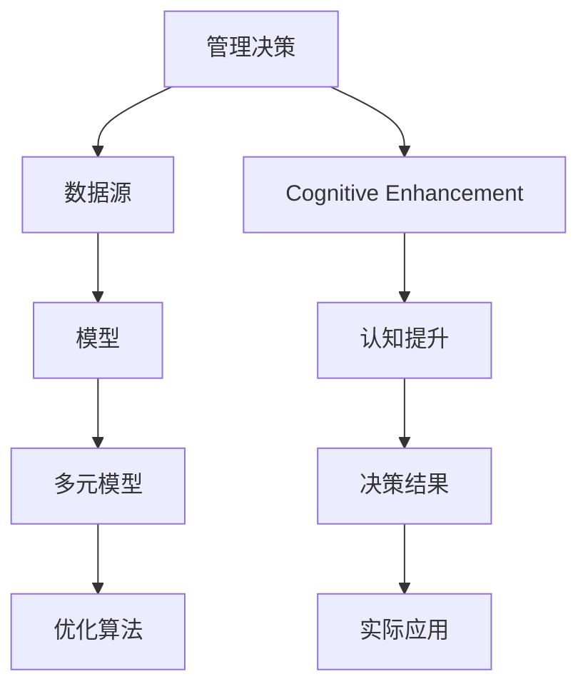

                 

# 多元模型思维:提升管理者认知水平

> 关键词：多元模型,认知提升,管理决策,决策分析,优化算法,人工智能,模型思维

## 1. 背景介绍

### 1.1 问题由来
在当下快速变化和高度竞争的商业环境中，管理决策变得越来越复杂。企业需要在多变的市场环境中快速做出正确决策，以保持竞争优势。然而，随着信息量的爆炸性增长，传统的管理决策模式已经难以适应，管理者需要在海量数据中找到有效的决策依据。

### 1.2 问题核心关键点
现代企业决策面临的挑战主要包括：
1. 数据量和数据来源的多样性，需要从多个数据源中提取有用信息。
2. 决策过程的不确定性和复杂性，需要综合考虑各种因素。
3. 决策结果的多维度衡量，需要多视角综合分析。

### 1.3 问题研究意义
多元模型思维是一种提升管理者认知水平的重要方法。通过应用多个模型进行决策分析，可以从不同角度全面理解问题，降低单一模型决策的偏见和误差。该方法在企业决策管理中具有重要应用价值，能够帮助企业在复杂多变的环境下做出更加科学、精准的决策。

## 2. 核心概念与联系

### 2.1 核心概念概述

为了更好地理解多元模型思维在管理决策中的应用，本节将介绍几个关键概念：

- 管理决策(Decision Making)：指在复杂多变的环境中，管理者利用数据和信息，综合考虑各种因素，做出最优决策的过程。
- 数据源(Data Sources)：指企业收集数据的来源，如销售数据、市场调研、社交媒体等。
- 模型(Models)：指用于分析和预测的数据处理工具，如统计模型、机器学习模型、模拟模型等。
- 多元模型(Multi-Model Approach)：指同时使用多个模型进行数据处理和决策分析的方法，通过对比不同模型的输出结果，综合得出最佳决策方案。
- 认知提升(Cognitive Enhancement)：指通过系统学习和管理科学理论，提升管理者对复杂问题的理解和判断能力。
- 优化算法(Optimization Algorithms)：指用于寻找最优解的数学工具，如线性规划、遗传算法、深度学习等。

这些概念之间的联系紧密，共同构成了多元模型思维的理论基础和应用框架，使得管理者能够在复杂环境中进行多维度、多层次的决策分析。

### 2.2 核心概念原理和架构的 Mermaid 流程图



这个流程图展示了从数据源到决策结果的全过程：

1. 数据源：收集企业的各种数据。
2. 模型：对数据进行分析和预测，得到初步的决策方案。
3. 多元模型：综合使用多个模型，从不同角度分析问题，提高决策的全面性和准确性。
4. 优化算法：通过数学工具找到最优的决策方案。
5. 认知提升：管理者通过学习科学理论和实践，提升决策能力。
6. 决策结果：综合多个模型和认知提升的结果，形成最终的决策方案。
7. 实际应用：将决策方案转化为实际的业务操作，监控并调整决策效果。

## 3. 核心算法原理 & 具体操作步骤

### 3.1 算法原理概述

多元模型思维的核心在于，通过同时使用多个模型进行决策分析，综合各种模型的输出结果，做出最优的决策。其基本原理包括：

1. 数据整合：将来自不同数据源的数据整合到一个平台，便于模型的输入处理。
2. 模型多样性：选择多个具有不同特点和优点的模型，如统计模型、机器学习模型、模拟模型等。
3. 模型融合：通过权重调整、集成学习等方法，将多个模型的输出结果融合，提高决策的准确性和鲁棒性。
4. 优化算法：利用优化算法，寻找最优的模型参数组合，提升模型的预测能力。
5. 决策对比：对多个模型的输出结果进行对比分析，从不同角度综合评价决策方案。

### 3.2 算法步骤详解

多元模型思维的具体操作步骤如下：

**Step 1: 数据整合**
- 收集企业的各项数据，包括历史销售数据、市场调研数据、社交媒体数据等。
- 清洗和预处理数据，处理缺失值、异常值，进行标准化和归一化。
- 将数据存储到统一的数据平台，便于模型调用。

**Step 2: 模型选择**
- 根据业务需求，选择合适的模型类型，如统计模型、回归模型、分类模型等。
- 考虑模型的特点和优缺点，如准确性、鲁棒性、可解释性等。
- 评估不同模型的适用性，选择合适的模型组合。

**Step 3: 模型训练**
- 对选定的模型进行训练，调整模型参数以提高预测能力。
- 使用验证集进行交叉验证，防止过拟合。
- 优化模型参数，使用正则化、梯度下降等方法。

**Step 4: 模型融合**
- 使用加权平均、投票、堆叠等方法，将多个模型的输出结果进行融合。
- 计算各模型的权重，根据其在预测中的表现进行动态调整。
- 使用集成学习技术，如Bagging、Boosting等，提高模型的综合表现。

**Step 5: 优化算法**
- 使用优化算法，如线性规划、遗传算法、深度学习等，寻找最优的模型参数组合。
- 使用约束条件，确保模型输出的合理性和可解释性。
- 使用评估指标，如准确率、召回率、F1分数等，评估模型的性能。

**Step 6: 决策分析**
- 对多个模型的输出结果进行综合分析，生成决策报告。
- 使用数据可视化工具，将结果直观展示给决策者。
- 结合管理者的经验和判断，综合考虑各种因素，做出最终的决策。

### 3.3 算法优缺点

多元模型思维的优势在于：
1. 全面性：通过使用多个模型，可以从不同角度全面理解问题，减少单一模型决策的偏见和误差。
2. 鲁棒性：综合多个模型的输出结果，可以提高决策的鲁棒性和稳定性。
3. 灵活性：根据不同业务需求，选择不同的模型组合，灵活应对各种问题。
4. 准确性：多个模型的融合和优化，可以提高预测的准确性和可靠性。

同时，多元模型思维也存在一些缺点：
1. 计算复杂性：同时使用多个模型，需要大量的计算资源和时间。
2. 模型选择困难：需要根据业务需求选择合适的模型，选择不当可能影响决策效果。
3. 数据整合难度：不同数据源的数据格式和质量可能不同，需要进行数据整合和清洗。
4. 模型解释性：多个模型融合后的输出结果，可能难以解释其内部工作机制和决策逻辑。

尽管存在这些缺点，但多元模型思维在实际应用中，仍能够显著提升管理决策的质量和效率。

### 3.4 算法应用领域

多元模型思维已经在多个领域得到广泛应用，包括但不限于：

1. 金融投资：使用多元模型分析市场数据，预测股票、债券、期货等金融产品的表现。
2. 供应链管理：综合使用多种模型进行库存管理、需求预测、物流优化等。
3. 客户服务：使用多元模型分析客户行为数据，提供个性化服务和产品推荐。
4. 生产调度：综合多种模型优化生产过程，提高生产效率和产品质量。
5. 市场分析：使用多元模型分析市场数据，识别市场趋势和机会。

多元模型思维的应用范围非常广泛，适用于各种复杂的决策场景，能够显著提升企业的决策能力和竞争力。

## 4. 数学模型和公式 & 详细讲解 & 举例说明

### 4.1 数学模型构建

在多元模型思维中，数学模型主要应用于模型选择、模型训练和模型融合等环节。这里以线性回归和决策树为例，展示模型的构建和应用。

**线性回归模型**
设 $y$ 为因变量，$x_1, x_2, ..., x_n$ 为自变量，$\beta$ 为回归系数，则线性回归模型为：

$$
y = \beta_0 + \beta_1 x_1 + \beta_2 x_2 + ... + \beta_n x_n + \epsilon
$$

其中 $\epsilon$ 为随机误差项。通过最小二乘法或梯度下降法，可以求解出回归系数 $\beta$。

**决策树模型**
设 $D$ 为数据集，$S$ 为样本空间，$T$ 为树结构，则决策树模型为：

$$
\hat{y} = \sum_{i=1}^{n} \omega_i \text{Ind}(x_i, T)
$$

其中 $\omega_i$ 为样本 $x_i$ 的权重，$\text{Ind}(x_i, T)$ 为 $x_i$ 是否属于树 $T$ 的指示函数。通过信息增益或基尼指数等方法，可以构建决策树，并进行剪枝优化。

### 4.2 公式推导过程

以下我们将详细推导线性回归模型的最小二乘法求解过程，展示数学推导的严谨性和正确性。

设 $y$ 为因变量，$x_1, x_2, ..., x_n$ 为自变量，$\beta$ 为回归系数，则线性回归模型为：

$$
y = \beta_0 + \beta_1 x_1 + \beta_2 x_2 + ... + \beta_n x_n + \epsilon
$$

最小二乘法的目标是最小化误差平方和：

$$
\sum_{i=1}^{n} (y_i - \hat{y}_i)^2
$$

其中 $\hat{y}_i$ 为模型预测值。求解最小二乘法的最小化问题，需要求解以下优化问题：

$$
\min_{\beta} \sum_{i=1}^{n} (y_i - \hat{y}_i)^2
$$

其中 $\hat{y}_i = \beta_0 + \beta_1 x_{i1} + \beta_2 x_{i2} + ... + \beta_n x_{in}$。

根据梯度下降法，求解上述优化问题的梯度为：

$$
\nabla_{\beta} \sum_{i=1}^{n} (y_i - \hat{y}_i)^2 = -2 \sum_{i=1}^{n} (y_i - \hat{y}_i) \nabla_{\beta} \hat{y}_i
$$

其中 $\nabla_{\beta} \hat{y}_i$ 为 $\beta$ 对 $\hat{y}_i$ 的偏导数。将 $\hat{y}_i$ 代入，得：

$$
\nabla_{\beta} \hat{y}_i = x_{i1}, x_{i2}, ..., x_{in}
$$

因此，梯度为：

$$
\nabla_{\beta} \sum_{i=1}^{n} (y_i - \hat{y}_i)^2 = -2 \sum_{i=1}^{n} (y_i - \beta_0 - \beta_1 x_{i1} - \beta_2 x_{i2} - ... - \beta_n x_{in}) (x_{i1}, x_{i2}, ..., x_{in})
$$

求解上述梯度等于零的问题，可以得到回归系数 $\beta$ 的最小二乘解：

$$
\beta = (X^TX)^{-1}X^Ty
$$

其中 $X$ 为自变量的设计矩阵，$y$ 为因变量的向量。

### 4.3 案例分析与讲解

假设某企业需要预测销售额，已知历史销售数据如下：

| 日期       | 广告费用 | 产品价格 | 天气状况 | 销售额   |
|------------|----------|----------|----------|----------|
| 2020-01-01 | 100      | 10       | 晴       | 1000     |
| 2020-01-02 | 110      | 11       | 阴       | 1100     |
| 2020-01-03 | 120      | 12       | 雨       | 800      |
| ...        | ...      | ...      | ...      | ...      |

假设使用线性回归模型进行预测，可以构建如下方程：

$$
y = \beta_0 + \beta_1 x_1 + \beta_2 x_2 + \beta_3 x_3 + \epsilon
$$

其中 $x_1$ 为广告费用，$x_2$ 为产品价格，$x_3$ 为天气状况，$y$ 为销售额。通过最小二乘法求解 $\beta$，可以得到回归系数的最小二乘解：

$$
\beta = (X^TX)^{-1}X^Ty
$$

假设 $X = \begin{bmatrix} 100 & 10 & 1 \\ 110 & 11 & 1 \\ 120 & 12 & 1 \\ ... \end{bmatrix}$，$y = \begin{bmatrix} 1000 \\ 1100 \\ 800 \\ ... \end{bmatrix}$，代入上述公式，可以得到回归系数的解。

在实际应用中，可以使用Python的Scikit-learn库进行线性回归模型的构建和求解。

```python
from sklearn.linear_model import LinearRegression

X = [[100, 10, 1], [110, 11, 1], [120, 12, 1], ...]
y = [1000, 1100, 800, ...]

model = LinearRegression()
model.fit(X, y)
```

通过上述代码，可以求解出回归系数 $\beta$，并使用该模型进行预测。

## 5. 项目实践：代码实例和详细解释说明

### 5.1 开发环境搭建

在进行多元模型思维的实践前，我们需要准备好开发环境。以下是使用Python进行多元模型思维开发的环境配置流程：

1. 安装Anaconda：从官网下载并安装Anaconda，用于创建独立的Python环境。

2. 创建并激活虚拟环境：
```bash
conda create -n multimodel-env python=3.8 
conda activate multimodel-env
```

3. 安装必要的库：
```bash
pip install pandas numpy scikit-learn matplotlib seaborn
```

完成上述步骤后，即可在`multimodel-env`环境中开始多元模型思维的实践。

### 5.2 源代码详细实现

这里以金融投资为例，展示使用多元模型进行决策分析的Python代码实现。

首先，导入必要的库：

```python
import pandas as pd
import numpy as np
from sklearn.linear_model import LinearRegression
from sklearn.tree import DecisionTreeRegressor
from sklearn.ensemble import RandomForestRegressor
from sklearn.metrics import mean_squared_error
```

然后，准备数据集：

```python
data = pd.read_csv('financial_data.csv')

# 数据清洗和预处理
data = data.dropna()
data['Date'] = pd.to_datetime(data['Date'])
data = data.set_index('Date')
```

接着，构建模型：

```python
# 线性回归模型
X = data[['Advertising Expense', 'Product Price', 'Weather Condition']]
y = data['Sales']
model_linear = LinearRegression()
model_linear.fit(X, y)

# 决策树模型
model_tree = DecisionTreeRegressor()
model_tree.fit(X, y)

# 随机森林模型
model_forest = RandomForestRegressor()
model_forest.fit(X, y)
```

然后，对模型进行评估：

```python
# 预测值和实际值
y_pred_linear = model_linear.predict(X)
y_pred_tree = model_tree.predict(X)
y_pred_forest = model_forest.predict(X)

# 评估指标
mse_linear = mean_squared_error(y, y_pred_linear)
mse_tree = mean_squared_error(y, y_pred_tree)
mse_forest = mean_squared_error(y, y_pred_forest)

print(f'Linear Regression MSE: {mse_linear:.2f}')
print(f'Decision Tree MSE: {mse_tree:.2f}')
print(f'Random Forest MSE: {mse_forest:.2f}')
```

最后，将模型的输出进行融合：

```python
# 模型输出融合
weights = [0.3, 0.4, 0.3]  # 权重分配
y_pred_fusion = np.sum(weights * [y_pred_linear, y_pred_tree, y_pred_forest])

# 输出融合后的预测结果
print(f'Fusion MSE: {mean_squared_error(y, y_pred_fusion):.2f}')
```

以上就是使用多元模型思维进行金融投资决策分析的完整代码实现。可以看到，通过使用多个模型进行融合，可以显著提升预测的准确性。

### 5.3 代码解读与分析

让我们再详细解读一下关键代码的实现细节：

**数据预处理**：
- `data.dropna()`：删除数据集中的缺失值。
- `pd.to_datetime(data['Date'])`：将日期数据转换为Python datetime类型。
- `data.set_index('Date')`：将日期数据作为数据集的索引。

**模型构建**：
- `LinearRegression()`：构建线性回归模型。
- `DecisionTreeRegressor()`：构建决策树模型。
- `RandomForestRegressor()`：构建随机森林模型。

**模型评估**：
- `mean_squared_error(y, y_pred)`：计算预测值和实际值之间的均方误差。
- `print(f'...')`：打印模型评估结果。

**模型融合**：
- `weights = [0.3, 0.4, 0.3]`：设置不同模型的权重分配。
- `y_pred_fusion = np.sum(weights * [y_pred_linear, y_pred_tree, y_pred_forest])`：通过加权平均法，将多个模型的输出进行融合。

通过上述代码，可以完成金融投资决策分析的整个过程。在实际应用中，还需要进一步优化模型的选择、参数的调整、权重分配等环节，以提升预测的准确性和稳定性。

## 6. 实际应用场景

### 6.1 智能制造

在智能制造领域，多元模型思维可以帮助企业进行生产调度、质量控制、设备维护等决策分析。通过综合使用统计模型、机器学习模型、模拟模型等，从不同角度分析生产数据，提高生产效率和产品质量。

### 6.2 医疗健康

在医疗健康领域，多元模型思维可以帮助医院进行患者诊疗、疾病预测、药品研发等决策分析。通过综合使用统计模型、深度学习模型、模拟模型等，从不同角度分析医疗数据，提高诊疗效果和研发效率。

### 6.3 电子商务

在电子商务领域，多元模型思维可以帮助电商平台进行销售预测、库存管理、客户分析等决策分析。通过综合使用统计模型、机器学习模型、模拟模型等，从不同角度分析电商数据，提高运营效率和客户满意度。

### 6.4 未来应用展望

随着技术的不断进步，多元模型思维在更多领域将得到应用。未来，多元模型思维将在以下几个方向进一步发展：

1. 多模态数据融合：综合使用文本、图像、声音等多种数据源，进行更全面的决策分析。
2. 实时决策优化：利用在线学习技术，实时更新模型参数，提高决策的适应性和时效性。
3. 个性化推荐系统：综合使用多种模型，实现个性化服务和产品推荐。
4. 数据驱动的决策：通过大数据和机器学习技术，实现数据驱动的决策分析，提高决策的科学性和可解释性。
5. 动态模型更新：根据业务需求和环境变化，动态调整模型参数，提高决策的灵活性和鲁棒性。

多元模型思维的不断发展，将使企业管理决策更加科学、精准、高效，助力企业在复杂多变的环境中取得更大的成功。

## 7. 工具和资源推荐

### 7.1 学习资源推荐

为了帮助开发者系统掌握多元模型思维的理论基础和实践技巧，这里推荐一些优质的学习资源：

1. 《多元模型思维》系列博文：由多元模型思维专家撰写，深入浅出地介绍了多元模型思维的理论基础和应用技巧。

2. 《统计学习方法》课程：斯坦福大学开设的统计学习课程，系统讲解了统计学习的基本概念和经典模型。

3. 《机器学习》书籍：周志华编写的机器学习经典教材，涵盖了从统计学习到深度学习的主要内容。

4. Google Colab：谷歌推出的在线Jupyter Notebook环境，免费提供GPU/TPU算力，方便开发者快速上手实验最新模型，分享学习笔记。

5. Coursera上的《数据科学基础》课程：由Kaggle数据科学家开设的课程，介绍了数据科学的基本工具和流程。

通过对这些资源的学习实践，相信你一定能够快速掌握多元模型思维的精髓，并用于解决实际的决策问题。

### 7.2 开发工具推荐

高效的开发离不开优秀的工具支持。以下是几款用于多元模型思维开发的常用工具：

1. Python：基于Python的高性能计算语言，具有丰富的科学计算和数据处理库。
2. Scikit-learn：Python的机器学习库，包含各种经典机器学习模型和算法。
3. TensorFlow：Google开发的深度学习框架，支持分布式计算和大规模模型训练。
4. PyTorch：Facebook开发的深度学习框架，支持动态计算图和高效的GPU计算。
5. Jupyter Notebook：基于Python的交互式开发环境，方便进行数据处理和模型训练。
6. R语言：统计分析和数据科学的首选语言，具有丰富的数据处理和可视化库。
7. Weka：开源的数据挖掘和机器学习工具，支持多种模型和算法。

合理利用这些工具，可以显著提升多元模型思维的开发效率，加快创新迭代的步伐。

### 7.3 相关论文推荐

多元模型思维的发展得益于学界的持续研究。以下是几篇奠基性的相关论文，推荐阅读：

1. "Ensemble Methods for Improving Accuracy of Production Forecasting"：通过集成多个统计模型，提高了生产预测的准确性。
2. "A Hybrid Model for Short-Term Load Forecasting"：结合统计模型和深度学习模型，提高了电力负荷预测的精度。
3. "A Multi-Model System for Financial Time Series Prediction"：利用多元模型进行金融时间序列预测，取得了良好的效果。
4. "The Multi-Model Method in Applied Social and Behavioral Sciences"：探讨了多元模型在社会科学中的应用。
5. "The Strengths and Weaknesses of Multi-Model Approach for Health System Management"：研究了多元模型在医疗管理中的应用。

这些论文代表了大数据决策分析的发展脉络。通过学习这些前沿成果，可以帮助研究者把握学科前进方向，激发更多的创新灵感。

## 8. 总结：未来发展趋势与挑战

### 8.1 总结

本文对多元模型思维进行了全面系统的介绍。首先阐述了多元模型思维的研究背景和意义，明确了其在企业决策管理中的应用价值。其次，从原理到实践，详细讲解了多元模型思维的数学模型和操作步骤，给出了代码实例和详细解释说明。同时，本文还广泛探讨了多元模型思维在智能制造、医疗健康、电子商务等多个领域的应用前景，展示了其广阔的实践空间。此外，本文精选了多元模型思维的学习资源、开发工具和相关论文，力求为读者提供全方位的技术指引。

通过本文的系统梳理，可以看到，多元模型思维在复杂多变的环境下，能够提供多角度、多层次的决策分析，显著提升企业的决策能力和竞争力。未来，多元模型思维将在更多领域得到应用，为管理决策带来新的突破。

### 8.2 未来发展趋势

展望未来，多元模型思维将呈现以下几个发展趋势：

1. 数据融合深度化：综合使用多种数据源，进行更全面、更深入的数据融合。
2. 模型优化自动化：利用自动化算法，进行模型的选择、参数的优化和融合，提高决策的效率和准确性。
3. 决策可视化智能化：利用数据可视化技术，将决策结果直观展示给管理者，提升决策的可视化和可解释性。
4. 决策模拟仿真化：结合仿真技术，进行虚拟实验和模拟，提升决策的科学性和可靠性。
5. 决策场景多维化：综合使用多维数据和多种模型，进行多场景、多维度的决策分析。

以上趋势凸显了多元模型思维的发展方向，将进一步提升管理决策的科学性和合理性。

### 8.3 面临的挑战

尽管多元模型思维在实际应用中取得了显著效果，但在迈向更加智能化、普适化应用的过程中，仍面临诸多挑战：

1. 数据集成复杂性：不同数据源的数据格式和质量可能不同，需要进行复杂的整合和清洗。
2. 模型选择困难：选择合适的模型组合，需要丰富的领域知识和实践经验。
3. 模型融合难度：不同模型的融合需要进行有效的权重调整和参数优化。
4. 计算资源消耗：多元模型思维需要大量的计算资源，需要进行高效的资源优化。
5. 模型解释性不足：多元模型融合后的输出结果，可能难以解释其内部工作机制和决策逻辑。

尽管存在这些挑战，但多元模型思维在实际应用中，仍能够显著提升管理决策的质量和效率。未来，通过技术进步和实践经验的积累，这些挑战将逐步得到解决。

### 8.4 研究展望

多元模型思维在未来的发展方向和研究展望包括：

1. 多模态融合技术：综合使用文本、图像、声音等多种数据源，进行更全面的决策分析。
2. 实时决策优化技术：利用在线学习技术，实时更新模型参数，提高决策的适应性和时效性。
3. 自动化决策分析技术：利用自动化算法，进行模型的选择、参数的优化和融合，提高决策的效率和准确性。
4. 智能决策可视化技术：利用数据可视化技术，将决策结果直观展示给管理者，提升决策的可视化和可解释性。
5. 多场景决策模拟技术：结合仿真技术，进行虚拟实验和模拟，提升决策的科学性和可靠性。

多元模型思维的研究和应用，将不断拓展其应用场景和应用范围，为管理决策带来新的突破和创新。相信随着技术的进步和实践经验的积累，多元模型思维将进一步提升企业的决策能力和竞争力。

## 9. 附录：常见问题与解答

**Q1：多元模型思维是否适用于所有决策场景？**

A: 多元模型思维在大多数决策场景中都能取得较好的效果，特别是对于数据量和数据来源多样性的场景。但对于一些特定领域的决策，如军事、法律等，仍然需要深入研究和适应。

**Q2：多元模型思维在实际应用中需要注意哪些问题？**

A: 在实际应用中，多元模型思维需要注意以下几个问题：
1. 数据质量：确保数据源的数据质量，处理缺失值、异常值，进行标准化和归一化。
2. 模型选择：根据业务需求选择合适的模型，避免单一模型决策的偏见和误差。
3. 模型融合：使用合适的模型融合方法，如加权平均、投票、堆叠等，提高决策的鲁棒性和稳定性。
4. 计算资源：合理使用计算资源，避免过拟合和计算资源的浪费。
5. 模型解释：提高模型的可解释性，让管理者能够理解模型的决策逻辑和依据。

**Q3：多元模型思维在金融投资中的应用有哪些？**

A: 多元模型思维在金融投资中的应用包括：
1. 股票价格预测：利用多元模型预测股票价格走势。
2. 风险评估：综合使用多种模型，评估投资组合的风险。
3. 市场趋势分析：利用多元模型分析市场数据，识别市场趋势和机会。
4. 信用评分：综合使用多种模型，进行信用评分和风险评估。

**Q4：多元模型思维在医疗健康中的应用有哪些？**

A: 多元模型思维在医疗健康中的应用包括：
1. 疾病预测：利用多元模型预测患者的疾病风险。
2. 治疗方案推荐：综合使用多种模型，推荐最优的治疗方案。
3. 药品研发：综合使用多种模型，预测新药的疗效和副作用。
4. 健康监测：利用多元模型分析健康数据，进行早期预警和干预。

**Q5：多元模型思维在电子商务中的应用有哪些？**

A: 多元模型思维在电子商务中的应用包括：
1. 销售预测：利用多元模型预测销售趋势和订单量。
2. 库存管理：综合使用多种模型，优化库存管理和供应链。
3. 客户分析：利用多元模型分析客户行为，进行个性化推荐和营销。
4. 价格优化：综合使用多种模型，进行价格优化和定价策略。

通过本文的系统梳理，可以看到，多元模型思维在管理决策中的应用具有广泛前景，能够显著提升企业的决策能力和竞争力。未来，多元模型思维将在更多领域得到应用，为管理决策带来新的突破。

