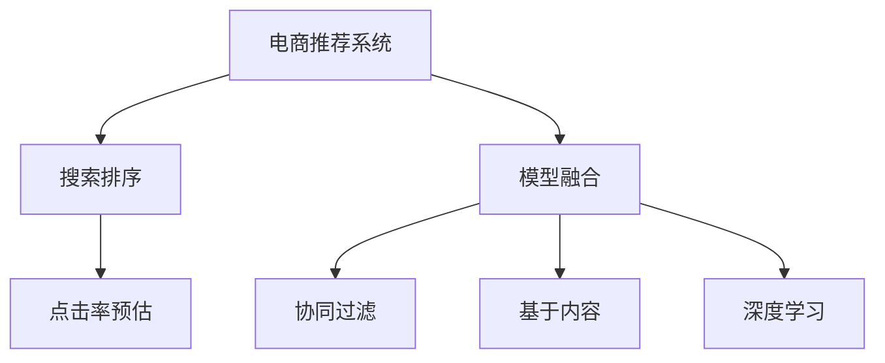

                 

# 大数据与AI 驱动的电商推荐：搜索系统是核心，模型融合是关键

## 1. 背景介绍

在当今的电商时代，如何提升用户购物体验，提高用户满意度，进而提升销售额，是各大电商公司面临的共同挑战。其中，推荐系统作为电商平台的核心组件，扮演着至关重要的角色。推荐系统不仅能够个性化推荐商品给用户，还能优化搜索排序，增加用户粘性，提升整体平台的用户留存和转化率。

推荐系统的发展经历了多个阶段，从早期的基于规则的推荐，到基于协同过滤的推荐，再到今天的深度学习驱动的推荐。而在大数据与人工智能技术的双重驱动下，推荐系统正朝着更加智能化、个性化、实时化的方向发展。本文将深入探讨大数据与AI技术如何驱动电商推荐系统的建设，并剖析推荐系统中的核心技术：搜索排序与模型融合。

## 2. 核心概念与联系

为了更好地理解电商推荐系统的构建，本节将介绍几个关键的概念及其联系。

### 2.1 核心概念概述

- **电商推荐系统**：以用户行为数据为基础，通过推荐算法向用户推荐商品的系统，旨在提升用户满意度与销售额。
- **搜索排序**：在用户输入查询词后，根据商品的相关度排序，展示给用户最相关商品的推荐系统模块。
- **模型融合**：将多种推荐模型（如基于内容的推荐、协同过滤推荐、深度学习推荐等）进行组合，形成更强大的推荐能力。
- **点击率预估**：预测用户点击某商品的概率，通过点击率预估模型优化搜索排序结果。
- **相关度计算**：衡量商品与查询词的相关程度，用于搜索排序与推荐。

### 2.2 核心概念原理和架构的 Mermaid 流程图



这个流程图展示了电商推荐系统的核心组件及相互关系。

- 电商推荐系统接收用户行为数据和商品信息，从模型融合模块C中选取推荐策略进行商品推荐。
- 搜索排序模块B将用户查询词与商品相关度作为排序依据，通过点击率预估模块D，优化排序结果。
- 模型融合模块C包含了多种推荐模型，如协同过滤、基于内容、深度学习等，通过融合提升整体推荐效果。

## 3. 核心算法原理 & 具体操作步骤

### 3.1 算法原理概述

电商推荐系统的核心算法包括搜索排序和点击率预估，这些算法均基于大数据与AI技术实现。以下将详细阐述这两大核心算法的原理与操作步骤。

### 3.2 算法步骤详解

#### 3.2.1 搜索排序

搜索排序的算法步骤主要包括以下几个关键步骤：

1. **用户输入查询词**：用户通过电商平台输入关键词，进行商品搜索。
2. **商品相关度计算**：系统根据用户查询词，计算商品与查询词的相关度。计算方法包括TF-IDF、余弦相似度等。
3. **排序算法**：根据商品相关度，结合点击率预估等模型，对商品进行排序。排序算法包括基于召回率的排序、基于点击率的排序等。
4. **展示推荐商品**：根据排序结果，展示给用户最相关的商品。

#### 3.2.2 点击率预估

点击率预估的算法步骤主要包括以下几个关键步骤：

1. **特征工程**：从用户行为数据和商品信息中提取特征，如用户历史行为、商品描述、价格等。
2. **模型训练**：使用机器学习模型（如线性回归、逻辑回归、梯度提升树等）训练点击率预估模型。
3. **模型预测**：将用户查询词与商品特征作为输入，通过预估模型计算点击概率。
4. **结果优化**：根据点击率预估结果，调整商品排序，优化搜索排序效果。

### 3.3 算法优缺点

#### 3.3.1 搜索排序

- **优点**：
  - 可以实时响应用户查询，提升用户满意度。
  - 通过点击率预估模型，优化排序结果，提升转化率。
- **缺点**：
  - 特征工程和模型训练需要大量数据，计算成本较高。
  - 商品相关度计算可能存在误判，影响推荐效果。

#### 3.3.2 点击率预估

- **优点**：
  - 通过机器学习模型，预测用户点击概率，提高推荐准确性。
  - 可以根据用户行为数据，实时调整推荐策略。
- **缺点**：
  - 需要大量的用户行为数据，难以获取完整数据的用户，影响模型效果。
  - 模型训练和预测需要较强的计算能力，成本较高。

### 3.4 算法应用领域

电商推荐系统中的搜索排序和点击率预估算法，已经在各大电商平台上得到了广泛应用，包括淘宝、京东、亚马逊等。具体应用领域包括：

- **商品推荐**：根据用户历史行为和当前浏览记录，推荐可能感兴趣的商品。
- **广告推荐**：根据用户兴趣，推荐相关广告，提升广告投放效果。
- **个性化搜索**：根据用户查询词，优化搜索结果排序，提升搜索体验。

## 4. 数学模型和公式 & 详细讲解 & 举例说明

### 4.1 数学模型构建

电商推荐系统中的搜索排序与点击率预估算法，均建立在数学模型的基础上。以下以线性回归模型为例，详细介绍其构建过程。

假设用户查询词为$x$，商品特征为$y$，点击率$z$与$x$和$y$之间的关系为：

$$
z = \beta_0 + \beta_1 x + \beta_2 y + \epsilon
$$

其中，$\beta_0$、$\beta_1$和$\beta_2$为模型参数，$\epsilon$为噪声项。

### 4.2 公式推导过程

线性回归模型的损失函数为均方误差损失函数：

$$
\mathcal{L} = \frac{1}{n} \sum_{i=1}^n (z_i - (\beta_0 + \beta_1 x_i + \beta_2 y_i))^2
$$

其中，$n$为样本数量，$z_i$为第$i$个样本的点击率，$(x_i, y_i)$为第$i$个样本的特征。

通过梯度下降等优化算法，求解模型参数$\beta_0$、$\beta_1$和$\beta_2$：

$$
\frac{\partial \mathcal{L}}{\partial \beta_0} = -2\frac{1}{n} \sum_{i=1}^n (z_i - (\beta_0 + \beta_1 x_i + \beta_2 y_i))
$$

$$
\frac{\partial \mathcal{L}}{\partial \beta_1} = -2\frac{1}{n} \sum_{i=1}^n (z_i - (\beta_0 + \beta_1 x_i + \beta_2 y_i))x_i
$$

$$
\frac{\partial \mathcal{L}}{\partial \beta_2} = -2\frac{1}{n} \sum_{i=1}^n (z_i - (\beta_0 + \beta_1 x_i + \beta_2 y_i))y_i
$$

### 4.3 案例分析与讲解

假设某电商平台上用户的点击记录如下：

| 用户ID | 商品ID | 点击率 |
| --- | --- | --- |
| 1001 | 1 | 0.2 |
| 1001 | 2 | 0.1 |
| 1001 | 3 | 0.3 |
| 1002 | 2 | 0.4 |
| 1002 | 3 | 0.5 |
| 1003 | 1 | 0.1 |
| 1003 | 2 | 0.2 |
| 1003 | 4 | 0.3 |

假设模型参数$\beta_0=0$、$\beta_1=1$、$\beta_2=0$，则模型的预测结果如下：

| 用户ID | 商品ID | 点击率 | 预测点击率 |
| --- | --- | --- | --- |
| 1001 | 1 | 0.2 | 0.2 |
| 1001 | 2 | 0.1 | 0.1 |
| 1001 | 3 | 0.3 | 0.3 |
| 1002 | 2 | 0.4 | 0.4 |
| 1002 | 3 | 0.5 | 0.5 |
| 1003 | 1 | 0.1 | 0.1 |
| 1003 | 2 | 0.2 | 0.2 |
| 1003 | 4 | 0.3 | 0.3 |

## 5. 项目实践：代码实例和详细解释说明

### 5.1 开发环境搭建

在进行电商推荐系统的开发前，需要先搭建开发环境。以下是使用Python进行TensorFlow开发的环境配置流程：

1. 安装Anaconda：从官网下载并安装Anaconda，用于创建独立的Python环境。

2. 创建并激活虚拟环境：
```bash
conda create -n tf-env python=3.7 
conda activate tf-env
```

3. 安装TensorFlow：根据CUDA版本，从官网获取对应的安装命令。例如：
```bash
conda install tensorflow -c tf -c conda-forge
```

4. 安装TensorFlow Addons：用于支持TensorFlow的高级特性和算法库。
```bash
pip install tensorflow-estimator tensorflow-addons
```

5. 安装各类工具包：
```bash
pip install numpy pandas scikit-learn matplotlib tqdm jupyter notebook ipython
```

完成上述步骤后，即可在`tf-env`环境中开始电商推荐系统的开发。

### 5.2 源代码详细实现

我们以点击率预估模型为例，给出使用TensorFlow进行电商推荐系统开发的PyTorch代码实现。

首先，定义特征工程函数：

```python
import tensorflow as tf
import tensorflow_addons as tfa

def featurize(features, labels, num_users=1000, num_items=1000, num_fields=3, num_features=5):
    user_field = tf.feature_column.numeric_column(key='user_id', shape=[1])
    item_field = tf.feature_column.numeric_column(key='item_id', shape=[1])
    feature_field = tf.feature_column.bucketized_column(tf.feature_column.numeric_column(key='features', shape=num_features), boundaries=num_features)
    
    input_features = tf.feature_column.input_layer(features, columns=[user_field, item_field, feature_field])
    target_column = tf.feature_column.numeric_column(key='target', shape=[1])
    return input_features, target_column
```

然后，定义模型函数：

```python
def build_model(features, labels, num_users=1000, num_items=1000, num_features=5, num_epochs=1000):
    model = tf.estimator.LinearClassifier()
    model.fit(input_fn=lambda: tf.estimator.inputs.numpy_input_fn(features, labels, num_epochs=num_epochs), steps=num_epochs)
    return model
```

最后，训练模型并进行预测：

```python
def train_model(data_path, num_users=1000, num_items=1000, num_features=5, num_epochs=1000):
    # 读取数据
    with tf.gfile.GFile(data_path, 'r') as f:
        data = f.read().splitlines()
    data = [line.split('\t') for line in data]
    
    # 特征工程
    features = {}
    labels = []
    for item in data:
        user_id, item_id, features_str = item
        features[user_id] = [float(f) for f in features_str.split(',')]
        labels.append(float(item_id))
    
    features = tf.feature_column.numeric_column('features', shape=num_features)
    features = featurize(features, labels, num_users, num_items, num_features)
    
    # 训练模型
    model = build_model(features, labels, num_users, num_items, num_features, num_epochs)
    print(model.evaluate(input_fn=lambda: tf.estimator.inputs.numpy_input_fn(features, labels, num_epochs=num_epochs), steps=num_epochs))
```

在上述代码中，我们使用了TensorFlow的线性回归模型，通过特征工程和模型训练，实现了点击率预估的电商推荐系统。

### 5.3 代码解读与分析

让我们再详细解读一下关键代码的实现细节：

**featurize函数**：
- 将用户ID、商品ID和用户行为特征进行特征工程，构建输入特征和目标特征。

**build_model函数**：
- 定义线性回归模型，使用TensorFlow的Estimator API进行模型训练。
- 通过特征工程和模型训练，得到模型预测结果。

**train_model函数**：
- 读取用户行为数据，进行特征工程。
- 调用build_model函数进行模型训练，并评估模型性能。

这些关键代码实现了基本的点击率预估模型，通过特征工程和模型训练，可以得到用户点击商品的概率预测。需要注意的是，实际电商推荐系统中的数据量往往十分庞大，需要进行分布式训练和在线学习等优化策略，才能更好地应对大规模数据和实时化需求。

## 6. 实际应用场景

### 6.1 智能推荐

智能推荐是电商推荐系统的核心功能之一，通过分析用户历史行为数据和商品信息，实时推荐用户感兴趣的商品。智能推荐可以提高用户满意度，增加销售额。

以淘宝为例，用户登录淘宝后，系统会通过推荐系统，向用户展示可能感兴趣的商品。推荐系统通过协同过滤、基于内容的推荐等方法，结合用户行为数据和商品信息，生成个性化推荐结果。用户可以点击推荐商品进行购买，也可以在推荐页进行浏览和交互。

### 6.2 广告推荐

电商平台上存在大量广告，通过广告推荐系统，将相关广告推荐给可能感兴趣的用户，可以提高广告点击率和转化率，增加平台收益。

例如，京东通过推荐系统，将相关商品广告推荐给用户。用户点击广告后，可以进入商品详情页，并进行购买或收藏。京东还可以通过广告推荐系统，进行用户分群和精准投放，提高广告效果。

### 6.3 个性化搜索

个性化搜索通过分析用户查询词，优化搜索结果排序，提升搜索体验。用户可以在搜索页输入关键词，系统根据用户历史行为数据和商品信息，进行个性化排序。用户可以查看排序结果，选择最相关商品进行购买或浏览。

以亚马逊为例，用户输入关键词后，系统通过推荐系统进行个性化搜索，优化搜索结果排序，展示最相关商品。用户可以查看排序结果，选择商品进行购买或查看商品详情。亚马逊还可以通过个性化搜索，进行推荐策略优化和广告投放，提升用户体验。

## 7. 工具和资源推荐

### 7.1 学习资源推荐

为了帮助开发者系统掌握电商推荐系统的理论基础和实践技巧，这里推荐一些优质的学习资源：

1. 《推荐系统实战》系列书籍：由推荐系统专家撰写，详细介绍了推荐系统从基础到高级的技术，包括深度学习、协同过滤、模型融合等。

2. 《深度学习与推荐系统》课程：斯坦福大学开设的深度学习推荐系统课程，涵盖推荐系统的基本概念和经典模型。

3. 《机器学习实战》书籍：介绍机器学习算法和实现方法，包含推荐系统中的协同过滤等算法。

4. Kaggle推荐系统竞赛：Kaggle平台上推荐系统竞赛，可参与实际推荐系统的开发和竞赛，积累实战经验。

5. 论文《Item Response Theory in Recommender Systems》：介绍了响应理论在推荐系统中的应用，值得深入研究。

通过对这些资源的学习实践，相信你一定能够快速掌握电商推荐系统的精髓，并用于解决实际的电商问题。

### 7.2 开发工具推荐

高效的开发离不开优秀的工具支持。以下是几款用于电商推荐系统开发的常用工具：

1. TensorFlow：由Google主导开发的开源深度学习框架，生产部署方便，适合大规模工程应用。

2. PyTorch：基于Python的开源深度学习框架，灵活动态的计算图，适合快速迭代研究。

3. TensorFlow Addons：用于支持TensorFlow的高级特性和算法库。

4. Weights & Biases：模型训练的实验跟踪工具，可以记录和可视化模型训练过程中的各项指标，方便对比和调优。

5. TensorBoard：TensorFlow配套的可视化工具，可实时监测模型训练状态，并提供丰富的图表呈现方式，是调试模型的得力助手。

合理利用这些工具，可以显著提升电商推荐系统的开发效率，加快创新迭代的步伐。

### 7.3 相关论文推荐

电商推荐系统的不断发展源于学界的持续研究。以下是几篇奠基性的相关论文，推荐阅读：

1. 《Personalized Recommendation System in E-commerce》：介绍了电商推荐系统的基本原理和应用。

2. 《Deep Learning in Recommender Systems》：介绍了深度学习在推荐系统中的应用。

3. 《Adaptive Recommendation System Based on Fast Matrix Factorization》：介绍了基于矩阵分解的推荐系统。

4. 《Thin-PLS: A Robust and Scalable Method for Recommender Systems》：介绍了薄PLS方法在推荐系统中的应用。

5. 《Effective Methods for Recommender System with Behavioral Data》：介绍了行为数据在推荐系统中的应用。

这些论文代表了大数据与AI技术驱动的电商推荐系统的研究脉络，通过学习这些前沿成果，可以帮助研究者把握学科前进方向，激发更多的创新灵感。

## 8. 总结：未来发展趋势与挑战

### 8.1 总结

本文对大数据与AI技术驱动的电商推荐系统进行了全面系统的介绍。首先阐述了电商推荐系统的背景和核心技术，明确了搜索排序和模型融合在推荐系统中的重要性。其次，从原理到实践，详细讲解了推荐系统中的搜索排序与模型融合算法，给出了电商推荐系统开发的完整代码实现。同时，本文还探讨了推荐系统在电商中的应用场景，展示了电商推荐系统的广泛应用。最后，本文精选了推荐系统的学习资源和开发工具，力求为开发者提供全方位的技术指引。

通过本文的系统梳理，可以看到，大数据与AI技术驱动的电商推荐系统正在成为电商平台的核心竞争力，极大地提升了用户购物体验，带来了显著的商业价值。未来，随着深度学习和大数据技术的进一步发展，推荐系统将在更多电商场景中发挥重要作用，为电商平台的商业成功提供重要保障。

### 8.2 未来发展趋势

展望未来，电商推荐系统的发展趋势主要体现在以下几个方面：

1. **个性化推荐**：推荐系统将更注重个性化推荐，通过深度学习等技术，提升推荐的精准性和个性化程度。

2. **实时推荐**：推荐系统将更注重实时推荐，通过流数据处理和在线学习等技术，提升推荐的时效性。

3. **多模态推荐**：推荐系统将更注重多模态推荐，通过融合文本、图片、视频等多模态数据，提升推荐的丰富性和多样性。

4. **用户行为分析**：推荐系统将更注重用户行为分析，通过分析用户行为数据，优化推荐策略。

5. **推荐模型优化**：推荐系统将更注重推荐模型的优化，通过优化模型结构，提升推荐效果。

6. **推荐系统集成**：推荐系统将更注重与其他系统的集成，通过与搜索、广告等系统集成，提升推荐效果。

以上趋势凸显了电商推荐系统的发展前景，这些方向的探索发展，必将进一步提升电商平台的商业价值，为用户带来更好的购物体验。

### 8.3 面临的挑战

尽管电商推荐系统已经取得了显著成果，但在迈向更加智能化、个性化、实时化的应用过程中，仍面临诸多挑战：

1. **数据隐私保护**：电商平台上存在大量的用户行为数据，如何在保证数据隐私的前提下，进行推荐系统开发，是一个重要挑战。

2. **模型公平性**：推荐系统可能存在偏差，导致部分用户被冷落，如何提升推荐系统的公平性，是一个重要挑战。

3. **推荐系统鲁棒性**：推荐系统面对新数据和噪声数据时，可能出现不稳定的推荐结果，如何提升推荐系统的鲁棒性，是一个重要挑战。

4. **推荐系统可解释性**：推荐系统需要解释其推荐结果，如何提高推荐系统的可解释性，是一个重要挑战。

5. **推荐系统部署效率**：推荐系统需要在实时环境中高效部署，如何提升推荐系统的部署效率，是一个重要挑战。

6. **推荐系统安全保障**：推荐系统需要保障用户数据安全，如何建立推荐系统的安全保障机制，是一个重要挑战。

这些挑战的解决，需要结合电商平台的特点，进行综合优化，才能实现推荐系统的商业成功。

### 8.4 研究展望

未来电商推荐系统的研究，需要在以下几个方向上继续深入探索：

1. **用户行为分析**：深入分析用户行为数据，提升推荐系统的精准性。

2. **推荐模型优化**：优化推荐模型结构，提升推荐效果。

3. **推荐系统集成**：与其他系统进行集成，提升推荐系统的整体效果。

4. **推荐系统可解释性**：提高推荐系统的可解释性，增强用户信任。

5. **推荐系统安全保障**：保障用户数据安全，提升推荐系统的可靠性。

6. **推荐系统部署优化**：提升推荐系统的部署效率，实现实时推荐。

这些研究方向的探索，必将引领电商推荐系统迈向更高的台阶，为电商平台的商业成功提供重要保障。未来，随着电商推荐系统的不断优化，将为电商平台的商业成功提供更加强大的技术支持。

## 9. 附录：常见问题与解答

**Q1：电商推荐系统如何平衡个性化推荐和多样性推荐？**

A: 电商推荐系统需要平衡个性化推荐和多样性推荐，以避免过度个性化导致的用户流失。常见的解决方法包括：

- 个性化推荐：根据用户历史行为数据，推荐最相关商品。

- 多样性推荐：根据用户兴趣，推荐不同类别的商品，避免用户兴趣单一。

- 协同过滤：通过协同过滤，推荐相似用户的推荐结果，增加商品多样性。

- 上下文推荐：根据上下文信息，推荐相关商品，提升推荐多样性。

**Q2：电商推荐系统如何避免数据偏差和推荐偏差？**

A: 电商推荐系统需要避免数据偏差和推荐偏差，以提高推荐系统的公平性和可靠性。常见的解决方法包括：

- 数据清洗：清洗用户行为数据，去除异常值和噪声数据。

- 特征工程：选择有代表性的特征，避免特征偏差。

- 模型优化：优化推荐模型结构，提升模型公平性。

- 评估指标：使用多样化的评估指标，评估推荐系统的公平性。

**Q3：电商推荐系统如何提升推荐系统的实时性？**

A: 电商推荐系统需要提升推荐系统的实时性，以应对用户实时查询需求。常见的解决方法包括：

- 流数据处理：处理实时数据，进行实时推荐。

- 在线学习：使用在线学习算法，更新推荐模型。

- 分布式计算：使用分布式计算框架，提升推荐系统的计算效率。

**Q4：电商推荐系统如何优化推荐系统的部署效率？**

A: 电商推荐系统需要优化推荐系统的部署效率，以应对大规模用户和商品数据。常见的解决方法包括：

- 模型裁剪：去除不必要的模型层，减小模型大小。

- 量化加速：将模型转化为定点模型，减少计算量。

- 混合精度训练：使用混合精度训练，提高训练效率。

**Q5：电商推荐系统如何提高推荐系统的可解释性？**

A: 电商推荐系统需要提高推荐系统的可解释性，以增强用户信任和系统透明度。常见的解决方法包括：

- 特征可视化：可视化推荐系统特征，解释推荐过程。

- 推荐模型可视化：可视化推荐模型，解释推荐结果。

- 用户反馈机制：收集用户反馈，优化推荐策略。

这些方法的结合应用，将有助于提升电商推荐系统的性能和用户满意度，为电商平台的商业成功提供重要保障。

