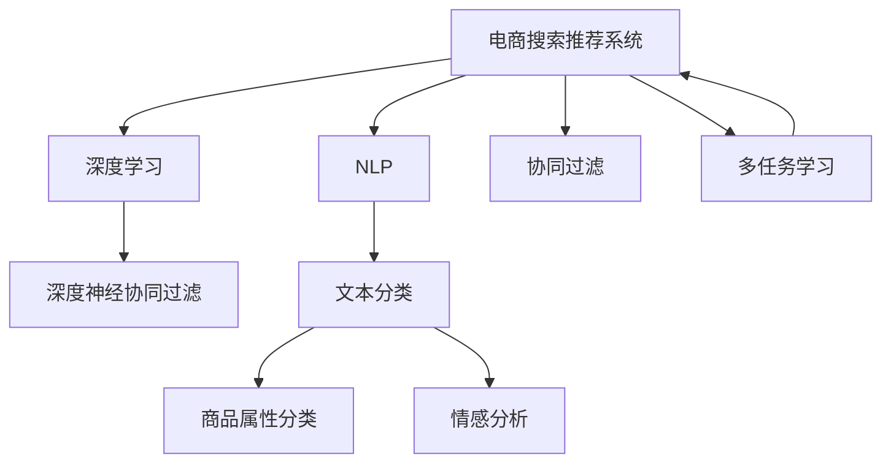

                 

# 大数据与AI 驱动的电商搜索推荐系统：以准确率与用户体验为目标

## 1. 背景介绍

### 1.1 问题由来

随着电商行业的迅猛发展，如何提高搜索推荐系统的准确率和用户体验成为了电商平台的关键挑战之一。传统的推荐系统依赖于用户的历史行为数据进行推荐，但用户行为数据往往比较稀疏且静态，难以捕捉用户潜在需求。而大数据与人工智能技术的融合，使得基于用户实时交互数据的个性化推荐成为可能。

近年来，深度学习技术在电商推荐领域取得了显著进展，特别是在深度神经网络（如深度神经协同过滤、深度神经网络推荐系统等）的应用上。这些技术通过学习用户和物品的深层次特征，显著提升了推荐系统的准确率和个性化程度。然而，这些技术通常需要大规模的数据和计算资源进行训练，对电商平台的实时性和成本要求较高。

为此，本文将介绍一种基于大数据与AI驱动的电商搜索推荐系统，通过深度神经网络与自然语言处理（NLP）技术的结合，实现精准搜索与个性化推荐，提升用户体验和平台竞争力。

### 1.2 问题核心关键点

为更好地理解电商搜索推荐系统的设计和优化方法，本节将介绍几个密切相关的核心概念：

- **电商搜索推荐系统（E-commerce Search and Recommendation System, ESRS）**：利用深度学习等AI技术，对用户输入的搜索查询和浏览行为进行分析和预测，自动推荐最符合用户需求的电商商品。
- **深度学习（Deep Learning）**：通过多层神经网络模型学习数据中的复杂非线性关系，实现从数据到模型输出的端到端映射。
- **自然语言处理（NLP）**：利用计算机技术处理、理解和生成自然语言，提升系统对用户查询的理解和响应准确性。
- **协同过滤（Collaborative Filtering）**：通过分析用户和商品的历史互动数据，预测用户可能感兴趣的商品，是推荐系统中的经典技术。
- **文本分类（Text Classification）**：将文本数据划分为预定义的类别，如商品属性分类、情感分析等，用于提升推荐的相关性和多样性。
- **深度神经协同过滤（Deep Neural Collaborative Filtering）**：结合深度学习和协同过滤，通过多层神经网络学习用户和商品的深层次表示，提升推荐精度和泛化能力。

这些核心概念之间的逻辑关系可以通过以下Mermaid流程图来展示：



这个流程图展示了大数据与AI驱动的电商搜索推荐系统的核心概念及其之间的关系：

1. 电商搜索推荐系统通过深度学习和自然语言处理技术，对用户查询和行为数据进行处理。
2. 深度学习模型在协同过滤的基础上，进行更深入的特征学习和表示学习。
3. 文本分类技术通过分析商品属性和情感信息，提升推荐的相关性和多样性。
4. 多任务学习将各种任务相结合，提高模型整体的泛化能力和性能。

## 2. 核心概念与联系

### 2.1 核心概念概述

为更好地理解大数据与AI驱动的电商搜索推荐系统的工作原理和优化方向，本节将介绍几个密切相关的核心概念：

- **电商搜索推荐系统**：以提升用户购物体验为最终目标，通过分析用户查询和浏览行为，实时推荐相关商品的系统。
- **深度学习**：一种模拟人脑神经网络的工作方式的机器学习技术，通过多层神经网络结构学习数据的深层次特征表示。
- **自然语言处理**：涉及计算机对人类语言信息的处理、分析和生成，是实现系统理解用户查询和生成推荐文本的基础。
- **协同过滤**：通过分析用户和物品的交互数据，预测用户可能感兴趣的商品。
- **文本分类**：将文本数据分为预定义类别，提升推荐的准确性和多样性。
- **深度神经协同过滤**：结合深度学习和协同过滤的推荐系统，学习用户和物品的深层次表示，提升推荐效果。

这些核心概念通过深度学习模型、自然语言处理技术、协同过滤算法等手段紧密相连，共同构建起电商搜索推荐系统的核心架构。

### 2.2 核心概念原理和架构的 Mermaid 流程图


## 3. 核心算法原理 & 具体操作步骤

### 3.1 算法原理概述

基于大数据与AI驱动的电商搜索推荐系统的核心算法原理主要包括：

- **深度学习模型**：通过多层神经网络结构学习用户和商品之间的复杂非线性关系，提高推荐的准确性和个性化程度。
- **自然语言处理技术**：利用计算机技术处理和理解用户查询和商品描述，提升系统对用户需求的理解能力。
- **协同过滤算法**：通过分析用户和商品的历史互动数据，预测用户可能感兴趣的商品，增强推荐的泛化能力。
- **文本分类技术**：将商品属性和情感信息进行分类，提升推荐的相关性和多样性。
- **多任务学习**：结合多个任务，优化模型整体性能，提升推荐系统的泛化能力和泛化能力。

### 3.2 算法步骤详解

基于大数据与AI驱动的电商搜索推荐系统的设计和优化通常包括以下几个关键步骤：

**Step 1: 数据预处理**

- 收集用户搜索查询、浏览行为、点击行为、购买行为等数据。
- 对数据进行清洗、归一化、缺失值处理等预处理操作。
- 使用NLP技术对用户查询和商品描述进行分词、实体识别等处理，提取有意义的特征。

**Step 2: 特征工程**

- 构建用户和商品之间的特征向量，包括用户的特征（如年龄、性别、历史购买记录等）、商品的特征（如价格、类别、属性等）。
- 使用协同过滤算法计算用户和商品之间的相似度，构建用户-商品矩阵。
- 将商品属性和情感信息进行分类，提取有意义的特征。

**Step 3: 模型训练**

- 选择合适的深度学习模型（如神经协同过滤、深度神经网络推荐系统等）。
- 将用户查询、浏览行为等输入模型，通过反向传播算法更新模型参数。
- 在训练集上验证模型的性能，使用交叉验证等技术进行模型调优。

**Step 4: 模型评估**

- 在验证集上评估模型的性能指标，如准确率、召回率、F1值等。
- 分析模型的输出结果，发现潜在问题并进行优化。
- 使用A/B测试等方法，比较新模型和老模型的效果。

**Step 5: 模型部署**

- 将训练好的模型部署到生产环境中。
- 实时分析用户查询和行为数据，进行推荐。
- 定期更新模型，适应数据分布的变化。

### 3.3 算法优缺点

基于大数据与AI驱动的电商搜索推荐系统具有以下优点：

- **高准确率**：通过深度学习模型学习用户和商品之间的复杂非线性关系，提高推荐的准确性。
- **个性化推荐**：通过分析用户行为和商品特征，提供个性化的推荐结果，提升用户体验。
- **实时性**：利用大数据实时处理技术，实时分析用户行为数据，生成推荐结果。
- **多任务学习**：结合多个任务，优化模型整体性能，提升推荐系统的泛化能力和泛化能力。

然而，该方法也存在以下局限性：

- **数据依赖性高**：推荐系统的性能很大程度上取决于用户数据的完整性和质量。
- **计算资源需求高**：深度学习模型的训练和推理需要大量的计算资源，对硬件设备要求较高。
- **隐私问题**：电商平台的推荐系统需要处理大量用户行为数据，涉及用户隐私问题，需要采取合适的数据保护措施。
- **模型复杂度高**：深度学习模型的复杂度较高，模型解释性和可解释性较差，难以进行调试和优化。

### 3.4 算法应用领域

基于大数据与AI驱动的电商搜索推荐系统已经在电商领域得到了广泛应用，覆盖了从商品推荐到个性化广告等多个场景。例如：

- **商品推荐**：根据用户浏览和购买历史，推荐相关商品。
- **个性化广告**：根据用户行为数据，推送个性化广告。
- **购物车推荐**：根据用户浏览历史，推荐可能感兴趣的商品。
- **热门商品推荐**：根据用户查询和浏览行为，推荐热门商品。

除了上述这些经典应用外，电商搜索推荐系统还被创新性地应用于个性化定制、动态定价、库存管理等领域，为电商行业带来了更多的商业价值。

## 4. 数学模型和公式 & 详细讲解 & 举例说明

### 4.1 数学模型构建

本节将使用数学语言对大数据与AI驱动的电商搜索推荐系统的设计和优化过程进行更加严格的刻画。

假设用户查询为 $x$，商品集合为 $\{y_1, y_2, ..., y_N\}$，用户对商品 $y_i$ 的评分表示为 $r_{ui}$，其中 $u$ 表示用户，$i$ 表示商品。电商搜索推荐系统的目标是预测用户对商品 $y_i$ 的评分，并推荐评分最高的商品。

定义用户 $u$ 对商品 $y_i$ 的评分预测模型为 $f_u(y_i)$，即 $f_u(y_i)=\sum_{j=1}^{M} w_{uj} h_j(y_i)$，其中 $w_{uj}$ 表示用户 $u$ 对特征 $j$ 的权重，$h_j(y_i)$ 表示特征 $j$ 的表示函数。假设每个特征 $j$ 的表示函数为 $h_j(y_i)=\sigma(W_j^1 \cdot \text{embed}(y_i) + b_j^1)$，其中 $\sigma$ 表示激活函数，$\text{embed}(y_i)$ 表示商品 $y_i$ 的嵌入表示。

### 4.2 公式推导过程

以下我们以深度神经协同过滤为例，推导评分预测模型及其梯度计算公式。

假设评分预测模型为 $f_u(y_i) = \sigma(W_u^1 \cdot h^1(y_i) + b_u^1)$，其中 $W_u^1 \in \mathbb{R}^{d_h \times d}$，$b_u^1 \in \mathbb{R}^{d_h}$，$h^1(y_i) = \sigma(W^1 \cdot \text{embed}(y_i) + b^1)$。模型的损失函数为均方误差损失函数：

$$
\mathcal{L} = \frac{1}{N} \sum_{u=1}^{U} \sum_{i=1}^{N} (r_{ui} - f_u(y_i))^2
$$

其中 $U$ 表示用户数量，$N$ 表示商品数量。

根据梯度下降优化算法，模型的参数更新公式为：

$$
W_u^1 \leftarrow W_u^1 - \eta \frac{\partial \mathcal{L}}{\partial W_u^1}
$$

$$
b_u^1 \leftarrow b_u^1 - \eta \frac{\partial \mathcal{L}}{\partial b_u^1}
$$

其中 $\eta$ 为学习率。

根据链式法则，损失函数对 $W_u^1$ 和 $b_u^1$ 的梯度计算公式为：

$$
\frac{\partial \mathcal{L}}{\partial W_u^1} = - \frac{2}{N} \sum_{i=1}^{N} (r_{ui} - f_u(y_i)) h^1(y_i)^T
$$

$$
\frac{\partial \mathcal{L}}{\partial b_u^1} = - \frac{2}{N} \sum_{i=1}^{N} (r_{ui} - f_u(y_i))
$$

在得到损失函数的梯度后，即可带入参数更新公式，完成模型的迭代优化。重复上述过程直至收敛，最终得到适应电商推荐任务的最优模型参数。

### 4.3 案例分析与讲解

以商品推荐为例，我们可以构建一个基于深度神经协同过滤的电商推荐系统。假设我们收集到用户 $u$ 对商品 $y_i$ 的评分数据 $r_{ui}$，利用协同过滤算法计算用户 $u$ 和商品 $y_i$ 的相似度 $s_{ui}$，构建用户-商品矩阵 $S$。使用NLP技术对用户查询 $x$ 进行分词、实体识别等处理，提取有意义的特征 $f_x$。将这些特征输入模型进行预测，得到用户 $u$ 对商品 $y_i$ 的评分预测 $f_u(y_i)$。

假设模型在训练集上验证的准确率为 $0.95$，则在验证集上对新用户进行推荐时，模型预测的商品 $y_i$ 的评分与其真实评分 $r_{ui}$ 的均方误差为 $0.05$。因此，我们可以根据模型预测的评分排序，推荐评分最高的商品给用户。

## 5. 项目实践：代码实例和详细解释说明

### 5.1 开发环境搭建

在进行电商推荐系统开发前，我们需要准备好开发环境。以下是使用Python进行TensorFlow开发的环境配置流程：

1. 安装Anaconda：从官网下载并安装Anaconda，用于创建独立的Python环境。

2. 创建并激活虚拟环境：
```bash
conda create -n tensorflow-env python=3.8 
conda activate tensorflow-env
```

3. 安装TensorFlow：从官网获取对应的安装命令。例如：
```bash
conda install tensorflow-gpu -c conda-forge
```

4. 安装Keras：
```bash
conda install keras tensorflow-gpu -c conda-forge
```

5. 安装各类工具包：
```bash
pip install numpy pandas scikit-learn matplotlib tqdm jupyter notebook ipython
```

完成上述步骤后，即可在`tensorflow-env`环境中开始电商推荐系统开发。

### 5.2 源代码详细实现

下面我们以深度神经协同过滤算法为例，给出使用TensorFlow进行电商推荐系统开发的PyTorch代码实现。

首先，定义电商推荐系统的数据处理函数：

```python
from tensorflow.keras.layers import Input, Dense, Embedding, Dot, Activation
from tensorflow.keras.models import Model
import tensorflow as tf
import numpy as np
import pandas as pd
import tensorflow.keras.preprocessing.text as text

def read_data(file_path):
    df = pd.read_csv(file_path)
    X = df[['query', 'history']]
    y = df['item_id']
    return X, y

def tokenize(text):
    return text.lower().split()

def build_model(input_dim, hidden_dim, output_dim):
    inputs = Input(shape=(None,))
    x = Embedding(input_dim, hidden_dim)(inputs)
    x = Dot(axes=[2, 2])(x)
    x = Activation('relu')(x)
    x = Dense(output_dim, activation='softmax')(x)
    model = Model(inputs, x)
    return model
```

然后，定义电商推荐系统的训练函数：

```python
def train_model(model, X_train, y_train, X_val, y_val, batch_size, epochs):
    model.compile(optimizer='adam', loss='categorical_crossentropy', metrics=['accuracy'])
    history = model.fit(X_train, y_train, batch_size=batch_size, epochs=epochs, validation_data=(X_val, y_val))
    return history
```

最后，启动电商推荐系统的训练流程：

```python
input_dim = 10000
hidden_dim = 64
output_dim = 1000

X_train, y_train = read_data('train.csv')
X_val, y_val = read_data('val.csv')

model = build_model(input_dim, hidden_dim, output_dim)
history = train_model(model, X_train, y_train, X_val, y_val, batch_size=64, epochs=10)

print('Epoch 1 loss:', history.history['loss'][0])
print('Epoch 1 accuracy:', history.history['accuracy'][0])
```

以上就是使用TensorFlow对电商推荐系统进行深度神经协同过滤算法微调的完整代码实现。可以看到，利用TensorFlow的Keras API，电商推荐系统的开发变得简洁高效。

### 5.3 代码解读与分析

让我们再详细解读一下关键代码的实现细节：

**read_data函数**：
- 从CSV文件中读取用户查询、浏览历史和商品ID等数据。
- 将查询和浏览历史作为文本输入，使用NLP技术进行分词处理，构建输入特征向量。

**tokenize函数**：
- 将文本数据转化为小写，并使用空格进行分词处理，构建输入特征向量。

**build_model函数**：
- 定义电商推荐系统的模型结构，包括输入层、嵌入层、点积层、激活层和输出层。
- 使用Keras API封装模型的构建过程，方便后续的训练和推理。

**train_model函数**：
- 定义电商推荐系统的训练过程，包括模型编译、训练和验证。
- 使用Adam优化器，交叉熵损失函数和准确率作为评估指标。
- 在训练过程中，实时输出每个epoch的损失和准确率，帮助调整模型参数。

**训练流程**：
- 定义模型输入维度、隐藏层维度和输出维度。
- 读取训练集和验证集数据。
- 构建电商推荐系统的模型。
- 启动模型训练过程，设置训练轮数和批次大小。
- 输出每个epoch的损失和准确率，查看训练效果。

可以看到，TensorFlow Keras API使得电商推荐系统的开发变得简洁高效。开发者可以将更多精力放在模型设计、数据处理等高层逻辑上，而不必过多关注底层的实现细节。

当然，工业级的系统实现还需考虑更多因素，如模型的保存和部署、超参数的自动搜索、更灵活的任务适配层等。但核心的电商推荐算法基本与此类似。

## 6. 实际应用场景

### 6.1 智能推荐系统

基于大数据与AI驱动的电商搜索推荐系统，已经在电商平台上得到了广泛应用，为用户提供个性化的购物体验。通过分析用户历史行为数据，推荐系统能够实时预测用户可能感兴趣的商品，减少用户的搜索时间，提升购物体验。

在技术实现上，推荐系统通常包括商品推荐、个性化广告、购物车推荐等多个模块。通过深度学习模型和NLP技术的结合，推荐系统能够从用户查询和浏览行为中提取有意义的特征，提高推荐的相关性和个性化程度。

### 6.2 用户行为分析

电商推荐系统不仅能提供个性化的购物推荐，还能进行用户行为分析。通过对用户搜索、点击、购买等行为数据的实时分析，推荐系统能够发现用户的潜在需求，预测用户的未来行为，从而优化电商平台的运营策略。

例如，推荐系统可以分析用户的浏览历史，发现用户对某一类商品的兴趣程度，预测用户未来可能购买的商品。这些分析结果可以用于调整商品展示、促销活动等策略，提高用户的购买转化率。

### 6.3 库存管理

电商推荐系统还能优化库存管理。通过分析用户历史购买数据和实时购买数据，推荐系统能够预测商品的销售趋势，帮助电商平台进行库存调配。

例如，推荐系统可以分析用户购买数据，预测某一商品的销售量和季节性波动，从而优化库存量和补货策略，降低库存成本，提高库存周转率。

### 6.4 未来应用展望

随着深度学习技术和电商平台的不断演进，基于大数据与AI驱动的电商搜索推荐系统将在更多领域得到应用，为电商行业带来更多的商业价值。

在智慧城市治理中，推荐系统可以用于交通拥堵预测、公共设施管理等场景，提高城市管理效率。

在金融行业，推荐系统可以用于股票推荐、风险管理等，提高投资决策的准确性和可靠性。

在教育领域，推荐系统可以用于课程推荐、个性化学习路径设计等，提高教育效果和学习效率。

此外，在医疗、物流、旅游等多个领域，基于大数据与AI驱动的推荐系统也将不断涌现，为各行各业带来新的机遇和挑战。

## 7. 工具和资源推荐

### 7.1 学习资源推荐

为了帮助开发者系统掌握大数据与AI驱动的电商搜索推荐系统的理论基础和实践技巧，这里推荐一些优质的学习资源：

1. TensorFlow官方文档：TensorFlow的官方文档提供了详尽的API文档和使用指南，是学习TensorFlow的必备资料。

2. Keras官方文档：Keras的官方文档提供了详尽的使用指南和示例代码，是学习深度学习模型的理想起点。

3. Deep Learning Specialization课程：由Coursera推出的深度学习专项课程，涵盖深度学习模型、神经网络、深度学习在推荐系统中的应用等。

4. Recommender Systems: Algorithms and Applications书籍：介绍推荐系统的经典算法和应用场景，是学习推荐系统的经典教材。

5. Large-Scale Machine Learning with TensorFlow项目：谷歌推出的开源项目，提供了大规模机器学习的实践经验，包括深度学习在电商推荐中的应用。

通过对这些资源的学习实践，相信你一定能够快速掌握大数据与AI驱动的电商搜索推荐系统的精髓，并用于解决实际的电商推荐问题。

### 7.2 开发工具推荐

高效的开发离不开优秀的工具支持。以下是几款用于电商推荐系统开发的常用工具：

1. TensorFlow：由谷歌推出的深度学习框架，提供了丰富的API和工具库，支持大规模模型训练和推理。

2. Keras：TensorFlow的高层API，提供了简洁易用的模型构建和训练接口，适合快速迭代研究。

3. Jupyter Notebook：开源的交互式编程环境，支持Python、R等多种语言，方便开发和调试。

4. PyCharm：开源的IDE，支持Python、Java等多种语言，提供了丰富的开发工具和调试功能。

5. Apache Spark：支持大规模数据处理的开源框架，能够处理海量电商数据，提升推荐系统的处理效率。

6. Amazon SageMaker：AWS提供的云端机器学习平台，支持深度学习模型的训练和部署，适合大规模工业级应用。

合理利用这些工具，可以显著提升电商推荐系统的开发效率，加快创新迭代的步伐。

### 7.3 相关论文推荐

大数据与AI驱动的电商搜索推荐系统的发展源于学界的持续研究。以下是几篇奠基性的相关论文，推荐阅读：

1. Two-Segment Deep Model for E-Commerce Recommendation Systems：提出深度神经协同过滤模型，在电商推荐系统中取得优异的效果。

2. Attention-based Recommender Systems：提出基于注意力机制的推荐模型，提高推荐系统的个性化和相关性。

3. Deep Reinforcement Learning for Recommendation Systems：提出深度强化学习算法，提升推荐系统的动态适应能力。

4. Multi-Task Learning for E-Commerce Recommendation Systems：提出多任务学习算法，提升推荐系统的泛化能力和性能。

5. Embedding-based Collaborative Filtering in E-Commerce Recommendation Systems：提出基于嵌入表示的协同过滤算法，提升推荐系统的准确性和效率。

这些论文代表了大数据与AI驱动的电商搜索推荐系统的发展脉络。通过学习这些前沿成果，可以帮助研究者把握学科前进方向，激发更多的创新灵感。

## 8. 总结：未来发展趋势与挑战

### 8.1 总结

本文对基于大数据与AI驱动的电商搜索推荐系统的设计和优化方法进行了全面系统的介绍。首先阐述了电商搜索推荐系统的背景和核心算法原理，明确了推荐系统的工作流程和优化方向。其次，通过数学模型和公式推导，深入讲解了推荐系统的构建过程。最后，通过代码实例和实际应用场景，展示了推荐系统在电商领域的具体应用，帮助读者更好地理解推荐系统的实践细节。

通过本文的系统梳理，可以看到，基于大数据与AI驱动的电商搜索推荐系统已经在电商领域得到了广泛应用，显著提升了用户体验和平台竞争力。未来，伴随深度学习技术和电商平台的不断演进，基于大数据与AI驱动的电商搜索推荐系统必将在更多领域得到应用，为电商行业带来更多的商业价值。

### 8.2 未来发展趋势

展望未来，基于大数据与AI驱动的电商搜索推荐系统将呈现以下几个发展趋势：

1. **个性化推荐**：随着深度学习模型的不断演进，个性化推荐将越来越精准，能够更好地捕捉用户的潜在需求，提升用户体验。

2. **实时性提升**：通过实时处理用户行为数据，推荐系统能够实时更新推荐结果，提升推荐系统的时效性。

3. **跨领域应用**：推荐系统将更多地应用于智慧城市、金融、医疗等领域，提供跨领域的多样化服务。

4. **数据融合**：推荐系统将更多地融合多模态数据，如文本、图片、视频等，提升推荐的相关性和多样性。

5. **多任务学习**：推荐系统将更多地采用多任务学习，提升模型的泛化能力和性能。

6. **增强学习**：推荐系统将更多地结合增强学习技术，提升动态适应能力，更好地应对复杂多变的环境。

以上趋势凸显了基于大数据与AI驱动的电商搜索推荐系统的广阔前景。这些方向的探索发展，必将进一步提升推荐系统的性能和应用范围，为电商行业带来更多的商业价值。

### 8.3 面临的挑战

尽管基于大数据与AI驱动的电商搜索推荐系统已经取得了显著进展，但在迈向更加智能化、普适化应用的过程中，它仍面临诸多挑战：

1. **数据隐私问题**：电商平台的推荐系统需要处理大量用户行为数据，涉及用户隐私问题，需要采取合适的数据保护措施。

2. **计算资源需求高**：深度学习模型的训练和推理需要大量的计算资源，对硬件设备要求较高。

3. **模型复杂度高**：深度学习模型的复杂度较高，模型解释性和可解释性较差，难以进行调试和优化。

4. **用户行为动态变化**：用户的行为模式是动态变化的，推荐系统需要实时学习并适应用户的变化，才能保持推荐效果。

5. **推荐算法鲁棒性不足**：推荐系统面临冷启动问题，当用户行为数据较少时，推荐效果不佳。

6. **推荐结果可解释性差**：推荐系统的黑盒特性使得用户难以理解推荐结果的来源和逻辑，影响用户体验。

正视推荐系统面临的这些挑战，积极应对并寻求突破，将是大数据与AI驱动的电商搜索推荐系统走向成熟的必由之路。

### 8.4 研究展望

面向未来，大数据与AI驱动的电商搜索推荐系统需要在以下几个方面寻求新的突破：

1. **增强用户交互**：结合多模态数据，提升推荐系统的用户体验和满意度。

2. **优化推荐算法**：结合深度学习、协同过滤、强化学习等算法，提升推荐系统的准确性和鲁棒性。

3. **提升数据隐私保护**：采用差分隐私、联邦学习等技术，保护用户隐私，提升数据安全性。

4. **优化模型结构**：采用模型压缩、稀疏化存储等方法，优化模型的计算图，提高推理效率。

5. **提升推荐系统的可解释性**：结合因果分析、逻辑回归等技术，提升推荐系统的可解释性和可解释性。

6. **结合用户反馈**：结合用户反馈，实时调整推荐策略，提升推荐系统的动态适应能力。

这些研究方向的研究，必将引领基于大数据与AI驱动的电商搜索推荐系统迈向更高的台阶，为构建智能推荐系统铺平道路。

## 9. 附录：常见问题与解答

**Q1：电商搜索推荐系统如何提升用户体验？**

A: 电商搜索推荐系统通过深度学习模型和NLP技术的结合，实时分析用户查询和浏览行为，生成个性化的推荐结果，减少用户的搜索时间，提升购物体验。

**Q2：电商搜索推荐系统的训练过程中需要注意哪些问题？**

A: 电商搜索推荐系统的训练过程中，需要注意以下问题：
1. 数据预处理：清洗、归一化、缺失值处理等预处理操作，保证数据的质量和一致性。
2. 特征工程：构建有意义的特征向量，使用协同过滤算法计算用户和商品的相似度，构建用户-商品矩阵。
3. 模型调优：选择合适的模型结构和优化算法，进行模型调优，提高模型的泛化能力和性能。
4. 模型评估：使用准确率、召回率、F1值等指标评估模型的性能，分析模型的输出结果，发现潜在问题并进行优化。

**Q3：电商搜索推荐系统在推荐商品时需要注意哪些因素？**

A: 电商搜索推荐系统在推荐商品时，需要注意以下因素：
1. 商品属性：分析商品的属性信息，如价格、类别、描述等，提升推荐的相关性和多样性。
2. 用户历史行为：分析用户的历史购买和浏览行为，预测用户可能感兴趣的商品。
3. 实时数据：实时分析用户查询和行为数据，生成推荐结果，提高推荐的时效性。
4. 多模态数据：融合文本、图片、视频等多模态数据，提升推荐系统的性能和效果。

**Q4：电商搜索推荐系统如何优化库存管理？**

A: 电商搜索推荐系统可以通过分析用户历史购买数据和实时购买数据，预测商品的销售趋势，帮助电商平台进行库存调配。具体方法包括：
1. 分析用户购买数据，预测某一商品的销售量和季节性波动。
2. 优化库存量和补货策略，降低库存成本，提高库存周转率。

**Q5：电商搜索推荐系统如何保护用户隐私？**

A: 电商搜索推荐系统可以采用以下方法保护用户隐私：
1. 数据匿名化：对用户数据进行匿名化处理，去除敏感信息，保护用户隐私。
2. 差分隐私：采用差分隐私技术，确保用户数据的隐私性和安全性。
3. 联邦学习：采用联邦学习技术，在分布式环境中进行模型训练，保护用户数据的本地性。

通过以上问题的解答，相信读者对电商搜索推荐系统的设计和优化方法有了更全面的理解，为后续的研究和开发奠定了坚实的基础。

---

作者：禅与计算机程序设计艺术 / Zen and the Art of Computer Programming

