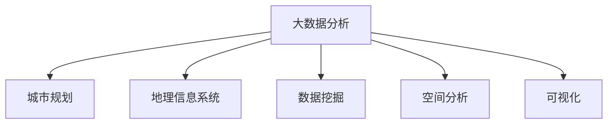

                 

# 大数据分析在城市规划中的应用：智能化决策支持

## 1. 背景介绍

### 1.1 问题由来
随着城市化进程的不断加快，城市规划的复杂性和多样性也在不断提升。传统城市规划往往依赖于大量专家经验和历史数据，但这种方式难以应对快速变化的城市环境，容易产生主观偏见和错误决策。

大数据分析技术的兴起为城市规划带来了新的突破。通过收集、存储、分析和可视化海量城市数据，能够帮助城市规划者更全面、更准确地理解城市现状和趋势，优化规划决策。例如，利用交通流量、人口分布、环境质量等数据，可以发现潜在的城市问题，提前布局公共服务设施，制定科学的城市规划方案。

### 1.2 问题核心关键点
大数据分析在城市规划中的应用，关键在于如何高效地处理和分析城市数据，辅助城市规划者做出科学、精准的决策。具体来说，包括以下几个核心问题：

- 如何获取、存储和管理城市数据？
- 如何快速准确地分析城市数据，提取关键特征？
- 如何利用数据支持城市规划决策，提升规划效率？
- 如何评估城市规划方案的效果，持续优化规划方案？

### 1.3 问题研究意义
大数据分析在城市规划中的应用，具有重要意义：

- 提高决策科学性：利用数据驱动的方法，可以更准确地理解城市现状和未来趋势，减少主观偏见和错误决策。
- 提升规划效率：借助大数据技术，能够快速分析海量数据，辅助城市规划者高效制定规划方案。
- 优化资源配置：通过数据分析，可以发现城市资源的浪费和短缺情况，优化公共服务设施和交通网络布局。
- 促进持续改进：通过持续的数据监测和评估，可以动态调整规划方案，提升城市管理水平。

## 2. 核心概念与联系

### 2.1 核心概念概述

为更好地理解大数据分析在城市规划中的应用，本节将介绍几个密切相关的核心概念：

- 大数据分析(Big Data Analysis)：通过收集、存储、处理和分析海量数据，发现数据中的模式、趋势和关联性，辅助决策支持。
- 城市规划(Urban Planning)：制定城市发展目标和规划方案，优化城市空间布局、设施配置和资源管理。
- 地理信息系统(GIS)：一种将地理数据与计算机技术结合的技术，用于地理数据的存储、管理和分析。
- 数据挖掘(Data Mining)：从大数据中提取有用信息、知识、模式和规律，以支持决策。
- 空间分析(Spatial Analysis)：研究地理数据的空间特征和关系，发现地理空间中的规律和趋势。
- 可视化(Visualization)：将数据以图表、地图、动画等形式直观展示，帮助人们更好地理解数据。

这些核心概念之间的逻辑关系可以通过以下Mermaid流程图来展示：



这个流程图展示了大数据分析在城市规划中的核心作用，通过地理信息系统、数据挖掘、空间分析和可视化等关键技术，为城市规划提供科学的数据支持。

## 3. 核心算法原理 & 具体操作步骤
### 3.1 算法原理概述

大数据分析在城市规划中的应用，本质上是将城市数据转化为有价值的信息，辅助规划者做出科学决策。其核心思想是：通过收集、存储和分析城市数据，提取城市运行的关键特征和规律，辅助城市规划者进行决策支持。

形式化地，假设城市规划任务为 $T$，数据集为 $D=\{(x_i, y_i)\}_{i=1}^N$，其中 $x_i$ 表示城市运行特征，$y_i$ 表示规划目标。大数据分析的目标是找到最优的决策模型 $M$，使得 $M$ 在数据集 $D$ 上具有最佳的预测性能：

$$
M = \mathop{\arg\min}_{M} \mathcal{L}(M, D)
$$

其中 $\mathcal{L}$ 为损失函数，衡量模型 $M$ 在数据集 $D$ 上的预测误差。

### 3.2 算法步骤详解

大数据分析在城市规划中的应用，通常包括以下几个关键步骤：

**Step 1: 数据收集与预处理**
- 收集城市相关的多源异构数据，包括交通流量、人口统计、环境监测等。
- 对数据进行清洗、去重、补缺等预处理操作，确保数据的质量和一致性。

**Step 2: 数据存储与管理**
- 采用分布式存储系统（如Hadoop、Spark）对城市数据进行存储和管理。
- 设计高效的数据访问和查询接口，确保数据的可读性和可用性。

**Step 3: 数据分析与建模**
- 选择合适的大数据分析技术（如MapReduce、Spark Streaming）对城市数据进行并行处理和分析。
- 利用机器学习算法（如回归、分类、聚类等）对数据进行建模，提取关键特征和规律。

**Step 4: 模型评估与优化**
- 在验证集上评估模型性能，选择合适的模型和参数。
- 通过交叉验证等技术，不断优化模型，提升预测准确性。

**Step 5: 结果展示与反馈**
- 利用可视化技术（如Tableau、Power BI）将分析结果以图表、地图等形式展示。
- 根据结果对城市规划方案进行调整和优化，形成迭代改进的机制。

### 3.3 算法优缺点

大数据分析在城市规划中的应用，具有以下优点：

- 数据驱动：通过数据驱动的决策方式，可以大幅减少主观偏见和错误决策，提升规划科学性。
- 高效性：利用大数据技术，能够快速处理海量数据，辅助规划者高效制定规划方案。
- 灵活性：大数据分析技术具有较强的灵活性和可扩展性，可以适应不同规模和复杂度的城市规划任务。
- 可视化：通过可视化技术，可以直观展示分析结果，帮助规划者更好地理解数据和做出决策。

同时，该方法也存在一些局限性：

- 数据质量：城市数据的质量直接影响分析结果的准确性，需要做好数据收集和预处理工作。
- 技术门槛：大数据分析技术涉及复杂的数学建模和算法实现，需要专业的技术支持。
- 隐私问题：城市数据涉及个人隐私，需要采取有效的数据保护措施。
- 计算资源：大数据分析需要高性能计算资源，对硬件设施要求较高。

尽管存在这些局限性，但就目前而言，大数据分析在城市规划中的应用仍是大数据技术的重要应用领域之一。未来相关研究的重点在于如何进一步降低技术门槛，提升数据质量，优化模型性能，以及解决隐私和安全问题。

### 3.4 算法应用领域

大数据分析在城市规划中的应用，涵盖了城市规划的多个方面，例如：

- 交通规划：通过交通流量数据，预测交通拥堵情况，优化交通网络布局。
- 环境规划：利用环境质量监测数据，发现污染源，制定环境治理方案。
- 公共服务规划：分析人口分布、教育资源等数据，优化公共服务设施配置。
- 用地规划：利用土地利用数据，评估城市发展空间，制定用地规划方案。
- 能源规划：分析能源消耗数据，优化能源配置，提升能源利用效率。
- 灾害应急：通过灾情监测数据，预测自然灾害，制定应急响应策略。

除了上述这些经典应用外，大数据分析还被创新性地应用到更多场景中，如智慧城市建设、智能交通管理、社会治理等，为城市规划和治理带来了新的突破。

## 4. 数学模型和公式 & 详细讲解 & 举例说明

### 4.1 数学模型构建

本节将使用数学语言对大数据分析在城市规划中的应用进行更加严格的刻画。

假设城市运行特征数据集为 $D=\{(x_i, y_i)\}_{i=1}^N$，其中 $x_i$ 表示城市运行特征，$y_i$ 表示规划目标。定义城市规划模型 $M_{\theta}$，其中 $\theta$ 为模型参数。

定义损失函数 $\mathcal{L}(\theta)$ 衡量模型预测值与真实值之间的差异。例如，对于分类问题，可以使用交叉熵损失函数：

$$
\mathcal{L}(\theta) = -\frac{1}{N}\sum_{i=1}^N y_i \log M_{\theta}(x_i) + (1-y_i) \log (1-M_{\theta}(x_i))
$$

其中 $M_{\theta}(x_i)$ 为模型在特征 $x_i$ 上的预测值，$y_i$ 为真实标签。

### 4.2 公式推导过程

以下我们以交通流量预测为例，推导回归模型的损失函数及其梯度计算公式。

假设模型 $M_{\theta}$ 在特征 $x_i$ 上的预测值为 $y_i$，真实标签为 $y_i$。则回归损失函数为：

$$
\mathcal{L}(\theta) = \frac{1}{N}\sum_{i=1}^N (y_i - M_{\theta}(x_i))^2
$$

根据梯度下降算法，模型的参数更新公式为：

$$
\theta \leftarrow \theta - \eta \nabla_{\theta}\mathcal{L}(\theta)
$$

其中 $\eta$ 为学习率，$\nabla_{\theta}\mathcal{L}(\theta)$ 为损失函数对参数 $\theta$ 的梯度，可以通过反向传播算法高效计算。

### 4.3 案例分析与讲解

以交通流量预测为例，展示大数据分析在城市规划中的应用。

假设有一份包含过去一年内每日交通流量的数据集 $D=\{(x_i, y_i)\}_{i=1}^N$，其中 $x_i$ 表示日期和时间，$y_i$ 表示该时间段的交通流量。

**Step 1: 数据收集与预处理**
- 收集过去一年内每日交通流量的数据，存储在分布式数据库中。
- 对数据进行清洗，去除异常值和重复数据。

**Step 2: 数据分析与建模**
- 使用MapReduce对数据进行并行处理，计算每日交通流量的平均值、方差等特征。
- 选择线性回归模型 $M_{\theta}$ 对数据进行建模，提取关键特征和规律。

**Step 3: 模型评估与优化**
- 在验证集上评估模型性能，选择最优的回归模型和参数。
- 通过交叉验证等技术，不断优化模型，提升预测准确性。

**Step 4: 结果展示与反馈**
- 利用Tableau将预测结果以图表形式展示，直观地展示交通流量的变化趋势。
- 根据预测结果，对未来的交通规划进行调整和优化。

通过上述流程，可以实现对未来交通流量的准确预测，为城市交通规划提供科学依据。

## 5. 项目实践：代码实例和详细解释说明
### 5.1 开发环境搭建

在进行大数据分析项目实践前，我们需要准备好开发环境。以下是使用Python进行PySpark开发的环境配置流程：

1. 安装Anaconda：从官网下载并安装Anaconda，用于创建独立的Python环境。

2. 创建并激活虚拟环境：
```bash
conda create -n bigdata-env python=3.8 
conda activate bigdata-env
```

3. 安装PySpark：根据CUDA版本，从官网获取对应的安装命令。例如：
```bash
pip install pyspark[mapreduce,sql]
```

4. 安装各类工具包：
```bash
pip install numpy pandas scikit-learn matplotlib tqdm jupyter notebook ipython
```

完成上述步骤后，即可在`bigdata-env`环境中开始大数据分析项目实践。

### 5.2 源代码详细实现

下面我们以交通流量预测为例，给出使用PySpark进行大数据分析的PySpark代码实现。

首先，定义数据处理函数：

```python
from pyspark.sql import SparkSession

spark = SparkSession.builder.appName("traffic_flow_analysis").getOrCreate()

def preprocess_data(df):
    # 去除缺失值和重复数据
    df = df.dropna()
    df = df.drop_duplicates()
    return df
```

然后，定义模型训练函数：

```python
from pyspark.ml.regression import LinearRegression
from pyspark.ml.evaluation import RegressionEvaluator

def train_model(df, features, label):
    # 特征工程
    df = df.select(features)
    
    # 训练模型
    lm = LinearRegression(maxIter=10, regParam=0.3, elasticNetParam=0.8)
    model = lm.fit(df)
    
    # 评估模型
    evaluator = RegressionEvaluator()
    rmse = evaluator.evaluate(model.transform(df), label, metricName="rmse")
    print("RMSE: ", rmse)
    
    return model
```

接着，定义数据读取和可视化函数：

```python
from pyspark.sql.functions import col, when

def read_data(file_path):
    df = spark.read.csv(file_path, header=True, inferSchema=True)
    return df

def visualize_results(model, df, feature_names, label):
    # 生成预测结果
    predictions = model.transform(df)
    predictions = predictions.select(col("prediction"), col("actual"))
    
    # 可视化预测结果
    predictions.write.format("parquet").save("result.parquet")
    spark.read.parquet("result.parquet").show()
```

最后，启动训练和可视化流程：

```python
# 读取数据
file_path = "/path/to/data.csv"
data = read_data(file_path)

# 数据预处理
features = ["date", "hour", "weekday"]
label = "traffic_flow"

data = preprocess_data(data)

# 特征工程
df = data.select(col("date"), col("hour"), col("weekday"), col("traffic_flow"))

# 数据划分
train_df, test_df = data.randomSplit([0.8, 0.2])

# 训练模型
model = train_model(train_df, features, label)

# 可视化结果
visualize_results(model, test_df, features, label)
```

以上就是使用PySpark进行交通流量预测的完整代码实现。可以看到，利用PySpark的大数据处理能力，可以高效地进行数据收集、清洗、建模和可视化，实现对交通流量的准确预测。

### 5.3 代码解读与分析

让我们再详细解读一下关键代码的实现细节：

**preprocess_data函数**：
- 去除数据中的缺失值和重复数据，确保数据的质量和一致性。

**train_model函数**：
- 使用线性回归模型对数据进行建模，选择最优的回归模型和参数。
- 通过评估函数计算模型的均方误差（RMSE），评估模型性能。

**read_data函数**：
- 使用Spark的read.csv方法读取CSV文件，并将其转换为DataFrame格式。

**visualize_results函数**：
- 将模型预测结果保存为Parquet格式文件。
- 使用Spark的read.parquet方法读取Parquet文件，并展示预测结果。

**训练流程**：
- 定义数据读取路径，读取交通流量数据。
- 进行数据预处理，去除缺失值和重复数据。
- 定义模型训练函数，训练线性回归模型。
- 在测试集上评估模型性能，可视化预测结果。

通过上述流程，可以实现对未来交通流量的准确预测，为城市交通规划提供科学依据。

## 6. 实际应用场景
### 6.1 智慧交通管理

大数据分析在智慧交通管理中的应用，可以显著提升城市交通的效率和安全性。通过实时分析交通流量数据，可以发现交通拥堵区域，优化信号灯控制和交通路线的规划。

在技术实现上，可以收集城市各路段的交通流量数据，结合历史数据进行建模和预测。预测结果可以用来调整信号灯时长和交通信号的发布，优化交通流量分布。同时，利用空间分析技术，可以发现交通拥堵热点区域，进行定向疏导和优化。

### 6.2 环境质量监测

利用大数据分析技术，可以实时监测城市环境质量，辅助环境治理。例如，通过空气质量监测数据，可以预测污染物扩散趋势，制定环境治理方案。

在技术实现上，可以收集城市各点的空气质量监测数据，结合历史数据进行建模和预测。预测结果可以用来调整排放控制措施，优化环境治理方案。同时，利用地理信息系统，可以将环境质量数据可视化为热力图和地图，直观展示污染源和扩散趋势。

### 6.3 社会治理

大数据分析在社会治理中的应用，可以提升城市公共服务和社会管理水平。通过实时分析社会事件数据，可以发现潜在的社会问题，提前预警和处理。

在技术实现上，可以收集城市的报警、投诉、社交媒体等数据，结合历史数据进行建模和预测。预测结果可以用来预警社会事件，优化公共服务配置。同时，利用空间分析技术，可以发现社会事件的高发区域，进行定向干预和治理。

### 6.4 未来应用展望

随着大数据分析技术的不断进步，其在城市规划中的应用前景将更加广阔：

- 智能化决策支持：利用大数据分析技术，可以更全面、更准确地理解城市现状和趋势，优化城市规划方案。
- 多源数据融合：通过融合多源异构数据，可以实现更全面、更丰富的城市规划决策支持。
- 实时动态调整：利用大数据技术，可以实时监测城市数据，动态调整城市规划方案，提升城市管理水平。
- 跨领域协同：大数据分析技术可以与其他领域的技术（如机器学习、人工智能等）进行协同，实现跨领域的智慧城市治理。

以上趋势凸显了大数据分析在城市规划中的重要价值。这些方向的探索发展，必将进一步提升城市规划的科学性和有效性，为城市管理带来新的突破。

## 7. 工具和资源推荐
### 7.1 学习资源推荐

为了帮助开发者系统掌握大数据分析在城市规划中的应用，这里推荐一些优质的学习资源：

1. 《Python for Data Analysis》系列博文：由数据科学专家撰写，全面介绍了Python在大数据分析中的应用，包括Pandas、NumPy、Spark等工具的使用。

2. 《Big Data for Cities》课程：由MIT媒体实验室开设的课程，系统讲解了大数据在城市规划中的应用，涵盖了数据收集、存储、分析等关键技术。

3. 《Geospatial Data Science》书籍：由地理信息系统专家撰写，介绍了地理信息系统在大数据分析中的应用，包括空间分析和可视化等技术。

4. Apache Spark官方文档：Spark的官方文档，提供了完整的API和开发指南，是进行大数据分析开发的重要参考。

5. Hadoop官方文档：Hadoop的官方文档，提供了HDFS、MapReduce等关键组件的使用和部署指南。

通过对这些资源的学习实践，相信你一定能够快速掌握大数据分析在城市规划中的应用，并用于解决实际的规划问题。

### 7.2 开发工具推荐

高效的大数据分析需要依托强大的开发工具。以下是几款用于大数据分析开发的常用工具：

1. Apache Spark：Apache基金会开源的大数据处理框架，提供了分布式计算、数据存储、机器学习等功能。

2. Apache Hadoop：Apache基金会开源的大数据处理框架，提供了分布式存储和计算能力。

3. Apache Flink：Apache基金会开源的流处理框架，支持实时数据处理和分析。

4. Tableau：商业可视化工具，可以将大数据分析结果以图表、地图等形式直观展示。

5. Power BI：微软推出的商业可视化工具，可以与大数据平台无缝集成，支持数据分析和可视化。

6. Jupyter Notebook：开源的交互式编程环境，支持Python、R等多种语言，适合大数据分析开发和实验。

合理利用这些工具，可以显著提升大数据分析项目的开发效率，加快创新迭代的步伐。

### 7.3 相关论文推荐

大数据分析在城市规划中的应用，源于学界的持续研究。以下是几篇奠基性的相关论文，推荐阅读：

1. "Big Data Mining and Statistical Learning in Smart Cities"（智能城市中的大数据挖掘和统计学习）：提出了基于大数据挖掘的智能城市决策支持方法。

2. "Spatio-temporal Big Data Analytics for Smart Cities"（时空大数据分析在智能城市中的应用）：介绍了时空大数据在城市规划中的分析方法和应用场景。

3. "Big Data Analytics for Urban Planning: A Survey"（城市规划中的大数据分析综述）：综述了大数据分析在城市规划中的应用和挑战。

4. "Urban Analytics Using Big Data: A Survey"（基于大数据的城市分析综述）：介绍了大数据在城市规划和治理中的应用。

5. "Big Data and Machine Learning for City Management: Opportunities and Challenges"（大数据和机器学习在城市管理中的应用与挑战）：探讨了大数据和机器学习在城市管理中的机会和挑战。

这些论文代表了大数据分析在城市规划中的研究进展。通过学习这些前沿成果，可以帮助研究者把握学科前进方向，激发更多的创新灵感。

## 8. 总结：未来发展趋势与挑战
### 8.1 总结

本文对大数据分析在城市规划中的应用进行了全面系统的介绍。首先阐述了大数据分析在城市规划中的研究背景和意义，明确了大数据分析在城市规划中的应用价值和潜力。其次，从原理到实践，详细讲解了大数据分析的数学原理和关键步骤，给出了大数据分析项目开发的完整代码实例。同时，本文还广泛探讨了大数据分析在智慧交通管理、环境质量监测、社会治理等多个领域的应用前景，展示了大数据分析范式的广阔前景。此外，本文精选了大数据分析的相关学习资源，力求为读者提供全方位的技术指引。

通过本文的系统梳理，可以看到，大数据分析在城市规划中的应用，正在成为城市管理的重要技术手段，为城市规划和治理带来了新的突破。大数据分析技术的应用，可以大幅提升城市管理的科学性和效率，优化资源配置，提升公共服务水平。未来，伴随大数据分析技术的不断演进，其在城市规划中的应用将更加深入和广泛，为城市管理带来新的机遇和挑战。

### 8.2 未来发展趋势

展望未来，大数据分析在城市规划中的应用将呈现以下几个发展趋势：

1. 智能化决策支持：利用大数据分析技术，可以更全面、更准确地理解城市现状和趋势，优化城市规划方案。
2. 多源数据融合：通过融合多源异构数据，可以实现更全面、更丰富的城市规划决策支持。
3. 实时动态调整：利用大数据技术，可以实时监测城市数据，动态调整城市规划方案，提升城市管理水平。
4. 跨领域协同：大数据分析技术可以与其他领域的技术（如机器学习、人工智能等）进行协同，实现跨领域的智慧城市治理。

以上趋势凸显了大数据分析在城市规划中的重要价值。这些方向的探索发展，必将进一步提升城市规划的科学性和有效性，为城市管理带来新的突破。

### 8.3 面临的挑战

尽管大数据分析在城市规划中的应用已经取得了瞩目成就，但在迈向更加智能化、普适化应用的过程中，它仍面临着诸多挑战：

1. 数据质量：城市数据的质量直接影响分析结果的准确性，需要做好数据收集和预处理工作。
2. 技术门槛：大数据分析技术涉及复杂的数学建模和算法实现，需要专业的技术支持。
3. 隐私问题：城市数据涉及个人隐私，需要采取有效的数据保护措施。
4. 计算资源：大数据分析需要高性能计算资源，对硬件设施要求较高。

尽管存在这些挑战，但就目前而言，大数据分析在城市规划中的应用仍是大数据技术的重要应用领域之一。未来相关研究的重点在于如何进一步降低技术门槛，提升数据质量，优化模型性能，以及解决隐私和安全问题。

### 8.4 研究展望

面对大数据分析在城市规划中所面临的挑战，未来的研究需要在以下几个方面寻求新的突破：

1. 探索无监督和半监督大数据分析方法。摆脱对大规模标注数据的依赖，利用自监督学习、主动学习等无监督和半监督范式，最大限度利用非结构化数据，实现更加灵活高效的大数据分析。
2. 研究多模态大数据分析方法。融合视觉、语音、文本等多模态数据，实现更全面、更丰富的城市数据分析。
3. 开发更加高效的大数据分析算法。通过并行计算、分布式存储等技术，提升大数据分析的效率和可扩展性。
4. 结合因果分析和博弈论工具。将因果分析方法引入大数据分析模型，识别出模型决策的关键特征，增强输出解释的因果性和逻辑性。
5. 纳入伦理道德约束。在数据采集和分析过程中，引入伦理导向的评估指标，过滤和惩罚有偏见、有害的输出倾向，确保数据的安全和公正性。

这些研究方向的探索，必将引领大数据分析技术迈向更高的台阶，为城市规划和治理带来新的突破。面向未来，大数据分析技术还需要与其他人工智能技术进行更深入的融合，如机器学习、人工智能等，多路径协同发力，共同推动城市规划和治理的进步。只有勇于创新、敢于突破，才能不断拓展城市规划的边界，让智慧城市建设更加深入和广泛。

## 9. 附录：常见问题与解答

**Q1：大数据分析在城市规划中需要哪些技术支持？**

A: 大数据分析在城市规划中的应用，需要以下关键技术支持：

- 数据收集与存储技术：通过各种传感器、监控设备、社交媒体等途径，获取城市运行数据，并存储在分布式存储系统中。
- 数据预处理技术：对数据进行清洗、去重、补缺等操作，确保数据的质量和一致性。
- 数据建模与分析技术：利用机器学习、深度学习等算法，对数据进行建模和分析，提取关键特征和规律。
- 数据可视化技术：将分析结果以图表、地图等形式直观展示，帮助规划者更好地理解数据和做出决策。

以上技术是进行大数据分析在城市规划中的应用所必须的技术支持。

**Q2：大数据分析在城市规划中需要注意哪些问题？**

A: 大数据分析在城市规划中的应用，需要注意以下问题：

- 数据质量：确保城市数据的质量和一致性，避免因数据质量问题影响分析结果。
- 技术门槛：选择合适的大数据分析工具和技术，避免因技术复杂性导致开发困难。
- 隐私问题：在数据收集和分析过程中，保护个人隐私，避免侵犯用户隐私。
- 计算资源：选择合适的计算平台和硬件设施，确保大数据分析的效率和可扩展性。

以上问题是大数据分析在城市规划中需要注意的关键点，需要在项目设计和实施过程中进行全面考虑。

**Q3：如何进行大数据分析在城市规划中的模型评估？**

A: 大数据分析在城市规划中的模型评估，通常需要进行以下几个步骤：

1. 数据划分：将数据集划分为训练集、验证集和测试集。
2. 特征工程：选择合适的特征进行建模，并进行特征选择和特征工程。
3. 模型训练：选择合适的大数据分析算法，对模型进行训练和优化。
4. 模型评估：在验证集上评估模型性能，选择最优的模型和参数。
5. 交叉验证：利用交叉验证等技术，进一步提升模型性能和鲁棒性。

通过上述步骤，可以全面评估大数据分析在城市规划中的应用效果，优化模型性能。

---

作者：禅与计算机程序设计艺术 / Zen and the Art of Computer Programming

