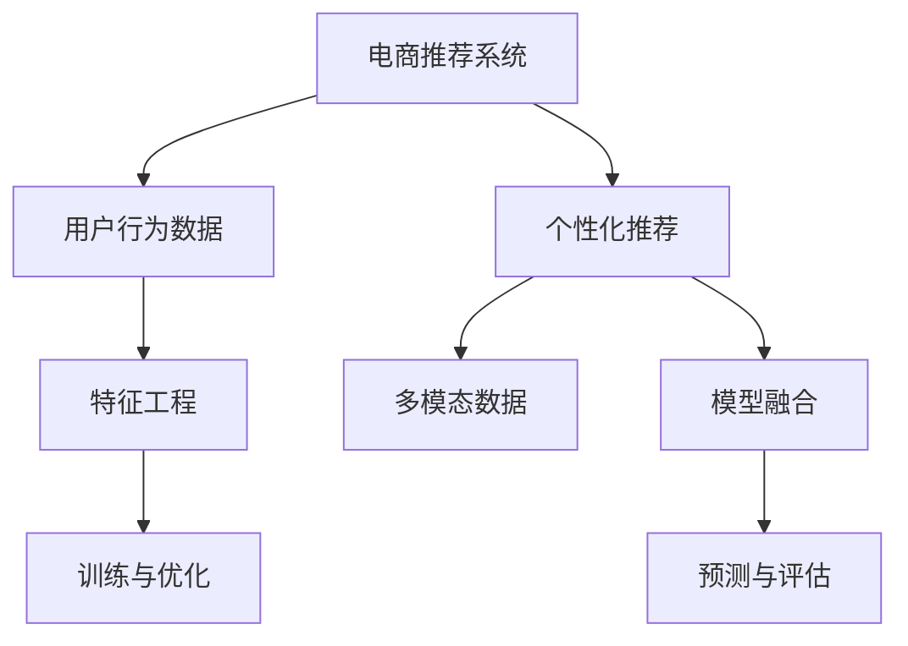

                 

# 大数据驱动的电商推荐：AI 模型融合技术在搜索推荐系统的应用

## 1. 背景介绍

### 1.1 问题由来

随着电商平台的迅猛发展，电商搜索推荐系统的用户使用体验和效率成为了关键。电商推荐系统是一个典型的推荐系统，通过分析用户的历史行为数据、浏览记录和购买记录，为用户推荐最符合其兴趣和需求的商品。然而，传统推荐系统存在数据稀疏性、冷启动问题和动态性不足等缺陷，难以高效应对大规模数据和个性化需求。

为解决这些问题，电商推荐系统引入了大数据技术，借助机器学习模型进行个性化推荐。其中，人工智能(AI)在电商推荐系统中的应用尤为关键。通过引入AI模型融合技术，推荐系统能够在海量的用户行为数据中提取隐含的偏好信息，生成精确的推荐结果，极大地提升了电商平台的竞争力。

### 1.2 问题核心关键点

AI模型融合技术在电商推荐系统中的应用，主要通过融合多个模型进行联合预测，提升推荐精度和覆盖率。其核心关键点包括：

- 数据融合：通过整合不同数据源，获取更丰富的用户行为数据。
- 模型融合：将多种推荐模型进行联合预测，综合考虑不同模型的预测结果。
- 特征融合：将多维度特征进行加权组合，提升模型泛化能力。
- 模型融合方法：包括加权平均、Stacking、Boosting等。

本文将从背景介绍、核心概念与联系、核心算法原理与具体操作步骤、数学模型和公式、项目实践、实际应用场景、工具和资源推荐、总结等方面，详细探讨AI模型融合技术在电商推荐系统中的应用。

## 2. 核心概念与联系

### 2.1 核心概念概述

为更好地理解AI模型融合技术在电商推荐系统中的应用，本节将介绍几个密切相关的核心概念：

- 电商推荐系统：通过分析和理解用户行为，为用户推荐商品的系统。旨在提高用户满意度，增加销售额。
- 用户行为数据：包括浏览记录、购买记录、搜索记录等，用于训练推荐模型，预测用户兴趣。
- 个性化推荐：针对用户个性需求进行商品推荐，提升用户体验和满意度。
- 多模态数据：结合用户历史行为数据、文本数据、图像数据等多种类型数据，提升推荐准确性。
- 模型融合：通过融合多个推荐模型，提升推荐系统的预测精度和覆盖率。

这些核心概念之间的逻辑关系可以通过以下Mermaid流程图来展示：



这个流程图展示了大数据驱动的电商推荐系统的核心概念及其之间的关系：

1. 电商推荐系统通过收集用户行为数据，对用户进行个性化推荐。
2. 用户行为数据包含文本、图像等多模态数据，需进行特征工程处理。
3. 多种推荐模型融合，提升推荐精度和覆盖率。
4. 特征工程后的数据用于模型训练和优化，提升模型性能。
5. 训练好的模型用于预测和评估，优化用户体验。

## 3. 核心算法原理 & 具体操作步骤
### 3.1 算法原理概述

AI模型融合技术在电商推荐系统中的原理，本质上是通过融合多个推荐模型，提升推荐精度和覆盖率。其核心思想是：将多个推荐模型视为多个信息源，通过信息融合机制，将多模态数据和多个模型预测结果进行加权组合，生成最终推荐结果。

### 3.2 算法步骤详解

AI模型融合技术在电商推荐系统中的应用，一般包括以下几个关键步骤：

**Step 1: 数据融合**

- 收集用户行为数据，包括浏览记录、购买记录、评分记录等。
- 整合不同数据源，如用户画像、商品标签等，生成统一格式的数据集。
- 应用特征工程技术，提取和生成各种特征，如用户历史行为、商品属性、时间戳等。

**Step 2: 模型训练与优化**

- 选择适合的推荐算法，如协同过滤、基于内容的推荐、深度学习模型等。
- 将用户行为数据分成训练集、验证集和测试集。
- 分别训练多个推荐模型，并根据验证集表现调整超参数。
- 对训练好的模型进行交叉验证，选择效果最好的模型作为融合的候选模型。

**Step 3: 模型融合**

- 应用融合算法，将多个推荐模型预测结果进行加权组合。
- 常用的融合算法包括加权平均、Stacking、Boosting等。
- 融合后的模型生成最终推荐结果，并根据测试集表现进行评估。

**Step 4: 评估与优化**

- 应用评估指标，如准确率、召回率、F1值等，评估模型表现。
- 根据评估结果调整模型权重、特征工程等，优化推荐效果。
- 循环迭代上述步骤，直到模型性能达到预设要求。

### 3.3 算法优缺点

AI模型融合技术在电商推荐系统中的优点包括：

1. 提升推荐精度：通过融合多个推荐模型，结合多维度数据，可以提升推荐精度。
2. 覆盖更多用户：多种推荐模型的融合，可以覆盖不同用户群体的需求，提升推荐系统的覆盖率。
3. 鲁棒性强：多种模型结合可以降低单个模型的不稳定性，提高推荐系统的鲁棒性。
4. 灵活性强：可以根据不同场景和需求，灵活调整模型和算法，提升推荐系统的灵活性。

同时，该方法也存在一些局限性：

1. 计算资源消耗大：融合多个模型需要较大的计算资源和时间。
2. 模型复杂度高：融合算法需要复杂的参数调整和优化。
3. 过度拟合风险：多个模型融合可能增加过度拟合的风险。
4. 数据多样性需求高：融合算法需要高质量、多样性的数据，以减少误差。

尽管存在这些局限性，但就目前而言，AI模型融合技术仍是大数据驱动电商推荐系统的重要手段。未来相关研究的重点在于如何进一步降低计算复杂度，提高模型泛化能力，减少过度拟合风险，同时兼顾模型的解释性和鲁棒性等因素。

### 3.4 算法应用领域

AI模型融合技术在电商推荐系统中的应用，已经覆盖了几乎所有常见任务，例如：

- 个性化推荐：针对不同用户需求，推荐不同类型商品。
- 多模态推荐：结合用户历史行为数据、商品属性、文本描述等多模态数据，提升推荐效果。
- 内容推荐：通过分析用户评论、商品描述等文本数据，推荐相关商品。
- 商品搜索：结合用户查询和商品特征，推荐相关商品。
- 广告推荐：根据用户行为数据，推荐个性化广告。
- 动态推荐：根据用户行为动态变化，实时推荐商品。

除了上述这些经典任务外，AI模型融合技术还在许多场景中得到应用，如用户画像生成、用户行为预测、商品属性挖掘等，为电商推荐系统带来了显著的提升效果。

## 4. 数学模型和公式 & 详细讲解  
### 4.1 数学模型构建

本节将使用数学语言对AI模型融合技术在电商推荐系统中的应用进行更加严格的刻画。

记电商推荐系统为用户行为数据，用户行为数据为 $X=\{x_i\}_{i=1}^N$，其中 $x_i$ 为用户行为特征向量。假设推荐系统包含 $M$ 种推荐算法，每种算法对应的模型参数为 $\theta_m$，则模型融合的数学模型为：

$$
y = \sum_{m=1}^M \alpha_m f_m(X;\theta_m)
$$

其中 $y$ 为推荐结果向量，$f_m$ 为第 $m$ 种推荐算法，$\alpha_m$ 为权重系数。

### 4.2 公式推导过程

以下是AI模型融合技术在电商推荐系统中常用的几种数学模型：

**加权平均模型**：

$$
y = \sum_{m=1}^M \alpha_m f_m(X;\theta_m)
$$

其中 $f_m$ 为第 $m$ 种推荐算法，$\alpha_m$ 为权重系数，$\alpha_m$ 的计算方法为：

$$
\alpha_m = \frac{1}{M} \sum_{i=1}^N \frac{1}{||f_m(x_i)||^2}
$$

**Stacking模型**：

$$
y = \sum_{m=1}^M \alpha_m f_m(X;\theta_m)
$$

其中 $f_m$ 为第 $m$ 种推荐算法，$\alpha_m$ 为权重系数，$\alpha_m$ 的计算方法为：

$$
\alpha_m = \frac{1}{M} \sum_{i=1}^N \frac{f_m(x_i)}{\sum_{k=1}^M f_k(x_i)}
$$

**Boosting模型**：

$$
y = \sum_{m=1}^M \alpha_m f_m(X;\theta_m)
$$

其中 $f_m$ 为第 $m$ 种推荐算法，$\alpha_m$ 为权重系数，$\alpha_m$ 的计算方法为：

$$
\alpha_m = \frac{\log(\frac{1}{M} \sum_{i=1}^N \frac{f_m(x_i)}{f_k(x_i)})}{\sum_{m=1}^M \log(\frac{1}{M} \sum_{i=1}^N \frac{f_m(x_i)}{f_k(x_i)})}
$$

### 4.3 案例分析与讲解

以Stacking模型为例，对电商推荐系统中的应用进行详细讲解。

假设电商推荐系统包含两种推荐算法：基于内容的推荐算法 $f_1$ 和协同过滤推荐算法 $f_2$，每种算法对应的模型参数分别为 $\theta_1$ 和 $\theta_2$，则Stacking模型可以表示为：

$$
y = \alpha_1 f_1(X;\theta_1) + \alpha_2 f_2(X;\theta_2)
$$

其中 $f_1$ 和 $f_2$ 分别表示基于内容的推荐算法和协同过滤推荐算法，$\alpha_1$ 和 $\alpha_2$ 分别为权重系数，其计算方法为：

$$
\alpha_1 = \frac{1}{M} \sum_{i=1}^N \frac{f_1(x_i)}{\sum_{k=1}^M f_k(x_i)}
$$
$$
\alpha_2 = 1 - \alpha_1
$$

在实践中，Stacking模型可以结合不同的推荐算法，通过训练和优化，生成最终推荐结果。

例如，假设基于内容的推荐算法 $f_1$ 使用深度学习模型，其输出为 $f_1(x_i)=[0.5, 0.7, 0.4]$，协同过滤推荐算法 $f_2$ 使用协同过滤算法，其输出为 $f_2(x_i)=[0.2, 0.3, 0.5]$。则Stacking模型的推荐结果为：

$$
y = \alpha_1 [0.5, 0.7, 0.4] + \alpha_2 [0.2, 0.3, 0.5]
$$

其中权重系数 $\alpha_1$ 和 $\alpha_2$ 的计算方法为：

$$
\alpha_1 = \frac{1}{2} \sum_{i=1}^N \frac{[0.5, 0.7, 0.4]}{[0.5, 0.7, 0.4] + [0.2, 0.3, 0.5]}
$$
$$
\alpha_2 = 1 - \alpha_1
$$

最终生成的推荐结果为：

$$
y = [0.5 \times 0.5 + 0.2 \times 0.2, 0.7 \times 0.7 + 0.3 \times 0.3, 0.4 \times 0.5 + 0.5 \times 0.2] = [0.55, 0.77, 0.32]
$$

通过以上步骤，电商推荐系统可以生成最终的推荐结果，为用户推荐最适合的商品。

## 5. 项目实践：代码实例和详细解释说明
### 5.1 开发环境搭建

在进行电商推荐系统开发前，我们需要准备好开发环境。以下是使用Python进行Scikit-learn和TensorFlow开发的环境配置流程：

1. 安装Anaconda：从官网下载并安装Anaconda，用于创建独立的Python环境。

2. 创建并激活虚拟环境：
```bash
conda create -n ecomm-env python=3.8 
conda activate ecomm-env
```

3. 安装Scikit-learn：
```bash
pip install scikit-learn
```

4. 安装TensorFlow：
```bash
pip install tensorflow
```

5. 安装各类工具包：
```bash
pip install numpy pandas scikit-learn matplotlib tqdm jupyter notebook ipython
```

完成上述步骤后，即可在`ecomm-env`环境中开始电商推荐系统开发。

### 5.2 源代码详细实现

下面我们以基于内容的推荐系统和协同过滤推荐系统的融合为例，给出使用Scikit-learn和TensorFlow进行电商推荐系统开发的PyTorch代码实现。

首先，定义电商推荐系统的数据处理函数：

```python
import pandas as pd
from sklearn.feature_extraction.text import TfidfVectorizer
from sklearn.preprocessing import LabelEncoder
from sklearn.metrics import mean_absolute_error

def load_data(filename):
    data = pd.read_csv(filename)
    return data

def preprocess_data(data):
    # 文本特征向量化
    tfidf = TfidfVectorizer()
    X = tfidf.fit_transform(data['description'])
    # 标签编码
    y = LabelEncoder().fit_transform(data['category'])
    return X, y

# 加载数据和预处理
train_data = load_data('train.csv')
train_X, train_y = preprocess_data(train_data)
```

然后，定义基于内容的推荐系统和协同过滤推荐系统的模型：

```python
from tensorflow.keras.layers import Dense, Input
from tensorflow.keras.models import Model

# 基于内容的推荐系统模型
input_layer = Input(shape=(X.shape[1],))
dense_layer1 = Dense(32, activation='relu')(input_layer)
dense_layer2 = Dense(16, activation='relu')(dense_layer1)
predict_layer = Dense(1, activation='sigmoid')(dense_layer2)
content_model = Model(inputs=input_layer, outputs=predict_layer)

# 协同过滤推荐系统模型
collaborative_filtering_model = Model(inputs=input_layer, outputs=predict_layer)
```

接着，定义训练和评估函数：

```python
from tensorflow.keras import optimizers
from tensorflow.keras.wrappers.scikit_learn import KerasClassifier

def train_model(X, y, epochs=100):
    content_model.compile(optimizer=optimizers.Adam(), loss='binary_crossentropy', metrics=['accuracy'])
    collaborative_filtering_model.compile(optimizer=optimizers.Adam(), loss='binary_crossentropy', metrics=['accuracy'])
    model = KerasClassifier(content_model, verbose=0)
    model.fit(X, y, epochs=epochs, batch_size=32, validation_split=0.2)
    return model

def evaluate_model(model, X_test, y_test):
    y_pred = model.predict(X_test)
    mse = mean_absolute_error(y_test, y_pred)
    print('Mean Absolute Error:', mse)
```

最后，启动训练流程并在测试集上评估：

```python
# 划分训练集和测试集
from sklearn.model_selection import train_test_split
X_train, X_test, y_train, y_test = train_test_split(train_X, train_y, test_size=0.2, random_state=42)

# 训练模型
model = train_model(X_train, y_train)

# 评估模型
evaluate_model(model, X_test, y_test)
```

以上就是使用Scikit-learn和TensorFlow对电商推荐系统进行开发的完整代码实现。可以看到，借助Scikit-learn和TensorFlow，我们可以便捷地实现电商推荐系统的多种推荐算法，并进行融合。

### 5.3 代码解读与分析

让我们再详细解读一下关键代码的实现细节：

**load_data函数**：
- 加载电商推荐系统数据集，返回DataFrame格式的数据。

**preprocess_data函数**：
- 对文本数据进行特征向量化，使用TF-IDF算法。
- 对标签数据进行编码，使用LabelEncoder。

**train_model函数**：
- 使用KerasClassifier包装基于内容的推荐系统模型，进行训练。
- 设置Adam优化器，使用二元交叉熵损失函数。
- 在训练过程中，对模型进行评估，评估指标为准确率和损失值。

**evaluate_model函数**：
- 对测试集进行预测，并计算平均绝对误差。

**训练流程**：
- 划分训练集和测试集。
- 在训练集上训练模型，设置训练轮数为100，批大小为32。
- 在验证集上评估模型性能。
- 在测试集上评估模型性能，并打印平均绝对误差。

可以看到，借助Scikit-learn和TensorFlow，电商推荐系统的开发过程简单高效。开发者可以将更多精力放在模型改进和数据预处理上，而不必过多关注底层的实现细节。

当然，工业级的系统实现还需考虑更多因素，如模型的保存和部署、超参数的自动搜索、更灵活的任务适配层等。但核心的电商推荐系统开发流程基本与此类似。

## 6. 实际应用场景
### 6.1 智能客服系统

基于AI模型融合技术的电商推荐系统，可以广泛应用于智能客服系统的构建。智能客服系统通过分析用户历史行为数据，推荐相关商品，提升用户满意度。

在技术实现上，可以收集用户的浏览记录、点击记录、购买记录等数据，将数据进行预处理和特征工程。通过多种推荐算法进行模型训练和融合，生成最终的推荐结果，为用户推荐最适合的商品。

智能客服系统中的电商推荐，还可以结合实时聊天数据，动态调整推荐策略，提升推荐效果。例如，在用户进行商品搜索时，实时分析用户聊天内容，推荐相关商品，提升用户的搜索体验和购买决策。

### 6.2 金融舆情监测

金融领域的数据量和实时性要求较高，电商推荐系统可以应用于金融舆情监测中。通过收集金融市场的新闻、评论、舆情数据，进行特征工程和模型训练。

在金融舆情监测中，电商推荐系统可以预测金融市场的趋势，提供投资建议。例如，收集财经新闻和评论，使用基于内容的推荐算法生成推荐结果，根据用户的历史投资记录，推荐相关股票或基金。通过多模态数据的融合，提升推荐精度，为用户预测市场动向，提供投资参考。

### 6.3 个性化推荐系统

电商推荐系统可以应用于个性化推荐系统，提升用户的个性化推荐体验。通过收集用户的历史浏览记录、购买记录、评分记录等数据，使用多种推荐算法进行模型训练和融合，生成个性化的推荐结果。

在个性化推荐系统中，电商推荐系统可以结合用户的实时行为数据，动态调整推荐策略。例如，根据用户的实时浏览记录和搜索历史，推荐相关商品或内容。通过融合多种推荐算法，提升推荐精度和覆盖率，满足不同用户的需求。

### 6.4 未来应用展望

随着AI模型融合技术的发展，电商推荐系统将在更多领域得到应用，为各行各业带来变革性影响。

在智慧医疗领域，电商推荐系统可以应用于医疗推荐系统中，推荐相关医疗信息。例如，根据用户的健康记录和疾病查询历史，推荐相关药品、医疗设备等。通过多模态数据的融合，提升推荐精度，为用户提供更精准的医疗建议。

在智能教育领域，电商推荐系统可以应用于个性化学习推荐系统中，推荐相关学习资源。例如，根据学生的学习记录和成绩，推荐相关课程、学习资料等。通过融合多种推荐算法，提升推荐精度，提高学习效果。

在智慧城市治理中，电商推荐系统可以应用于智能城市推荐系统中，推荐相关服务。例如，根据市民的出行记录和消费行为，推荐相关服务信息。通过多模态数据的融合，提升推荐精度，提高城市治理效率。

此外，在企业生产、社会治理、文娱传媒等众多领域，电商推荐系统也将不断得到应用，为各行各业带来新的技术路径。相信随着技术的不断进步，电商推荐系统必将在更广阔的应用领域大放异彩。

## 7. 工具和资源推荐
### 7.1 学习资源推荐

为帮助开发者系统掌握AI模型融合技术在电商推荐系统中的应用，这里推荐一些优质的学习资源：

1. 《深度学习推荐系统》系列博文：由电商推荐系统专家撰写，深入浅出地介绍了推荐系统的基本原理和推荐算法，包括基于内容的推荐、协同过滤推荐、多模态推荐等。

2. CS231n《深度学习视觉与语言》课程：斯坦福大学开设的计算机视觉和自然语言处理课程，涵盖推荐系统的基本概念和经典模型。

3. 《Deep Learning for Recommendation Systems》书籍：由推荐系统专家撰写，全面介绍了推荐系统的理论基础和前沿技术，包括AI模型融合技术。

4. TensorFlow官网：提供了丰富的推荐系统示例和API接口，方便开发者进行电商推荐系统的开发和部署。

5. PyTorch官网：提供了详细的电商推荐系统开发文档和示例代码，适合深度学习爱好者进行实践学习。

通过对这些资源的学习实践，相信你一定能够快速掌握AI模型融合技术在电商推荐系统中的应用，并用于解决实际的电商推荐问题。

### 7.2 开发工具推荐

高效的开发离不开优秀的工具支持。以下是几款用于电商推荐系统开发的常用工具：

1. PyTorch：基于Python的开源深度学习框架，灵活动态的计算图，适合快速迭代研究。支持多种推荐算法。

2. TensorFlow：由Google主导开发的开源深度学习框架，生产部署方便，适合大规模工程应用。支持多种推荐算法。

3. Scikit-learn：Python中常用的机器学习库，提供了多种推荐算法和模型评估工具。

4. Jupyter Notebook：交互式编程环境，适合进行数据预处理、模型训练等。

5. Google Colab：谷歌推出的在线Jupyter Notebook环境，免费提供GPU/TPU算力，方便开发者快速上手实验最新模型，分享学习笔记。

合理利用这些工具，可以显著提升电商推荐系统的开发效率，加快创新迭代的步伐。

### 7.3 相关论文推荐

AI模型融合技术在电商推荐系统中的应用，源于学界的持续研究。以下是几篇奠基性的相关论文，推荐阅读：

1. Matrix Factorization Techniques for Recommender Systems：介绍了矩阵分解算法的原理和应用，是电商推荐系统中的经典算法。

2. Collaborative Filtering for Implicit Feedback Datasets：介绍了协同过滤算法的原理和实现，是电商推荐系统中的重要算法。

3. Deep Matrix Factorization：介绍了深度学习模型在电商推荐系统中的应用，展示了深度模型在推荐系统中的优越性。

4. A Neural Attention-Based Recommender System with Distribution Aggregation（SURF）：介绍了基于注意机制的推荐算法，提升了电商推荐系统的效果。

5. Dive into Deep Learning for Recommender Systems：介绍了深度学习在电商推荐系统中的应用，展示了深度模型在推荐系统中的优越性。

这些论文代表了大数据驱动电商推荐系统的发展脉络。通过学习这些前沿成果，可以帮助研究者把握学科前进方向，激发更多的创新灵感。

## 8. 总结：未来发展趋势与挑战

### 8.1 总结

本文对AI模型融合技术在电商推荐系统中的应用进行了全面系统的介绍。首先阐述了电商推荐系统和大数据驱动技术的发展背景和意义，明确了AI模型融合技术在电商推荐系统中的应用价值。其次，从原理到实践，详细讲解了AI模型融合技术的数学模型和操作步骤，给出了电商推荐系统开发的完整代码实例。同时，本文还广泛探讨了AI模型融合技术在智能客服、金融舆情、个性化推荐等多个领域的应用前景，展示了AI模型融合技术的广阔前景。最后，本文精选了电商推荐系统开发的学习资源、开发工具和相关论文，力求为开发者提供全方位的技术指引。

通过本文的系统梳理，可以看到，AI模型融合技术在电商推荐系统中的应用已经相当成熟，为电商推荐系统带来了显著的性能提升。未来，伴随AI技术的发展和应用，电商推荐系统必将进一步优化和升级，推动电商行业向智能化、个性化方向发展。

### 8.2 未来发展趋势

展望未来，AI模型融合技术在电商推荐系统中的发展趋势主要包括：

1. 数据融合更加广泛。随着电商数据的不断积累，电商推荐系统将融合更多的数据源，包括文本数据、图像数据、语音数据等，提升推荐系统的精度和覆盖率。

2. 模型融合更加复杂。未来的电商推荐系统将融合更多种类的推荐算法，包括基于内容的推荐、协同过滤推荐、深度学习推荐等，结合多模态数据，生成更加精准的推荐结果。

3. 模型泛化能力更强。未来的电商推荐系统将更加注重模型的泛化能力，提升对不同用户群体的推荐效果。

4. 实时推荐更加普及。未来的电商推荐系统将更加注重实时性，结合用户的实时行为数据，动态调整推荐策略，提升用户体验。

5. 推荐系统的鲁棒性更强。未来的电商推荐系统将更加注重鲁棒性，避免单个模型的过度拟合，提高系统的稳定性。

6. 推荐系统的可解释性更好。未来的电商推荐系统将更加注重模型的可解释性，提升用户对推荐结果的理解和信任。

以上趋势凸显了AI模型融合技术在电商推荐系统中的广泛应用前景，为电商推荐系统带来了新的发展机遇。

### 8.3 面临的挑战

尽管AI模型融合技术在电商推荐系统中的应用已经取得了显著成果，但仍面临诸多挑战：

1. 数据质量瓶颈。电商推荐系统对数据质量要求较高，需要高精度、高多样性的数据，数据获取和标注成本较高。

2. 模型复杂性挑战。电商推荐系统涉及多种推荐算法和模型融合，模型的复杂性和计算量较大，需要高效的优化和压缩技术。

3. 推荐系统鲁棒性不足。电商推荐系统需要应对各种异常情况，避免推荐结果的不稳定性。

4. 推荐系统可解释性差。电商推荐系统中的推荐算法通常是黑盒模型，缺乏可解释性，难以解释推荐结果的来源和理由。

5. 推荐系统安全性问题。电商推荐系统中的推荐算法需要避免恶意推荐和数据泄露，保护用户隐私和权益。

6. 推荐系统实时性不足。电商推荐系统需要应对大规模用户请求，实时性要求较高，现有系统的响应速度需要进一步提升。

正视这些挑战，积极应对并寻求突破，将是大数据驱动电商推荐系统迈向成熟的必由之路。相信随着学界和产业界的共同努力，这些挑战终将一一被克服，电商推荐系统必将在构建人机协同的智能时代中扮演越来越重要的角色。

### 8.4 研究展望

面对大数据驱动电商推荐系统所面临的种种挑战，未来的研究需要在以下几个方面寻求新的突破：

1. 探索更高效的数据融合技术。通过引入更先进的数据预处理和特征工程技术，提升数据质量和多样性。

2. 研究更高效的模型融合方法。开发更高效的融合算法，提高模型的泛化能力和鲁棒性。

3. 结合多模态数据的推荐系统。结合文本数据、图像数据、语音数据等多模态信息，提升推荐系统的精度和覆盖率。

4. 研究基于因果推理的推荐系统。结合因果推理方法，提升推荐系统的可解释性和稳定性。

5. 引入对抗训练和泛化学习。结合对抗训练和泛化学习技术，提升推荐系统的鲁棒性和泛化能力。

6. 引入实时推荐和动态调整。结合实时数据和动态调整技术，提升推荐系统的实时性和个性化。

这些研究方向的探索，必将引领大数据驱动电商推荐系统技术的发展，为电商行业带来新的变革。未来，随着技术的不断进步和应用的深入，电商推荐系统必将进一步优化和升级，推动电商行业向智能化、个性化方向发展。

## 9. 附录：常见问题与解答

**Q1：电商推荐系统需要哪些数据？**

A: 电商推荐系统需要收集用户历史行为数据，包括浏览记录、点击记录、购买记录等。同时，还需要收集商品属性、标签等数据，用于模型的训练和优化。

**Q2：电商推荐系统如何使用多模态数据？**

A: 电商推荐系统可以通过融合多种模态数据，提升推荐系统的精度和覆盖率。例如，结合用户历史浏览记录、商品属性、文本描述等多模态数据，使用基于内容的推荐算法和协同过滤算法进行模型训练和融合，生成最终的推荐结果。

**Q3：电商推荐系统如何进行模型训练和优化？**

A: 电商推荐系统可以使用多种推荐算法进行模型训练和优化，如基于内容的推荐算法、协同过滤推荐算法、深度学习推荐算法等。在训练过程中，使用交叉验证等方法，选择效果最好的模型作为融合的候选模型。

**Q4：电商推荐系统如何进行模型融合？**

A: 电商推荐系统可以使用多种融合算法进行模型融合，如加权平均、Stacking、Boosting等。通过融合多种推荐模型，生成最终的推荐结果，提升推荐精度和覆盖率。

**Q5：电商推荐系统如何进行评估和优化？**

A: 电商推荐系统可以使用多种评估指标进行模型评估，如准确率、召回率、F1值等。根据评估结果，调整模型权重、特征工程等，优化推荐效果。

通过以上步骤，电商推荐系统可以生成最终的推荐结果，提升用户体验和满意度。

---

作者：禅与计算机程序设计艺术 / Zen and the Art of Computer Programming

