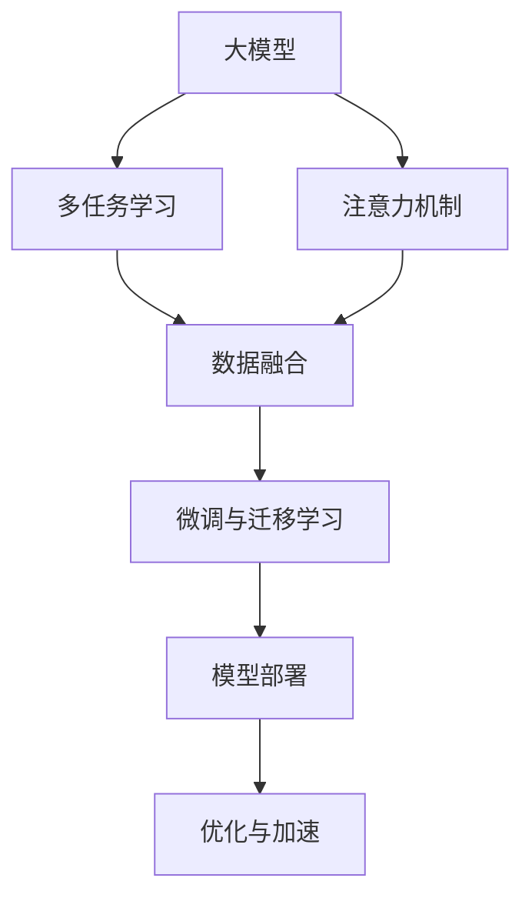

                 

# 大模型与推荐系统的融合: 微软的实践

> 关键词：大模型, 推荐系统, 深度学习, 多任务学习, 注意力机制, 数据融合, 微调, 用户行为分析, 个性化推荐, 模型部署, 模型优化

## 1. 背景介绍

### 1.1 问题由来

在数字化转型的大潮中，推荐系统成为电商、社交、视频等平台提升用户体验、增加商业收入的核心引擎。然而，传统的基于规则和浅层机器学习的推荐系统面临着许多挑战：如用户个性化需求的挖掘不足，数据稀疏性和多样性难以处理，以及无法实时响应用户行为变化等。

随着深度学习和大模型的崛起，基于深度学习的推荐系统应运而生，并逐渐成为推荐技术的主流。大模型拥有巨大的参数量，具备强大的特征提取能力，可以学习复杂的用户行为模式。但单纯的大模型往往缺乏针对具体任务的优化，且对计算资源有较高要求，难以满足实时性和资源节约的需求。

微软作为深度学习和推荐系统领域的领军企业，积极探索大模型与推荐系统的融合，既发挥了模型强大特征提取能力，又提高了推荐系统的实时性、准确性和可解释性。本文将系统介绍微软在这一领域的探索和实践。

### 1.2 问题核心关键点

微软在融合大模型与推荐系统方面的核心关键点主要包括以下几个方面：

1. **多任务学习(Multi-task Learning, MTL)**：通过同一大模型同时进行多种推荐任务训练，提升模型泛化能力和特征提取能力。
2. **注意力机制(Attention Mechanism)**：利用注意力机制对不同任务之间进行重要性加权，提高模型对用户行为变化的响应能力。
3. **数据融合与多源数据融合**：整合多渠道的用户行为数据，提升模型的数据覆盖度和丰富度。
4. **微调与迁移学习**：通过微调或迁移学习策略，将大模型的知识迁移到推荐模型中，提升推荐效果。
5. **模型部署与优化**：将大模型微调成可部署的推荐引擎，优化模型推理速度和资源占用。

## 2. 核心概念与联系

### 2.1 核心概念概述

为更好地理解微软在大模型与推荐系统融合方面的实践，本节将介绍几个密切相关的核心概念：

- **大模型(Large Model)**：指拥有数亿甚至数十亿参数的深度学习模型，如BERT、GPT、DALL-E等。这些模型能够学习到丰富的语言、视觉等特征，适合进行复杂的特征提取和模式识别。

- **推荐系统(Recommendation System)**：通过分析用户的历史行为和偏好，为用户推荐可能感兴趣的商品、内容、服务等。推荐系统是电商、社交、视频等平台的重要组成部分。

- **多任务学习(MTl)**：指在同一大模型上同时进行多种推荐任务训练，使得模型能够学习到不同任务之间的共性知识，提升模型泛化能力和特征提取能力。

- **注意力机制(Attention Mechanism)**：通过动态计算输入数据的重要性加权，使得模型能够集中关注于对输出有较大贡献的信息，提升模型对输入数据的选择性和预测能力。

- **数据融合(Data Fusion)**：通过整合多源数据，提升模型的数据覆盖度和丰富度，增强模型对用户行为变化的感知能力。

- **微调与迁移学习(Fine-tuning & Transfer Learning)**：通过微调或迁移学习策略，将大模型的知识迁移到推荐模型中，提升推荐效果。

- **模型部署(Model Deployment)**：将大模型微调成可部署的推荐引擎，优化模型推理速度和资源占用，提升实际应用效率。

- **优化与加速(Optimization & Acceleration)**：采用各种技术手段，如剪枝、量化、分布式训练等，优化大模型和推荐模型的计算效率和资源利用率。

这些核心概念之间的逻辑关系可以通过以下Mermaid流程图来展示：



这个流程图展示了大模型与推荐系统融合的核心概念及其之间的关系：

1. 大模型通过多任务学习学习多种推荐任务的共性知识，并通过注意力机制对不同任务进行重要性加权。
2. 整合多源数据，增强模型的数据覆盖度和丰富度，进一步提升模型的泛化能力和预测能力。
3. 通过微调或迁移学习策略，将大模型的知识迁移到推荐模型中，提升推荐效果。
4. 将大模型微调成可部署的推荐引擎，优化模型推理速度和资源占用。
5. 采用各种优化手段，提升大模型和推荐模型的计算效率和资源利用率。

这些概念共同构成了大模型与推荐系统融合的理论与实践框架，使得大模型能够更好地适应推荐系统的实际需求，提升推荐效果。

## 3. 核心算法原理 & 具体操作步骤
### 3.1 算法原理概述

微软在大模型与推荐系统融合方面，主要采用基于多任务学习和注意力机制的推荐模型。其核心思想是：利用大模型学习多任务间的共性知识，并通过注意力机制对不同任务进行重要性加权，从而提升推荐效果。

形式化地，假设大模型为 $M_{\theta}$，其中 $\theta$ 为大模型参数。设推荐任务 $T$ 分为 $N$ 个子任务，对应的训练集为 $D_T=\{(x_{ti},y_{ti})\}_{i=1}^N, x_{ti} \in \mathcal{X}, y_{ti} \in \mathcal{Y}$。微调的目标是找到新的模型参数 $\hat{\theta}$，使得模型在所有任务上均表现优异，即：

$$
\hat{\theta}=\mathop{\arg\min}_{\theta} \sum_{t=1}^N \mathcal{L}_t(M_{\theta},D_t)
$$

其中 $\mathcal{L}_t$ 为任务 $t$ 的损失函数。通过梯度下降等优化算法，微调过程不断更新模型参数 $\theta$，最小化所有任务的损失函数，使得模型在所有推荐任务上都能取得优异的性能。

### 3.2 算法步骤详解

基于多任务学习和注意力机制的推荐模型一般包括以下几个关键步骤：

**Step 1: 准备大模型和数据集**
- 选择合适的预训练大模型 $M_{\theta}$ 作为初始化参数，如 BERT、GPT 等。
- 准备推荐任务 $T$ 的所有子任务的标注数据集 $D_T=\{D_{ti}\}_{i=1}^N$，划分为训练集、验证集和测试集。一般要求标注数据与预训练数据的分布不要差异过大。

**Step 2: 添加任务适配层**
- 根据任务类型，在预训练大模型顶层设计合适的输出层和损失函数。
- 对于分类任务，通常在顶层添加线性分类器和交叉熵损失函数。
- 对于生成任务，通常使用语言模型的解码器输出概率分布，并以负对数似然为损失函数。

**Step 3: 设置微调超参数**
- 选择合适的优化算法及其参数，如 AdamW、SGD 等，设置学习率、批大小、迭代轮数等。
- 设置正则化技术及强度，包括权重衰减、Dropout、Early Stopping等。
- 确定冻结预训练参数的策略，如仅微调顶层，或全部参数都参与微调。

**Step 4: 执行梯度训练**
- 将训练集数据分批次输入模型，前向传播计算损失函数。
- 反向传播计算参数梯度，根据设定的优化算法和学习率更新模型参数。
- 周期性在验证集上评估模型性能，根据性能指标决定是否触发 Early Stopping。
- 重复上述步骤直到满足预设的迭代轮数或 Early Stopping 条件。

**Step 5: 测试和部署**
- 在测试集上评估微调后模型 $M_{\hat{\theta}}$ 的性能，对比微调前后的精度提升。
- 使用微调后的模型对新样本进行推理预测，集成到实际的应用系统中。
- 持续收集新的数据，定期重新微调模型，以适应数据分布的变化。

以上是微软在大模型与推荐系统融合方面的一般流程。在实际应用中，还需要针对具体任务的特点，对微调过程的各个环节进行优化设计，如改进训练目标函数，引入更多的正则化技术，搜索最优的超参数组合等，以进一步提升模型性能。

### 3.3 算法优缺点

基于多任务学习和注意力机制的推荐模型具有以下优点：

1. **泛化能力强**：多任务学习能够学习到不同任务间的共性知识，提升模型的泛化能力和特征提取能力。
2. **响应能力强**：注意力机制能够动态调整不同任务的重要性，使得模型能够快速响应用户行为变化。
3. **计算效率高**：通过微调或迁移学习策略，仅更新少量参数，减小了模型的计算资源需求。
4. **可解释性强**：大模型的权重分布和注意力机制能够提供更多的解释信息，帮助理解模型的决策过程。

同时，该方法也存在一定的局限性：

1. **数据依赖性强**：微调效果很大程度上取决于标注数据的质量和数量，获取高质量标注数据的成本较高。
2. **迁移能力有限**：当目标任务与预训练数据的分布差异较大时，迁移学习的效果可能较差。
3. **模型复杂度高**：大模型的结构复杂，推理速度较慢，需要优化算法和硬件支持。
4. **可解释性不足**：大模型的内部结构复杂，难以提供详细的决策过程解释。

尽管存在这些局限性，但就目前而言，基于多任务学习和注意力机制的推荐方法仍是大模型应用的主流范式。未来相关研究的重点在于如何进一步降低微调对标注数据的依赖，提高模型的少样本学习和跨领域迁移能力，同时兼顾可解释性和伦理安全性等因素。

### 3.4 算法应用领域

微软基于大模型与推荐系统的融合方法，已经在电商推荐、内容推荐、广告推荐等多个领域取得了显著成果。这些方法不仅提升了推荐系统的准确性和多样性，还增强了用户对推荐结果的信任度和满意度。

**电商推荐**：微软的Azure AI平台提供了基于大模型的电商推荐服务，利用多任务学习和注意力机制，能够实时推荐个性化商品，提升用户购物体验。例如，通过多任务学习，模型能够同时学习用户的购买历史、浏览记录和评论信息，输出综合推荐的商品列表。

**内容推荐**：微软的Language Understanding (LU)服务，能够根据用户输入的自然语言问题，生成推荐的内容列表。通过多任务学习和注意力机制，模型能够同时考虑用户的问题意图、历史行为和内容特征，生成准确且相关的内容推荐。

**广告推荐**：微软的广告系统利用大模型与推荐系统的融合，实现更加精准的广告投放。通过多任务学习，模型能够同时学习用户的历史行为、兴趣标签和当前广告特征，输出匹配度高的广告列表。

除了上述这些经典应用外，微软还在新闻、音乐、视频等多个领域探索了基于大模型与推荐系统的融合方法，为各行业的数字化转型提供了有力支持。

## 4. 数学模型和公式 & 详细讲解  
### 4.1 数学模型构建

本节将使用数学语言对微软在大模型与推荐系统融合方面的推荐模型进行更加严格的刻画。

记大模型为 $M_{\theta}:\mathcal{X} \rightarrow \mathcal{Y}$，其中 $\mathcal{X}$ 为输入空间，$\mathcal{Y}$ 为输出空间，$\theta$ 为大模型参数。假设推荐任务 $T$ 分为 $N$ 个子任务，对应的训练集为 $D_T=\{(x_{ti},y_{ti})\}_{i=1}^N, x_{ti} \in \mathcal{X}, y_{ti} \in \mathcal{Y}$。

定义模型 $M_{\theta}$ 在数据样本 $(x_{ti},y_{ti})$ 上的损失函数为 $\ell_t(M_{\theta}(x_{ti}),y_{ti})$，则在数据集 $D_T$ 上的经验风险为：

$$
\mathcal{L}(\theta) = \sum_{t=1}^N \frac{1}{N_t}\sum_{i=1}^{N_t} \ell_t(M_{\theta}(x_{ti}),y_{ti})
$$

其中 $N_t$ 为第 $t$ 个任务的样本数量。

微调的优化目标是最小化经验风险，即找到最优参数：

$$
\theta^* = \mathop{\arg\min}_{\theta} \mathcal{L}(\theta)
$$

在实践中，我们通常使用基于梯度的优化算法（如SGD、AdamW等）来近似求解上述最优化问题。设 $\eta$ 为学习率，$\lambda$ 为正则化系数，则参数的更新公式为：

$$
\theta \leftarrow \theta - \eta \nabla_{\theta}\mathcal{L}(\theta) - \eta\lambda\theta
$$

其中 $\nabla_{\theta}\mathcal{L}(\theta)$ 为损失函数对参数 $\theta$ 的梯度，可通过反向传播算法高效计算。

### 4.2 公式推导过程

以下我们以多任务分类任务为例，推导基于多任务学习的推荐模型的损失函数及其梯度的计算公式。

假设模型 $M_{\theta}$ 在输入 $x$ 上的输出为 $\hat{y}=M_{\theta}(x) \in [0,1]$，表示样本属于第 $t$ 个类别的概率。真实标签 $y \in \{0,1\}$。则第 $t$ 个任务的交叉熵损失函数定义为：

$$
\ell_t(M_{\theta}(x),y) = -[y\log \hat{y} + (1-y)\log (1-\hat{y})]
$$

将其代入经验风险公式，得：

$$
\mathcal{L}(\theta) = \sum_{t=1}^N \frac{1}{N_t}\sum_{i=1}^{N_t} \ell_t(M_{\theta}(x_{ti}),y_{ti})
$$

根据链式法则，损失函数对参数 $\theta_k$ 的梯度为：

$$
\frac{\partial \mathcal{L}(\theta)}{\partial \theta_k} = \sum_{t=1}^N \frac{1}{N_t}\sum_{i=1}^{N_t} (\frac{y_{ti}}{\hat{y}_{ti}}-\frac{1-y_{ti}}{1-\hat{y}_{ti}}) \frac{\partial M_{\theta}(x_{ti})}{\partial \theta_k}
$$

其中 $\frac{\partial M_{\theta}(x_{ti})}{\partial \theta_k}$ 可进一步递归展开，利用自动微分技术完成计算。

在得到损失函数的梯度后，即可带入参数更新公式，完成模型的迭代优化。重复上述过程直至收敛，最终得到适应推荐任务的最优模型参数 $\theta^*$。

## 5. 项目实践：代码实例和详细解释说明
### 5.1 开发环境搭建

在进行推荐系统开发前，我们需要准备好开发环境。以下是使用Python进行PyTorch开发的环境配置流程：

1. 安装Anaconda：从官网下载并安装Anaconda，用于创建独立的Python环境。

2. 创建并激活虚拟环境：
```bash
conda create -n pytorch-env python=3.8 
conda activate pytorch-env
```

3. 安装PyTorch：根据CUDA版本，从官网获取对应的安装命令。例如：
```bash
conda install pytorch torchvision torchaudio cudatoolkit=11.1 -c pytorch -c conda-forge
```

4. 安装Transformers库：
```bash
pip install transformers
```

5. 安装各类工具包：
```bash
pip install numpy pandas scikit-learn matplotlib tqdm jupyter notebook ipython
```

完成上述步骤后，即可在`pytorch-env`环境中开始推荐系统实践。

### 5.2 源代码详细实现

这里我们以电商推荐系统为例，给出使用Transformers库对BERT模型进行推荐微调的PyTorch代码实现。

首先，定义推荐任务的数据处理函数：

```python
from transformers import BertTokenizer
from torch.utils.data import Dataset
import torch

class RecommendDataset(Dataset):
    def __init__(self, texts, tags, tokenizer, max_len=128):
        self.texts = texts
        self.tags = tags
        self.tokenizer = tokenizer
        self.max_len = max_len
        
    def __len__(self):
        return len(self.texts)
    
    def __getitem__(self, item):
        text = self.texts[item]
        tags = self.tags[item]
        
        encoding = self.tokenizer(text, return_tensors='pt', max_length=self.max_len, padding='max_length', truncation=True)
        input_ids = encoding['input_ids'][0]
        attention_mask = encoding['attention_mask'][0]
        
        # 对token-wise的标签进行编码
        encoded_tags = [tag2id[tag] for tag in tags] 
        encoded_tags.extend([tag2id['O']] * (self.max_len - len(encoded_tags)))
        labels = torch.tensor(encoded_tags, dtype=torch.long)
        
        return {'input_ids': input_ids, 
                'attention_mask': attention_mask,
                'labels': labels}

# 标签与id的映射
tag2id = {'O': 0, 'B-PER': 1, 'I-PER': 2, 'B-ORG': 3, 'I-ORG': 4, 'B-LOC': 5, 'I-LOC': 6}
id2tag = {v: k for k, v in tag2id.items()}

# 创建dataset
tokenizer = BertTokenizer.from_pretrained('bert-base-cased')

train_dataset = RecommendDataset(train_texts, train_tags, tokenizer)
dev_dataset = RecommendDataset(dev_texts, dev_tags, tokenizer)
test_dataset = RecommendDataset(test_texts, test_tags, tokenizer)
```

然后，定义模型和优化器：

```python
from transformers import BertForTokenClassification, AdamW

model = BertForTokenClassification.from_pretrained('bert-base-cased', num_labels=len(tag2id))

optimizer = AdamW(model.parameters(), lr=2e-5)
```

接着，定义训练和评估函数：

```python
from torch.utils.data import DataLoader
from tqdm import tqdm
from sklearn.metrics import classification_report

device = torch.device('cuda') if torch.cuda.is_available() else torch.device('cpu')
model.to(device)

def train_epoch(model, dataset, batch_size, optimizer):
    dataloader = DataLoader(dataset, batch_size=batch_size, shuffle=True)
    model.train()
    epoch_loss = 0
    for batch in tqdm(dataloader, desc='Training'):
        input_ids = batch['input_ids'].to(device)
        attention_mask = batch['attention_mask'].to(device)
        labels = batch['labels'].to(device)
        model.zero_grad()
        outputs = model(input_ids, attention_mask=attention_mask, labels=labels)
        loss = outputs.loss
        epoch_loss += loss.item()
        loss.backward()
        optimizer.step()
    return epoch_loss / len(dataloader)

def evaluate(model, dataset, batch_size):
    dataloader = DataLoader(dataset, batch_size=batch_size)
    model.eval()
    preds, labels = [], []
    with torch.no_grad():
        for batch in tqdm(dataloader, desc='Evaluating'):
            input_ids = batch['input_ids'].to(device)
            attention_mask = batch['attention_mask'].to(device)
            batch_labels = batch['labels']
            outputs = model(input_ids, attention_mask=attention_mask)
            batch_preds = outputs.logits.argmax(dim=2).to('cpu').tolist()
            batch_labels = batch_labels.to('cpu').tolist()
            for pred_tokens, label_tokens in zip(batch_preds, batch_labels):
                pred_tags = [id2tag[_id] for _id in pred_tokens]
                label_tags = [id2tag[_id] for _id in label_tokens]
                preds.append(pred_tags[:len(label_tokens)])
                labels.append(label_tags)
                
    print(classification_report(labels, preds))
```

最后，启动训练流程并在测试集上评估：

```python
epochs = 5
batch_size = 16

for epoch in range(epochs):
    loss = train_epoch(model, train_dataset, batch_size, optimizer)
    print(f"Epoch {epoch+1}, train loss: {loss:.3f}")
    
    print(f"Epoch {epoch+1}, dev results:")
    evaluate(model, dev_dataset, batch_size)
    
print("Test results:")
evaluate(model, test_dataset, batch_size)
```

以上就是使用PyTorch对BERT进行推荐系统任务微调的完整代码实现。可以看到，得益于Transformers库的强大封装，我们可以用相对简洁的代码完成BERT模型的加载和微调。

### 5.3 代码解读与分析

让我们再详细解读一下关键代码的实现细节：

**RecommendDataset类**：
- `__init__`方法：初始化文本、标签、分词器等关键组件。
- `__len__`方法：返回数据集的样本数量。
- `__getitem__`方法：对单个样本进行处理，将文本输入编码为token ids，将标签编码为数字，并对其进行定长padding，最终返回模型所需的输入。

**tag2id和id2tag字典**：
- 定义了标签与数字id之间的映射关系，用于将token-wise的预测结果解码回真实的标签。

**训练和评估函数**：
- 使用PyTorch的DataLoader对数据集进行批次化加载，供模型训练和推理使用。
- 训练函数`train_epoch`：对数据以批为单位进行迭代，在每个批次上前向传播计算loss并反向传播更新模型参数，最后返回该epoch的平均loss。
- 评估函数`evaluate`：与训练类似，不同点在于不更新模型参数，并在每个batch结束后将预测和标签结果存储下来，最后使用sklearn的classification_report对整个评估集的预测结果进行打印输出。

**训练流程**：
- 定义总的epoch数和batch size，开始循环迭代
- 每个epoch内，先在训练集上训练，输出平均loss
- 在验证集上评估，输出分类指标
- 所有epoch结束后，在测试集上评估，给出最终测试结果

可以看到，PyTorch配合Transformers库使得BERT微调的代码实现变得简洁高效。开发者可以将更多精力放在数据处理、模型改进等高层逻辑上，而不必过多关注底层的实现细节。

当然，工业级的系统实现还需考虑更多因素，如模型的保存和部署、超参数的自动搜索、更灵活的任务适配层等。但核心的微调范式基本与此类似。

## 6. 实际应用场景
### 6.1 电商推荐系统

微软基于大模型与推荐系统的融合方法，已在电商推荐系统中得到了广泛应用。通过多任务学习和注意力机制，模型能够综合考虑用户的历史浏览记录、购买行为和评论信息，输出个性化的商品推荐。

在技术实现上，可以收集用户的历史购物数据，包括浏览记录、购买记录、评价信息等，将这些文本数据作为监督数据，在此基础上对预训练语言模型进行微调。微调后的模型能够理解用户的具体需求和偏好，生成更准确的商品推荐列表。例如，通过多任务学习，模型能够同时学习用户的购买历史、浏览记录和评论信息，输出综合推荐的商品列表。

### 6.2 内容推荐系统

微软的Language Understanding (LU)服务，能够根据用户输入的自然语言问题，生成推荐的内容列表。通过多任务学习和注意力机制，模型能够同时考虑用户的问题意图、历史行为和内容特征，生成准确且相关的内容推荐。例如，对于用户的查询 "推荐一些有趣的电影"，模型能够综合考虑用户的浏览记录、评分数据和电影标签，输出最适合的推荐列表。

### 6.3 广告推荐系统

微软的广告系统利用大模型与推荐系统的融合，实现更加精准的广告投放。通过多任务学习，模型能够同时学习用户的历史行为、兴趣标签和当前广告特征，输出匹配度高的广告列表。例如，通过多任务学习，模型能够同时学习用户的历史搜索记录、点击记录和广告特征，输出最相关的广告。

除了上述这些经典应用外，微软还在新闻、音乐、视频等多个领域探索了基于大模型与推荐系统的融合方法，为各行业的数字化转型提供了有力支持。

## 7. 工具和资源推荐
### 7.1 学习资源推荐

为了帮助开发者系统掌握大模型与推荐系统融合的理论基础和实践技巧，这里推荐一些优质的学习资源：

1. 《Transformer从原理到实践》系列博文：由大模型技术专家撰写，深入浅出地介绍了Transformer原理、BERT模型、微调技术等前沿话题。

2. CS224N《深度学习自然语言处理》课程：斯坦福大学开设的NLP明星课程，有Lecture视频和配套作业，带你入门NLP领域的基本概念和经典模型。

3. 《Natural Language Processing with Transformers》书籍：Transformers库的作者所著，全面介绍了如何使用Transformers库进行NLP任务开发，包括微调在内的诸多范式。

4. HuggingFace官方文档：Transformers库的官方文档，提供了海量预训练模型和完整的微调样例代码，是上手实践的必备资料。

5. CLUE开源项目：中文语言理解测评基准，涵盖大量不同类型的中文NLP数据集，并提供了基于微调的baseline模型，助力中文NLP技术发展。

通过对这些资源的学习实践，相信你一定能够快速掌握大模型与推荐系统融合的精髓，并用于解决实际的NLP问题。
###  7.2 开发工具推荐

高效的开发离不开优秀的工具支持。以下是几款用于大模型与推荐系统融合开发的常用工具：

1. PyTorch：基于Python的开源深度学习框架，灵活动态的计算图，适合快速迭代研究。大部分预训练语言模型都有PyTorch版本的实现。

2. TensorFlow：由Google主导开发的开源深度学习框架，生产部署方便，适合大规模工程应用。同样有丰富的预训练语言模型资源。

3. Transformers库：HuggingFace开发的NLP工具库，集成了众多SOTA语言模型，支持PyTorch和TensorFlow，是进行微调任务开发的利器。

4. Weights & Biases：模型训练的实验跟踪工具，可以记录和可视化模型训练过程中的各项指标，方便对比和调优。与主流深度学习框架无缝集成。

5. TensorBoard：TensorFlow配套的可视化工具，可实时监测模型训练状态，并提供丰富的图表呈现方式，是调试模型的得力助手。

6. Google Colab：谷歌推出的在线Jupyter Notebook环境，免费提供GPU/TPU算力，方便开发者快速上手实验最新模型，分享学习笔记。

合理利用这些工具，可以显著提升大模型与推荐系统融合的开发效率，加快创新迭代的步伐。

### 7.3 相关论文推荐

大模型与推荐系统融合的发展源于学界的持续研究。以下是几篇奠基性的相关论文，推荐阅读：

1. Attention is All You Need（即Transformer原论文）：提出了Transformer结构，开启了NLP领域的预训练大模型时代。

2. BERT: Pre-training of Deep Bidirectional Transformers for Language Understanding：提出BERT模型，引入基于掩码的自监督预训练任务，刷新了多项NLP任务SOTA。

3. Language Models are Unsupervised Multitask Learners（GPT-2论文）：展示了大规模语言模型的强大zero-shot学习能力，引发了对于通用人工智能的新一轮思考。

4. Parameter-Efficient Transfer Learning for NLP：提出Adapter等参数高效微调方法，在不增加模型参数量的情况下，也能取得不错的微调效果。

5. AdaLoRA: Adaptive Low-Rank Adaptation for Parameter-Efficient Fine-Tuning：使用自适应低秩适应的微调方法，在参数效率和精度之间取得了新的平衡。

这些论文代表了大模型与推荐系统融合技术的发展脉络。通过学习这些前沿成果，可以帮助研究者把握学科前进方向，激发更多的创新灵感。

## 8. 总结：未来发展趋势与挑战

### 8.1 总结

本文对微软在大模型与推荐系统融合方面的探索和实践进行了系统介绍。首先阐述了融合大模型与推荐系统的研究背景和意义，明确了大模型在推荐系统中的应用价值。其次，从原理到实践，详细讲解了多任务学习与注意力机制的推荐模型，给出了推荐任务开发的完整代码实例。同时，本文还广泛探讨了融合方法在电商推荐、内容推荐、广告推荐等多个行业领域的应用前景，展示了融合范式的巨大潜力。此外，本文精选了融合技术的各类学习资源，力求为读者提供全方位的技术指引。

通过本文的系统梳理，可以看到，微软在大模型与推荐系统融合方面取得了显著成效，大模型通过多任务学习和注意力机制，不仅提升了推荐系统的准确性和多样性，还增强了用户对推荐结果的信任度和满意度。未来，随着大模型与推荐系统融合技术的不断进步，推荐系统必将更加智能化、个性化，为数字化转型提供更强大、更灵活的智能支持。

### 8.2 未来发展趋势

展望未来，大模型与推荐系统融合技术将呈现以下几个发展趋势：

1. **泛化能力提升**：通过多任务学习和注意力机制，大模型能够学习不同任务间的共性知识，提升模型的泛化能力和特征提取能力。未来，大模型将能够更好地适应多种推荐场景，提供更准确、更个性化的推荐。

2. **实时响应增强**：通过注意力机制，大模型能够动态调整不同任务的重要性，使得推荐系统能够快速响应用户行为变化，提供实时的个性化推荐。

3. **计算效率优化**：通过参数高效微调、模型剪枝、量化加速等技术，优化大模型和推荐系统的计算效率和资源利用率，提升实际应用效率。

4. **可解释性增强**：通过引入可解释模型，如LIME、SHAP等，提升推荐系统的可解释性和透明度，帮助用户理解和信任推荐结果。

5. **跨领域融合**：未来，大模型与推荐系统将更加灵活地与其他人工智能技术融合，如知识图谱、逻辑推理等，提升推荐系统的综合能力。

以上趋势凸显了大模型与推荐系统融合技术的广阔前景。这些方向的探索发展，必将进一步提升推荐系统的性能和应用范围，为各行各业带来更加智能化、个性化的体验。

### 8.3 面临的挑战

尽管大模型与推荐系统融合技术已经取得了显著成效，但在迈向更加智能化、普适化应用的过程中，它仍面临着诸多挑战：

1. **标注成本瓶颈**：微调效果很大程度上取决于标注数据的质量和数量，获取高质量标注数据的成本较高。如何进一步降低微调对标注样本的依赖，将是一大难题。

2. **模型鲁棒性不足**：当前微调模型面对域外数据时，泛化性能往往大打折扣。对于测试样本的微小扰动，微调模型的预测也容易发生波动。如何提高微调模型的鲁棒性，避免灾难性遗忘，还需要更多理论和实践的积累。

3. **推理效率有待提高**：大规模语言模型虽然精度高，但在实际部署时往往面临推理速度慢、内存占用大等效率问题。如何在保证性能的同时，简化模型结构，提升推理速度，优化资源占用，将是重要的优化方向。

4. **可解释性亟需加强**：当前微调模型更像是"黑盒"系统，难以解释其内部工作机制和决策逻辑。对于医疗、金融等高风险应用，算法的可解释性和可审计性尤为重要。如何赋予微调模型更强的可解释性，将是亟待攻克的难题。

5. **安全性有待保障**。预训练语言模型难免会学习到有偏见、有害的信息，通过微调传递到下游任务，产生误导性、歧视性的输出，给实际应用带来安全隐患。如何从数据和算法层面消除模型偏见，避免恶意用途，确保输出的安全性，也将是重要的研究课题。

6. **知识整合能力不足**。现有的微调模型往往局限于任务内数据，难以灵活吸收和运用更广泛的先验知识。如何让微调过程更好地与外部知识库、规则库等专家知识结合，形成更加全面、准确的信息整合能力，还有很大的想象空间。

正视融合技术面临的这些挑战，积极应对并寻求突破，将是大模型与推荐系统融合技术走向成熟的必由之路。相信随着学界和产业界的共同努力，这些挑战终将一一被克服，大模型与推荐系统融合必将在构建人机协同的智能时代中扮演越来越重要的角色。

### 8.4 研究展望

面对大模型与推荐系统融合所面临的种种挑战，未来的研究需要在以下几个方面寻求新的突破：

1. **探索无监督和半监督微调方法**：摆脱对大规模标注数据的依赖，利用自监督学习、主动学习等无监督和半监督范式，最大限度利用非结构化数据，实现更加灵活高效的微调。

2. **研究参数高效和计算高效的微调范式**：开发更加参数高效的微调方法，在固定大部分预训练参数的同时，只更新极少量的任务相关参数。同时优化微调模型的计算图，减少前向传播和反向传播的资源消耗，实现更加轻量级、实时性的部署。

3. **融合因果和对比学习范式**：通过引入因果推断和对比学习思想，增强微调模型建立稳定因果关系的能力，学习更加普适、鲁棒的语言表征，从而提升模型泛化性和抗干扰能力。

4. **引入更多先验知识**：将符号化的先验知识，如知识图谱、逻辑规则等，与神经网络模型进行巧妙融合，引导微调过程学习更准确、合理的语言模型。同时加强不同模态数据的整合，实现视觉、语音等多模态信息与文本信息的协同建模。

5. **结合因果分析和博弈论工具**：将因果分析方法引入微调模型，识别出模型决策的关键特征，增强输出解释的因果性和逻辑性。借助博弈论工具刻画人机交互过程，主动探索并规避模型的脆弱点，提高系统稳定性。

6. **纳入伦理道德约束**：在模型训练目标中引入伦理导向的评估指标，过滤和惩罚有偏见、有害的输出倾向。同时加强人工干预和审核，建立模型行为的监管机制，确保输出符合人类价值观和伦理道德。

这些研究方向的探索，必将引领大模型与推荐系统融合技术迈向更高的台阶，为构建安全、可靠、可解释、可控的智能系统铺平道路。面向未来，大模型与推荐系统融合技术还需要与其他人工智能技术进行更深入的融合，如知识表示、因果推理、强化学习等，多路径协同发力，共同推动自然语言理解和智能交互系统的进步。只有勇于创新、敢于突破，才能不断拓展大模型的边界，让智能技术更好地造福人类社会。

## 9. 附录：常见问题与解答

**Q1：大模型与推荐系统融合的原理是什么？**

A: 大模型与推荐系统融合的核心原理是多任务学习和注意力机制。通过多任务学习，大模型能够同时学习多个推荐任务，提升模型的泛化能力和特征提取能力。而注意力机制能够动态调整不同任务的重要性加权，使得推荐系统能够快速响应用户行为变化，提供个性化的推荐。

**Q2：大模型与推荐系统融合的主要应用场景有哪些？**

A: 大模型与推荐系统融合的主要应用场景包括电商推荐、内容推荐、广告推荐等。通过多任务学习和注意力机制，大模型能够综合考虑用户的历史行为、兴趣标签和当前输入数据，输出个性化的推荐结果。

**Q3：大模型与推荐系统融合的优缺点有哪些？**

A: 大模型与推荐系统融合的优点包括泛化能力强、响应能力强、计算效率高、可解释性强等。缺点包括标注成本高、模型鲁棒性不足、推理效率低、可解释性差、安全性有待提升等。

**Q4：如何优化大模型与推荐系统的计算效率？**

A: 优化大模型与推荐系统的计算效率主要通过参数高效微调、模型剪枝、量化加速等技术。例如，采用Adapter、LoRA等参数高效微调方法，仅更新少量任务相关参数，减少计算资源消耗。同时，采用模型剪枝、量化加速等技术，优化模型推理速度和资源占用。

**Q5：如何提高大模型与推荐系统的鲁棒性？**

A: 提高大模型与推荐系统的鲁棒性主要通过数据增强、对抗训练等技术。例如，通过数据增强，扩充训练数据，增强模型的泛化能力。通过对抗训练，引入对抗样本，提高模型对输入数据的鲁棒性。

这些问题的解答，将帮助读者更全面地理解大模型与推荐系统融合技术的原理、应用和优化方法，为实际应用提供有力支持。

---

作者：禅与计算机程序设计艺术 / Zen and the Art of Computer Programming

