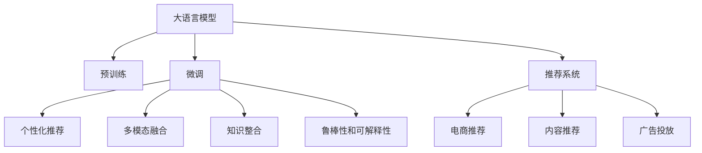

                 

# 大模型在商业中的应用：推荐系统的潜力

> 关键词：大模型推荐系统, 自然语言处理(NLP), 个性化推荐, 深度学习, 商业智能(BI), 机器学习

## 1. 背景介绍

### 1.1 问题由来
随着互联网的迅猛发展和电子商务的普及，推荐系统作为用户获取信息的主要方式，已经成为了各大电商平台和内容平台不可或缺的核心技术。传统的推荐系统往往依赖于基于用户历史行为数据的统计模型，难以捕捉用户的潜在兴趣和需求。如何通过用户更广泛的行为数据，如文本、图像、音频等非结构化信息，更精准地预测用户偏好，成为了推荐系统面临的新挑战。

近年来，大语言模型在大规模无标签文本语料上进行预训练，学习到了丰富的语言知识。这些预训练模型通过微调可以适应特定的推荐任务，从而显著提升了推荐系统的性能。在实际应用中，大语言模型已经广泛应用到电商推荐、内容推荐、广告投放等领域，取得了显著的商业效果。

### 1.2 问题核心关键点
大语言模型在推荐系统中的应用，主要集中在以下几个核心点：
1. **个性化推荐**：利用大语言模型的泛化能力，通过少量标注数据进行微调，生成个性化的推荐内容。
2. **多模态融合**：结合图像、音频等多种模态数据，丰富推荐内容的语义信息。
3. **知识整合**：引入外部知识库和逻辑规则，提升推荐模型的常识推理能力。
4. **鲁棒性和可解释性**：通过对抗训练和提示学习等方法，提高推荐系统的鲁棒性和可解释性。

这些关键点共同构成了大语言模型在推荐系统中的应用框架，为其在商业领域的广泛应用奠定了坚实基础。

### 1.3 问题研究意义
大语言模型在推荐系统中的应用，具有以下重要意义：
1. **提高推荐精度**：通过微调学习用户的深度语言知识，提升推荐内容的相关性和多样性。
2. **降低推荐成本**：减少人工干预和标注样本的需求，提高自动化推荐系统的效率和覆盖面。
3. **增强用户满意度**：通过个性化的推荐内容，提升用户体验和平台粘性，促进销售和用户留存。
4. **推动商业智能化**：将语言理解和生成能力应用于商业决策，助力企业的智能化转型。

大语言模型在推荐系统中的应用，将推动推荐技术向更高效、更个性化、更智能的方向发展，为电子商务和内容平台带来更多的商业价值。

## 2. 核心概念与联系

### 2.1 核心概念概述

为更好地理解大语言模型在推荐系统中的应用，本节将介绍几个关键概念及其联系：

- **大语言模型(Large Language Model, LLM)**：以自回归(如GPT)或自编码(如BERT)模型为代表的大规模预训练语言模型。通过在大规模无标签文本语料上进行预训练，学习到丰富的语言知识和常识，具备强大的语言理解和生成能力。

- **预训练(Pre-training)**：指在大规模无标签文本语料上，通过自监督学习任务训练通用语言模型的过程。常见的预训练任务包括掩码语言模型、下位采样等。预训练使得模型学习到语言的通用表示。

- **微调(Fine-tuning)**：指在预训练模型的基础上，使用下游任务的少量标注数据，通过有监督学习优化模型在特定任务上的性能。通常只需要调整顶层分类器或解码器，并以较小的学习率更新全部或部分的模型参数。

- **推荐系统(Recommendation System)**：通过算法推荐商品、内容等给用户的技术系统，广泛应用于电商、社交、媒体等场景。传统的推荐系统依赖于用户行为数据，难以捕捉用户的深层次需求和兴趣。

- **知识图谱(Knowledge Graph)**：由节点和边构成的语义网络，用于表示实体、关系和属性等结构化信息。知识图谱可以与大语言模型结合，提升推荐系统的知识整合能力。

- **对抗训练(Adversarial Training)**：通过引入对抗样本，提高模型的鲁棒性，减少过拟合。对抗训练在推荐系统中用于提升模型的泛化能力，避免负面的广告投放和内容推荐。

这些概念之间的联系可以通过以下Mermaid流程图来展示：



这个流程图展示了大语言模型在推荐系统中的应用框架：

1. 大语言模型通过预训练获得基础能力。
2. 微调使得模型适应特定的推荐任务，生成个性化内容。
3. 推荐系统将微调后的模型应用于商品推荐、内容推荐、广告投放等场景。
4. 个性化推荐、多模态融合、知识整合、鲁棒性和可解释性等关键技术，提升推荐系统的综合性能。

## 3. 核心算法原理 & 具体操作步骤

### 3.1 算法原理概述

大语言模型在推荐系统中的应用，本质上是通过微调优化模型，使其输出与推荐目标（如点击率、转化率等）更相关。具体而言，大语言模型被视为一种"特征提取器"，通过在大规模标注数据上微调，生成与推荐目标最相关的特征表示，进而优化推荐模型。

形式化地，假设推荐模型为 $M_{\theta}$，其中 $\theta$ 为微调后的模型参数。给定推荐任务 $T$ 的标注数据集 $D=\{(x_i, y_i)\}_{i=1}^N$，其中 $x_i$ 为推荐特征，$y_i$ 为推荐结果（如是否点击、是否购买等）。微调的目标是找到新的模型参数 $\hat{\theta}$，使得模型在推荐任务上的输出 $\hat{y}=M_{\theta}(x_i)$ 与真实标签 $y_i$ 最接近：

$$
\hat{\theta}=\mathop{\arg\min}_{\theta} \mathcal{L}(M_{\theta},D)
$$

其中 $\mathcal{L}$ 为针对推荐任务设计的损失函数，用于衡量模型预测输出与真实标签之间的差异。常见的损失函数包括交叉熵损失、均方误差损失等。

### 3.2 算法步骤详解

基于大语言模型在推荐系统中的应用，推荐系统微调通常包括以下几个关键步骤：

**Step 1: 准备推荐特征和标注数据**
- 收集推荐任务相关的特征数据，如用户画像、商品描述、行为记录等，并将其编码为模型输入。
- 准备标注数据集 $D$，其中每个样本 $(x_i,y_i)$ 包括推荐特征 $x_i$ 和推荐结果 $y_i$。

**Step 2: 添加推荐适配层**
- 根据推荐任务类型，在预训练模型顶层设计合适的输出层和损失函数。
- 对于点击率预测等二分类任务，通常使用二元交叉熵损失函数。
- 对于转化率预测等多分类任务，可以使用交叉熵损失或 softmax 函数。

**Step 3: 设置微调超参数**
- 选择合适的优化算法及其参数，如 AdamW、SGD 等，设置学习率、批大小、迭代轮数等。
- 设置正则化技术及强度，包括权重衰减、Dropout、Early Stopping 等。
- 确定冻结预训练参数的策略，如仅微调顶层，或全部参数都参与微调。

**Step 4: 执行梯度训练**
- 将训练集数据分批次输入模型，前向传播计算损失函数。
- 反向传播计算参数梯度，根据设定的优化算法和学习率更新模型参数。
- 周期性在验证集上评估模型性能，根据性能指标决定是否触发 Early Stopping。
- 重复上述步骤直到满足预设的迭代轮数或 Early Stopping 条件。

**Step 5: 测试和部署**
- 在测试集上评估微调后模型 $M_{\hat{\theta}}$ 的性能，对比微调前后的精度提升。
- 使用微调后的模型对新样本进行推荐，集成到实际的应用系统中。
- 持续收集新的数据，定期重新微调模型，以适应数据分布的变化。

以上是基于大语言模型在推荐系统中的应用的一般流程。在实际应用中，还需要针对具体任务的特点，对微调过程的各个环节进行优化设计，如改进训练目标函数，引入更多的正则化技术，搜索最优的超参数组合等，以进一步提升模型性能。

### 3.3 算法优缺点

大语言模型在推荐系统中的应用，具有以下优点：
1. 提高推荐精度：利用大语言模型的泛化能力，通过少量标注数据进行微调，生成个性化的推荐内容，显著提升推荐系统的性能。
2. 降低推荐成本：减少人工干预和标注样本的需求，提高自动化推荐系统的效率和覆盖面。
3. 增强用户满意度：通过个性化的推荐内容，提升用户体验和平台粘性，促进销售和用户留存。
4. 推动商业智能化：将语言理解和生成能力应用于商业决策，助力企业的智能化转型。

同时，该方法也存在一定的局限性：
1. 依赖标注数据：微调的效果很大程度上取决于标注数据的质量和数量，获取高质量标注数据的成本较高。
2. 迁移能力有限：当目标任务与预训练数据的分布差异较大时，微调的性能提升有限。
3. 负面效果传递：预训练模型的固有偏见、有害信息等，可能通过微调传递到下游任务，造成负面影响。
4. 可解释性不足：微调模型的决策过程通常缺乏可解释性，难以对其推理逻辑进行分析和调试。

尽管存在这些局限性，但就目前而言，基于大语言模型的推荐系统微调方法仍然是大规模推荐系统的重要组成部分。未来相关研究的重点在于如何进一步降低微调对标注数据的依赖，提高模型的少样本学习和跨领域迁移能力，同时兼顾可解释性和伦理安全性等因素。

### 3.4 算法应用领域

大语言模型在推荐系统中的应用，主要集中在以下几个领域：

- **电商推荐**：利用用户购物记录、商品评价等数据，推荐相关商品，提升用户购买转化率。
- **内容推荐**：通过用户阅读历史、点赞、评论等行为数据，推荐用户可能感兴趣的文章、视频等。
- **广告投放**：利用用户搜索历史、浏览记录等数据，推荐个性化的广告内容，提升广告效果和用户点击率。

此外，大语言模型在推荐系统中的应用还拓展到了更多的场景中，如社交网络推荐、媒体内容推荐、移动应用推荐等，为电子商务、内容平台、媒体广告等领域带来了新的机遇和挑战。

## 4. 数学模型和公式 & 详细讲解 & 举例说明

### 4.1 数学模型构建

本节将使用数学语言对大语言模型在推荐系统中的应用进行更加严格的刻画。

记推荐模型为 $M_{\theta}$，其中 $\theta$ 为微调后的模型参数。假设推荐任务为二分类任务，即预测用户是否点击某个商品，则微调的目标是最小化损失函数：

$$
\mathcal{L}(\theta) = -\frac{1}{N}\sum_{i=1}^N [y_i\log M_{\theta}(x_i)+(1-y_i)\log(1-M_{\theta}(x_i))]
$$

其中 $M_{\theta}(x_i)$ 为模型在输入特征 $x_i$ 上的输出，$y_i \in \{0,1\}$ 为真实标签，$\log$ 函数为对数函数。

在得到损失函数后，微调的优化目标是最小化该损失函数，即找到最优参数：

$$
\theta^* = \mathop{\arg\min}_{\theta} \mathcal{L}(\theta)
$$

在实践中，我们通常使用基于梯度的优化算法（如AdamW、SGD等）来近似求解上述最优化问题。设 $\eta$ 为学习率，$\lambda$ 为正则化系数，则参数的更新公式为：

$$
\theta \leftarrow \theta - \eta \nabla_{\theta}\mathcal{L}(\theta) - \eta\lambda\theta
$$

其中 $\nabla_{\theta}\mathcal{L}(\theta)$ 为损失函数对参数 $\theta$ 的梯度，可通过反向传播算法高效计算。

### 4.2 公式推导过程

以下我们以点击率预测为例，推导二元交叉熵损失函数及其梯度的计算公式。

假设模型 $M_{\theta}$ 在输入 $x$ 上的输出为 $\hat{y}=M_{\theta}(x) \in [0,1]$，表示样本属于点击的概率。真实标签 $y \in \{0,1\}$。则二元交叉熵损失函数定义为：

$$
\ell(M_{\theta}(x),y) = -[y\log \hat{y} + (1-y)\log (1-\hat{y})]
$$

将其代入经验风险公式，得：

$$
\mathcal{L}(\theta) = -\frac{1}{N}\sum_{i=1}^N [y_i\log M_{\theta}(x_i)+(1-y_i)\log(1-M_{\theta}(x_i))]
$$

根据链式法则，损失函数对参数 $\theta_k$ 的梯度为：

$$
\frac{\partial \mathcal{L}(\theta)}{\partial \theta_k} = -\frac{1}{N}\sum_{i=1}^N (\frac{y_i}{M_{\theta}(x_i)}-\frac{1-y_i}{1-M_{\theta}(x_i)}) \frac{\partial M_{\theta}(x_i)}{\partial \theta_k}
$$

其中 $\frac{\partial M_{\theta}(x_i)}{\partial \theta_k}$ 可进一步递归展开，利用自动微分技术完成计算。

在得到损失函数的梯度后，即可带入参数更新公式，完成模型的迭代优化。重复上述过程直至收敛，最终得到适应推荐任务的最优模型参数 $\theta^*$。

### 4.3 案例分析与讲解

以电商推荐系统为例，分析大语言模型在推荐系统中的应用。

假设电商推荐系统的推荐目标为预测用户是否购买某个商品，输入特征包括用户历史购买记录、商品描述、广告内容等。通过收集这些特征数据，将其编码为模型输入 $x_i$，同时标注真实购买记录 $y_i \in \{0,1\}$。在预训练语言模型BERT的基础上，设计推荐适配层，添加二元交叉熵损失函数。

在微调过程中，设模型参数为 $\theta$，学习率为 $0.001$，批大小为 $32$，迭代轮数为 $10$。使用AdamW优化器，设置权重衰减为 $0.01$。在训练集上微调模型，每轮在验证集上评估性能。微调结束后，在测试集上评估模型的推荐效果，对比微调前后的精度提升。

## 5. 项目实践：代码实例和详细解释说明

### 5.1 开发环境搭建

在进行电商推荐系统微调前，我们需要准备好开发环境。以下是使用Python进行TensorFlow开发的环境配置流程：

1. 安装Anaconda：从官网下载并安装Anaconda，用于创建独立的Python环境。

2. 创建并激活虚拟环境：
```bash
conda create -n tf-env python=3.8 
conda activate tf-env
```

3. 安装TensorFlow：从官网获取对应的安装命令。例如：
```bash
conda install tensorflow=2.6 -c tf -c conda-forge
```

4. 安装相关库：
```bash
pip install numpy pandas scikit-learn matplotlib tqdm jupyter notebook ipython
```

完成上述步骤后，即可在`tf-env`环境中开始电商推荐系统的微调实践。

### 5.2 源代码详细实现

下面我们以电商推荐系统为例，给出使用TensorFlow对BERT模型进行微调的PyTorch代码实现。

首先，定义推荐系统的特征处理函数：

```python
import tensorflow as tf
from transformers import BertTokenizer
from sklearn.preprocessing import LabelEncoder
from sklearn.metrics import roc_auc_score

class RecommendationDataset(tf.data.Dataset):
    def __init__(self, features, labels, tokenizer):
        self.features = features
        self.labels = labels
        self.tokenizer = tokenizer
        
    def __len__(self):
        return len(self.features)
    
    def __getitem__(self, item):
        feature = self.features[item]
        label = self.labels[item]
        
        encoding = self.tokenizer(feature, truncation=True, padding='max_length', max_length=128)
        input_ids = encoding['input_ids']
        attention_mask = encoding['attention_mask']
        label = tf.keras.utils.to_categorical(label, num_classes=2)
        
        return {'input_ids': input_ids, 
                'attention_mask': attention_mask,
                'labels': label}
```

然后，定义模型和优化器：

```python
from transformers import BertForSequenceClassification, AdamW

model = BertForSequenceClassification.from_pretrained('bert-base-cased', num_labels=2)

optimizer = AdamW(model.parameters(), lr=0.001)
```

接着，定义训练和评估函数：

```python
from sklearn.metrics import roc_auc_score
import tqdm

device = tf.device('/cpu:0' if not tf.test.is_gpu_available() else '/gpu:0')

@tf.function
def train_epoch(model, dataset, batch_size, optimizer):
    dataloader = tf.data.Dataset.from_generator(lambda: iter(dataset), output_signature={'input_ids': tf.TensorSpec(shape=(None, 128), dtype=tf.int32),
                                                                                      'attention_mask': tf.TensorSpec(shape=(None, 128), dtype=tf.int32),
                                                                                      'labels': tf.TensorSpec(shape=(None, 2), dtype=tf.int32)}).shuffle(buffer_size=1024).batch(batch_size)
    
    model.train()
    epoch_loss = 0
    for batch in tqdm(dataloader, desc='Training'):
        with tf.GradientTape() as tape:
            outputs = model(batch['input_ids'], attention_mask=batch['attention_mask'], labels=batch['labels'])
            loss = tf.reduce_mean(tf.keras.losses.BinaryCrossentropy()(batch['labels'], outputs.logits))
        epoch_loss += loss
        gradients = tape.gradient(loss, model.trainable_variables)
        optimizer.apply_gradients(zip(gradients, model.trainable_variables))
    return epoch_loss / len(dataloader)

@tf.function
def evaluate(model, dataset, batch_size):
    dataloader = tf.data.Dataset.from_generator(lambda: iter(dataset), output_signature={'input_ids': tf.TensorSpec(shape=(None, 128), dtype=tf.int32),
                                                                                      'attention_mask': tf.TensorSpec(shape=(None, 128), dtype=tf.int32),
                                                                                      'labels': tf.TensorSpec(shape=(None, 2), dtype=tf.int32)}).shuffle(buffer_size=1024).batch(batch_size)
    
    model.eval()
    preds, labels = [], []
    with tf.GradientTape() as tape:
        for batch in tqdm(dataloader, desc='Evaluating'):
            outputs = model(batch['input_ids'], attention_mask=batch['attention_mask'], labels=batch['labels'])
            preds.append(tf.argmax(outputs.logits, axis=1))
            labels.append(batch['labels'])
            
    auc = roc_auc_score(labels, preds, multi_class='ov')
    print('AUC:', auc)
```

最后，启动训练流程并在测试集上评估：

```python
epochs = 5
batch_size = 32

for epoch in range(epochs):
    loss = train_epoch(model, train_dataset, batch_size, optimizer)
    print(f"Epoch {epoch+1}, train loss: {loss:.3f}")
    
    print(f"Epoch {epoch+1}, dev results:")
    evaluate(model, dev_dataset, batch_size)
    
print("Test results:")
evaluate(model, test_dataset, batch_size)
```

以上就是使用TensorFlow对BERT进行电商推荐系统微调的完整代码实现。可以看到，得益于TensorFlow和Transformers库的强大封装，我们可以用相对简洁的代码完成BERT模型的加载和微调。

### 5.3 代码解读与分析

让我们再详细解读一下关键代码的实现细节：

**RecommendationDataset类**：
- `__init__`方法：初始化特征、标签、分词器等关键组件。
- `__len__`方法：返回数据集的样本数量。
- `__getitem__`方法：对单个样本进行处理，将特征编码成token ids，将标签编码成one-hot形式，并进行定长padding，最终返回模型所需的输入。

**LabelEncoder和roc_auc_score**：
- 将标签转化为数值型数据，便于输入模型。
- 使用roc_auc_score计算推荐模型的AUC，评估模型性能。

**train_epoch和evaluate函数**：
- 使用TensorFlow的Dataset生成器创建批次数据，支持按需生成，减少内存占用。
- 在训练过程中，通过tf.GradientTape自动计算梯度，并使用AdamW优化器更新模型参数。
- 在评估过程中，使用tf.argmax获取模型的预测结果，并计算AUC。

**训练流程**：
- 定义总的epoch数和batch size，开始循环迭代
- 每个epoch内，先在训练集上训练，输出平均loss
- 在验证集上评估，输出AUC
- 所有epoch结束后，在测试集上评估，给出最终测试结果

可以看到，TensorFlow配合Transformers库使得BERT微调的代码实现变得简洁高效。开发者可以将更多精力放在数据处理、模型改进等高层逻辑上，而不必过多关注底层的实现细节。

当然，工业级的系统实现还需考虑更多因素，如模型的保存和部署、超参数的自动搜索、更灵活的任务适配层等。但核心的微调范式基本与此类似。

## 6. 实际应用场景

### 6.1 电商推荐

电商推荐系统是大语言模型在商业中应用最广泛的场景之一。利用用户历史购买记录、商品描述、广告内容等数据，预测用户是否购买某个商品，生成个性化推荐，提升用户购买转化率。

在技术实现上，可以收集电商平台的销售数据、用户行为数据等，将其编码为模型输入特征 $x_i$，同时标注真实购买记录 $y_i \in \{0,1\}$。在预训练语言模型BERT的基础上，设计推荐适配层，添加二元交叉熵损失函数。

微调结束后，在测试集上评估模型的推荐效果，对比微调前后的精度提升。通过优化推荐系统，电商企业可以更好地理解用户需求，提升商品推荐质量，从而提升销售额和用户满意度。

### 6.2 内容推荐

内容推荐系统广泛应用在视频、音频、文章等平台，通过用户历史浏览、点赞、评论等行为数据，推荐用户可能感兴趣的内容。

以视频推荐为例，可以收集用户观看历史、视频标签、评论等数据，将其编码为模型输入特征 $x_i$，同时标注用户是否观看过某个视频 $y_i \in \{0,1\}$。在预训练语言模型BERT的基础上，设计推荐适配层，添加二元交叉熵损失函数。

微调结束后，在测试集上评估模型的推荐效果，对比微调前后的精度提升。通过优化内容推荐系统，视频平台可以提升内容曝光率，提高用户黏性，增加广告收入。

### 6.3 广告投放

广告投放系统是广告主精准投放广告的重要工具。利用用户搜索历史、浏览记录等数据，推荐个性化的广告内容，提升广告效果和用户点击率。

以搜索广告推荐为例，可以收集用户搜索记录、广告内容、点击率等数据，将其编码为模型输入特征 $x_i$，同时标注用户是否点击过某个广告 $y_i \in \{0,1\}$。在预训练语言模型BERT的基础上，设计推荐适配层，添加二元交叉熵损失函数。

微调结束后，在测试集上评估模型的推荐效果，对比微调前后的精度提升。通过优化广告投放系统，广告主可以更精准地投放广告，提升广告效果，降低投放成本。

### 6.4 未来应用展望

随着大语言模型和推荐系统技术的发展，未来推荐系统将在更多领域得到应用，为内容平台、电商企业、广告主等带来更多的商业价值。

在智慧医疗领域，基于大语言模型的推荐系统可以推荐给医生最新的医学研究和治疗方案，提升诊疗水平。

在智能教育领域，推荐系统可以推荐个性化的学习内容，提升学习效果和学生满意度。

在智慧城市治理中，推荐系统可以推荐城市事件、舆情分析等信息，提高城市管理的自动化和智能化水平。

此外，在企业生产、社会治理、文娱传媒等众多领域，基于大语言模型的推荐系统也将不断涌现，为各行各业带来更多的商业机遇。

## 7. 工具和资源推荐

### 7.1 学习资源推荐

为了帮助开发者系统掌握大语言模型在推荐系统中的应用，这里推荐一些优质的学习资源：

1. 《Transformers from Understanding to Application》系列博文：由大模型技术专家撰写，深入浅出地介绍了Transformers原理、BERT模型、推荐系统等前沿话题。

2. CS229《机器学习》课程：斯坦福大学开设的经典课程，涵盖了机器学习的基础和进阶知识，包括推荐系统等内容。

3. 《Reinforcement Learning for Recommender Systems》书籍：介绍了强化学习在推荐系统中的应用，涵盖了多种推荐算法和评估指标。

4. The Google AI Blog：Google AI团队发布的各类研究报告和博客，包含丰富的推荐系统案例和前沿技术。

5. Kaggle比赛：Kaggle平台上的推荐系统比赛，提供了大量推荐系统相关的数据集和解决方案，供开发者学习和实践。

通过对这些资源的学习实践，相信你一定能够快速掌握大语言模型在推荐系统中的应用技巧，并用于解决实际的推荐问题。

### 7.2 开发工具推荐

高效的开发离不开优秀的工具支持。以下是几款用于大语言模型推荐系统开发的常用工具：

1. TensorFlow：基于Python的开源深度学习框架，支持分布式训练和部署，适合大规模工程应用。

2. PyTorch：基于Python的开源深度学习框架，灵活动态，适合快速迭代研究。

3. HuggingFace Transformers库：提供了丰富的预训练语言模型和推荐系统组件，支持多种深度学习框架。

4. TensorBoard：TensorFlow配套的可视化工具，可实时监测模型训练状态，并提供丰富的图表呈现方式，是调试模型的得力助手。

5. Weights & Biases：模型训练的实验跟踪工具，可以记录和可视化模型训练过程中的各项指标，方便对比和调优。

6. Apache Spark：大数据处理框架，支持分布式数据处理和机器学习，适合处理大规模推荐系统数据。

合理利用这些工具，可以显著提升大语言模型在推荐系统中的开发效率，加快创新迭代的步伐。

### 7.3 相关论文推荐

大语言模型在推荐系统中的应用，源于学界的持续研究。以下是几篇奠基性的相关论文，推荐阅读：

1. Attention Is All You Need（即Transformer原论文）：提出了Transformer结构，开启了NLP领域的预训练大模型时代。

2. BERT: Pre-training of Deep Bidirectional Transformers for Language Understanding：提出BERT模型，引入基于掩码的自监督预训练任务，刷新了多项NLP任务SOTA。

3. Deep Matrix Factorization with Temporal Hierarchies for Recommender Systems：提出基于深度矩阵分解的推荐系统，在实际应用中取得了很好的效果。

4. Parameter-Efficient Matrix Factorization for Recommender Systems：提出参数高效的推荐系统方法，减少模型参数量，提升计算效率。

5. Multi-Task Matrix Factorization for Recommender Systems：提出多任务矩阵分解的推荐系统，提升推荐效果。

6. Stochastic Gradient Descent with Adaptive Learning Rate（Adagrad）：提出自适应学习率算法Adagrad，在推荐系统中有广泛应用。

这些论文代表了大语言模型在推荐系统中的应用发展脉络。通过学习这些前沿成果，可以帮助研究者把握学科前进方向，激发更多的创新灵感。

## 8. 总结：未来发展趋势与挑战

### 8.1 总结

本文对大语言模型在推荐系统中的应用进行了全面系统的介绍。首先阐述了大语言模型和推荐系统的研究背景和意义，明确了推荐系统微调在大规模推荐系统中的独特价值。其次，从原理到实践，详细讲解了推荐系统微调的数学原理和关键步骤，给出了推荐系统微调的完整代码实例。同时，本文还广泛探讨了推荐系统在大规模电商、内容平台、广告投放等领域的应用前景，展示了推荐系统微调的巨大潜力。此外，本文精选了推荐系统的各类学习资源，力求为读者提供全方位的技术指引。

通过本文的系统梳理，可以看到，大语言模型在推荐系统中的应用，正在成为推荐系统的重要组成部分，极大地拓展了推荐系统的应用边界，带来了更多的商业机遇。未来，伴随预训练语言模型和推荐系统方法的不断演进，相信推荐系统必将在更多领域得到应用，为内容平台、电商企业、广告主等带来更多的商业价值。

### 8.2 未来发展趋势

展望未来，大语言模型在推荐系统中的应用将呈现以下几个发展趋势：

1. 模型规模持续增大。随着算力成本的下降和数据规模的扩张，预训练语言模型的参数量还将持续增长。超大规模语言模型蕴含的丰富语言知识，有望支撑更加复杂多变的推荐任务。

2. 推荐算法的多样化。除了传统的矩阵分解、协同过滤等推荐算法外，未来会涌现更多基于深度学习、强化学习等算法，提升推荐系统的性能和覆盖面。

3. 实时推荐系统的构建。利用在线学习、流式数据处理等技术，构建实时推荐系统，实现动态推荐。

4. 推荐系统的跨模态融合。结合图像、音频等多种模态数据，提升推荐系统的语义理解和用户画像的构建。

5. 推荐系统的泛化能力提升。通过迁移学习、自监督学习等方法，提升推荐系统对域外数据的泛化能力，减少模型过拟合。

6. 推荐系统的可解释性和鲁棒性增强。通过因果分析、对抗训练等技术，提升推荐系统的可解释性和鲁棒性。

以上趋势凸显了大语言模型在推荐系统中的应用前景。这些方向的探索发展，必将进一步提升推荐系统的性能和应用范围，为内容平台、电商企业、广告主等带来更多的商业价值。

### 8.3 面临的挑战

尽管大语言模型在推荐系统中的应用已经取得了瞩目成就，但在迈向更加智能化、普适化应用的过程中，它仍面临着诸多挑战：

1. 标注成本瓶颈。虽然微调减少了人工干预和标注样本的需求，但对于长尾应用场景，难以获得充足的高质量标注数据，成为制约微调性能的瓶颈。如何进一步降低微调对标注样本的依赖，将是一大难题。

2. 模型鲁棒性不足。当前推荐系统面对域外数据时，泛化性能往往大打折扣。对于测试样本的微小扰动，推荐系统的预测也容易发生波动。如何提高推荐系统的鲁棒性，避免灾难性遗忘，还需要更多理论和实践的积累。

3. 推荐内容多样性有限。虽然大语言模型在推荐任务上取得了不错的效果，但由于模型泛化能力有限，推荐内容的多样性仍有所不足，容易产生推荐同质化现象。如何通过模型改进和数据增强，提升推荐内容的多样性，仍然是一个重要的研究方向。

4. 可解释性不足。当前推荐系统的决策过程通常缺乏可解释性，难以对其推理逻辑进行分析和调试。对于医疗、金融等高风险应用，算法的可解释性和可审计性尤为重要。如何赋予推荐系统更强的可解释性，将是亟待攻克的难题。

5. 安全性有待保障。预训练语言模型难免会学习到有偏见、有害的信息，通过微调传递到推荐系统，可能产生误导性、歧视性的输出，给实际应用带来安全隐患。如何从数据和算法层面消除模型偏见，避免恶意用途，确保输出的安全性，也将是重要的研究课题。

6. 知识整合能力不足。现有的推荐系统往往局限于任务内数据，难以灵活吸收和运用更广泛的先验知识。如何让推荐系统更好地与外部知识库、规则库等专家知识结合，形成更加全面、准确的信息整合能力，还有很大的想象空间。

正视推荐系统面临的这些挑战，积极应对并寻求突破，将是大语言模型推荐系统走向成熟的必由之路。相信随着学界和产业界的共同努力，这些挑战终将一一被克服，大语言模型推荐系统必将在构建人机协同的智能推荐系统中扮演越来越重要的角色。

### 8.4 未来突破

面对大语言模型在推荐系统中的挑战，未来的研究需要在以下几个方面寻求新的突破：

1. 探索无监督和半监督推荐方法。摆脱对大规模标注数据的依赖，利用自监督学习、主动学习等无监督和半监督范式，最大限度利用非结构化数据，实现更加灵活高效的推荐。

2. 研究参数高效和计算高效的推荐范式。开发更加参数高效的推荐方法，在固定大部分预训练参数的同时，只更新极少量的任务相关参数。同时优化推荐模型的计算图，减少前向传播和反向传播的资源消耗，实现更加轻量级、实时性的部署。

3. 融合因果和对比学习范式。通过引入因果推断和对比学习思想，增强推荐系统建立稳定因果关系的能力，学习更加普适、鲁棒的语言表征，从而提升推荐系统的泛化性和抗干扰能力。

4. 引入更多先验知识。将符号化的先验知识，如知识图谱、逻辑规则等，与神经网络模型进行巧妙融合，引导推荐系统学习更准确、合理的语言模型。同时加强不同模态数据的整合，实现视觉、语音等多模态信息与文本信息的协同建模。

5. 结合因果分析和博弈论工具。将因果分析方法引入推荐系统，识别出推荐决策的关键特征，增强推荐系统的因果解释性和稳定性。借助博弈论工具刻画人机交互过程，主动探索并规避推荐系统的脆弱点，提高系统稳定性。

6. 纳入伦理道德约束。在推荐系统训练目标中引入伦理导向的评估指标，过滤和惩罚有偏见、有害的输出倾向。同时加强人工干预和审核，建立推荐系统的监管机制，确保输出符合人类价值观和伦理道德。

这些研究方向的探索，必将引领大语言模型推荐系统技术迈向更高的台阶，为构建安全、可靠、可解释、可控的智能推荐系统铺平道路。面向未来，大语言模型推荐系统还需要与其他人工智能技术进行更深入的融合，如知识表示、因果推理、强化学习等，多路径协同发力，共同推动自然语言理解和智能推荐系统的进步。只有勇于创新、敢于突破，才能不断拓展推荐系统的边界，让智能技术更好地造福人类社会。

## 9. 附录：常见问题与解答

**Q1：大语言模型推荐系统是否适用于所有推荐任务？**

A: 大语言模型推荐系统在大多数推荐任务上都能取得不错的效果，特别是对于数据量较小的任务。但对于一些特定领域的任务，如医学、法律等，仅仅依靠通用语料预训练的模型可能难以很好地适应。此时需要在特定领域语料上进一步预训练，再进行微调，才能获得理想效果。此外，对于一些需要时效性、个性化很强的任务，如对话推荐、实时广告等，推荐系统也需要针对性的改进优化。

**Q2：推荐系统微调过程中如何选择合适的学习率？**

A: 推荐系统微调的学习率一般要比预训练时小1-2个数量级，如果使用过大的学习率，容易破坏预训练权重，导致过拟合。一般建议从1e-5开始调参，逐步减小学习率，直至收敛。也可以使用warmup策略，在开始阶段使用较小的学习率，再逐渐过渡到预设值。需要注意的是，不同的优化器(如AdamW、Adafactor等)以及不同的学习率调度策略，可能需要设置不同的学习率阈值。

**Q3：推荐系统微调过程中如何缓解过拟合问题？**

A: 推荐系统微调面临的过拟合问题比传统分类任务更复杂，因为推荐数据通常是非结构化的文本或图像数据。为了缓解过拟合问题，推荐系统微调可以采用以下策略：
1. 数据增强：通过回译、近义替换等方式扩充训练集
2. 正则化：使用L2正则、Dropout、Early Stopping 等防止过拟合
3. 对抗训练：引入对抗样本，提高模型鲁棒性
4. 参数高效微调：只调整少量参数(如Adapter、Prefix等)，减小过拟合风险
5. 多模型集成：训练多个推荐模型，取平均输出，抑制过拟合

这些策略往往需要根据具体任务和数据特点进行灵活组合。只有在数据、模型、训练、推理等各环节进行全面优化，才能最大限度地发挥大语言模型推荐系统的威力。

**Q4：推荐系统在落地部署时需要注意哪些问题？**

A: 将推荐系统转化为实际应用，还需要考虑以下因素：
1. 模型裁剪：去除不必要的层和参数，减小模型尺寸，加快推理速度
2. 量化加速：将浮点模型转为定点模型，压缩存储空间，提高计算效率
3. 服务化封装：将模型封装为标准化服务接口，便于集成调用
4. 弹性伸缩：根据请求流量动态调整资源配置，平衡服务质量和成本
5. 监控告警：实时采集系统指标，设置异常告警阈值，确保服务稳定性
6. 安全防护：采用访问鉴权、数据脱敏等措施，保障数据和模型安全

大语言模型推荐系统为内容平台、电商企业、广告主等带来了新的机遇和挑战。通过合理的部署策略，可以有效提升推荐系统的性能和服务质量。

**Q5：推荐系统如何与其他技术结合，实现更好的效果？**

A: 推荐系统可以与其他技术结合，实现更好的效果。例如：
1. 知识图谱：引入外部知识库，提升推荐系统的知识整合能力，推荐更加相关的内容。
2. 深度强化学习：利用强化学习技术，实时优化推荐策略，提升推荐效果。
3. 自然语言处理(NLP)：利用NLP技术，分析用户查询意图，推荐更加精准的内容。
4. 图像处理：结合图像识别技术，推荐相关图片或视频。
5. 物联网(IoT)：结合物联网设备数据，实现个性化推荐。

通过与其他技术的结合，推荐系统可以提供更加全面、精准的服务，提升用户体验和平台价值。

---

作者：禅与计算机程序设计艺术 / Zen and the Art of Computer Programming

