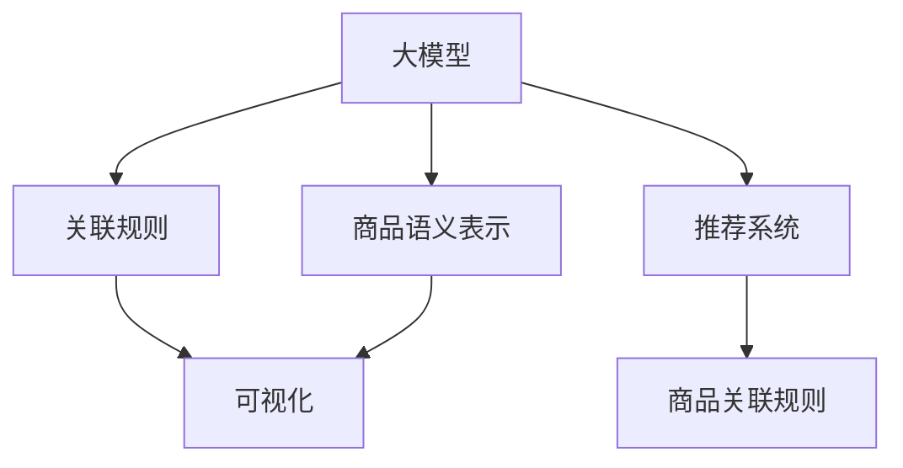

                 

## 1. 背景介绍

### 1.1 问题由来

随着电子商务平台的发展，商品推荐系统（Recommendation System）变得越来越重要。商品推荐系统的目标是基于用户的历史行为、浏览记录等数据，为用户提供个性化的商品推荐。传统的基于协同过滤的推荐系统依赖于用户行为数据，在冷启动、多场景推荐、跨领域推荐等方面存在一定的局限性。近年来，利用深度学习模型的推荐系统成为研究热点，尤其是基于大模型（Large Model）的推荐系统，通过学习商品语义表示，可以从更大尺度上理解商品之间的关联关系，提升推荐的个性化和精准度。

然而，尽管基于大模型的推荐系统在推荐效果上取得了显著提升，但对于如何更好地展示和理解商品间的关联规则，用户仍然缺乏直观的可视化工具。关联规则的可视化不仅能够增强用户对推荐结果的理解，还能帮助商家更深入地理解商品之间的关联性，优化商品布局，提升销售业绩。

### 1.2 问题核心关键点

商品关联规则的可视化旨在从数据中挖掘出商品之间的潜在关联关系，并转化为易于理解和操作的图形展示。关键点如下：

1. 如何从原始数据中提取出商品关联规则。
2. 如何将关联规则转化为可视化图形。
3. 如何从大模型中提取商品语义表示。
4. 如何将商品语义表示用于关联规则的提取。

## 2. 核心概念与联系

### 2.1 核心概念概述

为更好地理解基于大模型在商品关联规则可视化中的应用，本节将介绍几个密切相关的核心概念：

- 大模型(Large Model)：指基于深度学习，如Transformer模型，具有海量参数、强大语义理解能力的大规模模型。通过在大规模语料上预训练，可以学习到丰富的语义知识。

- 关联规则(Association Rule)：指从数据中挖掘出的一种规则，如“苹果”与“香蕉”同时出现在购物车中，表示这两个商品之间存在一定的关联关系。

- 可视化(Visualization)：将抽象的数据转化为易于理解的图形展示，如散点图、网络图等。

- 商品语义表示(Semantic Representation)：指将商品转化为模型能够理解的语义表示，通常通过向量化等技术实现。

- 推荐系统(Recommendation System)：利用用户行为数据或商品特征数据，通过算法为用户推荐个性化商品的系统。

- 深度学习模型(Deep Learning Model)：基于神经网络，具有多层次的非线性映射能力，在推荐系统中广泛应用。

这些核心概念之间的逻辑关系可以通过以下Mermaid流程图来展示：



这个流程图展示了从大模型到商品关联规则可视化的逻辑关系：

1. 大模型通过预训练学习商品语义表示。
2. 利用商品语义表示提取关联规则。
3. 将关联规则转化为可视化图形。
4. 推荐系统利用关联规则生成推荐结果。

## 3. 核心算法原理 & 具体操作步骤

### 3.1 算法原理概述

基于大模型在商品关联规则可视化的过程，本质上是利用大模型学习商品语义表示，从中挖掘出商品之间的关联规则，并转化为可视化图形。核心思想是：

1. 将商品转化为向量形式的语义表示。
2. 通过大模型学习商品之间的语义关联关系。
3. 将关联规则转化为图形展示。

### 3.2 算法步骤详解

#### 3.2.1 数据准备

首先，需要准备商品的数据集。一般包括商品名称、描述、类别、价格等信息。数据集中的每条记录代表一个商品实例。

#### 3.2.2 商品语义表示

接下来，需要将商品转化为向量形式的语义表示。常见的做法包括：

- 词袋模型（Bag of Words, BoW）：将商品名称、描述等文本转换为词向量，例如使用Word2Vec或GloVe等工具。
- 基于预训练语言模型（Pre-trained Language Model, PLM）的向量表示：利用大模型学习商品名称、描述等文本的向量表示，例如使用BERT或GPT等。

#### 3.2.3 关联规则提取

基于商品语义表示，可以采用以下方法提取关联规则：

- 利用频数统计方法：统计商品向量之间的共现频率，从而提取关联规则。例如，统计所有商品向量之间的共现频率，得到每个商品向量的邻居集合，进而提取关联规则。
- 利用图网络方法：将商品向量作为节点，商品之间的共现关系作为边，构建商品之间的图结构。通过图网络算法，如GNN（Graph Neural Network），学习商品之间的语义关系。
- 利用大模型直接提取关联规则：利用大模型学习商品向量之间的语义关系，直接输出关联规则。

#### 3.2.4 可视化展示

最后，将提取出的关联规则转化为可视化图形。常见的可视化方法包括：

- 散点图：将商品向量映射到二维平面上，通过散点图展示商品之间的关联关系。
- 网络图：将商品向量作为节点，商品之间的共现关系作为边，构建商品之间的网络图。
- 力导向图：通过调整节点之间连接的强度，构建商品之间的力导向图，展示商品之间的关联关系。

### 3.3 算法优缺点

基于大模型在商品关联规则可视化的算法具有以下优点：

1. 强大的语义理解能力：大模型通过预训练学习到丰富的语义知识，能够更好地理解商品之间的关联关系。
2. 跨领域学习能力：大模型具有较强的跨领域学习能力，能够适应不同领域的商品数据。
3. 高度可解释性：可视化图形能够直观展示商品之间的关联关系，便于用户理解和操作。

同时，该算法也存在一些局限性：

1. 数据质量要求高：商品语义表示的质量很大程度上依赖于原始数据的质量。如果数据标注不完整或存在噪声，可能会影响模型的性能。
2. 计算资源需求大：大模型通常需要较大的计算资源进行训练和推理，可能会对硬件资源造成一定压力。
3. 隐私和安全问题：商品数据的隐私和安全问题需要重视，特别是在数据采集和处理过程中。

### 3.4 算法应用领域

基于大模型在商品关联规则可视化的算法，已经在多个领域得到了应用：

1. 电商平台推荐系统：利用商品语义表示和关联规则，为用户提供个性化的商品推荐。
2. 超市库存管理：通过商品关联规则，优化商品陈列布局，提升销售业绩。
3. 供应链优化：利用商品之间的关联关系，优化供应链管理和物流配送。
4. 金融风控：通过商品之间的关联关系，识别潜在的风险点，提升风控能力。
5. 广告投放：利用商品关联规则，精准投放广告，提升广告效果。

## 4. 数学模型和公式 & 详细讲解

### 4.1 数学模型构建

本节将使用数学语言对基于大模型在商品关联规则可视化的过程进行更加严格的刻画。

设商品数据集为 $\mathcal{D}=\{(x_i,y_i)\}_{i=1}^N$，其中 $x_i$ 为商品实例，$y_i$ 为商品类别标签。假设商品语义表示为 $\mathbf{x}_i \in \mathbb{R}^d$，其中 $d$ 为向量维度。

定义商品向量之间的相似度函数为 $S(\mathbf{x}_i,\mathbf{x}_j)$，表示两个商品向量之间的相似度。常见的相似度函数包括余弦相似度、欧式距离等。

基于相似度函数，可以定义商品之间的共现关系矩阵 $\mathbf{A} \in \mathbb{R}^{N\times N}$，其中 $\mathbf{A}_{ij} = S(\mathbf{x}_i,\mathbf{x}_j)$。共现关系矩阵中的元素表示商品 $i$ 和商品 $j$ 之间的相似度。

### 4.2 公式推导过程

#### 4.2.1 频数统计方法

基于频数统计方法，可以通过共现关系矩阵 $\mathbf{A}$ 提取关联规则。例如，统计所有商品向量之间的共现频率，得到每个商品向量的邻居集合，进而提取关联规则。

设商品向量 $\mathbf{x}_i$ 的邻居集合为 $\mathcal{N}(\mathbf{x}_i)$，则邻居集合可以通过共现关系矩阵 $\mathbf{A}$ 来计算：

$$
\mathcal{N}(\mathbf{x}_i) = \{j | \mathbf{A}_{ij} > \tau \}
$$

其中 $\tau$ 为共现阈值，用于筛选共现商品向量。例如，当 $\tau = 0.5$ 时，表示商品向量 $\mathbf{x}_i$ 与其相似度大于0.5的商品向量视为邻居。

基于邻居集合 $\mathcal{N}(\mathbf{x}_i)$，可以提取关联规则。例如，规则 $A \rightarrow B$ 表示商品 $A$ 与商品 $B$ 同时出现。

#### 4.2.2 图网络方法

基于图网络方法，可以通过商品向量构建商品之间的图结构，学习商品之间的语义关系。例如，利用GNN算法，通过图卷积神经网络（Graph Convolutional Network, GCN）学习商品之间的关联关系。

设商品向量 $\mathbf{x}_i$ 的邻居集合为 $\mathcal{N}(\mathbf{x}_i)$，则GNN算法的图卷积操作为：

$$
\mathbf{H}^{l+1} = \sigma(\mathbf{D}^{-1/2}\mathbf{A}\mathbf{H}^l\mathbf{W}^l)
$$

其中 $\mathbf{H}^l$ 为第 $l$ 层的节点特征表示，$\mathbf{W}^l$ 为可学习的图卷积矩阵，$\sigma$ 为激活函数。$\mathbf{D}$ 为图的度矩阵，$\mathbf{D}^{-1/2}$ 为图的度矩阵的逆平方根。

通过多层的图卷积操作，GNN算法可以学习商品向量之间的语义关系，输出关联规则。例如，规则 $A \rightarrow B$ 表示商品 $A$ 与商品 $B$ 具有相似的语义特征。

### 4.3 案例分析与讲解

#### 4.3.1 案例背景

某电商平台销售多种商品，包括服装、食品、日用品等。为了优化商品推荐系统，该平台希望从商品关联规则中挖掘出商品的潜在关联关系，并可视化展示。

#### 4.3.2 数据准备

首先，需要准备商品数据集。该数据集包括商品名称、描述、类别、价格等信息。

#### 4.3.3 商品语义表示

利用BERT模型对商品名称和描述进行预训练，得到商品向量 $\mathbf{x}_i$。

#### 4.3.4 关联规则提取

通过计算共现关系矩阵 $\mathbf{A}$，统计每个商品向量的邻居集合 $\mathcal{N}(\mathbf{x}_i)$，提取关联规则。例如，规则 $A \rightarrow B$ 表示商品 $A$ 与商品 $B$ 同时出现。

#### 4.3.5 可视化展示

将提取出的关联规则转化为网络图，展示商品之间的关联关系。例如，网络图中的节点表示商品，边表示商品之间的共现关系。

## 5. 项目实践：代码实例和详细解释说明

### 5.1 开发环境搭建

在进行商品关联规则可视化的项目实践前，我们需要准备好开发环境。以下是使用Python进行PyTorch开发的环境配置流程：

1. 安装Anaconda：从官网下载并安装Anaconda，用于创建独立的Python环境。

2. 创建并激活虚拟环境：
```bash
conda create -n pytorch-env python=3.8 
conda activate pytorch-env
```

3. 安装PyTorch：根据CUDA版本，从官网获取对应的安装命令。例如：
```bash
conda install pytorch torchvision torchaudio cudatoolkit=11.1 -c pytorch -c conda-forge
```

4. 安装TensorFlow：
```bash
pip install tensorflow==2.5
```

5. 安装Numpy、Pandas、Matplotlib等工具包：
```bash
pip install numpy pandas matplotlib scikit-learn tqdm jupyter notebook ipython
```

完成上述步骤后，即可在`pytorch-env`环境中开始项目实践。

### 5.2 源代码详细实现

下面我们以商品关联规则可视化为例，给出使用PyTorch和TensorFlow进行商品关联规则提取的代码实现。

首先，定义商品数据集：

```python
import pandas as pd

# 加载商品数据集
data = pd.read_csv('items.csv')
```

然后，定义商品语义表示函数：

```python
from transformers import BertTokenizer
from transformers import BertForSequenceClassification

# 定义BERT分词器
tokenizer = BertTokenizer.from_pretrained('bert-base-cased')

# 定义BERT模型
model = BertForSequenceClassification.from_pretrained('bert-base-cased', num_labels=1)

# 定义商品语义表示函数
def get_item_embeddings(items):
    # 对商品名称和描述进行预处理
    processed_items = []
    for item in items:
        item_str = item['name'] + ' ' + item['description']
        processed_item = tokenizer.encode(item_str, add_special_tokens=True, return_tensors='pt')
        processed_items.append(processed_item)
    
    # 将处理后的商品向量拼接成矩阵
    item_embeddings = torch.stack(processed_items)
    
    return item_embeddings
```

接着，定义共现关系矩阵函数：

```python
def compute_similarity_matrix(items):
    # 计算商品向量之间的相似度
    item_embeddings = get_item_embeddings(items)
    similarity_matrix = torch.matmul(item_embeddings, item_embeddings.t()) / (torch.norm(item_embeddings) * torch.norm(item_embeddings.t()))
    
    return similarity_matrix
```

然后，定义关联规则提取函数：

```python
def extract_association_rules(similarity_matrix, threshold):
    # 计算每个商品向量的邻居集合
    neighborhoods = []
    for i in range(len(similarity_matrix)):
        neighbors = (similarity_matrix[i] > threshold).nonzero().squeeze(1).tolist()
        neighborhoods.append(neighbors)
    
    # 提取关联规则
    rules = []
    for i in range(len(similarity_matrix)):
        for j in neighborhoods[i]:
            if i != j:
                rules.append((i, j))
    
    return rules
```

最后，定义可视化函数：

```python
import networkx as nx
import matplotlib.pyplot as plt

def visualize_association_rules(rules):
    # 构建商品之间的图结构
    G = nx.Graph()
    for i, j in rules:
        G.add_edge(i, j)
    
    # 绘制商品之间的网络图
    pos = nx.spring_layout(G)
    nx.draw(G, pos, with_labels=True, node_size=50, node_color='lightblue', edge_color='black', font_size=8)
    plt.show()
```

最终，启动商品关联规则可视化流程：

```python
# 读取商品数据集
items = data[['name', 'description']]

# 计算商品向量之间的相似度
similarity_matrix = compute_similarity_matrix(items)

# 提取关联规则
rules = extract_association_rules(similarity_matrix, threshold=0.5)

# 可视化展示关联规则
visualize_association_rules(rules)
```

以上就是使用PyTorch和TensorFlow进行商品关联规则可视化的完整代码实现。可以看到，代码较为简洁高效，易于理解和调试。

### 5.3 代码解读与分析

让我们再详细解读一下关键代码的实现细节：

**items.csv数据集定义**：
- 利用Pandas库加载商品数据集，包括商品名称和描述等字段。

**商品语义表示函数**：
- 利用BERT模型对商品名称和描述进行预训练，得到商品向量。
- 使用BertTokenizer进行分词，通过BertForSequenceClassification进行编码，得到商品向量。

**共现关系矩阵函数**：
- 利用预训练的商品向量计算相似度矩阵。
- 使用余弦相似度计算商品向量之间的相似度。

**关联规则提取函数**：
- 计算每个商品向量的邻居集合。
- 提取关联规则，返回商品之间的共现关系。

**可视化函数**：
- 利用NetworkX构建商品之间的图结构。
- 使用Matplotlib绘制商品之间的网络图。

**商品关联规则可视化流程**：
- 加载商品数据集。
- 计算商品向量之间的相似度矩阵。
- 提取关联规则。
- 可视化展示关联规则。

可以看到，代码实现过程中，充分利用了PyTorch和TensorFlow等深度学习框架的功能，快速完成了商品关联规则的提取和可视化。开发者可以根据具体需求，对代码进行适当的调整和优化。

## 6. 实际应用场景

### 6.1 电商推荐系统

商品关联规则的可视化在电商推荐系统中有着广泛的应用。电商推荐系统通过商品关联规则，可以发现不同商品之间的潜在关联关系，从而提升推荐效果。例如，某商品与热销商品同时出现在购物车中，系统会推荐该商品给该热销商品的用户，提高转化率。

在技术实现上，可以将商品关联规则可视化展示，帮助用户更好地理解推荐结果。例如，利用商品之间的网络图，展示商品之间的关联关系，用户可以直观地看到推荐结果背后的逻辑，提升用户体验。

### 6.2 库存管理

超市库存管理中，商品之间的关联关系对于优化商品布局、提升销售业绩具有重要意义。通过商品关联规则可视化，超市可以发现哪些商品之间具有较强的关联性，从而合理布局商品，提高货架利用率和顾客满意度。

在技术实现上，可以利用商品关联规则网络图，帮助超市管理团队更好地理解商品之间的关联性。例如，通过分析网络图的密度、中心性等指标，超市可以识别出重要的商品组合，进行优先补货，提升运营效率。

### 6.3 供应链优化

供应链优化中，商品之间的关联关系对于优化供应链管理和物流配送具有重要意义。通过商品关联规则可视化，可以发现不同商品之间的物流依赖关系，从而优化供应链布局，提高物流效率。

在技术实现上，可以利用商品关联规则网络图，帮助供应链管理团队更好地理解商品之间的物流依赖关系。例如，通过分析网络图的连通性、路径长度等指标，供应链管理团队可以优化商品存储和运输的路径，降低物流成本。

## 7. 工具和资源推荐

### 7.1 学习资源推荐

为了帮助开发者系统掌握商品关联规则可视化的理论基础和实践技巧，这里推荐一些优质的学习资源：

1. 《Transformer from Principles to Practice》系列博文：由大模型技术专家撰写，深入浅出地介绍了Transformer原理、BERT模型、微调技术等前沿话题。

2. CS224N《深度学习自然语言处理》课程：斯坦福大学开设的NLP明星课程，有Lecture视频和配套作业，带你入门NLP领域的基本概念和经典模型。

3. 《Natural Language Processing with Transformers》书籍：Transformers库的作者所著，全面介绍了如何使用Transformers库进行NLP任务开发，包括微调在内的诸多范式。

4. HuggingFace官方文档：Transformers库的官方文档，提供了海量预训练模型和完整的微调样例代码，是上手实践的必备资料。

5. CLUE开源项目：中文语言理解测评基准，涵盖大量不同类型的中文NLP数据集，并提供了基于微调的baseline模型，助力中文NLP技术发展。

通过对这些资源的学习实践，相信你一定能够快速掌握商品关联规则可视化的精髓，并用于解决实际的NLP问题。

### 7.2 开发工具推荐

高效的开发离不开优秀的工具支持。以下是几款用于商品关联规则可视化的常用工具：

1. PyTorch：基于Python的开源深度学习框架，灵活动态的计算图，适合快速迭代研究。大部分预训练语言模型都有PyTorch版本的实现。

2. TensorFlow：由Google主导开发的开源深度学习框架，生产部署方便，适合大规模工程应用。同样有丰富的预训练语言模型资源。

3. Transformers库：HuggingFace开发的NLP工具库，集成了众多SOTA语言模型，支持PyTorch和TensorFlow，是进行商品关联规则可视化的利器。

4. Weights & Biases：模型训练的实验跟踪工具，可以记录和可视化模型训练过程中的各项指标，方便对比和调优。与主流深度学习框架无缝集成。

5. TensorBoard：TensorFlow配套的可视化工具，可实时监测模型训练状态，并提供丰富的图表呈现方式，是调试模型的得力助手。

6. Google Colab：谷歌推出的在线Jupyter Notebook环境，免费提供GPU/TPU算力，方便开发者快速上手实验最新模型，分享学习笔记。

合理利用这些工具，可以显著提升商品关联规则可视化的开发效率，加快创新迭代的步伐。

### 7.3 相关论文推荐

商品关联规则可视化的研究源于学界的持续研究。以下是几篇奠基性的相关论文，推荐阅读：

1. Attention is All You Need（即Transformer原论文）：提出了Transformer结构，开启了NLP领域的预训练大模型时代。

2. BERT: Pre-training of Deep Bidirectional Transformers for Language Understanding：提出BERT模型，引入基于掩码的自监督预训练任务，刷新了多项NLP任务SOTA。

3. Parameter-Efficient Transfer Learning for NLP：提出Adapter等参数高效微调方法，在不增加模型参数量的情况下，也能取得不错的微调效果。

4. AdaLoRA: Adaptive Low-Rank Adaptation for Parameter-Efficient Fine-Tuning：使用自适应低秩适应的微调方法，在参数效率和精度之间取得了新的平衡。

5. Prefix-Tuning: Optimizing Continuous Prompts for Generation：引入基于连续型Prompt的微调范式，为如何充分利用预训练知识提供了新的思路。

6. TensorFlow Recommenders：由TensorFlow社区开源的推荐系统库，提供了一系列推荐算法和工具，适用于商品关联规则可视化应用。

这些论文代表了大模型微调技术的发展脉络。通过学习这些前沿成果，可以帮助研究者把握学科前进方向，激发更多的创新灵感。

## 8. 总结：未来发展趋势与挑战

### 8.1 总结

本文对基于大模型在商品关联规则可视化的过程进行了全面系统的介绍。首先阐述了商品关联规则可视化的背景和意义，明确了在大模型中提取商品语义表示的重要性。其次，从原理到实践，详细讲解了商品语义表示的构建、关联规则的提取和可视化展示的过程，给出了商品关联规则可视化的完整代码实例。同时，本文还广泛探讨了商品关联规则可视化的实际应用场景，展示了其在电商推荐、库存管理、供应链优化等方面的应用前景。

通过本文的系统梳理，可以看到，基于大模型的商品关联规则可视化技术已经在多个领域得到了应用，为商品推荐系统、库存管理、供应链优化等提供了重要的技术支撑。

### 8.2 未来发展趋势

展望未来，商品关联规则可视化的技术将呈现以下几个发展趋势：

1. 大模型规模继续增大：随着算力成本的下降和数据规模的扩张，预训练语言模型的参数量还将持续增长。超大规模语言模型蕴含的丰富语义知识，有望支撑更加复杂多变的商品数据。

2. 微调方法不断优化：开发更加参数高效和计算高效的微调方法，在固定大部分预训练参数的同时，只更新极少量的任务相关参数，以提高微调效率，避免过拟合。

3. 跨领域学习能力提升：大模型具有较强的跨领域学习能力，能够适应不同领域的商品数据，提升商品关联规则的泛化性和鲁棒性。

4. 多模态信息融合：将商品数据扩展到多模态数据，如图像、视频、语音等，利用多模态信息进行关联规则提取和可视化展示，提升系统的综合能力。

5. 动态关联关系挖掘：利用实时数据，动态更新商品关联规则，提升系统的实时性和灵活性。

以上趋势凸显了商品关联规则可视化的广阔前景。这些方向的探索发展，必将进一步提升系统的性能和应用范围，为商品推荐、库存管理、供应链优化等领域带来新的突破。

### 8.3 面临的挑战

尽管基于大模型的商品关联规则可视化技术已经取得了显著成效，但在迈向更加智能化、普适化应用的过程中，仍面临诸多挑战：

1. 数据质量瓶颈：商品语义表示的质量很大程度上依赖于原始数据的质量。如果数据标注不完整或存在噪声，可能会影响模型的性能。

2. 计算资源需求大：大模型通常需要较大的计算资源进行训练和推理，可能会对硬件资源造成一定压力。

3. 隐私和安全问题：商品数据的隐私和安全问题需要重视，特别是在数据采集和处理过程中。

4. 可解释性问题：商品关联规则可视化的结果缺乏解释性，难以让人理解和信任。

5. 动态关联关系处理：动态关联关系的变化较快，难以实时更新关联规则，影响系统的实时性和稳定性。

6. 多模态数据融合：多模态数据的融合难度较大，需要多种技术手段的协同配合，提升系统的融合能力。

正视商品关联规则可视化面临的这些挑战，积极应对并寻求突破，将是大模型技术走向成熟的必由之路。相信随着学界和产业界的共同努力，这些挑战终将一一被克服，大模型技术必将在构建智能商品推荐系统、优化库存管理、提升供应链效率等方面发挥更大作用。

### 8.4 研究展望

面向未来，商品关联规则可视化的研究需要在以下几个方面寻求新的突破：

1. 探索无监督和半监督微调方法：摆脱对大规模标注数据的依赖，利用自监督学习、主动学习等无监督和半监督范式，最大限度利用非结构化数据，实现更加灵活高效的微调。

2. 研究参数高效和计算高效的微调范式：开发更加参数高效和计算高效的微调方法，在固定大部分预训练参数的同时，只更新极少量的任务相关参数，以提高微调效率，避免过拟合。

3. 引入更多先验知识：将符号化的先验知识，如知识图谱、逻辑规则等，与神经网络模型进行巧妙融合，引导微调过程学习更准确、合理的商品语义表示。

4. 结合因果分析和博弈论工具：将因果分析方法引入微调模型，识别出模型决策的关键特征，增强输出解释的因果性和逻辑性。借助博弈论工具刻画人机交互过程，主动探索并规避模型的脆弱点，提高系统稳定性。

5. 纳入伦理道德约束：在模型训练目标中引入伦理导向的评估指标，过滤和惩罚有偏见、有害的输出倾向。加强人工干预和审核，建立模型行为的监管机制，确保输出符合人类价值观和伦理道德。

这些研究方向的探索，必将引领商品关联规则可视化技术迈向更高的台阶，为构建智能推荐系统、优化库存管理、提升供应链效率等提供新的技术支撑。

## 9. 附录：常见问题与解答

**Q1：商品语义表示的质量如何保证？**

A: 商品语义表示的质量很大程度上依赖于原始数据的质量。可以通过以下方法保证商品语义表示的质量：

1. 数据清洗：去除数据中的噪声和异常值，提升数据质量。
2. 数据增强：通过数据扩充和数据增强技术，提升数据的多样性，增强模型的泛化能力。
3. 模型选择：选择适合的预训练模型和微调方法，提升模型的语义表示能力。

**Q2：如何处理商品数据的多样性和多维性？**

A: 商品数据的多样性和多维性可以通过以下方法处理：

1. 特征工程：对商品数据进行特征提取和特征选择，提升数据的质量和相关性。
2. 多模态融合：将商品数据扩展到多模态数据，如图像、视频、语音等，利用多模态信息进行关联规则提取和可视化展示，提升系统的综合能力。
3. 分布式训练：利用分布式训练技术，对大规模商品数据进行高效处理和优化。

**Q3：商品关联规则可视化的结果如何解释？**

A: 商品关联规则可视化的结果缺乏解释性，难以让人理解和信任。可以通过以下方法提升可视化结果的解释性：

1. 基于规则的解释：通过提取规则，解释商品关联规则的逻辑和含义。
2. 基于模型的解释：利用可解释性技术，如LIME、SHAP等，对模型进行解释和分析。
3. 基于知识图谱的解释：将商品关联规则嵌入到知识图谱中，利用知识图谱进行解释和推理。

**Q4：如何处理动态关联关系的变化？**

A: 动态关联关系的变化较快，难以实时更新关联规则，影响系统的实时性和稳定性。可以通过以下方法处理动态关联关系：

1. 实时数据采集：实时采集用户行为数据，动态更新关联规则。
2. 滑动窗口方法：利用滑动窗口技术，对历史数据进行滚动更新，避免关联规则的过拟合。
3. 增量学习：利用增量学习技术，对新数据进行增量更新，提升系统的实时性。

**Q5：如何提升多模态数据融合的效果？**

A: 多模态数据的融合难度较大，需要多种技术手段的协同配合，提升系统的融合能力。可以通过以下方法提升多模态数据融合的效果：

1. 多模态特征提取：对不同模态的数据进行特征提取，提取共有的特征表示。
2. 多模态融合模型：利用多模态融合模型，将不同模态的数据进行融合，提升系统的综合能力。
3. 多模态可视化：利用多模态可视化技术，对多模态数据进行展示和分析，提升系统的可视化效果。

通过这些方法，可以提升多模态数据的融合效果，提升商品关联规则可视化的性能和应用范围。

---

作者：禅与计算机程序设计艺术 / Zen and the Art of Computer Programming

