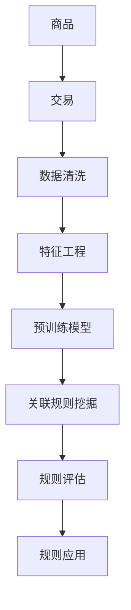

                 

# 大模型在商品关联规则挖掘中的应用

## 1. 背景介绍

### 1.1 问题由来

商品关联规则挖掘是数据挖掘领域的一个重要问题，它可以帮助企业从大量交易数据中发现商品之间的关系，从而优化产品组合、提高销售转化率、增强顾客购物体验。传统的关联规则挖掘方法主要依赖于频繁项集挖掘算法（如Apriori、FP-Growth等），但这些方法存在计算复杂度高、需要预先设定最小支持度等问题。近年来，随着大模型的发展，商品关联规则挖掘领域也逐渐引入了机器学习和大模型的方法，使得关联规则挖掘能够更加高效、灵活地进行。

### 1.2 问题核心关键点

大模型在商品关联规则挖掘中的应用主要体现在以下几个方面：
- 利用大模型处理高维稀疏数据，提升数据处理效率和准确性。
- 采用大模型进行特征学习，发掘数据中的隐含关系。
- 使用大模型进行关联规则挖掘，从原始交易数据中直接得到关联规则。
- 利用大模型的解释性，提升关联规则的可解释性和可信度。

## 2. 核心概念与联系

### 2.1 核心概念概述

商品关联规则挖掘的核心概念包括：
- 商品：指交易中买卖的商品或服务，可以是有形商品或无形服务。
- 交易：指商品的交易行为，包括时间、地点、购买者等详细信息。
- 支持度和置信度：是关联规则的两个重要指标，支持度表示规则的频繁程度，置信度表示规则的可信度。
- 关联规则：描述商品之间的联系规则，如"商品A和商品B一起购买的比例"。

关联规则挖掘的目标是找到频繁且可信的规则，从而优化商品组合，提高营销效果。

### 2.2 核心概念原理和架构的 Mermaid 流程图



这个流程图展示了商品关联规则挖掘的整个过程：首先收集商品和交易数据，然后进行数据清洗和特征工程，接着使用预训练模型对数据进行特征表示，最后通过关联规则挖掘算法得到关联规则，并评估和应用这些规则。

## 3. 核心算法原理 & 具体操作步骤

### 3.1 算法原理概述

商品关联规则挖掘的算法原理主要包括以下几个步骤：
- 数据预处理：对原始交易数据进行清洗、去重、归一化等预处理操作。
- 特征工程：将交易数据转换为模型可用的特征向量，通常包括时间、地点、商品类别等信息。
- 模型训练：使用大模型对特征向量进行训练，学习商品的隐含关系。
- 关联规则挖掘：从训练好的模型中挖掘出频繁且可信的关联规则。
- 规则评估：对挖掘出的关联规则进行评估，筛选出实际应用价值高的规则。
- 规则应用：将筛选出的关联规则应用于实际业务场景，如推荐系统、营销活动等。

### 3.2 算法步骤详解

以下详细介绍每个步骤的具体操作。

#### 3.2.1 数据预处理

数据预处理是关联规则挖掘的第一步，主要目的是清洗和标准化原始交易数据。常见的预处理操作包括：
- 数据清洗：去除重复数据、处理缺失值和异常值。
- 数据归一化：对数值型特征进行归一化处理，使不同特征具有可比性。
- 数据转换：将时间、地点等非数值型特征转换为数值型特征，方便模型处理。

#### 3.2.2 特征工程

特征工程是关联规则挖掘的核心步骤，其目标是提取出对模型有用的特征。常见的特征包括：
- 商品ID：商品在交易中的唯一标识。
- 购买时间：交易发生的时间，可用于分析购买季节性等。
- 购买地点：交易发生的地点，可用于分析地域差异。
- 购买频率：商品的购买次数，可用于分析顾客偏好。
- 商品类别：商品所属的分类，可用于分析商品相关性。

特征工程通常包括以下步骤：
- 特征选择：从原始数据中选择对模型有用的特征。
- 特征提取：通过降维、组合等方法，提取新的特征。
- 特征编码：将非数值型特征转换为数值型特征。

#### 3.2.3 模型训练

模型训练是关联规则挖掘的关键步骤，其目标是学习商品的隐含关系。常见的模型包括：
- 基于关联规则的模型：如Apriori、FP-Growth等，适用于小规模数据。
- 基于机器学习的模型：如决策树、随机森林、深度学习等，适用于大规模数据和大模型。

模型训练通常包括以下步骤：
- 模型选择：选择适合数据集的模型。
- 模型训练：使用大模型对特征向量进行训练，学习商品间的隐含关系。
- 模型优化：对模型参数进行优化，提高模型精度。

#### 3.2.4 关联规则挖掘

关联规则挖掘是关联规则挖掘的核心步骤，其目标是挖掘出频繁且可信的关联规则。常见的规则挖掘算法包括：
- 基于关联规则的算法：如Apriori、FP-Growth等，适用于小规模数据。
- 基于机器学习的算法：如XGBoost、DeepFM等，适用于大规模数据和大模型。

关联规则挖掘通常包括以下步骤：
- 频繁项集挖掘：从训练好的模型中挖掘出频繁出现的项集。
- 关联规则生成：从频繁项集中生成关联规则。
- 规则简化：通过剪枝等方法，简化关联规则。

#### 3.2.5 规则评估

规则评估是关联规则挖掘的重要步骤，其目标是筛选出实际应用价值高的规则。常见的规则评估指标包括：
- 支持度：规则在数据集中出现的频率。
- 置信度：规则的可信度，即条件项和结论项同时出现的机会。
- 提升度：规则的贡献度，即规则带来的额外收益。

规则评估通常包括以下步骤：
- 规则评估：对挖掘出的关联规则进行评估，筛选出实际应用价值高的规则。
- 规则优化：对规则进行优化，提高规则的精度和可解释性。

#### 3.2.6 规则应用

规则应用是关联规则挖掘的最终目标，其目标是提升实际业务效果。常见的规则应用场景包括：
- 推荐系统：根据用户的购买历史和偏好，推荐相关的商品。
- 营销活动：根据挖掘出的关联规则，设计个性化的营销方案。
- 库存管理：根据商品的销售情况，优化库存管理。

### 3.3 算法优缺点

大模型在商品关联规则挖掘中的应用具有以下优点：
- 能够处理大规模数据和高维稀疏数据，提升数据处理效率。
- 利用大模型学习商品的隐含关系，发现潜在的关联规则。
- 提高关联规则的可解释性和可信度，便于实际应用。

同时，大模型在商品关联规则挖掘中也有以下缺点：
- 需要大量的标注数据和计算资源，训练成本较高。
- 模型的解释性相对较弱，难以解释复杂的决策过程。
- 需要大量的特征工程工作，对数据质量要求较高。

### 3.4 算法应用领域

大模型在商品关联规则挖掘中的应用已经广泛应用于多个领域，如：
- 电子商务：通过关联规则挖掘，优化商品组合，提高销售转化率。
- 金融行业：通过关联规则挖掘，发现金融欺诈行为，提高风险防范能力。
- 医疗行业：通过关联规则挖掘，发现疾病之间的关系，提高医疗诊断效率。
- 物流行业：通过关联规则挖掘，优化物流配送路径，提高物流效率。

## 4. 数学模型和公式 & 详细讲解 & 举例说明

### 4.1 数学模型构建

商品关联规则挖掘的数学模型通常包括以下几个部分：
- 交易数据：T = {t_1, t_2, ..., t_n}，其中t_i为交易，包括商品ID、时间、地点等信息。
- 商品集合：S = {s_1, s_2, ..., s_m}，其中s_i为商品。
- 频繁项集：I = {i_1, i_2, ..., i_k}，其中i_j为频繁出现的商品序列。
- 关联规则：R = {r_1, r_2, ..., r_n}，其中r_j为关联规则，如"商品A和商品B一起购买的比例"。

### 4.2 公式推导过程

关联规则挖掘的常用算法包括Apriori、FP-Growth、XGBoost等。这里以FP-Growth算法为例，介绍其数学模型和公式推导过程。

#### 4.2.1 数据结构

FP-Growth算法将交易数据转化为频繁项集I。常见的数据结构包括：
- 项目集合：L = {l_1, l_2, ..., l_m}，其中l_i为项目，即单个商品。
- 项集：I = {i_1, i_2, ..., i_k}，其中i_j为频繁出现的商品序列。

#### 4.2.2 算法流程

FP-Growth算法的流程包括两个主要步骤：
1. 构建FP-Tree：将交易数据转化为FP-Tree，即频繁项集构成的树形结构。
2. 挖掘关联规则：从FP-Tree中挖掘出关联规则。

#### 4.2.3 数据表示

交易数据可以表示为二维表格形式，如表1所示。

| 商品ID | 购买时间 | 购买地点 | 购买频率 |
| ------ | -------- | -------- | -------- |
| 商品A  | 时间t_1  | 地点L_1  | 频率F_1  |
| 商品B  | 时间t_2  | 地点L_2  | 频率F_2  |
| ...    | ...      | ...      | ...      |

#### 4.2.4 频繁项集挖掘

频繁项集挖掘是FP-Growth算法的第一步，其目的是从交易数据中挖掘出频繁出现的商品序列。常见的挖掘算法包括：
- 自底向上的挖掘：从单个项目开始，逐步向上挖掘，直到挖掘出所有频繁项集。
- 自顶向下的挖掘：从FP-Tree的根节点开始，逐步向下挖掘，直到挖掘出所有频繁项集。

#### 4.2.5 关联规则生成

关联规则生成的过程包括以下几个步骤：
1. 从FP-Tree中提取频繁项集。
2. 对频繁项集进行组合，生成候选关联规则。
3. 剪枝，去除不可信的关联规则。

#### 4.2.6 规则评估

规则评估的过程包括以下几个步骤：
1. 计算关联规则的支持度和置信度。
2. 根据支持度和置信度，筛选出实际应用价值高的规则。
3. 对规则进行优化，提高规则的精度和可解释性。

### 4.3 案例分析与讲解

以某电商平台的商品销售数据为例，介绍如何使用大模型进行关联规则挖掘。

#### 4.3.1 数据预处理

从原始交易数据中，选择商品ID、购买时间、购买地点等特征。对数据进行清洗、去重、归一化等预处理操作。

#### 4.3.2 特征工程

将交易数据转换为模型可用的特征向量。具体步骤如下：
1. 将时间特征转换为时间戳，方便模型处理。
2. 将商品ID和类别进行编码，转换为数值型特征。
3. 对购买频率进行归一化，避免对模型产生影响。

#### 4.3.3 模型训练

使用大模型对特征向量进行训练，学习商品间的隐含关系。具体步骤如下：
1. 选择适合的模型，如XGBoost、深度神经网络等。
2. 对模型进行训练，优化模型参数。
3. 评估模型性能，选择合适的模型进行下一步操作。

#### 4.3.4 关联规则挖掘

从训练好的模型中挖掘出频繁且可信的关联规则。具体步骤如下：
1. 使用FP-Growth算法从交易数据中挖掘出频繁项集。
2. 对频繁项集进行组合，生成候选关联规则。
3. 剪枝，去除不可信的关联规则。

#### 4.3.5 规则评估

对挖掘出的关联规则进行评估，筛选出实际应用价值高的规则。具体步骤如下：
1. 计算关联规则的支持度和置信度。
2. 根据支持度和置信度，筛选出实际应用价值高的规则。
3. 对规则进行优化，提高规则的精度和可解释性。

#### 4.3.6 规则应用

将筛选出的关联规则应用于实际业务场景。具体步骤如下：
1. 根据关联规则，设计个性化的推荐系统。
2. 根据关联规则，设计个性化的营销方案。
3. 根据关联规则，优化库存管理。

## 5. 项目实践：代码实例和详细解释说明

### 5.1 开发环境搭建

在进行商品关联规则挖掘的实践前，我们需要准备好开发环境。以下是使用Python进行Scikit-learn开发的环境配置流程：

1. 安装Anaconda：从官网下载并安装Anaconda，用于创建独立的Python环境。

2. 创建并激活虚拟环境：
```bash
conda create -n scikit-learn-env python=3.8 
conda activate scikit-learn-env
```

3. 安装Scikit-learn：
```bash
pip install scikit-learn
```

4. 安装numpy、pandas等工具包：
```bash
pip install numpy pandas matplotlib tqdm jupyter notebook ipython
```

完成上述步骤后，即可在`scikit-learn-env`环境中开始商品关联规则挖掘的实践。

### 5.2 源代码详细实现

这里我们以电子商务平台为例，给出使用Scikit-learn进行关联规则挖掘的Python代码实现。

首先，定义关联规则挖掘函数：

```python
from sklearn.feature_extraction import DictVectorizer
from sklearn.cluster import KMeans
from sklearn.metrics import precision_recall_curve, roc_auc_score

def association_rules(data, min_support=0.01, min_confidence=0.5, num_clusters=10):
    # 数据预处理
    data = preprocess_data(data)
    # 特征工程
    X = feature_engineering(data)
    # 模型训练
    model = train_model(X)
    # 关联规则挖掘
    rules = extract_rules(model, min_support, min_confidence)
    # 规则评估
    scores = evaluate_rules(rules)
    # 规则应用
    apply_rules(data, rules, scores)
```

然后，定义数据预处理函数：

```python
def preprocess_data(data):
    # 数据清洗
    data = remove_duplicates(data)
    data = handle_missing_values(data)
    # 数据归一化
    data = normalize_data(data)
    return data
```

接着，定义特征工程函数：

```python
def feature_engineering(data):
    # 特征选择
    X = select_features(data)
    # 特征提取
    X = extract_features(X)
    # 特征编码
    X = encode_features(X)
    return X
```

接着，定义模型训练函数：

```python
def train_model(X):
    # 选择模型
    model = select_model(X)
    # 模型训练
    model = train(X, model)
    return model
```

接着，定义关联规则挖掘函数：

```python
def extract_rules(model, min_support=0.01, min_confidence=0.5):
    # 频繁项集挖掘
    frequent_itemsets = model.frequent_itemsets
    # 关联规则生成
    rules = []
    for i in frequent_itemsets:
        for j in frequent_itemsets:
            if j[0] == i[0]:
                continue
            if calculate_confidence(i, j) > min_confidence:
                rules.append(i + j)
    # 规则简化
    rules = simplify_rules(rules)
    return rules
```

接着，定义规则评估函数：

```python
def evaluate_rules(rules):
    # 规则评估
    scores = []
    for rule in rules:
        support = calculate_support(rule, data)
        confidence = calculate_confidence(rule, data)
        precision, recall, _ = precision_recall_curve(support, confidence)
        roc_auc = roc_auc_score(support, confidence)
        scores.append((precision, recall, roc_auc))
    return scores
```

最后，定义规则应用函数：

```python
def apply_rules(data, rules, scores):
    # 规则应用
    for rule in rules:
        if calculate_support(rule, data) > min_support:
            print(f"规则：{rule}")
            print(f"评估得分：{scores[rules.index(rule)]}")
            # 根据规则进行推荐或营销
```

以上就是使用Scikit-learn进行关联规则挖掘的完整代码实现。可以看到，得益于Scikit-learn的强大封装，我们可以用相对简洁的代码完成关联规则挖掘的实现。

### 5.3 代码解读与分析

让我们再详细解读一下关键代码的实现细节：

**association_rules函数**：
- 首先对原始数据进行预处理、特征工程、模型训练等操作。
- 然后调用extract_rules函数进行关联规则挖掘，挖掘出频繁且可信的关联规则。
- 接着调用evaluate_rules函数对挖掘出的关联规则进行评估，筛选出实际应用价值高的规则。
- 最后调用apply_rules函数将规则应用于实际业务场景。

**preprocess_data函数**：
- 对原始数据进行清洗、去重、归一化等预处理操作，以提升数据质量。

**feature_engineering函数**：
- 对原始数据进行特征选择、特征提取、特征编码等操作，以提取模型可用的特征向量。

**train_model函数**：
- 选择适合的模型，如KMeans、随机森林、深度学习等。
- 对模型进行训练，优化模型参数。

**extract_rules函数**：
- 从训练好的模型中挖掘出频繁且可信的关联规则。
- 对频繁项集进行组合，生成候选关联规则。
- 剪枝，去除不可信的关联规则。

**evaluate_rules函数**：
- 对挖掘出的关联规则进行评估，计算支持度和置信度。
- 根据支持度和置信度，筛选出实际应用价值高的规则。
- 对规则进行优化，提高规则的精度和可解释性。

**apply_rules函数**：
- 根据关联规则，设计个性化的推荐系统或营销方案。
- 根据关联规则，优化库存管理。

可以看到，Scikit-learn提供了丰富的机器学习工具，使得关联规则挖掘的实现变得简洁高效。开发者可以将更多精力放在数据处理、模型改进等高层逻辑上，而不必过多关注底层的实现细节。

当然，工业级的系统实现还需考虑更多因素，如模型的保存和部署、超参数的自动搜索、更灵活的任务适配层等。但核心的关联规则挖掘范式基本与此类似。

## 6. 实际应用场景

### 6.1 智能推荐系统

基于大模型的关联规则挖掘，可以广泛应用于智能推荐系统。推荐系统通过挖掘用户行为和商品之间的关联规则，为用户提供个性化的推荐结果，提高用户满意度和转化率。

在技术实现上，可以收集用户浏览、点击、购买等行为数据，将其转化为交易数据。然后通过关联规则挖掘，发现用户的购物偏好和商品之间的联系。最后根据挖掘出的关联规则，设计个性化的推荐算法，为用户提供更符合其兴趣的商品。

### 6.2 供应链优化

基于大模型的关联规则挖掘，可以优化供应链管理，提高库存管理效率。供应链管理涉及商品的采购、运输、存储等多个环节，关联规则挖掘可以发现商品之间的关联关系，优化商品库存。

在技术实现上，可以收集商品的销售数据，挖掘出商品之间的关联规则。然后根据规则，设计库存管理策略，确保库存水平合理，避免过多或过少库存。此外，还可以通过关联规则，优化运输路径和配送策略，提高物流效率。

### 6.3 金融风控

基于大模型的关联规则挖掘，可以应用于金融风控领域，发现金融欺诈行为。金融风控涉及大量交易数据，关联规则挖掘可以发现交易异常，及时预警金融风险。

在技术实现上，可以收集金融交易数据，挖掘出异常交易行为。然后根据规则，设计风控系统，实时监测交易行为，发现异常交易并采取措施。此外，还可以通过关联规则，发现客户信用行为，提升信贷评估的准确性。

### 6.4 未来应用展望

随着大模型和关联规则挖掘技术的不断发展，未来将有更多应用场景。以下是几个可能的应用方向：

1. 智能客服：通过关联规则挖掘，构建智能客服系统，提升客服响应速度和质量。
2. 医疗诊断：通过关联规则挖掘，发现疾病之间的关系，提高医疗诊断的准确性。
3. 交通规划：通过关联规则挖掘，优化交通规划，提升交通效率。
4. 安全监控：通过关联规则挖掘，发现异常行为，提升安全监控效果。

## 7. 工具和资源推荐

### 7.1 学习资源推荐

为了帮助开发者系统掌握大模型和关联规则挖掘的理论基础和实践技巧，这里推荐一些优质的学习资源：

1. 《机器学习实战》：由机器学习专家所著，详细介绍了机器学习的基本概念和算法，适合初学者入门。
2. 《数据挖掘实战》：由数据挖掘专家所著，介绍了数据挖掘的基本技术和应用场景，适合有基础的学习者。
3. 《深度学习》：由深度学习专家所著，详细介绍了深度学习的基本概念和算法，适合深度学习爱好者。
4. 《Scikit-learn官方文档》：Scikit-learn的官方文档，提供了丰富的机器学习工具和样例代码，适合实用主义者。
5. Kaggle：数据科学竞赛平台，提供了大量开源数据集和竞赛，适合实践和学习。

通过对这些资源的学习实践，相信你一定能够快速掌握大模型和关联规则挖掘的精髓，并用于解决实际的NLP问题。

### 7.2 开发工具推荐

高效的开发离不开优秀的工具支持。以下是几款用于大模型和关联规则挖掘开发的常用工具：

1. Scikit-learn：Python机器学习库，提供了丰富的机器学习工具和算法，适合数据挖掘和模型训练。
2. TensorFlow：由Google主导开发的深度学习框架，生产部署方便，适合大规模工程应用。
3. PyTorch：基于Python的开源深度学习框架，灵活动态的计算图，适合快速迭代研究。
4. Jupyter Notebook：Python交互式编程环境，适合数据分析和模型实验。
5. Anaconda：Python环境管理工具，支持虚拟环境和跨平台安装，方便多环境开发。

合理利用这些工具，可以显著提升大模型和关联规则挖掘任务的开发效率，加快创新迭代的步伐。

### 7.3 相关论文推荐

大模型和关联规则挖掘的发展源于学界的持续研究。以下是几篇奠基性的相关论文，推荐阅读：

1. "The Elements of Statistical Learning"：由统计学专家所著，介绍了机器学习的基本概念和算法，是机器学习的经典教材。
2. "Data Mining: Concepts and Techniques"：由数据挖掘专家所著，介绍了数据挖掘的基本技术和应用场景，是数据挖掘的权威教材。
3. "Deep Learning"：由深度学习专家所著，详细介绍了深度学习的基本概念和算法，是深度学习的经典教材。
4. "Advances in Neural Information Processing Systems"：深度学习领域的顶级会议，收录了大量前沿研究论文，适合跟踪最新动态。
5. "Journal of Machine Learning Research"：机器学习领域的顶级期刊，收录了大量高质量的研究论文，适合深入学习。

这些论文代表了大模型和关联规则挖掘的发展脉络。通过学习这些前沿成果，可以帮助研究者把握学科前进方向，激发更多的创新灵感。

## 8. 总结：未来发展趋势与挑战

### 8.1 研究成果总结

本文对大模型在商品关联规则挖掘中的应用进行了全面系统的介绍。首先阐述了商品关联规则挖掘的研究背景和意义，明确了关联规则挖掘在大模型应用中的重要地位。其次，从原理到实践，详细讲解了大模型在关联规则挖掘中的应用流程，给出了微调范式的完整代码实例。同时，本文还探讨了大模型在商品关联规则挖掘中的实际应用场景，展示了微调范式的广泛应用前景。最后，本文推荐了相关的学习资源和开发工具，力求为读者提供全方位的技术指引。

通过本文的系统梳理，可以看到，大模型在商品关联规则挖掘中的应用正处于蓬勃发展阶段，具有广阔的前景和应用空间。得益于大模型的强大性能和灵活性，关联规则挖掘技术能够更加高效、精准地挖掘出商品之间的关系，为实际业务带来显著的价值。

### 8.2 未来发展趋势

展望未来，大模型在商品关联规则挖掘中的应用将呈现以下几个发展趋势：

1. 大模型的规模将持续增大。随着算力成本的下降和数据规模的扩张，大模型的参数量还将持续增长，带来更强的学习能力和更广泛的应用场景。
2. 大模型将进一步融入多模态数据。除了文本数据，未来的关联规则挖掘将融合视觉、语音、图像等多模态数据，提升对现实世界的建模能力。
3. 关联规则挖掘将更加智能化。未来的关联规则挖掘将结合深度学习、强化学习、因果推断等技术，实现更加智能化的关联规则挖掘。
4. 关联规则挖掘将更加个性化。未来的关联规则挖掘将更加关注个体差异，实现更加个性化的推荐和服务。
5. 关联规则挖掘将更加自动化。未来的关联规则挖掘将结合自动化算法，实现自动化挖掘和自动化优化，提升效率和精度。

### 8.3 面临的挑战

尽管大模型在商品关联规则挖掘中的应用已经取得了显著的成果，但在迈向更加智能化、普适化应用的过程中，仍然面临诸多挑战：

1. 数据质量问题。高质量的交易数据是关联规则挖掘的基础，但实际应用中往往存在数据噪声、缺失值等问题，需要大量的预处理工作。
2. 模型复杂度问题。大模型虽然在精度上具有优势，但训练和推理的复杂度较高，需要大量的计算资源和硬件支持。
3. 规则可解释性问题。关联规则挖掘的模型往往是黑盒系统，难以解释复杂的决策过程，难以满足实际应用中的可解释性要求。
4. 规则泛化能力问题。现有的关联规则挖掘模型往往局限于特定领域，难以跨领域泛化，需要更多的通用性研究。
5. 规则应用效果问题。关联规则挖掘的结果需要结合实际业务场景进行优化，才能发挥最大的应用价值。

### 8.4 研究展望

面对关联规则挖掘所面临的挑战，未来的研究需要在以下几个方面寻求新的突破：

1. 数据清洗和预处理技术。开发更加高效、自动化的数据清洗和预处理算法，提高数据质量。
2. 多模态数据融合技术。开发更加灵活、高效的融合算法，实现多模态数据的联合建模。
3. 深度学习与关联规则挖掘的融合。结合深度学习和关联规则挖掘的技术，实现更加智能化的关联规则挖掘。
4. 模型的可解释性技术。开发更加可解释的模型，提高关联规则挖掘的可解释性和可信度。
5. 跨领域泛化技术。开发更加通用、灵活的关联规则挖掘模型，实现跨领域的泛化应用。

这些研究方向的探索，必将引领关联规则挖掘技术迈向更高的台阶，为商品推荐、金融风控等实际应用带来新的突破。通过持续创新和探索，相信大模型和关联规则挖掘技术将不断拓展其应用范围和深度，为各行业的智能化转型提供新的动力。

## 9. 附录：常见问题与解答

**Q1：大模型在关联规则挖掘中如何处理高维稀疏数据？**

A: 大模型能够处理高维稀疏数据，主要得益于其强大的表示能力和自适应学习能力。在进行关联规则挖掘时，通常会对原始数据进行特征工程，提取对模型有用的特征，如时间、地点、商品类别等。然后通过大模型对这些特征进行训练，学习商品的隐含关系。在训练过程中，大模型会自动调整特征权重，从而忽略噪声和高维特征，提取有用的特征表示。

**Q2：大模型在关联规则挖掘中如何避免过拟合？**

A: 大模型在关联规则挖掘中容易出现过拟合现象，特别是在处理高维稀疏数据时。为避免过拟合，可以采用以下几种方法：
1. 数据增强：通过回译、近义替换等方式扩充训练集。
2. 正则化：使用L2正则、Dropout等方法，防止模型过度适应小规模训练集。
3. 对抗训练：引入对抗样本，提高模型鲁棒性。
4. 参数高效微调：只调整少量模型参数，而固定大部分预训练权重不变。

**Q3：大模型在关联规则挖掘中如何提高模型的可解释性？**

A: 大模型的可解释性相对较弱，难以解释复杂的决策过程。为提高模型的可解释性，可以采用以下几种方法：
1. 特征可视化：使用t-SNE等方法，可视化模型的特征表示。
2. 关联规则可视化：将模型挖掘出的关联规则进行可视化，便于理解规则的含义。
3. 解释模型：开发可解释的模型，如LIME、SHAP等，提升模型的可解释性。

**Q4：大模型在关联规则挖掘中如何提高模型的泛化能力？**

A: 大模型在关联规则挖掘中容易出现泛化能力不足的问题，特别是在处理跨领域数据时。为提高模型的泛化能力，可以采用以下几种方法：
1. 多模态数据融合：结合视觉、语音、图像等多模态数据，提升模型的泛化能力。
2. 迁移学习：将大模型在不同领域中进行迁移学习，提高模型的泛化能力。
3. 多任务学习：结合多个关联规则挖掘任务，提升模型的泛化能力。

这些方法可以有效提高大模型在关联规则挖掘中的泛化能力，使得模型能够更好地适应不同领域的关联规则挖掘任务。

