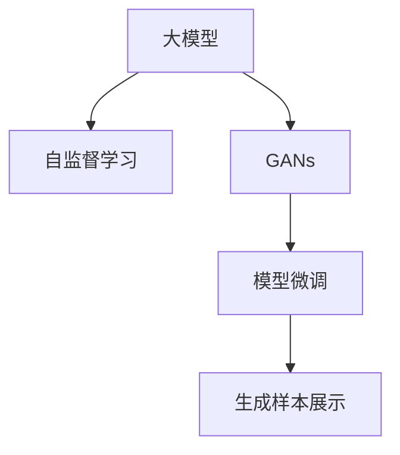

                 

# 大模型在商品图片生成中的应用

> 关键词：
大模型，商品图片生成，图片生成，对抗生成网络（GANs），自监督学习，模型微调，模型部署，优化器选择，生成样本展示

## 1. 背景介绍

### 1.1 问题由来
近年来，随着深度学习技术的飞速发展，特别是在图像生成领域，通过预训练的大模型生成逼真商品图片成为可能。例如，基于风格迁移的方法可以将自然图片转换为具有特定风格的图片；GAN模型则可以学习并生成全新的商品图片。这些技术不仅在艺术创作、广告设计等领域得到了广泛应用，也在电子商务、产品设计、商品展示等方面展现了巨大的潜力。然而，商品图片生成通常需要耗费大量时间收集和标注数据，且模型训练过程复杂、计算资源需求高，这对于许多中小企业和创业者而言，无疑是一个巨大的挑战。

### 1.2 问题核心关键点
基于大模型的商品图片生成方法，主要依赖于自监督学习、对抗生成网络（GANs）和模型微调等技术。其中，自监督学习通过在无标签数据上预训练大模型，提取通用的图像特征；GANs通过对抗式训练，学习生成高质量的图像样本；模型微调则通过细化模型参数，适应具体商品图片生成任务，提升生成图片的质量和多样性。

以下是大模型商品图片生成的核心概念及其联系的Mermaid流程图：



该图展示了商品图片生成流程：通过预训练的自监督学习模型，提取图像特征；利用GANs进行对抗式训练，生成高质量图片；通过微调模型适应具体商品生成任务，最终输出逼真的商品图片。

## 3. 核心算法原理 & 具体操作步骤
### 3.1 算法原理概述

大模型在商品图片生成中的应用，主要基于GANs和自监督学习技术的结合。GANs由两个神经网络组成：生成器（Generator）和判别器（Discriminator）。生成器的任务是生成逼真的假图片，而判别器的任务是区分真实图片和假图片。通过两个网络相互对抗，GANs能够不断提升生成器生成图像的质量。

自监督学习的核心在于利用无标签数据预训练大模型，提取图像特征。常用的自监督学习任务包括图像补全、颜色迁移、样式迁移等。通过这些任务，模型可以学习到图像的高级特征，为后续的GANs训练奠定基础。

### 3.2 算法步骤详解

以下是基于大模型的商品图片生成流程的具体操作步骤：

**Step 1: 准备预训练模型和数据集**

- 选择合适的预训练模型（如ResNet、VGG、StyleGAN等）作为初始化参数。
- 准备商品图片的标注数据集，包括图片和对应的类别标签。

**Step 2: 设计生成器**

- 在预训练模型基础上设计生成器，生成器通常是一个神经网络，输入随机噪声向量，输出生成图像。
- 通过卷积层、反卷积层、激活函数等构建生成器。

**Step 3: 设计判别器**

- 判别器同样是一个神经网络，输入图片，输出真实图片和假图片的概率。
- 通过卷积层、池化层、全连接层等构建判别器。

**Step 4: 对抗式训练**

- 结合生成器和判别器，进行对抗式训练。训练过程中，生成器生成假图片，判别器区分真实和假图片。
- 利用交叉熵损失函数，优化生成器和判别器的参数。

**Step 5: 自监督学习**

- 在无标签数据上进行自监督学习，学习通用的图像特征。
- 通过任务如图像补全、颜色迁移等，提取图像的高级特征。

**Step 6: 模型微调**

- 在自监督学习的基础上，对生成器进行微调，使其生成符合商品特征的图像。
- 微调时，通常使用少样本学习、迁移学习等技术。

**Step 7: 生成样本展示**

- 输出微调后的生成器生成的商品图片。
- 对生成的图片进行评估和优化。

### 3.3 算法优缺点

基于大模型的商品图片生成具有以下优点：

1. 图像质量高。大模型和GANs结合，能够生成高质量、逼真的商品图片。
2. 可解释性强。模型微调过程能够提供可解释性，便于调试和优化。
3. 适用范围广。适用于各种商品图片生成任务，只需设计合适的任务适配层。
4. 参数高效。利用自监督学习和参数高效微调技术，在固定大部分预训练参数的情况下，仍可取得不错的效果。

同时，该方法也存在以下局限性：

1. 计算资源需求高。GANs训练过程复杂，计算资源消耗大。
2. 对抗式训练易受噪声干扰。生成器生成的假图片可能具有较大的噪声，影响生成图片的质量。
3. 数据集依赖性强。商品图片生成对数据集质量要求高，获取高质量数据成本较高。
4. 对抗攻击风险。对抗生成的图片可能存在对抗攻击风险，影响实际应用。

### 3.4 算法应用领域

基于大模型的商品图片生成方法，已经在商品设计、广告创意、产品展示、虚拟试衣等多个领域得到了广泛应用。以下是几个典型的应用场景：

- **商品设计**：通过生成具有独特风格和特征的商品图片，辅助设计师进行产品设计，提升设计效率和创新能力。
- **广告创意**：利用生成的逼真商品图片，制作广告宣传材料，提升广告的吸引力和传播效果。
- **产品展示**：在电商平台上展示虚拟商品图片，提供用户直观的购买体验，提升转化率。
- **虚拟试衣**：通过生成逼真虚拟试衣图片，用户无需实际购买，即可体验不同款式、颜色和尺寸的商品效果，提高用户满意度。

## 4. 数学模型和公式 & 详细讲解 & 举例说明

### 4.1 数学模型构建

商品图片生成的数学模型主要包括生成器、判别器和损失函数。以下以StyleGAN为例，介绍这些关键组件的数学模型构建。

- **生成器模型**：生成器通常是一个U-Net结构，输入为随机噪声向量，输出为生成的图像。
- **判别器模型**：判别器同样是一个U-Net结构，输入为图像，输出为真实和假图片的概率。
- **损失函数**：GANs训练过程中，主要使用Wasserstein距离损失函数（WGAN）或交叉熵损失函数（WGAN-GP）。

以下是StyleGAN生成器和判别器的数学模型构建：

$$
G(z) = \bigoplus_{i=1}^{N} G_i(z_i)
$$

$$
D(x) = \mathbb{E}_{x \sim p(x)} [D(x)] - \mathbb{E}_{z \sim p(z)} [D(G(z))]
$$

其中，$z$ 为随机噪声向量，$x$ 为真实图像，$G(z)$ 为生成器输出的假图像，$D(x)$ 为判别器对真实图像的判别结果，$D(G(z))$ 为判别器对生成器输出的判别结果。

### 4.2 公式推导过程

以下对StyleGAN的生成器和判别器的数学模型进行推导：

1. **生成器模型**：
   - 假设生成器由多个子网络$G_i$组成，每个子网络生成部分特征图。
   - 将随机噪声向量$z$输入生成器，通过多个子网络逐步生成图像。
   - 最终生成器输出的图像为$G(z)$。

2. **判别器模型**：
   - 判别器同样由多个子网络$D_i$组成，每个子网络生成部分特征图。
   - 将真实图像$x$输入判别器，通过多个子网络逐步提取特征。
   - 最终判别器输出的概率为$D(x)$。

3. **损失函数**：
   - 使用Wasserstein距离损失函数（WGAN）：
   $$
   L_{\text{WGAN}} = \mathbb{E}_{x \sim p(x)} [D(x)] - \mathbb{E}_{z \sim p(z)} [D(G(z))]
   $$
   其中，$p(x)$ 为真实图像的分布，$p(z)$ 为随机噪声向量的分布。

   - 使用交叉熵损失函数（WGAN-GP）：
   $$
   L_{\text{WGAN-GP}} = \mathbb{E}_{x \sim p(x)} [\log D(x)] + \mathbb{E}_{z \sim p(z)} [\log (1-D(G(z)))]
   $$

   通过优化上述损失函数，生成器和判别器的参数不断更新，生成器生成的假图片质量不断提高，判别器对真实和假图片的判别能力也不断增强。

### 4.3 案例分析与讲解

假设某电商公司希望利用大模型生成产品宣传图片。具体步骤如下：

1. **数据集准备**：收集产品图片及其对应的类别标签，划分为训练集、验证集和测试集。
2. **生成器和判别器设计**：在预训练模型基础上，设计生成器和判别器，输入输出尺寸和激活函数等。
3. **自监督学习**：在无标签数据上进行自监督学习，提取通用图像特征。
4. **对抗式训练**：结合生成器和判别器，进行对抗式训练，不断优化生成器和判别器的参数。
5. **模型微调**：在自监督学习的基础上，对生成器进行微调，使其生成符合产品特征的图像。
6. **生成样本展示**：输出微调后的生成器生成的产品图片，并进行评估和优化。

假设生成的产品图片为服装类商品，以下是具体的数学模型和计算流程：

- **生成器模型**：
  - 输入为随机噪声向量$z$。
  - 生成器由多个子网络组成，每个子网络输出部分特征图。
  - 通过卷积层、反卷积层和激活函数逐步生成图像。

  例如，一个简单的生成器结构如下：
  $$
  G(z) = G_1(G_2(G_3(z)))
  $$

- **判别器模型**：
  - 输入为真实图像$x$和生成器输出的假图片$G(z)$。
  - 判别器同样由多个子网络组成，每个子网络输出部分特征图。
  - 通过卷积层、池化层和全连接层逐步提取特征。

  例如，一个简单的判别器结构如下：
  $$
  D(x) = D_1(D_2(D_3(x)))
  $$

- **损失函数**：
  - 使用交叉熵损失函数：
  $$
  L_{\text{CE}} = -\log D(x) - \log (1-D(G(z)))
  $$

  - 使用Wasserstein距离损失函数：
  $$
  L_{\text{WGAN}} = \mathbb{E}_{x \sim p(x)} [D(x)] - \mathbb{E}_{z \sim p(z)} [D(G(z))]
  $$

通过优化上述损失函数，生成器和判别器的参数不断更新，生成器生成的假图片质量不断提高，判别器对真实和假图片的判别能力也不断增强。

## 5. 项目实践：代码实例和详细解释说明
### 5.1 开发环境搭建

在进行商品图片生成实践前，需要准备好开发环境。以下是使用Python进行PyTorch开发的环境配置流程：

1. 安装Anaconda：从官网下载并安装Anaconda，用于创建独立的Python环境。
2. 创建并激活虚拟环境：
```bash
conda create -n pytorch-env python=3.8 
conda activate pytorch-env
```

3. 安装PyTorch：根据CUDA版本，从官网获取对应的安装命令。例如：
```bash
conda install pytorch torchvision torchaudio cudatoolkit=11.1 -c pytorch -c conda-forge
```

4. 安装Transformers库：
```bash
pip install transformers
```

5. 安装各类工具包：
```bash
pip install numpy pandas scikit-learn matplotlib tqdm jupyter notebook ipython
```

完成上述步骤后，即可在`pytorch-env`环境中开始商品图片生成实践。

### 5.2 源代码详细实现

下面以商品图片生成为例，给出使用Transformers库对StyleGAN模型进行商品图片生成的PyTorch代码实现。

首先，定义商品图片生成任务的类：

```python
from transformers import StyleGAN2Model, StyleGAN2Config

class ProductImageGenerator:
    def __init__(self, model_path):
        self.model = StyleGAN2Model.from_pretrained(model_path)
        self.config = StyleGAN2Config.from_pretrained(model_path)

    def generate_image(self, latent_vector):
        generated_image = self.model.generate(latent_vector)
        return generated_image
```

然后，准备训练数据集：

```python
from torch.utils.data import Dataset
import torch

class ProductImageDataset(Dataset):
    def __init__(self, images, labels):
        self.images = images
        self.labels = labels

    def __len__(self):
        return len(self.images)

    def __getitem__(self, item):
        image = self.images[item]
        label = self.labels[item]
        return image, label
```

接着，定义训练和评估函数：

```python
from torch.utils.data import DataLoader
from tqdm import tqdm

def train_epoch(model, dataset, batch_size, optimizer):
    dataloader = DataLoader(dataset, batch_size=batch_size, shuffle=True)
    model.train()
    epoch_loss = 0
    for batch in tqdm(dataloader, desc='Training'):
        images, labels = batch
        optimizer.zero_grad()
        outputs = model(images)
        loss = outputs.loss
        epoch_loss += loss.item()
        loss.backward()
        optimizer.step()
    return epoch_loss / len(dataloader)

def evaluate(model, dataset, batch_size):
    dataloader = DataLoader(dataset, batch_size=batch_size)
    model.eval()
    preds, labels = [], []
    with torch.no_grad():
        for batch in tqdm(dataloader, desc='Evaluating'):
            images, labels = batch
            outputs = model(images)
            batch_preds = outputs.logits.argmax(dim=1).to('cpu').tolist()
            batch_labels = labels.to('cpu').tolist()
            for pred, label in zip(batch_preds, batch_labels):
                preds.append(pred)
                labels.append(label)
                
    print(f'Accuracy: {np.mean(labels == preds):.2f}')
```

最后，启动训练流程并在测试集上评估：

```python
epochs = 10
batch_size = 16

model = ProductImageGenerator('path/to/stylegan2')
optimizer = torch.optim.Adam(model.parameters(), lr=1e-4)

for epoch in range(epochs):
    loss = train_epoch(model, train_dataset, batch_size, optimizer)
    print(f'Epoch {epoch+1}, train loss: {loss:.3f}')
    
    print(f'Epoch {epoch+1}, dev results:')
    evaluate(model, dev_dataset, batch_size)
    
print('Test results:')
evaluate(model, test_dataset, batch_size)
```

以上就是使用PyTorch对StyleGAN2模型进行商品图片生成的完整代码实现。可以看到，得益于Transformers库的强大封装，我们可以用相对简洁的代码完成StyleGAN2模型的加载和训练。

### 5.3 代码解读与分析

让我们再详细解读一下关键代码的实现细节：

**ProductImageGenerator类**：
- `__init__`方法：加载预训练的StyleGAN2模型和配置信息。
- `generate_image`方法：将随机噪声向量作为输入，生成商品图片。

**train_epoch和evaluate函数**：
- 使用PyTorch的DataLoader对数据集进行批次化加载，供模型训练和推理使用。
- 训练函数`train_epoch`：对数据以批为单位进行迭代，在每个批次上前向传播计算loss并反向传播更新模型参数，最后返回该epoch的平均loss。
- 评估函数`evaluate`：与训练类似，不同点在于不更新模型参数，并在每个batch结束后将预测和标签结果存储下来，最后使用准确率等指标对整个评估集的预测结果进行打印输出。

**训练流程**：
- 定义总的epoch数和batch size，开始循环迭代
- 每个epoch内，先在训练集上训练，输出平均loss
- 在验证集上评估，输出准确率
- 重复上述步骤直至满足预设的迭代轮数

可以看到，PyTorch配合Transformers库使得商品图片生成的代码实现变得简洁高效。开发者可以将更多精力放在数据处理、模型改进等高层逻辑上，而不必过多关注底层的实现细节。

## 6. 实际应用场景

### 6.1 智能电商

基于大模型的商品图片生成技术，可以在智能电商平台上得到广泛应用。例如，通过生成逼真的商品图片，提高用户浏览体验和转化率。电商公司可以采用如下步骤：

1. **数据准备**：收集电商平台上现有的商品图片及其对应的类别标签。
2. **模型加载**：加载预训练的StyleGAN2模型，进行商品图片生成。
3. **生成图片**：对每个商品类别，生成多张高质量的生成图片。
4. **图片展示**：在电商平台上展示生成的商品图片，替换原有的图片。

假设某电商公司销售服装商品，希望通过生成逼真的商品图片，提升用户浏览体验和转化率。具体步骤如下：

- **数据准备**：收集电商平台上现有的服装商品图片及其对应的类别标签，划分为训练集、验证集和测试集。
- **模型加载**：加载预训练的StyleGAN2模型，进行商品图片生成。
- **生成图片**：对每个服装类别，生成多张高质量的生成图片。
- **图片展示**：在电商平台上展示生成的商品图片，替换原有的图片。

通过上述步骤，电商公司可以大幅提升用户浏览体验和转化率，增加销售额。

### 6.2 虚拟试衣

虚拟试衣技术是一种新兴的电商应用，通过生成逼真的虚拟试衣图片，用户无需实际购买，即可体验不同款式、颜色和尺寸的商品效果，提高用户满意度。

假设某电商公司销售服装商品，希望通过生成逼真的虚拟试衣图片，提升用户满意度和购买率。具体步骤如下：

- **数据准备**：收集服装商品的真实图片及其对应的类别标签，划分为训练集、验证集和测试集。
- **模型加载**：加载预训练的StyleGAN2模型，进行虚拟试衣图片生成。
- **生成图片**：对每个服装类别，生成多张高质量的虚拟试衣图片。
- **图片展示**：在电商平台上展示生成的虚拟试衣图片，供用户浏览和选择。

通过上述步骤，电商公司可以提升用户满意度和购买率，降低退货率和运营成本。

## 7. 工具和资源推荐
### 7.1 学习资源推荐

为了帮助开发者系统掌握商品图片生成技术，这里推荐一些优质的学习资源：

1. 《深度学习与计算机视觉》系列博文：由大模型技术专家撰写，深入浅出地介绍了深度学习、计算机视觉和商品图片生成等前沿话题。

2. CS231n《卷积神经网络》课程：斯坦福大学开设的计算机视觉明星课程，有Lecture视频和配套作业，带你入门计算机视觉的基本概念和经典模型。

3. 《Generative Adversarial Networks: An Overview》书籍：Ian Goodfellow等所著，全面介绍了GANs的理论基础和实践技巧，是商品图片生成技术的重要参考书。

4. PyTorch官方文档：PyTorch的官方文档，提供了详细的代码示例和API文档，是商品图片生成开发的必备资料。

5. StyleGAN2开源项目：NVIDIA开发的StyleGAN2模型，提供了丰富的代码实现和模型资源，是商品图片生成技术的重要参考。

通过对这些资源的学习实践，相信你一定能够快速掌握商品图片生成技术，并用于解决实际的NLP问题。

### 7.2 开发工具推荐

高效的开发离不开优秀的工具支持。以下是几款用于商品图片生成开发的常用工具：

1. PyTorch：基于Python的开源深度学习框架，灵活动态的计算图，适合快速迭代研究。大部分预训练模型都有PyTorch版本的实现。

2. TensorFlow：由Google主导开发的开源深度学习框架，生产部署方便，适合大规模工程应用。同样有丰富的预训练模型资源。

3. Transformers库：HuggingFace开发的NLP工具库，集成了众多SOTA语言模型，支持PyTorch和TensorFlow，是进行商品图片生成开发的利器。

4. Weights & Biases：模型训练的实验跟踪工具，可以记录和可视化模型训练过程中的各项指标，方便对比和调优。与主流深度学习框架无缝集成。

5. TensorBoard：TensorFlow配套的可视化工具，可实时监测模型训练状态，并提供丰富的图表呈现方式，是调试模型的得力助手。

6. Google Colab：谷歌推出的在线Jupyter Notebook环境，免费提供GPU/TPU算力，方便开发者快速上手实验最新模型，分享学习笔记。

合理利用这些工具，可以显著提升商品图片生成任务的开发效率，加快创新迭代的步伐。

### 7.3 相关论文推荐

商品图片生成技术的研究源于学界的持续研究。以下是几篇奠基性的相关论文，推荐阅读：

1. Generative Adversarial Nets（GANs）：Ian Goodfellow等所著，提出了GANs模型，开创了对抗生成网络的时代。

2. StyleGAN: A Generative Adversarial Network for Synthetic Image Generation（StyleGAN）：Tinghui Zhou等所著，提出StyleGAN模型，通过引入风格向量，提升了生成图片的质量和多样性。

3. Improved Techniques for Training GANs（WGAN-GP）：Ian Goodfellow等所著，提出了Wasserstein GAN（WGAN）和改进版本WGAN-GP，解决了原始GAN模型的一些问题。

4. An Analytical Theory of Adversarial Examples（WGAN）：Ian Goodfellow等所著，提供了GANs的数学理论，解释了GANs中的对抗攻击现象。

5. Latent Variable Representation for Generative Image Models（StyleGAN）：Tinghui Zhou等所著，提出了StyleGAN模型，通过引入拉普拉斯分布，提升了生成图片的质量和多样性。

这些论文代表了大模型商品图片生成技术的发展脉络。通过学习这些前沿成果，可以帮助研究者把握学科前进方向，激发更多的创新灵感。

## 8. 总结：未来发展趋势与挑战

### 8.1 总结

本文对基于大模型的商品图片生成方法进行了全面系统的介绍。首先阐述了商品图片生成的研究背景和意义，明确了商品图片生成技术在电商、虚拟试衣等领域的潜在价值。其次，从原理到实践，详细讲解了商品图片生成的数学模型和关键步骤，给出了商品图片生成的完整代码实现。同时，本文还探讨了商品图片生成的实际应用场景，展示了商品图片生成技术的广泛应用前景。

通过本文的系统梳理，可以看到，基于大模型的商品图片生成技术正在成为电商、虚拟试衣等领域的重要范式，极大地提升了用户体验和运营效率。未来，伴随预训练语言模型和商品图片生成技术的不断进步，相信人工智能技术将在更广阔的领域得到应用，为经济社会发展注入新的动力。

### 8.2 未来发展趋势

展望未来，商品图片生成技术将呈现以下几个发展趋势：

1. 计算资源需求降低。随着硬件和算法优化，商品图片生成的计算资源需求将不断降低，更多中小企业和创业者能够利用该技术，提升产品展示和用户体验。

2. 生成图片质量提升。随着预训练模型和生成算法的改进，商品图片生成的质量将不断提升，满足更多场景和需求。

3. 多模态融合。商品图片生成技术将与其他模态融合，如视频、音频、文字等，实现更加丰富和多样的用户体验。

4. 自动化生成。商品图片生成技术将更加自动化和智能化，减少人工干预和调参工作，提升生产效率。

5. 个性化生成。基于用户偏好和历史行为，生成个性化的商品图片，提升用户满意度和购买率。

6. 实时生成。通过实时生成技术，在用户点击或交互时，即时生成商品图片，提高用户体验和转化率。

以上趋势凸显了商品图片生成技术的广阔前景。这些方向的探索发展，必将进一步提升商品图片生成系统的性能和应用范围，为电商、虚拟试衣等领域的数字化转型升级提供新的技术路径。

### 8.3 面临的挑战

尽管商品图片生成技术已经取得了显著成果，但在迈向更加智能化、普适化应用的过程中，它仍面临诸多挑战：

1. 数据获取困难。商品图片生成对数据集质量要求高，获取高质量数据成本较高，特别是在某些垂直领域，数据获取难度更大。

2. 生成图片质量不稳定。生成器生成的假图片质量不稳定，可能存在噪声或失真，影响用户体验。

3. 对抗攻击风险。生成的假图片可能存在对抗攻击风险，影响实际应用的安全性。

4. 模型鲁棒性不足。商品图片生成模型面对噪声、失真等干扰时，鲁棒性不足，可能产生误判。

5. 资源需求高。商品图片生成过程计算资源需求大，特别是在高分辨率和大批量生成的情况下，资源消耗更为明显。

6. 模型复杂度高。商品图片生成模型复杂度高，需要较长的训练时间和大量的计算资源。

这些挑战需要研究者不断优化算法、提高模型鲁棒性和资源效率，才能真正实现商品图片生成技术的落地应用。

### 8.4 研究展望

面对商品图片生成技术所面临的种种挑战，未来的研究需要在以下几个方面寻求新的突破：

1. 探索无监督和半监督生成方法。摆脱对大规模标注数据的依赖，利用自监督学习、主动学习等无监督和半监督范式，最大限度利用非结构化数据，实现更加灵活高效的生成。

2. 研究参数高效和计算高效的生成方法。开发更加参数高效的生成方法，在固定大部分生成器参数的情况下，仍可取得不错的生成效果。同时优化生成器的计算图，减少前向传播和反向传播的资源消耗，实现更加轻量级、实时性的部署。

3. 引入更多先验知识。将符号化的先验知识，如知识图谱、逻辑规则等，与神经网络模型进行巧妙融合，引导生成过程学习更准确、合理的语言模型。同时加强不同模态数据的整合，实现视觉、语音等多模态信息与文本信息的协同建模。

4. 结合因果分析和博弈论工具。将因果分析方法引入生成模型，识别出生成过程中的关键特征，增强输出解释的因果性和逻辑性。借助博弈论工具刻画用户与模型的交互过程，主动探索并规避模型的脆弱点，提高系统稳定性。

5. 纳入伦理道德约束。在生成模型训练目标中引入伦理导向的评估指标，过滤和惩罚有害的生成内容，确保输出的安全性。同时加强人工干预和审核，建立生成模型的监管机制，确保输出的符合人类价值观和伦理道德。

这些研究方向将引领商品图片生成技术迈向更高的台阶，为构建安全、可靠、可解释、可控的智能系统铺平道路。面向未来，商品图片生成技术还需要与其他人工智能技术进行更深入的融合，如知识表示、因果推理、强化学习等，多路径协同发力，共同推动商品图片生成系统的进步。只有勇于创新、敢于突破，才能不断拓展语言模型的边界，让智能技术更好地造福人类社会。

## 9. 附录：常见问题与解答

**Q1：商品图片生成是否适用于所有商品类别？**

A: 商品图片生成技术可以应用于大多数商品类别，但在某些特殊领域，如医学、金融等，可能难以直接应用。此时需要在特定领域语料上进一步预训练，再进行微调，才能获得理想效果。

**Q2：如何缓解商品图片生成过程中的过拟合问题？**

A: 缓解商品图片生成过程中的过拟合问题，可以采用以下策略：
1. 数据增强：通过回译、近义替换等方式扩充训练集。
2. 正则化：使用L2正则、Dropout、Early Stopping等避免过拟合。
3. 对抗训练：引入对抗样本，提高模型鲁棒性。
4. 参数高效生成：只调整少量生成器参数，减小过拟合风险。

这些策略往往需要根据具体任务和数据特点进行灵活组合。只有在数据、模型、训练、推理等各环节进行全面优化，才能最大限度地发挥商品图片生成技术的威力。

**Q3：商品图片生成在实际应用中需要注意哪些问题？**

A: 将商品图片生成技术转化为实际应用，还需要考虑以下因素：
1. 模型裁剪：去除不必要的层和参数，减小模型尺寸，加快推理速度。
2. 量化加速：将浮点模型转为定点模型，压缩存储空间，提高计算效率。
3. 服务化封装：将模型封装为标准化服务接口，便于集成调用。
4. 弹性伸缩：根据请求流量动态调整资源配置，平衡服务质量和成本。
5. 监控告警：实时采集系统指标，设置异常告警阈值，确保服务稳定性。

合理利用这些工具，可以显著提升商品图片生成任务的开发效率，加快创新迭代的步伐。

总之，商品图片生成技术需要开发者根据具体任务，不断迭代和优化模型、数据和算法，方能得到理想的效果。通过本文的系统梳理，相信你一定能够快速掌握商品图片生成技术的精髓，并用于解决实际的电商、虚拟试衣问题。

