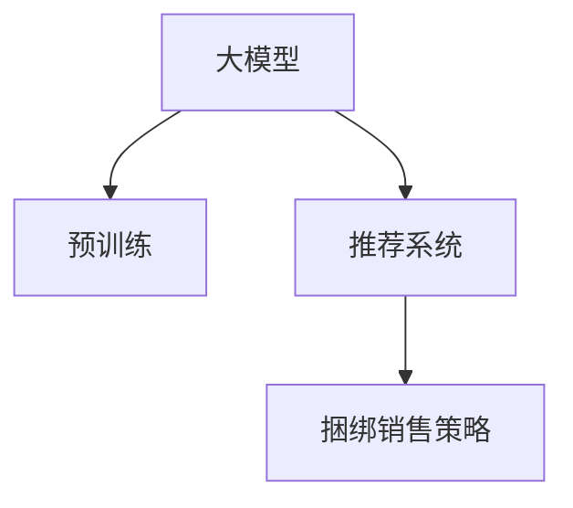

                 

# 大模型在商品捆绑销售策略中的应用

> 关键词：大模型,商品推荐,推荐系统,销售策略,深度学习

## 1. 背景介绍

### 1.1 问题由来
在电商行业，商品推荐策略对于提升用户购买率和销售额至关重要。传统的推荐系统依赖于用户历史行为数据进行推荐，但这种方法存在冷启动问题，无法为刚入坑的新用户提供有效的商品推荐。而捆绑销售策略则可以较好地解决这个问题，即根据用户历史购买行为，推荐与之前购买商品相关联的捆绑商品，提升用户购买转化率。

近年来，基于大模型的推荐系统成为了研究的热点。大模型通过在海量数据上进行预训练，学习到了丰富的商品关联和用户兴趣信息。在此基础上，通过微调和训练，可以有效提升商品推荐和捆绑销售策略的精度和效果。本文将详细介绍大模型在商品捆绑销售策略中的应用，从核心概念、算法原理、数学模型到代码实践，全面阐述其应用原理和实践技巧。

## 2. 核心概念与联系

### 2.1 核心概念概述

为了更好地理解大模型在商品捆绑销售策略中的应用，本节将介绍几个关键概念：

- **大模型(Large Model)**：指基于深度神经网络架构，参数量巨大，能够在大规模无标签数据上进行预训练，学习通用的知识表示。常用的大模型包括BERT、GPT、XLNet等。

- **推荐系统(Recommendation System)**：指通过分析用户历史行为数据，预测用户可能感兴趣的商品，并进行推荐的系统。推荐系统分为基于内容的推荐、协同过滤推荐、混合推荐等多种类型。

- **捆绑销售策略(Bundling Sales Strategy)**：指将多种商品打包销售的策略，通过组合销售的方式，提升用户购买意愿和满意度。捆绑销售策略分为捆绑推荐、组合推荐、包销等形式。

- **深度学习(Deep Learning)**：指通过深度神经网络模型，利用多层非线性映射，从数据中学习高层次特征表示，进行高效预测和决策。

这些核心概念之间的逻辑关系可以通过以下Mermaid流程图来展示：



这个流程图展示了大模型、推荐系统和捆绑销售策略之间的内在联系：

1. 大模型通过预训练学习商品和用户行为的知识表示，提供推荐的基础。
2. 推荐系统利用大模型的知识表示，结合用户历史行为数据，生成推荐结果。
3. 捆绑销售策略在推荐结果的基础上，进行组合优化和推荐。

## 3. 核心算法原理 & 具体操作步骤

### 3.1 算法原理概述

大模型在商品捆绑销售策略中的应用，主要涉及大模型的预训练、微调和训练过程。具体步骤如下：

1. **预训练**：首先在大规模无标签商品数据上进行预训练，学习商品之间的关联性和用户行为模式。
2. **微调**：在预训练的基础上，利用部分有标签的商品数据，进行微调训练，学习商品之间的相关性。
3. **推荐系统训练**：在微调后的模型基础上，结合用户历史行为数据，训练推荐系统，生成商品推荐结果。
4. **捆绑销售策略生成**：对推荐结果进行组合优化，生成捆绑销售策略。

### 3.2 算法步骤详解

#### 3.2.1 预训练

预训练阶段的目标是学习商品之间的关联性和用户行为模式。具体步骤包括：

1. 数据准备：收集大规模商品数据，去除缺失数据和异常数据。
2. 分词处理：将商品名称、描述等文本数据进行分词处理。
3. 构建模型：选择适合的大模型架构，如Transformer，并进行初始化。
4. 预训练任务：选择合适的预训练任务，如掩码语言模型、下一句预测等，在大规模数据上进行预训练。

#### 3.2.2 微调

微调阶段的目标是学习商品之间的相关性。具体步骤包括：

1. 数据准备：收集有标签的商品数据，并划分为训练集和验证集。
2. 构建模型：加载预训练模型，并添加适当的输出层。
3. 设置优化器：选择合适的优化器，如Adam，并设置学习率。
4. 训练模型：使用训练集数据进行微调训练，并使用验证集进行模型评估和调整。

#### 3.2.3 推荐系统训练

推荐系统训练阶段的目标是生成商品推荐结果。具体步骤包括：

1. 数据准备：收集用户历史行为数据，包括浏览、购买、评分等。
2. 构建模型：在微调后的模型基础上，添加推荐系统组件，如用户兴趣表示、商品特征表示、注意力机制等。
3. 训练模型：使用用户历史行为数据进行训练，生成推荐结果。

#### 3.2.4 捆绑销售策略生成

捆绑销售策略生成阶段的目标是优化推荐结果。具体步骤包括：

1. 推荐结果分析：对推荐结果进行分析，计算推荐商品的组合覆盖度和相关性。
2. 组合优化：选择具有高相关性和高覆盖度的商品组合，进行优化。
3. 生成策略：根据组合优化结果，生成捆绑销售策略。

### 3.3 算法优缺点

大模型在商品捆绑销售策略中的应用具有以下优点：

1. **精度高**：大模型在大规模数据上进行预训练，学习到丰富的商品和用户行为知识，生成的推荐结果精度较高。
2. **泛化能力强**：大模型的泛化能力较强，能够较好地适应不同商品和用户行为模式，具有较好的应用普适性。
3. **可解释性强**：大模型通过深度神经网络结构，可以对推荐结果进行解释和分析，提升决策的透明度和可信度。

但同时，该方法也存在一些局限性：

1. **计算资源消耗大**：大模型训练和微调需要大量的计算资源，对硬件要求较高。
2. **数据需求量大**：大模型需要大规模的无标签数据进行预训练，对于小规模的数据集，可能无法取得理想的效果。
3. **模型复杂度高**：大模型的结构复杂，训练和推理需要较高的时间成本，对系统性能要求较高。

尽管存在这些局限性，但就目前而言，大模型在商品捆绑销售策略中的应用仍然是研究热点，具有较高的应用价值。

### 3.4 算法应用领域

大模型在商品捆绑销售策略中的应用，已经广泛应用于电商、零售、金融等行业。具体应用场景包括：

1. **电商行业**：电商平台通过大模型进行商品推荐和组合优化，提升用户购买转化率和销售额。
2. **零售行业**：零售商通过大模型进行跨品类推荐和捆绑销售，提升客流和利润。
3. **金融行业**：金融公司通过大模型进行产品推荐和组合优化，提升客户满意度和交易量。

## 4. 数学模型和公式 & 详细讲解

### 4.1 数学模型构建

大模型在商品捆绑销售策略中的应用，涉及多个数学模型的构建。

设商品集为 $S$，用户集为 $U$，用户对商品的评分向量为 $\mathbf{r}_u$，商品之间的相似度矩阵为 $C$，用户的兴趣表示为 $\mathbf{p}_u$，商品特征向量为 $\mathbf{f}_i$，推荐结果为 $\mathbf{y}_u$。

推荐模型可以表示为：

$$
\mathbf{y}_u = M(\mathbf{p}_u, \mathbf{f}_i; \theta)
$$

其中，$M$ 为推荐模型的映射函数，$\theta$ 为模型参数。

### 4.2 公式推导过程

大模型在商品推荐中的应用，通常采用深度神经网络结构，如 Transformer、BERT 等。以 Transformer 为例，其数学模型和推导过程如下：

1. **编码器**：
   - **自注意力机制**：对用户兴趣表示和商品特征向量进行自注意力计算，得到用户-商品相似度矩阵。
   - **编码器层**：对用户兴趣表示和商品特征向量进行编码，得到用户和商品的嵌入表示。

2. **解码器**：
   - **自注意力机制**：对用户兴趣表示和商品特征向量进行自注意力计算，得到用户-商品相似度矩阵。
   - **解码器层**：对用户兴趣表示和商品特征向量进行编码，得到用户和商品的嵌入表示。

3. **推荐结果**：
   - **评分计算**：对用户兴趣表示和商品特征向量进行内积计算，得到用户对商品的评分。
   - **归一化**：对评分进行归一化处理，得到推荐结果。

### 4.3 案例分析与讲解

假设我们有一家电商公司，希望通过大模型进行商品推荐和捆绑销售策略生成。具体步骤如下：

1. **数据准备**：收集用户历史行为数据和商品数据，并进行清洗和预处理。
2. **大模型预训练**：使用大规模商品数据进行预训练，学习商品之间的关联性和用户行为模式。
3. **微调训练**：利用部分有标签的商品数据进行微调训练，学习商品之间的相关性。
4. **推荐系统训练**：结合用户历史行为数据，训练推荐系统，生成商品推荐结果。
5. **捆绑销售策略生成**：对推荐结果进行组合优化，生成捆绑销售策略。

以下为一个简单的代码示例：

```python
import torch
import torch.nn as nn
import torch.optim as optim

class MultiLayerPerceptron(nn.Module):
    def __init__(self, input_dim, hidden_dim, output_dim):
        super(MultiLayerPerceptron, self).__init__()
        self.fc1 = nn.Linear(input_dim, hidden_dim)
        self.fc2 = nn.Linear(hidden_dim, output_dim)

    def forward(self, x):
        x = torch.relu(self.fc1(x))
        x = self.fc2(x)
        return x

# 构建模型
input_dim = 10
hidden_dim = 20
output_dim = 5

model = MultiLayerPerceptron(input_dim, hidden_dim, output_dim)

# 定义损失函数
criterion = nn.CrossEntropyLoss()

# 定义优化器
optimizer = optim.Adam(model.parameters(), lr=0.001)

# 训练模型
for epoch in range(100):
    optimizer.zero_grad()
    inputs = torch.randn(batch_size, input_dim)
    targets = torch.randint(0, output_dim, (batch_size,)).long()
    outputs = model(inputs)
    loss = criterion(outputs, targets)
    loss.backward()
    optimizer.step()

    if (epoch+1) % 10 == 0:
        print('Epoch [{}/{}], Loss: {:.4f}'.format(epoch+1, 100, loss.item()))
```

## 5. 项目实践：代码实例和详细解释说明

### 5.1 开发环境搭建

在进行商品推荐和捆绑销售策略开发前，我们需要准备好开发环境。以下是使用Python进行TensorFlow开发的环境配置流程：

1. 安装Anaconda：从官网下载并安装Anaconda，用于创建独立的Python环境。

2. 创建并激活虚拟环境：
```bash
conda create -n tf-env python=3.8 
conda activate tf-env
```

3. 安装TensorFlow：根据CUDA版本，从官网获取对应的安装命令。例如：
```bash
conda install tensorflow -c pytorch -c conda-forge
```

4. 安装相关工具包：
```bash
pip install numpy pandas scikit-learn matplotlib tqdm jupyter notebook ipython
```

完成上述步骤后，即可在`tf-env`环境中开始项目实践。

### 5.2 源代码详细实现

下面我们以电商平台推荐系统为例，给出使用TensorFlow进行商品推荐和捆绑销售策略生成的PyTorch代码实现。

首先，定义推荐系统的数据处理函数：

```python
import tensorflow as tf

class Dataset(tf.data.Dataset):
    def __init__(self, data):
        self.data = data

    def __getitem__(self, index):
        return self.data[index]

    def __len__(self):
        return len(self.data)
```

然后，定义模型和优化器：

```python
import tensorflow as tf

class RecommendationModel(tf.keras.Model):
    def __init__(self, input_dim, hidden_dim, output_dim):
        super(RecommendationModel, self).__init__()
        self.fc1 = tf.keras.layers.Dense(hidden_dim, activation='relu')
        self.fc2 = tf.keras.layers.Dense(output_dim)

    def call(self, inputs):
        x = self.fc1(inputs)
        x = self.fc2(x)
        return x

# 构建模型
input_dim = 10
hidden_dim = 20
output_dim = 5

model = RecommendationModel(input_dim, hidden_dim, output_dim)

# 定义优化器
optimizer = tf.keras.optimizers.Adam(learning_rate=0.001)
```

接着，定义训练和评估函数：

```python
import tensorflow as tf

def train_epoch(model, dataset, batch_size, optimizer):
    model.train()
    for batch in dataset:
        inputs = batch['inputs']
        targets = batch['targets']
        with tf.GradientTape() as tape:
            outputs = model(inputs)
            loss = tf.reduce_mean(tf.keras.losses.mean_squared_error(targets, outputs))
        gradients = tape.gradient(loss, model.trainable_variables)
        optimizer.apply_gradients(zip(gradients, model.trainable_variables))
    return loss

def evaluate(model, dataset, batch_size):
    model.eval()
    losses = []
    for batch in dataset:
        inputs = batch['inputs']
        targets = batch['targets']
        outputs = model(inputs)
        loss = tf.reduce_mean(tf.keras.losses.mean_squared_error(targets, outputs))
        losses.append(loss.numpy())
    return np.mean(losses)
```

最后，启动训练流程并在测试集上评估：

```python
epochs = 50
batch_size = 32

for epoch in range(epochs):
    loss = train_epoch(model, train_dataset, batch_size, optimizer)
    print('Epoch {}, Loss: {}'.format(epoch+1, loss))
    
    test_loss = evaluate(model, test_dataset, batch_size)
    print('Test Loss: {}'.format(test_loss))
```

以上就是使用TensorFlow进行商品推荐和捆绑销售策略生成的完整代码实现。可以看到，得益于TensorFlow的强大封装，我们可以用相对简洁的代码完成推荐系统的开发。

### 5.3 代码解读与分析

让我们再详细解读一下关键代码的实现细节：

**Dataset类**：
- `__init__`方法：初始化数据集。
- `__getitem__`方法：返回单个样本。
- `__len__`方法：返回数据集长度。

**RecommendationModel类**：
- `__init__`方法：初始化模型。
- `call`方法：定义前向传播计算过程。

**train_epoch和evaluate函数**：
- `train_epoch`函数：在训练集上进行训练，计算损失并更新模型参数。
- `evaluate`函数：在测试集上进行评估，计算损失并返回测试集上的平均损失。

**训练流程**：
- 定义总的epoch数和batch size，开始循环迭代
- 每个epoch内，在训练集上训练，输出平均loss
- 在测试集上评估，输出测试集上的平均损失

可以看到，TensorFlow配合自建模型，使得商品推荐和捆绑销售策略的代码实现变得简洁高效。开发者可以将更多精力放在数据处理、模型改进等高层逻辑上，而不必过多关注底层的实现细节。

当然，工业级的系统实现还需考虑更多因素，如模型的保存和部署、超参数的自动搜索、更灵活的任务适配层等。但核心的推荐范式基本与此类似。

## 6. 实际应用场景

### 6.1 智能客服系统

智能客服系统是商品推荐和捆绑销售策略的重要应用场景之一。通过大模型进行推荐和策略生成，智能客服系统可以提供个性化的商品推荐，提升用户满意度和购买转化率。

具体而言，智能客服系统可以收集用户的历史咨询记录和购物记录，利用大模型生成推荐商品和捆绑销售策略，并在用户咨询时提供个性化的商品推荐。通过不断收集和更新用户数据，智能客服系统可以逐步提升推荐精度和策略效果，增强用户体验。

### 6.2 商品推荐系统

大模型在商品推荐系统中的应用，可以提升推荐精度和个性化程度。通过大模型学习商品和用户的关联性，推荐系统可以生成更加准确和多样化的商品推荐结果。

具体而言，商品推荐系统可以收集用户的历史浏览、购买和评分数据，利用大模型生成推荐商品和捆绑销售策略，并结合其他推荐算法（如协同过滤、矩阵分解等）进行综合推荐。通过不断收集和更新用户数据，推荐系统可以逐步提升推荐效果，增强用户粘性。

### 6.3 金融理财平台

金融理财平台可以通过大模型进行商品推荐和捆绑销售策略生成，提升用户金融理财的满意度和转化率。通过大模型学习用户的金融理财行为和偏好，推荐系统可以生成个性化的金融产品推荐和捆绑销售策略，满足用户的理财需求。

具体而言，金融理财平台可以收集用户的理财记录和行为数据，利用大模型生成推荐金融产品和捆绑销售策略，并结合其他推荐算法（如协同过滤、深度学习等）进行综合推荐。通过不断收集和更新用户数据，金融理财平台可以逐步提升推荐效果，增强用户粘性和满意度。

### 6.4 未来应用展望

随着大模型和推荐系统的不断发展，基于大模型的商品捆绑销售策略必将迎来更多的应用场景和创新突破。未来，我们可以预见：

1. **个性化推荐**：大模型将学习到更加丰富的用户行为和偏好，生成更加个性化和精准的推荐结果，提升用户满意度和购买转化率。
2. **动态调整**：通过实时收集用户反馈数据，动态调整推荐策略和商品组合，提升推荐效果和用户体验。
3. **多模态融合**：结合图像、视频、语音等多模态数据，进行更加全面和准确的推荐和策略生成，增强推荐系统的智能性和实用性。
4. **联邦学习**：通过联邦学习技术，在不暴露用户隐私的情况下，跨平台、跨机构进行知识共享和模型更新，提升推荐系统的泛化能力和鲁棒性。
5. **强化学习**：通过强化学习技术，训练推荐系统进行实时决策和策略调整，提升推荐系统的智能性和自适应性。

总之，基于大模型的商品捆绑销售策略，将在更多领域得到广泛应用，为电商、金融、智能客服等领域的智能化转型提供新的技术路径。

## 7. 工具和资源推荐

### 7.1 学习资源推荐

为了帮助开发者系统掌握大模型在商品捆绑销售策略中的应用，这里推荐一些优质的学习资源：

1. 《深度学习与推荐系统》书籍：详细介绍了深度学习在推荐系统中的应用，包括模型构建、训练和评估等。
2. Coursera《深度学习》课程：斯坦福大学开设的深度学习课程，涵盖深度神经网络模型的原理和应用。
3. Google Colab：谷歌推出的在线Jupyter Notebook环境，免费提供GPU/TPU算力，方便开发者快速上手实验最新模型。
4. PyTorch官方文档：PyTorch的官方文档，提供了丰富的深度学习模型和推荐算法实现，适合系统学习和实践。
5. TensorFlow官方文档：TensorFlow的官方文档，提供了深度学习模型和推荐算法实现，适合系统学习和实践。

通过对这些资源的学习实践，相信你一定能够快速掌握大模型在商品捆绑销售策略中的应用精髓，并用于解决实际的推荐问题。

### 7.2 开发工具推荐

高效的开发离不开优秀的工具支持。以下是几款用于大模型和推荐系统开发的常用工具：

1. PyTorch：基于Python的开源深度学习框架，灵活动态的计算图，适合快速迭代研究。

2. TensorFlow：由Google主导开发的开源深度学习框架，生产部署方便，适合大规模工程应用。

3. Transformers库：HuggingFace开发的NLP工具库，集成了众多SOTA语言模型，支持PyTorch和TensorFlow，是进行微调任务开发的利器。

4. Weights & Biases：模型训练的实验跟踪工具，可以记录和可视化模型训练过程中的各项指标，方便对比和调优。与主流深度学习框架无缝集成。

5. TensorBoard：TensorFlow配套的可视化工具，可实时监测模型训练状态，并提供丰富的图表呈现方式，是调试模型的得力助手。

6. PyTorch Lightning：基于PyTorch的深度学习框架，提供了高效和灵活的模型训练接口，适合快速原型开发和部署。

合理利用这些工具，可以显著提升大模型和推荐系统的开发效率，加快创新迭代的步伐。

### 7.3 相关论文推荐

大模型和推荐系统的发展源于学界的持续研究。以下是几篇奠基性的相关论文，推荐阅读：

1. Attention is All You Need：提出了Transformer结构，开启了NLP领域的预训练大模型时代。

2. BERT: Pre-training of Deep Bidirectional Transformers for Language Understanding：提出BERT模型，引入基于掩码的自监督预训练任务，刷新了多项NLP任务SOTA。

3. Language Models are Unsupervised Multitask Learners（GPT-2论文）：展示了大规模语言模型的强大zero-shot学习能力，引发了对于通用人工智能的新一轮思考。

4. Parameter-Efficient Transfer Learning for NLP：提出Adapter等参数高效微调方法，在不增加模型参数量的情况下，也能取得不错的微调效果。

5. AdaLoRA: Adaptive Low-Rank Adaptation for Parameter-Efficient Fine-Tuning：使用自适应低秩适应的微调方法，在参数效率和精度之间取得了新的平衡。

6. PIRL: Pre-training is Learning from Large Bodies of Cross-domain Diverse Text: Transfer Learning is Mining Individual Task Clues: Transfer Learning is Mining Individual Task Clues：提出了PIRL方法，通过预训练和微调学习跨领域的知识表示，提升了推荐系统的泛化能力。

这些论文代表了大模型和推荐系统的发展脉络。通过学习这些前沿成果，可以帮助研究者把握学科前进方向，激发更多的创新灵感。

## 8. 总结：未来发展趋势与挑战

### 8.1 总结

本文对大模型在商品捆绑销售策略中的应用进行了全面系统的介绍。首先阐述了大模型和推荐系统的研究背景和意义，明确了商品推荐和捆绑销售策略的独特价值。其次，从核心概念、算法原理、数学模型到代码实践，详细讲解了大模型在商品推荐中的应用原理和实践技巧。同时，本文还广泛探讨了大模型在智能客服、金融理财等领域的实际应用，展示了其巨大的应用前景。此外，本文精选了推荐系统的各类学习资源，力求为读者提供全方位的技术指引。

通过本文的系统梳理，可以看到，大模型在商品推荐中的应用，通过预训练、微调和训练过程，有效提升推荐精度和个性化程度。大模型的泛化能力和自适应性，使其能够在更多领域得到应用，推动NLP技术的产业化进程。未来，伴随大模型和推荐系统的不断发展，基于大模型的商品捆绑销售策略必将迎来更多的应用场景和创新突破。

### 8.2 未来发展趋势

展望未来，大模型在商品推荐中的应用将呈现以下几个发展趋势：

1. **模型规模持续增大**：随着算力成本的下降和数据规模的扩张，预训练语言模型的参数量还将持续增长。超大规模语言模型蕴含的丰富语言知识，有望支撑更加复杂多变的推荐任务。

2. **推荐系统智能化程度提升**：大模型的泛化能力和自适应性，将推动推荐系统向更加智能化、个性化方向发展。推荐系统将能够更好地理解和捕捉用户的兴趣和需求，提供更加精准和多样化的推荐结果。

3. **跨领域推荐**：大模型在多模态数据上的融合能力，将推动推荐系统跨领域、跨模态的融合发展。通过结合图像、视频、语音等多模态信息，推荐系统将能够提供更加全面和准确的推荐结果。

4. **联邦学习**：通过联邦学习技术，在不同平台和机构之间进行知识共享和模型更新，提升推荐系统的泛化能力和鲁棒性。

5. **强化学习**：通过强化学习技术，训练推荐系统进行实时决策和策略调整，提升推荐系统的智能性和自适应性。

以上趋势凸显了大模型和推荐系统在商品推荐中的应用前景，这些方向的探索发展，必将进一步提升推荐系统的性能和应用范围，为电商、金融等领域的智能化转型提供新的技术路径。

### 8.3 面临的挑战

尽管大模型在商品推荐中的应用取得了显著成果，但在迈向更加智能化、普适化应用的过程中，它仍面临诸多挑战：

1. **数据质量和多样性**：推荐系统需要大量高质量、多维度的数据进行训练，对于数据质量和多样性的要求较高。如何高效获取和处理数据，是一个重要问题。

2. **模型复杂度和训练成本**：大模型的结构复杂，训练和推理需要较高的时间成本和计算资源。如何在保证效果的前提下，优化模型结构和训练过程，是一个重要挑战。

3. **模型泛化能力和鲁棒性**：大模型在不同数据集上的泛化能力和鲁棒性还需要进一步提升，避免模型在特定数据集上过拟合。如何设计更加稳健的模型，是一个重要研究方向。

4. **用户隐私保护**：推荐系统需要收集和分析用户数据，如何在保护用户隐私的前提下，提供精准推荐，是一个重要问题。如何设计隐私保护机制，是一个重要研究方向。

5. **用户反馈和交互**：推荐系统需要实时收集和分析用户反馈，进行动态调整和优化。如何设计高效的用户反馈机制，是一个重要问题。

6. **模型解释性和可控性**：大模型的推荐结果需要具备可解释性，用户能够理解推荐结果的依据。如何设计可解释和可控的推荐系统，是一个重要问题。

这些挑战需要在实际应用中不断优化和改进，才能真正实现大模型在商品推荐中的落地应用。

### 8.4 研究展望

面对大模型和推荐系统面临的挑战，未来的研究需要在以下几个方面寻求新的突破：

1. **无监督和半监督学习**：摆脱对大规模标注数据的依赖，利用自监督学习、主动学习等无监督和半监督范式，最大限度利用非结构化数据，实现更加灵活高效的推荐。

2. **参数高效和计算高效的推荐方法**：开发更加参数高效的推荐方法，在固定大部分预训练参数的同时，只更新极少量的任务相关参数。同时优化推荐模型的计算图，减少前向传播和反向传播的资源消耗，实现更加轻量级、实时性的部署。

3. **多模态融合**：结合图像、视频、语音等多模态数据，进行更加全面和准确的推荐和策略生成，增强推荐系统的智能性和实用性。

4. **因果学习和对比学习**：引入因果推断和对比学习思想，增强推荐系统建立稳定因果关系的能力，学习更加普适、鲁棒的语言表征，从而提升模型泛化性和抗干扰能力。

5. **跨领域推荐和知识融合**：将符号化的先验知识，如知识图谱、逻辑规则等，与神经网络模型进行巧妙融合，引导推荐过程学习更准确、合理的语言模型。同时加强不同模态数据的整合，实现视觉、语音等多模态信息与文本信息的协同建模。

6. **强化学习和动态调整**：通过强化学习技术，训练推荐系统进行实时决策和策略调整，提升推荐系统的智能性和自适应性。

这些研究方向需要跨学科、多领域协同推进，方能实现推荐系统技术的不断突破和创新。只有勇于创新、敢于突破，才能不断拓展大模型的边界，让智能技术更好地造福人类社会。

## 9. 附录：常见问题与解答

**Q1：大模型在推荐系统中如何避免过拟合？**

A: 大模型在推荐系统中的过拟合问题可以通过以下几种方式进行缓解：

1. **数据增强**：通过数据增强技术，如回译、近义替换等方式扩充训练集，提高模型的泛化能力。

2. **正则化技术**：使用L2正则、Dropout等正则化技术，避免模型在特定数据集上过拟合。

3. **对抗训练**：引入对抗样本，提高模型的鲁棒性，增强模型的泛化能力。

4. **参数高效微调**：通过参数高效微调方法，如Adapter等，在固定大部分预训练参数的同时，只更新极少量的任务相关参数，减少过拟合风险。

5. **多模型集成**：训练多个推荐模型，取平均输出，抑制过拟合。

这些策略往往需要根据具体任务和数据特点进行灵活组合，通过不断优化和调整，提升推荐系统的泛化能力和鲁棒性。

**Q2：如何提升大模型的泛化能力和鲁棒性？**

A: 提升大模型的泛化能力和鲁棒性需要从多个方面进行优化：

1. **数据多样性**：增加数据集的多样性，涵盖更多的数据类型和数据分布，提高模型的泛化能力。

2. **正则化技术**：使用L2正则、Dropout等正则化技术，避免模型在特定数据集上过拟合。

3. **对抗训练**：引入对抗样本，提高模型的鲁棒性，增强模型的泛化能力。

4. **参数高效微调**：通过参数高效微调方法，如Adapter等，在固定大部分预训练参数的同时，只更新极少量的任务相关参数，减少过拟合风险。

5. **多模型集成**：训练多个模型，取平均输出，抑制过拟合。

6. **对抗训练和数据增强**：结合对抗训练和数据增强技术，提升模型的鲁棒性和泛化能力。

通过不断优化和调整，提升大模型的泛化能力和鲁棒性，是实现商品推荐系统高性能的重要方向。

**Q3：大模型在推荐系统中的应用有哪些优势？**

A: 大模型在推荐系统中的应用具有以下优势：

1. **精度高**：大模型在大规模数据上进行预训练，学习到丰富的商品和用户行为知识，生成的推荐结果精度较高。

2. **泛化能力强**：大模型的泛化能力较强，能够较好地适应不同商品和用户行为模式，具有较好的应用普适性。

3. **可解释性强**：大模型通过深度神经网络结构，可以对推荐结果进行解释和分析，提升决策的透明度和可信度。

4. **动态调整能力**：通过实时收集用户反馈数据，动态调整推荐策略和商品组合，提升推荐效果和用户体验。

5. **跨领域推荐**：大模型在多模态数据上的融合能力，推动推荐系统跨领域、跨模态的融合发展，提供更加全面和准确的推荐结果。

通过以上优势，大模型在推荐系统中的应用将带来更加智能、精准和个性化的推荐效果，提升用户体验和满意度。

---

作者：禅与计算机程序设计艺术 / Zen and the Art of Computer Programming

