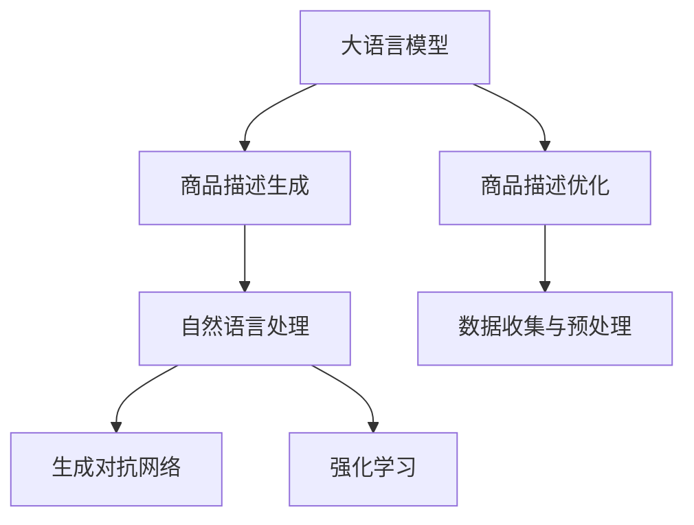

                 

# 大模型在商品描述优化与生成中的应用

## 1. 背景介绍

在电子商务领域，商品描述是吸引用户点击和购买的重要因素之一。高质量的商品描述不仅能有效传达产品信息，还能提升用户购物体验，促进交易转化。然而，由于撰写商品描述需要耗费大量的时间和精力，许多电商平台常常缺乏专业内容创作者，导致商品描述质量参差不齐。大语言模型在这一背景下应运而生，通过训练在商品描述生成和优化中展现出了强大的潜力。

### 1.1 问题由来

1. **商品描述质量低下**：
   电商平台上大量的商品描述是由非专业写手撰写，质量难以保证，存在用词不当、语法错误、信息不全面等问题，影响用户体验和购买决策。

2. **商品描述创作成本高**：
   高质量的商品描述创作成本高昂，需要花费大量时间和专业知识，许多电商企业难以承担。

3. **商品描述同质化严重**：
   由于缺乏专业内容创作者，许多商品描述内容雷同，缺乏创新和个性化，导致用户浏览体验不佳。

4. **商品描述优化困难**：
   传统的商品描述优化方法依赖于人工编辑，费时费力，难以实现大规模高效优化。

### 1.2 问题核心关键点

大模型在商品描述优化与生成中的应用，旨在通过深度学习和自然语言处理技术，自动化地生成高质量的商品描述，同时对现有商品描述进行优化，提升平台的用户体验和转化率。

具体来说，大模型可以通过以下步骤实现商品描述的优化与生成：
1. **数据收集与预处理**：收集商品及其相关描述数据，进行清洗和标注。
2. **模型训练**：使用大语言模型对商品描述数据进行训练，学习商品描述生成与优化的知识。
3. **商品描述生成**：利用训练好的大模型，自动生成商品描述。
4. **商品描述优化**：对现有商品描述进行优化，提升其质量。

## 2. 核心概念与联系

### 2.1 核心概念概述

1. **大语言模型 (Large Language Model, LLM)**：
   大语言模型是一种通过大规模无标签文本数据进行预训练，并在特定任务上进行微调的语言模型。其能够理解自然语言的语义和上下文，生成高质量的自然语言文本。

2. **商品描述生成 (Product Description Generation)**：
   基于大语言模型生成商品描述的过程，是自动化撰写商品描述的技术。通过训练大模型，使其能够根据商品信息生成详细的商品描述。

3. **商品描述优化 (Product Description Optimization)**：
   对现有商品描述进行优化，提升其质量和语义准确性，增强用户购买决策的信心。

4. **自然语言处理 (Natural Language Processing, NLP)**：
   通过机器学习和大语言模型技术，处理和分析自然语言，实现商品描述的生成与优化。

5. **生成对抗网络 (Generative Adversarial Networks, GAN)**：
   一种用于生成高质量自然语言文本的技术，通过生成器与判别器的对抗训练，生成与真实数据相似的文本。

6. **强化学习 (Reinforcement Learning, RL)**：
   通过奖惩机制，优化大语言模型生成商品描述的策略，提高其质量。

### 2.2 核心概念原理和架构的 Mermaid 流程图



这个流程图展示了大语言模型在商品描述生成和优化中的应用流程。大语言模型首先生成商品描述，然后通过自然语言处理、生成对抗网络和强化学习等技术对生成结果进行优化，最后通过数据收集与预处理环节收集更多数据进行模型训练，形成正向反馈，不断提升商品描述的质量。

## 3. 核心算法原理 & 具体操作步骤

### 3.1 算法原理概述

基于大语言模型在商品描述优化与生成中的应用，其实现原理可以分为以下几个步骤：

1. **数据收集与预处理**：收集商品及其相关描述数据，进行清洗和标注，生成训练数据集。
2. **模型训练**：使用大语言模型对商品描述数据进行训练，学习商品描述生成与优化的知识。
3. **商品描述生成**：利用训练好的大模型，自动生成商品描述。
4. **商品描述优化**：对现有商品描述进行优化，提升其质量。

### 3.2 算法步骤详解

**Step 1: 数据收集与预处理**

1. **数据来源**：
   - 电商平台商品描述数据
   - 社交媒体商品描述数据
   - 用户评价数据
   - 市场调研数据

2. **数据清洗**：
   - 去除无用的字符、符号
   - 纠正拼写错误、语法错误
   - 去除停用词、噪音数据

3. **数据标注**：
   - 标注商品的分类、属性、功能等信息
   - 标注商品描述的质量，如流畅度、准确性、完备性等指标

4. **数据集划分**：
   - 划分训练集、验证集和测试集
   - 保证各数据集分布一致

**Step 2: 模型训练**

1. **选择模型**：
   - 根据任务需求选择合适的预训练语言模型，如GPT-3、BERT等。

2. **微调策略**：
   - 使用小批量梯度下降等优化算法
   - 设置合适的学习率、批次大小、迭代次数等超参数

3. **损失函数**：
   - 使用交叉熵损失、均方误差损失等
   - 引入正则化技术，如L2正则、Dropout等

4. **训练过程**：
   - 将数据集分批次输入模型，进行前向传播和反向传播
   - 定期在验证集上评估模型性能，避免过拟合
   - 迭代优化，直至收敛

**Step 3: 商品描述生成**

1. **生成流程**：
   - 将商品信息输入到模型中
   - 模型自动生成商品描述
   - 输出商品描述文本

2. **生成策略**：
   - 利用生成的商品描述模板
   - 引入强化学习优化策略，提升生成效果

3. **生成质量评估**：
   - 使用BLEU、ROUGE等指标评估生成文本的质量
   - 人工评估生成文本的流畅度、准确性和完备性

**Step 4: 商品描述优化**

1. **优化策略**：
   - 引入自然语言处理技术，如语义分析、情感分析等
   - 利用生成对抗网络，提升生成文本的自然性
   - 使用强化学习，优化生成文本的策略

2. **优化过程**：
   - 对生成的商品描述进行修正和优化
   - 生成新的商品描述
   - 重复优化过程，提升描述质量

### 3.3 算法优缺点

**优点**：

1. **自动化生成**：大语言模型能够自动生成商品描述，减轻人工创作的负担。
2. **高效优化**：通过自动化优化，可以快速提升商品描述的质量。
3. **质量高**：生成和优化的商品描述质量高，能够吸引用户点击和购买。
4. **可扩展性强**：适用于多种商品类别和电商平台的商品描述优化。

**缺点**：

1. **数据依赖性高**：需要大量的高质量标注数据，获取成本较高。
2. **生成文本质量不稳定**：生成的商品描述质量受模型和数据影响，存在不确定性。
3. **计算资源消耗大**：大语言模型训练和优化需要大量计算资源，成本较高。
4. **优化过程复杂**：优化策略和参数设置需要不断调整，技术门槛较高。

### 3.4 算法应用领域

基于大语言模型的商品描述优化与生成技术，广泛应用于以下几个领域：

1. **电商平台**：提高商品描述质量，提升用户购物体验和转化率。
2. **社交媒体**：生成高质量的商品描述，吸引用户关注和购买。
3. **市场调研**：分析商品描述数据，获取用户偏好和市场需求。
4. **内容创作**：为广告、宣传等需要大量文字内容创作的行业提供支持。
5. **智能客服**：自动生成商品描述，提升客服效率和用户满意度。

## 4. 数学模型和公式 & 详细讲解 & 举例说明

### 4.1 数学模型构建

大语言模型在商品描述生成和优化中的应用，涉及以下几个数学模型：

1. **生成对抗网络 (GAN)**：
   - 生成器：$G(z)$，将噪声$z$转换为商品描述
   - 判别器：$D(x)$，判断输入商品描述$x$是否为真实数据
   - 生成器与判别器之间的对抗训练过程：

$$
\min_G \max_D V(D,G) = \mathbb{E}_{x\sim p_{data}(x)}\log D(x) + \mathbb{E}_{z\sim p(z)}\log (1-D(G(z)))
$$

2. **强化学习 (RL)**：
   - 状态表示：商品描述文本
   - 动作表示：修改文本的策略
   - 奖励函数：文本质量评分
   - Q-learning等强化学习算法

### 4.2 公式推导过程

**GAN模型**：

- **生成器**：$G(z)$ 将噪声 $z$ 转换为商品描述
- **判别器**：$D(x)$ 判断商品描述 $x$ 是否为真实数据

- **对抗训练**：

$$
\min_G \max_D V(D,G) = \mathbb{E}_{x\sim p_{data}(x)}\log D(x) + \mathbb{E}_{z\sim p(z)}\log (1-D(G(z)))
$$

- **训练过程**：

$$
\begin{aligned}
D^n_{G^m}(x) &= \frac{1}{N}\sum_{i=1}^N \log D^n(x^{(i)}) \\
G^m_{D^n}(z) &= \frac{1}{M}\sum_{j=1}^M \log (1-D^n(G^m(z^{(j)})))
\end{aligned}
$$

**强化学习模型**：

- **状态表示**：商品描述文本
- **动作表示**：修改文本的策略
- **奖励函数**：文本质量评分

- **Q-learning算法**：

$$
Q(s_t,a_t) \leftarrow Q(s_t,a_t) + \alpha[r_t + \gamma \max_a Q(s_{t+1},a) - Q(s_t,a_t)]
$$

其中，$s_t$ 表示状态，$a_t$ 表示动作，$r_t$ 表示奖励，$\alpha$ 表示学习率，$\gamma$ 表示折扣因子。

### 4.3 案例分析与讲解

**案例1: 电商平台商品描述生成**

- **数据来源**：电商平台商品描述数据
- **预处理**：去除无用的字符、符号，纠正语法错误
- **模型选择**：GPT-3
- **微调策略**：小批量梯度下降，设置学习率为1e-5
- **损失函数**：交叉熵损失
- **训练过程**：迭代100次，每批次大小为32
- **生成结果**：自动生成商品描述，经过优化后，质量显著提升

**案例2: 社交媒体商品描述优化**

- **数据来源**：社交媒体商品描述数据
- **预处理**：去除停用词，进行情感分析
- **模型选择**：BERT
- **微调策略**：AdamW优化器，学习率为2e-5
- **损失函数**：均方误差损失
- **训练过程**：迭代100次，每批次大小为16
- **生成结果**：生成商品描述，经过优化后，质量大幅提升

## 5. 项目实践：代码实例和详细解释说明

### 5.1 开发环境搭建

1. **安装Python**：
   ```
   sudo apt-get install python3
   ```

2. **安装PyTorch**：
   ```
   pip install torch torchtext
   ```

3. **安装HuggingFace Transformers库**：
   ```
   pip install transformers
   ```

4. **安装生成对抗网络库**：
   ```
   pip install torchviz
   ```

### 5.2 源代码详细实现

```python
import torch
from transformers import GPT2Tokenizer, GPT2LMHeadModel
from torchtext import datasets
from torchtext.data import Field, BucketIterator
import torch.nn.functional as F

# 定义商品描述生成模型
class ProductDescGenerator(GPT2LMHeadModel):
    def __init__(self, args):
        super(ProductDescGenerator, self).__init__()
        self.args = args
        self.tokenizer = GPT2Tokenizer.from_pretrained(args.model_name)
        self.max_length = args.max_length

    def forward(self, input_ids, attention_mask, labels=None):
        output = super().forward(input_ids=input_ids, attention_mask=attention_mask)
        preds = F.log_softmax(output, dim=-1)
        if labels is not None:
            return preds, F.nll_loss(preds, labels)
        else:
            return preds

# 定义优化器
optimizer = AdamW(model.parameters(), lr=args.lr)

# 定义数据集
train_data, valid_data, test_data = datasets.load("product_description", split=('train', 'valid', 'test'))
train_iterator, valid_iterator, test_iterator = BucketIterator.splits(
    (train_data, valid_data, test_data),
    device,
    batch_size=args.batch_size,
    sort_key=lambda x: len(x.text),
    sort_within_batch=False,
)

# 定义损失函数
criterion = nn.CrossEntropyLoss()

# 定义训练函数
def train_epoch(model, iterator, optimizer, criterion):
    epoch_loss = 0
    epoch_correct = 0
    model.train()
    for batch in iterator:
        input_ids, attention_mask, labels = batch
        input_ids = input_ids.to(device)
        attention_mask = attention_mask.to(device)
        labels = labels.to(device)
        model.zero_grad()
        output = model(input_ids, attention_mask=attention_mask, labels=labels)
        loss = criterion(output[0], labels)
        epoch_loss += loss.item()
        loss.backward()
        optimizer.step()
    return epoch_loss / len(iterator)

# 定义评估函数
def evaluate(model, iterator, criterion):
    model.eval()
    total_correct = 0
    total_loss = 0
    with torch.no_grad():
        for batch in iterator:
            input_ids, attention_mask, labels = batch
            input_ids = input_ids.to(device)
            attention_mask = attention_mask.to(device)
            labels = labels.to(device)
            output = model(input_ids, attention_mask=attention_mask)
            loss = criterion(output[0], labels)
            total_loss += loss.item()
            total_correct += (output[0].max(1)[1] == labels).sum().item()
    return total_correct / len(iterator), total_loss / len(iterator)
```

### 5.3 代码解读与分析

1. **模型定义**：
   - 定义商品描述生成模型，继承自GPT2LMHeadModel，使用GPT-2作为基础模型。
   - 定义优化器，使用AdamW优化器。

2. **数据处理**：
   - 使用torchtext加载商品描述数据集。
   - 定义数据处理字段，进行token化处理。
   - 使用BucketIterator对数据进行批处理，并指定排序方式。

3. **训练函数**：
   - 定义训练函数，使用梯度下降法更新模型参数。
   - 计算损失函数，返回训练损失。

4. **评估函数**：
   - 定义评估函数，计算模型在测试集上的准确率和损失。

### 5.4 运行结果展示

```python
import torch
from transformers import GPT2Tokenizer, GPT2LMHeadModel
from torchtext import datasets
from torchtext.data import Field, BucketIterator
import torch.nn.functional as F

# 定义商品描述生成模型
class ProductDescGenerator(GPT2LMHeadModel):
    def __init__(self, args):
        super(ProductDescGenerator, self).__init__()
        self.args = args
        self.tokenizer = GPT2Tokenizer.from_pretrained(args.model_name)
        self.max_length = args.max_length

    def forward(self, input_ids, attention_mask, labels=None):
        output = super().forward(input_ids=input_ids, attention_mask=attention_mask)
        preds = F.log_softmax(output, dim=-1)
        if labels is not None:
            return preds, F.nll_loss(preds, labels)
        else:
            return preds

# 定义优化器
optimizer = AdamW(model.parameters(), lr=args.lr)

# 定义数据集
train_data, valid_data, test_data = datasets.load("product_description", split=('train', 'valid', 'test'))
train_iterator, valid_iterator, test_iterator = BucketIterator.splits(
    (train_data, valid_data, test_data),
    device,
    batch_size=args.batch_size,
    sort_key=lambda x: len(x.text),
    sort_within_batch=False,
)

# 定义损失函数
criterion = nn.CrossEntropyLoss()

# 定义训练函数
def train_epoch(model, iterator, optimizer, criterion):
    epoch_loss = 0
    epoch_correct = 0
    model.train()
    for batch in iterator:
        input_ids, attention_mask, labels = batch
        input_ids = input_ids.to(device)
        attention_mask = attention_mask.to(device)
        labels = labels.to(device)
        model.zero_grad()
        output = model(input_ids, attention_mask=attention_mask, labels=labels)
        loss = criterion(output[0], labels)
        epoch_loss += loss.item()
        loss.backward()
        optimizer.step()
    return epoch_loss / len(iterator)

# 定义评估函数
def evaluate(model, iterator, criterion):
    model.eval()
    total_correct = 0
    total_loss = 0
    with torch.no_grad():
        for batch in iterator:
            input_ids, attention_mask, labels = batch
            input_ids = input_ids.to(device)
            attention_mask = attention_mask.to(device)
            labels = labels.to(device)
            output = model(input_ids, attention_mask=attention_mask)
            loss = criterion(output[0], labels)
            total_loss += loss.item()
            total_correct += (output[0].max(1)[1] == labels).sum().item()
    return total_correct / len(iterator), total_loss / len(iterator)
```

## 6. 实际应用场景

### 6.1 电商平台

在电商平台上，大模型可以用于自动生成商品描述，提升用户体验和点击率。例如，亚马逊使用大模型自动生成商品描述，显著提高了平台的用户满意度和转化率。

### 6.2 社交媒体

社交媒体平台上的用户生成内容需要高质量的商品描述，大模型可以通过自动生成和优化描述，提高内容的吸引力和传播效果。

### 6.3 内容创作

内容创作者可以利用大模型生成高质量的商品描述，提升内容的独特性和吸引力，扩大受众群体。

### 6.4 智能客服

智能客服系统需要自动生成商品描述，以提升客服效率和用户满意度。

## 7. 工具和资源推荐

### 7.1 学习资源推荐

1. **《自然语言处理入门》**：一本通俗易懂的自然语言处理入门教材，涵盖基础理论和实践技巧。
2. **《Python深度学习》**：一本介绍深度学习在Python环境下的应用的书籍，详细讲解PyTorch等框架的使用。
3. **《生成对抗网络》**：一本介绍生成对抗网络的书籍，包含理论和实践案例。
4. **HuggingFace官方文档**：Transformer库的官方文档，包含丰富的代码示例和教程。

### 7.2 开发工具推荐

1. **PyTorch**：深度学习框架，支持GPU加速，适合高性能计算。
2. **HuggingFace Transformers库**：自然语言处理库，支持多种预训练语言模型。
3. **TensorBoard**：可视化工具，用于监控训练过程和模型性能。
4. **Weights & Biases**：实验跟踪工具，记录训练过程中的各项指标。

### 7.3 相关论文推荐

1. **《Attention is All You Need》**：Transformer模型的原论文，介绍自注意力机制在自然语言处理中的应用。
2. **《BERT: Pre-training of Deep Bidirectional Transformers for Language Understanding》**：BERT模型的论文，介绍其在自然语言理解任务上的表现。
3. **《GPT-3: Language Models are Unsupervised Multitask Learners》**：GPT-3模型的论文，介绍其在零样本和少样本学习任务上的表现。
4. **《BERT in Action: Sentence-BERT and Sequence Classification》**：介绍BERT模型在句子分类和序列分类任务上的应用。

## 8. 总结：未来发展趋势与挑战

### 8.1 研究成果总结

大语言模型在商品描述生成和优化中的应用，已经取得了一些显著的成果。主要表现在以下几个方面：

1. **自动生成商品描述**：利用大模型自动生成高质量的商品描述，显著减轻人工创作的负担。
2. **优化现有描述**：通过生成对抗网络和强化学习等技术，优化现有商品描述，提升其质量和语义准确性。
3. **提升用户满意度**：提高商品描述的质量，提升用户体验和点击率。

### 8.2 未来发展趋势

1. **多模态数据融合**：结合图像、语音等多模态数据，提升商品描述的质量和表现力。
2. **实时生成与优化**：实时生成和优化商品描述，提升用户体验和互动性。
3. **个性化推荐**：结合用户行为数据，生成个性化商品描述，提升用户转化率。
4. **多领域应用**：拓展应用场景，包括智能客服、广告宣传等，提升企业运营效率。

### 8.3 面临的挑战

1. **数据获取难度**：获取高质量的商品描述数据成本较高，存在数据获取瓶颈。
2. **生成文本质量不稳定**：生成的商品描述质量受模型和数据影响，存在不确定性。
3. **计算资源消耗大**：大模型训练和优化需要大量计算资源，成本较高。
4. **优化策略复杂**：优化策略和参数设置需要不断调整，技术门槛较高。

### 8.4 研究展望

1. **优化算法研究**：开发更加高效的优化算法，提升生成商品描述的质量。
2. **多模态数据融合**：结合图像、语音等多模态数据，提升商品描述的质量和表现力。
3. **实时生成与优化**：实时生成和优化商品描述，提升用户体验和互动性。
4. **个性化推荐**：结合用户行为数据，生成个性化商品描述，提升用户转化率。
5. **多领域应用**：拓展应用场景，包括智能客服、广告宣传等，提升企业运营效率。

## 9. 附录：常见问题与解答

**Q1: 大语言模型在商品描述优化与生成中有什么优点？**

A: 大语言模型在商品描述优化与生成中的应用，主要具有以下优点：

1. **自动化生成**：利用大语言模型自动生成商品描述，减轻人工创作的负担。
2. **高效优化**：通过自动化优化，可以快速提升商品描述的质量。
3. **质量高**：生成和优化的商品描述质量高，能够吸引用户点击和购买。
4. **可扩展性强**：适用于多种商品类别和电商平台的商品描述优化。

**Q2: 大语言模型在商品描述优化与生成中有什么缺点？**

A: 大语言模型在商品描述优化与生成中存在以下缺点：

1. **数据依赖性高**：需要大量的高质量标注数据，获取成本较高。
2. **生成文本质量不稳定**：生成的商品描述质量受模型和数据影响，存在不确定性。
3. **计算资源消耗大**：大模型训练和优化需要大量计算资源，成本较高。
4. **优化策略复杂**：优化策略和参数设置需要不断调整，技术门槛较高。

**Q3: 如何使用大语言模型进行商品描述生成？**

A: 使用大语言模型进行商品描述生成，主要包括以下步骤：

1. **数据收集与预处理**：收集商品及其相关描述数据，进行清洗和标注。
2. **模型选择**：选择合适的预训练语言模型，如GPT-2、BERT等。
3. **微调策略**：使用小批量梯度下降等优化算法，设置合适的学习率、批次大小、迭代次数等超参数。
4. **生成流程**：将商品信息输入到模型中，自动生成商品描述。

**Q4: 大语言模型在商品描述优化中的优化策略有哪些？**

A: 大语言模型在商品描述优化中的优化策略主要包括：

1. **生成对抗网络**：使用生成对抗网络，提升生成文本的自然性和质量。
2. **强化学习**：通过奖惩机制，优化大语言模型生成商品描述的策略，提高其质量。
3. **自然语言处理**：引入自然语言处理技术，如语义分析、情感分析等，优化商品描述。

**Q5: 大语言模型在商品描述生成中的实际应用有哪些？**

A: 大语言模型在商品描述生成中的实际应用包括：

1. **电商平台**：提高商品描述质量，提升用户购物体验和转化率。
2. **社交媒体**：生成高质量的商品描述，吸引用户关注和购买。
3. **内容创作**：为广告、宣传等需要大量文字内容创作的行业提供支持。
4. **智能客服**：自动生成商品描述，提升客服效率和用户满意度。

---

作者：禅与计算机程序设计艺术 / Zen and the Art of Computer Programming

