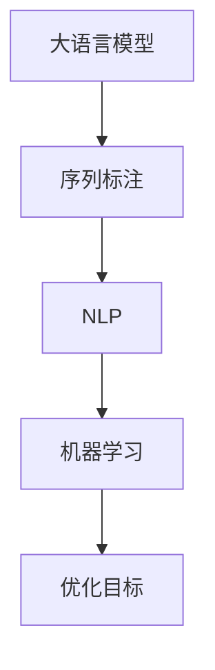

                 

# 大模型在商品标签体系优化中的应用

> 关键词：大语言模型,标签体系优化,商品推荐,序列标注,自然语言处理(NLP),机器学习

## 1. 背景介绍

### 1.1 问题由来
在电子商务领域，商品标签体系是支撑搜索、推荐、广告等关键业务的基础。良好的标签体系不仅能够提升用户体验，还能显著增强系统算法的准确性和效率。然而，随着商品种类和数量激增，标签体系的设计、维护和优化变得越来越复杂和困难。如何在大规模商品数据中自动提取有意义的标签，提高标签体系的准确性和丰富度，成为电商系统面临的重要挑战。

大语言模型（Large Language Models, LLMs）近年来在NLP领域取得了巨大突破，具备强大的语言理解和生成能力。通过对其微调，可以构建更加准确、有效的商品标签体系，满足电商系统的需求。本文将系统介绍如何利用大语言模型优化商品标签体系，并阐述其原理、步骤和应用。

### 1.2 问题核心关键点
大语言模型在商品标签体系优化中的核心挑战包括：

- **高效自动标注**：从海量商品描述中自动抽取有意义的标签，无需人工标注。
- **多领域适配**：标签体系需要覆盖多种商品类别，确保不同领域标签的一致性。
- **标签语义精确度**：确保标签能够准确反映商品的属性和特征，避免歧义和噪声。
- **实时更新维护**：标签体系需要根据用户反馈和市场变化动态更新，保持时效性。
- **可解释性**：需要解释标签生成过程和推理逻辑，增强系统的透明性和可信度。

通过大语言模型的微调，可以高效解决上述挑战，构建高性能的商品标签体系。

### 1.3 问题研究意义
构建高效的商品标签体系，对于提升电商平台的搜索、推荐、广告等核心业务能力，具有重要意义：

1. **提升搜索召回率**：准确、丰富的标签体系能够显著提升搜索结果的相关性和准确性，增强用户体验。
2. **优化推荐算法**：标签体系是推荐算法的基础，良好的标签体系有助于提升推荐精度和多样性。
3. **增强广告投放效果**：精准的标签体系能够更好地定位目标用户，提升广告投放的转化率和ROI。
4. **促进用户增长**：准确的标签体系能够更好地理解用户需求，提升购物体验，增加用户粘性和转化率。
5. **助力商家营销**：通过精准的标签体系，商家能够更有效地展示商品，提升商品曝光率和销售量。

总之，通过大语言模型优化商品标签体系，能够大幅提升电商平台的运营效率和用户满意度，推动电商业务的持续发展。

## 2. 核心概念与联系

### 2.1 核心概念概述

为更好地理解如何利用大语言模型优化商品标签体系，本节将介绍几个关键概念：

- **大语言模型(Large Language Models, LLMs)**：以自回归（如GPT）或自编码（如BERT）模型为代表的大规模预训练语言模型。通过在大规模无标签文本数据上进行预训练，学习到丰富的语言知识和常识。

- **序列标注(Sequence Labeling)**：给定一个序列（如文本、音频、时间序列等），为其每个元素打上标签（如词性标注、命名实体识别、语音识别等）。在商品标签体系优化中，序列标注可以用于抽取商品描述中的标签。

- **自然语言处理(Natural Language Processing, NLP)**：涉及计算机对人类语言进行处理和理解的技术。包括文本分类、情感分析、机器翻译等。商品标签体系优化是NLP领域的重要应用之一。

- **机器学习(Machine Learning)**：使计算机通过数据自动学习和优化，从而具备一定的智能决策能力。商品标签体系优化基于机器学习算法，自动从大量数据中抽取标签。

- **优化目标(Optimization Goal)**：商品标签体系优化的主要目标是提高标签体系的准确性和丰富度，提升用户和商家的满意度和运营效率。

这些核心概念之间的逻辑关系可以通过以下Mermaid流程图来展示：



这个流程图展示了从大语言模型到序列标注，再到NLP和机器学习的全流程，最终实现优化目标的关系：

1. 大语言模型通过预训练获得语言知识，为序列标注任务提供强大的基础。
2. 序列标注在大语言模型基础上，自动从商品描述中抽取标签。
3. NLP技术进一步优化标签体系，确保标签的语义精确度和一致性。
4. 机器学习算法用于训练优化模型，实现标签体系的实时更新和动态维护。
5. 优化目标贯穿整个流程，指导模型设计、训练和应用。

这些概念共同构成了大语言模型优化商品标签体系的理论基础，确保其在实际应用中能够高效、准确、持续地服务电商业务。

## 3. 核心算法原理 & 具体操作步骤

### 3.1 算法原理概述

基于大语言模型优化商品标签体系，本质上是一个序列标注问题，即从商品描述中自动抽取标签。其核心思想是：将大语言模型作为特征提取器，通过序列标注算法，将商品描述转化为标签序列，构建商品标签体系。

形式化地，假设商品描述为 $X$，标签体系为 $Y$，优化目标为 $T$。优化过程为：

$$
\min_{M, T} \mathcal{L}(M, X, Y, T)
$$

其中 $M$ 为序列标注模型，$T$ 为优化目标函数，$\mathcal{L}$ 为损失函数，用于衡量模型在给定 $X$ 和 $T$ 下，对 $Y$ 的预测与真实标签之间的差异。

通过梯度下降等优化算法，序列标注模型不断更新参数，最小化损失函数 $\mathcal{L}$，使得模型在 $X$ 和 $T$ 的指导下，输出更准确的 $Y$。最终得到适应电商业务的标签体系。

### 3.2 算法步骤详解

基于大语言模型优化商品标签体系一般包括以下几个关键步骤：

**Step 1: 准备预训练模型和数据集**
- 选择合适的预训练语言模型 $M_{\theta}$ 作为初始化参数，如 BERT、GPT 等。
- 准备电商商品描述数据集 $D$，划分为训练集、验证集和测试集。

**Step 2: 添加任务适配层**
- 根据任务类型，在预训练模型顶层设计合适的输出层和损失函数。
- 对于标签体系优化任务，通常在顶层添加CRF层，以优化序列标注模型。

**Step 3: 设置微调超参数**
- 选择合适的优化算法及其参数，如 AdamW、SGD 等，设置学习率、批大小、迭代轮数等。
- 设置正则化技术及强度，包括权重衰减、Dropout、Early Stopping 等。
- 确定冻结预训练参数的策略，如仅微调顶层，或全部参数都参与微调。

**Step 4: 执行序列标注**
- 将训练集数据分批次输入模型，前向传播计算损失函数。
- 反向传播计算参数梯度，根据设定的优化算法和学习率更新模型参数。
- 周期性在验证集上评估模型性能，根据性能指标决定是否触发 Early Stopping。
- 重复上述步骤直到满足预设的迭代轮数或 Early Stopping 条件。

**Step 5: 测试和部署**
- 在测试集上评估序列标注后模型 $M_{\hat{\theta}}$ 的性能，对比微调前后的精度提升。
- 使用微调后的模型对新商品描述进行标签生成，集成到电商标签体系中。
- 持续收集新的商品描述，定期重新微调模型，以适应市场变化。

以上是基于大语言模型优化商品标签体系的一般流程。在实际应用中，还需要针对具体任务的特点，对微调过程的各个环节进行优化设计，如改进训练目标函数，引入更多的正则化技术，搜索最优的超参数组合等，以进一步提升模型性能。

### 3.3 算法优缺点

基于大语言模型优化商品标签体系的方法具有以下优点：
1. 自动标注高效。相比人工标注，可以显著降低标注成本和时间成本。
2. 覆盖广。大语言模型能够处理多种语言和文本类型，适用于不同商品类别。
3. 动态更新。标签体系可以根据市场变化动态更新，保持时效性。
4. 效果显著。通过微调，可以显著提升标签体系的准确性和丰富度。

同时，该方法也存在一定的局限性：
1. 依赖于高质量数据。标签体系的质量很大程度上取决于商品描述的质量。
2. 模型复杂度。大语言模型参数量庞大，优化过程复杂，需要较强的计算资源。
3. 可解释性不足。序列标注过程缺乏可解释性，难以对其推理逻辑进行分析和调试。
4. 泛化能力有限。不同领域标签体系的一致性有待提升。

尽管存在这些局限性，但就目前而言，基于大语言模型的序列标注方法仍是电商标签体系优化的主流范式。未来相关研究的重点在于如何进一步降低数据依赖，提高模型的泛化能力和可解释性。

### 3.4 算法应用领域

基于大语言模型优化商品标签体系的方法，在电商领域得到了广泛的应用，覆盖了商品搜索、推荐、广告等多个环节，具体包括：

- **商品搜索**：通过自动提取商品描述中的标签，优化搜索算法，提升搜索召回率和相关性。
- **商品推荐**：利用商品标签，构建商品相似度矩阵，优化推荐算法，提高推荐效果和用户体验。
- **广告投放**：通过标签体系，精准定位目标用户，优化广告投放策略，提升广告点击率和转化率。
- **库存管理**：根据商品标签，优化库存分配和补货策略，降低库存成本，提高供应链效率。
- **市场分析**：利用标签数据，进行市场趋势分析和用户行为分析，提供数据驱动的商业决策支持。

除了上述这些经典应用外，大语言模型序列标注技术还被创新性地应用于更广泛的场景中，如电商平台客服、供应链管理、用户画像构建等，为电商系统的业务优化和创新带来新的思路。

## 4. 数学模型和公式 & 详细讲解

### 4.1 数学模型构建

本节将使用数学语言对基于大语言模型的商品标签体系优化过程进行更加严格的刻画。

假设商品描述为 $X$，标签体系为 $Y$，优化目标为 $T$。序列标注模型为 $M_{\theta}$，其输出为 $\hat{Y}$。目标函数为 $\mathcal{L}(M_{\theta}, X, Y, T)$，其中 $X$ 为商品描述，$Y$ 为标签序列，$T$ 为优化目标。

序列标注模型的损失函数可以定义如下：

$$
\mathcal{L}(M_{\theta}, X, Y, T) = -\frac{1}{N}\sum_{i=1}^N \log \left(\prod_{t=1}^{N} P(\hat{y}_i | X_i, \theta)\right) + \lambda \sum_{i=1}^N \mathcal{L}_{reg}(\theta)
$$

其中 $P(\hat{y}_i | X_i, \theta)$ 为模型在给定商品描述 $X_i$ 下，预测标签 $\hat{y}_i$ 的概率分布，$\lambda$ 为正则化系数，$\mathcal{L}_{reg}$ 为正则化损失函数。

目标函数优化目标为最小化损失函数：

$$
\theta^* = \mathop{\arg\min}_{\theta} \mathcal{L}(M_{\theta}, X, Y, T)
$$

在得到损失函数的梯度后，即可带入参数更新公式，完成模型的迭代优化。重复上述过程直至收敛，最终得到适应电商业务的标签体系。

### 4.2 公式推导过程

以下我们以二分类任务为例，推导序列标注的交叉熵损失函数及其梯度的计算公式。

假设模型 $M_{\theta}$ 在输入 $x$ 上的输出为 $\hat{y}=M_{\theta}(x) \in [0,1]$，表示商品描述 $x$ 属于标签 $y$ 的概率。真实标签 $y \in \{0,1\}$。则二分类交叉熵损失函数定义为：

$$
\ell(M_{\theta}(x),y) = -[y\log \hat{y} + (1-y)\log (1-\hat{y})]
$$

将其代入经验风险公式，得：

$$
\mathcal{L}(\theta) = -\frac{1}{N}\sum_{i=1}^N [y_i\log M_{\theta}(x_i)+(1-y_i)\log(1-M_{\theta}(x_i))]
$$

根据链式法则，损失函数对参数 $\theta_k$ 的梯度为：

$$
\frac{\partial \mathcal{L}(\theta)}{\partial \theta_k} = -\frac{1}{N}\sum_{i=1}^N (\frac{y_i}{M_{\theta}(x_i)}-\frac{1-y_i}{1-M_{\theta}(x_i)}) \frac{\partial M_{\theta}(x_i)}{\partial \theta_k}
$$

其中 $\frac{\partial M_{\theta}(x_i)}{\partial \theta_k}$ 可进一步递归展开，利用自动微分技术完成计算。

在得到损失函数的梯度后，即可带入参数更新公式，完成模型的迭代优化。重复上述过程直至收敛，最终得到适应电商业务的标签体系。

## 5. 项目实践：代码实例和详细解释说明

### 5.1 开发环境搭建

在进行商品标签体系优化实践前，我们需要准备好开发环境。以下是使用Python进行PyTorch开发的环境配置流程：

1. 安装Anaconda：从官网下载并安装Anaconda，用于创建独立的Python环境。

2. 创建并激活虚拟环境：
```bash
conda create -n pytorch-env python=3.8 
conda activate pytorch-env
```

3. 安装PyTorch：根据CUDA版本，从官网获取对应的安装命令。例如：
```bash
conda install pytorch torchvision torchaudio cudatoolkit=11.1 -c pytorch -c conda-forge
```

4. 安装Transformers库：
```bash
pip install transformers
```

5. 安装各类工具包：
```bash
pip install numpy pandas scikit-learn matplotlib tqdm jupyter notebook ipython
```

完成上述步骤后，即可在`pytorch-env`环境中开始商品标签体系优化实践。

### 5.2 源代码详细实现

这里我们以电商商品分类任务为例，给出使用Transformers库对BERT模型进行商品标签体系优化的PyTorch代码实现。

首先，定义商品分类任务的数据处理函数：

```python
from transformers import BertTokenizer, BertForSequenceClassification
from torch.utils.data import Dataset
import torch

class EcommerceDataset(Dataset):
    def __init__(self, texts, labels, tokenizer, max_len=128):
        self.texts = texts
        self.labels = labels
        self.tokenizer = tokenizer
        self.max_len = max_len
        
    def __len__(self):
        return len(self.texts)
    
    def __getitem__(self, item):
        text = self.texts[item]
        label = self.labels[item]
        
        encoding = self.tokenizer(text, return_tensors='pt', max_length=self.max_len, padding='max_length', truncation=True)
        input_ids = encoding['input_ids'][0]
        attention_mask = encoding['attention_mask'][0]
        
        # 将标签编码
        encoded_labels = torch.tensor(label, dtype=torch.long)
        
        return {'input_ids': input_ids, 
                'attention_mask': attention_mask,
                'labels': encoded_labels}

# 准备数据集
tokenizer = BertTokenizer.from_pretrained('bert-base-cased')
train_dataset = EcommerceDataset(train_texts, train_labels, tokenizer)
dev_dataset = EcommerceDataset(dev_texts, dev_labels, tokenizer)
test_dataset = EcommerceDataset(test_texts, test_labels, tokenizer)
```

然后，定义模型和优化器：

```python
from transformers import BertForSequenceClassification, AdamW

model = BertForSequenceClassification.from_pretrained('bert-base-cased', num_labels=num_classes)

optimizer = AdamW(model.parameters(), lr=2e-5)
```

接着，定义训练和评估函数：

```python
from torch.utils.data import DataLoader
from tqdm import tqdm
from sklearn.metrics import classification_report

device = torch.device('cuda') if torch.cuda.is_available() else torch.device('cpu')
model.to(device)

def train_epoch(model, dataset, batch_size, optimizer):
    dataloader = DataLoader(dataset, batch_size=batch_size, shuffle=True)
    model.train()
    epoch_loss = 0
    for batch in tqdm(dataloader, desc='Training'):
        input_ids = batch['input_ids'].to(device)
        attention_mask = batch['attention_mask'].to(device)
        labels = batch['labels'].to(device)
        model.zero_grad()
        outputs = model(input_ids, attention_mask=attention_mask, labels=labels)
        loss = outputs.loss
        epoch_loss += loss.item()
        loss.backward()
        optimizer.step()
    return epoch_loss / len(dataloader)

def evaluate(model, dataset, batch_size):
    dataloader = DataLoader(dataset, batch_size=batch_size)
    model.eval()
    preds, labels = [], []
    with torch.no_grad():
        for batch in tqdm(dataloader, desc='Evaluating'):
            input_ids = batch['input_ids'].to(device)
            attention_mask = batch['attention_mask'].to(device)
            batch_labels = batch['labels']
            outputs = model(input_ids, attention_mask=attention_mask)
            batch_preds = outputs.logits.argmax(dim=2).to('cpu').tolist()
            batch_labels = batch_labels.to('cpu').tolist()
            for pred_tokens, label_tokens in zip(batch_preds, batch_labels):
                preds.append(pred_tokens[:len(label_tokens)])
                labels.append(label_tokens)
                
    print(classification_report(labels, preds))
```

最后，启动训练流程并在测试集上评估：

```python
epochs = 5
batch_size = 16

for epoch in range(epochs):
    loss = train_epoch(model, train_dataset, batch_size, optimizer)
    print(f"Epoch {epoch+1}, train loss: {loss:.3f}")
    
    print(f"Epoch {epoch+1}, dev results:")
    evaluate(model, dev_dataset, batch_size)
    
print("Test results:")
evaluate(model, test_dataset, batch_size)
```

以上就是使用PyTorch对BERT进行商品分类任务的商品标签体系优化的完整代码实现。可以看到，得益于Transformers库的强大封装，我们可以用相对简洁的代码完成BERT模型的加载和微调。

### 5.3 代码解读与分析

让我们再详细解读一下关键代码的实现细节：

**EcommerceDataset类**：
- `__init__`方法：初始化商品描述、标签、分词器等关键组件。
- `__len__`方法：返回数据集的样本数量。
- `__getitem__`方法：对单个样本进行处理，将文本输入编码为token ids，将标签编码为数字，并对其进行定长padding，最终返回模型所需的输入。

**标签编码**：
- 将标签 $y$ 编码为数字形式，用于训练模型。

**训练和评估函数**：
- 使用PyTorch的DataLoader对数据集进行批次化加载，供模型训练和推理使用。
- 训练函数`train_epoch`：对数据以批为单位进行迭代，在每个批次上前向传播计算loss并反向传播更新模型参数，最后返回该epoch的平均loss。
- 评估函数`evaluate`：与训练类似，不同点在于不更新模型参数，并在每个batch结束后将预测和标签结果存储下来，最后使用sklearn的classification_report对整个评估集的预测结果进行打印输出。

**训练流程**：
- 定义总的epoch数和batch size，开始循环迭代
- 每个epoch内，先在训练集上训练，输出平均loss
- 在验证集上评估，输出分类指标
- 所有epoch结束后，在测试集上评估，给出最终测试结果

可以看到，PyTorch配合Transformers库使得BERT商品分类任务的微调代码实现变得简洁高效。开发者可以将更多精力放在数据处理、模型改进等高层逻辑上，而不必过多关注底层的实现细节。

当然，工业级的系统实现还需考虑更多因素，如模型的保存和部署、超参数的自动搜索、更灵活的任务适配层等。但核心的微调范式基本与此类似。

## 6. 实际应用场景

### 6.1 智能推荐系统

基于大语言模型优化商品标签体系的方法，可以应用于智能推荐系统，提升推荐算法的效果。传统的推荐系统主要依赖用户的历史行为数据进行物品推荐，难以把握用户的真实兴趣和需求。而利用优化后的商品标签体系，推荐系统可以更准确地理解商品的属性和特征，从而提供更加个性化和多样化的推荐内容。

具体而言，推荐系统可以通过收集用户的浏览、点击、评价等行为数据，提取商品描述中的标签，构建商品相似度矩阵。通过优化标签体系，推荐系统可以更准确地捕捉用户兴趣和商品特征，提升推荐精度和多样性。

### 6.2 个性化搜索

优化后的商品标签体系，能够显著提升搜索召回率和相关性。用户在搜索商品时，输入的关键词会被自动转换为标签，匹配商品描述中的标签，从而找到最相关的商品。这样，用户可以快速找到所需商品，提升搜索体验。

### 6.3 用户画像构建

通过商品标签体系，可以构建更加全面和精确的用户画像，了解用户的需求和偏好。在电商平台，利用优化后的标签体系，可以分析用户的购买历史和搜索行为，预测用户的潜在需求，从而提升个性化营销的效果。

### 6.4 未来应用展望

随着大语言模型和序列标注技术的不断发展，基于微调的商品标签体系优化方法将在更多领域得到应用，为电商系统的业务优化和创新带来新的思路。

在智慧物流领域，优化后的商品标签体系可以用于库存管理、配送路线规划等环节，提升物流系统的效率和精准度。

在金融领域，利用优化后的标签体系，可以构建用户风险画像，提升风控模型的准确性和实时性。

在智能家居领域，优化后的标签体系可以用于设备控制和场景推荐，提升用户体验。

此外，在教育、医疗、政务等众多领域，基于大语言模型的商品标签体系优化方法也将不断涌现，为各行各业带来变革性影响。相信随着技术的日益成熟，商品标签体系优化必将成为电商系统的重要支撑，推动电商业务的持续发展。

## 7. 工具和资源推荐

### 7.1 学习资源推荐

为了帮助开发者系统掌握大语言模型优化商品标签体系的理论基础和实践技巧，这里推荐一些优质的学习资源：

1. 《Transformers从原理到实践》系列博文：由大模型技术专家撰写，深入浅出地介绍了Transformer原理、BERT模型、序列标注技术等前沿话题。

2. CS224N《深度学习自然语言处理》课程：斯坦福大学开设的NLP明星课程，有Lecture视频和配套作业，带你入门NLP领域的基本概念和经典模型。

3. 《Natural Language Processing with Transformers》书籍：Transformers库的作者所著，全面介绍了如何使用Transformers库进行NLP任务开发，包括序列标注在内的诸多范式。

4. HuggingFace官方文档：Transformers库的官方文档，提供了海量预训练模型和完整的序列标注样例代码，是上手实践的必备资料。

5. CLUE开源项目：中文语言理解测评基准，涵盖大量不同类型的中文NLP数据集，并提供了基于序列标注的baseline模型，助力中文NLP技术发展。

通过对这些资源的学习实践，相信你一定能够快速掌握大语言模型优化商品标签体系的精髓，并用于解决实际的NLP问题。
###  7.2 开发工具推荐

高效的开发离不开优秀的工具支持。以下是几款用于商品标签体系优化开发的常用工具：

1. PyTorch：基于Python的开源深度学习框架，灵活动态的计算图，适合快速迭代研究。大部分预训练语言模型都有PyTorch版本的实现。

2. TensorFlow：由Google主导开发的开源深度学习框架，生产部署方便，适合大规模工程应用。同样有丰富的预训练语言模型资源。

3. Transformers库：HuggingFace开发的NLP工具库，集成了众多SOTA语言模型，支持PyTorch和TensorFlow，是进行序列标注任务开发的利器。

4. Weights & Biases：模型训练的实验跟踪工具，可以记录和可视化模型训练过程中的各项指标，方便对比和调优。与主流深度学习框架无缝集成。

5. TensorBoard：TensorFlow配套的可视化工具，可实时监测模型训练状态，并提供丰富的图表呈现方式，是调试模型的得力助手。

6. Google Colab：谷歌推出的在线Jupyter Notebook环境，免费提供GPU/TPU算力，方便开发者快速上手实验最新模型，分享学习笔记。

合理利用这些工具，可以显著提升商品标签体系优化任务的开发效率，加快创新迭代的步伐。

### 7.3 相关论文推荐

大语言模型和序列标注技术的发展源于学界的持续研究。以下是几篇奠基性的相关论文，推荐阅读：

1. Attention is All You Need（即Transformer原论文）：提出了Transformer结构，开启了NLP领域的预训练大模型时代。

2. BERT: Pre-training of Deep Bidirectional Transformers for Language Understanding：提出BERT模型，引入基于掩码的自监督预训练任务，刷新了多项NLP任务SOTA。

3. Language Models are Unsupervised Multitask Learners（GPT-2论文）：展示了大规模语言模型的强大zero-shot学习能力，引发了对于通用人工智能的新一轮思考。

4. Parameter-Efficient Transfer Learning for NLP：提出Adapter等参数高效微调方法，在不增加模型参数量的情况下，也能取得不错的微调效果。

5. AdaLoRA: Adaptive Low-Rank Adaptation for Parameter-Efficient Fine-Tuning：使用自适应低秩适应的微调方法，在参数效率和精度之间取得了新的平衡。

6. Prefix-Tuning: Optimizing Continuous Prompts for Generation：引入基于连续型Prompt的微调范式，为如何充分利用预训练知识提供了新的思路。

这些论文代表了大语言模型优化商品标签体系的发展脉络。通过学习这些前沿成果，可以帮助研究者把握学科前进方向，激发更多的创新灵感。

## 8. 总结：未来发展趋势与挑战

### 8.1 总结

本文对基于大语言模型优化商品标签体系的方法进行了全面系统的介绍。首先阐述了商品标签体系在电商系统中的重要性，明确了优化标签体系的目标和挑战。其次，从原理到实践，详细讲解了基于大语言模型的序列标注流程，给出了完整的代码实现。同时，本文还探讨了优化后的商品标签体系在智能推荐、个性化搜索、用户画像构建等多个电商应用场景中的应用前景。

通过本文的系统梳理，可以看到，利用大语言模型优化商品标签体系的方法，能够显著提升电商系统的性能和用户体验，推动电商业务的持续发展。未来，伴随大语言模型和序列标注技术的不断进步，基于微调的商品标签体系优化方法将在更多领域得到应用，为各行各业带来变革性影响。

### 8.2 未来发展趋势

展望未来，基于大语言模型优化商品标签体系的方法将呈现以下几个发展趋势：

1. **模型规模持续增大**：随着算力成本的下降和数据规模的扩张，预训练语言模型的参数量还将持续增长。超大模型的参数量和计算复杂度将进一步提升优化过程的效率和效果。

2. **优化算法多样性**：未来将涌现更多高效的优化算法，如自适应学习率、变分自编码器等，进一步提高商品标签体系的优化精度和鲁棒性。

3. **跨模态融合**：未来的商品标签体系将不仅包含文本标签，还包括图像、视频等多模态信息。多模态信息的融合，将显著提升商品标签体系的丰富度和准确性。

4. **实时动态更新**：基于大语言模型的商品标签体系能够实时动态更新，确保标签体系始终与市场变化保持一致，提升系统的时效性。

5. **个性化推荐**：通过优化后的商品标签体系，推荐系统能够更准确地把握用户需求，提供更加个性化和多样化的推荐内容。

6. **用户画像构建**：优化后的商品标签体系可以构建更加全面和精确的用户画像，了解用户的需求和偏好，提升个性化营销的效果。

以上趋势凸显了大语言模型优化商品标签体系技术的广阔前景。这些方向的探索发展，必将进一步提升电商系统的性能和用户体验，推动电商业务的持续发展。

### 8.3 面临的挑战

尽管基于大语言模型优化商品标签体系的方法已经取得了显著成果，但在迈向更加智能化、普适化应用的过程中，它仍面临以下挑战：

1. **数据质量依赖**：标签体系的质量很大程度上取决于商品描述的质量。如何提高数据标注的准确性和丰富度，是一个需要持续优化的挑战。

2. **计算资源消耗**：大语言模型和序列标注过程需要较强的计算资源支持，如何在保证效果的同时，降低计算成本，是未来的重要研究方向。

3. **模型鲁棒性不足**：优化后的商品标签体系需要具备较高的鲁棒性，能够应对市场变化和噪声干扰。如何提高模型的泛化能力和鲁棒性，仍然是一个待解决的难题。

4. **可解释性不足**：序列标注过程缺乏可解释性，难以对其推理逻辑进行分析和调试。如何提高模型的可解释性，使其输出更加透明和可信，是一个亟待解决的问题。

5. **标签一致性**：不同领域的商品标签体系需要保持一致性，避免出现标签冲突和歧义。如何构建通用的商品标签体系，使其在不同领域中保持一致，是一个重要的研究方向。

6. **实时更新挑战**：商品标签体系需要实时动态更新，但数据收集、标注和模型的微调过程需要一定的时间，如何在保证实时性的前提下，提升标签体系的准确性，是一个重要的优化方向。

尽管存在这些挑战，但通过学术界和产业界的共同努力，相信这些问题都将逐步得到解决，大语言模型优化商品标签体系必将在电商系统中发挥更加重要的作用。

### 8.4 研究展望

面对大语言模型优化商品标签体系所面临的挑战，未来的研究需要在以下几个方面寻求新的突破：

1. **无监督学习**：探索无监督和半监督学习技术，利用非结构化数据自动生成标签，减少对标注数据的依赖。

2. **跨模态融合**：研究多模态融合技术，结合文本、图像、视频等多种信息，构建更加全面和准确的商品标签体系。

3. **自适应学习**：开发自适应学习算法，使模型能够根据新数据自动调整标签体系，提升系统的实时性和泛化能力。

4. **模型压缩与优化**：研究模型压缩和优化技术，提高模型的计算效率和推理速度，实现轻量级部署。

5. **知识融合**：将外部知识库、规则库等专家知识与神经网络模型进行融合，增强标签体系的知识整合能力。

6. **伦理与安全**：研究商品标签体系中的伦理与安全问题，确保模型输出符合用户价值观和伦理道德。

这些研究方向将进一步推动大语言模型优化商品标签体系技术的发展，为电商系统的业务优化和创新提供新的思路和工具。相信通过不断探索和实践，大语言模型优化商品标签体系必将带来更多的创新和突破，推动电商业务的持续发展。

## 9. 附录：常见问题与解答

**Q1：大语言模型优化商品标签体系是否适用于所有商品类别？**

A: 大语言模型优化商品标签体系在大多数商品类别上都能取得不错的效果，但对于一些特殊商品类别，如手工艺品、艺术品等，标签体系的设计可能需要根据具体领域进行调整。此外，对于一些需要精细描述的商品，如化妆品、食品等，标签体系的丰富度也需考虑商品的多样性。

**Q2：优化后的商品标签体系是否适用于所有电商平台？**

A: 优化后的商品标签体系在大多数电商平台上都能提升用户体验和运营效率，但具体应用效果还需根据平台特点进行适配。不同平台的用户行为和商品结构存在差异，优化后的标签体系需要根据平台特性进行调整。

**Q3：优化后的商品标签体系是否可以提升所有电商业务？**

A: 优化后的商品标签体系可以显著提升商品搜索、推荐、广告等多个电商业务的性能。但对于一些特殊业务，如个性化营销、社交电商等，还需要结合具体业务场景进行优化。

**Q4：优化后的商品标签体系是否会导致标注成本降低？**

A: 优化后的商品标签体系可以显著降低人工标注成本，但对于一些特殊商品，如手工艺品、艺术品等，仍需人工标注以保证标签体系的准确性和丰富度。此外，标签体系的动态更新和优化过程也需要一定的数据收集和标注工作。

**Q5：优化后的商品标签体系是否容易受到市场变化的影响？**

A: 优化后的商品标签体系需要实时动态更新，以应对市场变化。但标签体系的更新周期和更新方法也需要根据具体业务特点进行调整，避免频繁的模型微调对系统稳定性造成影响。

通过本文的系统梳理，可以看到，利用大语言模型优化商品标签体系的方法，能够显著提升电商系统的性能和用户体验，推动电商业务的持续发展。未来，伴随大语言模型和序列标注技术的不断进步，基于微调的商品标签体系优化方法将在更多领域得到应用，为各行各业带来变革性影响。相信通过不断探索和实践，大语言模型优化商品标签体系必将带来更多的创新和突破，推动电商业务的持续发展。

