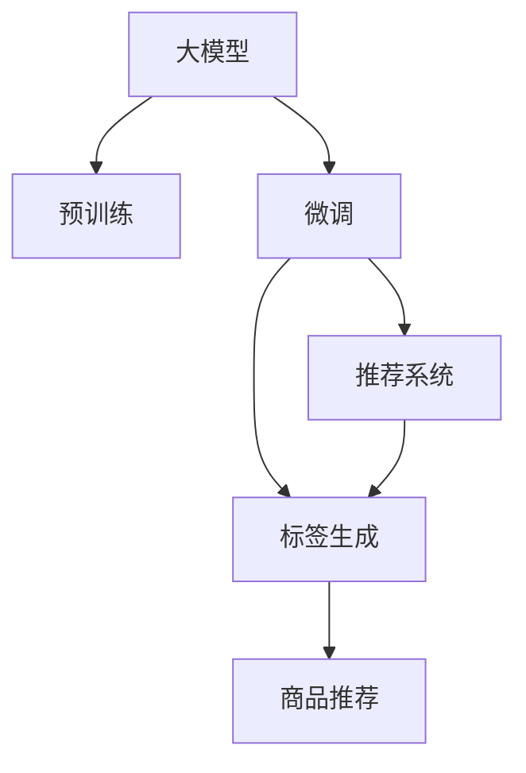

                 

# 大模型在商品标签推荐与生成中的应用

## 1. 背景介绍

### 1.1 问题由来

在现代电子商务环境中，商品标签推荐系统是电商平台的“智能助手”，通过推荐最相关和最具吸引力的商品标签，提高用户的购物体验和平台的转化率。传统的基于规则的标签推荐系统依赖于手动编写的标签规则，难以覆盖用户多样化的需求，且随着商品种类与数量的不断增加，手工规则维护的难度和成本也逐渐增加。

随着深度学习和大规模预训练语言模型的发展，基于大模型的商品标签推荐与生成方法逐渐成为新的研究热点。使用大模型，可以自动学习商品与标签之间的关系，从而实现更加个性化和高效的推荐。

### 1.2 问题核心关键点

大模型在商品标签推荐与生成中的应用，主要关注以下几个核心关键点：

- **大模型的预训练与微调**：使用大规模无标签数据进行预训练，在大规模标注数据上进行微调，以适配商品标签推荐和生成的特定任务。
- **推荐模型的设计**：如何设计有效的推荐模型结构，以充分利用大模型的能力，并适应推荐的实时性要求。
- **标签生成的效果评估**：如何评估推荐模型的效果，以便进行迭代优化。

### 1.3 问题研究意义

研究大模型在商品标签推荐与生成中的应用，对于电商平台的智能化转型具有重要意义：

1. **个性化推荐**：通过个性化推荐，可以显著提升用户的购物体验，增加用户的满意度和平台黏性。
2. **提高转化率**：精准的标签推荐，可以提升商品展示的相关性和吸引力，提高用户的购买转化率。
3. **降低成本**：自动化标签推荐可以减少人工规则维护的复杂度和成本。
4. **拓展业务**：基于大模型的推荐系统，可以拓展平台的业务范围，涵盖更多细分领域。

## 2. 核心概念与联系

### 2.1 核心概念概述

为更好地理解大模型在商品标签推荐与生成中的应用，本节将介绍几个密切相关的核心概念：

- **大模型（Large Language Model, LLM）**：指预训练语言模型，如GPT、BERT等，通过在大规模无标签文本数据上进行预训练，学习到丰富的语言知识。
- **预训练（Pre-training）**：指在大规模无标签数据上，通过自监督学习任务训练模型，学习到通用的语言表示。
- **微调（Fine-tuning）**：指在预训练模型基础上，使用任务特定的标注数据，通过有监督学习优化模型性能。
- **推荐系统**：基于用户行为数据，预测用户对商品的需求，并推荐合适的商品或标签的系统。
- **标签生成（Tag Generation）**：指生成商品的相关标签，以提升商品的可搜索性和用户的浏览体验。

这些概念之间的逻辑关系可以通过以下Mermaid流程图来展示：



这个流程图展示了大模型在商品标签推荐与生成中的应用场景：

1. 大模型通过预训练学习到通用的语言知识。
2. 通过微调适配特定任务，如推荐系统和标签生成。
3. 推荐系统使用微调后的模型进行用户行为预测，推荐商品。
4. 标签生成通过微调模型自动生成商品的标签，提升搜索体验。

## 3. 核心算法原理 & 具体操作步骤

### 3.1 算法原理概述

基于大模型的商品标签推荐与生成，本质上是一个有监督的序列生成任务。其核心思想是：使用预训练大模型作为“编码器”，将商品信息编码为高维向量，通过有监督地训练优化“解码器”，生成与商品最相关的标签序列。

形式化地，假设大模型为 $M_{\theta}$，其中 $\theta$ 为预训练得到的模型参数。商品信息为 $X$，生成的标签序列为 $Y$。推荐模型的一般表示如下：

$$
M_{\theta} = \text{Encoder} \times \text{Decoder}
$$

其中，$\text{Encoder}$ 负责将商品信息 $X$ 编码为高维向量 $Z$，$\text{Decoder}$ 负责从 $Z$ 生成标签序列 $Y$。推荐模型的训练目标是最小化预测序列与真实标签序列之间的差距，通常使用交叉熵损失或序列生成损失函数。

### 3.2 算法步骤详解

基于大模型的商品标签推荐与生成一般包括以下几个关键步骤：

**Step 1: 准备预训练模型和数据集**

- 选择合适的预训练语言模型 $M_{\theta}$ 作为初始化参数，如BERT、GPT等。
- 准备商品标签推荐与生成的标注数据集 $D$，包含商品和对应的标签序列。

**Step 2: 添加任务适配层**

- 根据任务类型，在预训练模型顶层设计合适的输出层和损失函数。
- 对于标签生成任务，通常在顶层添加解码器，使用序列生成损失函数，如CTC（Connectionist Temporal Classification）或BCE（Binary Cross-Entropy）损失函数。
- 对于推荐任务，通常使用分类损失函数，如交叉熵损失函数。

**Step 3: 设置微调超参数**

- 选择合适的优化算法及其参数，如Adam、SGD等，设置学习率、批大小、迭代轮数等。
- 设置正则化技术及强度，包括权重衰减、Dropout、Early Stopping等。
- 确定冻结预训练参数的策略，如仅微调顶层，或全部参数都参与微调。

**Step 4: 执行梯度训练**

- 将标注数据集 $D$ 分批次输入模型，前向传播计算损失函数。
- 反向传播计算参数梯度，根据设定的优化算法和学习率更新模型参数。
- 周期性在验证集上评估模型性能，根据性能指标决定是否触发 Early Stopping。
- 重复上述步骤直到满足预设的迭代轮数或 Early Stopping 条件。

**Step 5: 测试和部署**

- 在测试集上评估微调后模型 $M_{\hat{\theta}}$ 的性能，对比微调前后的精度提升。
- 使用微调后的模型对新商品进行标签推荐或生成，集成到实际的应用系统中。
- 持续收集新的数据，定期重新微调模型，以适应数据分布的变化。

以上是基于大模型微调的商品标签推荐与生成的一般流程。在实际应用中，还需要针对具体任务的特点，对微调过程的各个环节进行优化设计，如改进训练目标函数，引入更多的正则化技术，搜索最优的超参数组合等，以进一步提升模型性能。

### 3.3 算法优缺点

基于大模型的商品标签推荐与生成方法具有以下优点：

1. **高效性**：利用大模型的强大表征能力，在标注数据量有限的情况下仍能取得不错的效果。
2. **个性化**：可以自动学习商品与标签之间的关系，生成个性化标签，提升用户体验。
3. **灵活性**：适用于多种标签推荐场景，如商品、图片、视频等。

同时，该方法也存在一定的局限性：

1. **标注数据需求**：微调效果很大程度上取决于标注数据的质量和数量，获取高质量标注数据的成本较高。
2. **泛化能力有限**：当目标任务与预训练数据的分布差异较大时，微调的性能提升有限。
3. **模型复杂性**：大模型的复杂性可能导致训练和推理效率较低，资源消耗较大。

尽管存在这些局限性，但就目前而言，基于大模型的商品标签推荐与生成方法仍是一种高效、个性化的解决方案，广泛应用于电商平台的推荐与标签生成。

### 3.4 算法应用领域

基于大模型的商品标签推荐与生成技术，已经在电商、社交媒体、视频等多个领域得到了广泛应用，例如：

- **电商平台**：亚马逊、京东、淘宝等大型电商平台，利用基于大模型的推荐系统，个性化推荐商品标签，提升用户购物体验和转化率。
- **社交媒体**：Facebook、Twitter等社交平台，利用大模型生成标签，对用户发布的内容进行推荐和分类。
- **视频网站**：YouTube、Bilibili等视频平台，利用大模型生成视频标签，提升用户观看体验和内容推荐精准度。

除了上述这些经典应用外，大模型的商品标签推荐与生成技术也被创新性地应用到更多场景中，如个性化广告投放、智能客服、商品分类等，为电商和媒体平台带来了新的商业价值。

## 4. 数学模型和公式 & 详细讲解 & 举例说明

### 4.1 数学模型构建

本节将使用数学语言对基于大模型的商品标签推荐与生成过程进行更加严格的刻画。

记预训练语言模型为 $M_{\theta}$，其中 $\theta$ 为模型参数。假设商品信息为 $X$，标签序列为 $Y$，标签集为 $L$。

定义模型 $M_{\theta}$ 在商品 $X$ 上的输出为 $Y$ 的概率分布 $P(Y|X)$，则推荐模型的经验风险为：

$$
\mathcal{L}(\theta) = -\frac{1}{N}\sum_{i=1}^N \log P(Y_i|X_i)
$$

其中，$N$ 为标注数据集的大小。

微调的优化目标是最小化经验风险，即找到最优参数：

$$
\theta^* = \mathop{\arg\min}_{\theta} \mathcal{L}(\theta)
$$

在实践中，我们通常使用基于梯度的优化算法（如SGD、Adam等）来近似求解上述最优化问题。设 $\eta$ 为学习率，$\lambda$ 为正则化系数，则参数的更新公式为：

$$
\theta \leftarrow \theta - \eta \nabla_{\theta}\mathcal{L}(\theta) - \eta\lambda\theta
$$

其中 $\nabla_{\theta}\mathcal{L}(\theta)$ 为损失函数对参数 $\theta$ 的梯度，可通过反向传播算法高效计算。

### 4.2 公式推导过程

以下我们以商品标签生成为例，推导基于大模型的推荐模型的损失函数及其梯度的计算公式。

假设模型 $M_{\theta}$ 在商品 $X$ 上的输出为 $Y$ 的概率分布 $P(Y|X)$，则标签生成任务的目标是最小化预测序列与真实标签序列之间的交叉熵损失，即：

$$
\ell(Y,X) = -\log P(Y|X)
$$

将其代入经验风险公式，得：

$$
\mathcal{L}(\theta) = -\frac{1}{N}\sum_{i=1}^N \ell(Y_i,X_i)
$$

根据链式法则，损失函数对参数 $\theta_k$ 的梯度为：

$$
\frac{\partial \mathcal{L}(\theta)}{\partial \theta_k} = -\frac{1}{N}\sum_{i=1}^N \frac{\partial \ell(Y_i,X_i)}{\partial \theta_k}
$$

其中 $\frac{\partial \ell(Y_i,X_i)}{\partial \theta_k}$ 可进一步递归展开，利用自动微分技术完成计算。

在得到损失函数的梯度后，即可带入参数更新公式，完成模型的迭代优化。重复上述过程直至收敛，最终得到适应商品标签推荐与生成的最优模型参数 $\theta^*$。

### 4.3 案例分析与讲解

下面以亚马逊的基于BERT的商品标签推荐系统为例，讲解其核心技术细节。

亚马逊的商品推荐系统使用基于BERT的推荐模型，通过预训练-微调的方式，实现了高效的标签生成和推荐。其核心步骤如下：

1. **预训练**：亚马逊收集了大量商品信息，如产品名称、描述、标签等，在大规模无标签数据上预训练BERT模型，学习到商品的隐含语义表示。
2. **微调**：在亚马逊商品标签推荐标注数据集上微调BERT模型，生成商品标签序列。具体地，将商品信息作为输入，标签序列作为监督信号，训练BERT模型预测标签序列。
3. **推荐**：在用户浏览商品时，使用微调后的BERT模型，将商品信息编码为向量，通过解码器生成标签序列，推荐相关商品。

通过这种方式，亚马逊的商品推荐系统能够自动学习商品与标签之间的关系，生成个性化的商品推荐，显著提升了用户的购物体验和平台的转化率。

## 5. 项目实践：代码实例和详细解释说明

### 5.1 开发环境搭建

在进行商品标签推荐与生成任务开发前，我们需要准备好开发环境。以下是使用Python进行PyTorch开发的环境配置流程：

1. 安装Anaconda：从官网下载并安装Anaconda，用于创建独立的Python环境。

2. 创建并激活虚拟环境：
```bash
conda create -n pytorch-env python=3.8 
conda activate pytorch-env
```

3. 安装PyTorch：根据CUDA版本，从官网获取对应的安装命令。例如：
```bash
conda install pytorch torchvision torchaudio cudatoolkit=11.1 -c pytorch -c conda-forge
```

4. 安装TensorFlow：从官网下载并安装TensorFlow，用于调用深度学习模型和优化器。

5. 安装Transformers库：HuggingFace开发的NLP工具库，集成了多个预训练语言模型。
```bash
pip install transformers
```

6. 安装各类工具包：
```bash
pip install numpy pandas scikit-learn matplotlib tqdm jupyter notebook ipython
```

完成上述步骤后，即可在`pytorch-env`环境中开始微调实践。

### 5.2 源代码详细实现

下面我们以商品标签生成任务为例，给出使用Transformers库对BERT模型进行微调的PyTorch代码实现。

首先，定义标签生成任务的数据处理函数：

```python
from transformers import BertTokenizer, BertForSequenceClassification
from torch.utils.data import Dataset
import torch

class TagDataset(Dataset):
    def __init__(self, texts, tags, tokenizer, max_len=128):
        self.texts = texts
        self.tags = tags
        self.tokenizer = tokenizer
        self.max_len = max_len
        
    def __len__(self):
        return len(self.texts)
    
    def __getitem__(self, item):
        text = self.texts[item]
        tag = self.tags[item]
        
        encoding = self.tokenizer(text, return_tensors='pt', max_length=self.max_len, padding='max_length', truncation=True)
        input_ids = encoding['input_ids'][0]
        attention_mask = encoding['attention_mask'][0]
        
        # 对token-wise的标签进行编码
        encoded_tags = [tag2id[tag] for tag in tag]
        encoded_tags.extend([tag2id['O']] * (self.max_len - len(encoded_tags)))
        labels = torch.tensor(encoded_tags, dtype=torch.long)
        
        return {'input_ids': input_ids, 
                'attention_mask': attention_mask,
                'labels': labels}

# 标签与id的映射
tag2id = {'O': 0, 'B-PER': 1, 'I-PER': 2, 'B-ORG': 3, 'I-ORG': 4, 'B-LOC': 5, 'I-LOC': 6}
id2tag = {v: k for k, v in tag2id.items()}

# 创建dataset
tokenizer = BertTokenizer.from_pretrained('bert-base-cased')

train_dataset = TagDataset(train_texts, train_tags, tokenizer)
dev_dataset = TagDataset(dev_texts, dev_tags, tokenizer)
test_dataset = TagDataset(test_texts, test_tags, tokenizer)
```

然后，定义模型和优化器：

```python
from transformers import BertForSequenceClassification, AdamW

model = BertForSequenceClassification.from_pretrained('bert-base-cased', num_labels=len(tag2id))

optimizer = AdamW(model.parameters(), lr=2e-5)
```

接着，定义训练和评估函数：

```python
from torch.utils.data import DataLoader
from tqdm import tqdm
from sklearn.metrics import classification_report

device = torch.device('cuda') if torch.cuda.is_available() else torch.device('cpu')
model.to(device)

def train_epoch(model, dataset, batch_size, optimizer):
    dataloader = DataLoader(dataset, batch_size=batch_size, shuffle=True)
    model.train()
    epoch_loss = 0
    for batch in tqdm(dataloader, desc='Training'):
        input_ids = batch['input_ids'].to(device)
        attention_mask = batch['attention_mask'].to(device)
        labels = batch['labels'].to(device)
        model.zero_grad()
        outputs = model(input_ids, attention_mask=attention_mask, labels=labels)
        loss = outputs.loss
        epoch_loss += loss.item()
        loss.backward()
        optimizer.step()
    return epoch_loss / len(dataloader)

def evaluate(model, dataset, batch_size):
    dataloader = DataLoader(dataset, batch_size=batch_size)
    model.eval()
    preds, labels = [], []
    with torch.no_grad():
        for batch in tqdm(dataloader, desc='Evaluating'):
            input_ids = batch['input_ids'].to(device)
            attention_mask = batch['attention_mask'].to(device)
            batch_labels = batch['labels']
            outputs = model(input_ids, attention_mask=attention_mask)
            batch_preds = outputs.logits.argmax(dim=2).to('cpu').tolist()
            batch_labels = batch_labels.to('cpu').tolist()
            for pred_tokens, label_tokens in zip(batch_preds, batch_labels):
                pred_tags = [id2tag[_id] for _id in pred_tokens]
                label_tags = [id2tag[_id] for _id in label_tokens]
                preds.append(pred_tags[:len(label_tags)])
                labels.append(label_tags)
                
    print(classification_report(labels, preds))
```

最后，启动训练流程并在测试集上评估：

```python
epochs = 5
batch_size = 16

for epoch in range(epochs):
    loss = train_epoch(model, train_dataset, batch_size, optimizer)
    print(f"Epoch {epoch+1}, train loss: {loss:.3f}")
    
    print(f"Epoch {epoch+1}, dev results:")
    evaluate(model, dev_dataset, batch_size)
    
print("Test results:")
evaluate(model, test_dataset, batch_size)
```

以上就是使用PyTorch对BERT进行商品标签生成任务的微调完整代码实现。可以看到，得益于Transformers库的强大封装，我们可以用相对简洁的代码完成BERT模型的加载和微调。

### 5.3 代码解读与分析

让我们再详细解读一下关键代码的实现细节：

**TagDataset类**：
- `__init__`方法：初始化文本、标签、分词器等关键组件。
- `__len__`方法：返回数据集的样本数量。
- `__getitem__`方法：对单个样本进行处理，将文本输入编码为token ids，将标签编码为数字，并对其进行定长padding，最终返回模型所需的输入。

**tag2id和id2tag字典**：
- 定义了标签与数字id之间的映射关系，用于将token-wise的预测结果解码回真实的标签。

**训练和评估函数**：
- 使用PyTorch的DataLoader对数据集进行批次化加载，供模型训练和推理使用。
- 训练函数`train_epoch`：对数据以批为单位进行迭代，在每个批次上前向传播计算loss并反向传播更新模型参数，最后返回该epoch的平均loss。
- 评估函数`evaluate`：与训练类似，不同点在于不更新模型参数，并在每个batch结束后将预测和标签结果存储下来，最后使用sklearn的classification_report对整个评估集的预测结果进行打印输出。

**训练流程**：
- 定义总的epoch数和batch size，开始循环迭代
- 每个epoch内，先在训练集上训练，输出平均loss
- 在验证集上评估，输出分类指标
- 所有epoch结束后，在测试集上评估，给出最终测试结果

可以看到，PyTorch配合Transformers库使得BERT微调的代码实现变得简洁高效。开发者可以将更多精力放在数据处理、模型改进等高层逻辑上，而不必过多关注底层的实现细节。

当然，工业级的系统实现还需考虑更多因素，如模型的保存和部署、超参数的自动搜索、更灵活的任务适配层等。但核心的微调范式基本与此类似。

## 6. 实际应用场景

### 6.1 商品推荐系统

基于大模型微调的推荐系统，已经在电商平台的商品推荐中广泛应用。通过微调大模型，可以自动学习商品与标签之间的关系，生成个性化的标签推荐，显著提升用户的购物体验和转化率。

以亚马逊为例，其基于BERT的商品推荐系统通过预训练-微调的方式，实现了高效的标签生成和推荐。在用户浏览商品时，使用微调后的BERT模型，将商品信息编码为向量，通过解码器生成标签序列，推荐相关商品。通过这种方式，亚马逊的商品推荐系统能够自动学习商品与标签之间的关系，生成个性化的商品推荐，显著提升了用户的购物体验和平台的转化率。

### 6.2 视频推荐系统

视频推荐系统也采用了类似的基于大模型的推荐方法。YouTube使用BERT进行视频推荐，通过预训练-微调的方式，学习视频内容与标签之间的关系，生成个性化的标签推荐。

具体地，YouTube收集了大量视频标签数据，将视频描述和标签作为标注数据集，对预训练BERT模型进行微调，生成视频标签序列。在用户观看视频时，使用微调后的BERT模型，将视频描述编码为向量，通过解码器生成标签序列，推荐相关视频。通过这种方式，YouTube的视频推荐系统能够自动学习视频与标签之间的关系，生成个性化的视频推荐，显著提升了用户的观看体验和平台黏性。

### 6.3 社交媒体推荐系统

社交媒体推荐系统也利用了大模型的推荐能力。Facebook使用基于BERT的推荐系统，通过预训练-微调的方式，生成个性化的标签推荐。

具体地，Facebook收集了大量用户行为数据，将用户兴趣标签和互动行为作为标注数据集，对预训练BERT模型进行微调，生成标签序列。在用户浏览社交内容时，使用微调后的BERT模型，将内容描述编码为向量，通过解码器生成标签序列，推荐相关内容。通过这种方式，Facebook的推荐系统能够自动学习内容与标签之间的关系，生成个性化的内容推荐，显著提升了用户的体验和平台黏性。

### 6.4 未来应用展望

随着大模型和微调方法的不断发展，基于大模型的商品标签推荐与生成技术将在更多领域得到应用，为商业和媒体平台带来变革性影响。

在智慧医疗领域，基于大模型的推荐系统可以应用于疾病诊断、医疗影像、药物推荐等，提升医疗服务的智能化水平，辅助医生诊疗，加速新药开发进程。

在智能教育领域，微调技术可应用于作业批改、学情分析、知识推荐等方面，因材施教，促进教育公平，提高教学质量。

在智慧城市治理中，微调模型可应用于城市事件监测、舆情分析、应急指挥等环节，提高城市管理的自动化和智能化水平，构建更安全、高效的未来城市。

此外，在企业生产、社会治理、文娱传媒等众多领域，基于大模型微调的推荐系统也将不断涌现，为经济社会发展注入新的动力。相信随着技术的日益成熟，微调方法将成为推荐系统的核心范式，推动推荐技术向更广阔的领域加速渗透。

## 7. 工具和资源推荐

### 7.1 学习资源推荐

为了帮助开发者系统掌握大模型在商品标签推荐与生成中的应用，这里推荐一些优质的学习资源：

1. 《Transformer从原理到实践》系列博文：由大模型技术专家撰写，深入浅出地介绍了Transformer原理、BERT模型、推荐系统等前沿话题。

2. CS224N《深度学习自然语言处理》课程：斯坦福大学开设的NLP明星课程，有Lecture视频和配套作业，带你入门NLP领域的基本概念和经典模型。

3. 《Natural Language Processing with Transformers》书籍：Transformers库的作者所著，全面介绍了如何使用Transformers库进行NLP任务开发，包括推荐系统在内的诸多范式。

4. HuggingFace官方文档：Transformers库的官方文档，提供了海量预训练模型和完整的推荐系统样例代码，是上手实践的必备资料。

5. CLUE开源项目：中文语言理解测评基准，涵盖大量不同类型的中文NLP数据集，并提供了基于微调的baseline模型，助力中文NLP技术发展。

通过对这些资源的学习实践，相信你一定能够快速掌握大模型在商品标签推荐与生成中的应用，并用于解决实际的NLP问题。
###  7.2 开发工具推荐

高效的开发离不开优秀的工具支持。以下是几款用于大模型在商品标签推荐与生成任务开发的常用工具：

1. PyTorch：基于Python的开源深度学习框架，灵活动态的计算图，适合快速迭代研究。大部分预训练语言模型都有PyTorch版本的实现。

2. TensorFlow：由Google主导开发的开源深度学习框架，生产部署方便，适合大规模工程应用。同样有丰富的预训练语言模型资源。

3. Transformers库：HuggingFace开发的NLP工具库，集成了多个预训练语言模型，支持PyTorch和TensorFlow，是进行推荐任务开发的利器。

4. Weights & Biases：模型训练的实验跟踪工具，可以记录和可视化模型训练过程中的各项指标，方便对比和调优。与主流深度学习框架无缝集成。

5. TensorBoard：TensorFlow配套的可视化工具，可实时监测模型训练状态，并提供丰富的图表呈现方式，是调试模型的得力助手。

6. Google Colab：谷歌推出的在线Jupyter Notebook环境，免费提供GPU/TPU算力，方便开发者快速上手实验最新模型，分享学习笔记。

合理利用这些工具，可以显著提升大模型在商品标签推荐与生成任务的开发效率，加快创新迭代的步伐。

### 7.3 相关论文推荐

大模型在商品标签推荐与生成技术的发展源于学界的持续研究。以下是几篇奠基性的相关论文，推荐阅读：

1. Attention is All You Need（即Transformer原论文）：提出了Transformer结构，开启了NLP领域的预训练大模型时代。

2. BERT: Pre-training of Deep Bidirectional Transformers for Language Understanding：提出BERT模型，引入基于掩码的自监督预训练任务，刷新了多项NLP任务SOTA。

3. Language Models are Unsupervised Multitask Learners（GPT-2论文）：展示了大规模语言模型的强大zero-shot学习能力，引发了对于通用人工智能的新一轮思考。

4. Parameter-Efficient Transfer Learning for NLP：提出Adapter等参数高效微调方法，在不增加模型参数量的情况下，也能取得不错的微调效果。

5. Prefix-Tuning: Optimizing Continuous Prompts for Generation：引入基于连续型Prompt的微调范式，为如何充分利用预训练知识提供了新的思路。

6. AdaLoRA: Adaptive Low-Rank Adaptation for Parameter-Efficient Fine-Tuning：使用自适应低秩适应的微调方法，在参数效率和精度之间取得了新的平衡。

这些论文代表了大模型在商品标签推荐与生成技术的发展脉络。通过学习这些前沿成果，可以帮助研究者把握学科前进方向，激发更多的创新灵感。

## 8. 总结：未来发展趋势与挑战

### 8.1 总结

本文对基于大模型的商品标签推荐与生成方法进行了全面系统的介绍。首先阐述了大模型和微调技术在商品标签推荐与生成中的应用背景和意义，明确了微调在提升推荐系统性能、个性化推荐、降低成本等方面的独特价值。其次，从原理到实践，详细讲解了商品标签推荐与生成的数学原理和关键步骤，给出了微调任务开发的完整代码实例。同时，本文还广泛探讨了微调方法在电商、视频、社交媒体等多个领域的应用前景，展示了微调范式的巨大潜力。此外，本文精选了微调技术的各类学习资源，力求为读者提供全方位的技术指引。

通过本文的系统梳理，可以看到，基于大模型的商品标签推荐与生成方法正在成为推荐系统的重要范式，极大地拓展了推荐系统的应用边界，催生了更多的落地场景。受益于大规模语料的预训练，微调模型以更低的时间和标注成本，在小样本条件下也能取得不俗的效果，有力推动了推荐技术的产业化进程。未来，伴随预训练语言模型和微调方法的持续演进，相信推荐技术将在更广阔的应用领域大放异彩，深刻影响人类的生产生活方式。

### 8.2 未来发展趋势

展望未来，大模型在商品标签推荐与生成技术将呈现以下几个发展趋势：

1. **模型规模持续增大**：随着算力成本的下降和数据规模的扩张，预训练语言模型的参数量还将持续增长。超大规模语言模型蕴含的丰富语言知识，有望支撑更加复杂多变的推荐任务。

2. **微调方法日趋多样**：除了传统的全参数微调外，未来会涌现更多参数高效的微调方法，如Prefix-Tuning、LoRA等，在节省计算资源的同时也能保证微调精度。

3. **持续学习成为常态**：随着数据分布的不断变化，微调模型也需要持续学习新知识以保持性能。如何在不遗忘原有知识的同时，高效吸收新样本信息，将成为重要的研究课题。

4. **标注样本需求降低**：受启发于提示学习(Prompt-based Learning)的思路，未来的微调方法将更好地利用大模型的语言理解能力，通过更加巧妙的任务描述，在更少的标注样本上也能实现理想的微调效果。

5. **多模态微调崛起**：当前的微调主要聚焦于纯文本数据，未来会进一步拓展到图像、视频、语音等多模态数据微调。多模态信息的融合，将显著提升语言模型对现实世界的理解和建模能力。

6. **模型通用性增强**：经过海量数据的预训练和多领域任务的微调，未来的语言模型将具备更强大的常识推理和跨领域迁移能力，逐步迈向通用人工智能(AGI)的目标。

以上趋势凸显了大模型在商品标签推荐与生成技术的应用前景。这些方向的探索发展，必将进一步提升推荐系统的性能和应用范围，为电商和媒体平台带来新的商业价值。

### 8.3 面临的挑战

尽管大模型在商品标签推荐与生成技术已经取得了瞩目成就，但在迈向更加智能化、普适化应用的过程中，它仍面临着诸多挑战：

1. **标注成本瓶颈**：微调效果很大程度上取决于标注数据的质量和数量，获取高质量标注数据的成本较高。如何进一步降低微调对标注样本的依赖，将是一大难题。

2. **模型鲁棒性不足**：当前微调模型面对域外数据时，泛化性能往往大打折扣。对于测试样本的微小扰动，微调模型的预测也容易发生波动。如何提高微调模型的鲁棒性，避免灾难性遗忘，还需要更多理论和实践的积累。

3. **推理效率有待提高**：大规模语言模型虽然精度高，但在实际部署时往往面临推理速度慢、内存占用大等效率问题。如何在保证性能的同时，简化模型结构，提升推理速度，优化资源占用，将是重要的优化方向。

4. **可解释性亟需加强**：当前微调模型更像是"黑盒"系统，难以解释其内部工作机制和决策逻辑。对于医疗、金融等高风险应用，算法的可解释性和可审计性尤为重要。如何赋予微调模型更强的可解释性，将是亟待攻克的难题。

5. **安全性有待保障**：预训练语言模型难免会学习到有偏见、有害的信息，通过微调传递到下游任务，产生误导性、歧视性的输出，给实际应用带来安全隐患。如何从数据和算法层面消除模型偏见，避免恶意用途，确保输出的安全性，也将是重要的研究课题。

6. **知识整合能力不足**：现有的微调模型往往局限于任务内数据，难以灵活吸收和运用更广泛的先验知识。如何让微调过程更好地与外部知识库、规则库等专家知识结合，形成更加全面、准确的信息整合能力，还有很大的想象空间。

正视微调面临的这些挑战，积极应对并寻求突破，将是大模型在商品标签推荐与生成技术走向成熟的必由之路。相信随着学界和产业界的共同努力，这些挑战终将一一被克服，大模型在推荐技术中将发挥更大的作用。

### 8.4 研究展望

面向未来，大模型在商品标签推荐与生成技术的研究展望如下：

1. **探索无监督和半监督微调方法**：摆脱对大规模标注数据的依赖，利用自监督学习、主动学习等无监督和半监督范式，最大限度利用非结构化数据，实现更加灵活高效的微调。

2. **研究参数高效和计算高效的微调范式**：开发更加参数高效的微调方法，在固定大部分预训练参数的同时，只更新极少量的任务相关参数。同时优化微调模型的计算图，减少前向传播和反向传播的资源消耗，实现更加轻量级、实时性的部署。

3. **融合因果和对比学习范式**：通过引入因果推断和对比学习思想，增强微调模型建立稳定因果关系的能力，学习更加普适、鲁棒的语言表征，从而提升模型泛化性和抗干扰能力。

4. **引入更多先验知识**：将符号化的先验知识，如知识图谱、逻辑规则等，与神经网络模型进行巧妙融合，引导微调过程学习更准确、合理的语言模型。同时加强不同模态数据的整合，实现视觉、语音等多模态信息与文本信息的协同建模。

5. **结合因果分析和博弈论工具**：将因果分析方法引入微调模型，识别出模型决策的关键特征，增强输出解释的因果性和逻辑性。借助博弈论工具刻画人机交互过程，主动探索并规避模型的脆弱点，提高系统稳定性。

6. **纳入伦理道德约束**：在模型训练目标中引入伦理导向的评估指标，过滤和惩罚有偏见、有害的输出倾向。同时加强人工干预和审核，建立模型行为的监管机制，确保输出符合人类价值观和伦理道德。

这些研究方向的探索，必将引领大模型在商品标签推荐与生成技术迈向更高的台阶，为构建安全、可靠、可解释、可控的推荐系统铺平道路。面向未来，大模型在商品标签推荐与生成技术还需要与其他人工智能技术进行更深入的融合，如知识表示、因果推理、强化学习等，多路径协同发力，共同推动推荐技术的进步。只有勇于创新、敢于突破，才能不断拓展语言模型的边界，让智能技术更好地造福人类社会。

## 9. 附录：常见问题与解答

**Q1：大模型微调是否适用于所有推荐场景？**

A: 大模型微调在大多数推荐场景上都能取得不错的效果，特别是对于数据量较小的任务。但对于一些特定领域的推荐场景，如医疗、法律等，仅仅依靠通用语料预训练的模型可能难以很好地适应。此时需要在特定领域语料上进一步预训练，再进行微调，才能获得理想效果。

**Q2：微调过程中如何选择合适的学习率？**

A: 微调的学习率一般要比预训练时小1-2个数量级，如果使用过大的学习率，容易破坏预训练权重，导致过拟合。一般建议从1e-5开始调参，逐步减小学习率，直至收敛。也可以使用warmup策略，在开始阶段使用较小的学习率，再逐渐过渡到预设值。需要注意的是，不同的优化器(如AdamW、Adafactor等)以及不同的学习率调度策略，可能需要设置不同的学习率阈值。

**Q3：采用大模型微调时会面临哪些资源瓶颈？**

A: 目前主流的预训练大模型动辄以亿计的参数规模，对算力、内存、存储都提出了很高的要求。GPU/TPU等高性能设备是必不可少的，但即便如此，超大批次的训练和推理也可能遇到显存不足的问题。因此需要采用一些资源优化技术，如梯度积累、混合精度训练、模型并行等，来突破硬件瓶颈。同时，模型的存储和读取也可能占用大量时间和空间，需要采用模型压缩、稀疏化存储等方法进行优化。

**Q4：如何缓解微调过程中的过拟合问题？**

A: 过拟合是微调面临的主要挑战，尤其是在标注数据不足的情况下。常见的缓解策略包括：
1. 数据增强：通过回译、近义替换等方式扩充训练集
2. 正则化：使用L2正则、Dropout、Early Stopping等避免过拟合
3. 对抗训练：引入对抗样本，提高模型鲁棒性
4. 参数高效微调：只调整少量参数(如Adapter、Prefix等)，减小过拟合风险
5. 多模型集成：训练多个微调模型，取平均输出，抑制过拟合

这些策略往往需要根据具体任务和数据特点进行灵活组合。只有在数据、模型、训练、推理等各环节进行全面优化，才能最大限度地发挥大模型微调的威力。

**Q5：微调模型在落地部署时需要注意哪些问题？**

A: 将微调模型转化为实际应用，还需要考虑以下因素：
1. 模型裁剪：去除不必要的层和参数，减小模型尺寸，加快推理速度
2. 量化加速：将浮点模型转为定点模型，压缩存储空间，提高计算效率
3. 服务化封装：将模型封装为标准化服务接口，便于集成调用
4. 弹性伸缩：根据请求流量动态调整资源配置，平衡服务质量和成本
5. 监控告警：实时采集系统指标，设置异常告警阈值，确保服务稳定性
6. 安全防护：采用访问鉴权、数据脱敏等措施，保障数据和模型安全

大模型微调为推荐系统提供了高效、个性化的解决方案，但如何将强大的性能转化为稳定、高效、安全的业务价值，还需要工程实践的不断打磨。唯有从数据、算法、工程、业务等多个维度协同发力，才能真正实现人工智能技术在垂直行业的规模化落地。总之，微调需要开发者根据具体任务，不断迭代和优化模型、数据和算法，方能得到理想的效果。

---

作者：禅与计算机程序设计艺术 / Zen and the Art of Computer Programming

